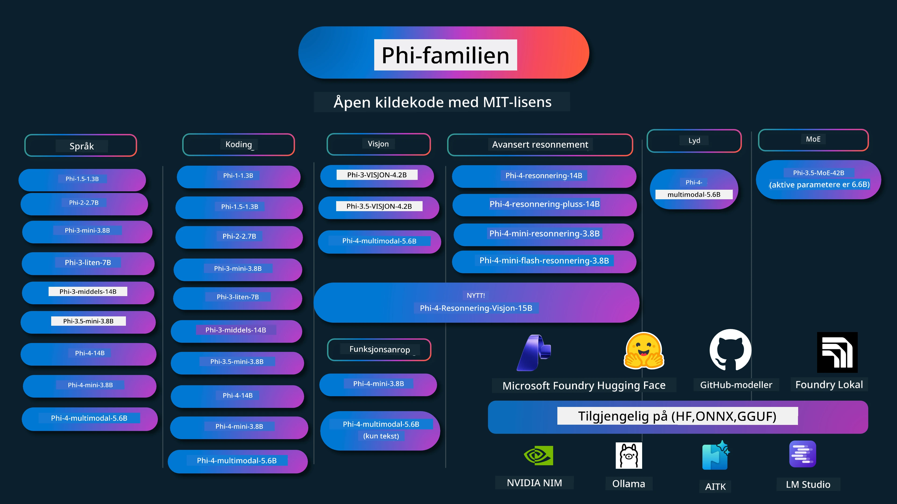

# Phi Cookbook: Praktiske eksempler med Microsofts Phi-modeller

[](https://codespaces.new/microsoft/phicookbook)
[](https://vscode.dev/redirect?url=vscode://ms-vscode-remote.remote-containers/cloneInVolume?url=https://github.com/microsoft/phicookbook)

[](https://GitHub.com/microsoft/phicookbook/graphs/contributors/?WT.mc_id=aiml-137032-kinfeylo)
[](https://GitHub.com/microsoft/phicookbook/issues/?WT.mc_id=aiml-137032-kinfeylo)
[](https://GitHub.com/microsoft/phicookbook/pulls/?WT.mc_id=aiml-137032-kinfeylo)
[](http://makeapullrequest.com?WT.mc_id=aiml-137032-kinfeylo)

[](https://GitHub.com/microsoft/phicookbook/watchers/?WT.mc_id=aiml-137032-kinfeylo)
[](https://GitHub.com/microsoft/phicookbook/network/?WT.mc_id=aiml-137032-kinfeylo)
[](https://GitHub.com/microsoft/phicookbook/stargazers/?WT.mc_id=aiml-137032-kinfeylo)

[](https://discord.com/invite/ByRwuEEgH4)

Phi er en serie med åpne kildekode AI-modeller utviklet av Microsoft.

Phi er for øyeblikket den mest kraftfulle og kostnadseffektive småspråklige modellen (SLM), med svært gode resultater innen flerspråklighet, resonnement, tekst/chat-generering, koding, bilder, lyd og andre scenarier.

Du kan distribuere Phi til skyen eller til enheter på kanten, og du kan enkelt bygge generative AI-applikasjoner med begrenset datakraft.

Følg disse trinnene for å komme i gang med å bruke disse ressursene:
1. **Gaffel depotet**: Klikk [](https://GitHub.com/microsoft/phicookbook/network/?WT.mc_id=aiml-137032-kinfeylo)
2. **Klon depotet**: `git clone https://github.com/microsoft/PhiCookBook.git`
3. [**Bli med i Microsoft AI Discord-fellesskapet og møt eksperter og medutviklere**](https://discord.com/invite/ByRwuEEgH4?WT.mc_id=aiml-137032-kinfeylo)



### 🌐 Flerspråklig støtte

#### Støttet via GitHub Action (Automatisert og alltid oppdatert)

<!-- CO-OP TRANSLATOR LANGUAGES TABLE START -->
[Arabic](../ar/README.md) | [Bengali](../bn/README.md) | [Bulgarian](../bg/README.md) | [Burmese (Myanmar)](../my/README.md) | [Chinese (Simplified)](../zh-CN/README.md) | [Chinese (Traditional, Hong Kong)](../zh-HK/README.md) | [Chinese (Traditional, Macau)](../zh-MO/README.md) | [Chinese (Traditional, Taiwan)](../zh-TW/README.md) | [Croatian](../hr/README.md) | [Czech](../cs/README.md) | [Danish](../da/README.md) | [Dutch](../nl/README.md) | [Estonian](../et/README.md) | [Finnish](../fi/README.md) | [French](../fr/README.md) | [German](../de/README.md) | [Greek](../el/README.md) | [Hebrew](../he/README.md) | [Hindi](../hi/README.md) | [Hungarian](../hu/README.md) | [Indonesian](../id/README.md) | [Italian](../it/README.md) | [Japanese](../ja/README.md) | [Kannada](../kn/README.md) | [Khmer](../km/README.md) | [Korean](../ko/README.md) | [Lithuanian](../lt/README.md) | [Malay](../ms/README.md) | [Malayalam](../ml/README.md) | [Marathi](../mr/README.md) | [Nepali](../ne/README.md) | [Nigerian Pidgin](../pcm/README.md) | [Norwegian](./README.md) | [Persian (Farsi)](../fa/README.md) | [Polish](../pl/README.md) | [Portuguese (Brazil)](../pt-BR/README.md) | [Portuguese (Portugal)](../pt-PT/README.md) | [Punjabi (Gurmukhi)](../pa/README.md) | [Romanian](../ro/README.md) | [Russian](../ru/README.md) | [Serbian (Cyrillic)](../sr/README.md) | [Slovak](../sk/README.md) | [Slovenian](../sl/README.md) | [Spanish](../es/README.md) | [Swahili](../sw/README.md) | [Swedish](../sv/README.md) | [Tagalog (Filipino)](../tl/README.md) | [Tamil](../ta/README.md) | [Telugu](../te/README.md) | [Thai](../th/README.md) | [Turkish](../tr/README.md) | [Ukrainian](../uk/README.md) | [Urdu](../ur/README.md) | [Vietnamese](../vi/README.md)

> **Foretrekker du å klone lokalt?**
>
> Dette depotet inkluderer oversettelser på 50+ språk, noe som øker nedlastingsstørrelsen betydelig. For å klone uten oversettelser, bruk sparse checkout:
>
> **Bash / macOS / Linux:**
> ```bash
> git clone --filter=blob:none --sparse https://github.com/microsoft/PhiCookBook.git
> cd PhiCookBook
> git sparse-checkout set --no-cone '/*' '!translations' '!translated_images'
> ```
>
> **CMD (Windows):**
> ```cmd
> git clone --filter=blob:none --sparse https://github.com/microsoft/PhiCookBook.git
> cd PhiCookBook
> git sparse-checkout set --no-cone "/*" "!translations" "!translated_images"
> ```
>
> Dette gir deg alt du trenger for å fullføre kurset med en mye raskere nedlasting.
<!-- CO-OP TRANSLATOR LANGUAGES TABLE END -->

## Innholdsfortegnelse
- Introduksjon - [Velkommen til Phi-familien](./md/01.Introduction/01/01.PhiFamily.md) - [Slik setter du opp miljøet ditt](./md/01.Introduction/01/01.EnvironmentSetup.md) - [Forstå viktige teknologier](./md/01.Introduction/01/01.Understandingtech.md) - [AI-sikkerhet for Phi-modeller](./md/01.Introduction/01/01.AISafety.md) - [Phi maskinvarestøtte](./md/01.Introduction/01/01.Hardwaresupport.md) - [Phi-modeller og tilgjengelighet på tvers av plattformer](./md/01.Introduction/01/01.Edgeandcloud.md) - [Bruke Guidance-ai og Phi](./md/01.Introduction/01/01.Guidance.md) - [GitHub Marketplace-modeller](https://github.com/marketplace/models) - [Azure AI model katalog](https://ai.azure.com) - Inferens Phi i forskjellige miljøer - [Hugging Face](./md/01.Introduction/02/01.HF.md) - [GitHub-modeller](./md/01.Introduction/02/02.GitHubModel.md) - [Microsoft Foundry modellkatalog](./md/01.Introduction/02/03.AzureAIFoundry.md) - [Ollama](./md/01.Introduction/02/04.Ollama.md) - [AI Toolkit VSCode (AITK)](./md/01.Introduction/02/05.AITK.md) - [NVIDIA NIM](./md/01.Introduction/02/06.NVIDIA.md) - [Foundry Local](./md/01.Introduction/02/07.FoundryLocal.md) - Inferens Phi-familien - [Inferens Phi i iOS](./md/01.Introduction/03/iOS_Inference.md) - [Inferens Phi i Android](./md/01.Introduction/03/Android_Inference.md) - [Inferens Phi i Jetson](./md/01.Introduction/03/Jetson_Inference.md) - [Inferens Phi på AI-PC](./md/01.Introduction/03/AIPC_Inference.md) - [Inferens Phi med Apple MLX-rammeverk](./md/01.Introduction/03/MLX_Inference.md) - [Inferens Phi på lokal server](./md/01.Introduction/03/Local_Server_Inference.md) - [Inferens Phi på ekstern server ved bruk av AI Toolkit](./md/01.Introduction/03/Remote_Interence.md) - [Inferens Phi med Rust](./md/01.Introduction/03/Rust_Inference.md) - [Inferens Phi – Visjon lokalt](./md/01.Introduction/03/Vision_Inference.md) - [Inferens Phi med Kaito AKS, Azure Containers (offisiell støtte)](./md/01.Introduction/03/Kaito_Inference.md) - [Kvantisering av Phi-familien](./md/01.Introduction/04/QuantifyingPhi.md) - [Kvantisering av Phi-3.5 / 4 med llama.cpp](./md/01.Introduction/04/UsingLlamacppQuantifyingPhi.md) - [Kvantisering av Phi-3.5 / 4 med Generative AI-utvidelser for onnxruntime](./md/01.Introduction/04/UsingORTGenAIQuantifyingPhi.md) - [Kvantisering av Phi-3.5 / 4 med Intel OpenVINO](./md/01.Introduction/04/UsingIntelOpenVINOQuantifyingPhi.md) - [Kvantisering av Phi-3.5 / 4 med Apple MLX-rammeverk](./md/01.Introduction/04/UsingAppleMLXQuantifyingPhi.md) - Evaluering av Phi - [Ansvarlig AI](./md/01.Introduction/05/ResponsibleAI.md) - [Microsoft Foundry for evaluering](./md/01.Introduction/05/AIFoundry.md) - [Bruke Promptflow for evaluering](./md/01.Introduction/05/Promptflow.md) - RAG med Azure AI Search - [Hvordan bruke Phi-4-mini og Phi-4-multimodal (RAG) med Azure AI Search](https://github.com/microsoft/PhiCookBook/blob/main/code/06.E2E/E2E_Phi-4-RAG-Azure-AI-Search.ipynb) - Eksempler på Phi-applikasjonsutvikling - Tekst- og chatteapplikasjoner - Phi-4 eksempler - [📓] [Chat med Phi-4-mini ONNX-modell](./md/02.Application/01.TextAndChat/Phi4/ChatWithPhi4ONNX/README.md) - [Chat med Phi-4 lokal ONNX-modell .NET](../../md/04.HOL/dotnet/src/LabsPhi4-Chat-01OnnxRuntime) - [Chat .NET konsollapp med Phi-4 ONNX ved bruk av Semantic Kernel](../../md/04.HOL/dotnet/src/LabsPhi4-Chat-02SK) - Phi-3 / 3.5 eksempler - [Lokal chatbot i nettleser ved bruk av Phi3, ONNX Runtime Web og WebGPU](https://github.com/microsoft/onnxruntime-inference-examples/tree/main/js/chat) - [OpenVINO Chat](./md/02.Application/01.TextAndChat/Phi3/E2E_OpenVino_Chat.md) - [Multi Model - Interaktiv Phi-3-mini og OpenAI Whisper](./md/02.Application/01.TextAndChat/Phi3/E2E_Phi-3-mini_with_whisper.md) - [MLFlow - Lage en wrapper og bruke Phi-3 med MLFlow](./md//02.Application/01.TextAndChat/Phi3/E2E_Phi-3-MLflow.md) - [Modelloptimalisering - Hvordan optimalisere Phi-3-minimodell for ONNX Runtime Web med Olive](https://github.com/microsoft/Olive/tree/main/examples/phi3) - [WinUI3-app med Phi-3 mini-4k-instruct-onnx](https://github.com/microsoft/Phi3-Chat-WinUI3-Sample/) - [WinUI3 Multi Model AI-drevet notatapp-eksempel](https://github.com/microsoft/ai-powered-notes-winui3-sample) - [Finjustere og integrere egendefinerte Phi-3-modeller med Prompt flow](./md/02.Application/01.TextAndChat/Phi3/E2E_Phi-3-FineTuning_PromptFlow_Integration.md) - [Finjustere og integrere egendefinerte Phi-3-modeller med Prompt flow i Microsoft Foundry](./md/02.Application/01.TextAndChat/Phi3/E2E_Phi-3-FineTuning_PromptFlow_Integration_AIFoundry.md) - [Evaluere den finjusterte Phi-3 / Phi-3.5-modellen i Microsoft Foundry med fokus på Microsofts prinsipper for ansvarlig AI](./md/02.Application/01.TextAndChat/Phi3/E2E_Phi-3-Evaluation_AIFoundry.md) - [📓] [Phi-3.5-mini-instruct språkprediksjonseksempel (kinesisk/engelsk)](./md/02.Application/01.TextAndChat/Phi3/phi3-instruct-demo.ipynb) - [Phi-3.5-Instruct WebGPU RAG Chatbot](./md/02.Application/01.TextAndChat/Phi3/WebGPUWithPhi35Readme.md) - [Bruke Windows GPU til å lage Prompt flow-løsning med Phi-3.5-Instruct ONNX](./md/02.Application/01.TextAndChat/Phi3/UsingPromptFlowWithONNX.md) - [Bruke Microsoft Phi-3.5 tflite for å lage Android-app](./md/02.Application/01.TextAndChat/Phi3/UsingPhi35TFLiteCreateAndroidApp.md) - [Q&A .NET eksempel ved bruk av lokal ONNX Phi-3-modell med Microsoft.ML.OnnxRuntime](../../md/04.HOL/dotnet/src/LabsPhi301) - [Konsollchat .NET-app med Semantic Kernel og Phi-3](../../md/04.HOL/dotnet/src/LabsPhi302) - Azure AI inferens SDK kodebaserte eksempler - Phi-4 eksempler - [📓] [Generer prosjektkode med Phi-4-multimodal](./md/02.Application/02.Code/Phi4/GenProjectCode/README.md) - Phi-3 / 3.5 eksempler - [Lag din egen Visual Studio Code GitHub Copilot Chat med Microsoft Phi-3-familien](./md/02.Application/02.Code/Phi3/VSCodeExt/README.md) - [Lag din egen Visual Studio Code Chat Copilot-agent med Phi-3.5 via GitHub-modeller](/md/02.Application/02.Code/Phi3/CreateVSCodeChatAgentWithGitHubModels.md) - Avanserte resonnementseksempler - Phi-4 eksempler - [📓] [Phi-4-mini-reasoning eller Phi-4-reasoning eksempler](./md/02.Application/03.AdvancedReasoning/Phi4/AdvancedResoningPhi4mini/README.md) - [📓] [Finjustering av Phi-4-mini-reasoning med Microsoft Olive](./md/02.Application/03.AdvancedReasoning/Phi4/AdvancedResoningPhi4mini/olive_ft_phi_4_reasoning_with_medicaldata.ipynb) - [📓] [Finjustering av Phi-4-mini-reasoning med Apple MLX](./md/02.Application/03.AdvancedReasoning/Phi4/AdvancedResoningPhi4mini/mlx_ft_phi_4_reasoning_with_medicaldata.ipynb) - [📓] [Phi-4-mini-reasoning med GitHub-modeller](./md/02.Application/02.Code/Phi4r/github_models_inference.ipynb) - [📓] [Phi-4-mini-reasoning med Microsoft Foundry-modeller](./md/02.Application/02.Code/Phi4r/azure_models_inference.ipynb) -
Demoer - [Phi-4-mini demoer hostet på Hugging Face Spaces](https://huggingface.co/spaces/microsoft/phi-4-mini?WT.mc_id=aiml-137032-kinfeylo) - [Phi-4-multimodale demoer hostet på Hugging Face Spaces](https://huggingface.co/spaces/microsoft/phi-4-multimodal?WT.mc_id=aiml-137032-kinfeylo) - Visjonsprøver - Phi-4-prøver - [📓] [Bruke Phi-4-multimodal for å lese bilder og generere kode](./md/02.Application/04.Vision/Phi4/CreateFrontend/README.md) - Phi-3 / 3.5-prøver - [📓][Phi-3-visjon-Bilde tekst til tekst](./md/02.Application/04.Vision/Phi3/E2E_Phi-3-vision-image-text-to-text-online-endpoint.ipynb) - [Phi-3-visjon-ONNX](https://onnxruntime.ai/docs/genai/tutorials/phi3-v.html) - [📓][Phi-3-visjon CLIP-embedding](./md/02.Application/04.Vision/Phi3/E2E_Phi-3-vision-image-text-to-text-online-endpoint.ipynb) - [DEMO: Phi-3 Resirkulering](https://github.com/jennifermarsman/PhiRecycling/) - [Phi-3-visjon - Visuell språkassistent - med Phi3-Visjon og OpenVINO](https://docs.openvino.ai/nightly/notebooks/phi-3-vision-with-output.html) - [Phi-3 Visjon Nvidia NIM](./md/02.Application/04.Vision/Phi3/E2E_Nvidia_NIM_Vision.md) - [Phi-3 Visjon OpenVino](./md/02.Application/04.Vision/Phi3/E2E_OpenVino_Phi3Vision.md) - [📓][Phi-3.5 Visjon flerbilde- eller multi-image-prøve](./md/02.Application/04.Vision/Phi3/phi3-vision-demo.ipynb) - [Phi-3 Visjon lokal ONNX-modell med Microsoft.ML.OnnxRuntime .NET](../../md/04.HOL/dotnet/src/LabsPhi303) - [Menybasert Phi-3 Visjon lokal ONNX-modell med Microsoft.ML.OnnxRuntime .NET](../../md/04.HOL/dotnet/src/LabsPhi304) - Resonnering-Visjon Prøver - Phi-4-Resonnering-Visjon-15B - [📓] [Bruke Phi-4-Resonnering-Visjon-15B for å oppdage fotgjengerulykker](./md/02.Application/10.ReasoningVision/Phi_4_reasoning_vision_15b_Jaywalking.ipynb) - [📓] [Bruke Phi-4-Resonnering-Visjon-15B til matematikk](./md/02.Application/10.ReasoningVision/Phi_4_reasoning_vision_15b_Math.ipynb) - [📓] [Bruke Phi-4-Resonnering-Visjon-15B til å oppdage brukergrensesnitt](./md/02.Application/10.ReasoningVision/Phi_4_reasoning_vision_15b_ui.ipynb) - Matematikkprøver - Phi-4-Mini-Flash-Resonnering-Instruksjonsprøver [Matematikkdemo med Phi-4-Mini-Flash-Resonnering-Instruksjon](./md/02.Application/09.Math/MathDemo.ipynb) - Lydprøver - Phi-4-prøver - [📓] [Ekstrahere lydtranskripsjoner med Phi-4-multimodal](./md/02.Application/05.Audio/Phi4/Transciption/README.md) - [📓] [Phi-4-multimodal lydprøve](./md/02.Application/05.Audio/Phi4/Siri/demo.ipynb) - [📓] [Phi-4-multimodal taleoversettelsesprøve](./md/02.Application/05.Audio/Phi4/Translate/demo.ipynb) - [.NET konsollapplikasjon som bruker Phi-4-multimodal lyd til å analysere en lydfil og generere transkripsjon](../../md/04.HOL/dotnet/src/LabsPhi4-MultiModal-02Audio) - MOE-prøver - Phi-3 / 3.5-prøver - [📓] [Phi-3.5 Mixture of Experts-modeller (MoEs) Sosiale medier-prøve](./md/02.Application/06.MoE/Phi3/phi3_moe_demo.ipynb) - [📓] [Bygge en Retrieval-Augmented Generation (RAG) pipeline med NVIDIA NIM Phi-3 MOE, Azure AI Search og LlamaIndex](./md/02.Application/06.MoE/Phi3/azure-ai-search-nvidia-rag.ipynb) - - Funksjonskallprøver - Phi-4-prøver 🆕 - [📓] [Bruke funksjonskalling med Phi-4-mini](./md/02.Application/07.FunctionCalling/Phi4/FunctionCallingBasic/README.md) - [📓] [Bruke funksjonskalling for å lage multi-agenter med Phi-4-mini](./md/02.Application/07.FunctionCalling/Phi4/Multiagents/Phi_4_mini_multiagent.ipynb) - [📓] [Bruke funksjonskalling med Ollama](./md/02.Application/07.FunctionCalling/Phi4/Ollama/ollama_functioncalling.ipynb) - [📓] [Bruke funksjonskalling med ONNX](./md/02.Application/07.FunctionCalling/Phi4/ONNX/onnx_parallel_functioncalling.ipynb) - Multimodal Mikseprøver - Phi-4-prøver 🆕 - [📓] [Bruke Phi-4-multimodal som teknologijournalist](./md/02.Application/08.Multimodel/Phi4/TechJournalist/phi_4_mm_audio_text_publish_news.ipynb) - [.NET konsollapplikasjon som bruker Phi-4-multimodal for å analysere bilder](../../md/04.HOL/dotnet/src/LabsPhi4-MultiModal-01Images) - Finjustering Phi-prøver - [Finjusteringsscenarier](./md/03.FineTuning/FineTuning_Scenarios.md) - [Finjustering vs RAG](./md/03.FineTuning/FineTuning_vs_RAG.md) - [Finjustering La Phi-3 bli en industriell ekspert](./md/03.FineTuning/LetPhi3gotoIndustriy.md) - [Finjustering Phi-3 med AI Toolkit for VS Code](./md/03.FineTuning/Finetuning_VSCodeaitoolkit.md) - [Finjustering Phi-3 med Azure Machine Learning Service](./md/03.FineTuning/Introduce_AzureML.md) - [Finjustering Phi-3 med Lora](./md/03.FineTuning/FineTuning_Lora.md) - [Finjustering Phi-3 med QLora](./md/03.FineTuning/FineTuning_Qlora.md) - [Finjustering Phi-3 med Microsoft Foundry](./md/03.FineTuning/FineTuning_AIFoundry.md) - [Finjustering Phi-3 med Azure ML CLI/SDK](./md/03.FineTuning/FineTuning_MLSDK.md) - [Finjustering med Microsoft Olive](./md/03.FineTuning/FineTuning_MicrosoftOlive.md) - [Finjustering med Microsoft Olive Hands-On Lab](./md/03.FineTuning/olive-lab/readme.md) - [Finjustering Phi-3-visjon med Weights and Bias](./md/03.FineTuning/FineTuning_Phi-3-visionWandB.md) - [Finjustering Phi-3 med Apple MLX Framework](./md/03.FineTuning/FineTuning_MLX.md) - [Finjustering Phi-3-visjon (offisiell støtte)](./md/03.FineTuning/FineTuning_Vision.md) - [Finjustering Phi-3 med Kaito AKS, Azure Containers (offisiell støtte)](./md/03.FineTuning/FineTuning_Kaito.md) - [Finjustering Phi-3 og 3.5 Visjon](https://github.com/2U1/Phi3-Vision-Finetune) - Hands on Lab - [Utforske banebrytende modeller: LLMs, SLMs, lokal utvikling og mer](https://github.com/microsoft/aitour-exploring-cutting-edge-models) - [Låse opp NLP-potensial: Finjustering med Microsoft Olive](https://github.com/azure/Ignite_FineTuning_workshop) - Akademiske forskningsartikler og publikasjoner - [Textbooks Are All You Need II: phi-1.5 teknisk rapport](https://arxiv.org/abs/2309.05463) - [Phi-3 teknisk rapport: En høyt kapabel språkmodell lokalt på telefonen din](https://arxiv.org/abs/2404.14219) - [Phi-4 teknisk rapport](https://arxiv.org/abs/2412.08905) - [Phi-4-Mini teknisk rapport: Kompakte, men kraftige multimodale språkmodeller via Mixture-of-LoRAs](https://arxiv.org/abs/2503.01743) - [Optimalisering av små språkmodeller for funksjonskalling i kjøretøy](https://arxiv.org/abs/2501.02342) - [(WhyPHI) Finjustering av PHI-3 for flervalgsspørsmål: Metodikk, resultater og utfordringer](https://arxiv.org/abs/2501.01588) - [Phi-4-resonnering teknisk rapport](https://www.microsoft.com/en-us/research/wp-content/uploads/2025/04/phi_4_reasoning.pdf)
- [Phi-4-mini-Resonnering Teknisk Rapport](https://huggingface.co/microsoft/Phi-4-mini-reasoning/blob/main/Phi-4-Mini-Reasoning.pdf)
# Phi Cookbook: Praktiske eksempler med Microsofts Phi-modeller

[](https://codespaces.new/microsoft/phicookbook)
[](https://vscode.dev/redirect?url=vscode://ms-vscode-remote.remote-containers/cloneInVolume?url=https://github.com/microsoft/phicookbook)

[](https://GitHub.com/microsoft/phicookbook/graphs/contributors/?WT.mc_id=aiml-137032-kinfeylo)
[](https://GitHub.com/microsoft/phicookbook/issues/?WT.mc_id=aiml-137032-kinfeylo)
[](https://GitHub.com/microsoft/phicookbook/pulls/?WT.mc_id=aiml-137032-kinfeylo)
[](http://makeapullrequest.com?WT.mc_id=aiml-137032-kinfeylo)

[](https://GitHub.com/microsoft/phicookbook/watchers/?WT.mc_id=aiml-137032-kinfeylo)
[](https://GitHub.com/microsoft/phicookbook/network/?WT.mc_id=aiml-137032-kinfeylo)
[](https://GitHub.com/microsoft/phicookbook/stargazers/?WT.mc_id=aiml-137032-kinfeylo)

[](https://discord.com/invite/ByRwuEEgH4)

Phi er en serie med åpen kildekode AI-modeller utviklet av Microsoft. 

Phi er for øyeblikket den mest kraftfulle og kostnadseffektive lille språkmodellen (SLM), med svært gode resultater i flere språk, resonnering, tekst-/chat-generering, koding, bilder, lyd og andre scenarier. 

Du kan distribuere Phi til skyen eller til edge-enheter, og du kan enkelt bygge generative AI-applikasjoner med begrenset datakraft.

Følg disse stegene for å komme i gang med disse ressursene:
1. **Fork repositoriet**: Klikk [](https://GitHub.com/microsoft/phicookbook/network/?WT.mc_id=aiml-137032-kinfeylo)
2. **Klon repositoriet**: `git clone https://github.com/microsoft/PhiCookBook.git`
3. [**Bli med i Microsoft AI Discord-samfunnet og møt eksperter og medutviklere**](https://discord.com/invite/ByRwuEEgH4?WT.mc_id=aiml-137032-kinfeylo)


### 🌐 Flerspråklig støtte

#### Støttet via GitHub Action (Automatisert og alltid oppdatert)

<!-- CO-OP TRANSLATOR LANGUAGES TABLE START -->
[Arabisk](../ar/README.md) | [Bengali](../bn/README.md) | [Bulgarsk](../bg/README.md) | [Burmese (Myanmar)](../my/README.md) | [Kinesisk (forenklet)](../zh-CN/README.md) | [Kinesisk (tradisjonell, Hong Kong)](../zh-HK/README.md) | [Kinesisk (tradisjonell, Macau)](../zh-MO/README.md) | [Kinesisk (tradisjonell, Taiwan)](../zh-TW/README.md) | [Kroatisk](../hr/README.md) | [Tsjekkisk](../cs/README.md) | [Dansk](../da/README.md) | [Nederlandsk](../nl/README.md) | [Estisk](../et/README.md) | [Finsk](../fi/README.md) | [Fransk](../fr/README.md) | [Tysk](../de/README.md) | [Gresk](../el/README.md) | [Hebraisk](../he/README.md) | [Hindi](../hi/README.md) | [Ungarsk](../hu/README.md) | [Indonesisk](../id/README.md) | [Italiensk](../it/README.md) | [Japansk](../ja/README.md) | [Kannada](../kn/README.md) | [Khmer](../km/README.md) | [Koreansk](../ko/README.md) | [Litauisk](../lt/README.md) | [Malaysisk](../ms/README.md) | [Malayalam](../ml/README.md) | [Marathi](../mr/README.md) | [Nepalesisk](../ne/README.md) | [Nigeriansk pidgin](../pcm/README.md) | [Norsk](./README.md) | [Persisk (Farsi)](../fa/README.md) | [Polsk](../pl/README.md) | [Portugisisk (Brasil)](../pt-BR/README.md) | [Portugisisk (Portugal)](../pt-PT/README.md) | [Punjabi (Gurmukhi)](../pa/README.md) | [Rumensk](../ro/README.md) | [Russisk](../ru/README.md) | [Serbisk (kyrillisk)](../sr/README.md) | [Slovakisk](../sk/README.md) | [Slovensk](../sl/README.md) | [Spansk](../es/README.md) | [Swahili](../sw/README.md) | [Svensk](../sv/README.md) | [Tagalog (Filippinsk)](../tl/README.md) | [Tamil](../ta/README.md) | [Telugu](../te/README.md) | [Thai](../th/README.md) | [Tyrkisk](../tr/README.md) | [Ukrainsk](../uk/README.md) | [Urdu](../ur/README.md) | [Vietnamesisk](../vi/README.md)

> **Foretrekker du å klone lokalt?**
>
> Dette repositoriet inkluderer 50+ språkoversettelser som øker nedlastningsstørrelsen betydelig. For å klone uten oversettelser, bruk sparse checkout:
>
> **Bash / macOS / Linux:**
> ```bash
> git clone --filter=blob:none --sparse https://github.com/microsoft/PhiCookBook.git
> cd PhiCookBook
> git sparse-checkout set --no-cone '/*' '!translations' '!translated_images'
> ```
>
> **CMD (Windows):**
> ```cmd
> git clone --filter=blob:none --sparse https://github.com/microsoft/PhiCookBook.git
> cd PhiCookBook
> git sparse-checkout set --no-cone "/*" "!translations" "!translated_images"
> ```
>
> Dette gir deg alt du trenger for å fullføre kurset med mye raskere nedlasting.
<!-- CO-OP TRANSLATOR LANGUAGES TABLE END -->

## Innholdsfortegnelse

## Bruke Phi-modeller

### Phi på Microsoft Foundry

Du kan lære hvordan du bruker Microsoft Phi og hvordan bygge ende-til-ende løsninger på forskjellige maskinvareenheter. For å oppleve Phi selv, start med å prøve modellene og tilpasse Phi for dine scenarier ved hjelp av [Microsoft Foundry Azure AI Model Catalog](https://aka.ms/phi3-azure-ai). Du kan lære mer i Komme i gang med [Microsoft Foundry](/md/02.QuickStart/AzureAIFoundry_QuickStart.md)

**Prøveområde**
Hver modell har en dedikert prøveområde for å teste modellen [Azure AI Playground](https://aka.ms/try-phi3).

### Phi på GitHub-modeller

Du kan lære hvordan du bruker Microsoft Phi og hvordan bygge ende-til-ende løsninger på forskjellige maskinvareenheter. For å oppleve Phi selv, start med å prøve modellen og tilpasse Phi for dine scenarier ved hjelp av [GitHub Model Catalog](https://github.com/marketplace/models?WT.mc_id=aiml-137032-kinfeylo). Du kan lære mer i Komme i gang med [GitHub Model Catalog](/md/02.QuickStart/GitHubModel_QuickStart.md)

**Prøveområde**
Hver modell har en dedikert [prøveområde for å teste modellen](/md/02.QuickStart/GitHubModel_QuickStart.md).

### Phi på Hugging Face

Du kan også finne modellen på [Hugging Face](https://huggingface.co/microsoft)

**Prøveområde**
[Hugging Chat prøveområde](https://huggingface.co/chat/models/microsoft/Phi-3-mini-4k-instruct)

## 🎒 Andre kurs

Teamet vårt produserer andre kurs! Sjekk ut:

<!-- CO-OP TRANSLATOR OTHER COURSES START -->
### LangChain
[](https://aka.ms/langchain4j-for-beginners)
[](https://aka.ms/langchainjs-for-beginners?WT.mc_id=m365-94501-dwahlin)
[](https://github.com/microsoft/langchain-for-beginners?WT.mc_id=m365-94501-dwahlin)
---

### Azure / Edge / MCP / Agenter
[](https://github.com/microsoft/AZD-for-beginners?WT.mc_id=academic-105485-koreyst)
[](https://github.com/microsoft/edgeai-for-beginners?WT.mc_id=academic-105485-koreyst)
[](https://github.com/microsoft/mcp-for-beginners?WT.mc_id=academic-105485-koreyst)
[](https://github.com/microsoft/ai-agents-for-beginners?WT.mc_id=academic-105485-koreyst)

---
 
### Generativ AI-serie
[](https://github.com/microsoft/generative-ai-for-beginners?WT.mc_id=academic-105485-koreyst)
[-9333EA?style=for-the-badge&labelColor=E5E7EB&color=9333EA)](https://github.com/microsoft/Generative-AI-for-beginners-dotnet?WT.mc_id=academic-105485-koreyst)
[-C084FC?style=for-the-badge&labelColor=E5E7EB&color=C084FC)](https://github.com/microsoft/generative-ai-for-beginners-java?WT.mc_id=academic-105485-koreyst)
[-E879F9?style=for-the-badge&labelColor=E5E7EB&color=E879F9)](https://github.com/microsoft/generative-ai-with-javascript?WT.mc_id=academic-105485-koreyst)

---
 
### Kjerneopplæring
[](https://aka.ms/ml-beginners?WT.mc_id=academic-105485-koreyst)
[](https://aka.ms/datascience-beginners?WT.mc_id=academic-105485-koreyst)
[](https://aka.ms/ai-beginners?WT.mc_id=academic-105485-koreyst)
[](https://github.com/microsoft/Security-101?WT.mc_id=academic-96948-sayoung)
[](https://aka.ms/webdev-beginners?WT.mc_id=academic-105485-koreyst)
[](https://aka.ms/iot-beginners?WT.mc_id=academic-105485-koreyst)
[](https://github.com/microsoft/xr-development-for-beginners?WT.mc_id=academic-105485-koreyst)

---
 
### Copilot-serien
[](https://aka.ms/GitHubCopilotAI?WT.mc_id=academic-105485-koreyst)
[](https://github.com/microsoft/mastering-github-copilot-for-dotnet-csharp-developers?WT.mc_id=academic-105485-koreyst)
[](https://github.com/microsoft/CopilotAdventures?WT.mc_id=academic-105485-koreyst)
<!-- CO-OP TRANSLATOR OTHER COURSES END -->

## Ansvarlig AI 

Microsoft er forpliktet til å hjelpe kundene våre med å bruke AI-produktene våre på en ansvarlig måte, dele våre erfaringer og bygge tillitsbaserte partnerskap gjennom verktøy som Transparency Notes og Impact Assessments. Mange av disse ressursene kan finnes på [https://aka.ms/RAI](https://aka.ms/RAI).
Microsofts tilnærming til ansvarlig AI er forankret i våre AI-prinsipper om rettferdighet, pålitelighet og sikkerhet, personvern og sikkerhet, inkludering, åpenhet og ansvarlighet.

Store språklige, bilde- og tale-modeller - som de som brukes i dette eksemplet - kan potensielt opptre på måter som er urettferdige, upålitelige eller støtende, noe som kan føre til skade. Vennligst se [Azure OpenAI-tjenestens Transparency note](https://learn.microsoft.com/legal/cognitive-services/openai/transparency-note?tabs=text) for å bli informert om risikoer og begrensninger.

Den anbefalte tilnærmingen for å redusere disse risikoene er å inkludere et sikkerhetssystem i arkitekturen din som kan oppdage og forhindre skadelig atferd. [Azure AI Content Safety](https://learn.microsoft.com/azure/ai-services/content-safety/overview) gir et uavhengig beskyttelseslag som kan oppdage skadelig brukerprodusert og AI-generert innhold i applikasjoner og tjenester. Azure AI Content Safety inkluderer tekst- og bilde-API-er som lar deg oppdage skadelig materiale. Innenfor Microsoft Foundry lar Content Safety-tjenesten deg se, utforske og prøve eksempel-kode for å oppdage skadelig innhold på tvers av ulike modaliteter. Den følgende [kom i gang-dokumentasjonen](https://learn.microsoft.com/azure/ai-services/content-safety/quickstart-text?tabs=visual-studio%2Clinux&pivots=programming-language-rest) guider deg gjennom hvordan du gjør forespørsler til tjenesten.

Et annet aspekt å ta hensyn til er den generelle applikasjonsytelsen. Med multimodale og multimodell-applikasjoner mener vi at ytelsen innebærer at systemet fungerer som du og brukerne dine forventer, inkludert at det ikke genererer skadelige utdata. Det er viktig å vurdere ytelsen til hele applikasjonen din ved å bruke [Performance and Quality and Risk and Safety evaluators](https://learn.microsoft.com/azure/ai-studio/concepts/evaluation-metrics-built-in). Du har også muligheten til å lage og evaluere med [egendefinerte evaluatorer](https://learn.microsoft.com/azure/ai-studio/how-to/develop/evaluate-sdk#custom-evaluators).

Du kan evaluere AI-applikasjonen din i utviklingsmiljøet ditt ved hjelp av [Azure AI Evaluation SDK](https://microsoft.github.io/promptflow/index.html). Med enten et testdatasett eller et mål kvantitativt måles genereringene fra generativ AI-applikasjonen din med innebygde evaluatorer eller egendefinerte evaluatorer etter eget valg. For å komme i gang med azure ai evaluation sdk for å evaluere systemet ditt kan du følge [kom i gang-guiden](https://learn.microsoft.com/azure/ai-studio/how-to/develop/flow-evaluate-sdk). Når du har kjørt en evaluering, kan du [visualisere resultatene i Microsoft Foundry](https://learn.microsoft.com/azure/ai-studio/how-to/evaluate-flow-results). 

## Varemerker

Dette prosjektet kan inneholde varemerker eller logoer for prosjekter, produkter eller tjenester. Autorisert bruk av Microsofts varemerker eller logoer er underlagt og må følge [Microsofts retningslinjer for varemerker og merkevarer](https://www.microsoft.com/legal/intellectualproperty/trademarks/usage/general).
Bruk av Microsofts varemerker eller logoer i modifiserte versjoner av dette prosjektet må ikke skape forvirring eller antyde Microsoft-sponsing. All bruk av tredjeparts varemerker eller logoer er underlagt disse tredjepartenes retningslinjer.

## Få hjelp

Hvis du står fast eller har spørsmål om å bygge AI-apper, bli med i:

[](https://aka.ms/foundry/discord)

Hvis du har produktfeedback eller feil mens du bygger, besøk:

[](https://aka.ms/foundry/forum)

---

<!-- CO-OP TRANSLATOR DISCLAIMER START -->
**Ansvarsfraskrivelse**:  
Dette dokumentet er oversatt ved hjelp av AI-oversettelsestjenesten [Co-op Translator](https://github.com/Azure/co-op-translator). Selv om vi streber etter nøyaktighet, vær oppmerksom på at automatiske oversettelser kan inneholde feil eller unøyaktigheter. Det opprinnelige dokumentet på originalspråket skal anses som den autoritative kilden. For kritisk informasjon anbefales profesjonell menneskelig oversettelse. Vi påtar oss ikke ansvar for eventuelle misforståelser eller feiltolkninger som oppstår ved bruk av denne oversettelsen.
<!-- CO-OP TRANSLATOR DISCLAIMER END -->