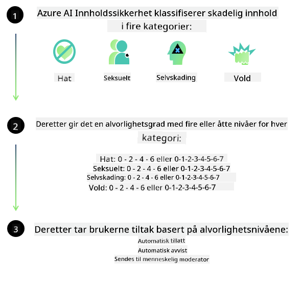

<!--
CO_OP_TRANSLATOR_METADATA:
{
  "original_hash": "c8273672cc57df2be675407a1383aaf0",
  "translation_date": "2025-05-09T06:04:18+00:00",
  "source_file": "md/01.Introduction/01/01.AISafety.md",
  "language_code": "no"
}
-->
# AI-sikkerhet for Phi-modeller  
Phi-familien av modeller ble utviklet i samsvar med [Microsoft Responsible AI Standard](https://query.prod.cms.rt.microsoft.com/cms/api/am/binary/RE5cmFl), som er et selskapsovergripende sett med krav basert på følgende seks prinsipper: ansvarlighet, åpenhet, rettferdighet, pålitelighet og sikkerhet, personvern og sikkerhet, samt inkludering, som utgjør [Microsofts prinsipper for ansvarlig AI](https://www.microsoft.com/ai/responsible-ai).

Som med tidligere Phi-modeller, ble det tatt i bruk en flerfasettert sikkerhetsevaluering og sikkerhetspost-trening, med ekstra tiltak for å ta hensyn til flerspråklige egenskaper i denne utgivelsen. Vår tilnærming til sikkerhetstrening og evalueringer, inkludert testing på tvers av flere språk og risikokategorier, er beskrevet i [Phi Safety Post-Training Paper](https://arxiv.org/abs/2407.13833). Selv om Phi-modellene drar nytte av denne tilnærmingen, bør utviklere anvende beste praksis for ansvarlig AI, inkludert kartlegging, måling og avbøting av risikoer knyttet til deres spesifikke brukstilfelle og kulturelle og språklige kontekst.

## Beste praksis

Som med andre modeller, kan Phi-familien potensielt oppføre seg på måter som er urettferdige, upålitelige eller støtende.

Noen av begrensningene i SLM og LLM du bør være oppmerksom på inkluderer:

- **Tjenestekvalitet:** Phi-modellene er hovedsakelig trent på engelskspråklig tekst. Språk andre enn engelsk vil oppleve dårligere ytelse. Engelske språkvarianter med mindre representasjon i treningsdataene kan oppleve dårligere ytelse enn standard amerikansk engelsk.  
- **Representasjon av skader og opprettholdelse av stereotyper:** Disse modellene kan over- eller underrepresentere grupper av mennesker, viske ut representasjon av enkelte grupper, eller forsterke nedsettende eller negative stereotyper. Til tross for sikkerhetspost-trening, kan disse begrensningene fortsatt være til stede på grunn av ulik grad av representasjon av ulike grupper eller forekomst av eksempler på negative stereotyper i treningsdata som reflekterer virkelige mønstre og samfunnsmessige skjevheter.  
- **Upassende eller støtende innhold:** Modellene kan produsere andre typer upassende eller støtende innhold, noe som kan gjøre dem uegnet for sensitive sammenhenger uten ytterligere tiltak som er spesifikke for brukstilfellet.  
- **Informasjonens pålitelighet:** Språkmodeller kan generere meningsløst innhold eller fabrikkere informasjon som kan høres rimelig ut, men som er unøyaktig eller utdatert.  
- **Begrenset omfang for kode:** Majoriteten av Phi-3 treningsdata er basert på Python og bruker vanlige pakker som "typing, math, random, collections, datetime, itertools". Hvis modellen genererer Python-skript som bruker andre pakker eller skript i andre språk, anbefaler vi sterkt at brukere manuelt verifiserer all API-bruk.

Utviklere bør anvende beste praksis for ansvarlig AI og er ansvarlige for å sikre at et spesifikt brukstilfelle overholder gjeldende lover og regler (f.eks. personvern, handel osv.).

## Vurderinger for ansvarlig AI

Som med andre språkmodeller kan Phi-serien potensielt oppføre seg på måter som er urettferdige, upålitelige eller støtende. Noen begrensninger å være oppmerksom på inkluderer:

**Tjenestekvalitet:** Phi-modellene er hovedsakelig trent på engelskspråklig tekst. Språk andre enn engelsk vil oppleve dårligere ytelse. Engelske språkvarianter med mindre representasjon i treningsdata kan oppleve dårligere ytelse enn standard amerikansk engelsk.

**Representasjon av skader og opprettholdelse av stereotyper:** Modellene kan over- eller underrepresentere grupper av mennesker, viske ut representasjon av enkelte grupper, eller forsterke nedsettende eller negative stereotyper. Til tross for sikkerhetspost-trening, kan disse begrensningene fortsatt være til stede på grunn av ulik grad av representasjon av ulike grupper eller forekomst av eksempler på negative stereotyper i treningsdata som reflekterer virkelige mønstre og samfunnsmessige skjevheter.

**Upassende eller støtende innhold:** Modellene kan produsere andre typer upassende eller støtende innhold, noe som kan gjøre dem uegnet for sensitive sammenhenger uten ytterligere tiltak som er spesifikke for brukstilfellet.  
Informasjonens pålitelighet: Språkmodeller kan generere meningsløst innhold eller fabrikkere informasjon som kan høres rimelig ut, men som er unøyaktig eller utdatert.

**Begrenset omfang for kode:** Majoriteten av Phi-3 treningsdata er basert på Python og bruker vanlige pakker som "typing, math, random, collections, datetime, itertools". Hvis modellen genererer Python-skript som bruker andre pakker eller skript i andre språk, anbefaler vi sterkt at brukere manuelt verifiserer all API-bruk.

Utviklere bør anvende beste praksis for ansvarlig AI og er ansvarlige for å sikre at et spesifikt brukstilfelle overholder gjeldende lover og regler (f.eks. personvern, handel osv.). Viktige områder å vurdere inkluderer:

**Allokering:** Modeller kan være uegnet for scenarier som kan ha konsekvenser for juridisk status eller fordeling av ressurser eller livsmuligheter (f.eks. bolig, jobb, kreditt osv.) uten ytterligere vurderinger og ekstra debiasing-teknikker.

**Høyrisikoscenarier:** Utviklere bør vurdere om modellene er egnet for høyrisikoscenarier hvor urettferdige, upålitelige eller støtende resultater kan få store konsekvenser eller føre til skade. Dette inkluderer å gi råd i sensitive eller ekspertområder hvor nøyaktighet og pålitelighet er kritisk (f.eks. juridisk eller helserelatert rådgivning). Ytterligere sikkerhetstiltak bør implementeres på applikasjonsnivå i henhold til distribusjonskonteksten.

**Feilinformasjonsrisiko:** Modellene kan produsere unøyaktig informasjon. Utviklere bør følge beste praksis for åpenhet og informere sluttbrukere om at de samhandler med et AI-system. På applikasjonsnivå kan utviklere bygge inn tilbakemeldingsmekanismer og systemer for å forankre svar i brukstilfellespesifikk, kontekstuell informasjon, en teknikk kjent som Retrieval Augmented Generation (RAG).

**Generering av skadelig innhold:** Utviklere bør vurdere modellutdata i sin kontekst og bruke tilgjengelige sikkerhetsklassifiseringsverktøy eller tilpassede løsninger som passer for deres brukstilfelle.

**Misbruk:** Andre former for misbruk som svindel, spam eller produksjon av skadelig programvare kan være mulig, og utviklere bør sikre at deres applikasjoner ikke bryter gjeldende lover og regler.

### Finjustering og AI-innholdssikkerhet

Etter finjustering av en modell anbefaler vi sterkt å bruke [Azure AI Content Safety](https://learn.microsoft.com/azure/ai-services/content-safety/overview) for å overvåke innholdet som genereres av modellene, identifisere og blokkere potensielle risikoer, trusler og kvalitetsproblemer.

[Azure AI Content Safety](https://learn.microsoft.com/azure/ai-services/content-safety/overview) støtter både tekst- og bildeinnhold. Det kan distribueres i skyen, i isolerte containere og på edge-/embedded-enheter.

## Oversikt over Azure AI Content Safety

Azure AI Content Safety er ikke en universalløsning; det kan tilpasses for å samsvare med bedrifters spesifikke retningslinjer. I tillegg gjør de flerspråklige modellene det mulig å forstå flere språk samtidig.

- **Azure AI Content Safety**  
- **Microsoft Developer**  
- **5 videoer**

Azure AI Content Safety-tjenesten oppdager skadelig bruker- og AI-generert innhold i applikasjoner og tjenester. Den inkluderer tekst- og bilde-APIer som gjør det mulig å oppdage skadelig eller upassende materiale.

[AI Content Safety Playlist](https://www.youtube.com/playlist?list=PLlrxD0HtieHjaQ9bJjyp1T7FeCbmVcPkQ)

**Ansvarsfraskrivelse**:  
Dette dokumentet er oversatt ved hjelp av AI-oversettelsestjenesten [Co-op Translator](https://github.com/Azure/co-op-translator). Selv om vi streber etter nøyaktighet, vær oppmerksom på at automatiske oversettelser kan inneholde feil eller unøyaktigheter. Det originale dokumentet på dets opprinnelige språk bør betraktes som den autoritative kilden. For kritisk informasjon anbefales profesjonell menneskelig oversettelse. Vi er ikke ansvarlige for eventuelle misforståelser eller feiltolkninger som oppstår ved bruk av denne oversettelsen.