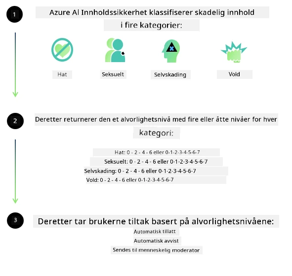

<!--
CO_OP_TRANSLATOR_METADATA:
{
  "original_hash": "839ccc4b3886ef10cfd4e64977f5792d",
  "translation_date": "2026-01-05T12:37:09+00:00",
  "source_file": "md/01.Introduction/01/01.AISafety.md",
  "language_code": "no"
}
-->
# AI-sikkerhet for Phi-modeller
Phi-familien av modeller ble utviklet i samsvar med [Microsoft Responsible AI Standard](https://www.microsoft.com/ai/principles-and-approach#responsible-ai-standard), som er et selskapsovergripende sett med krav basert på de følgende seks prinsippene: ansvarlighet, åpenhet, rettferdighet, pålitelighet og sikkerhet, personvern og sikkerhet, og inkludering som utgjør [Microsofts Responsible AI-prinsipper](https://www.microsoft.com/ai/responsible-ai).

Som de tidligere Phi-modellene ble det tatt i bruk en flerfasettert sikkerhetsevaluering og sikkerhets tilnærming etter trening, med ytterligere tiltak for å ta hensyn til flerspråklige evner i denne utgivelsen. Vår tilnærming til sikkerhetstrening og evalueringer, inkludert testing på tvers av flere språk og risikokategorier, er lagt frem i [Phi Safety Post-Training Paper](https://arxiv.org/abs/2407.13833). Selv om Phi-modellene drar nytte av denne tilnærmingen, bør utviklere anvende beste praksis for ansvarlig AI, inkludert kartlegging, måling og avbøting av risikoer knyttet til deres spesifikke bruksområde og kulturelle og språklige kontekst.

## Beste praksis

Som andre modeller kan Phi-familien potensielt opptre på måter som er urettferdige, upålitelige eller støtende.

Noen av begrensende atferder for SLM og LLM du bør være klar over inkluderer:

- **Tjenestekvalitet:** Phi-modellene er hovedsakelig trent på engelske tekster. Andre språk enn engelsk vil oppleve dårligere ytelse. Engelske språkvarianter med mindre representasjon i treningsdataene kan oppleve verre ytelse enn standard amerikansk engelsk.
- **Representasjon av skadevirkninger & opprettholdelse av stereotyper:** Disse modellene kan over- eller underrepresentere grupper av mennesker, viske ut representasjon av noen grupper, eller forsterke nedsettende eller negative stereotyper. Til tross for sikkerhet etter trening kan disse begrensningene fortsatt være til stede på grunn av ulike nivåer av representasjon av ulike grupper eller forekomst av eksempler på negative stereotyper i treningsdata som reflekterer reelle mønstre og samfunnsmessige skjevheter.
- **Upassende eller støtende innhold:** Disse modellene kan produsere andre typer upassende eller støtende innhold, noe som kan gjøre det upassende å bruke dem i sensitive kontekster uten ytterligere tiltak som er spesifikke for bruken.
Informasjonspålitelighet: Språkmodeller kan generere meningsløst innhold eller fabrikkert innhold som kan høres fornuftig ut, men som er unøyaktig eller utdatert.
- **Begrenset omfang for kode:** Majoriteten av Phi-3 treningsdata er basert på Python og bruker vanlige pakker som "typing, math, random, collections, datetime, itertools". Hvis modellen genererer Python-skript som bruker andre pakker eller skript på andre språk, anbefaler vi sterkt at brukere manuelt verifiserer all API-bruk.

Utviklere bør anvende beste praksis for ansvarlig AI og er ansvarlige for å sikre at et spesifikt bruksområde overholder gjeldende lover og forskrifter (f.eks. personvern, handel, osv.).

## Ansvarlige AI-hensyn

Som andre språkmodeller kan Phi-serien potensielt opptre på måter som er urettferdige, upålitelige eller støtende. Noen av begrensningene du bør være oppmerksom på inkluderer:

**Tjenestekvalitet:** Phi-modellene er hovedsakelig trent på engelske tekster. Andre språk enn engelsk vil oppleve dårligere ytelse. Engelske språkvarianter med mindre representasjon i treningsdataene kan oppleve verre ytelse enn standard amerikansk engelsk.

**Representasjon av skadevirkninger & opprettholdelse av stereotyper:** Disse modellene kan over- eller underrepresentere grupper av mennesker, viske ut representasjon av noen grupper, eller forsterke nedsettende eller negative stereotyper. Til tross for sikkerhet etter trening kan disse begrensningene fortsatt være til stede på grunn av ulike nivåer av representasjon av ulike grupper eller forekomst av eksempler på negative stereotyper i treningsdata som reflekterer reelle mønstre og samfunnsmessige skjevheter.

**Upassende eller støtende innhold:** Disse modellene kan produsere andre typer upassende eller støtende innhold, noe som kan gjøre det upassende å bruke dem i sensitive kontekster uten ytterligere tiltak som er spesifikke for bruken.
Informasjonspålitelighet: Språkmodeller kan generere meningsløst innhold eller fabrikkert innhold som kan høres fornuftig ut, men som er unøyaktig eller utdatert.

**Begrenset omfang for kode:** Majoriteten av Phi-3 treningsdata er basert på Python og bruker vanlige pakker som "typing, math, random, collections, datetime, itertools". Hvis modellen genererer Python-skript som bruker andre pakker eller skript på andre språk, anbefaler vi sterkt at brukere manuelt verifiserer all API-bruk.

Utviklere bør anvende beste praksis for ansvarlig AI og er ansvarlige for å sikre at et spesifikt bruksområde overholder gjeldende lover og forskrifter (f.eks. personvern, handel, osv.). Viktige områder for vurdering inkluderer:

**Tildeling:** Modeller kan være uegnet for scenarier som kan ha konsekvenser for juridisk status eller fordeling av ressurser eller livsmuligheter (f.eks.: bolig, sysselsetting, kreditt osv.) uten ytterligere vurderinger og ekstra avbiasingsteknikker.

**Høy-risiko scenarioer:** Utviklere bør vurdere egnetheten for bruk av modeller i høy-risiko scenarioer der urettferdige, upålitelige eller støtende resultater kan være svært kostbare eller føre til skade. Dette inkluderer å gi råd i sensitive eller ekspertområder hvor nøyaktighet og pålitelighet er avgjørende (f.eks.: juridiske eller helse-relaterte råd). Ytterligere sikkerhetstiltak bør implementeres på applikasjonsnivå i henhold til distribusjonskonteksten.

**Feilinformasjonsrisiko:** Modeller kan produsere unøyaktig informasjon. Utviklere bør følge beste praksis for åpenhet og informere sluttbrukere om at de interagerer med et AI-system. På applikasjonsnivå kan utviklere bygge tilbakemeldingsmekanismer og prosesser for å basere svar på bruksområdet-spesifikk, kontekstuell informasjon, en teknikk kjent som Retrieval Augmented Generation (RAG).

**Generering av skadelig innhold:** Utviklere bør vurdere utdata for konteksten og bruke tilgjengelige sikkerhetsklassifiserere eller tilpassede løsninger som passer til deres bruksområde.

**Misbruk:** Andre former for misbruk som svindel, spam, eller produksjon av skadelig programvare kan være mulig, og utviklere bør sikre at deres applikasjoner ikke bryter gjeldende lover og forskrifter.

### Finjustering og AI-innholdssikkerhet

Etter finjustering av en modell anbefaler vi sterkt å bruke [Azure AI Content Safety](https://learn.microsoft.com/azure/ai-services/content-safety/overview)-tiltak for å overvåke innholdet generert av modellene, identifisere og blokkere potensielle risikoer, trusler og kvalitetsproblemer.

[Azure AI Content Safety](https://learn.microsoft.com/azure/ai-services/content-safety/overview) støtter både tekst- og bildeinnhold. Det kan distribueres i skyen, i frakoblede containere og på edge/innebygde enheter.

## Oversikt over Azure AI Content Safety

Azure AI Content Safety er ikke en løsning som passer for alle; det kan tilpasses for å samsvare med virksomheters spesifikke retningslinjer. I tillegg gjør dens flerspråklige modeller det mulig å forstå flere språk samtidig.

- **Azure AI Content Safety**
- **Microsoft Developer**
- **5 videoer**

Azure AI Content Safety-tjenesten oppdager skadelig bruker- og AI-generert innhold i applikasjoner og tjenester. Den inkluderer tekst- og bilde-API-er som lar deg oppdage skadelig eller upassende materiale.

[AI Content Safety Playlist](https://www.youtube.com/playlist?list=PLlrxD0HtieHjaQ9bJjyp1T7FeCbmVcPkQ)

---

<!-- CO-OP TRANSLATOR DISCLAIMER START -->
**Ansvarsfraskrivelse**:
Dette dokumentet er oversatt ved hjelp av AI-oversettelsestjenesten [Co-op Translator](https://github.com/Azure/co-op-translator). Selv om vi streber etter nøyaktighet, vennligst vær oppmerksom på at automatiske oversettelser kan inneholde feil eller unøyaktigheter. Det opprinnelige dokumentet på originalspråket bør betraktes som den autoritative kilden. For kritisk informasjon anbefales profesjonell menneskelig oversettelse. Vi er ikke ansvarlige for eventuelle misforståelser eller feiltolkninger som oppstår som følge av bruk av denne oversettelsen.
<!-- CO-OP TRANSLATOR DISCLAIMER END -->