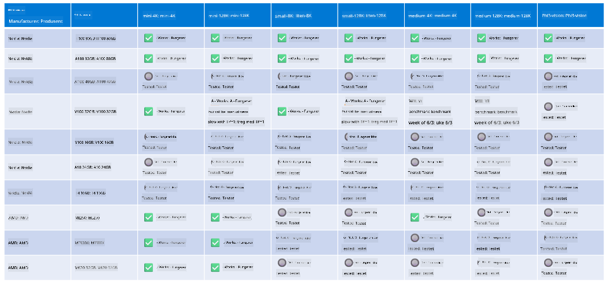

<!--
CO_OP_TRANSLATOR_METADATA:
{
  "original_hash": "8cdc17ce0f10535da30b53d23fe1a795",
  "translation_date": "2025-05-09T07:50:33+00:00",
  "source_file": "md/01.Introduction/01/01.Hardwaresupport.md",
  "language_code": "no"
}
-->
# Phi Maskinvare Støtte

Microsoft Phi er optimalisert for ONNX Runtime og støtter Windows DirectML. Det fungerer godt på ulike maskinvaretyper, inkludert GPUer, CPUer og til og med mobile enheter.

## Enhetsmaskinvare  
Spesifikt inkluderer den støttede maskinvaren:

- GPU SKU: RTX 4090 (DirectML)
- GPU SKU: 1 A100 80GB (CUDA)
- CPU SKU: Standard F64s v2 (64 vCPUer, 128 GiB minne)

## Mobil SKU

- Android - Samsung Galaxy S21
- Apple iPhone 14 eller nyere med A16/A17-prosessor

## Phi Maskinvare Spesifikasjon

- Minimumskonfigurasjon kreves.
- Windows: GPU med DirectX 12-støtte og minst 4 GB kombinert RAM

CUDA: NVIDIA GPU med Compute Capability >= 7.02



## Kjøre onnxruntime på flere GPUer

De Phi ONNX-modellene som er tilgjengelige nå, støtter kun 1 GPU. Det er mulig å støtte multi-GPU for Phi-modellen, men ORT med 2 GPUer garanterer ikke høyere gjennomstrømning sammenlignet med 2 separate instanser av ort. Se [ONNX Runtime](https://onnxruntime.ai/) for de nyeste oppdateringene.

På [Build 2024 annonserte GenAI ONNX-teamet](https://youtu.be/WLW4SE8M9i8?si=EtG04UwDvcjunyfC) at de hadde aktivert multi-instans i stedet for multi-GPU for Phi-modeller.

Per nå lar dette deg kjøre én onnxruntime- eller onnxruntime-genai-instans med CUDA_VISIBLE_DEVICES miljøvariabel som vist her.

```Python
CUDA_VISIBLE_DEVICES=0 python infer.py
CUDA_VISIBLE_DEVICES=1 python infer.py
```

Utforsk gjerne Phi videre i [Azure AI Foundry](https://ai.azure.com)

**Ansvarsfraskrivelse**:  
Dette dokumentet er oversatt ved hjelp av AI-oversettelsestjenesten [Co-op Translator](https://github.com/Azure/co-op-translator). Selv om vi streber etter nøyaktighet, vennligst vær oppmerksom på at automatiske oversettelser kan inneholde feil eller unøyaktigheter. Det opprinnelige dokumentet på dets opprinnelige språk bør anses som den autoritative kilden. For kritisk informasjon anbefales profesjonell menneskelig oversettelse. Vi er ikke ansvarlige for eventuelle misforståelser eller feiltolkninger som oppstår fra bruk av denne oversettelsen.