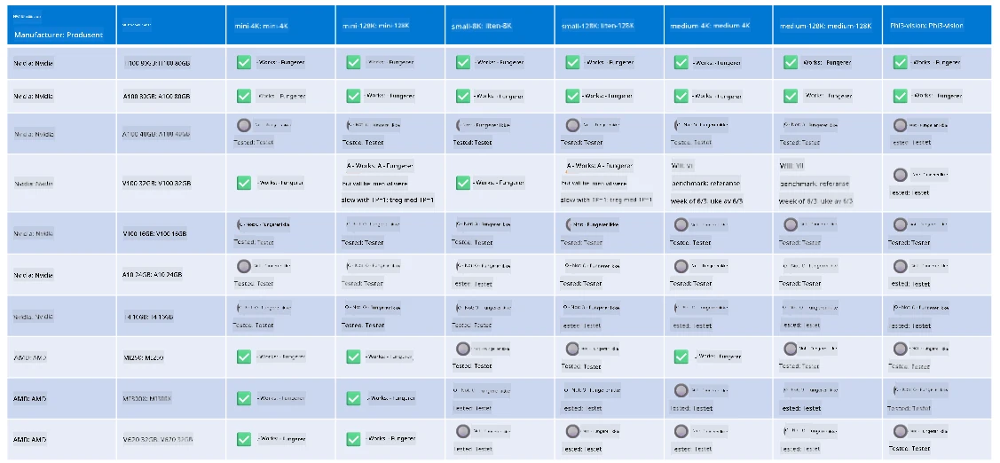

# Phi Maskinvarestøtte

Microsoft Phi er optimalisert for ONNX Runtime og støtter Windows DirectML. Det fungerer bra på ulike maskinvaretyper, inkludert GPU-er, CPU-er og til og med mobile enheter.

## Enhetsmaskinvare  
Spesifikt inkluderer den støttede maskinvaren:

- GPU SKU: RTX 4090 (DirectML)
- GPU SKU: 1 A100 80GB (CUDA)
- CPU SKU: Standard F64s v2 (64 vCPU-er, 128 GiB minne)

## Mobil SKU

- Android - Samsung Galaxy S21
- Apple iPhone 14 eller nyere A16/A17-prosessor

## Phi Maskinvarespesifikasjon

- Minimumskonfigurasjon kreves.
- Windows: DirectX 12-kompatibel GPU og minst 4 GB kombinert RAM

CUDA: NVIDIA GPU med Compute Capability >= 7.02



## Kjøre onnxruntime på flere GPU-er

For øyeblikket er tilgjengelige Phi ONNX-modeller kun for 1 GPU. Det er mulig å støtte multi-GPU for Phi-modell, men ORT med 2 GPU-er garanterer ikke at det gir høyere gjennomstrømning sammenlignet med 2 instanser av ORT. Se [ONNX Runtime](https://onnxruntime.ai/) for de siste oppdateringene.

På [Build 2024 annonserte GenAI ONNX-teamet](https://youtu.be/WLW4SE8M9i8?si=EtG04UwDvcjunyfC) at de hadde aktivert multi-instance i stedet for multi-GPU for Phi-modeller.

Per nå lar dette deg kjøre én onnnxruntime- eller onnxruntime-genai-instans med miljøvariabelen CUDA_VISIBLE_DEVICES slik:

```Python
CUDA_VISIBLE_DEVICES=0 python infer.py
CUDA_VISIBLE_DEVICES=1 python infer.py
```

Utforsk gjerne Phi videre i [Microsoft Foundry](https://ai.azure.com)

---

<!-- CO-OP TRANSLATOR DISCLAIMER START -->
**Ansvarsfraskrivelse**:
Dette dokumentet er oversatt ved hjelp av AI-oversettelsestjenesten [Co-op Translator](https://github.com/Azure/co-op-translator). Selv om vi streber etter nøyaktighet, vennligst vær oppmerksom på at automatiske oversettelser kan inneholde feil eller unøyaktigheter. Det opprinnelige dokumentet på originalspråket bør anses som den autoritative kilden. For kritisk informasjon anbefales profesjonell menneskelig oversettelse. Vi er ikke ansvarlige for eventuelle misforståelser eller feiltolkninger som oppstår ved bruk av denne oversettelsen.
<!-- CO-OP TRANSLATOR DISCLAIMER END -->