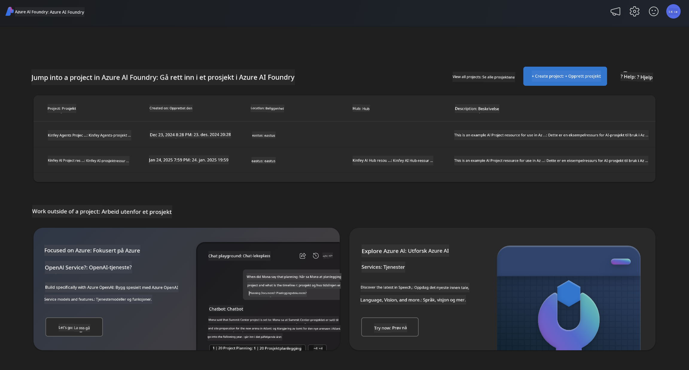
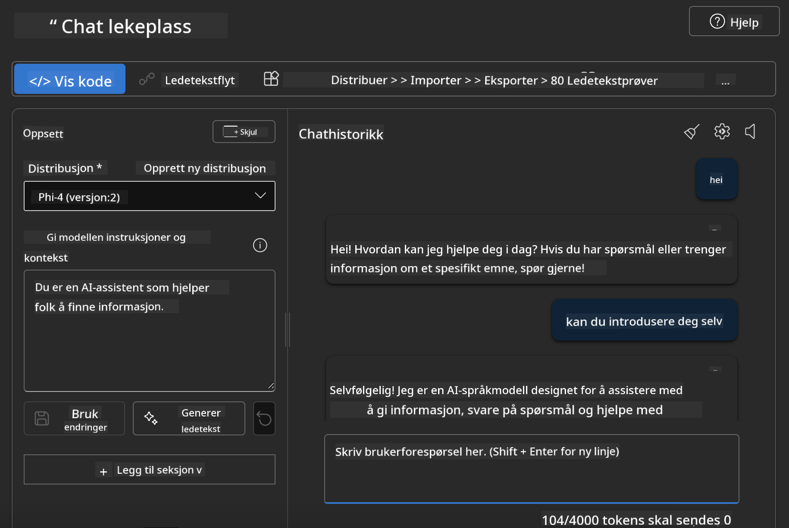

<!--
CO_OP_TRANSLATOR_METADATA:
{
  "original_hash": "3ae21dc5554e888defbe57946ee995ee",
  "translation_date": "2025-05-09T09:06:16+00:00",
  "source_file": "md/01.Introduction/02/03.AzureAIFoundry.md",
  "language_code": "no"
}
-->
## Phi-familien i Azure AI Foundry

[Azure AI Foundry](https://ai.azure.com) er en pålitelig plattform som gir utviklere muligheten til å drive innovasjon og forme fremtiden med AI på en trygg, sikker og ansvarlig måte.

[Azure AI Foundry](https://ai.azure.com) er laget for utviklere som vil:

- Bygge generative AI-applikasjoner på en plattform i bedriftsklasse.
- Utforske, bygge, teste og distribuere ved hjelp av avanserte AI-verktøy og ML-modeller, basert på ansvarlig AI-praksis.
- Samarbeide med et team gjennom hele livssyklusen for applikasjonsutvikling.

Med Azure AI Foundry kan du utforske et bredt utvalg av modeller, tjenester og muligheter, og begynne å bygge AI-applikasjoner som best støtter dine mål. Azure AI Foundry-plattformen legger til rette for skalerbarhet slik at du enkelt kan gå fra proof of concept til fullverdige produksjonsapplikasjoner. Kontinuerlig overvåking og forbedring sikrer langsiktig suksess.



I tillegg til å bruke Azure AOAI Service i Azure AI Foundry, kan du også bruke tredjepartsmodeller i Azure AI Foundry Model Catalog. Dette er et godt valg hvis du ønsker å bruke Azure AI Foundry som din AI-løsningsplattform.

Vi kan raskt distribuere Phi Family-modeller gjennom Model Catalog i Azure AI Foundry

[Microsoft Phi Models in Azure AI Foundry Models](https://ai.azure.com/explore/models/?selectedCollection=phi)


### **Distribuer Phi-4 i Azure AI Foundry**


### **Test Phi-4 i Azure AI Foundry Playground**



### **Kjør Python-kode for å kalle Azure AI Foundry Phi-4**

```python

import os  
import base64
from openai import AzureOpenAI  
from azure.identity import DefaultAzureCredential, get_bearer_token_provider  
        
endpoint = os.getenv("ENDPOINT_URL", "Your Azure AOAI Service Endpoint")  
deployment = os.getenv("DEPLOYMENT_NAME", "Phi-4")  
      
token_provider = get_bearer_token_provider(  
    DefaultAzureCredential(),  
    "https://cognitiveservices.azure.com/.default"  
)  
  
client = AzureOpenAI(  
    azure_endpoint=endpoint,  
    azure_ad_token_provider=token_provider,  
    api_version="2024-05-01-preview",  
)  
  

chat_prompt = [
    {
        "role": "system",
        "content": "You are an AI assistant that helps people find information."
    },
    {
        "role": "user",
        "content": "can you introduce yourself"
    }
] 
    
# Include speech result if speech is enabled  
messages = chat_prompt 

completion = client.chat.completions.create(  
    model=deployment,  
    messages=messages,
    max_tokens=800,  
    temperature=0.7,  
    top_p=0.95,  
    frequency_penalty=0,  
    presence_penalty=0,
    stop=None,  
    stream=False  
)  
  
print(completion.to_json())  

```

**Ansvarsfraskrivelse**:  
Dette dokumentet er oversatt ved hjelp av AI-oversettelsestjenesten [Co-op Translator](https://github.com/Azure/co-op-translator). Selv om vi streber etter nøyaktighet, vennligst vær oppmerksom på at automatiserte oversettelser kan inneholde feil eller unøyaktigheter. Det originale dokumentet på dets opprinnelige språk skal betraktes som den autoritative kilden. For kritisk informasjon anbefales profesjonell menneskelig oversettelse. Vi er ikke ansvarlige for eventuelle misforståelser eller feiltolkninger som oppstår ved bruk av denne oversettelsen.