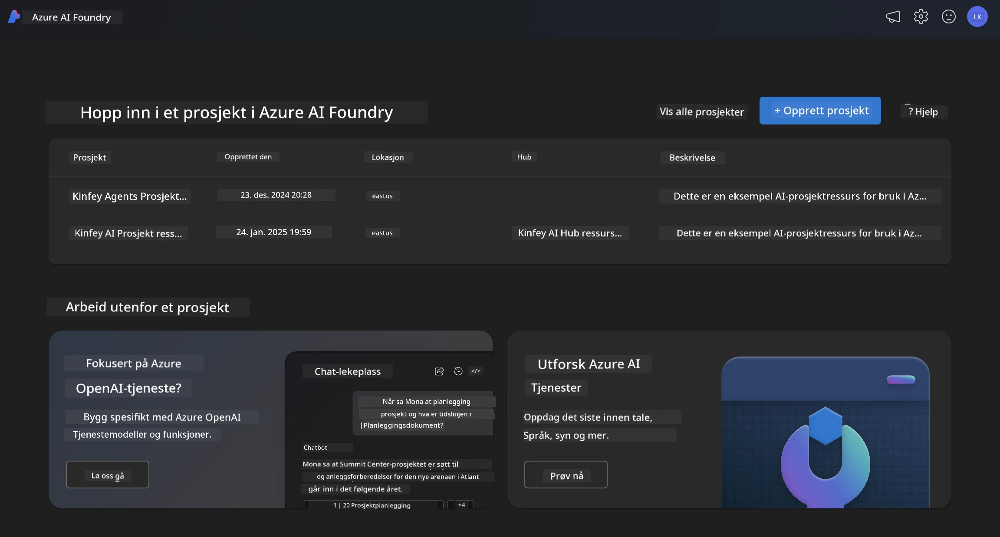
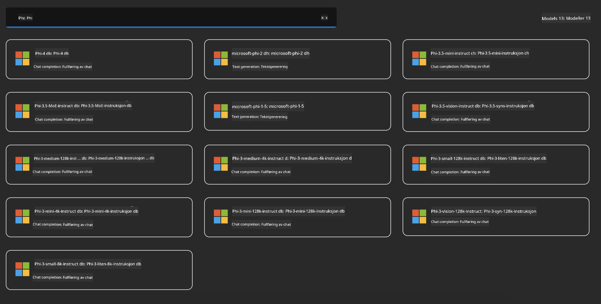
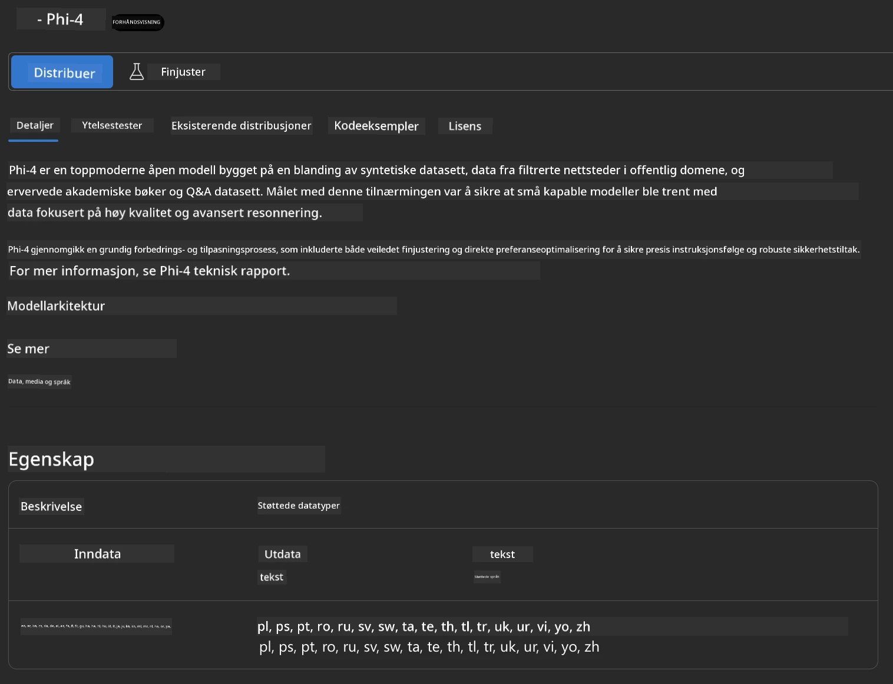
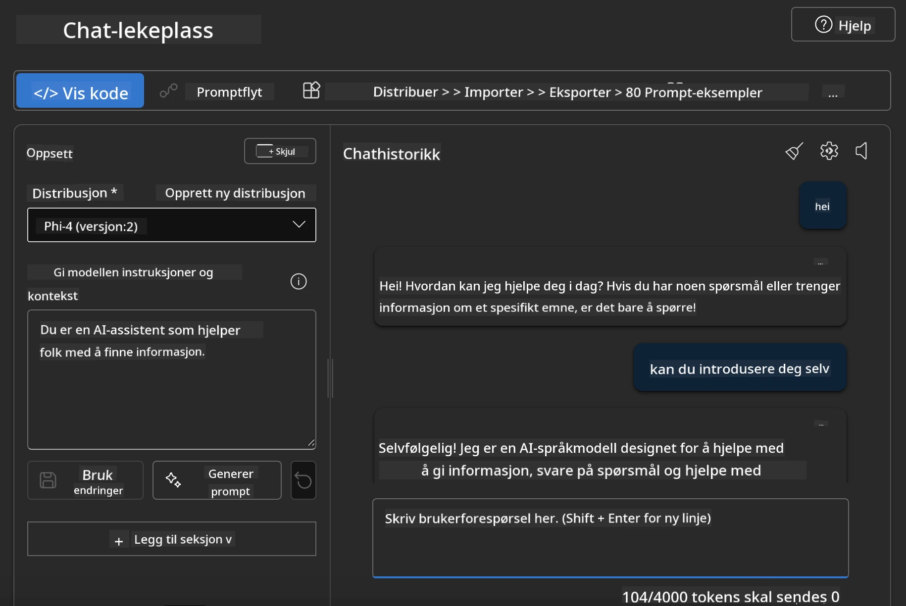

## Phi-familien i Microsoft Foundry

[Microsoft Foundry](https://ai.azure.com) er en pålitelig plattform som gir utviklere mulighet til å drive innovasjon og forme fremtiden med AI på en trygg, sikker og ansvarlig måte.

[Microsoft Foundry](https://ai.azure.com) er laget for utviklere som ønsker å:

- Bygge generative AI-applikasjoner på en plattform i bedriftsklasse.
- Utforske, bygge, teste og distribuere ved hjelp av banebrytende AI-verktøy og ML-modeller, basert på ansvarlige AI-prinsipper.
- Samarbeide med et team gjennom hele livssyklusen for applikasjonsutvikling.

Med Microsoft Foundry kan du utforske et bredt spekter av modeller, tjenester og funksjoner, og komme i gang med å bygge AI-applikasjoner som best støtter dine mål. Microsoft Foundry-plattformen legger til rette for skalerbarhet slik at du enkelt kan gå fra proof of concept til fullverdige produksjonsapplikasjoner. Kontinuerlig overvåking og forbedring støtter langsiktig suksess.



I tillegg til å bruke Azure AOAI Service i Microsoft Foundry, kan du også bruke tredjepartsmodeller i Microsoft Foundry Model Catalog. Dette er et godt valg hvis du ønsker å bruke Microsoft Foundry som din AI-løsningsplattform.

Vi kan raskt distribuere Phi Family Models gjennom Model Catalog i Microsoft Foundry

[Microsoft Phi Models in Microsoft Foundry Models](https://ai.azure.com/explore/models/?selectedCollection=phi)



### **Distribuer Phi-4 i Microsoft Foundry**



### **Test Phi-4 i Microsoft Foundry Playground**



### **Kjør Python-kode for å kalle Microsoft Foundry Phi-4**

```python

import os  
import base64
from openai import AzureOpenAI  
from azure.identity import DefaultAzureCredential, get_bearer_token_provider  
        
endpoint = os.getenv("ENDPOINT_URL", "Your Azure AOAI Service Endpoint")  
deployment = os.getenv("DEPLOYMENT_NAME", "Phi-4")  
      
token_provider = get_bearer_token_provider(  
    DefaultAzureCredential(),  
    "https://cognitiveservices.azure.com/.default"  
)  
  
client = AzureOpenAI(  
    azure_endpoint=endpoint,  
    azure_ad_token_provider=token_provider,  
    api_version="2024-05-01-preview",  
)  
  

chat_prompt = [
    {
        "role": "system",
        "content": "You are an AI assistant that helps people find information."
    },
    {
        "role": "user",
        "content": "can you introduce yourself"
    }
] 
    
# Include speech result if speech is enabled  
messages = chat_prompt 

completion = client.chat.completions.create(  
    model=deployment,  
    messages=messages,
    max_tokens=800,  
    temperature=0.7,  
    top_p=0.95,  
    frequency_penalty=0,  
    presence_penalty=0,
    stop=None,  
    stream=False  
)  
  
print(completion.to_json())  

```

**Ansvarsfraskrivelse**:  
Dette dokumentet er oversatt ved hjelp av AI-oversettelsestjenesten [Co-op Translator](https://github.com/Azure/co-op-translator). Selv om vi streber etter nøyaktighet, vennligst vær oppmerksom på at automatiske oversettelser kan inneholde feil eller unøyaktigheter. Det opprinnelige dokumentet på originalspråket skal anses som den autoritative kilden. For kritisk informasjon anbefales profesjonell menneskelig oversettelse. Vi er ikke ansvarlige for eventuelle misforståelser eller feiltolkninger som oppstår ved bruk av denne oversettelsen.