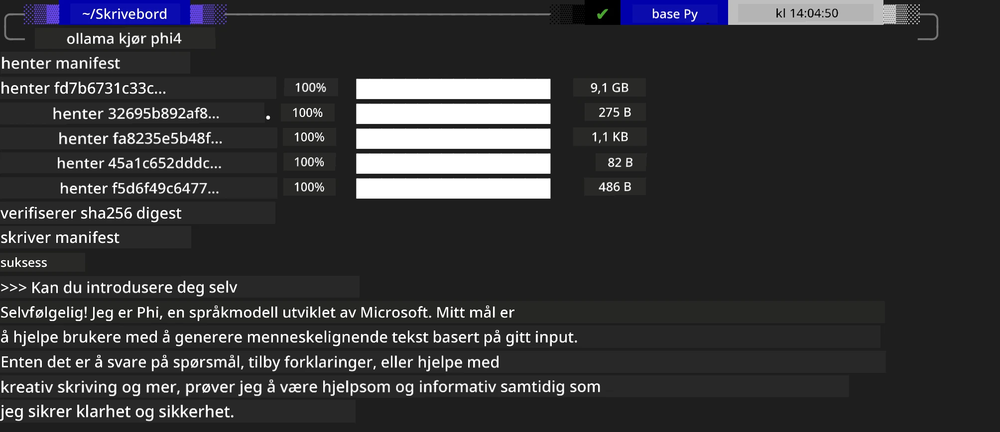
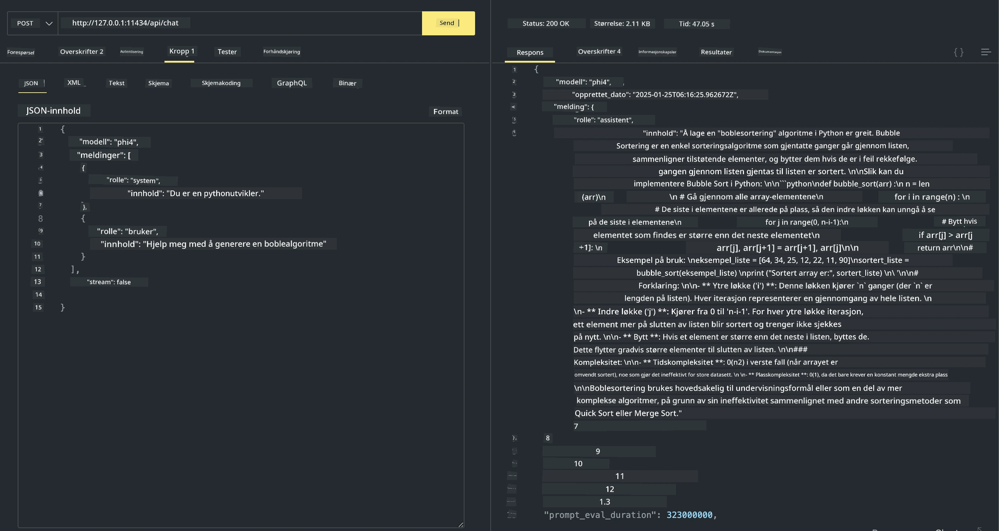

<!--
CO_OP_TRANSLATOR_METADATA:
{
  "original_hash": "2aa35f3c8b437fd5dc9995d53909d495",
  "translation_date": "2025-12-21T12:14:13+00:00",
  "source_file": "md/01.Introduction/02/04.Ollama.md",
  "language_code": "no"
}
-->
## Phi-familien i Ollama


[Ollama](https://ollama.com) gjør det mulig for flere å direkte distribuere open source LLM eller SLM gjennom enkle skript, og kan også bygge API-er for å hjelpe lokale Copilot-bruksscenarier.

## **1. Installasjon**

Ollama støtter kjøring på Windows, macOS og Linux. Du kan installere Ollama via denne lenken ([https://ollama.com/download](https://ollama.com/download)). Etter vellykket installasjon kan du direkte bruke Ollama-skriptet til å kalle Phi-3 gjennom et terminalvindu. Du kan se alle de [tilgjengelige bibliotekene i Ollama](https://ollama.com/library). Hvis du åpner dette depotet i en Codespace, vil det allerede ha Ollama installert.

```bash

ollama run phi4

```

> [!NOTE]
> Modellen vil bli lastet ned først når du kjører den for første gang. Selvfølgelig kan du også direkte spesifisere den nedlastede Phi-4-modellen. Vi tar WSL som et eksempel for å kjøre kommandoen. Etter at modellen er vellykket lastet ned, kan du samhandle direkte i terminalen.



## **2. Kall phi-4 API fra Ollama**

Hvis du vil kalle Phi-4 API-et generert av Ollama, kan du bruke denne kommandoen i terminalen for å starte Ollama-serveren.

```bash

ollama serve

```

> [!NOTE]
> Hvis du kjører macOS eller Linux, kan du få følgende feil **"Error: listen tcp 127.0.0.1:11434: bind: address already in use"**. Du kan få denne feilen når du kjører kommandoen. Du kan enten ignorere feilen, siden den vanligvis indikerer at serveren allerede kjører, eller du kan stoppe og starte Ollama på nytt:

**macOS**

```bash

brew services restart ollama

```

**Linux**

```bash

sudo systemctl stop ollama

```

Ollama støtter to API-er: generate og chat. Du kan kalle modell-APIet som tilbys av Ollama etter behov ved å sende forespørsler til tjenesten som kjører lokalt på port 11434.

**Chat**

```bash

curl http://127.0.0.1:11434/api/chat -d '{
  "model": "phi3",
  "messages": [
    {
      "role": "system",
      "content": "Your are a python developer."
    },
    {
      "role": "user",
      "content": "Help me generate a bubble algorithm"
    }
  ],
  "stream": false
  
}'
```

Dette er resultatet i Postman



## Ytterligere ressurser

Sjekk listen over tilgjengelige modeller i Ollama i [deres bibliotek](https://ollama.com/library).

Hent modellen din fra Ollama-serveren ved å bruke denne kommandoen

```bash
ollama pull phi4
```

Kjør modellen ved å bruke denne kommandoen

```bash
ollama run phi4
```

***Merk:*** Besøk denne lenken [https://github.com/ollama/ollama/blob/main/docs/api.md](https://github.com/ollama/ollama/blob/main/docs/api.md) for å lære mer

## Kalle Ollama fra Python

Du kan bruke `requests` eller `urllib3` for å sende forespørsler til de lokale serverendepunktene som ble brukt ovenfor. En populær måte å bruke Ollama i Python på er via [openai](https://pypi.org/project/openai/)-SDKen, siden Ollama også tilbyr OpenAI-kompatible serverendepunkter.

Her er et eksempel for phi3-mini:

```python
import openai

client = openai.OpenAI(
    base_url="http://localhost:11434/v1",
    api_key="nokeyneeded",
)

response = client.chat.completions.create(
    model="phi4",
    temperature=0.7,
    n=1,
    messages=[
        {"role": "system", "content": "You are a helpful assistant."},
        {"role": "user", "content": "Write a haiku about a hungry cat"},
    ],
)

print("Response:")
print(response.choices[0].message.content)
```

## Kalle Ollama fra JavaScript 
```javascript
// Eksempel på oppsummering av en fil med Phi-4
script({
    model: "ollama:phi4",
    title: "Summarize with Phi-4",
    system: ["system"],
})

// Eksempel på oppsummering
const file = def("FILE", env.files)
$`Summarize ${file} in a single paragraph.`
```

## Kalle Ollama fra C#

Opprett en ny C# Console-applikasjon og legg til følgende NuGet-pakke:

```bash
dotnet add package Microsoft.SemanticKernel --version 1.34.0
```

Erstatt deretter denne koden i `Program.cs`-filen

```csharp
using Microsoft.SemanticKernel;
using Microsoft.SemanticKernel.ChatCompletion;

// add chat completion service using the local ollama server endpoint
#pragma warning disable SKEXP0001, SKEXP0003, SKEXP0010, SKEXP0011, SKEXP0050, SKEXP0052
builder.AddOpenAIChatCompletion(
    modelId: "phi4",
    endpoint: new Uri("http://localhost:11434/"),
    apiKey: "non required");

// invoke a simple prompt to the chat service
string prompt = "Write a joke about kittens";
var response = await kernel.InvokePromptAsync(prompt);
Console.WriteLine(response.GetValue<string>());
```

Kjør appen med kommandoen:

```bash
dotnet run
```

---

<!-- CO-OP TRANSLATOR DISCLAIMER START -->
**Ansvarsfraskrivelse**:
Dette dokumentet er oversatt ved hjelp av AI-oversettelsestjenesten [Co-op Translator](https://github.com/Azure/co-op-translator). Selv om vi streber etter nøyaktighet, vær oppmerksom på at automatiske oversettelser kan inneholde feil eller unøyaktigheter. Det opprinnelige dokumentet i originalspråket bør anses som den autoritative kilden. For kritisk informasjon anbefales profesjonell menneskelig oversettelse. Vi kan ikke holdes ansvarlige for eventuelle misforståelser eller feiltolkninger som oppstår ved bruk av denne oversettelsen.
<!-- CO-OP TRANSLATOR DISCLAIMER END -->