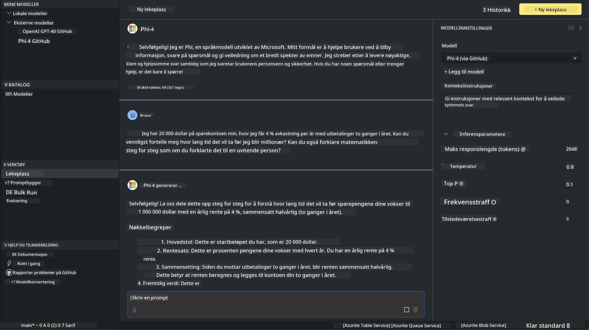

<!--
CO_OP_TRANSLATOR_METADATA:
{
  "original_hash": "4951d458c0b60c02cd1e751b40903877",
  "translation_date": "2025-07-16T19:27:17+00:00",
  "source_file": "md/01.Introduction/02/05.AITK.md",
  "language_code": "no"
}
-->
# Phi-familien i AITK

[AI Toolkit for VS Code](https://marketplace.visualstudio.com/items?itemName=ms-windows-ai-studio.windows-ai-studio) forenkler utvikling av generative AI-applikasjoner ved å samle banebrytende AI-utviklingsverktøy og modeller fra Azure AI Foundry Catalog og andre kataloger som Hugging Face. Du kan bla gjennom AI-modellkatalogen drevet av GitHub Models og Azure AI Foundry Model Catalogs, laste dem ned lokalt eller eksternt, finjustere, teste og bruke dem i applikasjonen din.

AI Toolkit Preview kjører lokalt. Lokal inferens eller finjustering avhenger av modellen du har valgt, og du kan trenge en GPU som NVIDIA CUDA GPU. Du kan også kjøre GitHub Models direkte med AITK.

## Komme i gang

[Lær mer om hvordan du installerer Windows subsystem for Linux](https://learn.microsoft.com/windows/wsl/install?WT.mc_id=aiml-137032-kinfeylo)

og [endre standard distribusjon](https://learn.microsoft.com/windows/wsl/install#change-the-default-linux-distribution-installed).

[AI Toolkit GitHub Repo](https://github.com/microsoft/vscode-ai-toolkit/)

- Windows, Linux, macOS
  
- For finjustering på både Windows og Linux trenger du en Nvidia GPU. I tillegg krever **Windows** subsystem for Linux med Ubuntu-distribusjon 18.4 eller nyere. [Lær mer om hvordan du installerer Windows subsystem for Linux](https://learn.microsoft.com/windows/wsl/install) og [endre standard distribusjon](https://learn.microsoft.com/windows/wsl/install#change-the-default-linux-distribution-installed).

### Installer AI Toolkit

AI Toolkit leveres som en [Visual Studio Code Extension](https://code.visualstudio.com/docs/setup/additional-components#_vs-code-extensions), så du må først installere [VS Code](https://code.visualstudio.com/docs/setup/windows?WT.mc_id=aiml-137032-kinfeylo), og laste ned AI Toolkit fra [VS Marketplace](https://marketplace.visualstudio.com/items?itemName=ms-windows-ai-studio.windows-ai-studio).  
[AI Toolkit er tilgjengelig i Visual Studio Marketplace](https://marketplace.visualstudio.com/items?itemName=ms-windows-ai-studio.windows-ai-studio) og kan installeres som en hvilken som helst annen VS Code-utvidelse.

Hvis du ikke er kjent med å installere VS Code-utvidelser, følg disse trinnene:

### Logg inn

1. Velg **Extensions** i aktivitetslinjen i VS Code  
1. Skriv "AI Toolkit" i søkefeltet for utvidelser  
1. Velg "AI Toolkit for Visual Studio code"  
1. Velg **Install**

Nå er du klar til å bruke utvidelsen!

Du vil bli bedt om å logge inn på GitHub, så klikk "Allow" for å fortsette. Du blir sendt videre til GitHub sin påloggingsside.

Vennligst logg inn og følg prosessen. Etter vellykket pålogging blir du sendt tilbake til VS Code.

Når utvidelsen er installert, vil du se AI Toolkit-ikonet i aktivitetslinjen.

La oss utforske tilgjengelige handlinger!

### Tilgjengelige handlinger

Hovedsidemenyen i AI Toolkit er organisert i  

- **Models**  
- **Resources**  
- **Playground**  
- **Fine-tuning**  
- **Evaluation**

Disse finnes i Resources-seksjonen. For å komme i gang, velg **Model Catalog**.

### Last ned en modell fra katalogen

Når du åpner AI Toolkit fra VS Code sin sidemeny, kan du velge blant følgende alternativer:


- Finn en støttet modell i **Model Catalog** og last den ned lokalt  
- Test modellens inferens i **Model Playground**  
- Finjuster modellen lokalt eller eksternt i **Model Fine-tuning**  
- Distribuer finjusterte modeller til skyen via kommandopaletten for AI Toolkit  
- Evaluer modeller

> [!NOTE]
>
> **GPU vs CPU**
>
> Du vil legge merke til at modellkortene viser modellstørrelse, plattform og akseleratortype (CPU, GPU). For optimal ytelse på **Windows-enheter som har minst én GPU**, velg modellversjoner som kun er rettet mot Windows.
>
> Dette sikrer at du har en modell optimalisert for DirectML-akseleratoren.
>
> Modellnavnene følger formatet
>
> - `{model_name}-{accelerator}-{quantization}-{format}`.
>
>For å sjekke om du har en GPU på din Windows-enhet, åpne **Task Manager** og velg fanen **Performance**. Hvis du har GPU(er), vil de vises under navn som "GPU 0" eller "GPU 1".

### Kjør modellen i playground

Når alle parametere er satt, klikk **Generate Project**.

Når modellen er lastet ned, velg **Load in Playground** på modellkortet i katalogen:

- Start nedlasting av modellen  
- Installer alle nødvendige forutsetninger og avhengigheter  
- Opprett VS Code-arbeidsområde



### Bruk REST API i applikasjonen din

AI Toolkit leveres med en lokal REST API-webserver **på port 5272** som bruker [OpenAI chat completions format](https://platform.openai.com/docs/api-reference/chat/create).

Dette gjør det mulig å teste applikasjonen din lokalt uten å være avhengig av en skybasert AI-modelltjeneste. For eksempel viser følgende JSON-fil hvordan du konfigurerer forespørselskroppen:

```json
{
    "model": "Phi-4",
    "messages": [
        {
            "role": "user",
            "content": "what is the golden ratio?"
        }
    ],
    "temperature": 0.7,
    "top_p": 1,
    "top_k": 10,
    "max_tokens": 100,
    "stream": true
}
```

Du kan teste REST API-en ved å bruke (for eksempel) [Postman](https://www.postman.com/) eller CURL (Client URL)-verktøyet:

```bash
curl -vX POST http://127.0.0.1:5272/v1/chat/completions -H 'Content-Type: application/json' -d @body.json
```

### Bruke OpenAI-klientbiblioteket for Python

```python
from openai import OpenAI

client = OpenAI(
    base_url="http://127.0.0.1:5272/v1/", 
    api_key="x" # required for the API but not used
)

chat_completion = client.chat.completions.create(
    messages=[
        {
            "role": "user",
            "content": "what is the golden ratio?",
        }
    ],
    model="Phi-4",
)

print(chat_completion.choices[0].message.content)
```

### Bruke Azure OpenAI-klientbiblioteket for .NET

Legg til [Azure OpenAI client library for .NET](https://www.nuget.org/packages/Azure.AI.OpenAI/) i prosjektet ditt via NuGet:

```bash
dotnet add {project_name} package Azure.AI.OpenAI --version 1.0.0-beta.17
```

Legg til en C#-fil kalt **OverridePolicy.cs** i prosjektet og lim inn følgende kode:

```csharp
// OverridePolicy.cs
using Azure.Core.Pipeline;
using Azure.Core;

internal partial class OverrideRequestUriPolicy(Uri overrideUri)
    : HttpPipelineSynchronousPolicy
{
    private readonly Uri _overrideUri = overrideUri;

    public override void OnSendingRequest(HttpMessage message)
    {
        message.Request.Uri.Reset(_overrideUri);
    }
}
```

Lim deretter inn følgende kode i **Program.cs**-filen din:

```csharp
// Program.cs
using Azure.AI.OpenAI;

Uri localhostUri = new("http://localhost:5272/v1/chat/completions");

OpenAIClientOptions clientOptions = new();
clientOptions.AddPolicy(
    new OverrideRequestUriPolicy(localhostUri),
    Azure.Core.HttpPipelinePosition.BeforeTransport);
OpenAIClient client = new(openAIApiKey: "unused", clientOptions);

ChatCompletionsOptions options = new()
{
    DeploymentName = "Phi-4",
    Messages =
    {
        new ChatRequestSystemMessage("You are a helpful assistant. Be brief and succinct."),
        new ChatRequestUserMessage("What is the golden ratio?"),
    }
};

StreamingResponse<StreamingChatCompletionsUpdate> streamingChatResponse
    = await client.GetChatCompletionsStreamingAsync(options);

await foreach (StreamingChatCompletionsUpdate chatChunk in streamingChatResponse)
{
    Console.Write(chatChunk.ContentUpdate);
}
```


## Finjustering med AI Toolkit

- Kom i gang med modellutforskning og playground  
- Modellfinjustering og inferens ved bruk av lokale ressurser  
- Fjernfinjustering og inferens ved bruk av Azure-ressurser

[Finjustering med AI Toolkit](../../03.FineTuning/Finetuning_VSCodeaitoolkit.md)

## AI Toolkit Q&A-ressurser

Se vår [Q&A-side](https://github.com/microsoft/vscode-ai-toolkit/blob/main/archive/QA.md) for vanlige problemer og løsninger

**Ansvarsfraskrivelse**:  
Dette dokumentet er oversatt ved hjelp av AI-oversettelsestjenesten [Co-op Translator](https://github.com/Azure/co-op-translator). Selv om vi streber etter nøyaktighet, vennligst vær oppmerksom på at automatiske oversettelser kan inneholde feil eller unøyaktigheter. Det opprinnelige dokumentet på originalspråket skal anses som den autoritative kilden. For kritisk informasjon anbefales profesjonell menneskelig oversettelse. Vi er ikke ansvarlige for eventuelle misforståelser eller feiltolkninger som oppstår ved bruk av denne oversettelsen.