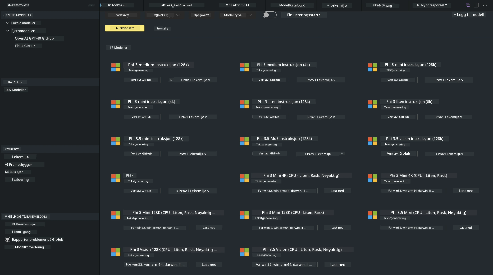
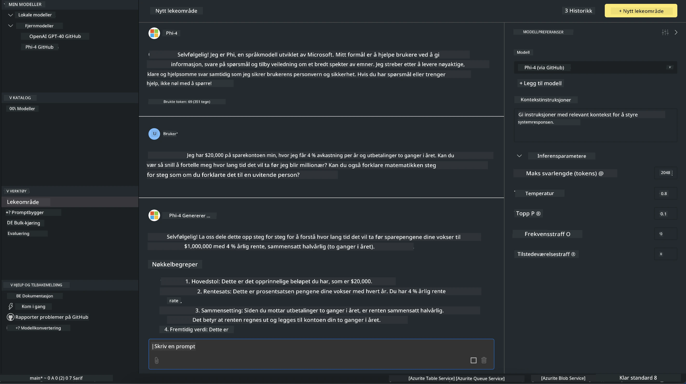

# Phi Family in AITK

[AI Toolkit for VS Code](https://marketplace.visualstudio.com/items?itemName=ms-windows-ai-studio.windows-ai-studio) forenkler utvikling av generative AI-applikasjoner ved å samle banebrytende AI-utviklingsverktøy og modeller fra Microsoft Foundry Catalog og andre kataloger som Hugging Face. Du vil kunne bla gjennom AI-modellkatalogen drevet av GitHub Models og Microsoft Foundry Model Catalogs, laste dem ned lokalt eller eksternt, finjustere, teste og bruke dem i applikasjonen din.

AI Toolkit Preview vil kjøre lokalt. Lokal inferens eller finjustering avhenger av den valgte modellen, du kan trenge GPU som NVIDIA CUDA GPU. Du kan også kjøre GitHub Models direkte med AITK.

## Komme i gang

[Lær mer om hvordan du installerer Windows subsystem for Linux](https://learn.microsoft.com/windows/wsl/install?WT.mc_id=aiml-137032-kinfeylo)

og [endre standard distribusjon](https://learn.microsoft.com/windows/wsl/install#change-the-default-linux-distribution-installed).

[AI Tooklit GitHub Repo](https://github.com/microsoft/vscode-ai-toolkit/)

- Windows, Linux, macOS
  
- For finjustering på både Windows og Linux trenger du en Nvidia GPU. I tillegg krever **Windows** subsystem for Linux med Ubuntu-distribusjon 18.4 eller nyere. [Lær mer om hvordan du installerer Windows subsystem for Linux](https://learn.microsoft.com/windows/wsl/install) og [endre standard distribusjon](https://learn.microsoft.com/windows/wsl/install#change-the-default-linux-distribution-installed).

### Installer AI Toolkit

AI Toolkit leveres som en [Visual Studio Code Extension](https://code.visualstudio.com/docs/setup/additional-components#_vs-code-extensions), så du må først installere [VS Code](https://code.visualstudio.com/docs/setup/windows?WT.mc_id=aiml-137032-kinfeylo) og laste ned AI Toolkit fra [VS Marketplace](https://marketplace.visualstudio.com/items?itemName=ms-windows-ai-studio.windows-ai-studio).
[AI Toolkit er tilgjengelig i Visual Studio Marketplace](https://marketplace.visualstudio.com/items?itemName=ms-windows-ai-studio.windows-ai-studio) og kan installeres som enhver annen VS Code-utvidelse. 

Hvis du ikke er kjent med hvordan man installerer VS Code-utvidelser, følg disse trinnene:

### Logg inn

1. I Aktivitetslinjen i VS Code velg **Extensions**
1. Skriv "AI Toolkit" i søkefeltet for utvidelser
1. Velg "AI Toolkit for Visual Studio code"
1. Velg **Install**

Nå er du klar til å bruke utvidelsen!

Du vil bli bedt om å logge inn på GitHub, så vennligst klikk "Allow" for å fortsette. Du blir videresendt til GitHub sin påloggingsside.

Vennligst logg inn og følg prosessstegene. Etter vellykket fullføring blir du sendt tilbake til VS Code.

Når utvidelsen er installert vil AI Toolkit-ikonet vises i Aktivitetslinjen.

La oss utforske tilgjengelige handlinger!

### Tilgjengelige handlinger

Hovedmenyen til AI Toolkit er organisert i  

- **Models**
- **Resources**
- **Playground**  
- **Fine-tuning**
- **Evaluation**

Disse finner du i Resources-seksjonen. For å komme i gang velg **Model Catalog**.

### Last ned en modell fra katalogen

Når du starter AI Toolkit fra VS Code sidelinje, kan du velge blant følgende alternativer:



- Finn en støttet modell fra **Model Catalog** og last den ned lokalt
- Test modell inferens i **Model Playground**
- Finjuster modellen lokalt eller eksternt i **Model Fine-tuning**
- Distribuer finjusterte modeller til skyen via kommandopaletten i AI Toolkit
- Evaluer modeller

> [!NOTE]
>
> **GPU vs CPU**
>
> Du vil legge merke til at modellkortene viser modellstørrelse, plattform og akseleratortype (CPU, GPU). For optimal ytelse på **Windows-enheter som har minst en GPU**, velg modellversjoner som kun målretter Windows.
>
> Dette sikrer at du har en modell optimalisert for DirectML-akseleratoren.
>
> Modellnavnene har formatet
>
> - `{model_name}-{accelerator}-{quantization}-{format}`.
>
> For å sjekke om du har en GPU på Windows-enheten din, åpne **Task Manager** og velg fanen **Performance**. Hvis du har GPU(er), vil de være oppført under navn som "GPU 0" eller "GPU 1".

### Kjør modellen i lekeplassen

Når alle parametrene er satt, klikk **Generate Project**.

Når modellen din er lastet ned, velg **Load in Playground** på modellkortet i katalogen:

- Start modellnedlasting
- Installer alle nødvendige forutsetninger og avhengigheter
- Opprett VS Code arbeidsområde



### Bruk REST API i din applikasjon 

AI Toolkit leveres med en lokal REST API webserver **på port 5272** som bruker [OpenAI chat completions format](https://platform.openai.com/docs/api-reference/chat/create). 

Dette gjør det mulig å teste applikasjonen din lokalt uten å måtte bruke en AI-modelltjeneste i skyen. For eksempel viser følgende JSON-fil hvordan man konfigurerer body til forespørselen:

```json
{
    "model": "Phi-4",
    "messages": [
        {
            "role": "user",
            "content": "what is the golden ratio?"
        }
    ],
    "temperature": 0.7,
    "top_p": 1,
    "top_k": 10,
    "max_tokens": 100,
    "stream": true
}
```

Du kan teste REST API med (for eksempel) [Postman](https://www.postman.com/) eller CURL (Client URL) verktøyet:

```bash
curl -vX POST http://127.0.0.1:5272/v1/chat/completions -H 'Content-Type: application/json' -d @body.json
```

### Bruke OpenAI klientbibliotek for Python

```python
from openai import OpenAI

client = OpenAI(
    base_url="http://127.0.0.1:5272/v1/", 
    api_key="x" # nødvendig for API-et, men ikke brukt
)

chat_completion = client.chat.completions.create(
    messages=[
        {
            "role": "user",
            "content": "what is the golden ratio?",
        }
    ],
    model="Phi-4",
)

print(chat_completion.choices[0].message.content)
```

### Bruke Azure OpenAI klientbibliotek for .NET

Legg til [Azure OpenAI klientbibliotek for .NET](https://www.nuget.org/packages/Azure.AI.OpenAI/) i prosjektet ditt via NuGet:

```bash
dotnet add {project_name} package Azure.AI.OpenAI --version 1.0.0-beta.17
```

Legg til en C#-fil kalt **OverridePolicy.cs** i prosjektet ditt og lim inn følgende kode:

```csharp
// OverridePolicy.cs
using Azure.Core.Pipeline;
using Azure.Core;

internal partial class OverrideRequestUriPolicy(Uri overrideUri)
    : HttpPipelineSynchronousPolicy
{
    private readonly Uri _overrideUri = overrideUri;

    public override void OnSendingRequest(HttpMessage message)
    {
        message.Request.Uri.Reset(_overrideUri);
    }
}
```

Lim deretter inn følgende kode i din **Program.cs**-fil:

```csharp
// Program.cs
using Azure.AI.OpenAI;

Uri localhostUri = new("http://localhost:5272/v1/chat/completions");

OpenAIClientOptions clientOptions = new();
clientOptions.AddPolicy(
    new OverrideRequestUriPolicy(localhostUri),
    Azure.Core.HttpPipelinePosition.BeforeTransport);
OpenAIClient client = new(openAIApiKey: "unused", clientOptions);

ChatCompletionsOptions options = new()
{
    DeploymentName = "Phi-4",
    Messages =
    {
        new ChatRequestSystemMessage("You are a helpful assistant. Be brief and succinct."),
        new ChatRequestUserMessage("What is the golden ratio?"),
    }
};

StreamingResponse<StreamingChatCompletionsUpdate> streamingChatResponse
    = await client.GetChatCompletionsStreamingAsync(options);

await foreach (StreamingChatCompletionsUpdate chatChunk in streamingChatResponse)
{
    Console.Write(chatChunk.ContentUpdate);
}
```


## Finjustering med AI Toolkit

- Kom i gang med modelloppdagelse og lekeplass.
- Modell finjustering og inferens ved bruk av lokale databehandlingsressurser.
- Fjernfinjustering og inferens ved bruk av Azure-ressurser

[Finjustering med AI Toolkit](../../03.FineTuning/Finetuning_VSCodeaitoolkit.md)

## AI Toolkit Q&A ressurser

Vennligst se vår [Q&A side](https://github.com/microsoft/vscode-ai-toolkit/blob/main/archive/QA.md) for de vanligste problemene og løsninger

---

<!-- CO-OP TRANSLATOR DISCLAIMER START -->
**Ansvarsfraskrivelse**:
Dette dokumentet er oversatt ved hjelp av AI-oversettelsestjenesten [Co-op Translator](https://github.com/Azure/co-op-translator). Selv om vi streber etter nøyaktighet, vennligst vær oppmerksom på at automatiske oversettelser kan inneholde feil eller unøyaktigheter. Det originale dokumentet på sitt opprinnelige språk skal anses som den autoritative kilden. For kritisk informasjon anbefales profesjonell menneskelig oversettelse. Vi er ikke ansvarlige for eventuelle misforståelser eller feiltolkninger som oppstår ved bruk av denne oversettelsen.
<!-- CO-OP TRANSLATOR DISCLAIMER END -->