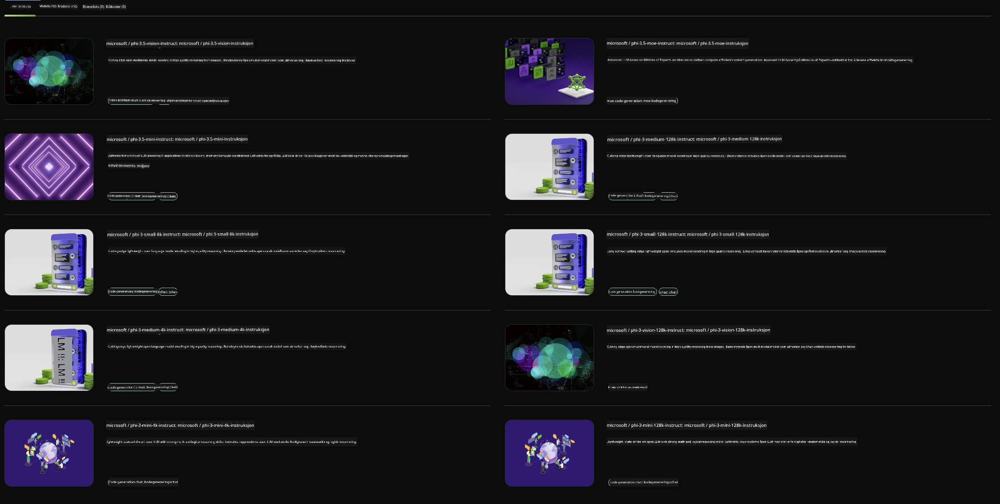

<!--
CO_OP_TRANSLATOR_METADATA:
{
  "original_hash": "7b08e277df2a9307f861ae54bc30c772",
  "translation_date": "2025-05-09T09:55:57+00:00",
  "source_file": "md/01.Introduction/02/06.NVIDIA.md",
  "language_code": "no"
}
-->
## Phi-familien i NVIDIA NIM

NVIDIA NIM er et sett med brukervennlige mikrotjenester designet for å akselerere utrullingen av generative AI-modeller på tvers av skyen, datasenteret og arbeidsstasjoner. NIM er kategorisert etter modellslekt og per modell. For eksempel bringer NVIDIA NIM for store språkmodeller (LLMs) kraften fra toppmoderne LLM-er til bedriftsapplikasjoner, og tilbyr enestående evner innen naturlig språkbehandling og forståelse.

NIM gjør det enkelt for IT- og DevOps-team å selvhoste store språkmodeller (LLMs) i egne administrerte miljøer, samtidig som utviklere får tilgang til bransjestandard-API-er som lar dem bygge kraftige medhjelpere, chatbots og AI-assistenter som kan forvandle virksomheten. Ved å utnytte NVIDIAs banebrytende GPU-akselerasjon og skalerbar utrulling, tilbyr NIM den raskeste veien til inferens med uovertruffen ytelse.

Du kan bruke NVIDIA NIM til å gjøre inferens på Phi Family Models



### **Eksempler - Phi-3-Vision i NVIDIA NIM**

Tenk deg at du har et bilde (`demo.png`) og ønsker å generere Python-kode som behandler dette bildet og lagrer en ny versjon av det (`phi-3-vision.jpg`).

Koden ovenfor automatiserer denne prosessen ved å:

1. Sette opp miljøet og nødvendige konfigurasjoner.
2. Lage en prompt som instruerer modellen til å generere den nødvendige Python-koden.
3. Sende prompten til modellen og samle inn den genererte koden.
4. Trekke ut og kjøre den genererte koden.
5. Vise originalbildet og det behandlede bildet.

Denne tilnærmingen utnytter kraften i AI for å automatisere bildebehandlingsoppgaver, noe som gjør det enklere og raskere å nå målene dine.

[Sample Code Solution](../../../../../code/06.E2E/E2E_Nvidia_NIM_Phi3_Vision.ipynb)

La oss gå gjennom hva hele koden gjør, steg for steg:

1. **Installer nødvendig pakke**:  
    ```python
    !pip install langchain_nvidia_ai_endpoints -U
    ```  
    Denne kommandoen installerer `langchain_nvidia_ai_endpoints`-pakken og sørger for at det er siste versjon.

2. **Importer nødvendige moduler**:  
    ```python
    from langchain_nvidia_ai_endpoints import ChatNVIDIA
    import getpass
    import os
    import base64
    ```  
    Disse importene henter inn nødvendige moduler for å kommunisere med NVIDIA AI-endepunkter, håndtere passord sikkert, samhandle med operativsystemet og kode/dekode data i base64-format.

3. **Sett opp API-nøkkel**:  
    ```python
    if not os.getenv("NVIDIA_API_KEY"):
        os.environ["NVIDIA_API_KEY"] = getpass.getpass("Enter your NVIDIA API key: ")
    ```  
    Denne koden sjekker om miljøvariabelen `NVIDIA_API_KEY` er satt. Hvis ikke, ber den brukeren om å taste inn API-nøkkelen på en sikker måte.

4. **Definer modell og bildefilbane**:  
    ```python
    model = 'microsoft/phi-3-vision-128k-instruct'
    chat = ChatNVIDIA(model=model)
    img_path = './imgs/demo.png'
    ```  
    Her settes modellen som skal brukes, det opprettes en instans av `ChatNVIDIA` med den valgte modellen, og stien til bildefilen defineres.

5. **Lag tekstprompt**:  
    ```python
    text = "Please create Python code for image, and use plt to save the new picture under imgs/ and name it phi-3-vision.jpg."
    ```  
    Denne delen definerer en tekstprompt som instruerer modellen til å generere Python-kode for bildebehandling.

6. **Koding av bilde i Base64**:  
    ```python
    with open(img_path, "rb") as f:
        image_b64 = base64.b64encode(f.read()).decode()
    image = f''
    ```  
    Denne koden leser bildefilen, koder den i base64, og lager en HTML image-tag med den kodede dataen.

7. **Kombiner tekst og bilde til prompt**:  
    ```python
    prompt = f"{text} {image}"
    ```  
    Her kombineres tekstprompten og HTML-bilde-taggen til én enkelt streng.

8. **Generer kode med ChatNVIDIA**:  
    ```python
    code = ""
    for chunk in chat.stream(prompt):
        print(chunk.content, end="")
        code += chunk.content
    ```  
    Denne koden sender prompten til `ChatNVIDIA` model and collects the generated code in chunks, printing and appending each chunk to the `code`-strengen.

9. **Trekk ut Python-kode fra generert innhold**:  
    ```python
    begin = code.index('```python') + 9  
    code = code[begin:]  
    end = code.index('```')
    code = code[:end]
    ```  
    Denne delen trekker ut den faktiske Python-koden fra det genererte innholdet ved å fjerne markdown-formattering.

10. **Kjør den genererte koden**:  
    ```python
    import subprocess
    result = subprocess.run(["python", "-c", code], capture_output=True)
    ```  
    Her kjøres den uttrukne Python-koden som en underprosess, og utdataene fanges opp.

11. **Vis bilder**:  
    ```python
    from IPython.display import Image, display
    display(Image(filename='./imgs/phi-3-vision.jpg'))
    display(Image(filename='./imgs/demo.png'))
    ```  
    Disse linjene viser bildene ved hjelp av `IPython.display`-modulen.

**Ansvarsfraskrivelse**:  
Dette dokumentet er oversatt ved hjelp av AI-oversettelsestjenesten [Co-op Translator](https://github.com/Azure/co-op-translator). Selv om vi streber etter nøyaktighet, vennligst vær oppmerksom på at automatiske oversettelser kan inneholde feil eller unøyaktigheter. Det opprinnelige dokumentet på originalspråket bør betraktes som den autoritative kilden. For kritisk informasjon anbefales profesjonell menneskelig oversettelse. Vi er ikke ansvarlige for misforståelser eller feiltolkninger som oppstår ved bruk av denne oversettelsen.