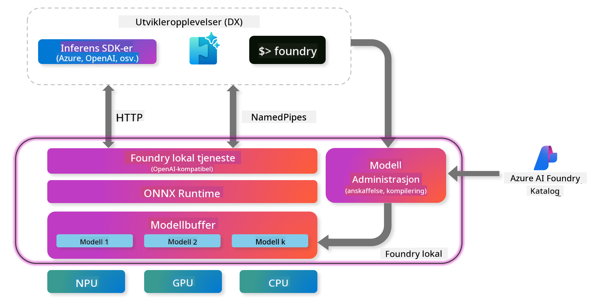

<!--
CO_OP_TRANSLATOR_METADATA:
{
  "original_hash": "52973a5680a65a810aa80b7036afd31f",
  "translation_date": "2025-07-16T19:47:54+00:00",
  "source_file": "md/01.Introduction/02/07.FoundryLocal.md",
  "language_code": "no"
}
-->
## Komme i gang med Phi-Family-modeller i Foundry Local

### Introduksjon til Foundry Local

Foundry Local er en kraftig AI-inferensløsning på enheten som bringer AI-funksjonalitet på bedriftsnivå direkte til din lokale maskinvare. Denne veiledningen vil lede deg gjennom oppsett og bruk av Phi-Family-modeller med Foundry Local, og gir deg full kontroll over AI-arbeidsbelastningene dine samtidig som personvernet ivaretas og kostnadene reduseres.

Foundry Local gir fordeler innen ytelse, personvern, tilpasning og kostnad ved å kjøre AI-modeller lokalt på enheten din. Det integreres sømløst i dine eksisterende arbeidsflyter og applikasjoner gjennom en intuitiv CLI, SDK og REST API.




### Hvorfor velge Foundry Local?

Å forstå fordelene med Foundry Local vil hjelpe deg med å ta informerte beslutninger om din AI-distribusjonsstrategi:

- **Inferens på enheten:** Kjør modeller lokalt på din egen maskinvare, reduser kostnadene og behold all data på enheten din.

- **Modelltilpasning:** Velg mellom forhåndsinnstilte modeller eller bruk dine egne for å møte spesifikke krav og bruksområder.

- **Kostnadseffektivitet:** Fjern løpende kostnader for skytjenester ved å bruke eksisterende maskinvare, noe som gjør AI mer tilgjengelig.

- **Sømløs integrasjon:** Koble til applikasjonene dine via SDK, API-endepunkter eller CLI, med enkel skalering til Azure AI Foundry når behovene vokser.

> **Getting Started Note:** Denne veiledningen fokuserer på bruk av Foundry Local gjennom CLI og SDK. Du vil lære begge tilnærmingene for å hjelpe deg med å velge den beste metoden for ditt brukstilfelle.

## Del 1: Sette opp Foundry Local CLI

### Steg 1: Installasjon

Foundry Local CLI er inngangsporten din for å administrere og kjøre AI-modeller lokalt. La oss starte med å installere den på systemet ditt.

**Støttede plattformer:** Windows og macOS

For detaljerte installasjonsinstruksjoner, vennligst se [offisiell Foundry Local-dokumentasjon](https://github.com/microsoft/Foundry-Local/blob/main/README.md).

### Steg 2: Utforske tilgjengelige modeller

Når du har installert Foundry Local CLI, kan du finne ut hvilke modeller som er tilgjengelige for ditt brukstilfelle. Denne kommandoen viser alle støttede modeller:


```bash
foundry model list
```

### Steg 3: Forstå Phi Family-modellene

Phi Family tilbyr et utvalg modeller optimalisert for ulike bruksområder og maskinvarekonfigurasjoner. Her er Phi-modellene som er tilgjengelige i Foundry Local:

**Tilgjengelige Phi-modeller:** 

- **phi-3.5-mini** - Kompakt modell for grunnleggende oppgaver
- **phi-3-mini-128k** - Utvidet kontekstversjon for lengre samtaler
- **phi-3-mini-4k** - Standard kontekstmodell for generell bruk
- **phi-4** - Avansert modell med forbedrede egenskaper
- **phi-4-mini** - Lettvektsversjon av Phi-4
- **phi-4-mini-reasoning** - Spesialisert for komplekse resonnementoppgaver

> **Maskinvarekompatibilitet:** Hver modell kan konfigureres for ulik maskinvareakselerasjon (CPU, GPU) avhengig av systemets kapasitet.

### Steg 4: Kjøre din første Phi-modell

La oss starte med et praktisk eksempel. Vi kjører `phi-4-mini-reasoning`-modellen, som er spesielt god til å løse komplekse problemer steg for steg.


**Kommando for å kjøre modellen:**

```bash
foundry model run Phi-4-mini-reasoning-generic-cpu
```

> **Første gangs oppsett:** Når du kjører en modell for første gang, vil Foundry Local automatisk laste den ned til din lokale enhet. Nedlastningstiden varierer med nettverkshastigheten, så vær tålmodig under oppsettet.

### Steg 5: Teste modellen med et ekte problem

Nå skal vi teste modellen med et klassisk logikkproblem for å se hvordan den håndterer stegvis resonnement:

**Eksempelproblem:**

```txt
Please calculate the following step by step: Now there are pheasants and rabbits in the same cage, there are thirty-five heads on top and ninety-four legs on the bottom, how many pheasants and rabbits are there?
```

**Forventet oppførsel:** Modellen skal dele opp problemet i logiske steg, og bruke at fasaner har 2 ben og kaniner har 4 ben for å løse ligningssystemet.

**Resultater:**


## Del 2: Bygge applikasjoner med Foundry Local SDK

### Hvorfor bruke SDK?

Mens CLI er perfekt for testing og raske interaksjoner, gjør SDK det mulig å integrere Foundry Local i applikasjonene dine programmessig. Dette åpner for muligheter som:

- Å bygge skreddersydde AI-drevne applikasjoner
- Lage automatiserte arbeidsflyter
- Integrere AI-funksjoner i eksisterende systemer
- Utvikle chatboter og interaktive verktøy

### Støttede programmeringsspråk

Foundry Local tilbyr SDK-støtte for flere programmeringsspråk for å passe dine utviklingspreferanser:

**📦 Tilgjengelige SDK-er:**

- **C# (.NET):** [SDK-dokumentasjon og eksempler](https://github.com/microsoft/Foundry-Local/tree/main/sdk/cs)
- **Python:** [SDK-dokumentasjon og eksempler](https://github.com/microsoft/Foundry-Local/tree/main/sdk/python)
- **JavaScript:** [SDK-dokumentasjon og eksempler](https://github.com/microsoft/Foundry-Local/tree/main/sdk/js)
- **Rust:** [SDK-dokumentasjon og eksempler](https://github.com/microsoft/Foundry-Local/tree/main/sdk/rust)

### Neste steg

1. **Velg SDK-en du foretrekker** basert på ditt utviklingsmiljø
2. **Følg SDK-spesifikk dokumentasjon** for detaljerte implementasjonsveiledninger
3. **Start med enkle eksempler** før du bygger mer komplekse applikasjoner
4. **Utforsk eksempel-koden** som følger med hver SDK-repo

## Konklusjon

Du har nå lært hvordan du:
- ✅ Installerer og setter opp Foundry Local CLI
- ✅ Oppdager og kjører Phi Family-modeller
- ✅ Tester modeller med virkelige problemer
- ✅ Forstår SDK-alternativer for applikasjonsutvikling

Foundry Local gir et kraftig grunnlag for å bringe AI-funksjonalitet direkte til ditt lokale miljø, og gir deg kontroll over ytelse, personvern og kostnader, samtidig som du beholder fleksibiliteten til å skalere til skyløsninger ved behov.

**Ansvarsfraskrivelse**:  
Dette dokumentet er oversatt ved hjelp av AI-oversettelsestjenesten [Co-op Translator](https://github.com/Azure/co-op-translator). Selv om vi streber etter nøyaktighet, vennligst vær oppmerksom på at automatiske oversettelser kan inneholde feil eller unøyaktigheter. Det opprinnelige dokumentet på originalspråket skal anses som den autoritative kilden. For kritisk informasjon anbefales profesjonell menneskelig oversettelse. Vi er ikke ansvarlige for eventuelle misforståelser eller feiltolkninger som oppstår ved bruk av denne oversettelsen.