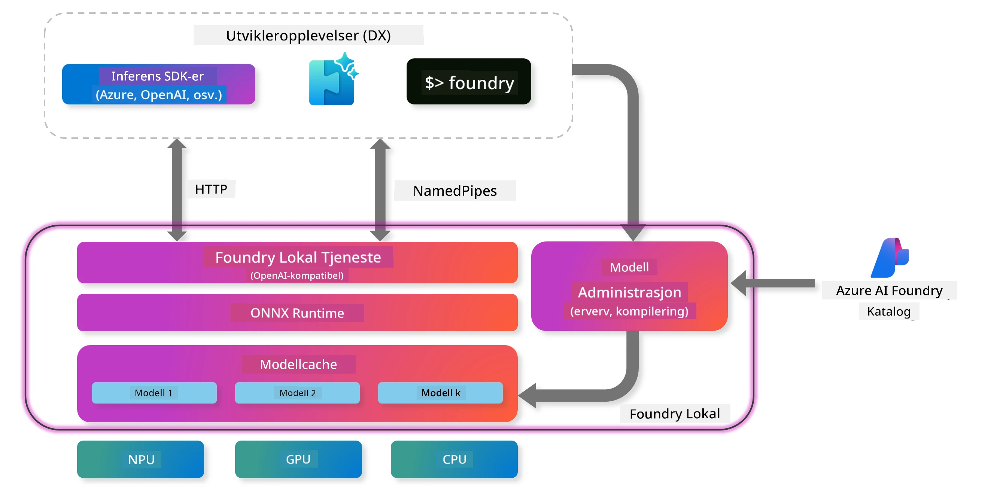
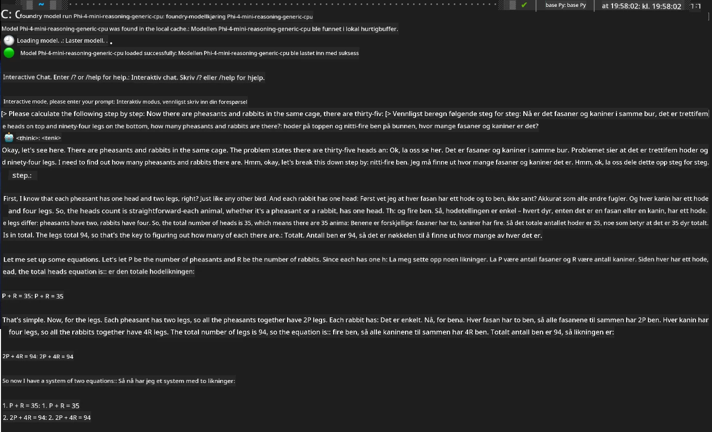

## Komme i gang med Phi-familie modeller i Foundry Local

### Introduksjon til Foundry Local

Foundry Local er en kraftig AI-inferensløsning på enheten som bringer AI-funksjonalitet på bedriftsnivå direkte til din lokale maskinvare. Denne veiledningen vil hjelpe deg med å sette opp og bruke Phi-familie modeller med Foundry Local, og gir deg full kontroll over AI-arbeidsmengdene dine samtidig som du opprettholder personvern og reduserer kostnader.

Foundry Local tilbyr ytelse, personvern, tilpasning og kostnadsfordeler ved å kjøre AI-modeller lokalt på enheten din. Den integreres sømløst i dine eksisterende arbeidsflyter og applikasjoner gjennom et intuitivt CLI, SDK og REST API.




### Hvorfor velge Foundry Local?

Å forstå fordelene med Foundry Local vil hjelpe deg å ta informerte beslutninger om din AI-distribusjonsstrategi:

- **Inferens på enheten:** Kjør modeller lokalt på din egen maskinvare, reduser kostnadene dine samtidig som alle data forblir på enheten.

- **Modelltilpasning:** Velg mellom forhåndsinnstilte modeller eller bruk dine egne for å møte spesifikke krav og bruksområder.

- **Kostnadseffektivitet:** Eliminér løpende kostnader for skybaserte tjenester ved å bruke eksisterende maskinvare, noe som gjør AI mer tilgjengelig.

- **Sømløs integrasjon:** Koble til applikasjonene dine via SDK, API-endepunkter eller CLI, med enkel skalering til Microsoft Foundry ettersom behovene dine vokser.

> **Kom i gang-merknad:** Denne veiledningen fokuserer på bruk av Foundry Local gjennom CLI- og SDK-grensesnitt. Du vil lære begge tilnærmingene for å hjelpe deg å velge den beste metoden for ditt brukstilfelle.

## Del 1: Sette opp Foundry Local CLI

### Steg 1: Installasjon

Foundry Local CLI er din inngangsport til å administrere og kjøre AI-modeller lokalt. La oss starte med å installere det på systemet ditt.

**Støttede plattformer:** Windows og macOS

For detaljerte installasjonsinstruksjoner, vennligst se [offisiell Foundry Local dokumentasjon](https://github.com/microsoft/Foundry-Local/blob/main/README.md).

### Steg 2: Utforske tilgjengelige modeller

Når du har installert Foundry Local CLI, kan du oppdage hvilke modeller som er tilgjengelige for ditt brukstilfelle. Denne kommandoen viser deg alle støttede modeller:


```bash
foundry model list
```

### Steg 3: Forstå Phi-familie modeller

Phi-familien tilbyr et utvalg modeller optimalisert for ulike bruksområder og maskinvarekonfigurasjoner. Her er Phi-modellene tilgjengelige i Foundry Local:

**Tilgjengelige Phi-modeller:** 

- **phi-3.5-mini** - Kompakt modell for grunnleggende oppgaver
- **phi-3-mini-128k** - Utvidet kontekstversjon for lengre samtaler
- **phi-3-mini-4k** - Standard kontekstmodell for generell bruk
- **phi-4** - Avansert modell med forbedrede evner
- **phi-4-mini** - Lettvektsversjon av Phi-4
- **phi-4-mini-reasoning** - Spesialisert for komplekse resonneringsoppgaver

> **Maskinvarekompatibilitet:** Hver modell kan konfigureres for ulik maskinvareakselerasjon (CPU, GPU) avhengig av systemets kapasiteter.

### Steg 4: Kjøre din første Phi-modell

La oss starte med et praktisk eksempel. Vi kjører modellen `phi-4-mini-reasoning`, som utmerker seg i å løse komplekse problemer steg for steg.


**Kommando for å kjøre modellen:**

```bash
foundry model run Phi-4-mini-reasoning-generic-cpu
```

> **Første gangs oppsett:** Når du kjører en modell for første gang, vil Foundry Local automatisk laste den ned til din lokale enhet. Nedlastningstiden varierer avhengig av nettverkshastigheten din, så vær tålmodig under første oppsett.

### Steg 5: Teste modellen med et ekte problem

La oss nå teste modellen vår med et klassisk logikkproblem for å se hvordan den presterer steg-for-steg resonnering:

**Eksempelsproblem:**

```txt
Please calculate the following step by step: Now there are pheasants and rabbits in the same cage, there are thirty-five heads on top and ninety-four legs on the bottom, how many pheasants and rabbits are there?
```

**Forventet oppførsel:** Modellen skal bryte ned dette problemet i logiske steg, ved å bruke at fasaner har 2 ben og kaniner har 4 ben for å løse ligningssystemet.

**Resultater:**



## Del 2: Bygge applikasjoner med Foundry Local SDK

### Hvorfor bruke SDK?

Mens CLI er perfekt for testing og raske interaksjoner, gjør SDK det mulig å integrere Foundry Local i applikasjonene dine programmessig. Dette åpner muligheter for:

- Å bygge tilpassede AI-drevne applikasjoner
- Lage automatiserte arbeidsflyter
- Integrere AI-funksjoner i eksisterende systemer
- Utvikle chatboter og interaktive verktøy

### Støttede programmeringsspråk

Foundry Local tilbyr SDK-støtte for flere programmeringsspråk for å passe dine utviklingspreferanser:

**📦 Tilgjengelige SDK-er:**

- **C# (.NET):** [SDK dokumentasjon og eksempler](https://github.com/microsoft/Foundry-Local/tree/main/sdk/cs)
- **Python:** [SDK dokumentasjon og eksempler](https://github.com/microsoft/Foundry-Local/tree/main/sdk/python)
- **JavaScript:** [SDK dokumentasjon og eksempler](https://github.com/microsoft/Foundry-Local/tree/main/sdk/js)
- **Rust:** [SDK dokumentasjon og eksempler](https://github.com/microsoft/Foundry-Local/tree/main/sdk/rust)

### Neste steg

1. **Velg din foretrukne SDK** basert på ditt utviklingsmiljø
2. **Følg SDK-spesifikk dokumentasjon** for detaljerte implementasjonsveiledninger
3. **Start med enkle eksempler** før du bygger komplekse applikasjoner
4. **Utforsk eksempel-kode** som tilbys i hver SDK-repo

## Konklusjon

Du har nå lært hvordan du:
- ✅ Installerer og setter opp Foundry Local CLI
- ✅ Oppdager og kjører Phi-familie modeller
- ✅ Tester modeller med virkelige problemer
- ✅ Forstår SDK-alternativer for applikasjonsutvikling

Foundry Local tilbyr et kraftig grunnlag for å bringe AI-funksjoner direkte til ditt lokale miljø, gir deg kontroll over ytelse, personvern og kostnader samtidig som du beholder fleksibiliteten til å skalere til skyløsninger når det trengs.

---

<!-- CO-OP TRANSLATOR DISCLAIMER START -->
**Ansvarsfraskrivelse**:
Dette dokumentet er oversatt ved hjelp av AI-oversettelsestjenesten [Co-op Translator](https://github.com/Azure/co-op-translator). Selv om vi streber etter nøyaktighet, vennligst vær oppmerksom på at automatiske oversettelser kan inneholde feil eller unøyaktigheter. Det opprinnelige dokumentet på dets originale språk skal anses som den autoritative kilden. For kritisk informasjon anbefales profesjonell menneskelig oversettelse. Vi er ikke ansvarlige for eventuelle misforståelser eller feiltolkninger som oppstår ved bruk av denne oversettelsen.
<!-- CO-OP TRANSLATOR DISCLAIMER END -->