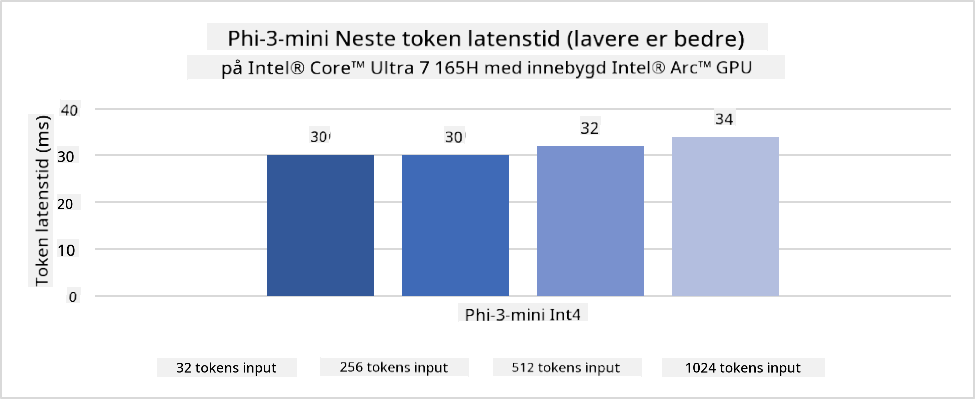
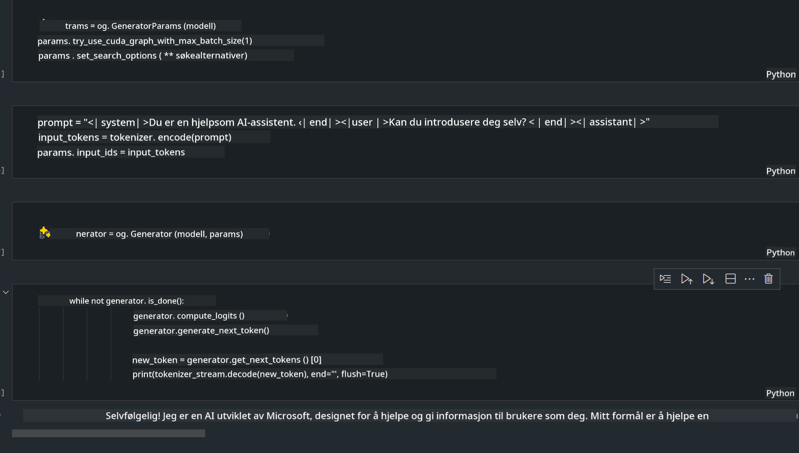

<!--
CO_OP_TRANSLATOR_METADATA:
{
  "original_hash": "e08ce816e23ad813244a09ca34ebb8ac",
  "translation_date": "2025-07-16T20:03:02+00:00",
  "source_file": "md/01.Introduction/03/AIPC_Inference.md",
  "language_code": "no"
}
-->
# **Inferens Phi-3 på AI-PC**

Med fremskrittene innen generativ AI og forbedringer i maskinvaren til edge-enheter, kan et økende antall generative AI-modeller nå integreres i brukernes Bring Your Own Device (BYOD)-enheter. AI-PCer er blant disse modellene. Fra og med 2024 har Intel, AMD og Qualcomm samarbeidet med PC-produsenter for å introdusere AI-PCer som muliggjør distribusjon av lokaliserte generative AI-modeller gjennom maskinvareendringer. I denne diskusjonen vil vi fokusere på Intel AI-PCer og utforske hvordan man kan distribuere Phi-3 på en Intel AI-PC.

### Hva er NPU

En NPU (Neural Processing Unit) er en dedikert prosessor eller prosesseringsenhet på en større SoC, spesielt designet for å akselerere nevrale nettverksoperasjoner og AI-oppgaver. I motsetning til generelle CPUer og GPUer, er NPUs optimalisert for datadrevet parallellbehandling, noe som gjør dem svært effektive til å håndtere store mengder multimedia-data som videoer og bilder, samt data for nevrale nettverk. De er spesielt dyktige til AI-relaterte oppgaver, som talegjenkjenning, bakgrunnsuskarphet i videosamtaler og bilde- eller videoredigering som objektdeteksjon.

## NPU vs GPU

Selv om mange AI- og maskinlæringsoppgaver kjøres på GPUer, er det en viktig forskjell mellom GPUer og NPUer.  
GPUer er kjent for sine parallellbehandlingsmuligheter, men ikke alle GPUer er like effektive utover grafikkbehandling. NPUs er derimot spesialbygget for komplekse beregninger involvert i nevrale nettverksoperasjoner, noe som gjør dem svært effektive for AI-oppgaver.

Kort sagt, NPUs er matematiske eksperter som gir AI-beregninger et kraftig løft, og de spiller en nøkkelrolle i den nye æraen med AI-PCer!

***Dette eksempelet er basert på Intels nyeste Intel Core Ultra-prosessor***

## **1. Bruk NPU for å kjøre Phi-3-modellen**

Intel® NPU-enhet er en AI-inferensakselerator integrert med Intel-klient-CPUer, fra og med Intel® Core™ Ultra-generasjonen av CPUer (tidligere kjent som Meteor Lake). Den muliggjør energieffektiv utførelse av kunstige nevrale nettverksoppgaver.




**Intel NPU Acceleration Library**

Intel NPU Acceleration Library [https://github.com/intel/intel-npu-acceleration-library](https://github.com/intel/intel-npu-acceleration-library) er et Python-bibliotek designet for å øke effektiviteten i applikasjonene dine ved å utnytte kraften til Intel Neural Processing Unit (NPU) for å utføre høyhastighetsberegninger på kompatibel maskinvare.

Eksempel på Phi-3-mini på AI-PC drevet av Intel® Core™ Ultra-prosessorer.


Installer Python-biblioteket med pip

```bash

   pip install intel-npu-acceleration-library

```

***Merk*** Prosjektet er fortsatt under utvikling, men referansemodellen er allerede veldig komplett.

### **Kjøre Phi-3 med Intel NPU Acceleration Library**

Ved bruk av Intel NPU-akselerasjon påvirker ikke dette biblioteket den tradisjonelle kodingsprosessen. Du trenger bare å bruke dette biblioteket for å kvantisere den opprinnelige Phi-3-modellen, for eksempel FP16, INT8, INT4, slik som

```python
from transformers import AutoTokenizer, pipeline,TextStreamer
from intel_npu_acceleration_library import NPUModelForCausalLM, int4
from intel_npu_acceleration_library.compiler import CompilerConfig
import warnings

model_id = "microsoft/Phi-3-mini-4k-instruct"

compiler_conf = CompilerConfig(dtype=int4)
model = NPUModelForCausalLM.from_pretrained(
    model_id, use_cache=True, config=compiler_conf, attn_implementation="sdpa"
).eval()

tokenizer = AutoTokenizer.from_pretrained(model_id)

text_streamer = TextStreamer(tokenizer, skip_prompt=True)
```

Etter at kvantiseringen er vellykket, fortsetter du med å kalle NPU for å kjøre Phi-3-modellen.

```python
generation_args = {
   "max_new_tokens": 1024,
   "return_full_text": False,
   "temperature": 0.3,
   "do_sample": False,
   "streamer": text_streamer,
}

pipe = pipeline(
   "text-generation",
   model=model,
   tokenizer=tokenizer,
)

query = "<|system|>You are a helpful AI assistant.<|end|><|user|>Can you introduce yourself?<|end|><|assistant|>"

with warnings.catch_warnings():
    warnings.simplefilter("ignore")
    pipe(query, **generation_args)
```

Når koden kjøres, kan vi se NPU sin status via Oppgavebehandling


***Eksempler*** : [AIPC_NPU_DEMO.ipynb](../../../../../code/03.Inference/AIPC/AIPC_NPU_DEMO.ipynb)

## **2. Bruk DirectML + ONNX Runtime for å kjøre Phi-3-modellen**

### **Hva er DirectML**

[DirectML](https://github.com/microsoft/DirectML) er et høyytelses, maskinvareakselerert DirectX 12-bibliotek for maskinlæring. DirectML gir GPU-akselerasjon for vanlige maskinlæringsoppgaver på et bredt spekter av støttet maskinvare og drivere, inkludert alle DirectX 12-kompatible GPUer fra leverandører som AMD, Intel, NVIDIA og Qualcomm.

Når det brukes alene, er DirectML API et lavnivå DirectX 12-bibliotek og egner seg for høyytelses, lav-latens applikasjoner som rammeverk, spill og andre sanntidsapplikasjoner. Den sømløse interoperabiliteten til DirectML med Direct3D 12, samt lav overhead og samsvar på tvers av maskinvare, gjør DirectML ideelt for å akselerere maskinlæring når både høy ytelse og pålitelighet og forutsigbarhet av resultater på tvers av maskinvare er kritisk.

***Merk*** : Den nyeste DirectML støtter allerede NPU (https://devblogs.microsoft.com/directx/introducing-neural-processor-unit-npu-support-in-directml-developer-preview/)

### DirectML og CUDA når det gjelder kapasiteter og ytelse:

**DirectML** er et maskinlæringsbibliotek utviklet av Microsoft. Det er designet for å akselerere maskinlæringsoppgaver på Windows-enheter, inkludert stasjonære PCer, bærbare og edge-enheter.  
- DX12-basert: DirectML er bygget på DirectX 12 (DX12), som gir bred maskinvarestøtte på tvers av GPUer, inkludert både NVIDIA og AMD.  
- Bredere støtte: Siden det utnytter DX12, kan DirectML fungere med alle GPUer som støtter DX12, også integrerte GPUer.  
- Bildebehandling: DirectML behandler bilder og annen data ved hjelp av nevrale nettverk, noe som gjør det egnet for oppgaver som bildegjenkjenning, objektdeteksjon og mer.  
- Enkel oppsett: Oppsett av DirectML er enkelt, og det krever ikke spesifikke SDKer eller biblioteker fra GPU-produsenter.  
- Ytelse: I noen tilfeller presterer DirectML godt og kan være raskere enn CUDA, spesielt for visse arbeidsmengder.  
- Begrensninger: Det finnes imidlertid tilfeller hvor DirectML kan være tregere, spesielt for float16 store batch-størrelser.

**CUDA** er NVIDIAs plattform for parallell databehandling og programmeringsmodell. Den lar utviklere utnytte kraften i NVIDIA GPUer for generell databehandling, inkludert maskinlæring og vitenskapelige simuleringer.  
- NVIDIA-spesifikk: CUDA er tett integrert med NVIDIA GPUer og er spesielt designet for dem.  
- Høyt optimalisert: Den gir utmerket ytelse for GPU-akselererte oppgaver, spesielt med NVIDIA GPUer.  
- Bredt brukt: Mange maskinlæringsrammeverk og biblioteker (som TensorFlow og PyTorch) har støtte for CUDA.  
- Tilpasning: Utviklere kan finjustere CUDA-innstillinger for spesifikke oppgaver, noe som kan gi optimal ytelse.  
- Begrensninger: CUDA sin avhengighet av NVIDIA-maskinvare kan være begrensende hvis du ønsker bredere kompatibilitet på tvers av ulike GPUer.

### Valg mellom DirectML og CUDA

Valget mellom DirectML og CUDA avhenger av ditt spesifikke brukstilfelle, tilgjengelig maskinvare og preferanser.  
Hvis du ønsker bredere kompatibilitet og enkel oppsett, kan DirectML være et godt valg. Men hvis du har NVIDIA GPUer og trenger høyt optimalisert ytelse, er CUDA fortsatt et sterkt alternativ. Kort sagt, både DirectML og CUDA har sine styrker og svakheter, så vurder dine krav og tilgjengelig maskinvare når du tar en beslutning.

### **Generativ AI med ONNX Runtime**

I AI-æraen er portabilitet av AI-modeller svært viktig. ONNX Runtime kan enkelt distribuere trente modeller til forskjellige enheter. Utviklere trenger ikke å bekymre seg for inferensrammeverket og kan bruke et enhetlig API for å fullføre modellinferens. I generativ AI-æraen har ONNX Runtime også utført kodeoptimalisering (https://onnxruntime.ai/docs/genai/). Gjennom den optimaliserte ONNX Runtime kan den kvantiserte generative AI-modellen infereres på ulike enheter. I Generative AI med ONNX Runtime kan du inferere AI-modell-API gjennom Python, C#, C / C++. Selvfølgelig kan distribusjon på iPhone dra nytte av C++ sin Generative AI med ONNX Runtime API.

[Eksempelkode](https://github.com/Azure-Samples/Phi-3MiniSamples/tree/main/onnx)

***Kompiler generativ AI med ONNX Runtime-bibliotek***

```bash

winget install --id=Kitware.CMake  -e

git clone https://github.com/microsoft/onnxruntime.git

cd .\onnxruntime\

./build.bat --build_shared_lib --skip_tests --parallel --use_dml --config Release

cd ../

git clone https://github.com/microsoft/onnxruntime-genai.git

cd .\onnxruntime-genai\

mkdir ort

cd ort

mkdir include

mkdir lib

copy ..\onnxruntime\include\onnxruntime\core\providers\dml\dml_provider_factory.h ort\include

copy ..\onnxruntime\include\onnxruntime\core\session\onnxruntime_c_api.h ort\include

copy ..\onnxruntime\build\Windows\Release\Release\*.dll ort\lib

copy ..\onnxruntime\build\Windows\Release\Release\onnxruntime.lib ort\lib

python build.py --use_dml


```

**Installer bibliotek**

```bash

pip install .\onnxruntime_genai_directml-0.3.0.dev0-cp310-cp310-win_amd64.whl

```

Dette er kjøringsresultatet



***Eksempler*** : [AIPC_DirectML_DEMO.ipynb](../../../../../code/03.Inference/AIPC/AIPC_DirectML_DEMO.ipynb)

## **3. Bruk Intel OpenVino for å kjøre Phi-3-modellen**

### **Hva er OpenVINO**

[OpenVINO](https://github.com/openvinotoolkit/openvino) er et åpen kildekode-verktøysett for å optimalisere og distribuere dype læringsmodeller. Det gir forbedret ytelse for dype læringsmodeller innen syn, lyd og språk fra populære rammeverk som TensorFlow, PyTorch og flere. Kom i gang med OpenVINO. OpenVINO kan også brukes i kombinasjon med CPU og GPU for å kjøre Phi-3-modellen.

***Merk***: For øyeblikket støtter ikke OpenVINO NPU.

### **Installer OpenVINO-biblioteket**

```bash

 pip install git+https://github.com/huggingface/optimum-intel.git

 pip install git+https://github.com/openvinotoolkit/nncf.git

 pip install openvino-nightly

```

### **Kjøre Phi-3 med OpenVINO**

Som med NPU, fullfører OpenVINO kjøringen av generative AI-modeller ved å kjøre kvantiserte modeller. Vi må først kvantisere Phi-3-modellen og fullføre modellkvantiseringen via kommandolinjen med optimum-cli.

**INT4**

```bash

optimum-cli export openvino --model "microsoft/Phi-3-mini-4k-instruct" --task text-generation-with-past --weight-format int4 --group-size 128 --ratio 0.6  --sym  --trust-remote-code ./openvinomodel/phi3/int4

```

**FP16**

```bash

optimum-cli export openvino --model "microsoft/Phi-3-mini-4k-instruct" --task text-generation-with-past --weight-format fp16 --trust-remote-code ./openvinomodel/phi3/fp16

```

det konverterte formatet, slik som dette


Last inn modellbaner (model_dir), relaterte konfigurasjoner (ov_config = {"PERFORMANCE_HINT": "LATENCY", "NUM_STREAMS": "1", "CACHE_DIR": ""}), og maskinvareakselererte enheter (GPU.0) gjennom OVModelForCausalLM

```python

ov_model = OVModelForCausalLM.from_pretrained(
     model_dir,
     device='GPU.0',
     ov_config=ov_config,
     config=AutoConfig.from_pretrained(model_dir, trust_remote_code=True),
     trust_remote_code=True,
)

```

Når koden kjøres, kan vi se GPU-status via Oppgavebehandling


***Eksempler*** : [AIPC_OpenVino_Demo.ipynb](../../../../../code/03.Inference/AIPC/AIPC_OpenVino_Demo.ipynb)

### ***Merk*** : De tre metodene ovenfor har alle sine fordeler, men det anbefales å bruke NPU-akselerasjon for inferens på AI-PC.

**Ansvarsfraskrivelse**:  
Dette dokumentet er oversatt ved hjelp av AI-oversettelsestjenesten [Co-op Translator](https://github.com/Azure/co-op-translator). Selv om vi streber etter nøyaktighet, vennligst vær oppmerksom på at automatiske oversettelser kan inneholde feil eller unøyaktigheter. Det opprinnelige dokumentet på originalspråket skal anses som den autoritative kilden. For kritisk informasjon anbefales profesjonell menneskelig oversettelse. Vi er ikke ansvarlige for eventuelle misforståelser eller feiltolkninger som oppstår ved bruk av denne oversettelsen.