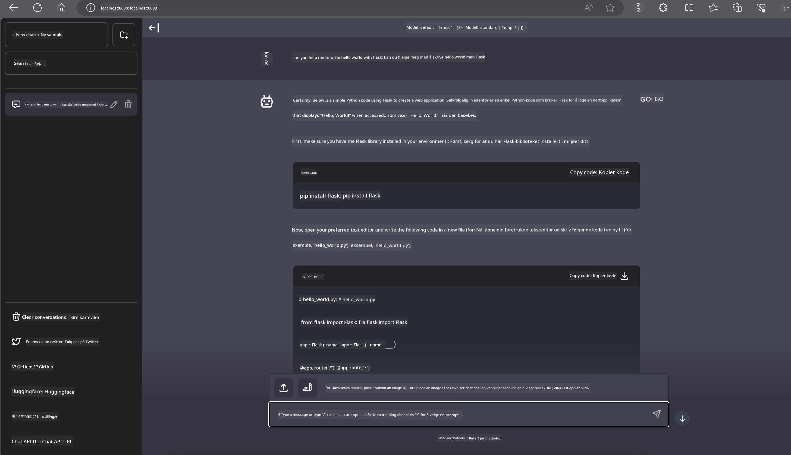

<!--
CO_OP_TRANSLATOR_METADATA:
{
  "original_hash": "be4101a30d98e95a71d42c276e8bcd37",
  "translation_date": "2025-05-09T11:39:38+00:00",
  "source_file": "md/01.Introduction/03/Jetson_Inference.md",
  "language_code": "no"
}
-->
# **Inferens Phi-3 på Nvidia Jetson**

Nvidia Jetson er en serie innebygde datakort fra Nvidia. Jetson TK1, TX1 og TX2-modellene har alle en Tegra-prosessor (eller SoC) fra Nvidia som integrerer en ARM-basert sentral prosesseringsenhet (CPU). Jetson er et lavstrømssystem designet for å akselerere maskinlæringsapplikasjoner. Nvidia Jetson brukes av profesjonelle utviklere for å lage banebrytende AI-produkter på tvers av alle bransjer, og av studenter og entusiaster for praktisk AI-læring og spennende prosjekter. SLM distribueres på edge-enheter som Jetson, noe som muliggjør bedre implementering av industrielle generative AI-brukstilfeller.

## Distribusjon på NVIDIA Jetson:
Utviklere som jobber med autonome roboter og innebygde enheter kan dra nytte av Phi-3 Mini. Phi-3 sin relativt lille størrelse gjør den ideell for edge-distribusjon. Parametere har blitt nøye justert under trening for å sikre høy nøyaktighet i svarene.

### TensorRT-LLM-optimalisering:
NVIDIAs [TensorRT-LLM-bibliotek](https://github.com/NVIDIA/TensorRT-LLM?WT.mc_id=aiml-138114-kinfeylo) optimaliserer inferens for store språkmodeller. Det støtter Phi-3 Mini sin lange kontekstvindu, og forbedrer både gjennomstrømning og latenstid. Optimaliseringene inkluderer teknikker som LongRoPE, FP8 og inflight batching.

### Tilgjengelighet og distribusjon:
Utviklere kan utforske Phi-3 Mini med 128K kontekstvindu på [NVIDIAs AI-side](https://www.nvidia.com/en-us/ai-data-science/generative-ai/). Den er pakket som en NVIDIA NIM, en mikrotjeneste med et standard API som kan distribueres hvor som helst. I tillegg finnes [TensorRT-LLM-implementeringene på GitHub](https://github.com/NVIDIA/TensorRT-LLM).

## **1. Forberedelser**

a. Jetson Orin NX / Jetson NX

b. JetPack 5.1.2+
   
c. Cuda 11.8
   
d. Python 3.8+

## **2. Kjøre Phi-3 på Jetson**

Vi kan velge [Ollama](https://ollama.com) eller [LlamaEdge](https://llamaedge.com)

Hvis du ønsker å bruke gguf i både skyen og på edge-enheter samtidig, kan LlamaEdge forstås som WasmEdge (WasmEdge er en lettvekts, høyytelses, skalerbar WebAssembly-runtime som passer for cloud native, edge og desentraliserte applikasjoner. Den støtter serverløse applikasjoner, innebygde funksjoner, mikrotjenester, smarte kontrakter og IoT-enheter. Du kan distribuere gguf sin kvantitative modell til edge-enheter og skyen gjennom LlamaEdge.


Her er stegene for å bruke den

1. Installer og last ned relaterte biblioteker og filer

```bash

curl -sSf https://raw.githubusercontent.com/WasmEdge/WasmEdge/master/utils/install.sh | bash -s -- --plugin wasi_nn-ggml

curl -LO https://github.com/LlamaEdge/LlamaEdge/releases/latest/download/llama-api-server.wasm

curl -LO https://github.com/LlamaEdge/chatbot-ui/releases/latest/download/chatbot-ui.tar.gz

tar xzf chatbot-ui.tar.gz

```

**Merk**: llama-api-server.wasm og chatbot-ui må være i samme mappe

2. Kjør skriptene i terminalen

```bash

wasmedge --dir .:. --nn-preload default:GGML:AUTO:{Your gguf path} llama-api-server.wasm -p phi-3-chat

```

Her er kjøringsresultatet



***Eksempelkode*** [Phi-3 mini WASM Notebook Sample](https://github.com/Azure-Samples/Phi-3MiniSamples/tree/main/wasm)

Oppsummert representerer Phi-3 Mini et stort steg fremover innen språkmodellering, med en kombinasjon av effektivitet, kontekstbevissthet og NVIDIAs optimaliseringsevner. Enten du bygger roboter eller edge-applikasjoner, er Phi-3 Mini et kraftig verktøy å kjenne til.

**Ansvarsfraskrivelse**:  
Dette dokumentet er oversatt ved hjelp av AI-oversettelsestjenesten [Co-op Translator](https://github.com/Azure/co-op-translator). Selv om vi streber etter nøyaktighet, vennligst vær oppmerksom på at automatiske oversettelser kan inneholde feil eller unøyaktigheter. Det opprinnelige dokumentet på originalspråket skal betraktes som den autoritative kilden. For kritisk informasjon anbefales profesjonell menneskelig oversettelse. Vi er ikke ansvarlige for eventuelle misforståelser eller feiltolkninger som oppstår ved bruk av denne oversettelsen.