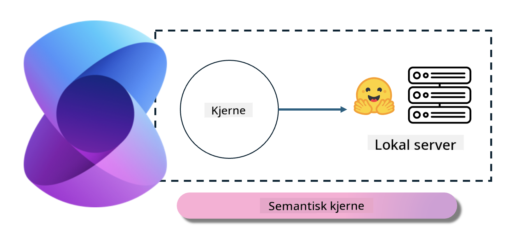
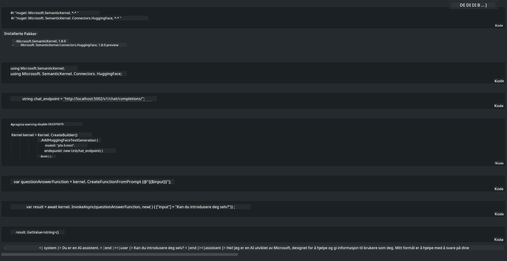

<!--
CO_OP_TRANSLATOR_METADATA:
{
  "original_hash": "bcf5dd7031db0031abdb9dd0c05ba118",
  "translation_date": "2025-05-09T12:05:37+00:00",
  "source_file": "md/01.Introduction/03/Local_Server_Inference.md",
  "language_code": "no"
}
-->
# **Inferens Phi-3 på lokal server**

Vi kan distribuere Phi-3 på en lokal server. Brukere kan velge [Ollama](https://ollama.com) eller [LM Studio](https://llamaedge.com) løsninger, eller de kan skrive egen kode. Du kan koble Phi-3 sine lokale tjenester gjennom [Semantic Kernel](https://github.com/microsoft/semantic-kernel?WT.mc_id=aiml-138114-kinfeylo) eller [Langchain](https://www.langchain.com/) for å bygge Copilot-applikasjoner.

## **Bruk Semantic Kernel for å få tilgang til Phi-3-mini**

I Copilot-applikasjonen lager vi applikasjoner gjennom Semantic Kernel / LangChain. Denne typen applikasjonsrammeverk er vanligvis kompatibel med Azure OpenAI Service / OpenAI-modeller, og kan også støtte open source-modeller på Hugging Face og lokale modeller. Hva gjør vi hvis vi vil bruke Semantic Kernel for å få tilgang til Phi-3-mini? Med .NET som eksempel kan vi kombinere det med Hugging Face Connector i Semantic Kernel. Som standard kan det koble til modell-id-en på Hugging Face (første gang du bruker det, lastes modellen ned fra Hugging Face, noe som tar lang tid). Du kan også koble til den lokalbygde tjenesten. Sammenlignet med de to anbefaler vi å bruke sistnevnte fordi den har høyere grad av selvstendighet, spesielt i bedriftsapplikasjoner.

Fra figuren kan man se at tilgang til lokale tjenester gjennom Semantic Kernel enkelt kan koble til den selvbygde Phi-3-mini modellserveren. Her er kjøringsresultatet:

***Eksempelkode*** https://github.com/kinfey/Phi3MiniSamples/tree/main/semantickernel

**Ansvarsfraskrivelse**:  
Dette dokumentet er oversatt ved hjelp av AI-oversettelsestjenesten [Co-op Translator](https://github.com/Azure/co-op-translator). Selv om vi streber etter nøyaktighet, vennligst vær oppmerksom på at automatiske oversettelser kan inneholde feil eller unøyaktigheter. Det opprinnelige dokumentet på originalspråket skal anses som den autoritative kilden. For kritisk informasjon anbefales profesjonell menneskelig oversettelse. Vi er ikke ansvarlige for eventuelle misforståelser eller feiltolkninger som oppstår ved bruk av denne oversettelsen.