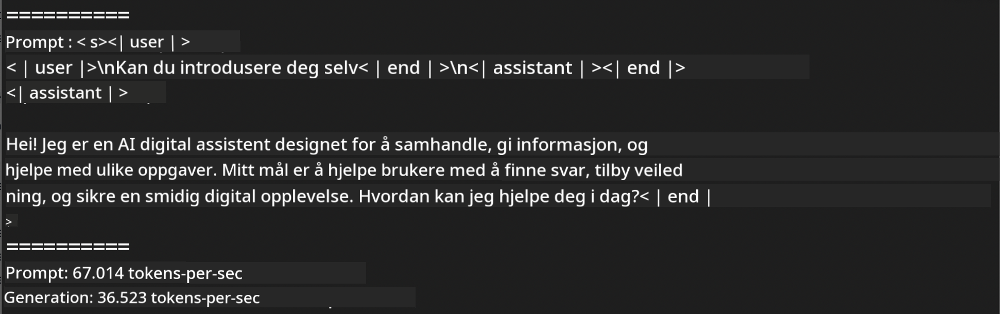
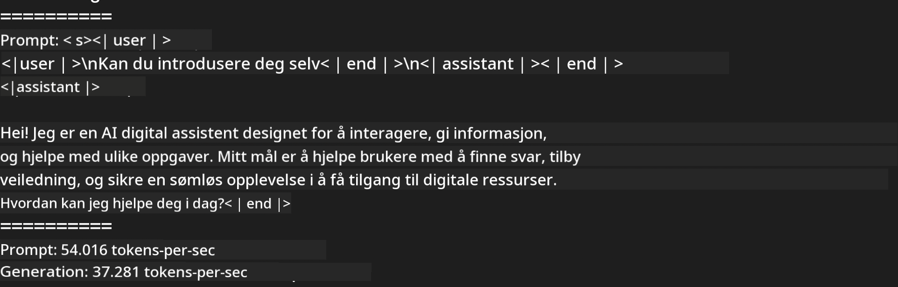

<!--
CO_OP_TRANSLATOR_METADATA:
{
  "original_hash": "dcb656f3d206fc4968e236deec5d4384",
  "translation_date": "2025-05-09T12:15:06+00:00",
  "source_file": "md/01.Introduction/03/MLX_Inference.md",
  "language_code": "no"
}
-->
# **Inferens Phi-3 med Apple MLX-rammeverk**

## **Hva er MLX-rammeverket**

MLX er et array-rammeverk for maskinlæringsforskning på Apple Silicon, utviklet av Apple maskinlæringsforskning.

MLX er designet av maskinlæringsforskere for maskinlæringsforskere. Rammeverket er laget for å være brukervennlig, men samtidig effektivt for trening og distribusjon av modeller. Designet av rammeverket er også konseptuelt enkelt. Vi ønsker å gjøre det enkelt for forskere å utvide og forbedre MLX med mål om rask utforskning av nye ideer.

LLMer kan akselereres på Apple Silicon-enheter gjennom MLX, og modeller kan kjøres lokalt på en svært praktisk måte.

## **Bruke MLX til inferens av Phi-3-mini**

### **1. Sett opp MLX-miljøet ditt**

1. Python 3.11.x  
2. Installer MLX-biblioteket

```bash

pip install mlx-lm

```

### **2. Kjøre Phi-3-mini i Terminal med MLX**

```bash

python -m mlx_lm.generate --model microsoft/Phi-3-mini-4k-instruct --max-token 2048 --prompt  "<|user|>\nCan you introduce yourself<|end|>\n<|assistant|>"

```

Resultatet (mitt miljø er Apple M1 Max, 64GB) er



### **3. Kvantisere Phi-3-mini med MLX i Terminal**

```bash

python -m mlx_lm.convert --hf-path microsoft/Phi-3-mini-4k-instruct

```

***Merk:*** Modellen kan kvantiseres gjennom mlx_lm.convert, og standard kvantisering er INT4. Dette eksempelet kvantiserer Phi-3-mini til INT4.

Modellen kan kvantiseres via mlx_lm.convert, og standard kvantisering er INT4. I dette eksempelet kvantiseres Phi-3-mini til INT4. Etter kvantisering lagres den i standardmappen ./mlx_model.

Vi kan teste den kvantiserte modellen med MLX fra terminalen

```bash

python -m mlx_lm.generate --model ./mlx_model/ --max-token 2048 --prompt  "<|user|>\nCan you introduce yourself<|end|>\n<|assistant|>"

```

Resultatet er



### **4. Kjøre Phi-3-mini med MLX i Jupyter Notebook**


***Merk:*** Vennligst les dette eksemplet [klikk på denne lenken](../../../../../code/03.Inference/MLX/MLX_DEMO.ipynb)

## **Ressurser**

1. Lær mer om Apple MLX-rammeverket [https://ml-explore.github.io](https://ml-explore.github.io/mlx/build/html/index.html)

2. Apple MLX GitHub-repo [https://github.com/ml-explore](https://github.com/ml-explore)

**Ansvarsfraskrivelse**:  
Dette dokumentet er oversatt ved hjelp av AI-oversettelsestjenesten [Co-op Translator](https://github.com/Azure/co-op-translator). Selv om vi streber etter nøyaktighet, vennligst vær oppmerksom på at automatiske oversettelser kan inneholde feil eller unøyaktigheter. Det originale dokumentet på det opprinnelige språket bør anses som den autoritative kilden. For kritisk informasjon anbefales profesjonell menneskelig oversettelse. Vi er ikke ansvarlige for eventuelle misforståelser eller feiltolkninger som oppstår ved bruk av denne oversettelsen.