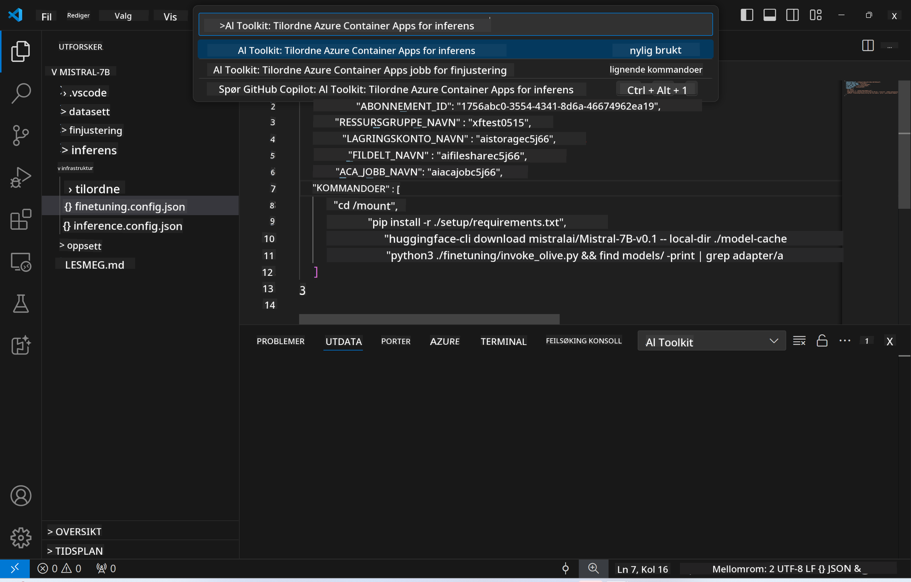
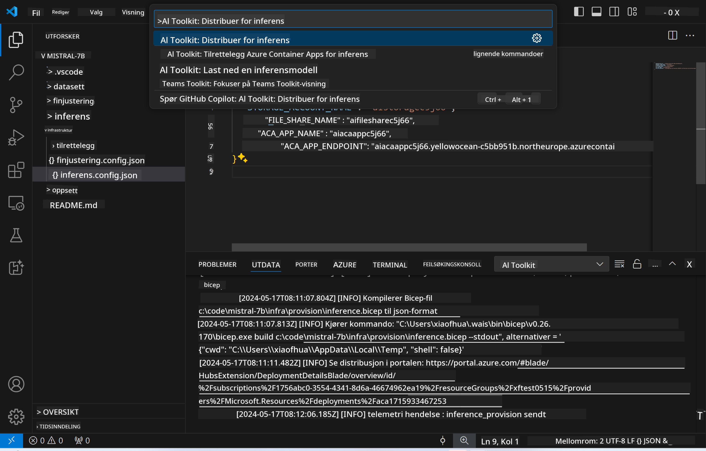
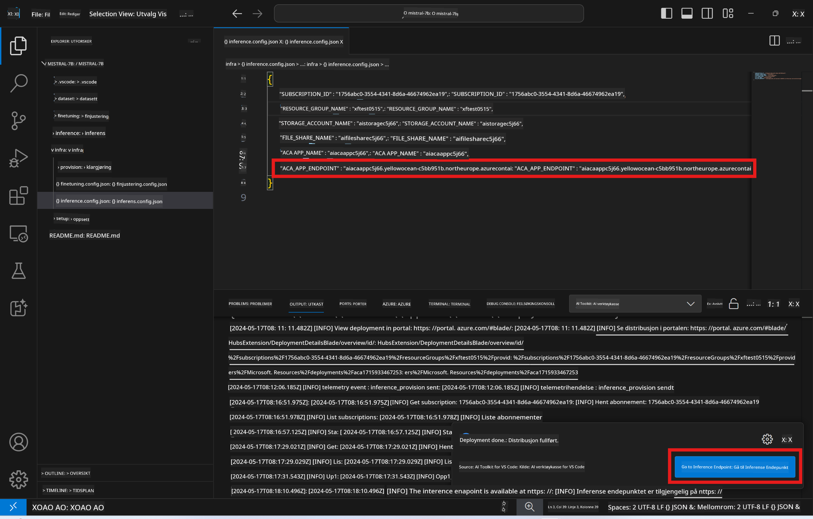

<!--
CO_OP_TRANSLATOR_METADATA:
{
  "original_hash": "a54cd3d65b6963e4e8ce21e143c3ab04",
  "translation_date": "2025-05-09T12:41:36+00:00",
  "source_file": "md/01.Introduction/03/Remote_Interence.md",
  "language_code": "no"
}
-->
# Fjerninferens med den finjusterte modellen

Etter at adapterne er trent i det eksterne miljøet, bruk en enkel Gradio-applikasjon for å samhandle med modellen.


### Opprett Azure-ressurser  
Du må sette opp Azure-ressursene for fjerninferens ved å kjøre `AI Toolkit: Provision Azure Container Apps for inference` fra kommandopaletten. Under oppsettet vil du bli bedt om å velge Azure-abonnement og ressursgruppe.  

   
Som standard bør abonnement og ressursgruppe for inferens samsvare med de som ble brukt under finjusteringen. Inferensen vil bruke det samme Azure Container App-miljøet og få tilgang til modellen og modeladapteren lagret i Azure Files, som ble opprettet under finjusteringssteget. 

## Bruke AI Toolkit

### Distribusjon for inferens  
Hvis du ønsker å endre inferenskoden eller laste inn inferensmodellen på nytt, kjør `AI Toolkit: Deploy for inference`-kommandoen. Dette vil synkronisere din nyeste kode med ACA og starte replikaen på nytt.  



Når distribusjonen er fullført, er modellen klar til evaluering via dette endepunktet.

### Tilgang til inferens-API

Du kan få tilgang til inferens-API-et ved å klikke på "*Go to Inference Endpoint*" knappen som vises i VSCode-varslingen. Alternativt finner du web-API-endepunktet under `ACA_APP_ENDPOINT` i `./infra/inference.config.json` og i output-panelet.



> **Merk:** Inferens-endepunktet kan ta noen minutter før det er fullt operativt.

## Inferenskomponenter inkludert i malen
 
| Mappe | Innhold |
| ------ |--------- |
| `infra` | Inneholder alle nødvendige konfigurasjoner for fjernoperasjoner. |
| `infra/provision/inference.parameters.json` | Inneholder parametere for bicep-maler, brukt til å opprette Azure-ressurser for inferens. |
| `infra/provision/inference.bicep` | Inneholder maler for opprettelse av Azure-ressurser for inferens. |
| `infra/inference.config.json` | Konfigurasjonsfilen, generert av `AI Toolkit: Provision Azure Container Apps for inference`-kommandoen. Den brukes som input for andre fjernkommandoer i paletten. |

### Bruke AI Toolkit til å konfigurere Azure Resource Provision  
Konfigurer [AI Toolkit](https://marketplace.visualstudio.com/items?itemName=ms-windows-ai-studio.windows-ai-studio)

Opprett Azure Container Apps for inferens ved å redigere ` command.

You can find configuration parameters in `./infra/provision/inference.parameters.json` file. Here are the details:
| Parameter | Description |
| --------- |------------ |
| `defaultCommands` | This is the commands to initiate a web API. |
| `maximumInstanceCount` | This parameter sets the maximum capacity of GPU instances. |
| `location` | This is the location where Azure resources are provisioned. The default value is the same as the chosen resource group's location. |
| `storageAccountName`, `fileShareName` `acaEnvironmentName`, `acaEnvironmentStorageName`, `acaAppName`,  `acaLogAnalyticsName` | These parameters are used to name the Azure resources for provision. By default, they will be same to the fine-tuning resource name. You can input a new, unused resource name to create your own custom-named resources, or you can input the name of an already existing Azure resource if you'd prefer to use that. For details, refer to the section [Using existing Azure Resources](../../../../../md/01.Introduction/03). |

### Using Existing Azure Resources

By default, the inference provision use the same Azure Container App Environment, Storage Account, Azure File Share, and Azure Log Analytics that were used for fine-tuning. A separate Azure Container App is created solely for the inference API. 

If you have customized the Azure resources during the fine-tuning step or want to use your own existing Azure resources for inference, specify their names in the `./infra/inference.parameters.json` filen. Deretter kjører du `AI Toolkit: Provision Azure Container Apps for inference`-kommandoen fra kommandopaletten. Dette oppdaterer eventuelle angitte ressurser og oppretter de som mangler.

For eksempel, hvis du har et eksisterende Azure container-miljø, bør din `./infra/finetuning.parameters.json` se slik ut:

```json
{
    "$schema": "https://schema.management.azure.com/schemas/2019-04-01/deploymentParameters.json#",
    "contentVersion": "1.0.0.0",
    "parameters": {
      ...
      "acaEnvironmentName": {
        "value": "<your-aca-env-name>"
      },
      "acaEnvironmentStorageName": {
        "value": null
      },
      ...
    }
  }
```

### Manuell opprettelse  
Hvis du foretrekker å konfigurere Azure-ressursene manuelt, kan du bruke de medfølgende bicep-filene i `./infra/provision` folders. If you have already set up and configured all the Azure resources without using the AI Toolkit command palette, you can simply enter the resource names in the `inference.config.json`-filen.

For eksempel:

```json
{
  "SUBSCRIPTION_ID": "<your-subscription-id>",
  "RESOURCE_GROUP_NAME": "<your-resource-group-name>",
  "STORAGE_ACCOUNT_NAME": "<your-storage-account-name>",
  "FILE_SHARE_NAME": "<your-file-share-name>",
  "ACA_APP_NAME": "<your-aca-name>",
  "ACA_APP_ENDPOINT": "<your-aca-endpoint>"
}
```

**Ansvarsfraskrivelse**:  
Dette dokumentet er oversatt ved hjelp av AI-oversettelsestjenesten [Co-op Translator](https://github.com/Azure/co-op-translator). Selv om vi streber etter nøyaktighet, vær oppmerksom på at automatiske oversettelser kan inneholde feil eller unøyaktigheter. Det originale dokumentet på det opprinnelige språket bør betraktes som den autoritative kilden. For kritisk informasjon anbefales profesjonell menneskelig oversettelse. Vi er ikke ansvarlige for eventuelle misforståelser eller feiltolkninger som oppstår ved bruk av denne oversettelsen.