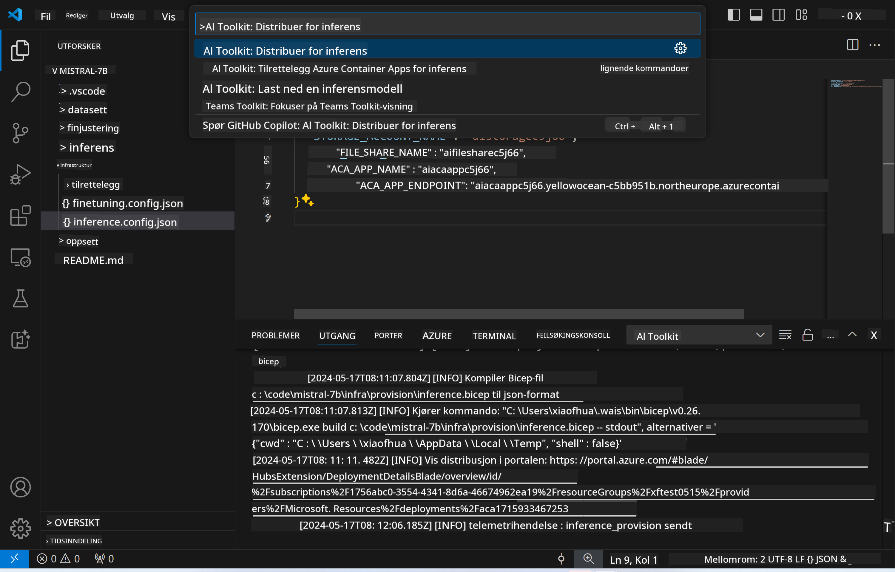

<!--
CO_OP_TRANSLATOR_METADATA:
{
  "original_hash": "a54cd3d65b6963e4e8ce21e143c3ab04",
  "translation_date": "2025-07-16T21:19:54+00:00",
  "source_file": "md/01.Introduction/03/Remote_Interence.md",
  "language_code": "no"
}
-->
# Fjerninferens med den finjusterte modellen

Etter at adapterne er trent i det eksterne miljøet, kan du bruke en enkel Gradio-applikasjon for å samhandle med modellen.


### Opprett Azure-ressurser  
Du må sette opp Azure-ressursene for fjerninferens ved å kjøre `AI Toolkit: Provision Azure Container Apps for inference` fra kommandopaletten. Under denne oppsettprosessen blir du bedt om å velge Azure-abonnement og ressursgruppe.  

   
Som standard bør abonnementet og ressursgruppen for inferens være de samme som de som ble brukt til finjusteringen. Inferensen vil bruke det samme Azure Container App-miljøet og få tilgang til modellen og modelladapteren som er lagret i Azure Files, og som ble generert under finjusteringssteget.

## Bruke AI Toolkit

### Distribusjon for inferens  
Hvis du ønsker å endre inferenskoden eller laste inn inferensmodellen på nytt, kjør kommandoen `AI Toolkit: Deploy for inference`. Dette vil synkronisere din nyeste kode med ACA og starte replikatet på nytt.



Etter at distribusjonen er fullført, er modellen klar for evaluering via dette endepunktet.

### Tilgang til inferens-API

Du kan få tilgang til inferens-API-et ved å klikke på "*Go to Inference Endpoint*" knappen som vises i VSCode-varslingen. Alternativt kan web-API-endepunktet finnes under `ACA_APP_ENDPOINT` i `./infra/inference.config.json` og i utgangspanelet.


> **Note:** Inferens-endepunktet kan ta noen minutter før det er fullt operativt.

## Inferenskomponenter inkludert i malen

| Mappe | Innhold |
| ------ |--------- |
| `infra` | Inneholder alle nødvendige konfigurasjoner for fjernoperasjoner. |
| `infra/provision/inference.parameters.json` | Inneholder parametere for bicep-maler, brukt til å opprette Azure-ressurser for inferens. |
| `infra/provision/inference.bicep` | Inneholder maler for opprettelse av Azure-ressurser for inferens. |
| `infra/inference.config.json` | Konfigurasjonsfilen, generert av kommandoen `AI Toolkit: Provision Azure Container Apps for inference`. Den brukes som input for andre fjernkommandoer i paletten. |

### Bruke AI Toolkit for å konfigurere Azure-ressursopprettelse  
Konfigurer [AI Toolkit](https://marketplace.visualstudio.com/items?itemName=ms-windows-ai-studio.windows-ai-studio)

Kjør kommandoen `Provision Azure Container Apps for inference`.

Du finner konfigurasjonsparametere i filen `./infra/provision/inference.parameters.json`. Her er detaljene:  
| Parameter | Beskrivelse |
| --------- |------------ |
| `defaultCommands` | Kommandoene som starter et web-API. |
| `maximumInstanceCount` | Setter maksimal kapasitet for GPU-instanser. |
| `location` | Lokasjonen der Azure-ressursene opprettes. Standardverdien er den samme som ressursgruppens lokasjon. |
| `storageAccountName`, `fileShareName`, `acaEnvironmentName`, `acaEnvironmentStorageName`, `acaAppName`, `acaLogAnalyticsName` | Disse parameterne brukes til å navngi Azure-ressursene som opprettes. Som standard vil de være de samme som ressursnavnet brukt under finjusteringen. Du kan angi et nytt, ubrukt ressursnavn for å lage egne tilpassede ressurser, eller du kan angi navnet på en eksisterende Azure-ressurs hvis du ønsker å bruke den. For detaljer, se avsnittet [Using existing Azure Resources](../../../../../md/01.Introduction/03). |

### Bruke eksisterende Azure-ressurser

Som standard bruker inferensopprettelsen det samme Azure Container App-miljøet, Storage Account, Azure File Share og Azure Log Analytics som ble brukt under finjusteringen. En egen Azure Container App opprettes kun for inferens-API-et.

Hvis du har tilpasset Azure-ressursene under finjusteringen eller ønsker å bruke dine egne eksisterende Azure-ressurser for inferens, spesifiser navnene deres i filen `./infra/inference.parameters.json`. Kjør deretter kommandoen `AI Toolkit: Provision Azure Container Apps for inference` fra kommandopaletten. Dette oppdaterer eventuelle angitte ressurser og oppretter de som mangler.

For eksempel, hvis du har et eksisterende Azure container-miljø, bør din `./infra/finetuning.parameters.json` se slik ut:

```json
{
    "$schema": "https://schema.management.azure.com/schemas/2019-04-01/deploymentParameters.json#",
    "contentVersion": "1.0.0.0",
    "parameters": {
      ...
      "acaEnvironmentName": {
        "value": "<your-aca-env-name>"
      },
      "acaEnvironmentStorageName": {
        "value": null
      },
      ...
    }
  }
```

### Manuell opprettelse  
Hvis du foretrekker å konfigurere Azure-ressursene manuelt, kan du bruke de medfølgende bicep-filene i `./infra/provision`-mappene. Hvis du allerede har satt opp og konfigurert alle Azure-ressursene uten å bruke AI Toolkit-kommandopaletten, kan du enkelt legge inn ressursnavnene i `inference.config.json`-filen.

For eksempel:

```json
{
  "SUBSCRIPTION_ID": "<your-subscription-id>",
  "RESOURCE_GROUP_NAME": "<your-resource-group-name>",
  "STORAGE_ACCOUNT_NAME": "<your-storage-account-name>",
  "FILE_SHARE_NAME": "<your-file-share-name>",
  "ACA_APP_NAME": "<your-aca-name>",
  "ACA_APP_ENDPOINT": "<your-aca-endpoint>"
}
```

**Ansvarsfraskrivelse**:  
Dette dokumentet er oversatt ved hjelp av AI-oversettelsestjenesten [Co-op Translator](https://github.com/Azure/co-op-translator). Selv om vi streber etter nøyaktighet, vennligst vær oppmerksom på at automatiske oversettelser kan inneholde feil eller unøyaktigheter. Det opprinnelige dokumentet på originalspråket skal anses som den autoritative kilden. For kritisk informasjon anbefales profesjonell menneskelig oversettelse. Vi er ikke ansvarlige for eventuelle misforståelser eller feiltolkninger som oppstår ved bruk av denne oversettelsen.