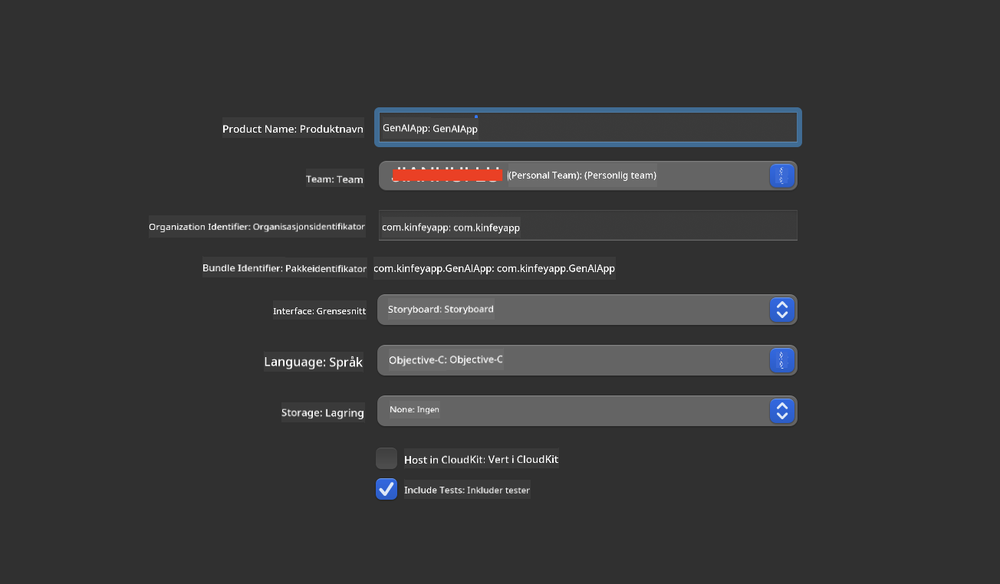
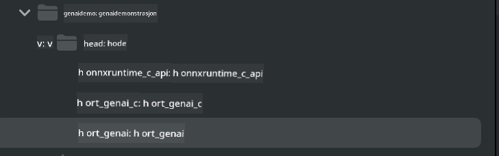

<!--
CO_OP_TRANSLATOR_METADATA:
{
  "original_hash": "82af197df38d25346a98f1f0e84d1698",
  "translation_date": "2025-07-16T20:22:20+00:00",
  "source_file": "md/01.Introduction/03/iOS_Inference.md",
  "language_code": "no"
}
-->
# **Inferens Phi-3 på iOS**

Phi-3-mini er en ny serie modeller fra Microsoft som muliggjør distribusjon av store språkmodeller (LLMs) på edge-enheter og IoT-enheter. Phi-3-mini er tilgjengelig for iOS, Android og Edge Device-distribusjoner, noe som gjør det mulig å bruke generativ AI i BYOD-miljøer. Følgende eksempel viser hvordan du distribuerer Phi-3-mini på iOS.

## **1. Forberedelser**

- **a.** macOS 14+
- **b.** Xcode 15+
- **c.** iOS SDK 17.x (iPhone 14 A16 eller nyere)
- **d.** Installer Python 3.10+ (Conda anbefales)
- **e.** Installer Python-biblioteket: `python-flatbuffers`
- **f.** Installer CMake

### Semantic Kernel og inferens

Semantic Kernel er et applikasjonsrammeverk som lar deg lage apper som er kompatible med Azure OpenAI Service, OpenAI-modeller og til og med lokale modeller. Å få tilgang til lokale tjenester via Semantic Kernel gjør det enkelt å integrere med din selvhostede Phi-3-mini modellserver.

### Kalle kvantiserte modeller med Ollama eller LlamaEdge

Mange brukere foretrekker å bruke kvantiserte modeller for å kjøre modeller lokalt. [Ollama](https://ollama.com) og [LlamaEdge](https://llamaedge.com) lar brukere kalle ulike kvantiserte modeller:

#### **Ollama**

Du kan kjøre `ollama run phi3` direkte eller konfigurere det offline. Lag en Modelfile med banen til din `gguf`-fil. Eksempelkode for å kjøre Phi-3-mini kvantisert modell:

```gguf
FROM {Add your gguf file path}
TEMPLATE \"\"\"<|user|> .Prompt<|end|> <|assistant|>\"\"\"
PARAMETER stop <|end|>
PARAMETER num_ctx 4096
```

#### **LlamaEdge**

Hvis du ønsker å bruke `gguf` både i skyen og på edge-enheter samtidig, er LlamaEdge et godt valg.

## **2. Kompilere ONNX Runtime for iOS**

```bash

git clone https://github.com/microsoft/onnxruntime.git

cd onnxruntime

./build.sh --build_shared_lib --ios --skip_tests --parallel --build_dir ./build_ios --ios --apple_sysroot iphoneos --osx_arch arm64 --apple_deploy_target 17.5 --cmake_generator Xcode --config Release

cd ../

```

### **Merk**

- **a.** Før kompilering, sørg for at Xcode er riktig konfigurert og sett det som aktiv utviklermappe i terminalen:

    ```bash
    sudo xcode-select -switch /Applications/Xcode.app/Contents/Developer
    ```

- **b.** ONNX Runtime må kompileres for ulike plattformer. For iOS kan du kompilere for `arm64` eller `x86_64`.

- **c.** Det anbefales å bruke nyeste iOS SDK for kompilering. Du kan likevel bruke en eldre versjon hvis du trenger kompatibilitet med tidligere SDK-er.

## **3. Kompilere Generativ AI med ONNX Runtime for iOS**

> **Merk:** Siden Generativ AI med ONNX Runtime er i forhåndsvisning, vær oppmerksom på mulige endringer.

```bash

git clone https://github.com/microsoft/onnxruntime-genai
 
cd onnxruntime-genai
 
mkdir ort
 
cd ort
 
mkdir include
 
mkdir lib
 
cd ../
 
cp ../onnxruntime/include/onnxruntime/core/session/onnxruntime_c_api.h ort/include
 
cp ../onnxruntime/build_ios/Release/Release-iphoneos/libonnxruntime*.dylib* ort/lib
 
export OPENCV_SKIP_XCODEBUILD_FORCE_TRYCOMPILE_DEBUG=1
 
python3 build.py --parallel --build_dir ./build_ios --ios --ios_sysroot iphoneos --ios_arch arm64 --ios_deployment_target 17.5 --cmake_generator Xcode --cmake_extra_defines CMAKE_XCODE_ATTRIBUTE_CODE_SIGNING_ALLOWED=NO

```

## **4. Lag en App-applikasjon i Xcode**

Jeg valgte Objective-C som utviklingsmetode for appen, fordi ved bruk av Generativ AI med ONNX Runtime C++ API, er Objective-C bedre kompatibelt. Selvfølgelig kan du også gjøre relaterte kall via Swift bridging.



## **5. Kopier ONNX kvantisert INT4-modell til App-applikasjonsprosjektet**

Vi må importere INT4 kvantiseringsmodellen i ONNX-format, som må lastes ned først.


Etter nedlasting må du legge den til i Resources-mappen i prosjektet i Xcode.


## **6. Legge til C++ API i ViewControllers**

> **Merk:**

- **a.** Legg til de tilsvarende C++ header-filene i prosjektet.

  

- **b.** Inkluder `onnxruntime-genai` dynamisk bibliotek i Xcode.

  

- **c.** Bruk C-eksempelkoden for testing. Du kan også legge til ekstra funksjoner som ChatUI for mer funksjonalitet.

- **d.** Siden du må bruke C++ i prosjektet, endre navn på `ViewController.m` til `ViewController.mm` for å aktivere Objective-C++ støtte.

```objc

    NSString *llmPath = [[NSBundle mainBundle] resourcePath];
    char const *modelPath = llmPath.cString;

    auto model =  OgaModel::Create(modelPath);

    auto tokenizer = OgaTokenizer::Create(*model);

    const char* prompt = "<|system|>You are a helpful AI assistant.<|end|><|user|>Can you introduce yourself?<|end|><|assistant|>";

    auto sequences = OgaSequences::Create();
    tokenizer->Encode(prompt, *sequences);

    auto params = OgaGeneratorParams::Create(*model);
    params->SetSearchOption("max_length", 100);
    params->SetInputSequences(*sequences);

    auto output_sequences = model->Generate(*params);
    const auto output_sequence_length = output_sequences->SequenceCount(0);
    const auto* output_sequence_data = output_sequences->SequenceData(0);
    auto out_string = tokenizer->Decode(output_sequence_data, output_sequence_length);
    
    auto tmp = out_string;

```

## **7. Kjøre applikasjonen**

Når oppsettet er fullført, kan du kjøre applikasjonen for å se resultatene av Phi-3-mini modellens inferens.


For mer eksempelkode og detaljerte instruksjoner, besøk [Phi-3 Mini Samples repository](https://github.com/Azure-Samples/Phi-3MiniSamples/tree/main/ios).

**Ansvarsfraskrivelse**:  
Dette dokumentet er oversatt ved hjelp av AI-oversettelsestjenesten [Co-op Translator](https://github.com/Azure/co-op-translator). Selv om vi streber etter nøyaktighet, vennligst vær oppmerksom på at automatiske oversettelser kan inneholde feil eller unøyaktigheter. Det opprinnelige dokumentet på originalspråket skal anses som den autoritative kilden. For kritisk informasjon anbefales profesjonell menneskelig oversettelse. Vi er ikke ansvarlige for eventuelle misforståelser eller feiltolkninger som oppstår ved bruk av denne oversettelsen.