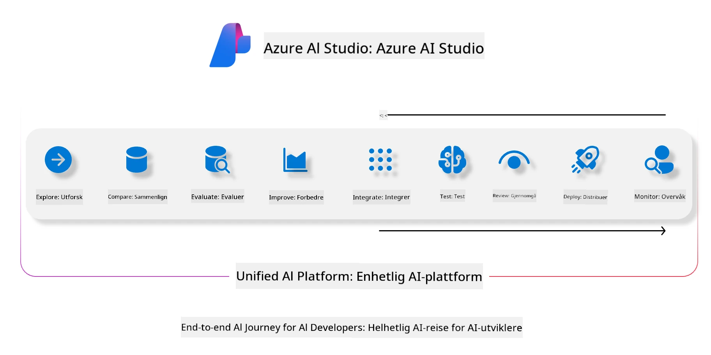
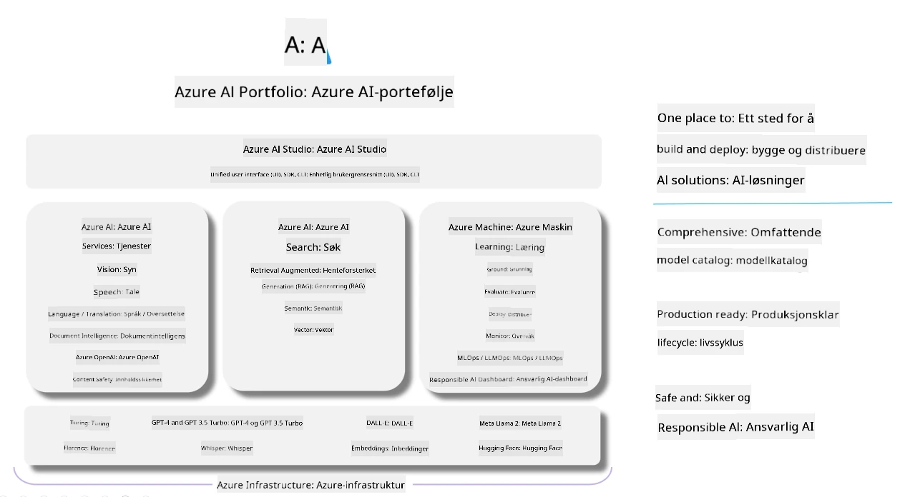

# **Bruke Microsoft Foundry til evaluering**

Hvordan evaluere din generative AI-applikasjon ved bruk av [Microsoft Foundry](https://ai.azure.com?WT.mc_id=aiml-138114-kinfeylo). Enten du vurderer en-til-en eller fler-til-en samtaler, tilbyr Microsoft Foundry verktøy for å evaluere modellens ytelse og sikkerhet.

## Hvordan evaluere generative AI-apper med Microsoft Foundry
For mer detaljerte instruksjoner, se [Microsoft Foundry Dokumentasjon](https://learn.microsoft.com/azure/ai-studio/how-to/evaluate-generative-ai-app?WT.mc_id=aiml-138114-kinfeylo)

Her er stegene for å komme i gang:

## Evaluering av generative AI-modeller i Microsoft Foundry

**Forutsetninger**

- Et testdatasett i enten CSV- eller JSON-format.
- En distribuert generativ AI-modell (som Phi-3, GPT 3.5, GPT 4, eller Davinci-modeller).
- En runtime med en beregningsinstans for å kjøre evalueringen.

## Innebygde evalueringsmetrikker

Microsoft Foundry lar deg evaluere både enkle og komplekse fler-til-en samtaler.
For Retrieval Augmented Generation (RAG) scenarier, hvor modellen er forankret i spesifikke data, kan du vurdere ytelsen ved bruk av innebygde evalueringsmetrikker.
I tillegg kan du evaluere generelle en-til-en spørsmåls- og svarscenarier (ikke-RAG).

## Opprette en evaluering

Fra Microsoft Foundry UI, gå til enten Evalueringssiden eller Prompt Flow-siden.
Følg veiviseren for evaluering for å sette opp en evaluering. Gi et valgfritt navn til evalueringen din.
Velg scenarioet som samsvarer med applikasjonens mål.
Velg en eller flere evalueringsmetrikker for å vurdere modellens resultater.

## Tilpasset evalueringsflyt (valgfritt)

For større fleksibilitet kan du etablere en tilpasset evalueringsflyt. Tilpass evalueringsprosessen basert på dine spesifikke krav.

## Vise resultater

Etter at evalueringen er kjørt, kan du logge, se og analysere detaljerte evalueringsmetrikker i Microsoft Foundry. Få innsikt i applikasjonens evner og begrensninger.

**Merk** Microsoft Foundry er foreløpig i offentlig forhåndsvisning, så bruk den til eksperimentering og utvikling. For produksjonsarbeidsmengder bør du vurdere andre alternativer. Utforsk den offisielle [AI Foundry-dokumentasjonen](https://learn.microsoft.com/azure/ai-studio/?WT.mc_id=aiml-138114-kinfeylo) for flere detaljer og steg-for-steg instruksjoner.

---

<!-- CO-OP TRANSLATOR DISCLAIMER START -->
**Ansvarsfraskrivelse**:
Dette dokumentet er oversatt ved hjelp av AI-oversettelsestjenesten [Co-op Translator](https://github.com/Azure/co-op-translator). Selv om vi etterstreber nøyaktighet, vennligst vær oppmerksom på at automatiske oversettelser kan inneholde feil eller unøyaktigheter. Det originale dokumentet på dets opprinnelige språk skal betraktes som den autoritative kilden. For kritisk informasjon anbefales profesjonell menneskelig oversettelse. Vi er ikke ansvarlige for misforståelser eller feiltolkninger som oppstår ved bruk av denne oversettelsen.
<!-- CO-OP TRANSLATOR DISCLAIMER END -->