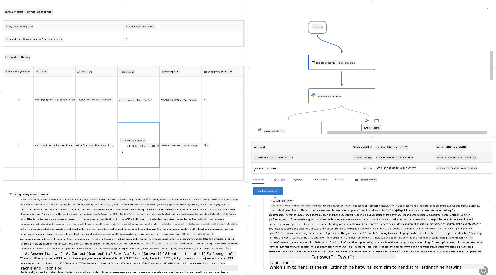

<!--
CO_OP_TRANSLATOR_METADATA:
{
  "original_hash": "3cbe7629d254f1043193b7fe22524d55",
  "translation_date": "2025-07-16T22:41:44+00:00",
  "source_file": "md/01.Introduction/05/Promptflow.md",
  "language_code": "no"
}
-->
# **Introduksjon til Promptflow**

[Microsoft Prompt Flow](https://microsoft.github.io/promptflow/index.html?WT.mc_id=aiml-138114-kinfeylo) er et visuelt verktøy for arbeidsflytautomatisering som lar brukere lage automatiserte arbeidsflyter ved hjelp av ferdigbygde maler og tilpassede koblinger. Det er utviklet for å gjøre det enkelt for utviklere og forretningsanalytikere å raskt bygge automatiserte prosesser for oppgaver som databehandling, samarbeid og prosessoptimalisering. Med Prompt Flow kan brukere enkelt koble sammen ulike tjenester, applikasjoner og systemer, og automatisere komplekse forretningsprosesser.

Microsoft Prompt Flow er laget for å effektivisere hele utviklingssyklusen for AI-applikasjoner drevet av store språkmodeller (LLMs). Enten du er i idéfasen, prototyping, testing, evaluering eller utrulling av LLM-baserte applikasjoner, forenkler Prompt Flow prosessen og gjør det mulig å bygge LLM-applikasjoner med produksjonskvalitet.

## Her er hovedfunksjonene og fordelene ved å bruke Microsoft Prompt Flow:

**Interaktiv forfatteropplevelse**

Prompt Flow gir en visuell fremstilling av strukturen i arbeidsflyten din, noe som gjør det enkelt å forstå og navigere i prosjektene dine.  
Det tilbyr en notatbok-lignende kodingopplevelse for effektiv utvikling og feilsøking av arbeidsflyter.

**Prompt-varianter og justering**

Lag og sammenlign flere varianter av prompts for å legge til rette for en iterativ forbedringsprosess. Evaluer ytelsen til ulike prompts og velg de mest effektive.

**Innebygde evalueringsflyter**  
Vurder kvaliteten og effektiviteten til dine prompts og arbeidsflyter ved hjelp av innebygde evalueringsverktøy.  
Få innsikt i hvor godt dine LLM-baserte applikasjoner presterer.

**Omfattende ressurser**

Prompt Flow inkluderer et bibliotek med innebygde verktøy, eksempler og maler. Disse ressursene fungerer som et utgangspunkt for utvikling, inspirerer til kreativitet og akselererer prosessen.

**Samarbeid og bedriftsklarhet**

Støtt teamarbeid ved å la flere brukere samarbeide om prompt engineering-prosjekter.  
Oppretthold versjonskontroll og del kunnskap effektivt. Strømlinjeform hele prompt engineering-prosessen, fra utvikling og evaluering til utrulling og overvåking.

## Evaluering i Prompt Flow

I Microsoft Prompt Flow spiller evaluering en avgjørende rolle for å vurdere hvor godt AI-modellene dine presterer. La oss se nærmere på hvordan du kan tilpasse evalueringsflyter og metrikker i Prompt Flow:

**Forstå evaluering i Prompt Flow**

I Prompt Flow representerer en flyt en sekvens av noder som behandler input og genererer output. Evalueringsflyter er spesielle typer flyter designet for å vurdere ytelsen til en kjøring basert på spesifikke kriterier og mål.

**Nøkkelfunksjoner for evalueringsflyter**

De kjøres vanligvis etter flyten som testes, og bruker dens output. De beregner poeng eller metrikker for å måle ytelsen til den testede flyten. Metrikker kan inkludere nøyaktighet, relevansscore eller andre relevante mål.

### Tilpasse evalueringsflyter

**Definere input**

Evalueringsflyter må ta inn output fra kjøringen som testes. Definer input på samme måte som i vanlige flyter.  
For eksempel, hvis du evaluerer en QnA-flyt, kan du kalle en input "answer". Hvis du evaluerer en klassifiseringsflyt, kan du kalle en input "category". Ground truth-inputs (f.eks. faktiske etiketter) kan også være nødvendig.

**Output og metrikker**

Evalueringsflyter produserer resultater som måler ytelsen til den testede flyten. Metrikker kan beregnes ved hjelp av Python eller LLM (store språkmodeller). Bruk funksjonen log_metric() for å logge relevante metrikker.

**Bruke tilpassede evalueringsflyter**

Utvikle din egen evalueringsflyt tilpasset dine spesifikke oppgaver og mål. Tilpass metrikker basert på dine evalueringsmål.  
Bruk denne tilpassede evalueringsflyten på batch-kjøringer for storskala testing.

## Innebygde evalueringsmetoder

Prompt Flow tilbyr også innebygde evalueringsmetoder.  
Du kan sende inn batch-kjøringer og bruke disse metodene for å evaluere hvor godt flyten din presterer med store datasett.  
Se evalueringsresultater, sammenlign metrikker og iterer etter behov.  
Husk at evaluering er essensielt for å sikre at AI-modellene dine oppfyller ønskede kriterier og mål. Utforsk den offisielle dokumentasjonen for detaljerte instruksjoner om utvikling og bruk av evalueringsflyter i Microsoft Prompt Flow.

Oppsummert gir Microsoft Prompt Flow utviklere muligheten til å lage LLM-applikasjoner av høy kvalitet ved å forenkle prompt engineering og tilby et robust utviklingsmiljø. Hvis du jobber med LLM-er, er Prompt Flow et verdifullt verktøy å utforske. Utforsk [Prompt Flow Evaluation Documents](https://learn.microsoft.com/azure/machine-learning/prompt-flow/how-to-develop-an-evaluation-flow?view=azureml-api-2?WT.mc_id=aiml-138114-kinfeylo) for detaljerte instruksjoner om utvikling og bruk av evalueringsflyter i Microsoft Prompt Flow.

**Ansvarsfraskrivelse**:  
Dette dokumentet er oversatt ved hjelp av AI-oversettelsestjenesten [Co-op Translator](https://github.com/Azure/co-op-translator). Selv om vi streber etter nøyaktighet, vennligst vær oppmerksom på at automatiske oversettelser kan inneholde feil eller unøyaktigheter. Det opprinnelige dokumentet på originalspråket skal anses som den autoritative kilden. For kritisk informasjon anbefales profesjonell menneskelig oversettelse. Vi er ikke ansvarlige for eventuelle misforståelser eller feiltolkninger som oppstår ved bruk av denne oversettelsen.