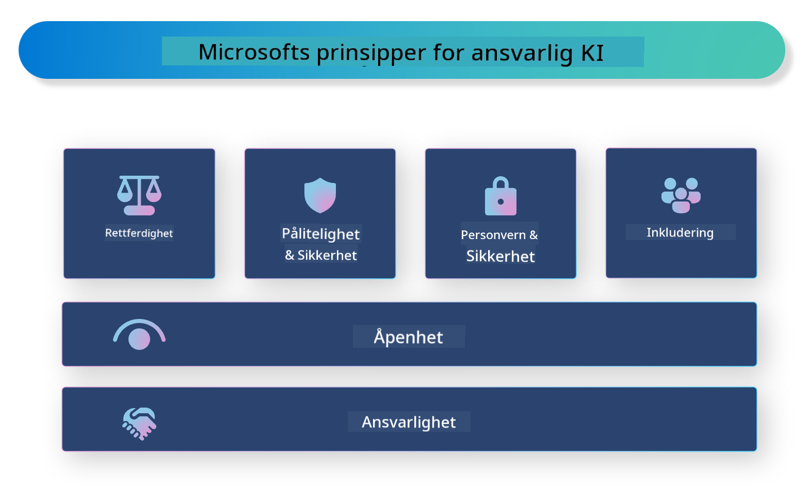

<!--
CO_OP_TRANSLATOR_METADATA:
{
  "original_hash": "805b96b20152936d8f4c587d90d6e06e",
  "translation_date": "2025-05-09T15:37:22+00:00",
  "source_file": "md/01.Introduction/05/ResponsibleAI.md",
  "language_code": "no"
}
-->
# **Introdusere Ansvarlig AI**

[Microsoft Responsible AI](https://www.microsoft.com/ai/responsible-ai?WT.mc_id=aiml-138114-kinfeylo) er et initiativ som har som mål å hjelpe utviklere og organisasjoner med å bygge AI-systemer som er transparente, pålitelige og ansvarlige. Initiativet gir veiledning og ressurser for å utvikle ansvarlige AI-løsninger som er i tråd med etiske prinsipper som personvern, rettferdighet og åpenhet. Vi vil også se på noen av utfordringene og beste praksis knyttet til å bygge ansvarlige AI-systemer.

## Oversikt over Microsoft Responsible AI

**Etiske prinsipper**

Microsoft Responsible AI styres av et sett etiske prinsipper som personvern, rettferdighet, åpenhet, ansvarlighet og sikkerhet. Disse prinsippene er utformet for å sikre at AI-systemer utvikles på en etisk og ansvarlig måte.

**Transparent AI**

Microsoft Responsible AI legger vekt på viktigheten av åpenhet i AI-systemer. Dette inkluderer å gi klare forklaringer på hvordan AI-modeller fungerer, samt å sikre at datakilder og algoritmer er offentlig tilgjengelige.

**Ansvarlig AI**

[Microsoft Responsible AI](https://www.microsoft.com/ai/responsible-ai?WT.mc_id=aiml-138114-kinfeylo) fremmer utviklingen av ansvarlige AI-systemer som kan gi innsikt i hvordan AI-modeller tar beslutninger. Dette kan hjelpe brukere å forstå og stole på resultatene fra AI-systemene.

**Inkludering**

AI-systemer bør utformes for å komme alle til gode. Microsoft ønsker å skape inkluderende AI som tar hensyn til ulike perspektiver og unngår skjevheter eller diskriminering.

**Pålitelige og sikre systemer**

Det er avgjørende å sikre at AI-systemer er pålitelige og trygge. Microsoft fokuserer på å bygge robuste modeller som presterer jevnt og unngår skadelige konsekvenser.

**Rettferdighet i AI**

Microsoft Responsible AI anerkjenner at AI-systemer kan videreføre skjevheter dersom de trenes på partiske data eller algoritmer. Initiativet gir veiledning for å utvikle rettferdige AI-systemer som ikke diskriminerer basert på faktorer som rase, kjønn eller alder.

**Personvern og sikkerhet**

Microsoft Responsible AI understreker viktigheten av å beskytte brukerens personvern og datasikkerhet i AI-systemer. Dette inkluderer å implementere sterk datakryptering og tilgangskontroller, samt å regelmessig revidere AI-systemer for sårbarheter.

**Ansvarlighet og forpliktelse**

Microsoft Responsible AI fremmer ansvarlighet og forpliktelse i utvikling og implementering av AI. Dette innebærer at utviklere og organisasjoner må være bevisste på potensielle risikoer knyttet til AI-systemer, og ta nødvendige skritt for å redusere disse risikoene.

## Beste praksis for å bygge ansvarlige AI-systemer

**Utvikle AI-modeller med mangfoldige datasett**

For å unngå skjevheter i AI-systemer er det viktig å bruke mangfoldige datasett som representerer et bredt spekter av perspektiver og erfaringer.

**Bruk forklarbare AI-teknikker**

Forklarbare AI-teknikker kan hjelpe brukere å forstå hvordan AI-modeller tar beslutninger, noe som kan øke tilliten til systemet.

**Revider AI-systemer regelmessig for sårbarheter**

Regelmessige revisjoner av AI-systemer kan bidra til å identifisere potensielle risikoer og sårbarheter som må håndteres.

**Implementer sterk datakryptering og tilgangskontroller**

Datakryptering og tilgangskontroller bidrar til å beskytte brukerens personvern og sikkerhet i AI-systemer.

**Følg etiske prinsipper i AI-utvikling**

Å følge etiske prinsipper som rettferdighet, åpenhet og ansvarlighet kan bidra til å bygge tillit til AI-systemer og sikre at de utvikles på en ansvarlig måte.

## Bruke AI Foundry for ansvarlig AI

[Azure AI Foundry](https://ai.azure.com?WT.mc_id=aiml-138114-kinfeylo) er en kraftfull plattform som gjør det mulig for utviklere og organisasjoner å raskt lage intelligente, avanserte, markedsklare og ansvarlige applikasjoner. Her er noen viktige funksjoner og egenskaper ved Azure AI Foundry:

**Ferdige API-er og modeller**

Azure AI Foundry tilbyr ferdigbygde og tilpassbare API-er og modeller. Disse dekker et bredt spekter av AI-oppgaver, inkludert generativ AI, naturlig språkbehandling for samtaler, søk, overvåking, oversettelse, tale, syn og beslutningstaking.

**Prompt Flow**

Prompt Flow i Azure AI Foundry gjør det mulig å lage samtaleopplevelser med AI. Det lar deg designe og administrere samtaleflyt, noe som gjør det enklere å bygge chatbots, virtuelle assistenter og andre interaktive applikasjoner.

**Retrieval Augmented Generation (RAG)**

RAG er en teknikk som kombinerer gjenfinning og generering. Den forbedrer kvaliteten på genererte svar ved å utnytte både forhåndseksisterende kunnskap (gjenfinning) og kreativ generering (generering).

**Evaluering og overvåking av generativ AI**

Azure AI Foundry tilbyr verktøy for å evaluere og overvåke generative AI-modeller. Du kan vurdere ytelse, rettferdighet og andre viktige måleparametere for å sikre ansvarlig bruk. I tillegg, hvis du har laget et dashbord, kan du bruke den kodefrie UI-en i Azure Machine Learning Studio for å tilpasse og generere et Responsible AI Dashboard og tilhørende scorecard basert på [Responsible AI Toolbox](https://responsibleaitoolbox.ai/?WT.mc_id=aiml-138114-kinfeylo) Python-biblioteker. Dette scorecardet hjelper deg å dele viktige innsikter knyttet til rettferdighet, funksjonsviktighet og andre hensyn ved ansvarlig implementering med både tekniske og ikke-tekniske interessenter.

For å bruke AI Foundry med ansvarlig AI, kan du følge disse beste praksisene:

**Definer problemet og målene for AI-systemet ditt**

Før du starter utviklingsprosessen, er det viktig å tydelig definere problemet eller målet AI-systemet ditt skal løse. Dette hjelper deg å identifisere data, algoritmer og ressurser som trengs for å bygge en effektiv modell.

**Samle og forbered relevant data**

Kvaliteten og mengden data som brukes til trening av et AI-system har stor betydning for ytelsen. Derfor er det viktig å samle relevante data, rense dem, forberede dem og sikre at de er representative for befolkningen eller problemet du ønsker å løse.

**Velg passende evalueringsmetode**

Det finnes ulike evalueringsalgoritmer tilgjengelig. Det er viktig å velge den mest passende basert på dine data og problemstilling.

**Evaluer og tolk modellen**

Når du har bygget en AI-modell, er det viktig å evaluere ytelsen ved hjelp av riktige måleparametere og tolke resultatene på en åpen måte. Dette hjelper deg å identifisere eventuelle skjevheter eller begrensninger i modellen og gjøre forbedringer der det er nødvendig.

**Sikre åpenhet og forklarbarhet**

AI-systemer bør være åpne og forklarbare slik at brukere kan forstå hvordan de fungerer og hvordan beslutninger tas. Dette er spesielt viktig for applikasjoner som har stor innvirkning på menneskers liv, som helsevesen, finans og rettssystemer.

**Overvåk og oppdater modellen**

AI-systemer bør kontinuerlig overvåkes og oppdateres for å sikre at de forblir nøyaktige og effektive over tid. Dette krever løpende vedlikehold, testing og nytrening av modellen.

Avslutningsvis er Microsoft Responsible AI et initiativ som har som mål å hjelpe utviklere og organisasjoner med å bygge AI-systemer som er transparente, pålitelige og ansvarlige. Husk at ansvarlig AI-implementering er avgjørende, og Azure AI Foundry gjør det praktisk for organisasjoner. Ved å følge etiske prinsipper og beste praksis kan vi sikre at AI-systemer utvikles og tas i bruk på en ansvarlig måte som kommer samfunnet til gode.

**Ansvarsfraskrivelse**:  
Dette dokumentet er oversatt ved hjelp av AI-oversettelsestjenesten [Co-op Translator](https://github.com/Azure/co-op-translator). Selv om vi streber etter nøyaktighet, vennligst vær oppmerksom på at automatiske oversettelser kan inneholde feil eller unøyaktigheter. Det opprinnelige dokumentet på dets opprinnelige språk bør anses som den autoritative kilden. For kritisk informasjon anbefales profesjonell menneskelig oversettelse. Vi er ikke ansvarlige for eventuelle misforståelser eller feiltolkninger som oppstår fra bruk av denne oversettelsen.