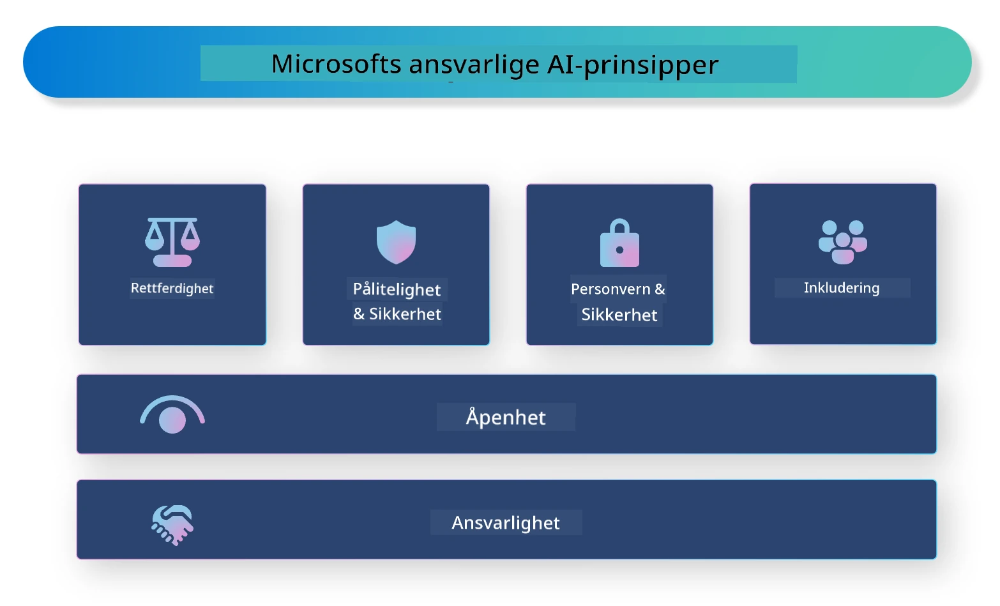

# **Introduksjon til Ansvarlig AI**

[Microsoft Responsible AI](https://www.microsoft.com/ai/responsible-ai?WT.mc_id=aiml-138114-kinfeylo) er et initiativ som har som mål å hjelpe utviklere og organisasjoner med å bygge AI-systemer som er transparente, pålitelige og ansvarlige. Initiativet gir veiledning og ressurser for å utvikle ansvarlige AI-løsninger som er i tråd med etiske prinsipper, som personvern, rettferdighet og åpenhet. Vi vil også utforske noen av utfordringene og beste praksiser knyttet til å bygge ansvarlige AI-systemer.

## Oversikt over Microsoft Responsible AI

**Etiske prinsipper**

Microsoft Responsible AI styres av et sett etiske prinsipper, som personvern, rettferdighet, åpenhet, ansvarlighet og sikkerhet. Disse prinsippene er utformet for å sikre at AI-systemer utvikles på en etisk og ansvarlig måte.

**Transparent AI**

Microsoft Responsible AI understreker viktigheten av åpenhet i AI-systemer. Dette inkluderer å gi klare forklaringer på hvordan AI-modeller fungerer, samt å sikre at datakilder og algoritmer er offentlig tilgjengelige.

**Ansvarlig AI**

[Microsoft Responsible AI](https://www.microsoft.com/ai/responsible-ai?WT.mc_id=aiml-138114-kinfeylo) fremmer utviklingen av ansvarlige AI-systemer, som kan gi innsikt i hvordan AI-modeller tar beslutninger. Dette kan hjelpe brukerne til å forstå og stole på resultatene fra AI-systemer.

**Inkludering**

AI-systemer bør utformes for å komme alle til gode. Microsoft har som mål å skape inkluderende AI som tar hensyn til ulike perspektiver og unngår skjevheter eller diskriminering.

**Pålitelighget og sikkerhet**

Å sikre at AI-systemer er pålitelige og trygge er avgjørende. Microsoft fokuserer på å bygge robuste modeller som presterer konsekvent og unngår skadelige utfall.

**Rettferdighet i AI**

Microsoft Responsible AI erkjenner at AI-systemer kan videreføre skjevheter dersom de trenes på skjev data eller algoritmer. Initiativet gir veiledning for å utvikle rettferdige AI-systemer som ikke diskriminerer basert på faktorer som rase, kjønn eller alder.

**Personvern og sikkerhet**

Microsoft Responsible AI understreker viktigheten av å beskytte brukerens personvern og datasikkerhet i AI-systemer. Dette inkluderer implementering av sterk datakryptering og tilgangskontroller, samt regelmessige revisjoner av AI-systemer for sårbarheter.

**Ansvarlighet og ansvar**

Microsoft Responsible AI fremmer ansvarlighet og ansvar i AI-utvikling og -implementering. Dette innebærer å sikre at utviklere og organisasjoner er klar over de potensielle risikoene knyttet til AI-systemer, og tar skritt for å redusere disse risikoene.

## Beste praksis for å bygge ansvarlige AI-systemer

**Utvikle AI-modeller ved hjelp av mangfoldige datasett**

For å unngå skjevheter i AI-systemer er det viktig å bruke mangfoldige datasett som representerer et bredt spekter av perspektiver og erfaringer.

**Bruk forklarbare AI-teknikker**

Forklarbare AI-teknikker kan hjelpe brukerne å forstå hvordan AI-modeller tar beslutninger, noe som kan øke tilliten til systemet.

**Revider AI-systemer regelmessig for sårbarheter**

Regelmessige revisjoner av AI-systemer kan hjelpe til med å identifisere potensielle risikoer og sårbarheter som må adresseres.

**Implementer sterk datakryptering og tilgangskontroller**

Datakryptering og tilgangskontroller kan bidra til å beskytte brukerens personvern og sikkerhet i AI-systemer.

**Følg etiske prinsipper i AI-utvikling**

Å følge etiske prinsipper, som rettferdighet, åpenhet og ansvarlighet, kan bidra til å bygge tillit til AI-systemer og sikre at de utvikles på en ansvarlig måte.

## Bruke AI Foundry for Ansvarlig AI

[Microsoft Foundry](https://ai.azure.com?WT.mc_id=aiml-138114-kinfeylo) er en kraftfull plattform som lar utviklere og organisasjoner raskt skape intelligente, banebrytende, markedsklare og ansvarlige applikasjoner. Her er noen nøkkelfunksjoner og kapasiteter i Microsoft Foundry:

**API-er og modeller klare til bruk**

Microsoft Foundry tilbyr forhåndsbygde og tilpassbare API-er og modeller. Disse dekker et bredt spekter av AI-oppgaver, inkludert generativ AI, naturlig språkbehandling for samtaler, søk, overvåking, oversettelse, tale, syn og beslutningstaking.

**Prompt Flow**

Prompt flow i Microsoft Foundry gjør det mulig å skape samtalebaserte AI-opplevelser. Det lar deg designe og administrere samtaleflyter, noe som gjør det enklere å bygge chatboter, virtuelle assistenter og andre interaktive applikasjoner.

**Retrieval Augmented Generation (RAG)**

RAG er en teknikk som kombinerer gjenfinningsbaserte og generative tilnærminger. Det forbedrer kvaliteten på genererte svar ved å utnytte både forhåndseksisterende kunnskap (henting) og kreativ generering (generering).

**Evaluering og overvåkingsmålinger for generativ AI**

Microsoft Foundry tilbyr verktøy for å evaluere og overvåke generative AI-modeller. Du kan vurdere deres ytelse, rettferdighet og andre viktige målinger for å sikre ansvarlig distribusjon. I tillegg, hvis du har laget et dashbord, kan du bruke den kodefrie brukergrensesnittet i Azure Machine Learning Studio for å tilpasse og generere et Responsible AI Dashboard og tilhørende scorecard basert på [Responsible AI Toolbox](https://responsibleaitoolbox.ai/?WT.mc_id=aiml-138114-kinfeylo) Python Libraries. Dette scorecardet hjelper deg med å dele viktige innsikter relatert til rettferdighet, funksjonsviktighet og andre vurderinger for ansvarlig distribusjon med både tekniske og ikke-tekniske interessenter.

For å bruke AI Foundry med ansvarlig AI, kan du følge disse beste praksisene:

**Definer problemet og målene for AI-systemet ditt**

Før du starter utviklingsprosessen, er det viktig å tydelig definere problemet eller målet som AI-systemet ditt har som hensikt å løse. Dette vil hjelpe deg med å identifisere data, algoritmer og ressurser som trengs for å bygge en effektiv modell.

**Samle og forhåndsbehandle relevant data**

Kvaliteten og mengden data som brukes i treningen av et AI-system kan ha stor innvirkning på ytelsen. Derfor er det viktig å samle relevant data, rense den, forhåndsbehandle den og sikre at den er representativ for befolkningen eller problemet du prøver å løse.

**Velg passende evaluering**

Det finnes ulike evalueringsalgoritmer tilgjengelig. Det er viktig å velge den mest passende algoritmen basert på din data og problemstilling.

**Evaluer og tolk modellen**

Når du har bygget en AI-modell, er det viktig å evaluere ytelsen ved hjelp av egnede målinger og tolke resultatene på en transparent måte. Dette vil hjelpe deg med å identifisere eventuelle skjevheter eller begrensninger i modellen og gjøre forbedringer der det er nødvendig.

**Sikre åpenhet og forklarbarhet**

AI-systemer bør være åpne og forklarbare slik at brukerne kan forstå hvordan de fungerer og hvordan beslutninger tas. Dette er spesielt viktig for applikasjoner som har betydelig innvirkning på menneskeliv, som helsevesen, finans og rettssystemer.

**Overvåk og oppdater modellen**

AI-systemer bør kontinuerlig overvåkes og oppdateres for å sikre at de forblir nøyaktige og effektive over tid. Dette krever løpende vedlikehold, testing og retrening av modellen.

Avslutningsvis er Microsoft Responsible AI et initiativ som har som mål å hjelpe utviklere og organisasjoner med å bygge AI-systemer som er transparente, pålitelige og ansvarlige. Husk at implementering av ansvarlig AI er avgjørende, og Microsoft Foundry har som mål å gjøre det praktisk for organisasjoner. Ved å følge etiske prinsipper og beste praksis kan vi sikre at AI-systemer utvikles og tas i bruk på en ansvarlig måte som gagner samfunnet som helhet.

---

<!-- CO-OP TRANSLATOR DISCLAIMER START -->
**Ansvarsfraskrivelse**:
Dette dokumentet er oversatt ved hjelp av AI-oversettelsestjenesten [Co-op Translator](https://github.com/Azure/co-op-translator). Selv om vi streber etter nøyaktighet, vær oppmerksom på at automatiske oversettelser kan inneholde feil eller unøyaktigheter. Det opprinnelige dokumentet på sitt opprinnelige språk skal anses som den autoritative kilden. For kritisk informasjon anbefales profesjonell menneskelig oversettelse. Vi er ikke ansvarlige for eventuelle misforståelser eller feiltolkninger som oppstår ved bruk av denne oversettelsen.
<!-- CO-OP TRANSLATOR DISCLAIMER END -->