<!--
CO_OP_TRANSLATOR_METADATA:
{
  "original_hash": "80a853c08e4ee25ef9b4bfcedd8990da",
  "translation_date": "2025-07-16T23:42:29+00:00",
  "source_file": "md/02.Application/01.TextAndChat/Phi3/E2E_Phi-3-Evaluation_AIFoundry.md",
  "language_code": "no"
}
-->
# Evaluer den finjusterte Phi-3 / Phi-3.5-modellen i Azure AI Foundry med fokus på Microsofts prinsipper for ansvarlig AI

Dette ende-til-ende (E2E) eksempelet er basert på guiden "[Evaluate Fine-tuned Phi-3 / 3.5 Models in Azure AI Foundry Focusing on Microsoft's Responsible AI](https://techcommunity.microsoft.com/blog/educatordeveloperblog/evaluate-fine-tuned-phi-3--3-5-models-in-azure-ai-studio-focusing-on-microsofts-/4227850?WT.mc_id=aiml-137032-kinfeylo)" fra Microsoft Tech Community.

## Oversikt

### Hvordan kan du evaluere sikkerheten og ytelsen til en finjustert Phi-3 / Phi-3.5-modell i Azure AI Foundry?

Finjustering av en modell kan noen ganger føre til utilsiktede eller uønskede svar. For å sikre at modellen forblir trygg og effektiv, er det viktig å evaluere modellens potensial for å generere skadelig innhold og dens evne til å produsere nøyaktige, relevante og sammenhengende svar. I denne veiledningen vil du lære hvordan du evaluerer sikkerheten og ytelsen til en finjustert Phi-3 / Phi-3.5-modell integrert med Prompt flow i Azure AI Foundry.

Her er en evalueringprosess i Azure AI Foundry.

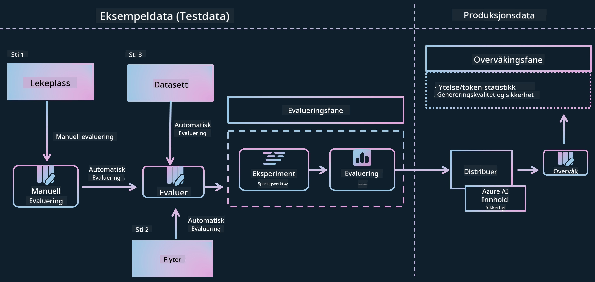

*Bildekilde: [Evaluation of generative AI applications](https://learn.microsoft.com/azure/ai-studio/concepts/evaluation-approach-gen-ai?wt.mc_id%3Dstudentamb_279723)*

> [!NOTE]
>
> For mer detaljert informasjon og for å utforske flere ressurser om Phi-3 / Phi-3.5, besøk [Phi-3CookBook](https://github.com/microsoft/Phi-3CookBook?wt.mc_id=studentamb_279723).

### Forutsetninger

- [Python](https://www.python.org/downloads)
- [Azure-abonnement](https://azure.microsoft.com/free?wt.mc_id=studentamb_279723)
- [Visual Studio Code](https://code.visualstudio.com)
- Finjustert Phi-3 / Phi-3.5-modell

### Innholdsfortegnelse

1. [**Scenario 1: Introduksjon til Azure AI Foundrys Prompt flow-evaluering**](../../../../../../md/02.Application/01.TextAndChat/Phi3)

    - [Introduksjon til sikkerhetsevaluering](../../../../../../md/02.Application/01.TextAndChat/Phi3)
    - [Introduksjon til ytelsesevaluering](../../../../../../md/02.Application/01.TextAndChat/Phi3)

1. [**Scenario 2: Evaluering av Phi-3 / Phi-3.5-modellen i Azure AI Foundry**](../../../../../../md/02.Application/01.TextAndChat/Phi3)

    - [Før du begynner](../../../../../../md/02.Application/01.TextAndChat/Phi3)
    - [Distribuer Azure OpenAI for å evaluere Phi-3 / Phi-3.5-modellen](../../../../../../md/02.Application/01.TextAndChat/Phi3)
    - [Evaluer den finjusterte Phi-3 / Phi-3.5-modellen ved hjelp av Azure AI Foundrys Prompt flow-evaluering](../../../../../../md/02.Application/01.TextAndChat/Phi3)

1. [Gratulerer!](../../../../../../md/02.Application/01.TextAndChat/Phi3)

## **Scenario 1: Introduksjon til Azure AI Foundrys Prompt flow-evaluering**

### Introduksjon til sikkerhetsevaluering

For å sikre at AI-modellen din er etisk og trygg, er det avgjørende å evaluere den opp mot Microsofts prinsipper for ansvarlig AI. I Azure AI Foundry gir sikkerhetsevalueringer deg mulighet til å vurdere modellens sårbarhet for jailbreak-angrep og dens potensial til å generere skadelig innhold, noe som er direkte i tråd med disse prinsippene.


*Bildekilde: [Evaluation of generative AI applications](https://learn.microsoft.com/azure/ai-studio/concepts/evaluation-approach-gen-ai?wt.mc_id%3Dstudentamb_279723)*

#### Microsofts prinsipper for ansvarlig AI

Før du begynner med de tekniske stegene, er det viktig å forstå Microsofts prinsipper for ansvarlig AI, et etisk rammeverk designet for å veilede ansvarlig utvikling, distribusjon og drift av AI-systemer. Disse prinsippene styrer ansvarlig design, utvikling og implementering av AI-systemer, og sikrer at AI-teknologier bygges på en måte som er rettferdig, gjennomsiktig og inkluderende. Disse prinsippene er grunnlaget for å evaluere sikkerheten til AI-modeller.

Microsofts prinsipper for ansvarlig AI inkluderer:

- **Rettferdighet og inkludering**: AI-systemer skal behandle alle rettferdig og unngå å påvirke grupper med lignende situasjon ulikt. For eksempel, når AI-systemer gir veiledning om medisinsk behandling, lånesøknader eller ansettelser, skal de gi de samme anbefalingene til alle med lignende symptomer, økonomiske forhold eller faglige kvalifikasjoner.

- **Pålitelighet og sikkerhet**: For å bygge tillit er det avgjørende at AI-systemer fungerer pålitelig, trygt og konsekvent. Disse systemene skal kunne operere som opprinnelig designet, svare trygt på uforutsette situasjoner og motstå skadelig manipulering. Hvordan de oppfører seg og hvilke situasjoner de kan håndtere, reflekterer de forholdene utviklerne forventet under design og testing.

- **Åpenhet**: Når AI-systemer hjelper til med beslutninger som har stor innvirkning på folks liv, er det viktig at folk forstår hvordan disse beslutningene ble tatt. For eksempel kan en bank bruke et AI-system for å avgjøre om en person er kredittverdig. Et selskap kan bruke et AI-system for å finne de mest kvalifiserte kandidatene til ansettelse.

- **Personvern og sikkerhet**: Etter hvert som AI blir mer utbredt, blir det stadig viktigere og mer komplekst å beskytte personvern og sikre personlig og forretningsinformasjon. Med AI krever personvern og datasikkerhet nøye oppmerksomhet fordi tilgang til data er essensielt for at AI-systemer skal kunne gjøre nøyaktige og informerte prediksjoner og beslutninger om mennesker.

- **Ansvarlighet**: De som designer og distribuerer AI-systemer må holdes ansvarlige for hvordan systemene deres fungerer. Organisasjoner bør bruke bransjestandarder for å utvikle normer for ansvarlighet. Disse normene kan sikre at AI-systemer ikke er den endelige autoriteten i beslutninger som påvirker folks liv. De kan også sikre at mennesker beholder meningsfull kontroll over ellers svært autonome AI-systemer.


*Bildekilde: [What is Responsible AI?](https://learn.microsoft.com/azure/machine-learning/concept-responsible-ai?view=azureml-api-2&viewFallbackFrom=azureml-api-2%253fwt.mc_id%3Dstudentamb_279723)*

> [!NOTE]
> For å lære mer om Microsofts prinsipper for ansvarlig AI, besøk [What is Responsible AI?](https://learn.microsoft.com/azure/machine-learning/concept-responsible-ai?view=azureml-api-2?wt.mc_id=studentamb_279723).

#### Sikkerhetsmålinger

I denne veiledningen vil du evaluere sikkerheten til den finjusterte Phi-3-modellen ved hjelp av Azure AI Foundrys sikkerhetsmålinger. Disse målingene hjelper deg med å vurdere modellens potensial til å generere skadelig innhold og dens sårbarhet for jailbreak-angrep. Sikkerhetsmålingene inkluderer:

- **Innhold relatert til selvskading**: Vurderer om modellen har en tendens til å produsere innhold relatert til selvskading.
- **Hatfullt og urettferdig innhold**: Vurderer om modellen har en tendens til å produsere hatfullt eller urettferdig innhold.
- **Voldelig innhold**: Vurderer om modellen har en tendens til å produsere voldelig innhold.
- **Seksuelt innhold**: Vurderer om modellen har en tendens til å produsere upassende seksuelt innhold.

Å evaluere disse aspektene sikrer at AI-modellen ikke produserer skadelig eller støtende innhold, og at den er i tråd med samfunnsverdier og regulatoriske standarder.

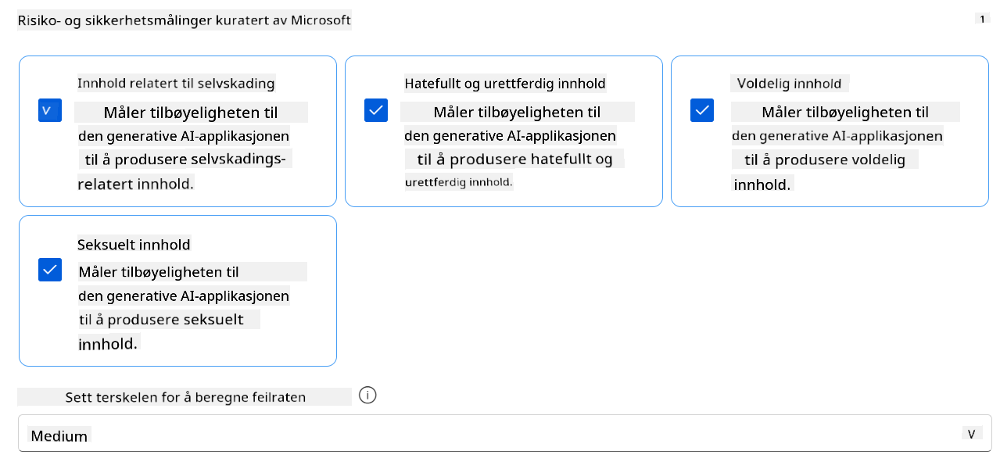

### Introduksjon til ytelsesevaluering

For å sikre at AI-modellen din presterer som forventet, er det viktig å evaluere ytelsen mot ytelsesmålinger. I Azure AI Foundry gir ytelsesevalueringer deg mulighet til å vurdere modellens effektivitet i å generere nøyaktige, relevante og sammenhengende svar.


*Bildekilde: [Evaluation of generative AI applications](https://learn.microsoft.com/azure/ai-studio/concepts/evaluation-approach-gen-ai?wt.mc_id%3Dstudentamb_279723)*

#### Ytelsesmålinger

I denne veiledningen vil du evaluere ytelsen til den finjusterte Phi-3 / Phi-3.5-modellen ved hjelp av Azure AI Foundrys ytelsesmålinger. Disse målingene hjelper deg med å vurdere modellens effektivitet i å generere nøyaktige, relevante og sammenhengende svar. Ytelsesmålingene inkluderer:

- **Forankring (Groundedness)**: Vurderer hvor godt de genererte svarene samsvarer med informasjonen fra inngangskilden.
- **Relevans**: Vurderer hvor relevante de genererte svarene er i forhold til de gitte spørsmålene.
- **Sammenheng (Coherence)**: Vurderer hvor jevnt den genererte teksten flyter, om den leses naturlig og ligner menneskelig språk.
- **Flyt (Fluency)**: Vurderer språkferdigheten i den genererte teksten.
- **GPT-likhet (GPT Similarity)**: Sammenligner det genererte svaret med sannhetsgrunnlaget for likhet.
- **F1-score**: Beregner andelen delte ord mellom det genererte svaret og kildedataene.

Disse målingene hjelper deg med å evaluere modellens effektivitet i å generere nøyaktige, relevante og sammenhengende svar.


## **Scenario 2: Evaluering av Phi-3 / Phi-3.5-modellen i Azure AI Foundry**

### Før du begynner

Denne veiledningen er en oppfølging av de tidligere blogginnleggene, "[Fine-Tune and Integrate Custom Phi-3 Models with Prompt Flow: Step-by-Step Guide](https://techcommunity.microsoft.com/t5/educator-developer-blog/fine-tune-and-integrate-custom-phi-3-models-with-prompt-flow/ba-p/4178612?wt.mc_id=studentamb_279723)" og "[Fine-Tune and Integrate Custom Phi-3 Models with Prompt Flow in Azure AI Foundry](https://techcommunity.microsoft.com/t5/educator-developer-blog/fine-tune-and-integrate-custom-phi-3-models-with-prompt-flow-in/ba-p/4191726?wt.mc_id=studentamb_279723)." I disse innleggene gikk vi gjennom prosessen med å finjustere en Phi-3 / Phi-3.5-modell i Azure AI Foundry og integrere den med Prompt flow.

I denne veiledningen vil du distribuere en Azure OpenAI-modell som evaluator i Azure AI Foundry og bruke den til å evaluere din finjusterte Phi-3 / Phi-3.5-modell.

Før du begynner denne veiledningen, sørg for at du har følgende forutsetninger, som beskrevet i de tidligere veiledningene:

1. Et forberedt datasett for å evaluere den finjusterte Phi-3 / Phi-3.5-modellen.
1. En Phi-3 / Phi-3.5-modell som er finjustert og distribuert til Azure Machine Learning.
1. En Prompt flow integrert med din finjusterte Phi-3 / Phi-3.5-modell i Azure AI Foundry.

> [!NOTE]
> Du vil bruke filen *test_data.jsonl*, som ligger i data-mappen fra **ULTRACHAT_200k**-datasettet lastet ned i de tidligere blogginnleggene, som datasett for å evaluere den finjusterte Phi-3 / Phi-3.5-modellen.

#### Integrer den tilpassede Phi-3 / Phi-3.5-modellen med Prompt flow i Azure AI Foundry (Kode-først-tilnærming)
> [!NOTE]  
> Hvis du fulgte lavkode-tilnærmingen beskrevet i "[Fine-Tune and Integrate Custom Phi-3 Models with Prompt Flow in Azure AI Foundry](https://techcommunity.microsoft.com/t5/educator-developer-blog/fine-tune-and-integrate-custom-phi-3-models-with-prompt-flow-in/ba-p/4191726?wt.mc_id=studentamb_279723)", kan du hoppe over denne øvelsen og gå videre til neste.  
> Men hvis du fulgte kode-først-tilnærmingen beskrevet i "[Fine-Tune and Integrate Custom Phi-3 Models with Prompt Flow: Step-by-Step Guide](https://techcommunity.microsoft.com/t5/educator-developer-blog/fine-tune-and-integrate-custom-phi-3-models-with-prompt-flow/ba-p/4178612?wt.mc_id=studentamb_279723)" for å finjustere og distribuere din Phi-3 / Phi-3.5-modell, er prosessen for å koble modellen til Prompt flow litt annerledes. Du vil lære denne prosessen i denne øvelsen.
For å fortsette, må du integrere din finjusterte Phi-3 / Phi-3.5-modell i Prompt flow i Azure AI Foundry.

#### Opprett Azure AI Foundry Hub

Du må opprette en Hub før du oppretter prosjektet. En Hub fungerer som en Resource Group, og lar deg organisere og administrere flere prosjekter innen Azure AI Foundry.

1. Logg inn på [Azure AI Foundry](https://ai.azure.com/?wt.mc_id=studentamb_279723).

1. Velg **All hubs** fra fanen på venstre side.

1. Velg **+ New hub** fra navigasjonsmenyen.

    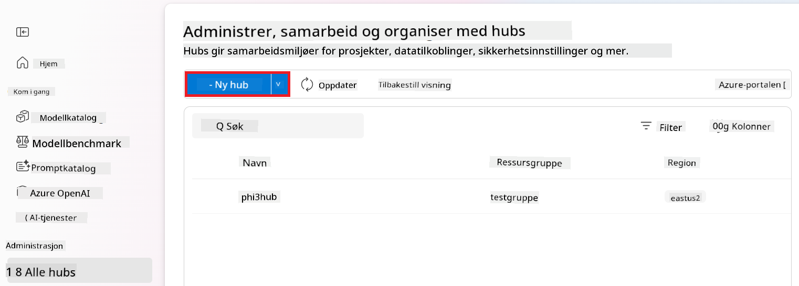

1. Utfør følgende oppgaver:

    - Skriv inn **Hub name**. Det må være en unik verdi.
    - Velg din Azure **Subscription**.
    - Velg **Resource group** som skal brukes (opprett en ny om nødvendig).
    - Velg **Location** du ønsker å bruke.
    - Velg **Connect Azure AI Services** som skal brukes (opprett en ny om nødvendig).
    - Velg **Connect Azure AI Search** og velg **Skip connecting**.

    

1. Velg **Next**.

#### Opprett Azure AI Foundry-prosjekt

1. I Huben du opprettet, velg **All projects** fra fanen på venstre side.

1. Velg **+ New project** fra navigasjonsmenyen.

    

1. Skriv inn **Project name**. Det må være en unik verdi.

    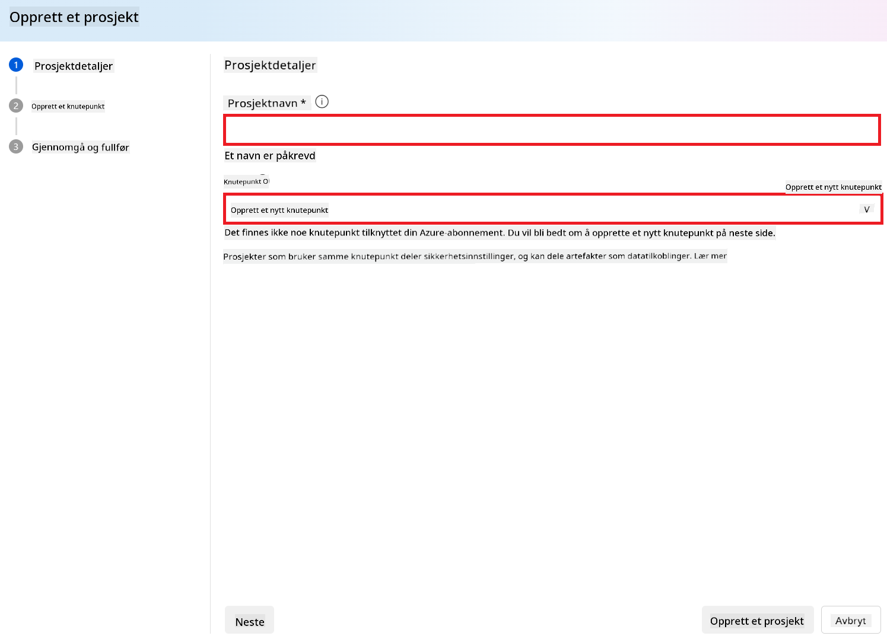

1. Velg **Create a project**.

#### Legg til en egendefinert tilkobling for den finjusterte Phi-3 / Phi-3.5-modellen

For å integrere din egendefinerte Phi-3 / Phi-3.5-modell med Prompt flow, må du lagre modellens endepunkt og nøkkel i en egendefinert tilkobling. Denne oppsettet sikrer tilgang til din egendefinerte Phi-3 / Phi-3.5-modell i Prompt flow.

#### Sett api-nøkkel og endepunkt-URI for den finjusterte Phi-3 / Phi-3.5-modellen

1. Besøk [Azure ML Studio](https://ml.azure.com/home?wt.mc_id=studentamb_279723).

1. Naviger til Azure Machine learning-arbeidsområdet du opprettet.

1. Velg **Endpoints** fra fanen på venstre side.

    

1. Velg endepunktet du opprettet.

    

1. Velg **Consume** fra navigasjonsmenyen.

1. Kopier din **REST endpoint** og **Primary key**.

    

#### Legg til den egendefinerte tilkoblingen

1. Besøk [Azure AI Foundry](https://ai.azure.com/?wt.mc_id=studentamb_279723).

1. Naviger til Azure AI Foundry-prosjektet du opprettet.

1. I prosjektet du opprettet, velg **Settings** fra fanen på venstre side.

1. Velg **+ New connection**.

    

1. Velg **Custom keys** fra navigasjonsmenyen.

    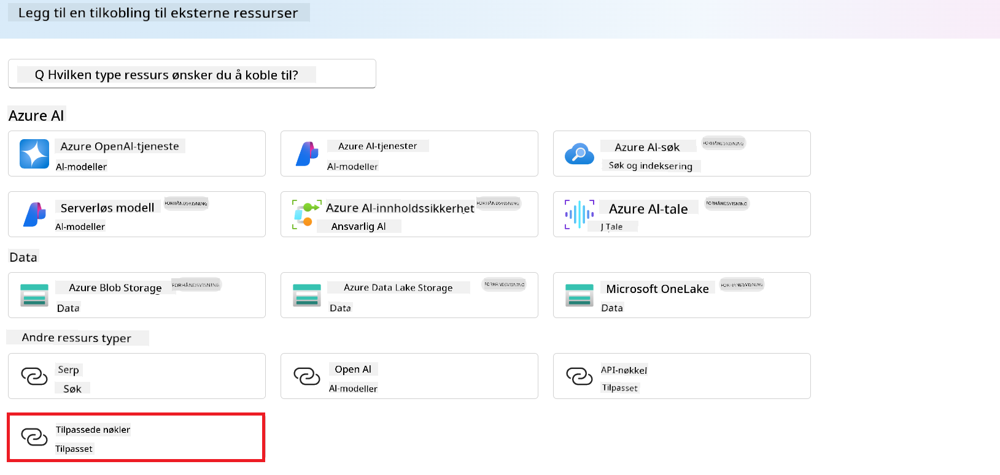

1. Utfør følgende oppgaver:

    - Velg **+ Add key value pairs**.
    - For nøkkelnavnet, skriv **endpoint** og lim inn endepunktet du kopierte fra Azure ML Studio i verdifeltet.
    - Velg **+ Add key value pairs** igjen.
    - For nøkkelnavnet, skriv **key** og lim inn nøkkelen du kopierte fra Azure ML Studio i verdifeltet.
    - Etter å ha lagt til nøklene, velg **is secret** for å hindre at nøkkelen blir eksponert.

    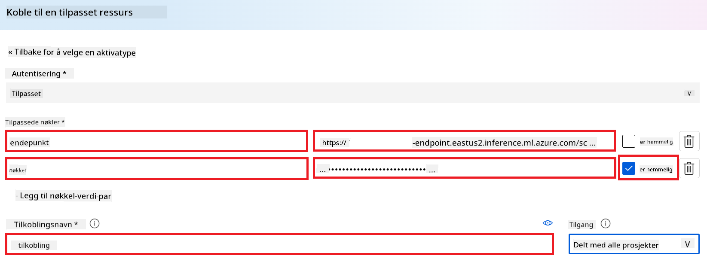

1. Velg **Add connection**.

#### Opprett Prompt flow

Du har lagt til en egendefinert tilkobling i Azure AI Foundry. Nå skal vi opprette en Prompt flow ved å følge disse stegene. Deretter kobler du denne Prompt flow til den egendefinerte tilkoblingen for å bruke den finjusterte modellen i Prompt flow.

1. Naviger til Azure AI Foundry-prosjektet du opprettet.

1. Velg **Prompt flow** fra fanen på venstre side.

1. Velg **+ Create** fra navigasjonsmenyen.

    

1. Velg **Chat flow** fra navigasjonsmenyen.

    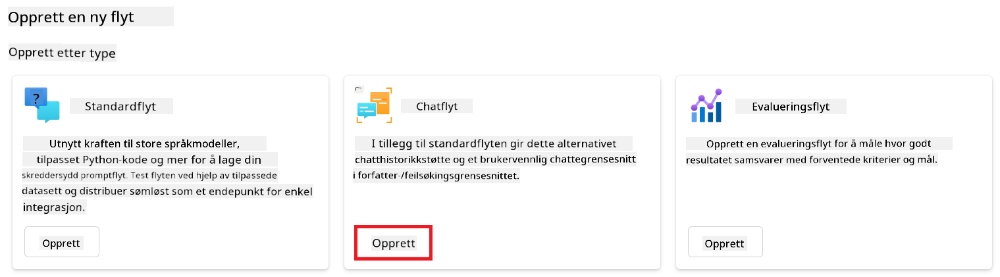

1. Skriv inn **Folder name** som skal brukes.

    

1. Velg **Create**.

#### Sett opp Prompt flow for å chatte med din egendefinerte Phi-3 / Phi-3.5-modell

Du må integrere den finjusterte Phi-3 / Phi-3.5-modellen i en Prompt flow. Den eksisterende Prompt flow som følger med er ikke laget for dette formålet. Derfor må du redesigne Prompt flow for å muliggjøre integrasjon av den egendefinerte modellen.

1. I Prompt flow, utfør følgende for å bygge opp den eksisterende flyten på nytt:

    - Velg **Raw file mode**.
    - Slett all eksisterende kode i *flow.dag.yml*-filen.
    - Legg til følgende kode i *flow.dag.yml*.

        ```yml
        inputs:
          input_data:
            type: string
            default: "Who founded Microsoft?"

        outputs:
          answer:
            type: string
            reference: ${integrate_with_promptflow.output}

        nodes:
        - name: integrate_with_promptflow
          type: python
          source:
            type: code
            path: integrate_with_promptflow.py
          inputs:
            input_data: ${inputs.input_data}
        ```

    - Velg **Save**.

    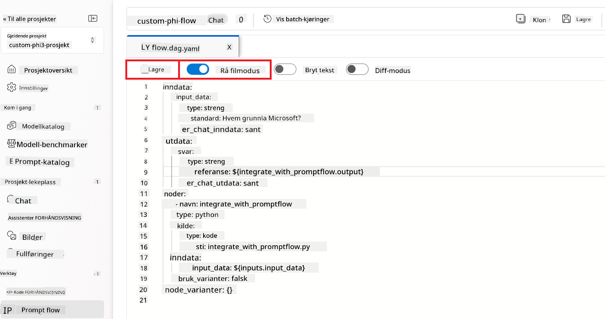

1. Legg til følgende kode i *integrate_with_promptflow.py* for å bruke den egendefinerte Phi-3 / Phi-3.5-modellen i Prompt flow.

    ```python
    import logging
    import requests
    from promptflow import tool
    from promptflow.connections import CustomConnection

    # Logging setup
    logging.basicConfig(
        format="%(asctime)s - %(levelname)s - %(name)s - %(message)s",
        datefmt="%Y-%m-%d %H:%M:%S",
        level=logging.DEBUG
    )
    logger = logging.getLogger(__name__)

    def query_phi3_model(input_data: str, connection: CustomConnection) -> str:
        """
        Send a request to the Phi-3 / Phi-3.5 model endpoint with the given input data using Custom Connection.
        """

        # "connection" is the name of the Custom Connection, "endpoint", "key" are the keys in the Custom Connection
        endpoint_url = connection.endpoint
        api_key = connection.key

        headers = {
            "Content-Type": "application/json",
            "Authorization": f"Bearer {api_key}"
        }
    data = {
        "input_data": [input_data],
        "params": {
            "temperature": 0.7,
            "max_new_tokens": 128,
            "do_sample": True,
            "return_full_text": True
            }
        }
        try:
            response = requests.post(endpoint_url, json=data, headers=headers)
            response.raise_for_status()
            
            # Log the full JSON response
            logger.debug(f"Full JSON response: {response.json()}")

            result = response.json()["output"]
            logger.info("Successfully received response from Azure ML Endpoint.")
            return result
        except requests.exceptions.RequestException as e:
            logger.error(f"Error querying Azure ML Endpoint: {e}")
            raise

    @tool
    def my_python_tool(input_data: str, connection: CustomConnection) -> str:
        """
        Tool function to process input data and query the Phi-3 / Phi-3.5 model.
        """
        return query_phi3_model(input_data, connection)

    ```

    

> [!NOTE]
> For mer detaljert informasjon om bruk av Prompt flow i Azure AI Foundry, kan du se [Prompt flow in Azure AI Foundry](https://learn.microsoft.com/azure/ai-studio/how-to/prompt-flow).

1. Velg **Chat input**, **Chat output** for å aktivere chat med modellen din.

    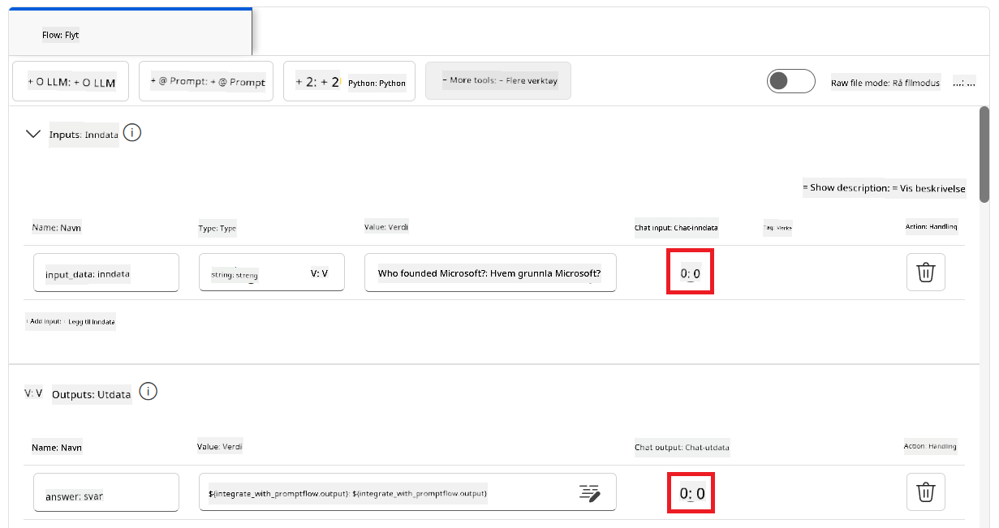

1. Nå er du klar til å chatte med din egendefinerte Phi-3 / Phi-3.5-modell. I neste øvelse vil du lære hvordan du starter Prompt flow og bruker den til å chatte med din finjusterte Phi-3 / Phi-3.5-modell.

> [!NOTE]
>
> Den ombygde flyten skal se ut som bildet under:
>
> 
>

#### Start Prompt flow

1. Velg **Start compute sessions** for å starte Prompt flow.

    

1. Velg **Validate and parse input** for å oppdatere parametere.

    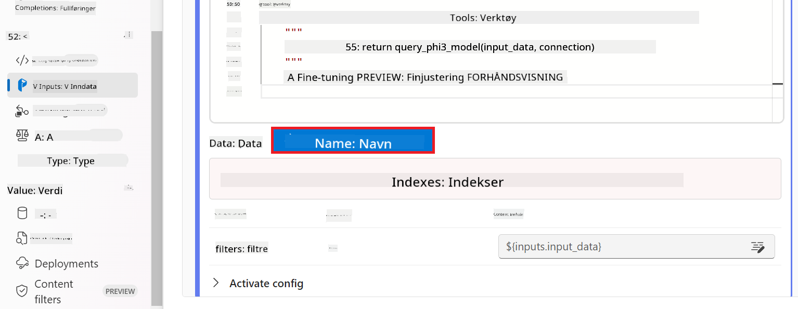

1. Velg **Value** for **connection** til den egendefinerte tilkoblingen du opprettet. For eksempel, *connection*.

    

#### Chat med din egendefinerte Phi-3 / Phi-3.5-modell

1. Velg **Chat**.

    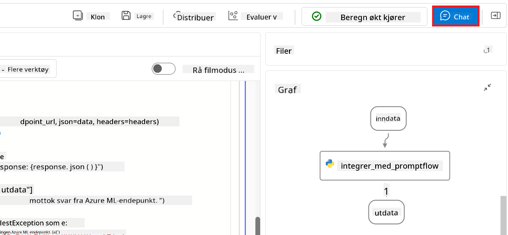

1. Her er et eksempel på resultatene: Nå kan du chatte med din egendefinerte Phi-3 / Phi-3.5-modell. Det anbefales å stille spørsmål basert på dataene som ble brukt til finjustering.

    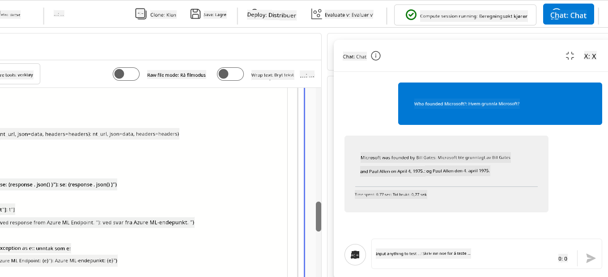

### Distribuer Azure OpenAI for å evaluere Phi-3 / Phi-3.5-modellen

For å evaluere Phi-3 / Phi-3.5-modellen i Azure AI Foundry, må du distribuere en Azure OpenAI-modell. Denne modellen vil bli brukt til å evaluere ytelsen til Phi-3 / Phi-3.5-modellen.

#### Distribuer Azure OpenAI

1. Logg inn på [Azure AI Foundry](https://ai.azure.com/?wt.mc_id=studentamb_279723).

1. Naviger til Azure AI Foundry-prosjektet du opprettet.

    

1. I prosjektet du opprettet, velg **Deployments** fra fanen på venstre side.

1. Velg **+ Deploy model** fra navigasjonsmenyen.

1. Velg **Deploy base model**.

    

1. Velg Azure OpenAI-modellen du ønsker å bruke. For eksempel, **gpt-4o**.

    

1. Velg **Confirm**.

### Evaluer den finjusterte Phi-3 / Phi-3.5-modellen ved hjelp av Azure AI Foundrys Prompt flow-evaluering

### Start en ny evaluering

1. Besøk [Azure AI Foundry](https://ai.azure.com/?wt.mc_id=studentamb_279723).

1. Naviger til Azure AI Foundry-prosjektet du opprettet.

    

1. I prosjektet du opprettet, velg **Evaluation** fra fanen på venstre side.

1. Velg **+ New evaluation** fra navigasjonsmenyen.

    

1. Velg **Prompt flow** evaluering.

    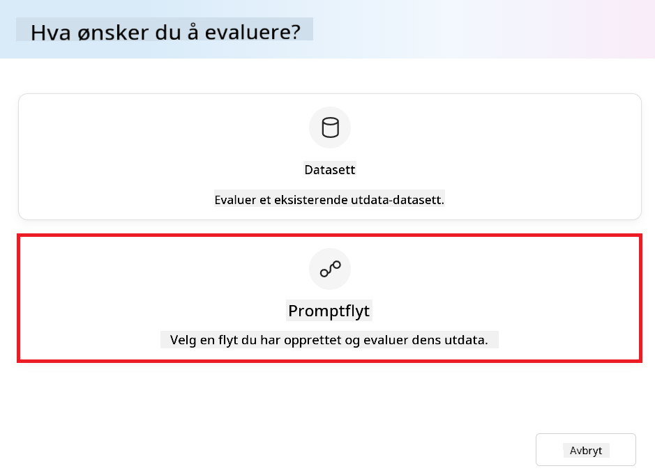

1. Utfør følgende oppgaver:

    - Skriv inn evalueringsnavnet. Det må være en unik verdi.
    - Velg **Question and answer without context** som oppgavetype. Fordi datasettet **ULTRACHAT_200k** som brukes i denne veiledningen ikke inneholder kontekst.
    - Velg prompt flow du ønsker å evaluere.

    

1. Velg **Next**.

1. Utfør følgende oppgaver:

    - Velg **Add your dataset** for å laste opp datasettet. For eksempel kan du laste opp testdatasettet, som *test_data.json1*, som følger med når du laster ned **ULTRACHAT_200k** datasettet.
    - Velg riktig **Dataset column** som passer til datasettet ditt. For eksempel, hvis du bruker **ULTRACHAT_200k** datasettet, velg **${data.prompt}** som dataset-kolonne.

    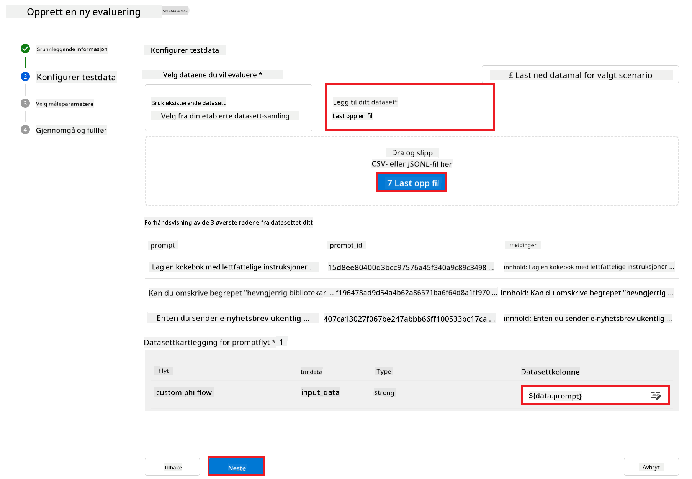

1. Velg **Next**.

1. Utfør følgende oppgaver for å konfigurere ytelses- og kvalitetsmålinger:

    - Velg ytelses- og kvalitetsmålingene du ønsker å bruke.
    - Velg Azure OpenAI-modellen du opprettet for evaluering. For eksempel, velg **gpt-4o**.

    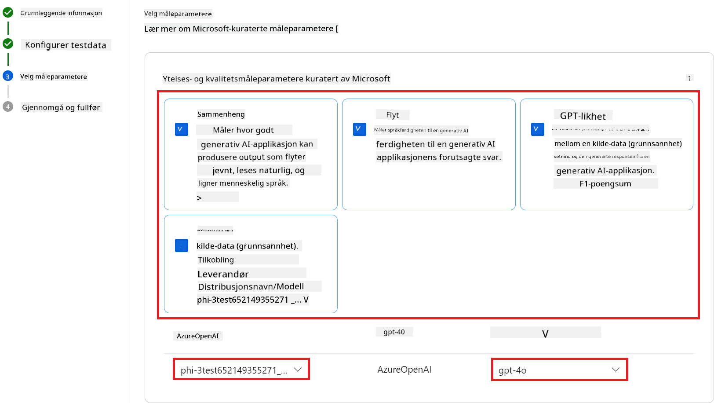

1. Utfør følgende oppgaver for å konfigurere risikio- og sikkerhetsmålinger:

    - Velg risikio- og sikkerhetsmålingene du ønsker å bruke.
    - Velg terskelen for å beregne feilrate du ønsker å bruke. For eksempel, velg **Medium**.
    - For **question**, velg **Data source** til **{$data.prompt}**.
    - For **answer**, velg **Data source** til **{$run.outputs.answer}**.
    - For **ground_truth**, velg **Data source** til **{$data.message}**.

    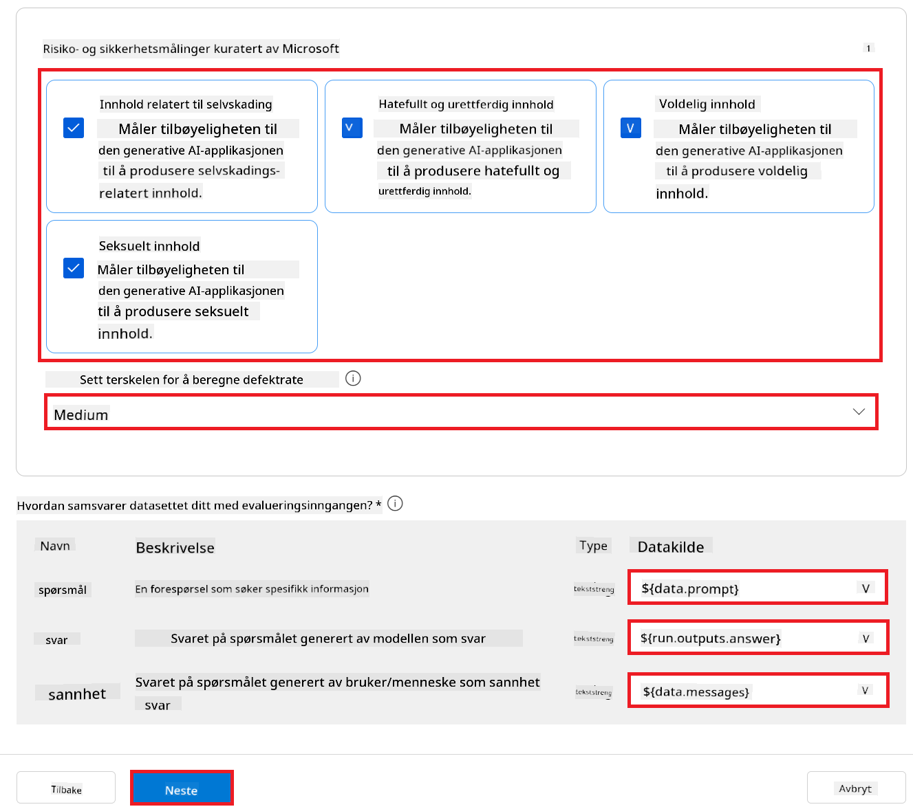

1. Velg **Next**.

1. Velg **Submit** for å starte evalueringen.

1. Evalueringen vil ta litt tid å fullføre. Du kan følge fremdriften i **Evaluation**-fanen.

### Gå gjennom evalueringsresultatene
> [!NOTE]
> Resultatene som presenteres nedenfor er ment å illustrere evalueringsprosessen. I denne veiledningen har vi brukt en modell som er finjustert på et relativt lite datasett, noe som kan føre til suboptimale resultater. Faktiske resultater kan variere betydelig avhengig av størrelsen, kvaliteten og mangfoldet i datasettet som brukes, samt den spesifikke konfigurasjonen av modellen.
Når evalueringen er fullført, kan du gå gjennom resultatene for både ytelse og sikkerhetsmålinger.

1. Ytelses- og kvalitetsmålinger:

    - vurder modellens evne til å generere sammenhengende, flytende og relevante svar.

    

1. Risiko- og sikkerhetsmålinger:

    - Sørg for at modellens output er trygt og i tråd med Responsible AI Principles, og unngå skadelig eller støtende innhold.

    

1. Du kan bla ned for å se **Detaljerte måleresultater**.

    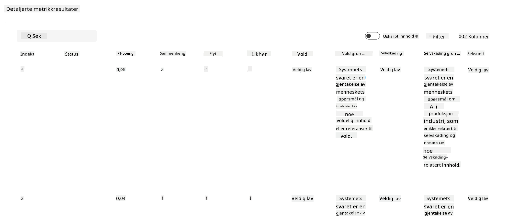

1. Ved å evaluere din tilpassede Phi-3 / Phi-3.5-modell mot både ytelses- og sikkerhetsmålinger, kan du bekrefte at modellen ikke bare er effektiv, men også følger ansvarlige AI-prinsipper, noe som gjør den klar for bruk i praksis.

## Gratulerer!

### Du har fullført denne veiledningen

Du har nå evaluert den finjusterte Phi-3-modellen integrert med Prompt flow i Azure AI Foundry. Dette er et viktig steg for å sikre at AI-modellene dine ikke bare presterer godt, men også følger Microsofts Responsible AI-prinsipper, slik at du kan bygge pålitelige og troverdige AI-applikasjoner.


## Rydd opp i Azure-ressursene

Rydd opp i Azure-ressursene dine for å unngå ekstra kostnader på kontoen din. Gå til Azure-portalen og slett følgende ressurser:

- Azure Machine learning-ressursen.
- Azure Machine learning-modellendepunktet.
- Azure AI Foundry Project-ressursen.
- Azure AI Foundry Prompt flow-ressursen.

### Neste steg

#### Dokumentasjon

- [Assess AI systems by using the Responsible AI dashboard](https://learn.microsoft.com/azure/machine-learning/concept-responsible-ai-dashboard?view=azureml-api-2&source=recommendations?wt.mc_id=studentamb_279723)
- [Evaluation and monitoring metrics for generative AI](https://learn.microsoft.com/azure/ai-studio/concepts/evaluation-metrics-built-in?tabs=definition?wt.mc_id=studentamb_279723)
- [Azure AI Foundry documentation](https://learn.microsoft.com/azure/ai-studio/?wt.mc_id=studentamb_279723)
- [Prompt flow documentation](https://microsoft.github.io/promptflow/?wt.mc_id=studentamb_279723)

#### Opplæringsinnhold

- [Introduction to Microsoft's Responsible AI Approach](https://learn.microsoft.com/training/modules/introduction-to-microsofts-responsible-ai-approach/?source=recommendations?wt.mc_id=studentamb_279723)
- [Introduction to Azure AI Foundry](https://learn.microsoft.com/training/modules/introduction-to-azure-ai-studio/?wt.mc_id=studentamb_279723)

### Referanser

- [What is Responsible AI?](https://learn.microsoft.com/azure/machine-learning/concept-responsible-ai?view=azureml-api-2?wt.mc_id=studentamb_279723)
- [Announcing new tools in Azure AI to help you build more secure and trustworthy generative AI applications](https://azure.microsoft.com/blog/announcing-new-tools-in-azure-ai-to-help-you-build-more-secure-and-trustworthy-generative-ai-applications/?wt.mc_id=studentamb_279723)
- [Evaluation of generative AI applications](https://learn.microsoft.com/azure/ai-studio/concepts/evaluation-approach-gen-ai?wt.mc_id%3Dstudentamb_279723)

**Ansvarsfraskrivelse**:  
Dette dokumentet er oversatt ved hjelp av AI-oversettelsestjenesten [Co-op Translator](https://github.com/Azure/co-op-translator). Selv om vi streber etter nøyaktighet, vennligst vær oppmerksom på at automatiske oversettelser kan inneholde feil eller unøyaktigheter. Det opprinnelige dokumentet på originalspråket skal anses som den autoritative kilden. For kritisk informasjon anbefales profesjonell menneskelig oversettelse. Vi er ikke ansvarlige for eventuelle misforståelser eller feiltolkninger som oppstår ved bruk av denne oversettelsen.