<!--
CO_OP_TRANSLATOR_METADATA:
{
  "original_hash": "455be2b7b9c3390d367d528f8fab2aa0",
  "translation_date": "2025-07-17T00:32:07+00:00",
  "source_file": "md/02.Application/01.TextAndChat/Phi3/E2E_Phi-3-FineTuning_PromptFlow_Integration.md",
  "language_code": "no"
}
-->
# Finjuster og integrer tilpassede Phi-3-modeller med Prompt flow

Dette ende-til-ende (E2E) eksempelet er basert på guiden "[Fine-Tune and Integrate Custom Phi-3 Models with Prompt Flow: Step-by-Step Guide](https://techcommunity.microsoft.com/t5/educator-developer-blog/fine-tune-and-integrate-custom-phi-3-models-with-prompt-flow/ba-p/4178612?WT.mc_id=aiml-137032-kinfeylo)" fra Microsoft Tech Community. Det introduserer prosessene for finjustering, distribusjon og integrering av tilpassede Phi-3-modeller med Prompt flow.

## Oversikt

I dette E2E-eksempelet vil du lære hvordan du finjusterer Phi-3-modellen og integrerer den med Prompt flow. Ved å bruke Azure Machine Learning og Prompt flow vil du etablere en arbeidsflyt for distribusjon og bruk av tilpassede AI-modeller. Dette E2E-eksempelet er delt inn i tre scenarier:

**Scenario 1: Sett opp Azure-ressurser og forbered for finjustering**

**Scenario 2: Finjuster Phi-3-modellen og distribuer i Azure Machine Learning Studio**

**Scenario 3: Integrer med Prompt flow og chat med din tilpassede modell**

Her er en oversikt over dette E2E-eksempelet.

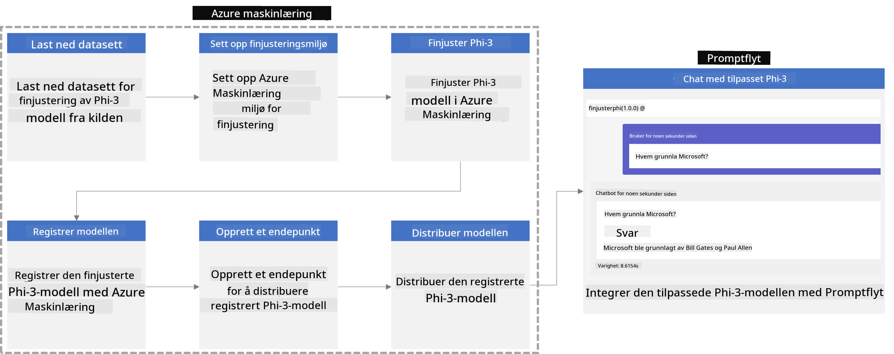

### Innholdsfortegnelse

1. **[Scenario 1: Sett opp Azure-ressurser og forbered for finjustering](../../../../../../md/02.Application/01.TextAndChat/Phi3)**
    - [Opprett et Azure Machine Learning Workspace](../../../../../../md/02.Application/01.TextAndChat/Phi3)
    - [Be om GPU-kvoter i Azure-abonnement](../../../../../../md/02.Application/01.TextAndChat/Phi3)
    - [Legg til rolle-tilordning](../../../../../../md/02.Application/01.TextAndChat/Phi3)
    - [Sett opp prosjekt](../../../../../../md/02.Application/01.TextAndChat/Phi3)
    - [Forbered datasett for finjustering](../../../../../../md/02.Application/01.TextAndChat/Phi3)

1. **[Scenario 2: Finjuster Phi-3-modellen og distribuer i Azure Machine Learning Studio](../../../../../../md/02.Application/01.TextAndChat/Phi3)**
    - [Sett opp Azure CLI](../../../../../../md/02.Application/01.TextAndChat/Phi3)
    - [Finjuster Phi-3-modellen](../../../../../../md/02.Application/01.TextAndChat/Phi3)
    - [Distribuer den finjusterte modellen](../../../../../../md/02.Application/01.TextAndChat/Phi3)

1. **[Scenario 3: Integrer med Prompt flow og chat med din tilpassede modell](../../../../../../md/02.Application/01.TextAndChat/Phi3)**
    - [Integrer den tilpassede Phi-3-modellen med Prompt flow](../../../../../../md/02.Application/01.TextAndChat/Phi3)
    - [Chat med din tilpassede modell](../../../../../../md/02.Application/01.TextAndChat/Phi3)

## Scenario 1: Sett opp Azure-ressurser og forbered for finjustering

### Opprett et Azure Machine Learning Workspace

1. Skriv *azure machine learning* i **søkelinjen** øverst på portal-siden og velg **Azure Machine Learning** fra alternativene som vises.

    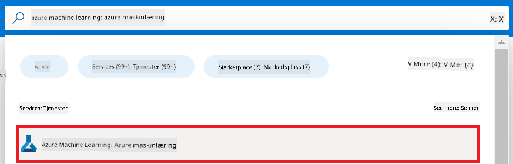

1. Velg **+ Create** fra navigasjonsmenyen.

1. Velg **New workspace** fra navigasjonsmenyen.

    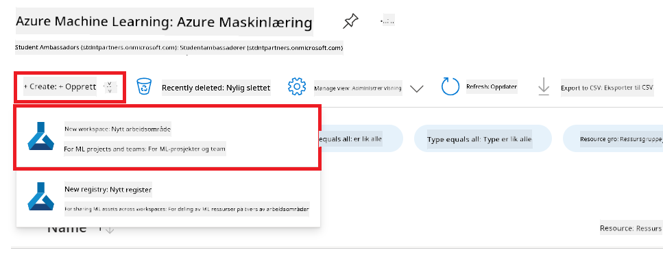

1. Utfør følgende oppgaver:

    - Velg ditt Azure **Subscription**.
    - Velg **Resource group** som skal brukes (opprett en ny om nødvendig).
    - Skriv inn **Workspace Name**. Det må være et unikt navn.
    - Velg **Region** du ønsker å bruke.
    - Velg **Storage account** som skal brukes (opprett en ny om nødvendig).
    - Velg **Key vault** som skal brukes (opprett en ny om nødvendig).
    - Velg **Application insights** som skal brukes (opprett en ny om nødvendig).
    - Velg **Container registry** som skal brukes (opprett en ny om nødvendig).

    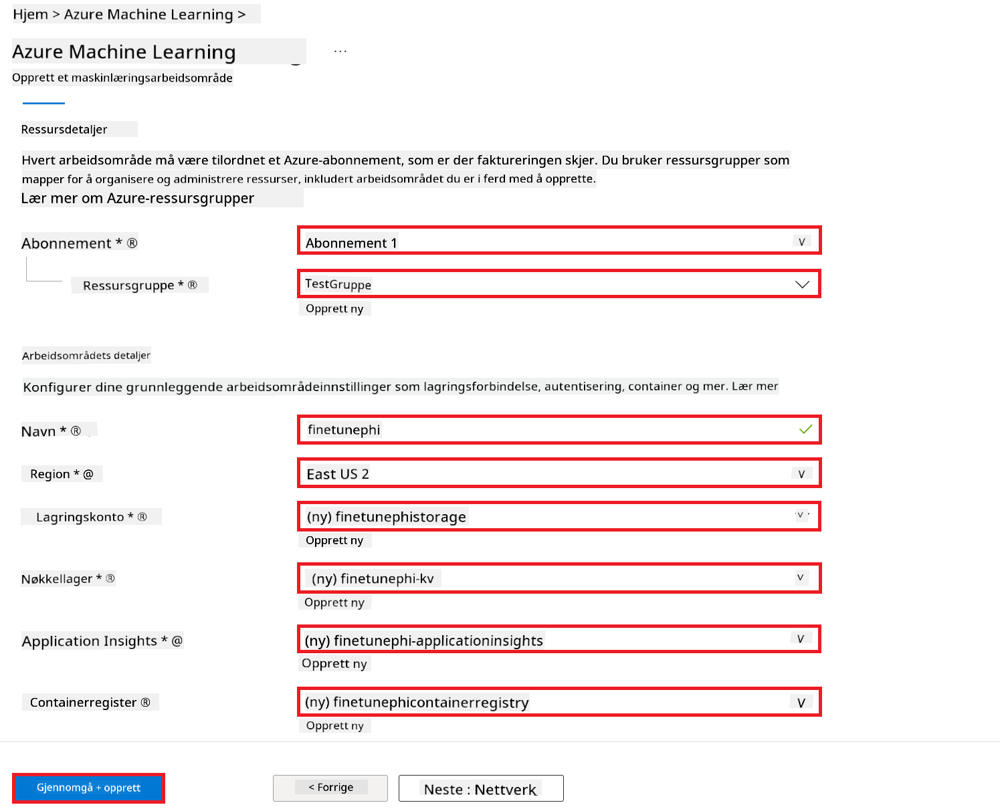

1. Velg **Review + Create**.

1. Velg **Create**.

### Be om GPU-kvoter i Azure-abonnement

I dette E2E-eksempelet vil du bruke *Standard_NC24ads_A100_v4 GPU* for finjustering, som krever en kvotebegjæring, og *Standard_E4s_v3* CPU for distribusjon, som ikke krever kvotebegjæring.

> [!NOTE]
>
> Kun Pay-As-You-Go-abonnementer (standard abonnementstype) er kvalifisert for GPU-tildeling; fordelabonnementer støttes ikke for øyeblikket.
>
> For de som bruker fordelabonnementer (som Visual Studio Enterprise Subscription) eller ønsker å raskt teste finjusterings- og distribusjonsprosessen, gir denne veiledningen også instruksjoner for finjustering med et minimalt datasett ved bruk av CPU. Det er imidlertid viktig å merke seg at finjusteringsresultatene er betydelig bedre når man bruker GPU med større datasett.

1. Besøk [Azure ML Studio](https://ml.azure.com/home?wt.mc_id=studentamb_279723).

1. Utfør følgende oppgaver for å be om *Standard NCADSA100v4 Family* kvote:

    - Velg **Quota** fra venstre side-fane.
    - Velg **Virtual machine family** som skal brukes. For eksempel, velg **Standard NCADSA100v4 Family Cluster Dedicated vCPUs**, som inkluderer *Standard_NC24ads_A100_v4* GPU.
    - Velg **Request quota** fra navigasjonsmenyen.

        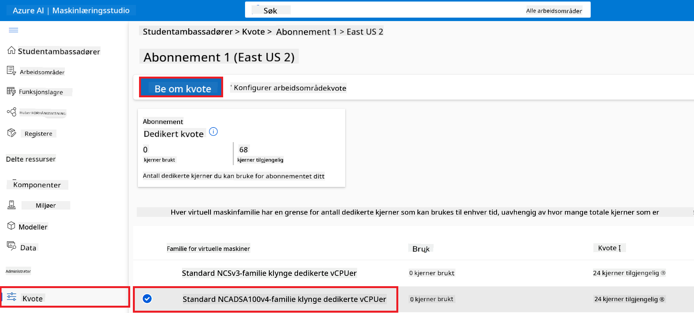

    - På siden for Request quota, skriv inn **New cores limit** du ønsker å bruke. For eksempel, 24.
    - På siden for Request quota, velg **Submit** for å sende inn forespørselen om GPU-kvote.

> [!NOTE]
> Du kan velge passende GPU eller CPU for dine behov ved å se i dokumentasjonen [Sizes for Virtual Machines in Azure](https://learn.microsoft.com/azure/virtual-machines/sizes/overview?tabs=breakdownseries%2Cgeneralsizelist%2Ccomputesizelist%2Cmemorysizelist%2Cstoragesizelist%2Cgpusizelist%2Cfpgasizelist%2Chpcsizelist).

### Legg til rolle-tilordning

For å finjustere og distribuere modellene dine må du først opprette en User Assigned Managed Identity (UAI) og tildele den riktige tillatelser. Denne UAI vil bli brukt for autentisering under distribusjon.

#### Opprett User Assigned Managed Identity (UAI)

1. Skriv *managed identities* i **søkelinjen** øverst på portal-siden og velg **Managed Identities** fra alternativene som vises.

    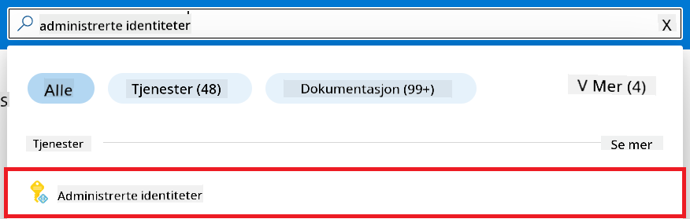

1. Velg **+ Create**.

    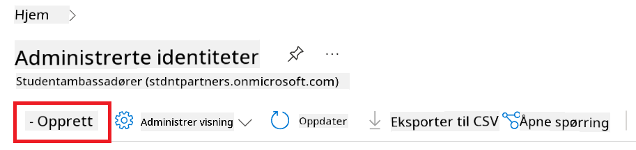

1. Utfør følgende oppgaver:

    - Velg ditt Azure **Subscription**.
    - Velg **Resource group** som skal brukes (opprett en ny om nødvendig).
    - Velg **Region** du ønsker å bruke.
    - Skriv inn **Name**. Det må være et unikt navn.

1. Velg **Review + create**.

1. Velg **+ Create**.

#### Legg til Contributor-rolle til Managed Identity

1. Naviger til Managed Identity-ressursen du opprettet.

1. Velg **Azure role assignments** fra venstre side-fane.

1. Velg **+Add role assignment** fra navigasjonsmenyen.

1. På siden for Add role assignment, utfør følgende oppgaver:
    - Velg **Scope** til **Resource group**.
    - Velg ditt Azure **Subscription**.
    - Velg **Resource group** som skal brukes.
    - Velg **Role** til **Contributor**.

    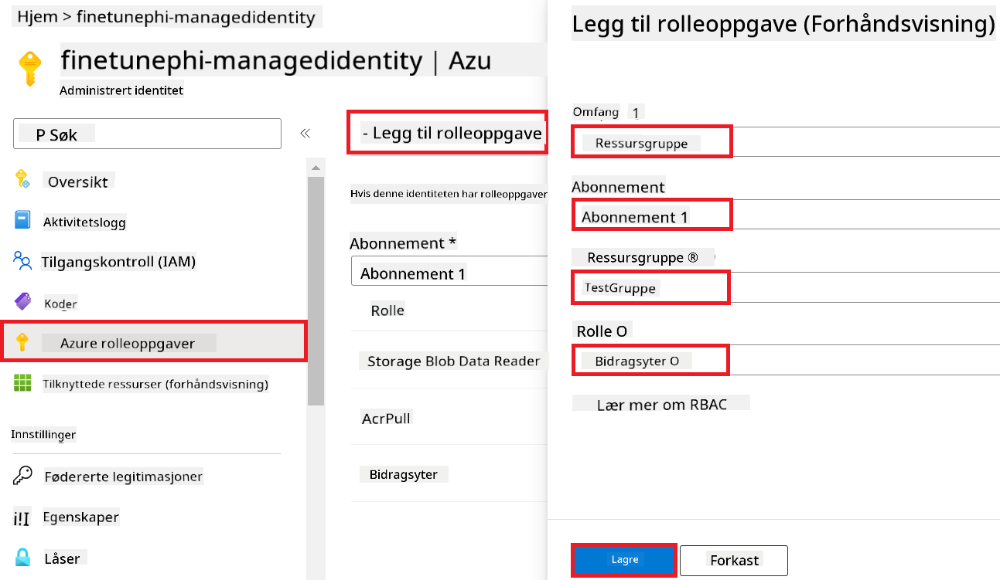

1. Velg **Save**.

#### Legg til Storage Blob Data Reader-rolle til Managed Identity

1. Skriv *storage accounts* i **søkelinjen** øverst på portal-siden og velg **Storage accounts** fra alternativene som vises.

    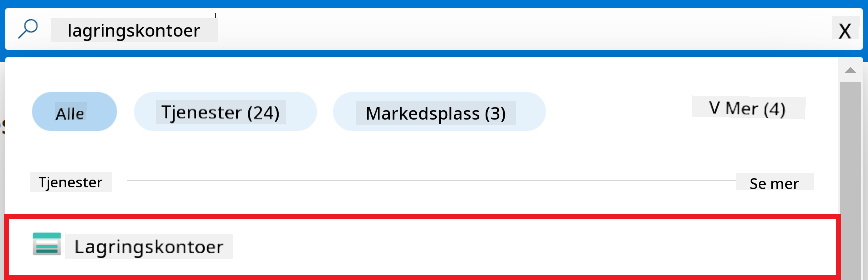

1. Velg lagringskontoen som er tilknyttet Azure Machine Learning workspace du opprettet. For eksempel, *finetunephistorage*.

1. Utfør følgende oppgaver for å navigere til Add role assignment-siden:

    - Naviger til Azure Storage-kontoen du opprettet.
    - Velg **Access Control (IAM)** fra venstre side-fane.
    - Velg **+ Add** fra navigasjonsmenyen.
    - Velg **Add role assignment** fra navigasjonsmenyen.

    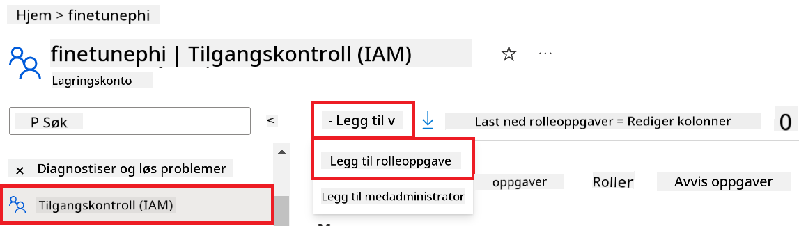

1. På siden for Add role assignment, utfør følgende oppgaver:

    - På Role-siden, skriv *Storage Blob Data Reader* i **søkelinjen** og velg **Storage Blob Data Reader** fra alternativene som vises.
    - På Role-siden, velg **Next**.
    - På Members-siden, velg **Assign access to** **Managed identity**.
    - På Members-siden, velg **+ Select members**.
    - På Select managed identities-siden, velg ditt Azure **Subscription**.
    - På Select managed identities-siden, velg **Managed identity** til **Manage Identity**.
    - På Select managed identities-siden, velg den Manage Identity du opprettet. For eksempel, *finetunephi-managedidentity*.
    - På Select managed identities-siden, velg **Select**.

    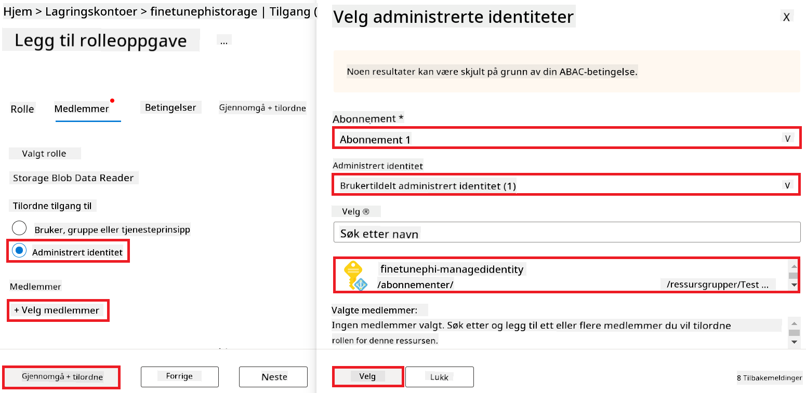

1. Velg **Review + assign**.

#### Legg til AcrPull-rolle til Managed Identity

1. Skriv *container registries* i **søkelinjen** øverst på portal-siden og velg **Container registries** fra alternativene som vises.

    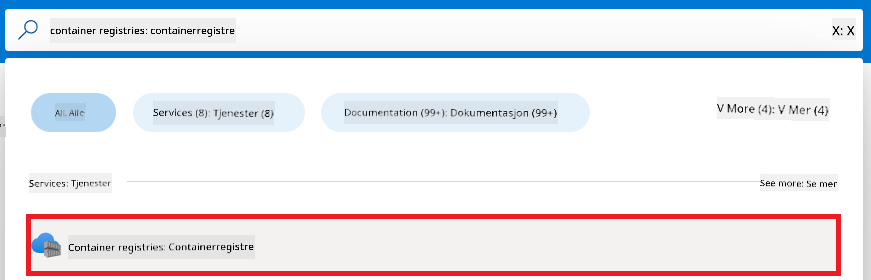

1. Velg container registry som er tilknyttet Azure Machine Learning workspace. For eksempel, *finetunephicontainerregistries*

1. Utfør følgende oppgaver for å navigere til Add role assignment-siden:

    - Velg **Access Control (IAM)** fra venstre side-fane.
    - Velg **+ Add** fra navigasjonsmenyen.
    - Velg **Add role assignment** fra navigasjonsmenyen.

1. På siden for Add role assignment, utfør følgende oppgaver:

    - På Role-siden, skriv *AcrPull* i **søkelinjen** og velg **AcrPull** fra alternativene som vises.
    - På Role-siden, velg **Next**.
    - På Members-siden, velg **Assign access to** **Managed identity**.
    - På Members-siden, velg **+ Select members**.
    - På Select managed identities-siden, velg ditt Azure **Subscription**.
    - På Select managed identities-siden, velg **Managed identity** til **Manage Identity**.
    - På Select managed identities-siden, velg den Manage Identity du opprettet. For eksempel, *finetunephi-managedidentity*.
    - På Select managed identities-siden, velg **Select**.
    - Velg **Review + assign**.

### Sett opp prosjekt

Nå skal du opprette en mappe å jobbe i og sette opp et virtuelt miljø for å utvikle et program som interagerer med brukere og bruker lagret chat-historikk fra Azure Cosmos DB for å informere svarene sine.

#### Opprett en mappe å jobbe i

1. Åpne et terminalvindu og skriv følgende kommando for å opprette en mappe kalt *finetune-phi* i standardbanen.

    ```console
    mkdir finetune-phi
    ```

1. Skriv følgende kommando i terminalen for å navigere til *finetune-phi*-mappen du opprettet.

    ```console
    cd finetune-phi
    ```

#### Opprett et virtuelt miljø

1. Skriv følgende kommando i terminalen for å opprette et virtuelt miljø kalt *.venv*.

    ```console
    python -m venv .venv
    ```

1. Skriv følgende kommando i terminalen for å aktivere det virtuelle miljøet.

    ```console
    .venv\Scripts\activate.bat
    ```
> [!NOTE]
>
> Hvis det fungerte, skal du se *(.venv)* før kommandoprompten.
#### Installer de nødvendige pakkene

1. Skriv inn følgende kommandoer i terminalen for å installere de nødvendige pakkene.

    ```console
    pip install datasets==2.19.1
    pip install transformers==4.41.1
    pip install azure-ai-ml==1.16.0
    pip install torch==2.3.1
    pip install trl==0.9.4
    pip install promptflow==1.12.0
    ```

#### Opprett prosjektfiler

I denne øvelsen skal du lage de essensielle filene for prosjektet vårt. Disse filene inkluderer skript for å laste ned datasettet, sette opp Azure Machine Learning-miljøet, finjustere Phi-3-modellen og distribuere den finjusterte modellen. Du skal også lage en *conda.yml*-fil for å sette opp finjusteringsmiljøet.

I denne øvelsen skal du:

- Lage en *download_dataset.py*-fil for å laste ned datasettet.
- Lage en *setup_ml.py*-fil for å sette opp Azure Machine Learning-miljøet.
- Lage en *fine_tune.py*-fil i *finetuning_dir*-mappen for å finjustere Phi-3-modellen med datasettet.
- Lage en *conda.yml*-fil for å sette opp finjusteringsmiljøet.
- Lage en *deploy_model.py*-fil for å distribuere den finjusterte modellen.
- Lage en *integrate_with_promptflow.py*-fil for å integrere den finjusterte modellen og kjøre modellen med Prompt flow.
- Lage en flow.dag.yml-fil for å sette opp arbeidsflytstrukturen for Prompt flow.
- Lage en *config.py*-fil for å legge inn Azure-informasjon.

> [!NOTE]
>
> Komplett mappestruktur:
>
> ```text
> └── YourUserName
> .    └── finetune-phi
> .        ├── finetuning_dir
> .        │      └── fine_tune.py
> .        ├── conda.yml
> .        ├── config.py
> .        ├── deploy_model.py
> .        ├── download_dataset.py
> .        ├── flow.dag.yml
> .        ├── integrate_with_promptflow.py
> .        └── setup_ml.py
> ```

1. Åpne **Visual Studio Code**.

1. Velg **File** i menylinjen.

1. Velg **Open Folder**.

1. Velg *finetune-phi*-mappen du opprettet, som ligger på *C:\Users\yourUserName\finetune-phi*.

    

1. I venstre panel i Visual Studio Code, høyreklikk og velg **New File** for å lage en ny fil kalt *download_dataset.py*.

1. I venstre panel i Visual Studio Code, høyreklikk og velg **New File** for å lage en ny fil kalt *setup_ml.py*.

1. I venstre panel i Visual Studio Code, høyreklikk og velg **New File** for å lage en ny fil kalt *deploy_model.py*.

    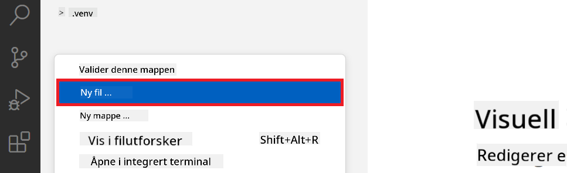

1. I venstre panel i Visual Studio Code, høyreklikk og velg **New Folder** for å lage en ny mappe kalt *finetuning_dir*.

1. I *finetuning_dir*-mappen, lag en ny fil kalt *fine_tune.py*.

#### Opprett og konfigurer *conda.yml*-filen

1. I venstre panel i Visual Studio Code, høyreklikk og velg **New File** for å lage en ny fil kalt *conda.yml*.

1. Legg til følgende kode i *conda.yml*-filen for å sette opp finjusteringsmiljøet for Phi-3-modellen.

    ```yml
    name: phi-3-training-env
    channels:
      - defaults
      - conda-forge
    dependencies:
      - python=3.10
      - pip
      - numpy<2.0
      - pip:
          - torch==2.4.0
          - torchvision==0.19.0
          - trl==0.8.6
          - transformers==4.41
          - datasets==2.21.0
          - azureml-core==1.57.0
          - azure-storage-blob==12.19.0
          - azure-ai-ml==1.16
          - azure-identity==1.17.1
          - accelerate==0.33.0
          - mlflow==2.15.1
          - azureml-mlflow==1.57.0
    ```

#### Opprett og konfigurer *config.py*-filen

1. I venstre panel i Visual Studio Code, høyreklikk og velg **New File** for å lage en ny fil kalt *config.py*.

1. Legg til følgende kode i *config.py*-filen for å legge inn din Azure-informasjon.

    ```python
    # Azure settings
    AZURE_SUBSCRIPTION_ID = "your_subscription_id"
    AZURE_RESOURCE_GROUP_NAME = "your_resource_group_name" # "TestGroup"

    # Azure Machine Learning settings
    AZURE_ML_WORKSPACE_NAME = "your_workspace_name" # "finetunephi-workspace"

    # Azure Managed Identity settings
    AZURE_MANAGED_IDENTITY_CLIENT_ID = "your_azure_managed_identity_client_id"
    AZURE_MANAGED_IDENTITY_NAME = "your_azure_managed_identity_name" # "finetunephi-mangedidentity"
    AZURE_MANAGED_IDENTITY_RESOURCE_ID = f"/subscriptions/{AZURE_SUBSCRIPTION_ID}/resourceGroups/{AZURE_RESOURCE_GROUP_NAME}/providers/Microsoft.ManagedIdentity/userAssignedIdentities/{AZURE_MANAGED_IDENTITY_NAME}"

    # Dataset file paths
    TRAIN_DATA_PATH = "data/train_data.jsonl"
    TEST_DATA_PATH = "data/test_data.jsonl"

    # Fine-tuned model settings
    AZURE_MODEL_NAME = "your_fine_tuned_model_name" # "finetune-phi-model"
    AZURE_ENDPOINT_NAME = "your_fine_tuned_model_endpoint_name" # "finetune-phi-endpoint"
    AZURE_DEPLOYMENT_NAME = "your_fine_tuned_model_deployment_name" # "finetune-phi-deployment"

    AZURE_ML_API_KEY = "your_fine_tuned_model_api_key"
    AZURE_ML_ENDPOINT = "your_fine_tuned_model_endpoint_uri" # "https://{your-endpoint-name}.{your-region}.inference.ml.azure.com/score"
    ```

#### Legg til Azure-miljøvariabler

1. Gjør følgende for å legge til Azure Subscription ID:

    - Skriv *subscriptions* i **søkelinjen** øverst på portal-siden og velg **Subscriptions** fra alternativene som dukker opp.
    - Velg Azure-abonnementet du bruker.
    - Kopier og lim inn Subscription ID i *config.py*-filen.

    

1. Gjør følgende for å legge til Azure Workspace Name:

    - Gå til Azure Machine Learning-ressursen du opprettet.
    - Kopier og lim inn kontonavnet ditt i *config.py*-filen.

    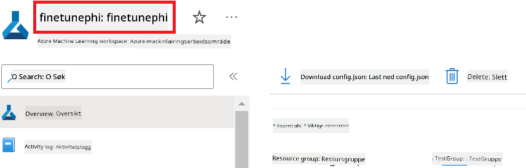

1. Gjør følgende for å legge til Azure Resource Group Name:

    - Gå til Azure Machine Learning-ressursen du opprettet.
    - Kopier og lim inn navnet på Azure Resource Group i *config.py*-filen.

    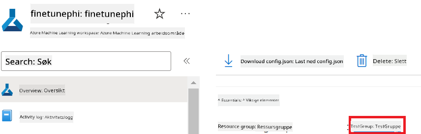

2. Gjør følgende for å legge til Azure Managed Identity-navn:

    - Gå til Managed Identities-ressursen du opprettet.
    - Kopier og lim inn navnet på Azure Managed Identity i *config.py*-filen.

    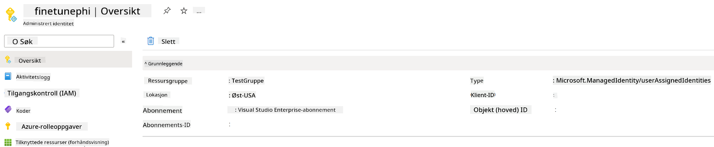

### Forbered datasettet for finjustering

I denne øvelsen skal du kjøre *download_dataset.py*-filen for å laste ned *ULTRACHAT_200k*-datasettet til ditt lokale miljø. Deretter bruker du dette datasettet til å finjustere Phi-3-modellen i Azure Machine Learning.

#### Last ned datasettet ditt med *download_dataset.py*

1. Åpne *download_dataset.py*-filen i Visual Studio Code.

1. Legg til følgende kode i *download_dataset.py*.

    ```python
    import json
    import os
    from datasets import load_dataset
    from config import (
        TRAIN_DATA_PATH,
        TEST_DATA_PATH)

    def load_and_split_dataset(dataset_name, config_name, split_ratio):
        """
        Load and split a dataset.
        """
        # Load the dataset with the specified name, configuration, and split ratio
        dataset = load_dataset(dataset_name, config_name, split=split_ratio)
        print(f"Original dataset size: {len(dataset)}")
        
        # Split the dataset into train and test sets (80% train, 20% test)
        split_dataset = dataset.train_test_split(test_size=0.2)
        print(f"Train dataset size: {len(split_dataset['train'])}")
        print(f"Test dataset size: {len(split_dataset['test'])}")
        
        return split_dataset

    def save_dataset_to_jsonl(dataset, filepath):
        """
        Save a dataset to a JSONL file.
        """
        # Create the directory if it does not exist
        os.makedirs(os.path.dirname(filepath), exist_ok=True)
        
        # Open the file in write mode
        with open(filepath, 'w', encoding='utf-8') as f:
            # Iterate over each record in the dataset
            for record in dataset:
                # Dump the record as a JSON object and write it to the file
                json.dump(record, f)
                # Write a newline character to separate records
                f.write('\n')
        
        print(f"Dataset saved to {filepath}")

    def main():
        """
        Main function to load, split, and save the dataset.
        """
        # Load and split the ULTRACHAT_200k dataset with a specific configuration and split ratio
        dataset = load_and_split_dataset("HuggingFaceH4/ultrachat_200k", 'default', 'train_sft[:1%]')
        
        # Extract the train and test datasets from the split
        train_dataset = dataset['train']
        test_dataset = dataset['test']

        # Save the train dataset to a JSONL file
        save_dataset_to_jsonl(train_dataset, TRAIN_DATA_PATH)
        
        # Save the test dataset to a separate JSONL file
        save_dataset_to_jsonl(test_dataset, TEST_DATA_PATH)

    if __name__ == "__main__":
        main()

    ```

> [!TIP]
>
> **Veiledning for finjustering med et minimalt datasett ved bruk av CPU**
>
> Hvis du ønsker å bruke CPU for finjustering, er denne metoden ideell for de med fordelabonnementer (som Visual Studio Enterprise Subscription) eller for raskt å teste finjusterings- og distribusjonsprosessen.
>
> Bytt ut `dataset = load_and_split_dataset("HuggingFaceH4/ultrachat_200k", 'default', 'train_sft[:1%]')` med `dataset = load_and_split_dataset("HuggingFaceH4/ultrachat_200k", 'default', 'train_sft[:10]')`
>

1. Skriv inn følgende kommando i terminalen for å kjøre skriptet og laste ned datasettet til ditt lokale miljø.

    ```console
    python download_data.py
    ```

1. Bekreft at datasettene ble lagret riktig i din lokale *finetune-phi/data*-mappe.

> [!NOTE]
>
> **Datasettstørrelse og finjusteringstid**
>
> I dette E2E-eksempelet bruker du kun 1 % av datasettet (`train_sft[:1%]`). Dette reduserer datamengden betydelig, noe som gjør både opplasting og finjustering raskere. Du kan justere prosentandelen for å finne riktig balanse mellom treningstid og modellens ytelse. Å bruke et mindre datasett reduserer tiden som kreves for finjustering, noe som gjør prosessen mer håndterbar for et E2E-eksempel.

## Scenario 2: Finjuster Phi-3-modellen og distribuer i Azure Machine Learning Studio

### Sett opp Azure CLI

Du må sette opp Azure CLI for å autentisere miljøet ditt. Azure CLI lar deg administrere Azure-ressurser direkte fra kommandolinjen og gir nødvendige legitimasjoner for at Azure Machine Learning kan få tilgang til disse ressursene. For å komme i gang, installer [Azure CLI](https://learn.microsoft.com/cli/azure/install-azure-cli)

1. Åpne et terminalvindu og skriv inn følgende kommando for å logge inn på Azure-kontoen din.

    ```console
    az login
    ```

1. Velg Azure-kontoen du vil bruke.

1. Velg Azure-abonnementet du vil bruke.

    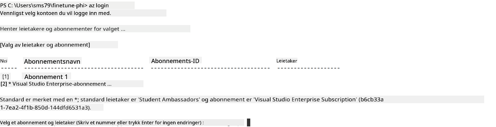

> [!TIP]
>
> Hvis du har problemer med å logge inn på Azure, prøv å bruke en enhetskode. Åpne et terminalvindu og skriv inn følgende kommando for å logge inn på Azure-kontoen din:
>
> ```console
> az login --use-device-code
> ```
>

### Finjuster Phi-3-modellen

I denne øvelsen skal du finjustere Phi-3-modellen med det tilgjengelige datasettet. Først definerer du finjusteringsprosessen i *fine_tune.py*-filen. Deretter konfigurerer du Azure Machine Learning-miljøet og starter finjusteringen ved å kjøre *setup_ml.py*-filen. Dette skriptet sørger for at finjusteringen skjer i Azure Machine Learning-miljøet.

Ved å kjøre *setup_ml.py* starter du finjusteringsprosessen i Azure Machine Learning-miljøet.

#### Legg til kode i *fine_tune.py*-filen

1. Gå til *finetuning_dir*-mappen og åpne *fine_tune.py*-filen i Visual Studio Code.

1. Legg til følgende kode i *fine_tune.py*.

    ```python
    import argparse
    import sys
    import logging
    import os
    from datasets import load_dataset
    import torch
    import mlflow
    from transformers import AutoModelForCausalLM, AutoTokenizer, TrainingArguments
    from trl import SFTTrainer

    # To avoid the INVALID_PARAMETER_VALUE error in MLflow, disable MLflow integration
    os.environ["DISABLE_MLFLOW_INTEGRATION"] = "True"

    # Logging setup
    logging.basicConfig(
        format="%(asctime)s - %(levelname)s - %(name)s - %(message)s",
        datefmt="%Y-%m-%d %H:%M:%S",
        handlers=[logging.StreamHandler(sys.stdout)],
        level=logging.WARNING
    )
    logger = logging.getLogger(__name__)

    def initialize_model_and_tokenizer(model_name, model_kwargs):
        """
        Initialize the model and tokenizer with the given pretrained model name and arguments.
        """
        model = AutoModelForCausalLM.from_pretrained(model_name, **model_kwargs)
        tokenizer = AutoTokenizer.from_pretrained(model_name)
        tokenizer.model_max_length = 2048
        tokenizer.pad_token = tokenizer.unk_token
        tokenizer.pad_token_id = tokenizer.convert_tokens_to_ids(tokenizer.pad_token)
        tokenizer.padding_side = 'right'
        return model, tokenizer

    def apply_chat_template(example, tokenizer):
        """
        Apply a chat template to tokenize messages in the example.
        """
        messages = example["messages"]
        if messages[0]["role"] != "system":
            messages.insert(0, {"role": "system", "content": ""})
        example["text"] = tokenizer.apply_chat_template(
            messages, tokenize=False, add_generation_prompt=False
        )
        return example

    def load_and_preprocess_data(train_filepath, test_filepath, tokenizer):
        """
        Load and preprocess the dataset.
        """
        train_dataset = load_dataset('json', data_files=train_filepath, split='train')
        test_dataset = load_dataset('json', data_files=test_filepath, split='train')
        column_names = list(train_dataset.features)

        train_dataset = train_dataset.map(
            apply_chat_template,
            fn_kwargs={"tokenizer": tokenizer},
            num_proc=10,
            remove_columns=column_names,
            desc="Applying chat template to train dataset",
        )

        test_dataset = test_dataset.map(
            apply_chat_template,
            fn_kwargs={"tokenizer": tokenizer},
            num_proc=10,
            remove_columns=column_names,
            desc="Applying chat template to test dataset",
        )

        return train_dataset, test_dataset

    def train_and_evaluate_model(train_dataset, test_dataset, model, tokenizer, output_dir):
        """
        Train and evaluate the model.
        """
        training_args = TrainingArguments(
            bf16=True,
            do_eval=True,
            output_dir=output_dir,
            eval_strategy="epoch",
            learning_rate=5.0e-06,
            logging_steps=20,
            lr_scheduler_type="cosine",
            num_train_epochs=3,
            overwrite_output_dir=True,
            per_device_eval_batch_size=4,
            per_device_train_batch_size=4,
            remove_unused_columns=True,
            save_steps=500,
            seed=0,
            gradient_checkpointing=True,
            gradient_accumulation_steps=1,
            warmup_ratio=0.2,
        )

        trainer = SFTTrainer(
            model=model,
            args=training_args,
            train_dataset=train_dataset,
            eval_dataset=test_dataset,
            max_seq_length=2048,
            dataset_text_field="text",
            tokenizer=tokenizer,
            packing=True
        )

        train_result = trainer.train()
        trainer.log_metrics("train", train_result.metrics)

        mlflow.transformers.log_model(
            transformers_model={"model": trainer.model, "tokenizer": tokenizer},
            artifact_path=output_dir,
        )

        tokenizer.padding_side = 'left'
        eval_metrics = trainer.evaluate()
        eval_metrics["eval_samples"] = len(test_dataset)
        trainer.log_metrics("eval", eval_metrics)

    def main(train_file, eval_file, model_output_dir):
        """
        Main function to fine-tune the model.
        """
        model_kwargs = {
            "use_cache": False,
            "trust_remote_code": True,
            "torch_dtype": torch.bfloat16,
            "device_map": None,
            "attn_implementation": "eager"
        }

        # pretrained_model_name = "microsoft/Phi-3-mini-4k-instruct"
        pretrained_model_name = "microsoft/Phi-3.5-mini-instruct"

        with mlflow.start_run():
            model, tokenizer = initialize_model_and_tokenizer(pretrained_model_name, model_kwargs)
            train_dataset, test_dataset = load_and_preprocess_data(train_file, eval_file, tokenizer)
            train_and_evaluate_model(train_dataset, test_dataset, model, tokenizer, model_output_dir)

    if __name__ == "__main__":
        parser = argparse.ArgumentParser()
        parser.add_argument("--train-file", type=str, required=True, help="Path to the training data")
        parser.add_argument("--eval-file", type=str, required=True, help="Path to the evaluation data")
        parser.add_argument("--model_output_dir", type=str, required=True, help="Directory to save the fine-tuned model")
        args = parser.parse_args()
        main(args.train_file, args.eval_file, args.model_output_dir)

    ```

1. Lagre og lukk *fine_tune.py*-filen.

> [!TIP]
> **Du kan finjustere Phi-3.5-modellen**
>
> I *fine_tune.py*-filen kan du endre `pretrained_model_name` fra `"microsoft/Phi-3-mini-4k-instruct"` til hvilken som helst modell du ønsker å finjustere. For eksempel, hvis du endrer den til `"microsoft/Phi-3.5-mini-instruct"`, bruker du Phi-3.5-mini-instruct-modellen for finjustering. For å finne og bruke ønsket modellnavn, besøk [Hugging Face](https://huggingface.co/), søk etter modellen du er interessert i, og kopier navnet inn i `pretrained_model_name`-feltet i skriptet ditt.
>
> :::image type="content" source="../../imgs/03/FineTuning-PromptFlow/finetunephi3.5.png" alt-text="Finjuster Phi-3.5.":::
>

#### Legg til kode i *setup_ml.py*-filen

1. Åpne *setup_ml.py*-filen i Visual Studio Code.

1. Legg til følgende kode i *setup_ml.py*.

    ```python
    import logging
    from azure.ai.ml import MLClient, command, Input
    from azure.ai.ml.entities import Environment, AmlCompute
    from azure.identity import AzureCliCredential
    from config import (
        AZURE_SUBSCRIPTION_ID,
        AZURE_RESOURCE_GROUP_NAME,
        AZURE_ML_WORKSPACE_NAME,
        TRAIN_DATA_PATH,
        TEST_DATA_PATH
    )

    # Constants

    # Uncomment the following lines to use a CPU instance for training
    # COMPUTE_INSTANCE_TYPE = "Standard_E16s_v3" # cpu
    # COMPUTE_NAME = "cpu-e16s-v3"
    # DOCKER_IMAGE_NAME = "mcr.microsoft.com/azureml/openmpi4.1.0-ubuntu20.04:latest"

    # Uncomment the following lines to use a GPU instance for training
    COMPUTE_INSTANCE_TYPE = "Standard_NC24ads_A100_v4"
    COMPUTE_NAME = "gpu-nc24s-a100-v4"
    DOCKER_IMAGE_NAME = "mcr.microsoft.com/azureml/curated/acft-hf-nlp-gpu:59"

    CONDA_FILE = "conda.yml"
    LOCATION = "eastus2" # Replace with the location of your compute cluster
    FINETUNING_DIR = "./finetuning_dir" # Path to the fine-tuning script
    TRAINING_ENV_NAME = "phi-3-training-environment" # Name of the training environment
    MODEL_OUTPUT_DIR = "./model_output" # Path to the model output directory in azure ml

    # Logging setup to track the process
    logger = logging.getLogger(__name__)
    logging.basicConfig(
        format="%(asctime)s - %(levelname)s - %(name)s - %(message)s",
        datefmt="%Y-%m-%d %H:%M:%S",
        level=logging.WARNING
    )

    def get_ml_client():
        """
        Initialize the ML Client using Azure CLI credentials.
        """
        credential = AzureCliCredential()
        return MLClient(credential, AZURE_SUBSCRIPTION_ID, AZURE_RESOURCE_GROUP_NAME, AZURE_ML_WORKSPACE_NAME)

    def create_or_get_environment(ml_client):
        """
        Create or update the training environment in Azure ML.
        """
        env = Environment(
            image=DOCKER_IMAGE_NAME,  # Docker image for the environment
            conda_file=CONDA_FILE,  # Conda environment file
            name=TRAINING_ENV_NAME,  # Name of the environment
        )
        return ml_client.environments.create_or_update(env)

    def create_or_get_compute_cluster(ml_client, compute_name, COMPUTE_INSTANCE_TYPE, location):
        """
        Create or update the compute cluster in Azure ML.
        """
        try:
            compute_cluster = ml_client.compute.get(compute_name)
            logger.info(f"Compute cluster '{compute_name}' already exists. Reusing it for the current run.")
        except Exception:
            logger.info(f"Compute cluster '{compute_name}' does not exist. Creating a new one with size {COMPUTE_INSTANCE_TYPE}.")
            compute_cluster = AmlCompute(
                name=compute_name,
                size=COMPUTE_INSTANCE_TYPE,
                location=location,
                tier="Dedicated",  # Tier of the compute cluster
                min_instances=0,  # Minimum number of instances
                max_instances=1  # Maximum number of instances
            )
            ml_client.compute.begin_create_or_update(compute_cluster).wait()  # Wait for the cluster to be created
        return compute_cluster

    def create_fine_tuning_job(env, compute_name):
        """
        Set up the fine-tuning job in Azure ML.
        """
        return command(
            code=FINETUNING_DIR,  # Path to fine_tune.py
            command=(
                "python fine_tune.py "
                "--train-file ${{inputs.train_file}} "
                "--eval-file ${{inputs.eval_file}} "
                "--model_output_dir ${{inputs.model_output}}"
            ),
            environment=env,  # Training environment
            compute=compute_name,  # Compute cluster to use
            inputs={
                "train_file": Input(type="uri_file", path=TRAIN_DATA_PATH),  # Path to the training data file
                "eval_file": Input(type="uri_file", path=TEST_DATA_PATH),  # Path to the evaluation data file
                "model_output": MODEL_OUTPUT_DIR
            }
        )

    def main():
        """
        Main function to set up and run the fine-tuning job in Azure ML.
        """
        # Initialize ML Client
        ml_client = get_ml_client()

        # Create Environment
        env = create_or_get_environment(ml_client)
        
        # Create or get existing compute cluster
        create_or_get_compute_cluster(ml_client, COMPUTE_NAME, COMPUTE_INSTANCE_TYPE, LOCATION)

        # Create and Submit Fine-Tuning Job
        job = create_fine_tuning_job(env, COMPUTE_NAME)
        returned_job = ml_client.jobs.create_or_update(job)  # Submit the job
        ml_client.jobs.stream(returned_job.name)  # Stream the job logs
        
        # Capture the job name
        job_name = returned_job.name
        print(f"Job name: {job_name}")

    if __name__ == "__main__":
        main()

    ```

1. Erstatt `COMPUTE_INSTANCE_TYPE`, `COMPUTE_NAME` og `LOCATION` med dine spesifikke detaljer.

    ```python
   # Uncomment the following lines to use a GPU instance for training
    COMPUTE_INSTANCE_TYPE = "Standard_NC24ads_A100_v4"
    COMPUTE_NAME = "gpu-nc24s-a100-v4"
    ...
    LOCATION = "eastus2" # Replace with the location of your compute cluster
    ```

> [!TIP]
>
> **Veiledning for finjustering med et minimalt datasett ved bruk av CPU**
>
> Hvis du ønsker å bruke CPU for finjustering, er denne metoden ideell for de med fordelabonnementer (som Visual Studio Enterprise Subscription) eller for raskt å teste finjusterings- og distribusjonsprosessen.
>
> 1. Åpne *setup_ml*-filen.
> 1. Erstatt `COMPUTE_INSTANCE_TYPE`, `COMPUTE_NAME` og `DOCKER_IMAGE_NAME` med følgende. Hvis du ikke har tilgang til *Standard_E16s_v3*, kan du bruke en tilsvarende CPU-instans eller be om ny kvote.
> 1. Erstatt `LOCATION` med dine spesifikke detaljer.
>
>    ```python
>    # Uncomment the following lines to use a CPU instance for training
>    COMPUTE_INSTANCE_TYPE = "Standard_E16s_v3" # cpu
>    COMPUTE_NAME = "cpu-e16s-v3"
>    DOCKER_IMAGE_NAME = "mcr.microsoft.com/azureml/openmpi4.1.0-ubuntu20.04:latest"
>    LOCATION = "eastus2" # Replace with the location of your compute cluster
>    ```
>

1. Skriv inn følgende kommando for å kjøre *setup_ml.py*-skriptet og starte finjusteringsprosessen i Azure Machine Learning.

    ```python
    python setup_ml.py
    ```

1. I denne øvelsen har du finjustert Phi-3-modellen ved hjelp av Azure Machine Learning. Ved å kjøre *setup_ml.py*-skriptet har du satt opp Azure Machine Learning-miljøet og startet finjusteringsprosessen definert i *fine_tune.py*-filen. Vær oppmerksom på at finjusteringsprosessen kan ta en god del tid. Etter å ha kjørt `python setup_ml.py` må du vente til prosessen er ferdig. Du kan følge statusen for finjusteringsjobben via lenken som vises i terminalen til Azure Machine Learning-portalen.

    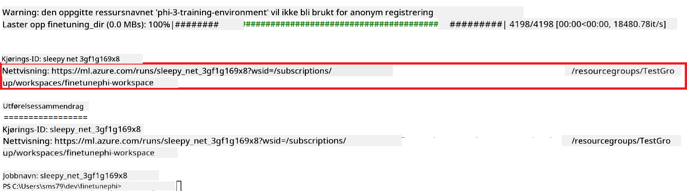

### Distribuer den finjusterte modellen

For å integrere den finjusterte Phi-3-modellen med Prompt Flow, må du distribuere modellen slik at den blir tilgjengelig for sanntidsinferenz. Denne prosessen innebærer å registrere modellen, opprette en online-endepunkt og distribuere modellen.

#### Sett modellnavn, endepunktsnavn og distribusjonsnavn for distribusjon

1. Åpne *config.py*-filen.

1. Erstatt `AZURE_MODEL_NAME = "your_fine_tuned_model_name"` med ønsket navn på modellen din.

1. Erstatt `AZURE_ENDPOINT_NAME = "your_fine_tuned_model_endpoint_name"` med ønsket navn på endepunktet ditt.

1. Erstatt `AZURE_DEPLOYMENT_NAME = "your_fine_tuned_model_deployment_name"` med ønsket navn på distribusjonen din.

#### Legg til kode i *deploy_model.py*-filen

Å kjøre *deploy_model.py*-filen automatiserer hele distribusjonsprosessen. Den registrerer modellen, oppretter et endepunkt og utfører distribusjonen basert på innstillingene i *config.py*-filen, som inkluderer modellnavn, endepunktsnavn og distribusjonsnavn.

1. Åpne *deploy_model.py*-filen i Visual Studio Code.

1. Legg til følgende kode i *deploy_model.py*.

    ```python
    import logging
    from azure.identity import AzureCliCredential
    from azure.ai.ml import MLClient
    from azure.ai.ml.entities import Model, ProbeSettings, ManagedOnlineEndpoint, ManagedOnlineDeployment, IdentityConfiguration, ManagedIdentityConfiguration, OnlineRequestSettings
    from azure.ai.ml.constants import AssetTypes

    # Configuration imports
    from config import (
        AZURE_SUBSCRIPTION_ID,
        AZURE_RESOURCE_GROUP_NAME,
        AZURE_ML_WORKSPACE_NAME,
        AZURE_MANAGED_IDENTITY_RESOURCE_ID,
        AZURE_MANAGED_IDENTITY_CLIENT_ID,
        AZURE_MODEL_NAME,
        AZURE_ENDPOINT_NAME,
        AZURE_DEPLOYMENT_NAME
    )

    # Constants
    JOB_NAME = "your-job-name"
    COMPUTE_INSTANCE_TYPE = "Standard_E4s_v3"

    deployment_env_vars = {
        "SUBSCRIPTION_ID": AZURE_SUBSCRIPTION_ID,
        "RESOURCE_GROUP_NAME": AZURE_RESOURCE_GROUP_NAME,
        "UAI_CLIENT_ID": AZURE_MANAGED_IDENTITY_CLIENT_ID,
    }

    # Logging setup
    logging.basicConfig(
        format="%(asctime)s - %(levelname)s - %(name)s - %(message)s",
        datefmt="%Y-%m-%d %H:%M:%S",
        level=logging.DEBUG
    )
    logger = logging.getLogger(__name__)

    def get_ml_client():
        """Initialize and return the ML Client."""
        credential = AzureCliCredential()
        return MLClient(credential, AZURE_SUBSCRIPTION_ID, AZURE_RESOURCE_GROUP_NAME, AZURE_ML_WORKSPACE_NAME)

    def register_model(ml_client, model_name, job_name):
        """Register a new model."""
        model_path = f"azureml://jobs/{job_name}/outputs/artifacts/paths/model_output"
        logger.info(f"Registering model {model_name} from job {job_name} at path {model_path}.")
        run_model = Model(
            path=model_path,
            name=model_name,
            description="Model created from run.",
            type=AssetTypes.MLFLOW_MODEL,
        )
        model = ml_client.models.create_or_update(run_model)
        logger.info(f"Registered model ID: {model.id}")
        return model

    def delete_existing_endpoint(ml_client, endpoint_name):
        """Delete existing endpoint if it exists."""
        try:
            endpoint_result = ml_client.online_endpoints.get(name=endpoint_name)
            logger.info(f"Deleting existing endpoint {endpoint_name}.")
            ml_client.online_endpoints.begin_delete(name=endpoint_name).result()
            logger.info(f"Deleted existing endpoint {endpoint_name}.")
        except Exception as e:
            logger.info(f"No existing endpoint {endpoint_name} found to delete: {e}")

    def create_or_update_endpoint(ml_client, endpoint_name, description=""):
        """Create or update an endpoint."""
        delete_existing_endpoint(ml_client, endpoint_name)
        logger.info(f"Creating new endpoint {endpoint_name}.")
        endpoint = ManagedOnlineEndpoint(
            name=endpoint_name,
            description=description,
            identity=IdentityConfiguration(
                type="user_assigned",
                user_assigned_identities=[ManagedIdentityConfiguration(resource_id=AZURE_MANAGED_IDENTITY_RESOURCE_ID)]
            )
        )
        endpoint_result = ml_client.online_endpoints.begin_create_or_update(endpoint).result()
        logger.info(f"Created new endpoint {endpoint_name}.")
        return endpoint_result

    def create_or_update_deployment(ml_client, endpoint_name, deployment_name, model):
        """Create or update a deployment."""

        logger.info(f"Creating deployment {deployment_name} for endpoint {endpoint_name}.")
        deployment = ManagedOnlineDeployment(
            name=deployment_name,
            endpoint_name=endpoint_name,
            model=model.id,
            instance_type=COMPUTE_INSTANCE_TYPE,
            instance_count=1,
            environment_variables=deployment_env_vars,
            request_settings=OnlineRequestSettings(
                max_concurrent_requests_per_instance=3,
                request_timeout_ms=180000,
                max_queue_wait_ms=120000
            ),
            liveness_probe=ProbeSettings(
                failure_threshold=30,
                success_threshold=1,
                period=100,
                initial_delay=500,
            ),
            readiness_probe=ProbeSettings(
                failure_threshold=30,
                success_threshold=1,
                period=100,
                initial_delay=500,
            ),
        )
        deployment_result = ml_client.online_deployments.begin_create_or_update(deployment).result()
        logger.info(f"Created deployment {deployment.name} for endpoint {endpoint_name}.")
        return deployment_result

    def set_traffic_to_deployment(ml_client, endpoint_name, deployment_name):
        """Set traffic to the specified deployment."""
        try:
            # Fetch the current endpoint details
            endpoint = ml_client.online_endpoints.get(name=endpoint_name)
            
            # Log the current traffic allocation for debugging
            logger.info(f"Current traffic allocation: {endpoint.traffic}")
            
            # Set the traffic allocation for the deployment
            endpoint.traffic = {deployment_name: 100}
            
            # Update the endpoint with the new traffic allocation
            endpoint_poller = ml_client.online_endpoints.begin_create_or_update(endpoint)
            updated_endpoint = endpoint_poller.result()
            
            # Log the updated traffic allocation for debugging
            logger.info(f"Updated traffic allocation: {updated_endpoint.traffic}")
            logger.info(f"Set traffic to deployment {deployment_name} at endpoint {endpoint_name}.")
            return updated_endpoint
        except Exception as e:
            # Log any errors that occur during the process
            logger.error(f"Failed to set traffic to deployment: {e}")
            raise


    def main():
        ml_client = get_ml_client()

        registered_model = register_model(ml_client, AZURE_MODEL_NAME, JOB_NAME)
        logger.info(f"Registered model ID: {registered_model.id}")

        endpoint = create_or_update_endpoint(ml_client, AZURE_ENDPOINT_NAME, "Endpoint for finetuned Phi-3 model")
        logger.info(f"Endpoint {AZURE_ENDPOINT_NAME} is ready.")

        try:
            deployment = create_or_update_deployment(ml_client, AZURE_ENDPOINT_NAME, AZURE_DEPLOYMENT_NAME, registered_model)
            logger.info(f"Deployment {AZURE_DEPLOYMENT_NAME} is created for endpoint {AZURE_ENDPOINT_NAME}.")

            set_traffic_to_deployment(ml_client, AZURE_ENDPOINT_NAME, AZURE_DEPLOYMENT_NAME)
            logger.info(f"Traffic is set to deployment {AZURE_DEPLOYMENT_NAME} at endpoint {AZURE_ENDPOINT_NAME}.")
        except Exception as e:
            logger.error(f"Failed to create or update deployment: {e}")

    if __name__ == "__main__":
        main()

    ```

1. Gjør følgende for å finne `JOB_NAME`:

    - Gå til Azure Machine Learning-ressursen du opprettet.
    - Velg **Studio web URL** for å åpne Azure Machine Learning-arbeidsområdet.
    - Velg **Jobs** i venstre sidepanel.
    - Velg eksperimentet for finjustering, for eksempel *finetunephi*.
    - Velg jobben du opprettet.
- Kopier og lim inn jobbnnavnet ditt i `JOB_NAME = "your-job-name"` i *deploy_model.py*-filen.

1. Erstatt `COMPUTE_INSTANCE_TYPE` med dine spesifikke detaljer.

1. Skriv inn følgende kommando for å kjøre *deploy_model.py*-skriptet og starte distribusjonsprosessen i Azure Machine Learning.

    ```python
    python deploy_model.py
    ```


> [!WARNING]
> For å unngå ekstra kostnader på kontoen din, sørg for å slette det opprettede endepunktet i Azure Machine Learning-arbeidsområdet.
>

#### Sjekk distribusjonsstatus i Azure Machine Learning-arbeidsområdet

1. Besøk [Azure ML Studio](https://ml.azure.com/home?wt.mc_id=studentamb_279723).

1. Naviger til Azure Machine Learning-arbeidsområdet du opprettet.

1. Velg **Studio web URL** for å åpne Azure Machine Learning-arbeidsområdet.

1. Velg **Endpoints** fra fanen på venstre side.

    

2. Velg endepunktet du opprettet.

    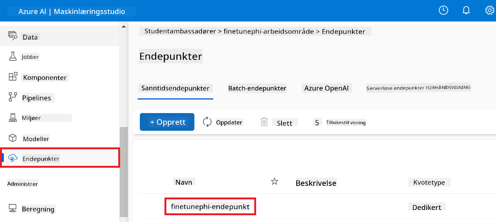

3. På denne siden kan du administrere endepunktene som ble opprettet under distribusjonsprosessen.

## Scenario 3: Integrer med Prompt flow og chat med din tilpassede modell

### Integrer den tilpassede Phi-3-modellen med Prompt flow

Etter at du har distribuert din finjusterte modell, kan du nå integrere den med Prompt flow for å bruke modellen i sanntidsapplikasjoner, noe som muliggjør en rekke interaktive oppgaver med din tilpassede Phi-3-modell.

#### Sett api-nøkkel og endepunkt-URI for den finjusterte Phi-3-modellen

1. Naviger til Azure Machine Learning-arbeidsområdet du opprettet.
1. Velg **Endpoints** fra fanen på venstre side.
1. Velg endepunktet du opprettet.
1. Velg **Consume** fra navigasjonsmenyen.
1. Kopier og lim inn din **REST endpoint** i *config.py*-filen, og erstatt `AZURE_ML_ENDPOINT = "your_fine_tuned_model_endpoint_uri"` med din **REST endpoint**.
1. Kopier og lim inn din **Primary key** i *config.py*-filen, og erstatt `AZURE_ML_API_KEY = "your_fine_tuned_model_api_key"` med din **Primary key**.

    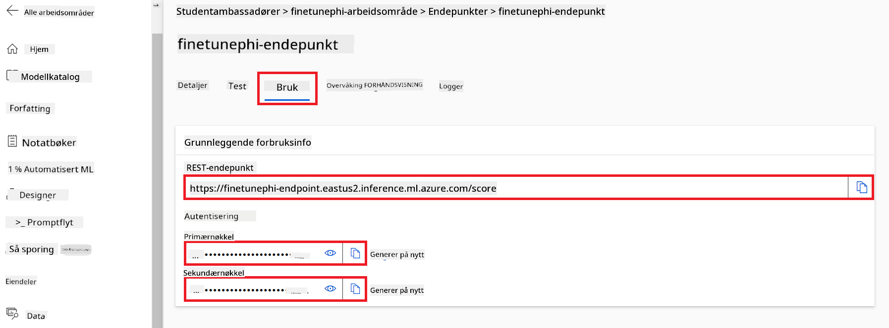

#### Legg til kode i *flow.dag.yml*-filen

1. Åpne *flow.dag.yml*-filen i Visual Studio Code.

1. Legg til følgende kode i *flow.dag.yml*.

    ```yml
    inputs:
      input_data:
        type: string
        default: "Who founded Microsoft?"

    outputs:
      answer:
        type: string
        reference: ${integrate_with_promptflow.output}

    nodes:
    - name: integrate_with_promptflow
      type: python
      source:
        type: code
        path: integrate_with_promptflow.py
      inputs:
        input_data: ${inputs.input_data}
    ```

#### Legg til kode i *integrate_with_promptflow.py*-filen

1. Åpne *integrate_with_promptflow.py*-filen i Visual Studio Code.

1. Legg til følgende kode i *integrate_with_promptflow.py*.

    ```python
    import logging
    import requests
    from promptflow.core import tool
    import asyncio
    import platform
    from config import (
        AZURE_ML_ENDPOINT,
        AZURE_ML_API_KEY
    )

    # Logging setup
    logging.basicConfig(
        format="%(asctime)s - %(levelname)s - %(name)s - %(message)s",
        datefmt="%Y-%m-%d %H:%M:%S",
        level=logging.DEBUG
    )
    logger = logging.getLogger(__name__)

    def query_azml_endpoint(input_data: list, endpoint_url: str, api_key: str) -> str:
        """
        Send a request to the Azure ML endpoint with the given input data.
        """
        headers = {
            "Content-Type": "application/json",
            "Authorization": f"Bearer {api_key}"
        }
        data = {
            "input_data": [input_data],
            "params": {
                "temperature": 0.7,
                "max_new_tokens": 128,
                "do_sample": True,
                "return_full_text": True
            }
        }
        try:
            response = requests.post(endpoint_url, json=data, headers=headers)
            response.raise_for_status()
            result = response.json()[0]
            logger.info("Successfully received response from Azure ML Endpoint.")
            return result
        except requests.exceptions.RequestException as e:
            logger.error(f"Error querying Azure ML Endpoint: {e}")
            raise

    def setup_asyncio_policy():
        """
        Setup asyncio event loop policy for Windows.
        """
        if platform.system() == 'Windows':
            asyncio.set_event_loop_policy(asyncio.WindowsSelectorEventLoopPolicy())
            logger.info("Set Windows asyncio event loop policy.")

    @tool
    def my_python_tool(input_data: str) -> str:
        """
        Tool function to process input data and query the Azure ML endpoint.
        """
        setup_asyncio_policy()
        return query_azml_endpoint(input_data, AZURE_ML_ENDPOINT, AZURE_ML_API_KEY)

    ```

### Chat med din tilpassede modell

1. Skriv inn følgende kommando for å kjøre *deploy_model.py*-skriptet og starte distribusjonsprosessen i Azure Machine Learning.

    ```python
    pf flow serve --source ./ --port 8080 --host localhost
    ```

1. Her er et eksempel på resultatene: Nå kan du chatte med din tilpassede Phi-3-modell. Det anbefales å stille spørsmål basert på dataene som ble brukt til finjusteringen.

    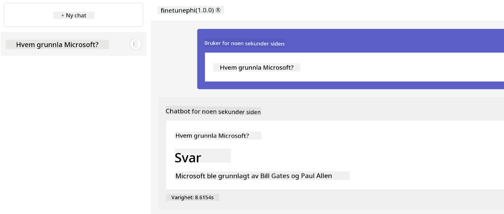

**Ansvarsfraskrivelse**:  
Dette dokumentet er oversatt ved hjelp av AI-oversettelsestjenesten [Co-op Translator](https://github.com/Azure/co-op-translator). Selv om vi streber etter nøyaktighet, vennligst vær oppmerksom på at automatiske oversettelser kan inneholde feil eller unøyaktigheter. Det opprinnelige dokumentet på originalspråket skal anses som den autoritative kilden. For kritisk informasjon anbefales profesjonell menneskelig oversettelse. Vi er ikke ansvarlige for eventuelle misforståelser eller feiltolkninger som oppstår ved bruk av denne oversettelsen.