# Fininnstill og integrer egendefinerte Phi-3-modeller med Prompt flow

Dette ende-til-ende (E2E) eksemplet er basert på veiledningen "[Fine-Tune and Integrate Custom Phi-3 Models with Prompt Flow: Step-by-Step Guide](https://techcommunity.microsoft.com/t5/educator-developer-blog/fine-tune-and-integrate-custom-phi-3-models-with-prompt-flow/ba-p/4178612?WT.mc_id=aiml-137032-kinfeylo)" fra Microsoft Tech Community. Det introduserer prosessene for fininnstilling, distribusjon og integrasjon av egendefinerte Phi-3-modeller med Prompt flow.

## Oversikt

I dette E2E-eksemplet vil du lære hvordan du fininnstiller Phi-3-modellen og integrerer den med Prompt flow. Ved å bruke Azure Machine Learning og Prompt flow vil du etablere en arbeidsflyt for distribusjon og bruk av egendefinerte AI-modeller. Dette E2E-eksemplet er delt inn i tre scenarier:

**Scenario 1: Sett opp Azure-ressurser og forbered til fininnstilling**

**Scenario 2: Fininnstill Phi-3-modellen og distribuer i Azure Machine Learning Studio**

**Scenario 3: Integrer med Prompt flow og chatte med din egendefinerte modell**

Her er en oversikt over dette E2E-eksemplet.

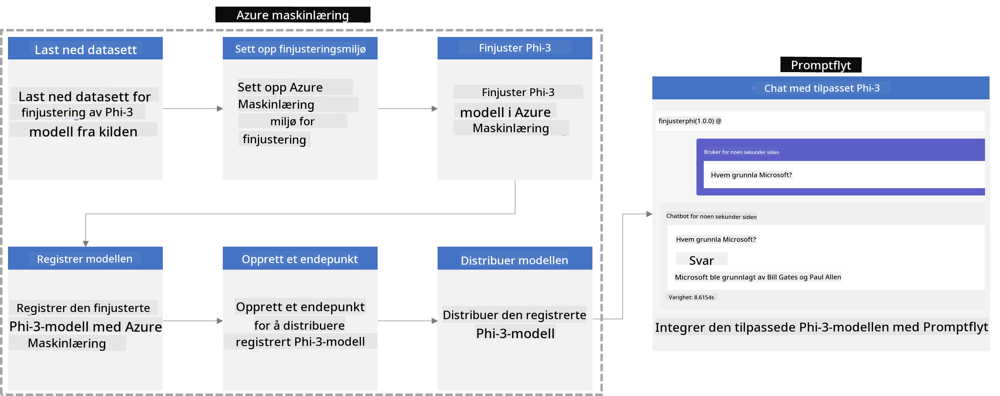

### Innholdsfortegnelse

1. **[Scenario 1: Sett opp Azure-ressurser og forbered til fininnstilling](../../../../../../md/02.Application/01.TextAndChat/Phi3)**
    - [Opprett et Azure Machine Learning-arbeidsområde](../../../../../../md/02.Application/01.TextAndChat/Phi3)
    - [Be om GPU-kvoter i Azure-abonnement](../../../../../../md/02.Application/01.TextAndChat/Phi3)
    - [Legg til rolleoppdrag](../../../../../../md/02.Application/01.TextAndChat/Phi3)
    - [Sett opp prosjekt](../../../../../../md/02.Application/01.TextAndChat/Phi3)
    - [Forbered datasett for fininnstilling](../../../../../../md/02.Application/01.TextAndChat/Phi3)

1. **[Scenario 2: Fininnstill Phi-3-modellen og distribuer i Azure Machine Learning Studio](../../../../../../md/02.Application/01.TextAndChat/Phi3)**
    - [Sett opp Azure CLI](../../../../../../md/02.Application/01.TextAndChat/Phi3)
    - [Fininnstill Phi-3-modellen](../../../../../../md/02.Application/01.TextAndChat/Phi3)
    - [Distribuer den fininnstilte modellen](../../../../../../md/02.Application/01.TextAndChat/Phi3)

1. **[Scenario 3: Integrer med Prompt flow og chat med din egendefinerte modell](../../../../../../md/02.Application/01.TextAndChat/Phi3)**
    - [Integrer den egendefinerte Phi-3-modellen med Prompt flow](../../../../../../md/02.Application/01.TextAndChat/Phi3)
    - [Chat med din egendefinerte modell](../../../../../../md/02.Application/01.TextAndChat/Phi3)

## Scenario 1: Sett opp Azure-ressurser og forbered til fininnstilling

### Opprett et Azure Machine Learning-arbeidsområde

1. Skriv *azure machine learning* i **søkelinjen** øverst på portalsiden og velg **Azure Machine Learning** fra de tilgjengelige alternativene.

    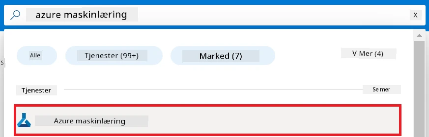

1. Velg **+ Create** fra navigasjonsmenyen.

1. Velg **New workspace** fra navigasjonsmenyen.

    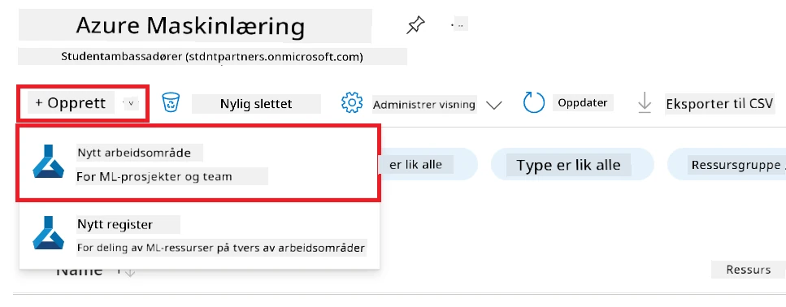

1. Utfør følgende oppgaver:

    - Velg ditt Azure **Subscription**.
    - Velg **Resource group** du vil bruke (opprett en ny om nødvendig).
    - Skriv inn **Workspace Name**. Det må være en unik verdi.
    - Velg **Region** du ønsker å bruke.
    - Velg **Storage account** du vil bruke (opprett en ny om nødvendig).
    - Velg **Key vault** du vil bruke (opprett en ny om nødvendig).
    - Velg **Application insights** du vil bruke (opprett en ny om nødvendig).
    - Velg **Container registry** du vil bruke (opprett en ny om nødvendig).

    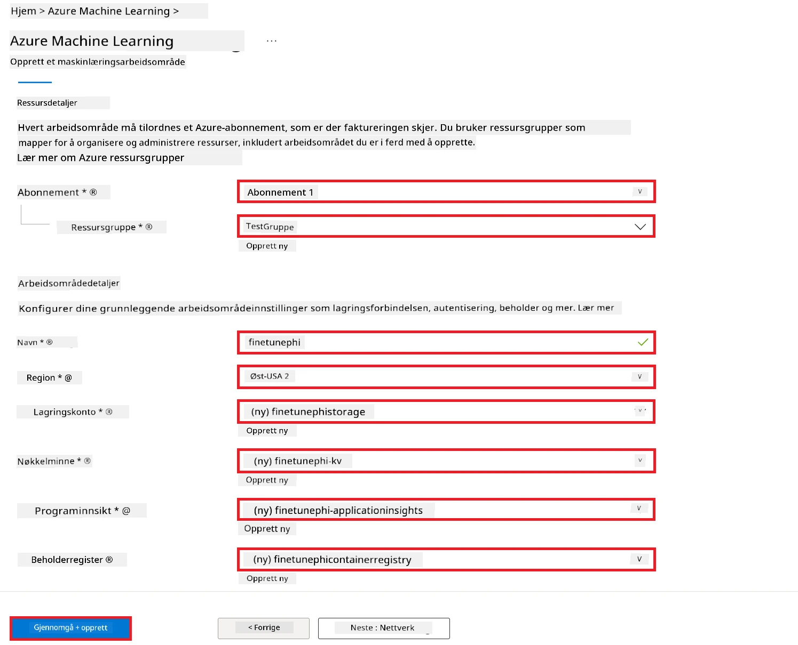

1. Velg **Review + Create**.

1. Velg **Create**.

### Be om GPU-kvoter i Azure-abonnement

I dette E2E-eksemplet vil du bruke *Standard_NC24ads_A100_v4 GPU* for fininnstilling, som krever en kvoteforespørsel, og *Standard_E4s_v3* CPU for distribusjon, som ikke krever en kvoteforespørsel.

> [!NOTE]
>
> Kun Pay-As-You-Go-abonnementer (standard abonnementstype) er kvalifisert for GPU-allokering; fordelabonnementer støttes foreløpig ikke.
>
> For de som bruker fordelabonnementer (slik som Visual Studio Enterprise Subscription) eller ønsker å teste fininnstillings- og distribusjonsprosessen raskt, gir denne veiledningen også retningslinjer for fininnstilling med et minimalt datasett ved bruk av CPU. Det er imidlertid viktig å merke seg at fininnstillingsresultater er betydelig bedre ved bruk av GPU med større datasett.

1. Besøk [Azure ML Studio](https://ml.azure.com/home?wt.mc_id=studentamb_279723).

1. Utfør følgende oppgaver for å be om *Standard NCADSA100v4 Family* kvote:

    - Velg **Quota** fra venstremenyen.
    - Velg **Virtual machine family** som skal brukes. For eksempel, velg **Standard NCADSA100v4 Family Cluster Dedicated vCPUs**, som inkluderer *Standard_NC24ads_A100_v4* GPU.
    - Velg **Request quota** fra navigasjonsmenyen.

        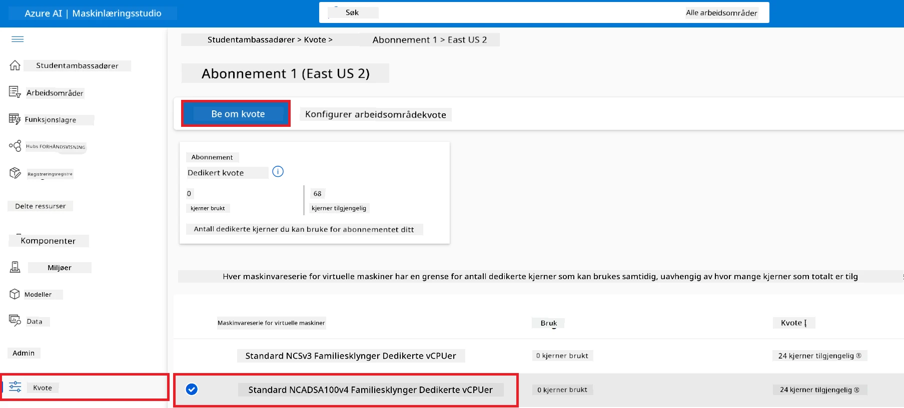

    - På siden for Request quota, skriv inn ønsket **New cores limit**. For eksempel, 24.
    - På siden for Request quota, velg **Submit** for å sende forespørsel om GPU-kvote.

> [!NOTE]
> Du kan velge passende GPU eller CPU for dine behov ved å se dokumentasjonen [Sizes for Virtual Machines in Azure](https://learn.microsoft.com/azure/virtual-machines/sizes/overview?tabs=breakdownseries%2Cgeneralsizelist%2Ccomputesizelist%2Cmemorysizelist%2Cstoragesizelist%2Cgpusizelist%2Cfpgasizelist%2Chpcsizelist).

### Legg til rolleoppdrag

For å fininnstille og distribuere modellene må du først opprette en Brukertildelt administrert identitet (User Assigned Managed Identity - UAI) og tildele den riktige tillatelsene. Denne UAI vil bli brukt til autentisering under distribusjon.

#### Opprett Brukertildelt administrert identitet (UAI)

1. Skriv *managed identities* i **søkelinjen** øverst på portalsiden og velg **Managed Identities** fra alternativene som vises.

    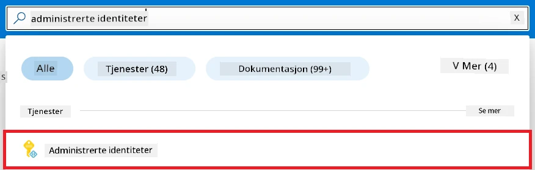

1. Velg **+ Create**.

    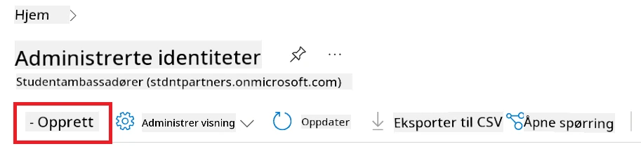

1. Utfør følgende oppgaver:

    - Velg ditt Azure **Subscription**.
    - Velg **Resource group** du vil bruke (opprett en ny om nødvendig).
    - Velg **Region** du ønsker å bruke.
    - Skriv inn **Name**. Det må være en unik verdi.

1. Velg **Review + create**.

1. Velg **+ Create**.

#### Legg til Contributor rolleoppdrag for Managed Identity

1. Naviger til Managed Identity-ressursen du opprettet.

1. Velg **Azure role assignments** fra venstremenyen.

1. Velg **+Add role assignment** fra navigasjonsmenyen.

1. På siden for Add role assignment, gjør følgende:
    - Velg **Scope** til **Resource group**.
    - Velg ditt Azure **Subscription**.
    - Velg **Resource group** som skal brukes.
    - Velg **Role** til **Contributor**.

    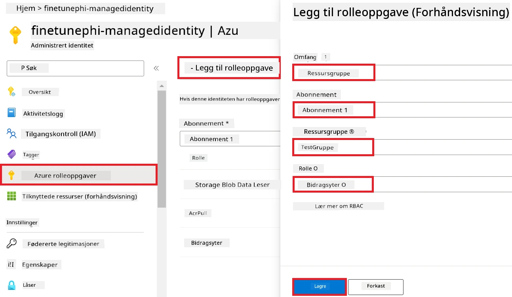

1. Velg **Save**.

#### Legg til Storage Blob Data Reader rolleoppdrag til Managed Identity

1. Skriv *storage accounts* i **søkelinjen** øverst på portalsiden og velg **Storage accounts** fra alternativene som vises.

    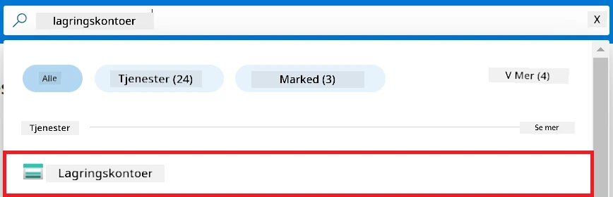

1. Velg lagringskontoen som er tilknyttet Azure Machine Learning-arbeidsområdet du opprettet. For eksempel, *finetunephistorage*.

1. Utfør følgende for å navigere til Add role assignment-siden:

    - Naviger til Azure Storage-kontoen du opprettet.
    - Velg **Access Control (IAM)** fra venstremenyen.
    - Velg **+ Add** fra navigasjonsmenyen.
    - Velg **Add role assignment** fra navigasjonsmenyen.

    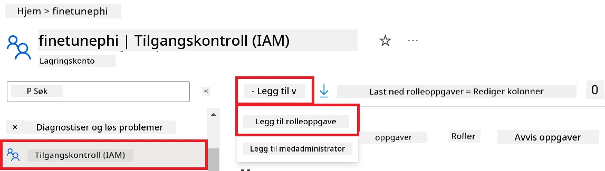

1. På siden for Add role assignment, utfør følgende:

    - På Rollesiden, skriv *Storage Blob Data Reader* i **søkelinjen** og velg **Storage Blob Data Reader** fra alternativene som vises.
    - Velg **Next** på Rollesiden.
    - På Medlemsiden, velg **Assign access to** **Managed identity**.
    - På Medlemsiden, velg **+ Select members**.
    - På siden for Select managed identities, velg ditt Azure **Subscription**.
    - Velg **Managed identity** til **Manage Identity**.
    - Velg Manage Identity du opprettet. For eksempel, *finetunephi-managedidentity*.
    - Velg **Select**.

    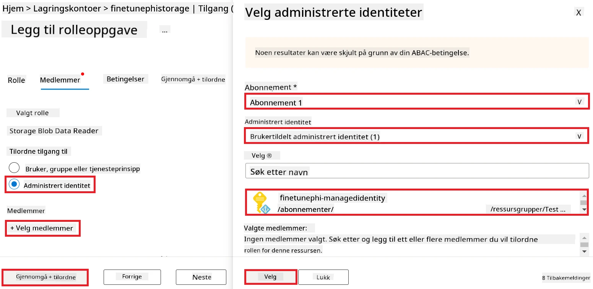

1. Velg **Review + assign**.

#### Legg til AcrPull rolleoppdrag til Managed Identity

1. Skriv *container registries* i **søkelinjen** øverst på portalsiden og velg **Container registries** fra alternativene som vises.

    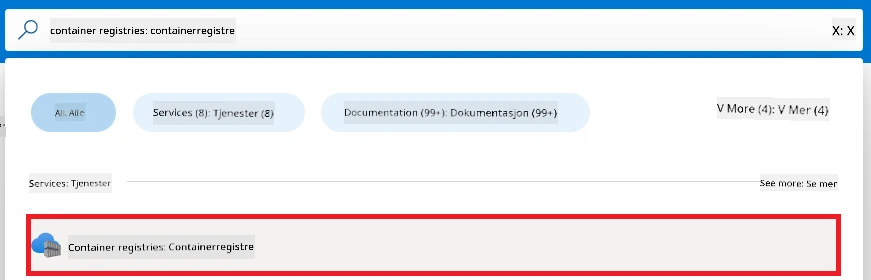

1. Velg container registry som er tilknyttet Azure Machine Learning-arbeidsområdet. For eksempel, *finetunephicontainerregistries*

1. Utfør følgende for å navigere til Add role assignment-siden:

    - Velg **Access Control (IAM)** fra venstremenyen.
    - Velg **+ Add** fra navigasjonsmenyen.
    - Velg **Add role assignment** fra navigasjonsmenyen.

1. På siden for Add role assignment, utfør følgende:

    - På Rollesiden, skriv *AcrPull* i **søkelinjen** og velg **AcrPull** fra alternativene som vises.
    - Velg **Next** på Rollesiden.
    - På Medlemsiden, velg **Assign access to** **Managed identity**.
    - Velg **+ Select members**.
    - På siden for Select managed identities, velg ditt Azure **Subscription**.
    - Velg **Managed identity** til **Manage Identity**.
    - Velg Manage Identity du opprettet. For eksempel, *finetunephi-managedidentity*.
    - Velg **Select**.
    - Velg **Review + assign**.

### Sett opp prosjekt

Nå skal du opprette en mappe du kan jobbe i, og sette opp et virtuelt miljø for å utvikle et program som interagerer med brukere og bruker lagret chatthistorikk fra Azure Cosmos DB for å informere sine svar.

#### Opprett en mappe å jobbe i

1. Åpne et terminalvindu og skriv inn følgende kommando for å opprette en mappe kalt *finetune-phi* i standardbanen.

    ```console
    mkdir finetune-phi
    ```

1. Skriv inn følgende kommando i terminalen for å navigere til *finetune-phi* mappen du opprettet.

    ```console
    cd finetune-phi
    ```

#### Opprett et virtuelt miljø

1. Skriv inn følgende kommando i terminalen for å opprette et virtuelt miljø kalt *.venv*.

    ```console
    python -m venv .venv
    ```

1. Skriv inn følgende kommando i terminalen for å aktivere det virtuelle miljøet.

    ```console
    .venv\Scripts\activate.bat
    ```

> [!NOTE]
>
> Hvis det fungerte, bør du se *(.venv)* før kommandoprompten.

#### Installer nødvendige pakker

1. Skriv inn følgende kommandoer i terminalen for å installere nødvendige pakker.

    ```console
    pip install datasets==2.19.1
    pip install transformers==4.41.1
    pip install azure-ai-ml==1.16.0
    pip install torch==2.3.1
    pip install trl==0.9.4
    pip install promptflow==1.12.0
    ```

#### Opprett prosjektfiler
I denne øvelsen skal du lage de nødvendige filene for prosjektet vårt. Disse filene inkluderer skript for å laste ned datasettet, sette opp Azure Machine Learning-miljøet, finjustere Phi-3-modellen og distribuere den finjusterte modellen. Du skal også lage en *conda.yml*-fil for å sette opp finjusteringsmiljøet.

I denne øvelsen skal du:

- Lage en fil *download_dataset.py* for å laste ned datasettet.
- Lage en fil *setup_ml.py* for å sette opp Azure Machine Learning-miljøet.
- Lage en fil *fine_tune.py* i mappen *finetuning_dir* for å finjustere Phi-3-modellen ved hjelp av datasettet.
- Lage en fil *conda.yml* for å sette opp finjusteringsmiljøet.
- Lage en fil *deploy_model.py* for å distribuere den finjusterte modellen.
- Lage en fil *integrate_with_promptflow.py* for å integrere den finjusterte modellen og kjøre modellen ved hjelp av Prompt flow.
- Lage en fil flow.dag.yml for å sette opp arbeidsflytstrukturen for Prompt flow.
- Lage en fil *config.py* for å legge inn Azure-informasjonen.

> [!NOTE]
>
> Komplett mappestruktur:
>
> ```text
> └── YourUserName
> .    └── finetune-phi
> .        ├── finetuning_dir
> .        │      └── fine_tune.py
> .        ├── conda.yml
> .        ├── config.py
> .        ├── deploy_model.py
> .        ├── download_dataset.py
> .        ├── flow.dag.yml
> .        ├── integrate_with_promptflow.py
> .        └── setup_ml.py
> ```

1. Åpne **Visual Studio Code**.

1. Velg **File** fra menylinjen.

1. Velg **Open Folder**.

1. Velg mappen *finetune-phi* som du opprettet, som ligger på *C:\Users\yourUserName\finetune-phi*.

    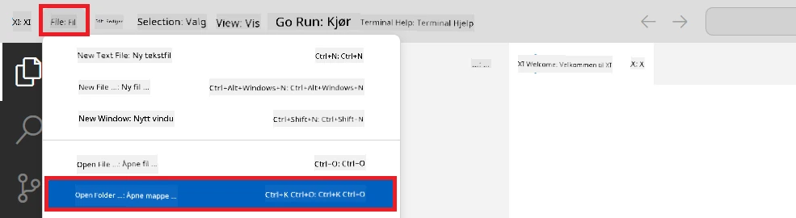

1. I venstre panel i Visual Studio Code, høyreklikk og velg **New File** for å opprette en ny fil med navnet *download_dataset.py*.

1. I venstre panel i Visual Studio Code, høyreklikk og velg **New File** for å opprette en ny fil med navnet *setup_ml.py*.

1. I venstre panel i Visual Studio Code, høyreklikk og velg **New File** for å opprette en ny fil med navnet *deploy_model.py*.

    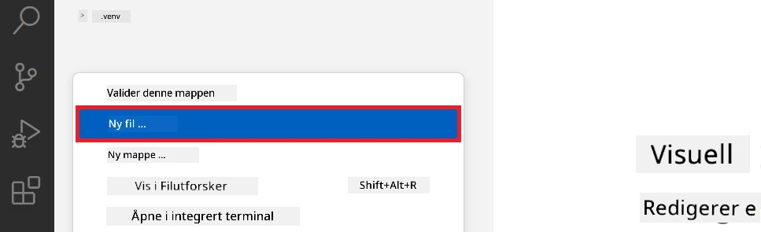

1. I venstre panel i Visual Studio Code, høyreklikk og velg **New Folder** for å opprette en ny mappe med navnet *finetuning_dir*.

1. I mappen *finetuning_dir*, opprett en ny fil med navnet *fine_tune.py*.

#### Opprett og konfigurer *conda.yml*-fil

1. I venstre panel i Visual Studio Code, høyreklikk og velg **New File** for å opprette en ny fil med navnet *conda.yml*.

1. Legg til følgende kode i *conda.yml*-filen for å sette opp finjusteringsmiljøet for Phi-3-modellen.

    ```yml
    name: phi-3-training-env
    channels:
      - defaults
      - conda-forge
    dependencies:
      - python=3.10
      - pip
      - numpy<2.0
      - pip:
          - torch==2.4.0
          - torchvision==0.19.0
          - trl==0.8.6
          - transformers==4.41
          - datasets==2.21.0
          - azureml-core==1.57.0
          - azure-storage-blob==12.19.0
          - azure-ai-ml==1.16
          - azure-identity==1.17.1
          - accelerate==0.33.0
          - mlflow==2.15.1
          - azureml-mlflow==1.57.0
    ```

#### Opprett og konfigurer *config.py*-fil

1. I venstre panel i Visual Studio Code, høyreklikk og velg **New File** for å opprette en ny fil med navnet *config.py*.

1. Legg til følgende kode i *config.py*-filen for å inkludere din Azure-informasjon.

    ```python
    # Azure-innstillinger
    AZURE_SUBSCRIPTION_ID = "your_subscription_id"
    AZURE_RESOURCE_GROUP_NAME = "your_resource_group_name" # "TestGroup"

    # Azure Machine Learning-innstillinger
    AZURE_ML_WORKSPACE_NAME = "your_workspace_name" # "finetunephi-workspace"

    # Azure håndterte identitetsinnstillinger
    AZURE_MANAGED_IDENTITY_CLIENT_ID = "your_azure_managed_identity_client_id"
    AZURE_MANAGED_IDENTITY_NAME = "your_azure_managed_identity_name" # "finetunephi-mangedidentity"
    AZURE_MANAGED_IDENTITY_RESOURCE_ID = f"/subscriptions/{AZURE_SUBSCRIPTION_ID}/resourceGroups/{AZURE_RESOURCE_GROUP_NAME}/providers/Microsoft.ManagedIdentity/userAssignedIdentities/{AZURE_MANAGED_IDENTITY_NAME}"

    # Datasettfilbaner
    TRAIN_DATA_PATH = "data/train_data.jsonl"
    TEST_DATA_PATH = "data/test_data.jsonl"

    # Innstillinger for finjustert modell
    AZURE_MODEL_NAME = "your_fine_tuned_model_name" # "finetune-phi-model"
    AZURE_ENDPOINT_NAME = "your_fine_tuned_model_endpoint_name" # "finetune-phi-endpoint"
    AZURE_DEPLOYMENT_NAME = "your_fine_tuned_model_deployment_name" # "finetune-phi-deployment"

    AZURE_ML_API_KEY = "your_fine_tuned_model_api_key"
    AZURE_ML_ENDPOINT = "your_fine_tuned_model_endpoint_uri" # "https://{your-endpoint-name}.{your-region}.inference.ml.azure.com/score"
    ```

#### Legg til Azure-miljøvariabler

1. Utfør følgende for å legge til Azure Subscription ID:

    - Skriv *subscriptions* i **søkelinjen** øverst på portal-siden og velg **Subscriptions** fra alternativene som dukker opp.
    - Velg Azure-abonnementet du bruker.
    - Kopier og lim inn Subscription ID i *config.py*-filen.

    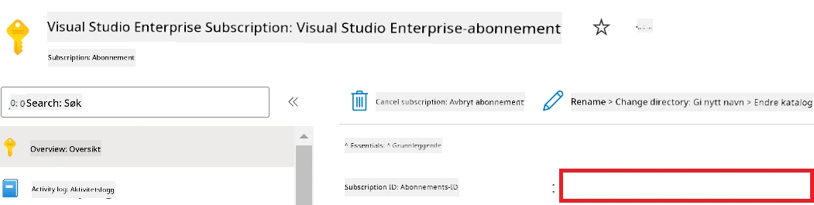

1. Utfør følgende for å legge til Azure Workspace Name:

    - Naviger til Azure Machine Learning-ressursen du opprettet.
    - Kopier og lim inn kontonavnet ditt i *config.py*-filen.

    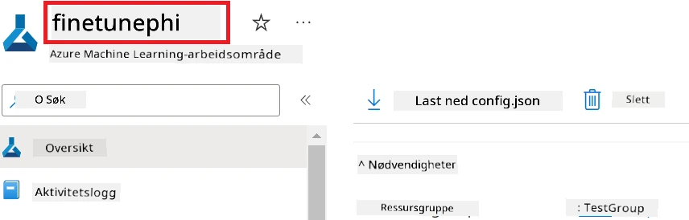

1. Utfør følgende for å legge til Azure Resource Group Name:

    - Naviger til Azure Machine Learning-ressursen du opprettet.
    - Kopier og lim inn Azure Resource Group-navnet ditt i *config.py*-filen.

    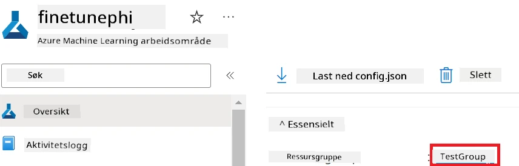

2. Utfør følgende for å legge til Azure Managed Identity-navnet

    - Naviger til Managed Identities-ressursen du opprettet.
    - Kopier og lim inn Azure Managed Identity-navnet ditt i *config.py*-filen.

    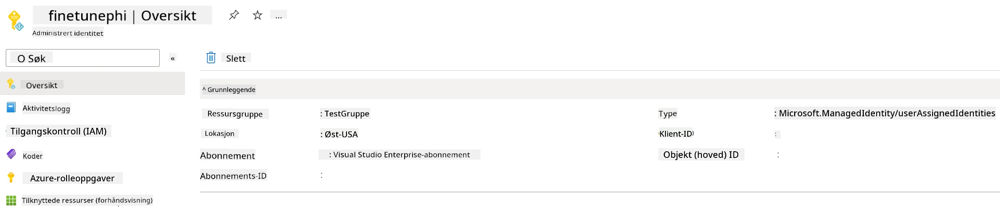

### Forbered datasett for finjustering

I denne øvelsen skal du kjøre *download_dataset.py* for å laste ned *ULTRACHAT_200k*-datasettene til ditt lokale miljø. Deretter skal du bruke disse dataene til å finjustere Phi-3-modellen i Azure Machine Learning.

#### Last ned datasettet med *download_dataset.py*

1. Åpne filen *download_dataset.py* i Visual Studio Code.

1. Legg til følgende kode i *download_dataset.py*.

    ```python
    import json
    import os
    from datasets import load_dataset
    from config import (
        TRAIN_DATA_PATH,
        TEST_DATA_PATH)

    def load_and_split_dataset(dataset_name, config_name, split_ratio):
        """
        Load and split a dataset.
        """
        # Last inn datasettet med det spesifiserte navnet, konfigurasjonen og splittforholdet
        dataset = load_dataset(dataset_name, config_name, split=split_ratio)
        print(f"Original dataset size: {len(dataset)}")
        
        # Del datasettet i trenings- og testsett (80 % trening, 20 % test)
        split_dataset = dataset.train_test_split(test_size=0.2)
        print(f"Train dataset size: {len(split_dataset['train'])}")
        print(f"Test dataset size: {len(split_dataset['test'])}")
        
        return split_dataset

    def save_dataset_to_jsonl(dataset, filepath):
        """
        Save a dataset to a JSONL file.
        """
        # Opprett katalogen hvis den ikke eksisterer
        os.makedirs(os.path.dirname(filepath), exist_ok=True)
        
        # Åpne filen i skrivemodus
        with open(filepath, 'w', encoding='utf-8') as f:
            # Iterer over hver post i datasettet
            for record in dataset:
                # Dump posten som et JSON-objekt og skriv det til filen
                json.dump(record, f)
                # Skriv et linjeskifttegn for å skille poster
                f.write('\n')
        
        print(f"Dataset saved to {filepath}")

    def main():
        """
        Main function to load, split, and save the dataset.
        """
        # Last inn og del ULTRACHAT_200k-datasettet med en spesifikk konfigurasjon og splittforhold
        dataset = load_and_split_dataset("HuggingFaceH4/ultrachat_200k", 'default', 'train_sft[:1%]')
        
        # Ekstraher trenings- og testdatasett fra delingen
        train_dataset = dataset['train']
        test_dataset = dataset['test']

        # Lagre treningsdatasettet til en JSONL-fil
        save_dataset_to_jsonl(train_dataset, TRAIN_DATA_PATH)
        
        # Lagre testdatasettet til en egen JSONL-fil
        save_dataset_to_jsonl(test_dataset, TEST_DATA_PATH)

    if __name__ == "__main__":
        main()

    ```

> [!TIP]
>
> **Veiledning for finjustering med minimalt datasett ved bruk av CPU**
>
> Hvis du ønsker å bruke CPU til finjustering, er denne tilnærmingen ideell for de med fordelabonnementer (som Visual Studio Enterprise Subscription) eller for raskt å teste finjusterings- og distribusjonsprosessen.
>
> Erstatt `dataset = load_and_split_dataset("HuggingFaceH4/ultrachat_200k", 'default', 'train_sft[:1%]')` med `dataset = load_and_split_dataset("HuggingFaceH4/ultrachat_200k", 'default', 'train_sft[:10]')`
>

1. Skriv følgende kommando i terminalen for å kjøre skriptet og laste ned datasettet til ditt lokale miljø.

    ```console
    python download_data.py
    ```

1. Bekreft at datasettene ble lagret vellykket i din lokale *finetune-phi/data* mappe.

> [!NOTE]
>
> **Datasettstørrelse og finjusteringstid**
>
> I dette ende-til-ende-eksemplet bruker du kun 1% av datasettet (`train_sft[:1%]`). Dette reduserer datamengden betydelig, og øker hastigheten på både opplasting og finjustering. Du kan justere prosentandelen for å finne riktig balanse mellom treningstid og modellens ytelse. Bruk av et mindre datasett reduserer tiden som trengs for finjustering og gjør prosessen mer overkommelig i et ende-til-ende-eksempel.

## Scenario 2: Finjuster Phi-3-modellen og distribuer i Azure Machine Learning Studio

### Sett opp Azure CLI

Du må sette opp Azure CLI for å autentisere miljøet ditt. Azure CLI lar deg administrere Azure-ressurser direkte fra kommandolinjen og gir Azure Machine Learning de nødvendige legitimasjonene for å få tilgang til disse ressursene. For å komme i gang, installer [Azure CLI](https://learn.microsoft.com/cli/azure/install-azure-cli)

1. Åpne et terminalvindu og skriv følgende kommando for å logge inn på Azure-kontoen din.

    ```console
    az login
    ```

1. Velg Azure-kontoen din som skal brukes.

1. Velg Azure-abonnementet ditt som skal brukes.

    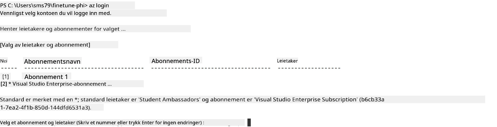

> [!TIP]
>
> Hvis du har problemer med å logge inn på Azure, prøv å bruke en enhetskode. Åpne et terminalvindu og skriv følgende kommando for å logge inn på Azure-kontoen din:
>
> ```console
> az login --use-device-code
> ```
>

### Finjuster Phi-3-modellen

I denne øvelsen skal du finjustere Phi-3-modellen ved hjelp av datasettet som er gitt. Først definerer du finjusteringsprosessen i filen *fine_tune.py*. Deretter konfigurerer du Azure Machine Learning-miljøet og starter finjusteringen ved å kjøre filen *setup_ml.py*. Dette skriptet sørger for at finjusteringen skjer innenfor Azure Machine Learning-miljøet.

Ved å kjøre *setup_ml.py* vil du sette i gang finjusteringsprosessen i Azure Machine Learning-miljøet.

#### Legg til kode i filen *fine_tune.py*

1. Naviger til mappen *finetuning_dir* og åpne filen *fine_tune.py* i Visual Studio Code.

1. Legg til følgende kode i *fine_tune.py*.

    ```python
    import argparse
    import sys
    import logging
    import os
    from datasets import load_dataset
    import torch
    import mlflow
    from transformers import AutoModelForCausalLM, AutoTokenizer, TrainingArguments
    from trl import SFTTrainer

    # For å unngå feilen INVALID_PARAMETER_VALUE i MLflow, deaktiver MLflow-integrasjon
    os.environ["DISABLE_MLFLOW_INTEGRATION"] = "True"

    # Oppsett av logging
    logging.basicConfig(
        format="%(asctime)s - %(levelname)s - %(name)s - %(message)s",
        datefmt="%Y-%m-%d %H:%M:%S",
        handlers=[logging.StreamHandler(sys.stdout)],
        level=logging.WARNING
    )
    logger = logging.getLogger(__name__)

    def initialize_model_and_tokenizer(model_name, model_kwargs):
        """
        Initialize the model and tokenizer with the given pretrained model name and arguments.
        """
        model = AutoModelForCausalLM.from_pretrained(model_name, **model_kwargs)
        tokenizer = AutoTokenizer.from_pretrained(model_name)
        tokenizer.model_max_length = 2048
        tokenizer.pad_token = tokenizer.unk_token
        tokenizer.pad_token_id = tokenizer.convert_tokens_to_ids(tokenizer.pad_token)
        tokenizer.padding_side = 'right'
        return model, tokenizer

    def apply_chat_template(example, tokenizer):
        """
        Apply a chat template to tokenize messages in the example.
        """
        messages = example["messages"]
        if messages[0]["role"] != "system":
            messages.insert(0, {"role": "system", "content": ""})
        example["text"] = tokenizer.apply_chat_template(
            messages, tokenize=False, add_generation_prompt=False
        )
        return example

    def load_and_preprocess_data(train_filepath, test_filepath, tokenizer):
        """
        Load and preprocess the dataset.
        """
        train_dataset = load_dataset('json', data_files=train_filepath, split='train')
        test_dataset = load_dataset('json', data_files=test_filepath, split='train')
        column_names = list(train_dataset.features)

        train_dataset = train_dataset.map(
            apply_chat_template,
            fn_kwargs={"tokenizer": tokenizer},
            num_proc=10,
            remove_columns=column_names,
            desc="Applying chat template to train dataset",
        )

        test_dataset = test_dataset.map(
            apply_chat_template,
            fn_kwargs={"tokenizer": tokenizer},
            num_proc=10,
            remove_columns=column_names,
            desc="Applying chat template to test dataset",
        )

        return train_dataset, test_dataset

    def train_and_evaluate_model(train_dataset, test_dataset, model, tokenizer, output_dir):
        """
        Train and evaluate the model.
        """
        training_args = TrainingArguments(
            bf16=True,
            do_eval=True,
            output_dir=output_dir,
            eval_strategy="epoch",
            learning_rate=5.0e-06,
            logging_steps=20,
            lr_scheduler_type="cosine",
            num_train_epochs=3,
            overwrite_output_dir=True,
            per_device_eval_batch_size=4,
            per_device_train_batch_size=4,
            remove_unused_columns=True,
            save_steps=500,
            seed=0,
            gradient_checkpointing=True,
            gradient_accumulation_steps=1,
            warmup_ratio=0.2,
        )

        trainer = SFTTrainer(
            model=model,
            args=training_args,
            train_dataset=train_dataset,
            eval_dataset=test_dataset,
            max_seq_length=2048,
            dataset_text_field="text",
            tokenizer=tokenizer,
            packing=True
        )

        train_result = trainer.train()
        trainer.log_metrics("train", train_result.metrics)

        mlflow.transformers.log_model(
            transformers_model={"model": trainer.model, "tokenizer": tokenizer},
            artifact_path=output_dir,
        )

        tokenizer.padding_side = 'left'
        eval_metrics = trainer.evaluate()
        eval_metrics["eval_samples"] = len(test_dataset)
        trainer.log_metrics("eval", eval_metrics)

    def main(train_file, eval_file, model_output_dir):
        """
        Main function to fine-tune the model.
        """
        model_kwargs = {
            "use_cache": False,
            "trust_remote_code": True,
            "torch_dtype": torch.bfloat16,
            "device_map": None,
            "attn_implementation": "eager"
        }

        # pretrained_model_name = "microsoft/Phi-3-mini-4k-instruct"
        pretrained_model_name = "microsoft/Phi-3.5-mini-instruct"

        with mlflow.start_run():
            model, tokenizer = initialize_model_and_tokenizer(pretrained_model_name, model_kwargs)
            train_dataset, test_dataset = load_and_preprocess_data(train_file, eval_file, tokenizer)
            train_and_evaluate_model(train_dataset, test_dataset, model, tokenizer, model_output_dir)

    if __name__ == "__main__":
        parser = argparse.ArgumentParser()
        parser.add_argument("--train-file", type=str, required=True, help="Path to the training data")
        parser.add_argument("--eval-file", type=str, required=True, help="Path to the evaluation data")
        parser.add_argument("--model_output_dir", type=str, required=True, help="Directory to save the fine-tuned model")
        args = parser.parse_args()
        main(args.train_file, args.eval_file, args.model_output_dir)

    ```

1. Lagre og lukk filen *fine_tune.py*.

> [!TIP]
> **Du kan finjustere Phi-3.5-modellen**
>
> I filen *fine_tune.py* kan du endre `pretrained_model_name` fra `"microsoft/Phi-3-mini-4k-instruct"` til hvilken som helst modell du ønsker å finjustere. For eksempel, hvis du endrer den til `"microsoft/Phi-3.5-mini-instruct"`, bruker du Phi-3.5-mini-instruct-modellen for finjustering. For å finne og bruke modellen du foretrekker, besøk [Hugging Face](https://huggingface.co/), søk etter modellen du er interessert i, og kopier og lim inn navnet i `pretrained_model_name`-feltet i skriptet ditt.
>
> <image type="content" src="../../../../imgs/02/FineTuning-PromptFlow/finetunephi3.5.png" alt-text="Finjuster Phi-3.5.">
>

#### Legg til kode i filen *setup_ml.py*

1. Åpne filen *setup_ml.py* i Visual Studio Code.

1. Legg til følgende kode i *setup_ml.py*.

    ```python
    import logging
    from azure.ai.ml import MLClient, command, Input
    from azure.ai.ml.entities import Environment, AmlCompute
    from azure.identity import AzureCliCredential
    from config import (
        AZURE_SUBSCRIPTION_ID,
        AZURE_RESOURCE_GROUP_NAME,
        AZURE_ML_WORKSPACE_NAME,
        TRAIN_DATA_PATH,
        TEST_DATA_PATH
    )

    # Konstanter

    # Fjern kommentaren på følgende linjer for å bruke en CPU-instans for trening
    # COMPUTE_INSTANCE_TYPE = "Standard_E16s_v3" # cpu
    # COMPUTE_NAME = "cpu-e16s-v3"
    # DOCKER_IMAGE_NAME = "mcr.microsoft.com/azureml/openmpi4.1.0-ubuntu20.04:latest"

    # Fjern kommentaren på følgende linjer for å bruke en GPU-instans for trening
    COMPUTE_INSTANCE_TYPE = "Standard_NC24ads_A100_v4"
    COMPUTE_NAME = "gpu-nc24s-a100-v4"
    DOCKER_IMAGE_NAME = "mcr.microsoft.com/azureml/curated/acft-hf-nlp-gpu:59"

    CONDA_FILE = "conda.yml"
    LOCATION = "eastus2" # Erstatt med plasseringen til din compute-klynge
    FINETUNING_DIR = "./finetuning_dir" # Sti til finjusteringsskriptet
    TRAINING_ENV_NAME = "phi-3-training-environment" # Navn på treningsmiljøet
    MODEL_OUTPUT_DIR = "./model_output" # Sti til modellutdata-katalogen i Azure ML

    # Loggoppsett for å spore prosessen
    logger = logging.getLogger(__name__)
    logging.basicConfig(
        format="%(asctime)s - %(levelname)s - %(name)s - %(message)s",
        datefmt="%Y-%m-%d %H:%M:%S",
        level=logging.WARNING
    )

    def get_ml_client():
        """
        Initialize the ML Client using Azure CLI credentials.
        """
        credential = AzureCliCredential()
        return MLClient(credential, AZURE_SUBSCRIPTION_ID, AZURE_RESOURCE_GROUP_NAME, AZURE_ML_WORKSPACE_NAME)

    def create_or_get_environment(ml_client):
        """
        Create or update the training environment in Azure ML.
        """
        env = Environment(
            image=DOCKER_IMAGE_NAME,  # Docker-bilde for miljøet
            conda_file=CONDA_FILE,  # Conda miljøfil
            name=TRAINING_ENV_NAME,  # Navn på miljøet
        )
        return ml_client.environments.create_or_update(env)

    def create_or_get_compute_cluster(ml_client, compute_name, COMPUTE_INSTANCE_TYPE, location):
        """
        Create or update the compute cluster in Azure ML.
        """
        try:
            compute_cluster = ml_client.compute.get(compute_name)
            logger.info(f"Compute cluster '{compute_name}' already exists. Reusing it for the current run.")
        except Exception:
            logger.info(f"Compute cluster '{compute_name}' does not exist. Creating a new one with size {COMPUTE_INSTANCE_TYPE}.")
            compute_cluster = AmlCompute(
                name=compute_name,
                size=COMPUTE_INSTANCE_TYPE,
                location=location,
                tier="Dedicated",  # Nivå på compute-klyngen
                min_instances=0,  # Minimum antall instanser
                max_instances=1  # Maksimalt antall instanser
            )
            ml_client.compute.begin_create_or_update(compute_cluster).wait()  # Vent på at klyngen skal opprettes
        return compute_cluster

    def create_fine_tuning_job(env, compute_name):
        """
        Set up the fine-tuning job in Azure ML.
        """
        return command(
            code=FINETUNING_DIR,  # Sti til fine_tune.py
            command=(
                "python fine_tune.py "
                "--train-file ${{inputs.train_file}} "
                "--eval-file ${{inputs.eval_file}} "
                "--model_output_dir ${{inputs.model_output}}"
            ),
            environment=env,  # Treningsmiljø
            compute=compute_name,  # Compute-klynge som skal brukes
            inputs={
                "train_file": Input(type="uri_file", path=TRAIN_DATA_PATH),  # Sti til treningsdatafilen
                "eval_file": Input(type="uri_file", path=TEST_DATA_PATH),  # Sti til evalueringsdatafilen
                "model_output": MODEL_OUTPUT_DIR
            }
        )

    def main():
        """
        Main function to set up and run the fine-tuning job in Azure ML.
        """
        # Initialiser ML-klient
        ml_client = get_ml_client()

        # Opprett miljø
        env = create_or_get_environment(ml_client)
        
        # Opprett eller hent eksisterende compute-klynge
        create_or_get_compute_cluster(ml_client, COMPUTE_NAME, COMPUTE_INSTANCE_TYPE, LOCATION)

        # Opprett og send inn finjusteringsjobb
        job = create_fine_tuning_job(env, COMPUTE_NAME)
        returned_job = ml_client.jobs.create_or_update(job)  # Send inn jobben
        ml_client.jobs.stream(returned_job.name)  # Strøm jobbloggene
        
        # Fang opp jobbnavigasjonen
        job_name = returned_job.name
        print(f"Job name: {job_name}")

    if __name__ == "__main__":
        main()

    ```

1. Erstatt `COMPUTE_INSTANCE_TYPE`, `COMPUTE_NAME`, og `LOCATION` med dine spesifikke detaljer.

    ```python
   # Fjern kommentaren fra de følgende linjene for å bruke en GPU-instans til trening
    COMPUTE_INSTANCE_TYPE = "Standard_NC24ads_A100_v4"
    COMPUTE_NAME = "gpu-nc24s-a100-v4"
    ...
    LOCATION = "eastus2" # Bytt ut med plasseringen av klynge for databehandling
    ```

> [!TIP]
>
> **Veiledning for finjustering med minimalt datasett ved bruk av CPU**
>
> Hvis du ønsker å bruke CPU til finjustering, er denne tilnærmingen ideell for de med fordelabonnementer (som Visual Studio Enterprise Subscription) eller for raskt å teste finjusterings- og distribusjonsprosessen.
>
> 1. Åpne *setup_ml*-filen.
> 1. Erstatt `COMPUTE_INSTANCE_TYPE`, `COMPUTE_NAME` og `DOCKER_IMAGE_NAME` med følgende. Hvis du ikke har tilgang til *Standard_E16s_v3*, kan du bruke en tilsvarende CPU-instans eller be om en ny kvote.
> 1. Erstatt `LOCATION` med dine spesifikke detaljer.
>
>    ```python
>    # Uncomment the following lines to use a CPU instance for training
>    COMPUTE_INSTANCE_TYPE = "Standard_E16s_v3" # cpu
>    COMPUTE_NAME = "cpu-e16s-v3"
>    DOCKER_IMAGE_NAME = "mcr.microsoft.com/azureml/openmpi4.1.0-ubuntu20.04:latest"
>    LOCATION = "eastus2" # Replace with the location of your compute cluster
>    ```
>

1. Skriv følgende kommando for å kjøre skriptet *setup_ml.py* og starte finjusteringsprosessen i Azure Machine Learning.

    ```python
    python setup_ml.py
    ```

1. I denne øvelsen har du lykkes med å finjustere Phi-3-modellen ved hjelp av Azure Machine Learning. Ved å kjøre skriptet *setup_ml.py* har du satt opp Azure Machine Learning-miljøet og startet finjusteringsprosessen definert i filen *fine_tune.py*. Vennligst merk at finjusteringsprosessen kan ta betydelig tid. Etter å ha kjørt kommandoen `python setup_ml.py` må du vente til prosessen er ferdig. Du kan følge statusen på finjusteringsjobben ved å bruke lenken i terminalen til Azure Machine Learning-portalen.

    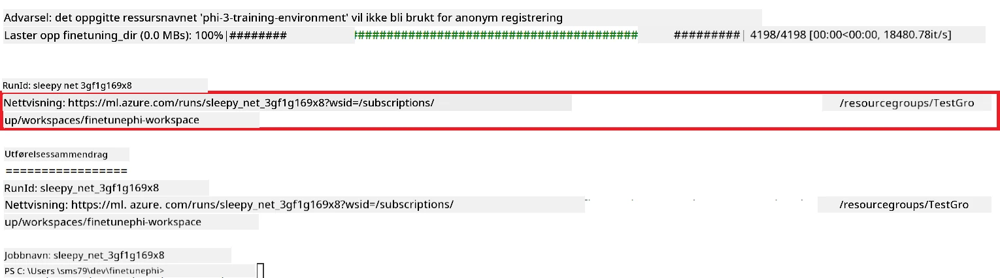

### Distribuer den finjusterte modellen

For å integrere den finjusterte Phi-3-modellen med Prompt Flow, må du distribuere modellen slik at den er tilgjengelig for sanntidsinferens. Denne prosessen innebærer å registrere modellen, opprette en online-endepunkt og distribuere modellen.

#### Sett modellnavn, endepunktsnavn og distribusjonsnavn for distribusjon

1. Åpne filen *config.py*.

1. Erstatt `AZURE_MODEL_NAME = "your_fine_tuned_model_name"` med ønsket navn for modellen din.

1. Erstatt `AZURE_ENDPOINT_NAME = "your_fine_tuned_model_endpoint_name"` med ønsket navn for endepunktet ditt.

1. Erstatt `AZURE_DEPLOYMENT_NAME = "your_fine_tuned_model_deployment_name"` med ønsket navn for distribusjonen din.

#### Legg til kode i filen *deploy_model.py*

Ved å kjøre filen *deploy_model.py* automatiseres hele distribusjonsprosessen. Den registrerer modellen, oppretter et endepunkt og utfører distribusjonen basert på innstillingene i filen config.py, som inkluderer modellnavn, endepunktsnavn og distribusjonsnavn.

1. Åpne filen *deploy_model.py* i Visual Studio Code.

1. Legg til følgende kode i *deploy_model.py*.

    ```python
    import logging
    from azure.identity import AzureCliCredential
    from azure.ai.ml import MLClient
    from azure.ai.ml.entities import Model, ProbeSettings, ManagedOnlineEndpoint, ManagedOnlineDeployment, IdentityConfiguration, ManagedIdentityConfiguration, OnlineRequestSettings
    from azure.ai.ml.constants import AssetTypes

    # Konfigurasjonsimporter
    from config import (
        AZURE_SUBSCRIPTION_ID,
        AZURE_RESOURCE_GROUP_NAME,
        AZURE_ML_WORKSPACE_NAME,
        AZURE_MANAGED_IDENTITY_RESOURCE_ID,
        AZURE_MANAGED_IDENTITY_CLIENT_ID,
        AZURE_MODEL_NAME,
        AZURE_ENDPOINT_NAME,
        AZURE_DEPLOYMENT_NAME
    )

    # Konstanter
    JOB_NAME = "your-job-name"
    COMPUTE_INSTANCE_TYPE = "Standard_E4s_v3"

    deployment_env_vars = {
        "SUBSCRIPTION_ID": AZURE_SUBSCRIPTION_ID,
        "RESOURCE_GROUP_NAME": AZURE_RESOURCE_GROUP_NAME,
        "UAI_CLIENT_ID": AZURE_MANAGED_IDENTITY_CLIENT_ID,
    }

    # Loggeroppsett
    logging.basicConfig(
        format="%(asctime)s - %(levelname)s - %(name)s - %(message)s",
        datefmt="%Y-%m-%d %H:%M:%S",
        level=logging.DEBUG
    )
    logger = logging.getLogger(__name__)

    def get_ml_client():
        """Initialize and return the ML Client."""
        credential = AzureCliCredential()
        return MLClient(credential, AZURE_SUBSCRIPTION_ID, AZURE_RESOURCE_GROUP_NAME, AZURE_ML_WORKSPACE_NAME)

    def register_model(ml_client, model_name, job_name):
        """Register a new model."""
        model_path = f"azureml://jobs/{job_name}/outputs/artifacts/paths/model_output"
        logger.info(f"Registering model {model_name} from job {job_name} at path {model_path}.")
        run_model = Model(
            path=model_path,
            name=model_name,
            description="Model created from run.",
            type=AssetTypes.MLFLOW_MODEL,
        )
        model = ml_client.models.create_or_update(run_model)
        logger.info(f"Registered model ID: {model.id}")
        return model

    def delete_existing_endpoint(ml_client, endpoint_name):
        """Delete existing endpoint if it exists."""
        try:
            endpoint_result = ml_client.online_endpoints.get(name=endpoint_name)
            logger.info(f"Deleting existing endpoint {endpoint_name}.")
            ml_client.online_endpoints.begin_delete(name=endpoint_name).result()
            logger.info(f"Deleted existing endpoint {endpoint_name}.")
        except Exception as e:
            logger.info(f"No existing endpoint {endpoint_name} found to delete: {e}")

    def create_or_update_endpoint(ml_client, endpoint_name, description=""):
        """Create or update an endpoint."""
        delete_existing_endpoint(ml_client, endpoint_name)
        logger.info(f"Creating new endpoint {endpoint_name}.")
        endpoint = ManagedOnlineEndpoint(
            name=endpoint_name,
            description=description,
            identity=IdentityConfiguration(
                type="user_assigned",
                user_assigned_identities=[ManagedIdentityConfiguration(resource_id=AZURE_MANAGED_IDENTITY_RESOURCE_ID)]
            )
        )
        endpoint_result = ml_client.online_endpoints.begin_create_or_update(endpoint).result()
        logger.info(f"Created new endpoint {endpoint_name}.")
        return endpoint_result

    def create_or_update_deployment(ml_client, endpoint_name, deployment_name, model):
        """Create or update a deployment."""

        logger.info(f"Creating deployment {deployment_name} for endpoint {endpoint_name}.")
        deployment = ManagedOnlineDeployment(
            name=deployment_name,
            endpoint_name=endpoint_name,
            model=model.id,
            instance_type=COMPUTE_INSTANCE_TYPE,
            instance_count=1,
            environment_variables=deployment_env_vars,
            request_settings=OnlineRequestSettings(
                max_concurrent_requests_per_instance=3,
                request_timeout_ms=180000,
                max_queue_wait_ms=120000
            ),
            liveness_probe=ProbeSettings(
                failure_threshold=30,
                success_threshold=1,
                period=100,
                initial_delay=500,
            ),
            readiness_probe=ProbeSettings(
                failure_threshold=30,
                success_threshold=1,
                period=100,
                initial_delay=500,
            ),
        )
        deployment_result = ml_client.online_deployments.begin_create_or_update(deployment).result()
        logger.info(f"Created deployment {deployment.name} for endpoint {endpoint_name}.")
        return deployment_result

    def set_traffic_to_deployment(ml_client, endpoint_name, deployment_name):
        """Set traffic to the specified deployment."""
        try:
            # Hent gjeldende endepunktdetaljer
            endpoint = ml_client.online_endpoints.get(name=endpoint_name)
            
            # Logg gjeldende trafikkfordeling for feilsøking
            logger.info(f"Current traffic allocation: {endpoint.traffic}")
            
            # Sett trafikkfordeling for distribusjonen
            endpoint.traffic = {deployment_name: 100}
            
            # Oppdater endepunktet med den nye trafikkfordelingen
            endpoint_poller = ml_client.online_endpoints.begin_create_or_update(endpoint)
            updated_endpoint = endpoint_poller.result()
            
            # Logg oppdatert trafikkfordeling for feilsøking
            logger.info(f"Updated traffic allocation: {updated_endpoint.traffic}")
            logger.info(f"Set traffic to deployment {deployment_name} at endpoint {endpoint_name}.")
            return updated_endpoint
        except Exception as e:
            # Logg eventuelle feil som oppstår under prosessen
            logger.error(f"Failed to set traffic to deployment: {e}")
            raise


    def main():
        ml_client = get_ml_client()

        registered_model = register_model(ml_client, AZURE_MODEL_NAME, JOB_NAME)
        logger.info(f"Registered model ID: {registered_model.id}")

        endpoint = create_or_update_endpoint(ml_client, AZURE_ENDPOINT_NAME, "Endpoint for finetuned Phi-3 model")
        logger.info(f"Endpoint {AZURE_ENDPOINT_NAME} is ready.")

        try:
            deployment = create_or_update_deployment(ml_client, AZURE_ENDPOINT_NAME, AZURE_DEPLOYMENT_NAME, registered_model)
            logger.info(f"Deployment {AZURE_DEPLOYMENT_NAME} is created for endpoint {AZURE_ENDPOINT_NAME}.")

            set_traffic_to_deployment(ml_client, AZURE_ENDPOINT_NAME, AZURE_DEPLOYMENT_NAME)
            logger.info(f"Traffic is set to deployment {AZURE_DEPLOYMENT_NAME} at endpoint {AZURE_ENDPOINT_NAME}.")
        except Exception as e:
            logger.error(f"Failed to create or update deployment: {e}")

    if __name__ == "__main__":
        main()

    ```

1. Utfør følgende for å finne `JOB_NAME`:

    - Naviger til Azure Machine Learning-ressursen du opprettet.
    - Velg **Studio web URL** for å åpne Azure Machine Learning-arbeidsområdet.
    - Velg **Jobs** fra venstre side-vindu.
    - Velg eksperimentet for finjustering. For eksempel *finetunephi*.
    - Velg jobben du opprettet.
- Kopier og lim inn navnet på jobben din i `JOB_NAME = "your-job-name"` i *deploy_model.py*-filen.

1. Erstatt `COMPUTE_INSTANCE_TYPE` med dine spesifikke detaljer.

1. Skriv følgende kommando for å kjøre *deploy_model.py*-skriptet og starte distribusjonsprosessen i Azure Machine Learning.

    ```python
    python deploy_model.py
    ```

> [!WARNING]
> For å unngå ekstra kostnader på kontoen din, sørg for å slette den opprettede endepunktet i Azure Machine Learning-arbeidsområdet.
>

#### Sjekk distribusjonsstatus i Azure Machine Learning Workspace

1. Besøk [Azure ML Studio](https://ml.azure.com/home?wt.mc_id=studentamb_279723).

1. Naviger til Azure Machine Learning-arbeidsområdet du opprettet.

1. Velg **Studio web URL** for å åpne Azure Machine Learning-arbeidsområdet.

1. Velg **Endpoints** fra fanen på venstre side.

    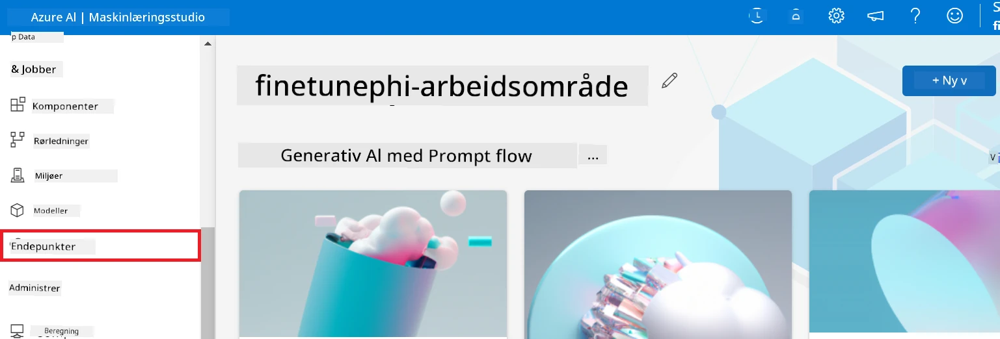

2. Velg endepunktet du opprettet.

    

3. På denne siden kan du administrere endepunktene som ble opprettet under distribusjonsprosessen.

## Scenario 3: Integrer med Prompt flow og chat med din tilpassede modell

### Integrer den tilpassede Phi-3-modellen med Prompt flow

Etter å ha distribuert din finjusterte modell, kan du nå integrere den med Prompt flow for å bruke modellen i sanntidsapplikasjoner, noe som muliggjør en rekke interaktive oppgaver med din tilpassede Phi-3-modell.

#### Sett API-nøkkel og endepunkt-URI for den finjusterte Phi-3-modellen

1. Naviger til Azure Machine Learning-arbeidsområdet du opprettet.  
1. Velg **Endpoints** fra fanen på venstre side.  
1. Velg endepunktet du opprettet.  
1. Velg **Consume** fra navigasjonsmenyen.  
1. Kopier og lim inn din **REST endpoint** i *config.py*-filen, og erstatt `AZURE_ML_ENDPOINT = "your_fine_tuned_model_endpoint_uri"` med din **REST endpoint**.  
1. Kopier og lim inn din **Primary key** i *config.py*-filen, og erstatt `AZURE_ML_API_KEY = "your_fine_tuned_model_api_key"` med din **Primary key**.  

    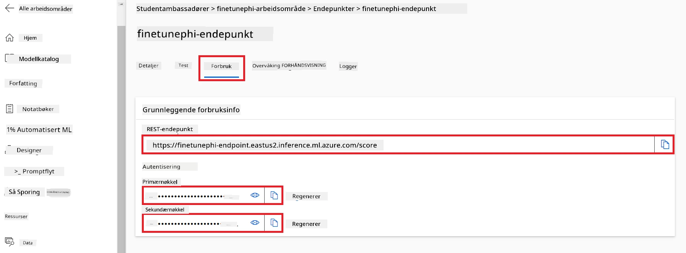

#### Legg til kode i *flow.dag.yml*-filen

1. Åpne *flow.dag.yml*-filen i Visual Studio Code.

1. Legg til følgende kode i *flow.dag.yml*.

    ```yml
    inputs:
      input_data:
        type: string
        default: "Who founded Microsoft?"

    outputs:
      answer:
        type: string
        reference: ${integrate_with_promptflow.output}

    nodes:
    - name: integrate_with_promptflow
      type: python
      source:
        type: code
        path: integrate_with_promptflow.py
      inputs:
        input_data: ${inputs.input_data}
    ```

#### Legg til kode i *integrate_with_promptflow.py*-filen

1. Åpne *integrate_with_promptflow.py*-filen i Visual Studio Code.

1. Legg til følgende kode i *integrate_with_promptflow.py*.

    ```python
    import logging
    import requests
    from promptflow.core import tool
    import asyncio
    import platform
    from config import (
        AZURE_ML_ENDPOINT,
        AZURE_ML_API_KEY
    )

    # Oppsett av logging
    logging.basicConfig(
        format="%(asctime)s - %(levelname)s - %(name)s - %(message)s",
        datefmt="%Y-%m-%d %H:%M:%S",
        level=logging.DEBUG
    )
    logger = logging.getLogger(__name__)

    def query_azml_endpoint(input_data: list, endpoint_url: str, api_key: str) -> str:
        """
        Send a request to the Azure ML endpoint with the given input data.
        """
        headers = {
            "Content-Type": "application/json",
            "Authorization": f"Bearer {api_key}"
        }
        data = {
            "input_data": [input_data],
            "params": {
                "temperature": 0.7,
                "max_new_tokens": 128,
                "do_sample": True,
                "return_full_text": True
            }
        }
        try:
            response = requests.post(endpoint_url, json=data, headers=headers)
            response.raise_for_status()
            result = response.json()[0]
            logger.info("Successfully received response from Azure ML Endpoint.")
            return result
        except requests.exceptions.RequestException as e:
            logger.error(f"Error querying Azure ML Endpoint: {e}")
            raise

    def setup_asyncio_policy():
        """
        Setup asyncio event loop policy for Windows.
        """
        if platform.system() == 'Windows':
            asyncio.set_event_loop_policy(asyncio.WindowsSelectorEventLoopPolicy())
            logger.info("Set Windows asyncio event loop policy.")

    @tool
    def my_python_tool(input_data: str) -> str:
        """
        Tool function to process input data and query the Azure ML endpoint.
        """
        setup_asyncio_policy()
        return query_azml_endpoint(input_data, AZURE_ML_ENDPOINT, AZURE_ML_API_KEY)

    ```

### Chat med din tilpassede modell

1. Skriv følgende kommando for å kjøre *deploy_model.py*-skriptet og starte distribusjonsprosessen i Azure Machine Learning.

    ```python
    pf flow serve --source ./ --port 8080 --host localhost
    ```

1. Her er et eksempel på resultatene: Nå kan du chatte med din tilpassede Phi-3-modell. Det anbefales å stille spørsmål basert på dataene som ble brukt til finjustering.

    

---

<!-- CO-OP TRANSLATOR DISCLAIMER START -->
**Ansvarsfraskrivelse**:
Dette dokumentet er oversatt ved hjelp av AI-oversettelsestjenesten [Co-op Translator](https://github.com/Azure/co-op-translator). Selv om vi etterstreber nøyaktighet, vennligst vær oppmerksom på at automatiske oversettelser kan inneholde feil eller unøyaktigheter. Det opprinnelige dokumentet på dets opprinnelige språk bør anses som den autoritative kilden. For kritisk informasjon anbefales profesjonell menneskelig oversettelse. Vi er ikke ansvarlige for eventuelle misforståelser eller feiltolkninger som oppstår som følge av bruken av denne oversettelsen.
<!-- CO-OP TRANSLATOR DISCLAIMER END -->