<!--
CO_OP_TRANSLATOR_METADATA:
{
  "original_hash": "ecbd9179a21edbaafaf114d47f09f3e3",
  "translation_date": "2025-07-17T01:35:09+00:00",
  "source_file": "md/02.Application/01.TextAndChat/Phi3/E2E_Phi-3-FineTuning_PromptFlow_Integration_AIFoundry.md",
  "language_code": "no"
}
-->
# Finjuster og integrer tilpassede Phi-3-modeller med Prompt flow i Azure AI Foundry

Dette ende-til-ende (E2E) eksempelet er basert på guiden "[Fine-Tune and Integrate Custom Phi-3 Models with Prompt Flow in Azure AI Foundry](https://techcommunity.microsoft.com/t5/educator-developer-blog/fine-tune-and-integrate-custom-phi-3-models-with-prompt-flow-in/ba-p/4191726?WT.mc_id=aiml-137032-kinfeylo)" fra Microsoft Tech Community. Det introduserer prosessene for finjustering, distribusjon og integrering av tilpassede Phi-3-modeller med Prompt flow i Azure AI Foundry. I motsetning til E2E-eksempelet, "[Fine-Tune and Integrate Custom Phi-3 Models with Prompt Flow](./E2E_Phi-3-FineTuning_PromptFlow_Integration.md)", som involverte kjøring av kode lokalt, fokuserer denne veiledningen helt på finjustering og integrering av modellen din innen Azure AI / ML Studio.

## Oversikt

I dette E2E-eksempelet vil du lære hvordan du finjusterer Phi-3-modellen og integrerer den med Prompt flow i Azure AI Foundry. Ved å bruke Azure AI / ML Studio vil du etablere en arbeidsflyt for distribusjon og bruk av tilpassede AI-modeller. Dette E2E-eksempelet er delt inn i tre scenarier:

**Scenario 1: Sett opp Azure-ressurser og forbered for finjustering**

**Scenario 2: Finjuster Phi-3-modellen og distribuer i Azure Machine Learning Studio**

**Scenario 3: Integrer med Prompt flow og chat med din tilpassede modell i Azure AI Foundry**

Her er en oversikt over dette E2E-eksempelet.

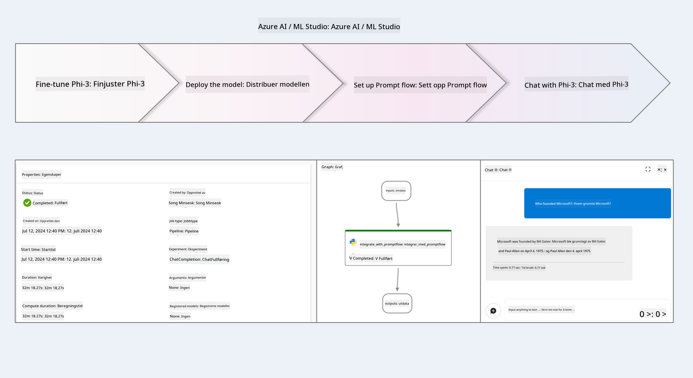

### Innholdsfortegnelse

1. **[Scenario 1: Sett opp Azure-ressurser og forbered for finjustering](../../../../../../md/02.Application/01.TextAndChat/Phi3)**
    - [Opprett et Azure Machine Learning Workspace](../../../../../../md/02.Application/01.TextAndChat/Phi3)
    - [Be om GPU-kvoter i Azure-abonnement](../../../../../../md/02.Application/01.TextAndChat/Phi3)
    - [Legg til rolle-tilordning](../../../../../../md/02.Application/01.TextAndChat/Phi3)
    - [Sett opp prosjekt](../../../../../../md/02.Application/01.TextAndChat/Phi3)
    - [Forbered datasett for finjustering](../../../../../../md/02.Application/01.TextAndChat/Phi3)

1. **[Scenario 2: Finjuster Phi-3-modellen og distribuer i Azure Machine Learning Studio](../../../../../../md/02.Application/01.TextAndChat/Phi3)**
    - [Finjuster Phi-3-modellen](../../../../../../md/02.Application/01.TextAndChat/Phi3)
    - [Distribuer den finjusterte Phi-3-modellen](../../../../../../md/02.Application/01.TextAndChat/Phi3)

1. **[Scenario 3: Integrer med Prompt flow og chat med din tilpassede modell i Azure AI Foundry](../../../../../../md/02.Application/01.TextAndChat/Phi3)**
    - [Integrer den tilpassede Phi-3-modellen med Prompt flow](../../../../../../md/02.Application/01.TextAndChat/Phi3)
    - [Chat med din tilpassede Phi-3-modell](../../../../../../md/02.Application/01.TextAndChat/Phi3)

## Scenario 1: Sett opp Azure-ressurser og forbered for finjustering

### Opprett et Azure Machine Learning Workspace

1. Skriv *azure machine learning* i **søkelinjen** øverst på portal-siden og velg **Azure Machine Learning** fra alternativene som vises.

    

2. Velg **+ Create** fra navigasjonsmenyen.

3. Velg **New workspace** fra navigasjonsmenyen.

    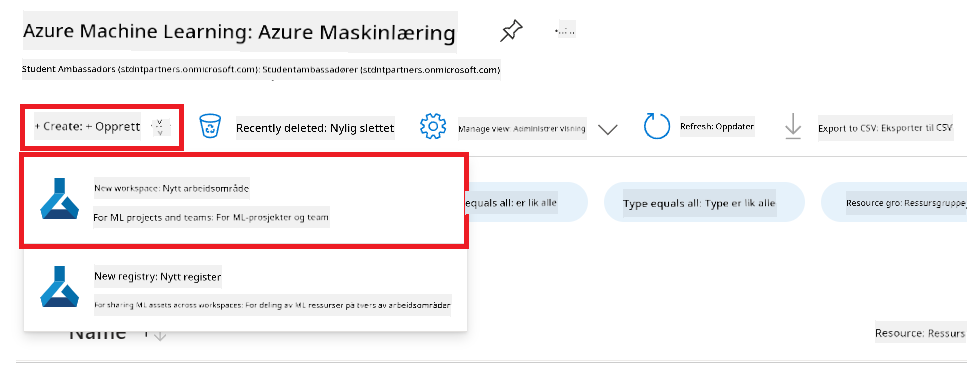

4. Utfør følgende oppgaver:

    - Velg ditt Azure **Subscription**.
    - Velg **Resource group** som skal brukes (opprett en ny om nødvendig).
    - Skriv inn **Workspace Name**. Det må være en unik verdi.
    - Velg **Region** du ønsker å bruke.
    - Velg **Storage account** som skal brukes (opprett en ny om nødvendig).
    - Velg **Key vault** som skal brukes (opprett en ny om nødvendig).
    - Velg **Application insights** som skal brukes (opprett en ny om nødvendig).
    - Velg **Container registry** som skal brukes (opprett en ny om nødvendig).

    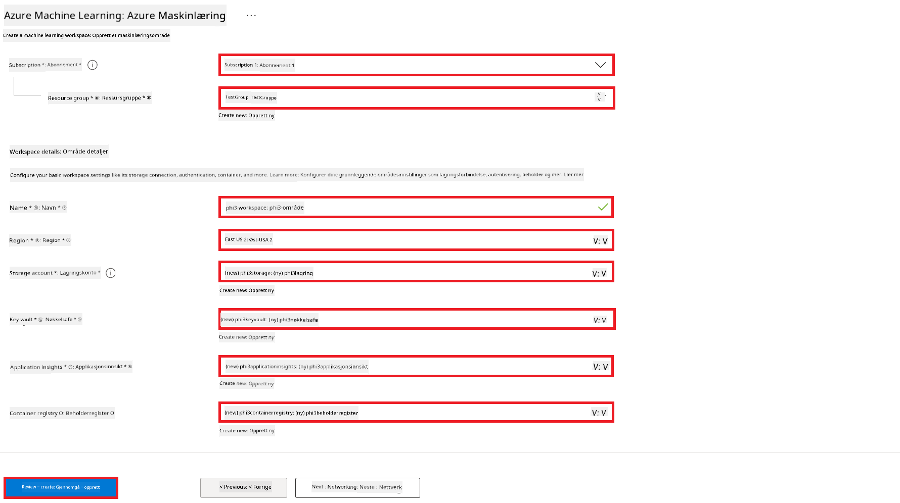

5. Velg **Review + Create**.

6. Velg **Create**.

### Be om GPU-kvoter i Azure-abonnement

I denne veiledningen vil du lære hvordan du finjusterer og distribuerer en Phi-3-modell ved bruk av GPUer. For finjustering vil du bruke *Standard_NC24ads_A100_v4* GPU, som krever en kvotebegjæring. For distribusjon vil du bruke *Standard_NC6s_v3* GPU, som også krever en kvotebegjæring.

> [!NOTE]
>
> Kun Pay-As-You-Go-abonnementer (standard abonnementstype) er kvalifisert for GPU-tildeling; fordelabonnementer støttes ikke for øyeblikket.
>

1. Besøk [Azure ML Studio](https://ml.azure.com/home?wt.mc_id=studentamb_279723).

1. Utfør følgende for å be om *Standard NCADSA100v4 Family* kvote:

    - Velg **Quota** fra venstre side-fane.
    - Velg **Virtual machine family** som skal brukes. For eksempel, velg **Standard NCADSA100v4 Family Cluster Dedicated vCPUs**, som inkluderer *Standard_NC24ads_A100_v4* GPU.
    - Velg **Request quota** fra navigasjonsmenyen.

        

    - På siden for Request quota, skriv inn **New cores limit** du ønsker å bruke. For eksempel, 24.
    - På siden for Request quota, velg **Submit** for å sende inn GPU-kvotebegjæringen.

1. Utfør følgende for å be om *Standard NCSv3 Family* kvote:

    - Velg **Quota** fra venstre side-fane.
    - Velg **Virtual machine family** som skal brukes. For eksempel, velg **Standard NCSv3 Family Cluster Dedicated vCPUs**, som inkluderer *Standard_NC6s_v3* GPU.
    - Velg **Request quota** fra navigasjonsmenyen.
    - På siden for Request quota, skriv inn **New cores limit** du ønsker å bruke. For eksempel, 24.
    - På siden for Request quota, velg **Submit** for å sende inn GPU-kvotebegjæringen.

### Legg til rolle-tilordning

For å finjustere og distribuere modellene dine må du først opprette en User Assigned Managed Identity (UAI) og tildele den riktige tillatelser. Denne UAI vil bli brukt for autentisering under distribusjon.

#### Opprett User Assigned Managed Identity (UAI)

1. Skriv *managed identities* i **søkelinjen** øverst på portal-siden og velg **Managed Identities** fra alternativene som vises.

    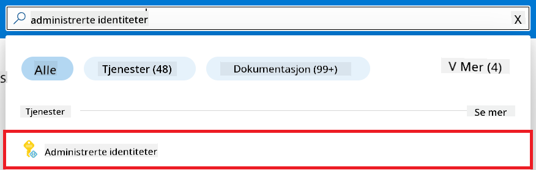

1. Velg **+ Create**.

    

1. Utfør følgende oppgaver:

    - Velg ditt Azure **Subscription**.
    - Velg **Resource group** som skal brukes (opprett en ny om nødvendig).
    - Velg **Region** du ønsker å bruke.
    - Skriv inn **Name**. Det må være en unik verdi.

    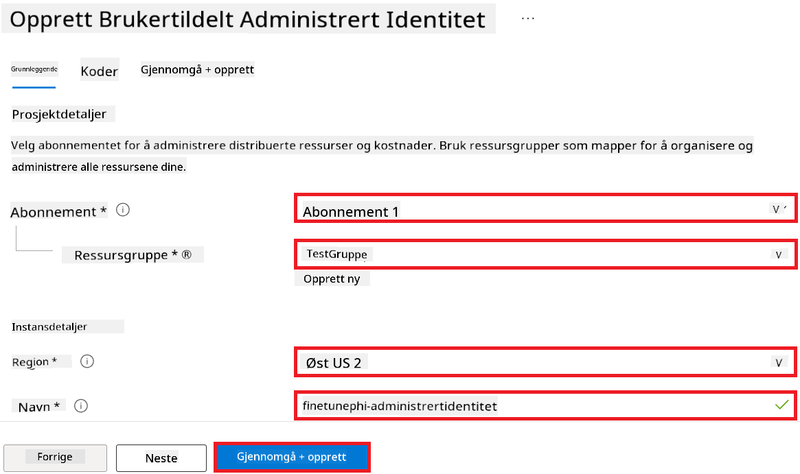

1. Velg **Review + create**.

1. Velg **+ Create**.

#### Legg til Contributor-rolle til Managed Identity

1. Naviger til Managed Identity-ressursen du opprettet.

1. Velg **Azure role assignments** fra venstre side-fane.

1. Velg **+Add role assignment** fra navigasjonsmenyen.

1. På siden for Add role assignment, utfør følgende:

    - Velg **Scope** til **Resource group**.
    - Velg ditt Azure **Subscription**.
    - Velg **Resource group** som skal brukes.
    - Velg **Role** til **Contributor**.

    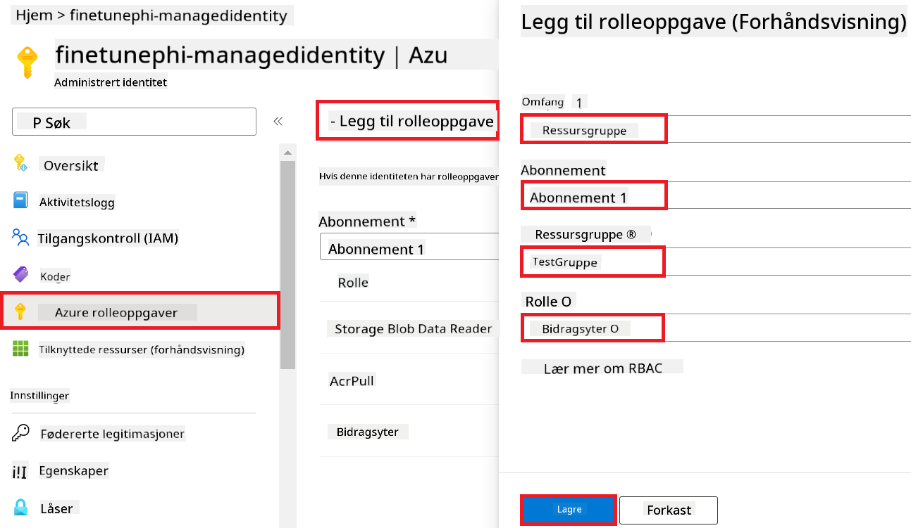

2. Velg **Save**.

#### Legg til Storage Blob Data Reader-rolle til Managed Identity

1. Skriv *storage accounts* i **søkelinjen** øverst på portal-siden og velg **Storage accounts** fra alternativene som vises.

    

1. Velg lagringskontoen som er tilknyttet Azure Machine Learning workspace du opprettet. For eksempel, *finetunephistorage*.

1. Utfør følgende for å navigere til Add role assignment-siden:

    - Naviger til Azure Storage-kontoen du opprettet.
    - Velg **Access Control (IAM)** fra venstre side-fane.
    - Velg **+ Add** fra navigasjonsmenyen.
    - Velg **Add role assignment** fra navigasjonsmenyen.

    

1. På siden for Add role assignment, utfør følgende:

    - På Role-siden, skriv *Storage Blob Data Reader* i **søkelinjen** og velg **Storage Blob Data Reader** fra alternativene som vises.
    - På Role-siden, velg **Next**.
    - På Members-siden, velg **Assign access to** **Managed identity**.
    - På Members-siden, velg **+ Select members**.
    - På Select managed identities-siden, velg ditt Azure **Subscription**.
    - På Select managed identities-siden, velg **Managed identity** til **Manage Identity**.
    - På Select managed identities-siden, velg den Manage Identity du opprettet. For eksempel, *finetunephi-managedidentity*.
    - På Select managed identities-siden, velg **Select**.

    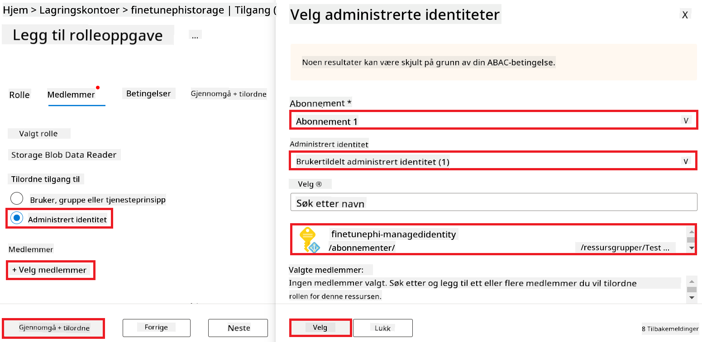

1. Velg **Review + assign**.

#### Legg til AcrPull-rolle til Managed Identity

1. Skriv *container registries* i **søkelinjen** øverst på portal-siden og velg **Container registries** fra alternativene som vises.

    

1. Velg container registry som er tilknyttet Azure Machine Learning workspace. For eksempel, *finetunephicontainerregistry*

1. Utfør følgende for å navigere til Add role assignment-siden:

    - Velg **Access Control (IAM)** fra venstre side-fane.
    - Velg **+ Add** fra navigasjonsmenyen.
    - Velg **Add role assignment** fra navigasjonsmenyen.

1. På siden for Add role assignment, utfør følgende:

    - På Role-siden, skriv *AcrPull* i **søkelinjen** og velg **AcrPull** fra alternativene som vises.
    - På Role-siden, velg **Next**.
    - På Members-siden, velg **Assign access to** **Managed identity**.
    - På Members-siden, velg **+ Select members**.
    - På Select managed identities-siden, velg ditt Azure **Subscription**.
    - På Select managed identities-siden, velg **Managed identity** til **Manage Identity**.
    - På Select managed identities-siden, velg den Manage Identity du opprettet. For eksempel, *finetunephi-managedidentity*.
    - På Select managed identities-siden, velg **Select**.
    - Velg **Review + assign**.

### Sett opp prosjekt

For å laste ned datasettene som trengs for finjustering, vil du sette opp et lokalt miljø.

I denne øvelsen vil du

- Opprette en mappe å jobbe i.
- Opprette et virtuelt miljø.
- Installere nødvendige pakker.
- Lage en *download_dataset.py*-fil for å laste ned datasettet.

#### Opprett en mappe å jobbe i

1. Åpne et terminalvindu og skriv følgende kommando for å opprette en mappe kalt *finetune-phi* i standardbanen.

    ```console
    mkdir finetune-phi
    ```

2. Skriv følgende kommando i terminalen for å navigere til *finetune-phi*-mappen du opprettet.
#### Opprett et virtuelt miljø

1. Skriv følgende kommando i terminalen for å opprette et virtuelt miljø kalt *.venv*.

    ```console
    python -m venv .venv
    ```

2. Skriv følgende kommando i terminalen for å aktivere det virtuelle miljøet.

    ```console
    .venv\Scripts\activate.bat
    ```


> [!NOTE]
> Hvis det fungerte, skal du se *(.venv)* foran kommandoprompten.

#### Installer nødvendige pakker

1. Skriv følgende kommandoer i terminalen for å installere de nødvendige pakkene.

    ```console
    pip install datasets==2.19.1
    ```

#### Opprett `download_dataset.py`

> [!NOTE]
> Komplett mappestruktur:
>
> ```text
> └── YourUserName
> .    └── finetune-phi
> .        └── download_dataset.py
> ```

1. Åpne **Visual Studio Code**.

1. Velg **File** i menylinjen.

1. Velg **Open Folder**.

1. Velg mappen *finetune-phi* som du opprettet, som ligger på *C:\Users\yourUserName\finetune-phi*.

    

1. I venstre panel i Visual Studio Code, høyreklikk og velg **New File** for å opprette en ny fil kalt *download_dataset.py*.

    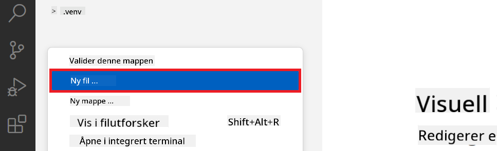

### Forbered datasett for finjustering

I denne øvelsen skal du kjøre filen *download_dataset.py* for å laste ned datasettene *ultrachat_200k* til ditt lokale miljø. Du vil deretter bruke disse datasettene til å finjustere Phi-3-modellen i Azure Machine Learning.

I denne øvelsen skal du:

- Legge til kode i filen *download_dataset.py* for å laste ned datasettene.
- Kjøre filen *download_dataset.py* for å laste ned datasettene til ditt lokale miljø.

#### Last ned datasettet ditt med *download_dataset.py*

1. Åpne filen *download_dataset.py* i Visual Studio Code.

1. Legg til følgende kode i filen *download_dataset.py*.

    ```python
    import json
    import os
    from datasets import load_dataset

    def load_and_split_dataset(dataset_name, config_name, split_ratio):
        """
        Load and split a dataset.
        """
        # Load the dataset with the specified name, configuration, and split ratio
        dataset = load_dataset(dataset_name, config_name, split=split_ratio)
        print(f"Original dataset size: {len(dataset)}")
        
        # Split the dataset into train and test sets (80% train, 20% test)
        split_dataset = dataset.train_test_split(test_size=0.2)
        print(f"Train dataset size: {len(split_dataset['train'])}")
        print(f"Test dataset size: {len(split_dataset['test'])}")
        
        return split_dataset

    def save_dataset_to_jsonl(dataset, filepath):
        """
        Save a dataset to a JSONL file.
        """
        # Create the directory if it does not exist
        os.makedirs(os.path.dirname(filepath), exist_ok=True)
        
        # Open the file in write mode
        with open(filepath, 'w', encoding='utf-8') as f:
            # Iterate over each record in the dataset
            for record in dataset:
                # Dump the record as a JSON object and write it to the file
                json.dump(record, f)
                # Write a newline character to separate records
                f.write('\n')
        
        print(f"Dataset saved to {filepath}")

    def main():
        """
        Main function to load, split, and save the dataset.
        """
        # Load and split the ULTRACHAT_200k dataset with a specific configuration and split ratio
        dataset = load_and_split_dataset("HuggingFaceH4/ultrachat_200k", 'default', 'train_sft[:1%]')
        
        # Extract the train and test datasets from the split
        train_dataset = dataset['train']
        test_dataset = dataset['test']

        # Save the train dataset to a JSONL file
        save_dataset_to_jsonl(train_dataset, "data/train_data.jsonl")
        
        # Save the test dataset to a separate JSONL file
        save_dataset_to_jsonl(test_dataset, "data/test_data.jsonl")

    if __name__ == "__main__":
        main()

    ```

1. Skriv følgende kommando i terminalen for å kjøre skriptet og laste ned datasettet til ditt lokale miljø.

    ```console
    python download_dataset.py
    ```

1. Bekreft at datasettene ble lagret riktig i din lokale *finetune-phi/data* mappe.

> [!NOTE]
>
> #### Merk om datasettstørrelse og finjusteringstid
>
> I denne veiledningen bruker du kun 1 % av datasettet (`split='train[:1%]'`). Dette reduserer datamengden betydelig, noe som gjør både opplasting og finjustering raskere. Du kan justere prosentandelen for å finne riktig balanse mellom treningstid og modellens ytelse. Å bruke et mindre utvalg av datasettet reduserer tiden som kreves for finjustering, noe som gjør prosessen mer håndterbar i en veiledning.

## Scenario 2: Finjuster Phi-3-modellen og distribuer i Azure Machine Learning Studio

### Finjuster Phi-3-modellen

I denne øvelsen skal du finjustere Phi-3-modellen i Azure Machine Learning Studio.

I denne øvelsen skal du:

- Opprette en dataklynge for finjustering.
- Finjustere Phi-3-modellen i Azure Machine Learning Studio.

#### Opprett dataklynge for finjustering

1. Besøk [Azure ML Studio](https://ml.azure.com/home?wt.mc_id=studentamb_279723).

1. Velg **Compute** i venstre sidepanel.

1. Velg **Compute clusters** i navigasjonsmenyen.

1. Velg **+ New**.

    

1. Gjør følgende:

    - Velg **Region** du ønsker å bruke.
    - Velg **Virtual machine tier** til **Dedicated**.
    - Velg **Virtual machine type** til **GPU**.
    - Velg filteret for **Virtual machine size** til **Select from all options**.
    - Velg **Virtual machine size** til **Standard_NC24ads_A100_v4**.

    

1. Velg **Next**.

1. Gjør følgende:

    - Skriv inn **Compute name**. Det må være et unikt navn.
    - Velg **Minimum number of nodes** til **0**.
    - Velg **Maximum number of nodes** til **1**.
    - Velg **Idle seconds before scale down** til **120**.

    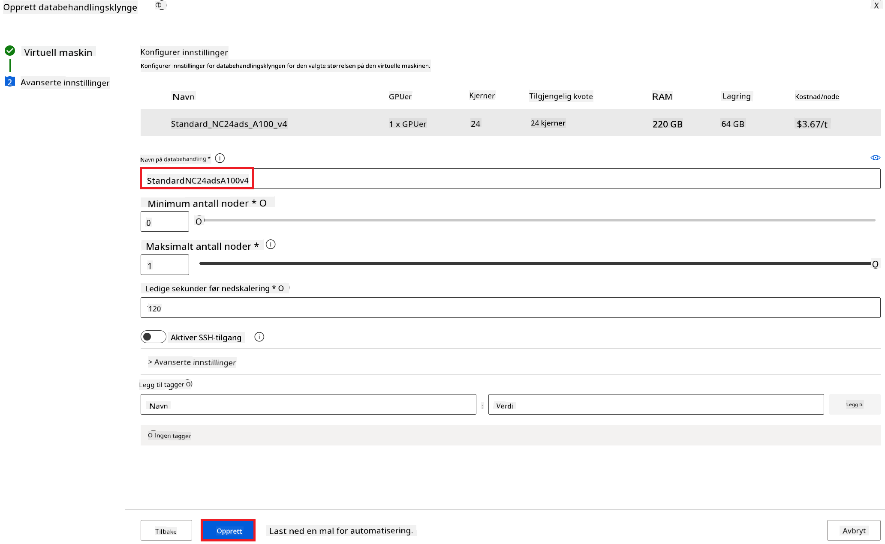

1. Velg **Create**.

#### Finjuster Phi-3-modellen

1. Besøk [Azure ML Studio](https://ml.azure.com/home?wt.mc_id=studentamb_279723).

1. Velg Azure Machine Learning-arbeidsområdet du opprettet.

    

1. Gjør følgende:

    - Velg **Model catalog** i venstre sidepanel.
    - Skriv *phi-3-mini-4k* i **søkelinjen** og velg **Phi-3-mini-4k-instruct** fra alternativene som vises.

    

1. Velg **Fine-tune** i navigasjonsmenyen.

    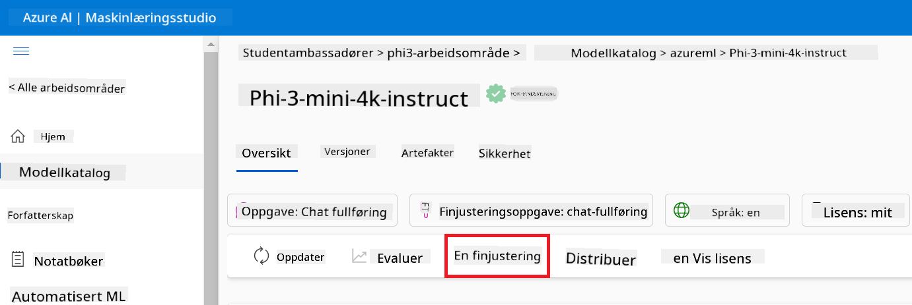

1. Gjør følgende:

    - Velg **Select task type** til **Chat completion**.
    - Velg **+ Select data** for å laste opp **Treningsdata**.
    - Velg opplastningstype for valideringsdata til **Provide different validation data**.
    - Velg **+ Select data** for å laste opp **Valideringsdata**.

    

    > [!TIP]
    >
    > Du kan velge **Advanced settings** for å tilpasse innstillinger som **learning_rate** og **lr_scheduler_type** for å optimalisere finjusteringsprosessen etter dine behov.

1. Velg **Finish**.

1. I denne øvelsen har du finjustert Phi-3-modellen ved hjelp av Azure Machine Learning. Vær oppmerksom på at finjusteringsprosessen kan ta en god del tid. Etter at du har startet finjusteringsjobben, må du vente til den er ferdig. Du kan følge med på statusen for finjusteringsjobben ved å gå til fanen Jobs i venstre sidepanel i Azure Machine Learning-arbeidsområdet ditt. I neste del vil du distribuere den finjusterte modellen og integrere den med Prompt flow.

    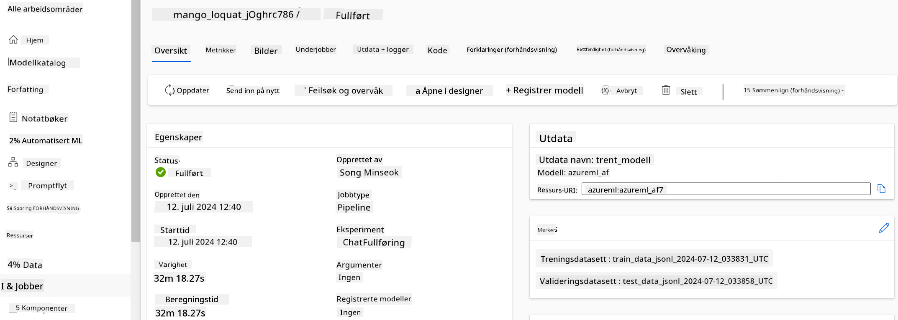

### Distribuer den finjusterte Phi-3-modellen

For å integrere den finjusterte Phi-3-modellen med Prompt flow, må du distribuere modellen slik at den blir tilgjengelig for sanntidsinferenz. Denne prosessen innebærer å registrere modellen, opprette en online endepunkt og distribuere modellen.

I denne øvelsen skal du:

- Registrere den finjusterte modellen i Azure Machine Learning-arbeidsområdet.
- Opprette et online endepunkt.
- Distribuere den registrerte finjusterte Phi-3-modellen.

#### Registrer den finjusterte modellen

1. Besøk [Azure ML Studio](https://ml.azure.com/home?wt.mc_id=studentamb_279723).

1. Velg Azure Machine Learning-arbeidsområdet du opprettet.

    

1. Velg **Models** i venstre sidepanel.
1. Velg **+ Register**.
1. Velg **From a job output**.

    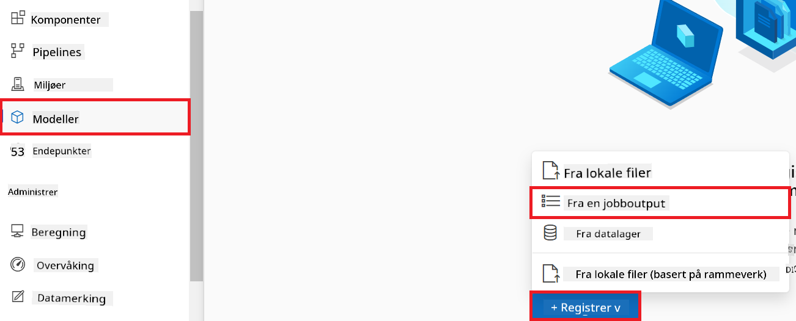

1. Velg jobben du opprettet.

    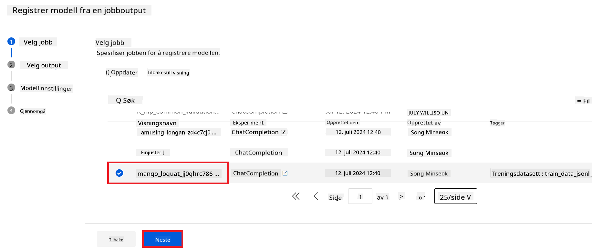

1. Velg **Next**.

1. Velg **Model type** til **MLflow**.

1. Sørg for at **Job output** er valgt; dette skal være valgt automatisk.

    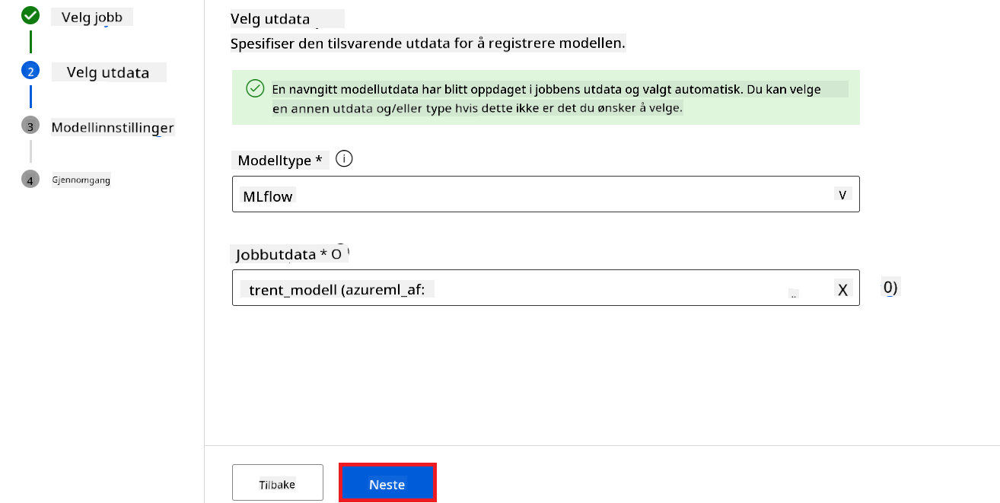

2. Velg **Next**.

3. Velg **Register**.

    

4. Du kan se den registrerte modellen ved å gå til **Models**-menyen i venstre sidepanel.

    

#### Distribuer den finjusterte modellen

1. Gå til Azure Machine Learning-arbeidsområdet du opprettet.

1. Velg **Endpoints** i venstre sidepanel.

1. Velg **Real-time endpoints** i navigasjonsmenyen.

    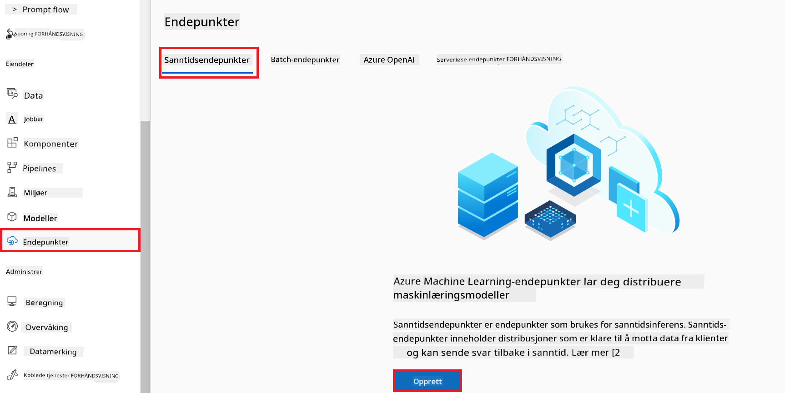

1. Velg **Create**.

1. Velg den registrerte modellen du opprettet.

    

1. Velg **Select**.

1. Gjør følgende:

    - Velg **Virtual machine** til *Standard_NC6s_v3*.
    - Velg antall instanser du ønsker å bruke, for eksempel *1*.
    - Velg **Endpoint** til **New** for å opprette et nytt endepunkt.
    - Skriv inn **Endpoint name**. Det må være unikt.
    - Skriv inn **Deployment name**. Det må være unikt.

    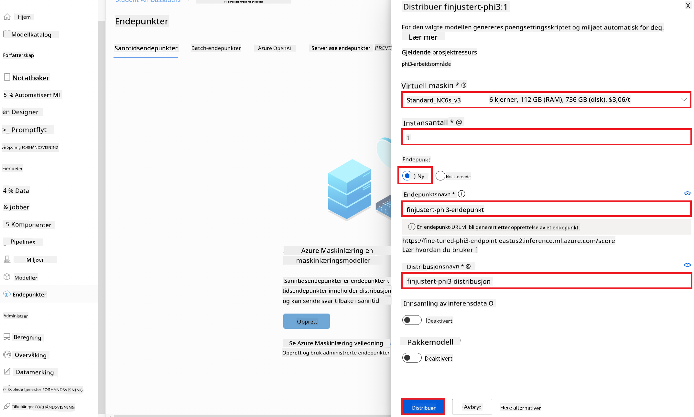

1. Velg **Deploy**.

> [!WARNING]
> For å unngå ekstra kostnader på kontoen din, sørg for å slette det opprettede endepunktet i Azure Machine Learning-arbeidsområdet når du er ferdig.
>

#### Sjekk distribusjonsstatus i Azure Machine Learning Workspace

1. Gå til Azure Machine Learning-arbeidsområdet du opprettet.

1. Velg **Endpoints** i venstre sidepanel.

1. Velg endepunktet du opprettet.

    

1. På denne siden kan du administrere endepunktene under distribusjonsprosessen.

> [!NOTE]
> Når distribusjonen er fullført, sørg for at **Live traffic** er satt til **100 %**. Hvis ikke, velg **Update traffic** for å justere trafikkinnstillingene. Merk at du ikke kan teste modellen hvis trafikken er satt til 0 %.
>
> 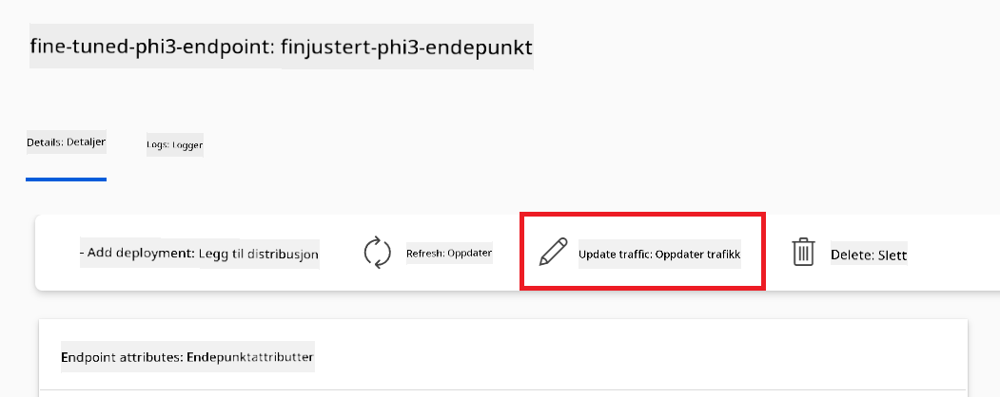
>

## Scenario 3: Integrer med Prompt flow og chat med din tilpassede modell i Azure AI Foundry

### Integrer den tilpassede Phi-3-modellen med Prompt flow

Etter at du har distribuert den finjusterte modellen, kan du nå integrere den med Prompt Flow for å bruke modellen i sanntidsapplikasjoner, noe som muliggjør en rekke interaktive oppgaver med din tilpassede Phi-3-modell.

I denne øvelsen skal du:

- Opprette Azure AI Foundry Hub.
- Opprette Azure AI Foundry-prosjekt.
- Opprette Prompt flow.
- Legge til en tilpasset tilkobling for den finjusterte Phi-3-modellen.
- Sette opp Prompt flow for å chatte med din tilpassede Phi-3-modell.
> [!NOTE]
> Du kan også integrere med Promptflow ved å bruke Azure ML Studio. Den samme integrasjonsprosessen kan brukes i Azure ML Studio.
#### Opprett Azure AI Foundry Hub

Du må opprette en Hub før du oppretter prosjektet. En Hub fungerer som en Ressursgruppe, og lar deg organisere og administrere flere prosjekter innen Azure AI Foundry.

1. Besøk [Azure AI Foundry](https://ai.azure.com/?WT.mc_id=aiml-137032-kinfeylo).

1. Velg **All hubs** fra fanen på venstre side.

1. Velg **+ New hub** fra navigasjonsmenyen.

    

1. Utfør følgende oppgaver:

    - Skriv inn **Hub name**. Det må være en unik verdi.
    - Velg din Azure **Subscription**.
    - Velg **Resource group** som skal brukes (opprett en ny om nødvendig).
    - Velg **Location** du ønsker å bruke.
    - Velg **Connect Azure AI Services** som skal brukes (opprett en ny om nødvendig).
    - Velg **Connect Azure AI Search** til **Skip connecting**.

    

1. Velg **Next**.

#### Opprett Azure AI Foundry-prosjekt

1. I Huben du opprettet, velg **All projects** fra fanen på venstre side.

1. Velg **+ New project** fra navigasjonsmenyen.

    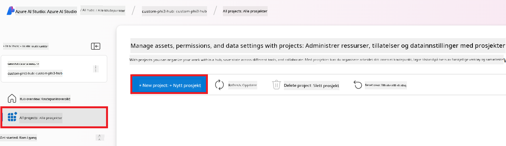

1. Skriv inn **Project name**. Det må være en unik verdi.

    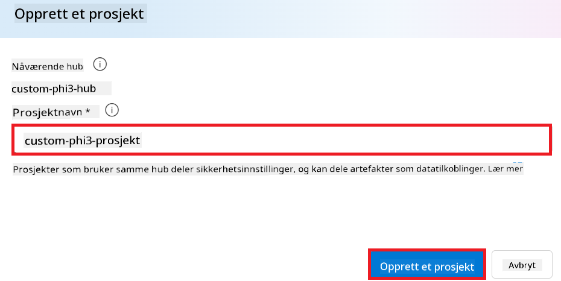

1. Velg **Create a project**.

#### Legg til en egendefinert tilkobling for den finjusterte Phi-3-modellen

For å integrere din egendefinerte Phi-3-modell med Prompt flow, må du lagre modellens endepunkt og nøkkel i en egendefinert tilkobling. Denne oppsettet sikrer tilgang til din egendefinerte Phi-3-modell i Prompt flow.

#### Sett api-nøkkel og endepunkt-URI for den finjusterte Phi-3-modellen

1. Besøk [Azure ML Studio](https://ml.azure.com/home?WT.mc_id=aiml-137032-kinfeylo).

1. Naviger til Azure Machine learning-arbeidsområdet du opprettet.

1. Velg **Endpoints** fra fanen på venstre side.

    

1. Velg endepunktet du opprettet.

    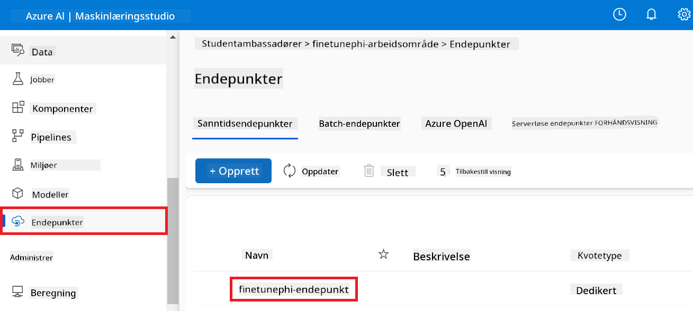

1. Velg **Consume** fra navigasjonsmenyen.

1. Kopier din **REST endpoint** og **Primary key**.

    

#### Legg til den egendefinerte tilkoblingen

1. Besøk [Azure AI Foundry](https://ai.azure.com/?WT.mc_id=aiml-137032-kinfeylo).

1. Naviger til Azure AI Foundry-prosjektet du opprettet.

1. I prosjektet du opprettet, velg **Settings** fra fanen på venstre side.

1. Velg **+ New connection**.

    

1. Velg **Custom keys** fra navigasjonsmenyen.

    

1. Utfør følgende oppgaver:

    - Velg **+ Add key value pairs**.
    - For nøkkelnavnet, skriv **endpoint** og lim inn endepunktet du kopierte fra Azure ML Studio i verdifeltet.
    - Velg **+ Add key value pairs** igjen.
    - For nøkkelnavnet, skriv **key** og lim inn nøkkelen du kopierte fra Azure ML Studio i verdifeltet.
    - Etter å ha lagt til nøklene, velg **is secret** for å hindre at nøkkelen blir eksponert.

    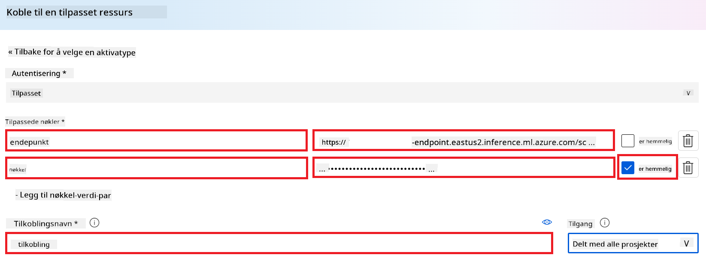

1. Velg **Add connection**.

#### Opprett Prompt flow

Du har lagt til en egendefinert tilkobling i Azure AI Foundry. Nå skal vi opprette en Prompt flow ved å følge stegene nedenfor. Deretter kobler du denne Prompt flow til den egendefinerte tilkoblingen slik at du kan bruke den finjusterte modellen i Prompt flow.

1. Naviger til Azure AI Foundry-prosjektet du opprettet.

1. Velg **Prompt flow** fra fanen på venstre side.

1. Velg **+ Create** fra navigasjonsmenyen.

    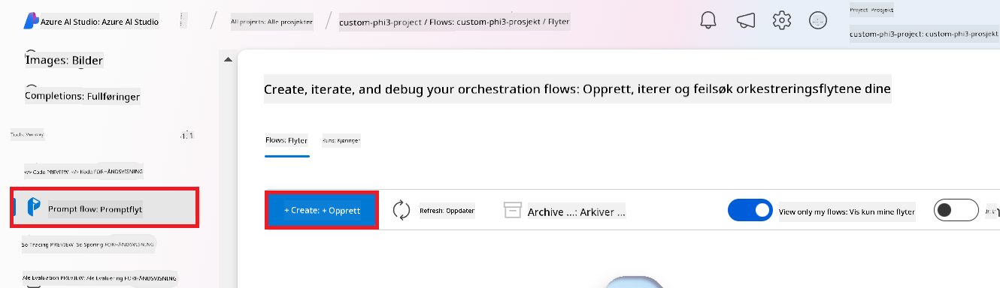

1. Velg **Chat flow** fra navigasjonsmenyen.

    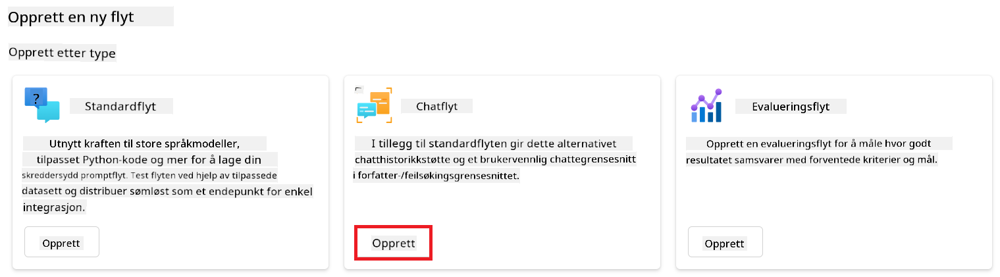

1. Skriv inn **Folder name** som skal brukes.

    

2. Velg **Create**.

#### Sett opp Prompt flow for å chatte med din egendefinerte Phi-3-modell

Du må integrere den finjusterte Phi-3-modellen i en Prompt flow. Den eksisterende Prompt flow som følger med er ikke laget for dette formålet. Derfor må du redesigne Prompt flow for å muliggjøre integrasjon av den egendefinerte modellen.

1. I Prompt flow, utfør følgende for å bygge opp den eksisterende flyten på nytt:

    - Velg **Raw file mode**.
    - Slett all eksisterende kode i *flow.dag.yml*-filen.
    - Legg til følgende kode i *flow.dag.yml*-filen.

        ```yml
        inputs:
          input_data:
            type: string
            default: "Who founded Microsoft?"

        outputs:
          answer:
            type: string
            reference: ${integrate_with_promptflow.output}

        nodes:
        - name: integrate_with_promptflow
          type: python
          source:
            type: code
            path: integrate_with_promptflow.py
          inputs:
            input_data: ${inputs.input_data}
        ```

    - Velg **Save**.

    

1. Legg til følgende kode i *integrate_with_promptflow.py*-filen for å bruke den egendefinerte Phi-3-modellen i Prompt flow.

    ```python
    import logging
    import requests
    from promptflow import tool
    from promptflow.connections import CustomConnection

    # Logging setup
    logging.basicConfig(
        format="%(asctime)s - %(levelname)s - %(name)s - %(message)s",
        datefmt="%Y-%m-%d %H:%M:%S",
        level=logging.DEBUG
    )
    logger = logging.getLogger(__name__)

    def query_phi3_model(input_data: str, connection: CustomConnection) -> str:
        """
        Send a request to the Phi-3 model endpoint with the given input data using Custom Connection.
        """

        # "connection" is the name of the Custom Connection, "endpoint", "key" are the keys in the Custom Connection
        endpoint_url = connection.endpoint
        api_key = connection.key

        headers = {
            "Content-Type": "application/json",
            "Authorization": f"Bearer {api_key}"
        }
        data = {
            "input_data": {
                "input_string": [
                    {"role": "user", "content": input_data}
                ],
                "parameters": {
                    "temperature": 0.7,
                    "max_new_tokens": 128
                }
            }
        }
        try:
            response = requests.post(endpoint_url, json=data, headers=headers)
            response.raise_for_status()
            
            # Log the full JSON response
            logger.debug(f"Full JSON response: {response.json()}")

            result = response.json()["output"]
            logger.info("Successfully received response from Azure ML Endpoint.")
            return result
        except requests.exceptions.RequestException as e:
            logger.error(f"Error querying Azure ML Endpoint: {e}")
            raise

    @tool
    def my_python_tool(input_data: str, connection: CustomConnection) -> str:
        """
        Tool function to process input data and query the Phi-3 model.
        """
        return query_phi3_model(input_data, connection)

    ```

    

> [!NOTE]
> For mer detaljert informasjon om bruk av Prompt flow i Azure AI Foundry, kan du se [Prompt flow in Azure AI Foundry](https://learn.microsoft.com/azure/ai-studio/how-to/prompt-flow).

1. Velg **Chat input**, **Chat output** for å aktivere chat med modellen din.

    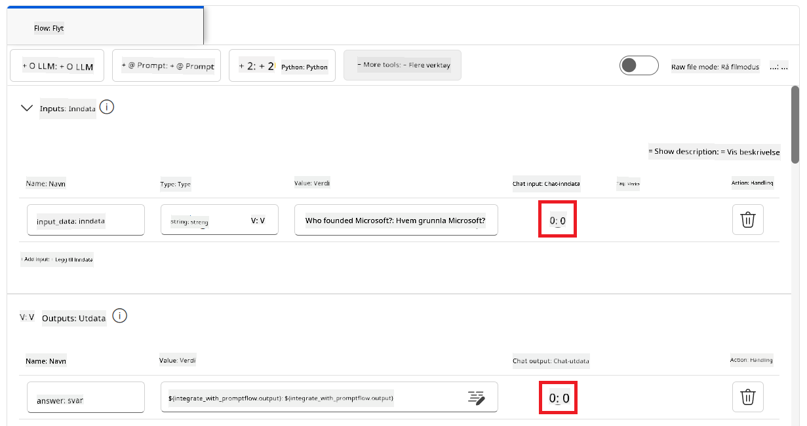

1. Nå er du klar til å chatte med din egendefinerte Phi-3-modell. I neste øvelse vil du lære hvordan du starter Prompt flow og bruker den til å chatte med din finjusterte Phi-3-modell.

> [!NOTE]
>
> Den ombygde flyten skal se ut som bildet under:
>
> 
>

### Chat med din egendefinerte Phi-3-modell

Nå som du har finjustert og integrert din egendefinerte Phi-3-modell med Prompt flow, er du klar til å begynne å samhandle med den. Denne øvelsen vil veilede deg gjennom prosessen med å sette opp og starte en chat med modellen ved hjelp av Prompt flow. Ved å følge disse stegene vil du kunne utnytte mulighetene til din finjusterte Phi-3-modell fullt ut for ulike oppgaver og samtaler.

- Chat med din egendefinerte Phi-3-modell ved hjelp av Prompt flow.

#### Start Prompt flow

1. Velg **Start compute sessions** for å starte Prompt flow.

    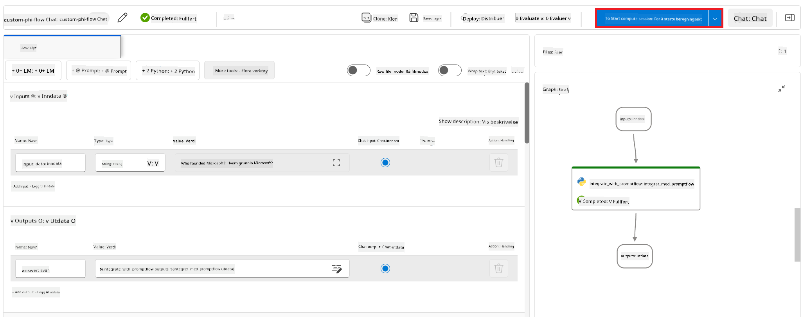

1. Velg **Validate and parse input** for å oppdatere parametere.

    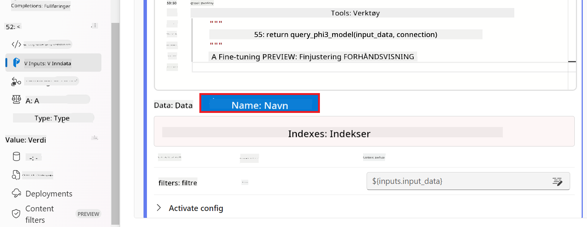

1. Velg **Value** for **connection** til den egendefinerte tilkoblingen du opprettet. For eksempel, *connection*.

    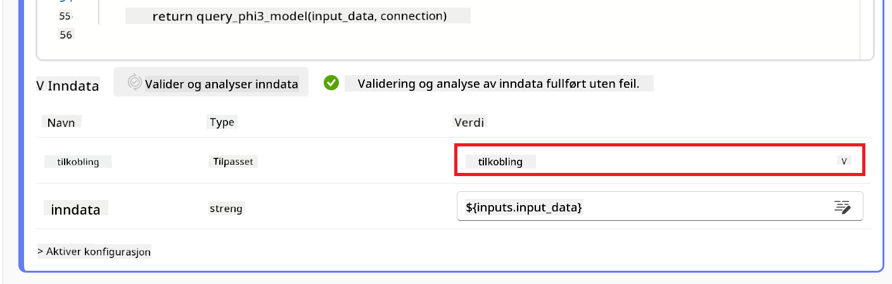

#### Chat med din egendefinerte modell

1. Velg **Chat**.

    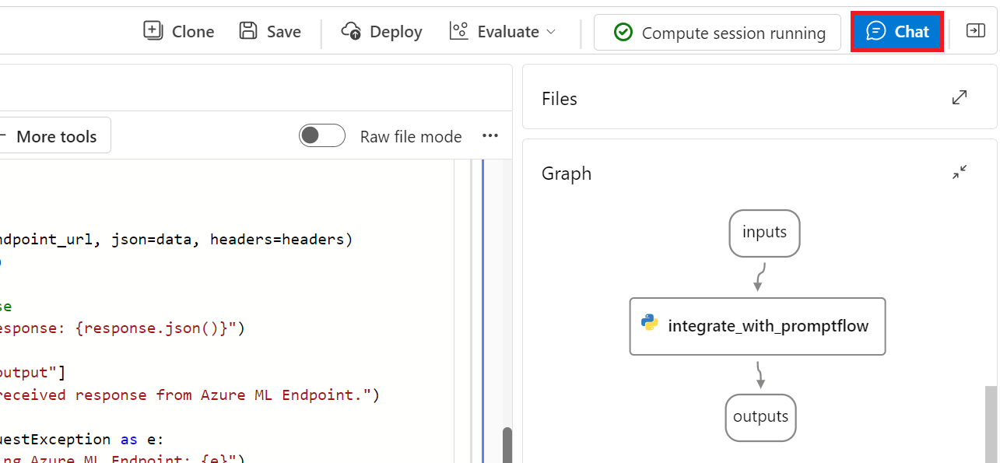

1. Her er et eksempel på resultatene: Nå kan du chatte med din egendefinerte Phi-3-modell. Det anbefales å stille spørsmål basert på dataene som ble brukt til finjusteringen.

    

**Ansvarsfraskrivelse**:  
Dette dokumentet er oversatt ved hjelp av AI-oversettelsestjenesten [Co-op Translator](https://github.com/Azure/co-op-translator). Selv om vi streber etter nøyaktighet, vennligst vær oppmerksom på at automatiske oversettelser kan inneholde feil eller unøyaktigheter. Det opprinnelige dokumentet på originalspråket skal anses som den autoritative kilden. For kritisk informasjon anbefales profesjonell menneskelig oversettelse. Vi er ikke ansvarlige for eventuelle misforståelser eller feiltolkninger som oppstår ved bruk av denne oversettelsen.