# Finjuster og integrer tilpassede Phi-3-modeller med Prompt flow i Azure AI Foundry

Dette ende-til-ende (E2E) eksemplet er basert på veiledningen "[Fine-Tune and Integrate Custom Phi-3 Models with Prompt Flow in Azure AI Foundry](https://techcommunity.microsoft.com/t5/educator-developer-blog/fine-tune-and-integrate-custom-phi-3-models-with-prompt-flow-in/ba-p/4191726?WT.mc_id=aiml-137032-kinfeylo)" fra Microsoft Tech Community. Den introduserer prosessene for finjustering, distribusjon og integrering av tilpassede Phi-3-modeller med Prompt flow i Azure AI Foundry.
I motsetning til E2E-eksemplet, "[Fine-Tune and Integrate Custom Phi-3 Models with Prompt Flow](./E2E_Phi-3-FineTuning_PromptFlow_Integration.md)", som innebar å kjøre kode lokalt, fokuserer denne veiledningen helt og holdent på finjustering og integrering av modellen din innen Azure AI / ML Studio.

## Oversikt

I dette E2E-eksemplet vil du lære hvordan du finjusterer Phi-3-modellen og integrerer den med Prompt flow i Azure AI Foundry. Ved å bruke Azure AI / ML Studio vil du etablere en arbeidsflyt for distribusjon og bruk av tilpassede AI-modeller. Dette E2E-eksemplet er delt inn i tre scenarier:

**Scenario 1: Sett opp Azure-ressurser og forbered for finjustering**

**Scenario 2: Finjuster Phi-3-modellen og distribuer i Azure Machine Learning Studio**

**Scenario 3: Integrer med Prompt flow og chat med din tilpassede modell i Azure AI Foundry**

Her er en oversikt over dette E2E-eksemplet.


### Innholdsfortegnelse

1. **[Scenario 1: Sett opp Azure-ressurser og forbered for finjustering](../../../../../../md/02.Application/01.TextAndChat/Phi3)**
    - [Opprett et Azure Machine Learning-arbeidsområde](../../../../../../md/02.Application/01.TextAndChat/Phi3)
    - [Be om GPU-kvoter i Azure-abonnement](../../../../../../md/02.Application/01.TextAndChat/Phi3)
    - [Legg til rolleoppgave](../../../../../../md/02.Application/01.TextAndChat/Phi3)
    - [Sett opp prosjekt](../../../../../../md/02.Application/01.TextAndChat/Phi3)
    - [Forbered datasett for finjustering](../../../../../../md/02.Application/01.TextAndChat/Phi3)

1. **[Scenario 2: Finjuster Phi-3-modell og distribuer i Azure Machine Learning Studio](../../../../../../md/02.Application/01.TextAndChat/Phi3)**
    - [Finjuster Phi-3-modellen](../../../../../../md/02.Application/01.TextAndChat/Phi3)
    - [Distribuer den finjusterte Phi-3-modellen](../../../../../../md/02.Application/01.TextAndChat/Phi3)

1. **[Scenario 3: Integrer med Prompt flow og chat med din tilpassede modell i Azure AI Foundry](../../../../../../md/02.Application/01.TextAndChat/Phi3)**
    - [Integrer den tilpassede Phi-3-modellen med Prompt flow](../../../../../../md/02.Application/01.TextAndChat/Phi3)
    - [Chat med din tilpassede Phi-3-modell](../../../../../../md/02.Application/01.TextAndChat/Phi3)

## Scenario 1: Sett opp Azure-ressurser og forbered for finjustering

### Opprett et Azure Machine Learning-arbeidsområde

1. Skriv *azure machine learning* i **søkelinjen** øverst på portalens side og velg **Azure Machine Learning** fra alternativene som vises.

    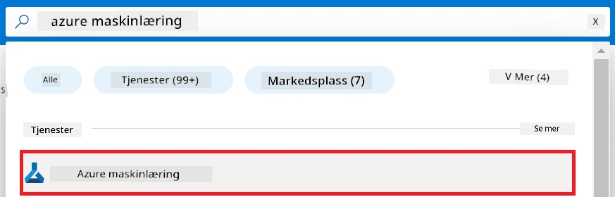

2. Velg **+ Opprett** fra navigasjonsmenyen.

3. Velg **Nytt arbeidsområde** fra navigasjonsmenyen.

    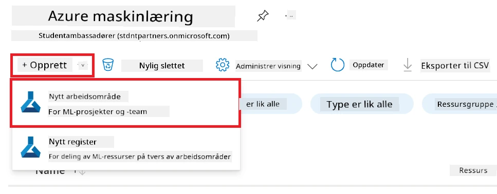

4. Utfør følgende oppgaver:

    - Velg ditt Azure **Abonnement**.
    - Velg **Ressursgruppe** som skal brukes (opprett en ny om nødvendig).
    - Skriv inn **Arbeidsområde-navn**. Det må være en unik verdi.
    - Velg **Region** du ønsker å bruke.
    - Velg **Lagringskonto** som skal brukes (opprett en ny om nødvendig).
    - Velg **Nøkkellager** som skal brukes (opprett et nytt om nødvendig).
    - Velg **Application insights** som skal brukes (opprett en ny om nødvendig).
    - Velg **Container register** som skal brukes (opprett et nytt om nødvendig).

    

5. Velg **Gjennomgå + Opprett**.

6. Velg **Opprett**.

### Be om GPU-kvoter i Azure-abonnement

I denne veiledningen vil du lære hvordan du finjusterer og distribuerer en Phi-3-modell ved bruk av GPUer. Til finjustering vil du bruke *Standard_NC24ads_A100_v4* GPU, som krever en kvotebegjæring. For distribusjon vil du bruke *Standard_NC6s_v3* GPU, som også krever kvotebegjæring.

> [!NOTE]
>
> Kun Pay-As-You-Go-abonnementer (standard abonnementstype) er kvalifisert for GPU-tilordning; abonnementsfordeler støttes ikke for øyeblikket.
>

1. Besøk [Azure ML Studio](https://ml.azure.com/home?wt.mc_id=studentamb_279723).

1. Utfør følgende for å be om *Standard NCADSA100v4 Family* kvote:

    - Velg **Kvoter** fra fanen til venstre.
    - Velg **Virtuelle maskinfamilie** som skal brukes. For eksempel, velg **Standard NCADSA100v4 Family Cluster Dedicated vCPUs**, som inkluderer *Standard_NC24ads_A100_v4* GPU.
    - Velg **Be om kvote** fra navigasjonsmenyen.

        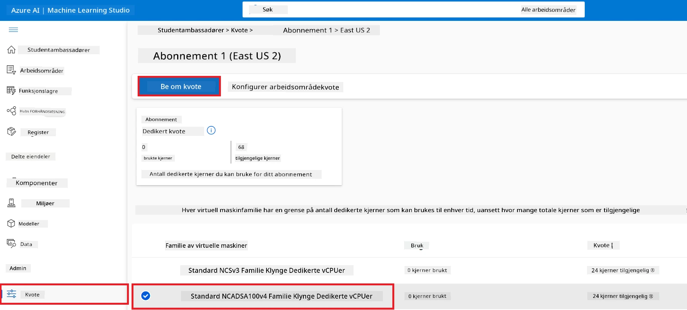

    - På siden Be om kvote, skriv inn den **Nye kjernelimitten** du ønsker å bruke. For eksempel 24.
    - På siden Be om kvote, velg **Send inn** for å be om GPU-kvoten.

1. Utfør følgende for å be om *Standard NCSv3 Family* kvote:

    - Velg **Kvoter** fra fanen til venstre.
    - Velg **Virtuelle maskinfamilie** som skal brukes. For eksempel, velg **Standard NCSv3 Family Cluster Dedicated vCPUs**, som inkluderer *Standard_NC6s_v3* GPU.
    - Velg **Be om kvote** fra navigasjonsmenyen.
    - På siden Be om kvote, skriv inn den **Nye kjernelimitten** du ønsker å bruke. For eksempel 24.
    - På siden Be om kvote, velg **Send inn** for å be om GPU-kvoten.

### Legg til rolleoppgave

For å finjustere og distribuere modellene dine, må du først opprette en Brukertildelt administrert identitet (User Assigned Managed Identity, UAI) og gi den nødvendige tillatelser. Denne UAI vil bli brukt for autentisering under distribusjon.

#### Opprett Brukertildelt administrert identitet (UAI)

1. Skriv *managed identities* i **søkelinjen** øverst på portalens side og velg **Managed Identities** fra alternativene som vises.

    

1. Velg **+ Opprett**.

    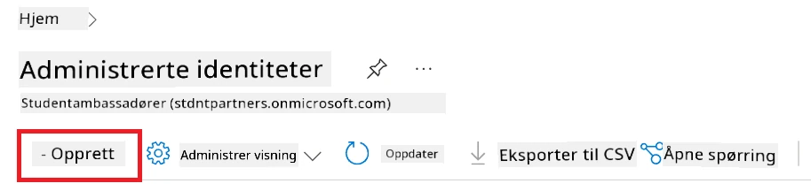

1. Utfør følgende oppgaver:

    - Velg ditt Azure **Abonnement**.
    - Velg **Ressursgruppe** som skal brukes (opprett en ny om nødvendig).
    - Velg **Region** du ønsker å bruke.
    - Skriv inn **Navn**. Det må være en unik verdi.

    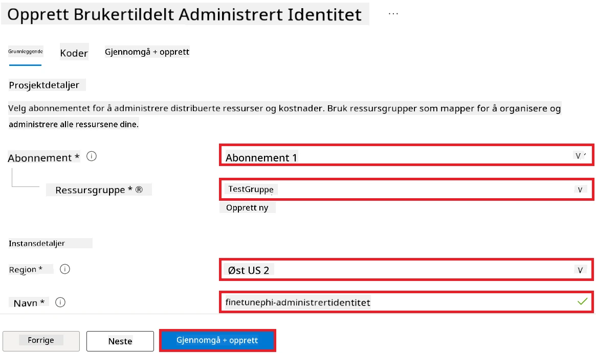

1. Velg **Gjennomgå + opprett**.

1. Velg **+ Opprett**.

#### Legg til Contributor rolleoppgave til administrert identitet

1. Gå til den administrerte identiteten du opprettet.

1. Velg **Azure rolleoppgaver** fra fanen til venstre.

1. Velg **+ Legg til rolleoppgave** fra navigasjonsmenyen.

1. På siden Legg til rolleoppgave, utfør følgende oppgaver:
    - Sett **Omfang** til **Ressursgruppe**.
    - Velg ditt Azure **Abonnement**.
    - Velg **Ressursgruppen** som skal brukes.
    - Sett **Rolle** til **Contributor**.

    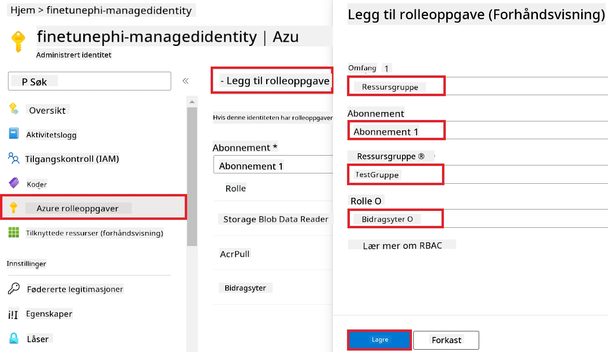

2. Velg **Lagre**.

#### Legg til Storage Blob Data Reader rolleoppgave til administrert identitet

1. Skriv *storage accounts* i **søkelinjen** øverst på portalens side og velg **Storage accounts** fra alternativene som vises.

    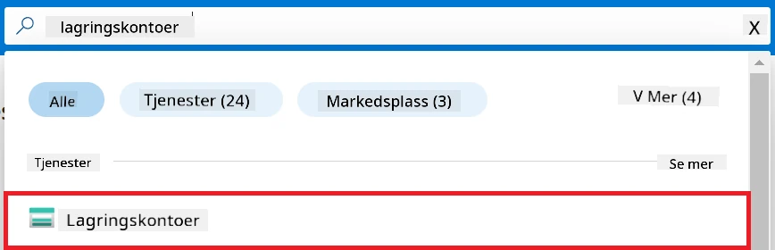

1. Velg lagringskontoen som er tilknyttet Azure Machine Learning-arbeidsområdet du opprettet. For eksempel, *finetunephistorage*.

1. Utfør følgende for å navigere til Legg til rolleoppgave-siden:

    - Naviger til Azure-lagringskontoen du opprettet.
    - Velg **Access Control (IAM)** fra fanen til venstre.
    - Velg **+ Legg til** fra navigasjonsmenyen.
    - Velg **Legg til rolleoppgave** fra navigasjonsmenyen.

    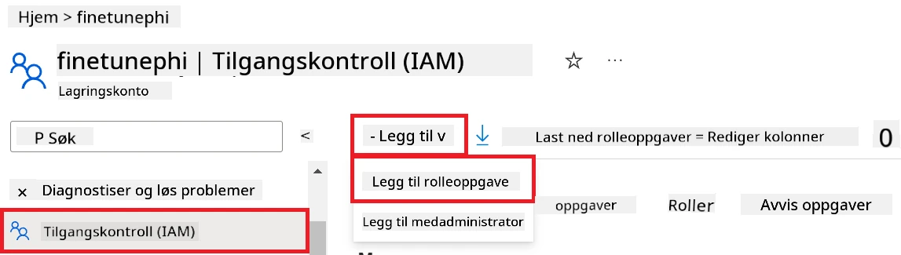

1. På siden Legg til rolleoppgave, utfør følgende oppgaver:

    - På Rolle-siden, skriv *Storage Blob Data Reader* i **søkelinjen** og velg **Storage Blob Data Reader** fra alternativene som vises.
    - På Rolle-siden, velg **Neste**.
    - På Medlemmer-siden, velg **Tilordne tilgang til** **Administrert identitet**.
    - På Medlemmer-siden, velg **+ Velg medlemmer**.
    - På Velg administrerte identiteter-siden, velg ditt Azure **Abonnement**.
    - På Velg administrerte identiteter-siden, velg **Administrert identitet** til **Managed Identity**.
    - På Velg administrerte identiteter-siden, velg Managed Identity du opprettet. For eksempel, *finetunephi-managedidentity*.
    - På Velg administrerte identiteter-siden, velg **Velg**.

    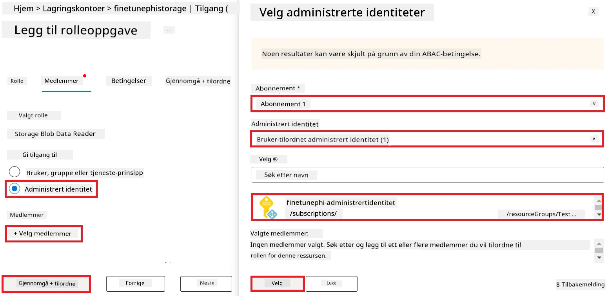

1. Velg **Gjennomgå + tilordne**.

#### Legg til AcrPull rolleoppgave til administrert identitet

1. Skriv *container registries* i **søkelinjen** øverst på portalens side og velg **Container registries** fra alternativene som vises.

    

1. Velg containerregisteret som er tilknyttet Azure Machine Learning-arbeidsområdet. For eksempel, *finetunephicontainerregistry*

1. Utfør følgende for å navigere til Legg til rolleoppgave-siden:

    - Velg **Access Control (IAM)** fra fanen til venstre.
    - Velg **+ Legg til** fra navigasjonsmenyen.
    - Velg **Legg til rolleoppgave** fra navigasjonsmenyen.

1. På siden Legg til rolleoppgave, utfør følgende oppgaver:

    - På Rolle-siden, skriv *AcrPull* i **søkelinjen** og velg **AcrPull** fra alternativene som vises.
    - På Rolle-siden, velg **Neste**.
    - På Medlemmer-siden, velg **Tilordne tilgang til** **Administrert identitet**.
    - På Medlemmer-siden, velg **+ Velg medlemmer**.
    - På Velg administrerte identiteter-siden, velg ditt Azure **Abonnement**.
    - På Velg administrerte identiteter-siden, velg **Administrert identitet** til **Managed Identity**.
    - På Velg administrerte identiteter-siden, velg Managed Identity du opprettet. For eksempel, *finetunephi-managedidentity*.
    - På Velg administrerte identiteter-siden, velg **Velg**.
    - Velg **Gjennomgå + tilordne**.

### Sett opp prosjekt

For å laste ned datasettene som trengs for finjustering, vil du sette opp et lokalt miljø.

I denne øvelsen vil du

- Opprette en mappe å arbeide i.
- Opprette et virtuelt miljø.
- Installere nødvendige pakker.
- Opprette en *download_dataset.py*-fil for å laste ned datasettet.

#### Opprett en mappe å arbeide i

1. Åpne et terminalvindu og skriv følgende kommando for å opprette en mappe kalt *finetune-phi* i standard banen.

    ```console
    mkdir finetune-phi
    ```

2. Skriv inn følgende kommando i terminalen din for å navigere til *finetune-phi*-mappen du opprettet.

    ```console
    cd finetune-phi
    ```

#### Opprett et virtuelt miljø

1. Skriv inn følgende kommando i terminalen din for å opprette et virtuelt miljø med navnet *.venv*.

    ```console
    python -m venv .venv
    ```

2. Skriv inn følgende kommando i terminalen din for å aktivere det virtuelle miljøet.

    ```console
    .venv\Scripts\activate.bat
    ```

> [!NOTE]
> Hvis det fungerte, bør du se *(.venv)* før kommandoprompten.

#### Installer de nødvendige pakkene

1. Skriv inn følgende kommandoer i terminalen din for å installere de nødvendige pakkene.

    ```console
    pip install datasets==2.19.1
    ```

#### Opprett `download_dataset.py`

> [!NOTE]
> Komplett mappestruktur:
>
> ```text
> └── YourUserName
> .    └── finetune-phi
> .        └── download_dataset.py
> ```

1. Åpne **Visual Studio Code**.

1. Velg **Fil** fra menylinjen.

1. Velg **Åpne mappe**.

1. Velg *finetune-phi*-mappen du opprettet, som ligger på *C:\Users\yourUserName\finetune-phi*.

    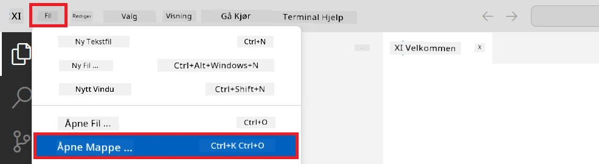

1. I venstre panel i Visual Studio Code, høyreklikk og velg **Ny fil** for å opprette en ny fil med navnet *download_dataset.py*.

    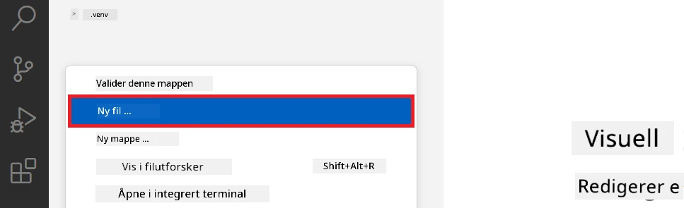

### Forbered datasett for finjustering

I denne øvelsen skal du kjøre *download_dataset.py*-filen for å laste ned *ultrachat_200k*-datasettene til ditt lokale miljø. Du skal deretter bruke disse datasettene for å finjustere Phi-3 modellen i Azure Machine Learning.

I denne øvelsen skal du:

- Legge til kode i *download_dataset.py*-filen for å laste ned datasettene.
- Kjøre *download_dataset.py*-filen for å laste ned datasettene til ditt lokale miljø.

#### Last ned datasettet ditt ved hjelp av *download_dataset.py*

1. Åpne *download_dataset.py*-filen i Visual Studio Code.

1. Legg til følgende kode i *download_dataset.py*-filen.

    ```python
    import json
    import os
    from datasets import load_dataset

    def load_and_split_dataset(dataset_name, config_name, split_ratio):
        """
        Load and split a dataset.
        """
        # Last inn datasettet med det angitte navnet, konfigurasjonen og delingsforholdet
        dataset = load_dataset(dataset_name, config_name, split=split_ratio)
        print(f"Original dataset size: {len(dataset)}")
        
        # Del datasettet inn i trenings- og testsett (80% trening, 20% test)
        split_dataset = dataset.train_test_split(test_size=0.2)
        print(f"Train dataset size: {len(split_dataset['train'])}")
        print(f"Test dataset size: {len(split_dataset['test'])}")
        
        return split_dataset

    def save_dataset_to_jsonl(dataset, filepath):
        """
        Save a dataset to a JSONL file.
        """
        # Opprett katalogen hvis den ikke eksisterer
        os.makedirs(os.path.dirname(filepath), exist_ok=True)
        
        # Åpne filen i skrivemodus
        with open(filepath, 'w', encoding='utf-8') as f:
            # Iterer over hver post i datasettet
            for record in dataset:
                # Skriv ut posten som et JSON-objekt og skriv det til filen
                json.dump(record, f)
                # Skriv en ny linje for å skille postene
                f.write('\n')
        
        print(f"Dataset saved to {filepath}")

    def main():
        """
        Main function to load, split, and save the dataset.
        """
        # Last inn og del ULTRACHAT_200k-datasettet med en spesifikk konfigurasjon og delingsforhold
        dataset = load_and_split_dataset("HuggingFaceH4/ultrachat_200k", 'default', 'train_sft[:1%]')
        
        # Ekstraher trenings- og testdatasett fra delingen
        train_dataset = dataset['train']
        test_dataset = dataset['test']

        # Lagre treningsdatasettet til en JSONL-fil
        save_dataset_to_jsonl(train_dataset, "data/train_data.jsonl")
        
        # Lagre testdatasettet til en separat JSONL-fil
        save_dataset_to_jsonl(test_dataset, "data/test_data.jsonl")

    if __name__ == "__main__":
        main()

    ```

1. Skriv inn følgende kommando i terminalen din for å kjøre scriptet og laste ned datasettet til ditt lokale miljø.

    ```console
    python download_dataset.py
    ```

1. Bekreft at datasettene ble lagret vellykket i din lokale *finetune-phi/data* katalog.

> [!NOTE]
>
> #### Merknad om datasettstørrelse og finjusteringstid
>
> I denne veiledningen bruker du kun 1% av datasettet (`split='train[:1%]'`). Dette reduserer betraktelig mengden data, og sparer tid både ved opplasting og finjustering. Du kan justere prosentandelen for å finne riktig balanse mellom treningstid og modellens ytelse. Å bruke en mindre delmengde av datasettet reduserer tiden som kreves for finjustering, og gjør prosessen mer håndterbar i en veiledning.

## Scenario 2: Finjuster Phi-3-modellen og distribuer i Azure Machine Learning Studio

### Finjuster Phi-3-modellen

I denne øvelsen skal du finjustere Phi-3-modellen i Azure Machine Learning Studio.

I denne øvelsen skal du:

- Opprette et datakluster for finjustering.
- Finjustere Phi-3-modellen i Azure Machine Learning Studio.

#### Opprett datakluster for finjustering

1. Besøk [Azure ML Studio](https://ml.azure.com/home?wt.mc_id=studentamb_279723).

1. Velg **Compute** fra menyfanen til venstre.

1. Velg **Compute clusters** fra navigasjonsmenyen.

1. Velg **+ New**.

    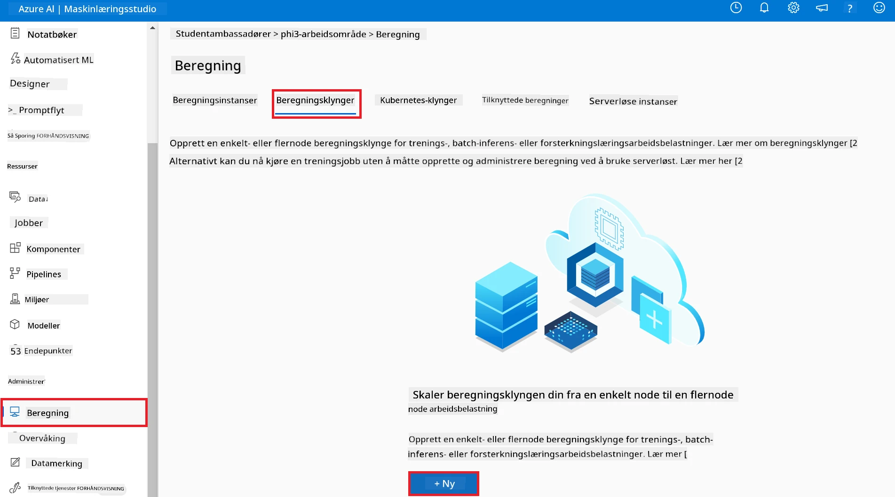

1. Utfør følgende oppgaver:

    - Velg **Region** du ønsker å bruke.
    - Velg **Virtual machine tier** til **Dedicated**.
    - Velg **Virtual machine type** til **GPU**.
    - Velg **Virtual machine size** filter til **Select from all options**.
    - Velg **Virtual machine size** til **Standard_NC24ads_A100_v4**.

    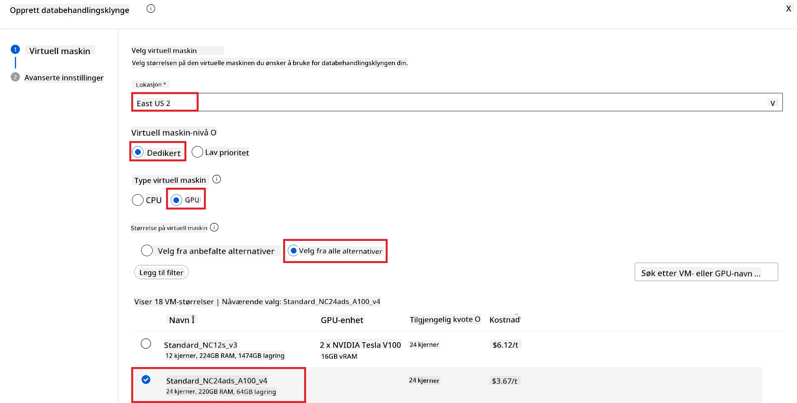

1. Velg **Neste**.

1. Utfør følgende oppgaver:

    - Skriv inn **Compute name**. Det må være en unik verdi.
    - Sett **Minimum number of nodes** til **0**.
    - Sett **Maximum number of nodes** til **1**.
    - Sett **Idle seconds before scale down** til **120**.

    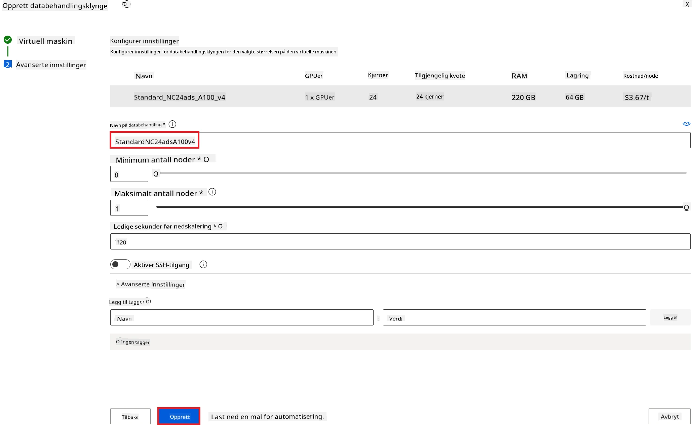

1. Velg **Opprett**.

#### Finjuster Phi-3-modellen

1. Besøk [Azure ML Studio](https://ml.azure.com/home?wt.mc_id=studentamb_279723).

1. Velg Azure Machine Learning arbeidsområdet du opprettet.

    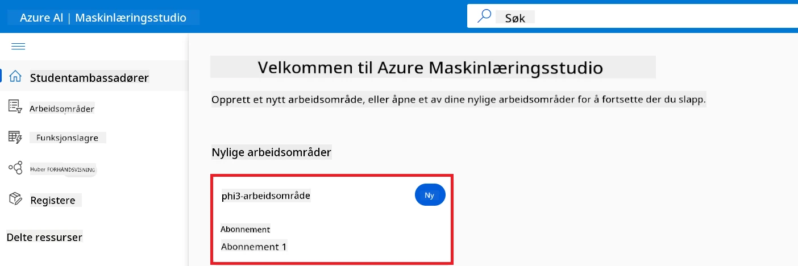

1. Utfør følgende oppgaver:

    - Velg **Model catalog** fra menyfanen til venstre.
    - Skriv *phi-3-mini-4k* i **søkelinjen** og velg **Phi-3-mini-4k-instruct** fra alternativene som dukker opp.

    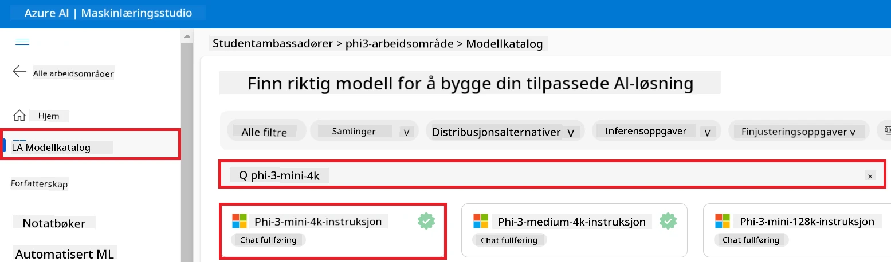

1. Velg **Fine-tune** fra navigasjonsmenyen.

    

1. Utfør følgende oppgaver:

    - Velg **Select task type** til **Chat completion**.
    - Velg **+ Select data** for å laste opp **Treningsdata**.
    - Velg valideringstype for dataopplasting til **Provide different validation data**.
    - Velg **+ Select data** for å laste opp **Valideringsdata**.

    

> [!TIP]
>
> Du kan velge **Advanced settings** for å tilpasse konfigurasjoner som **learning_rate** og **lr_scheduler_type** for å optimalisere finjusteringsprosessen etter dine behov.

1. Velg **Fullfør**.

1. I denne øvelsen har du finjustert Phi-3-modellen i Azure Machine Learning. Vær oppmerksom på at finjusteringsprosessen kan ta en god del tid. Etter at du har startet finjusteringsjobben, må du vente på at den fullføres. Du kan overvåke statusen til finjusteringsjobben ved å navigere til Jobs-fanen på venstre side i Azure Machine Learning-arbeidsområdet ditt. I neste del skal vi distribuere den finjusterte modellen og integrere den med Prompt flow.

    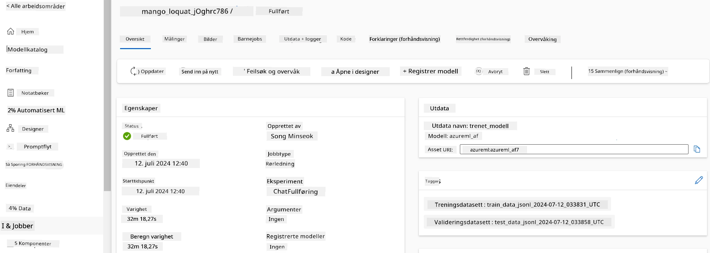

### Distribuer den finjusterte Phi-3-modellen

For å integrere den finjusterte Phi-3-modellen med Prompt flow, må du distribuere modellen slik at den er tilgjengelig for sanntidsinferens. Denne prosessen innebærer å registrere modellen, opprette en online endepunkt og distribuere modellen.

I denne øvelsen skal du:

- Registrere den finjusterte modellen i Azure Machine Learning-arbeidsområdet.
- Opprette en online endepunkt.
- Distribuere den registrerte finjusterte Phi-3-modellen.

#### Registrer den finjusterte modellen

1. Besøk [Azure ML Studio](https://ml.azure.com/home?wt.mc_id=studentamb_279723).

1. Velg Azure Machine Learning arbeidsområdet du opprettet.

    

1. Velg **Models** fra menyfanen til venstre.
1. Velg **+ Register**.
1. Velg **From a job output**.

    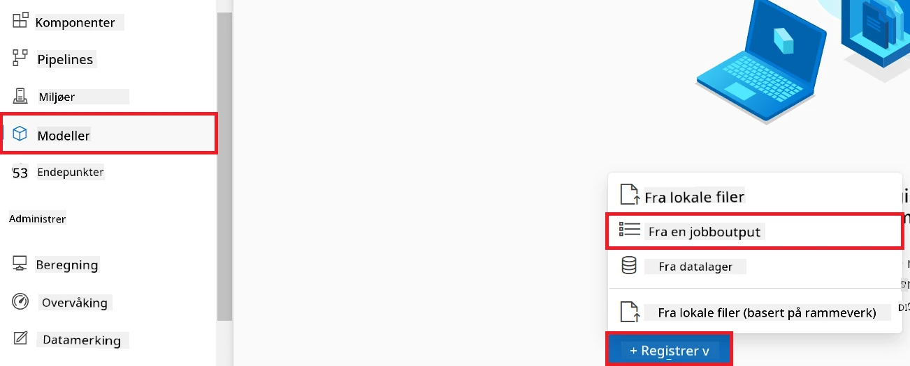

1. Velg jobben du opprettet.

    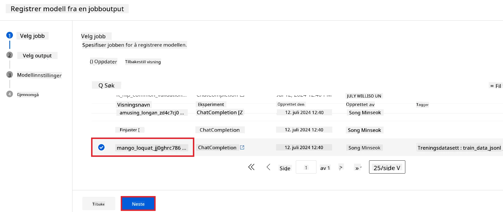

1. Velg **Neste**.

1. Velg **Model type** til **MLflow**.

1. Sørg for at **Job output** er valgt; det skal velges automatisk.

    

2. Velg **Neste**.

3. Velg **Register**.

    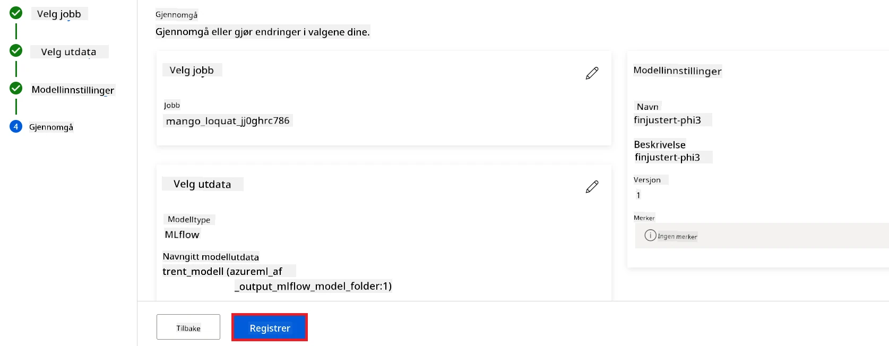

4. Du kan se den registrerte modellen din ved å navigere til **Models**-menyen til venstre.

    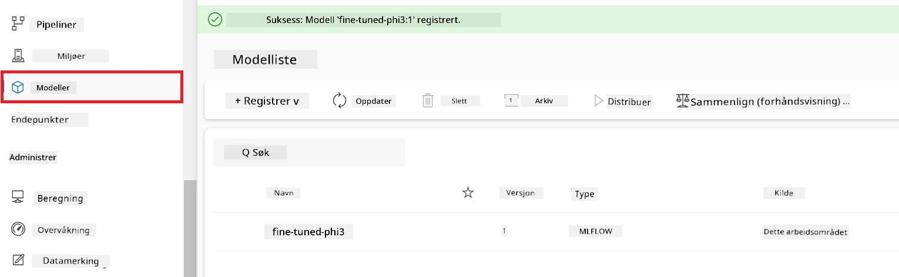

#### Distribuer den finjusterte modellen

1. Naviger til Azure Machine Learning arbeidsområdet du opprettet.

1. Velg **Endpoints** fra menyfanen til venstre.

1. Velg **Real-time endpoints** fra navigasjonsmenyen.

    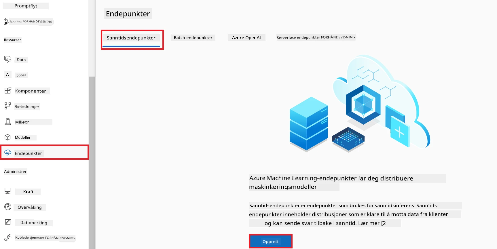

1. Velg **Opprett**.

1. Velg den registrerte modellen du opprettet.

    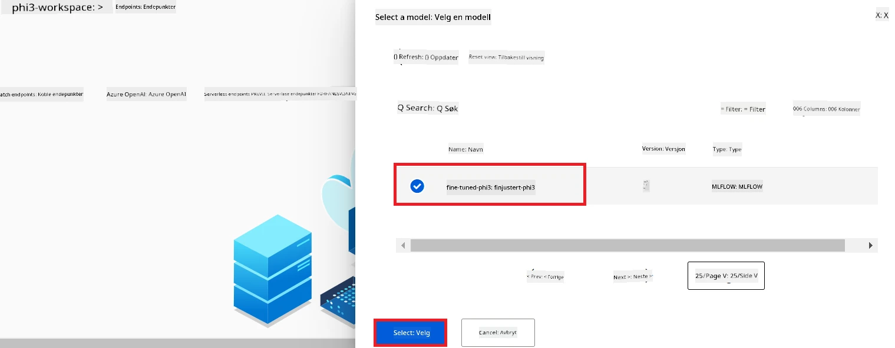

1. Velg **Velg**.

1. Utfør følgende oppgaver:

    - Velg **Virtual machine** til *Standard_NC6s_v3*.
    - Velg antall forekomster (Instance count) du ønsker å bruke. For eksempel, *1*.
    - Velg **Endpoint** til **Ny** for å opprette et endepunkt.
    - Skriv inn **Endpoint name**. Det må være en unik verdi.
    - Skriv inn **Deployment name**. Det må være en unik verdi.

    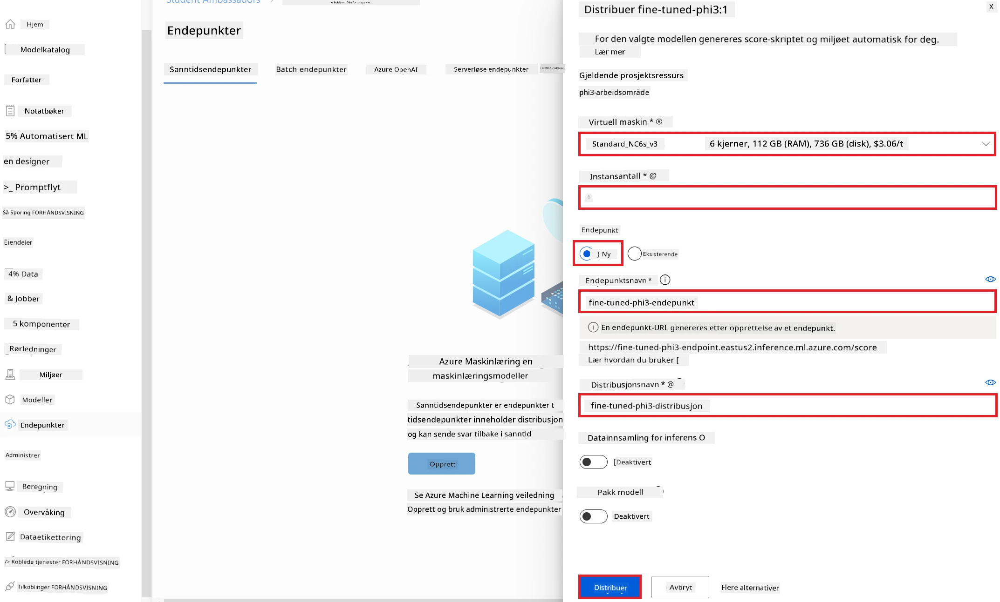

1. Velg **Distribuer**.

> [!WARNING]
> For å unngå ekstra kostnader på kontoen din, sørg for å slette det opprettede endepunktet i Azure Machine Learning-arbeidsområdet.
>

#### Sjekk distribusjonsstatus i Azure Machine Learning Workspace

1. Naviger til Azure Machine Learning arbeidsområdet du opprettet.

1. Velg **Endpoints** fra menyfanen til venstre.

1. Velg endepunktet du opprettet.

    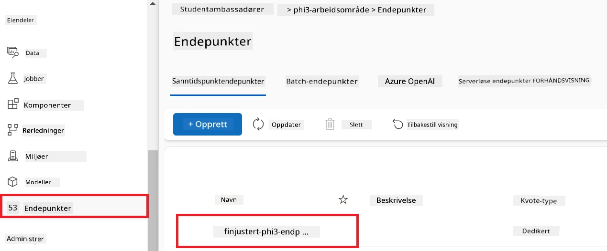

1. På denne siden kan du administrere endepunktene under distribusjonsprosessen.

> [!NOTE]
> Når distribusjonen er fullført, sørg for at **Live traffic** er satt til **100%**. Hvis det ikke er det, velg **Update traffic** for å justere trafikkinnstillingene. Merk at du ikke kan teste modellen hvis trafikken er satt til 0%.
>
> 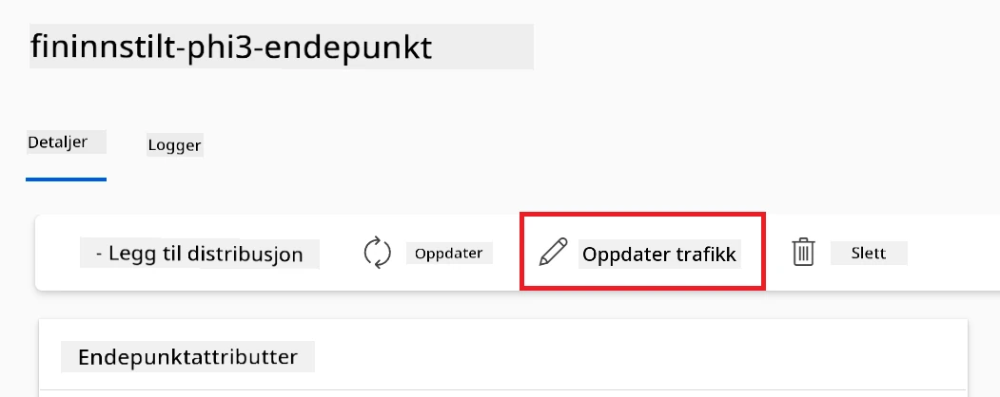
>

## Scenario 3: Integrer med Prompt flow og chat med din egendefinerte modell i Azure AI Foundry

### Integrer den egendefinerte Phi-3-modellen med Prompt flow

Etter å ha distribuert din finjusterte modell, kan du nå integrere den med Prompt Flow for å bruke modellen i sanntidsapplikasjoner, noe som muliggjør en rekke interaktive oppgaver med din egendefinerte Phi-3-modell.

I denne øvelsen skal du:

- Opprette Azure AI Foundry Hub.
- Opprette Azure AI Foundry Prosjekt.
- Opprette Prompt Flow.
- Legge til en egendefinert kobling for den finjusterte Phi-3-modellen.
- Sette opp Prompt Flow for å chatte med din egendefinerte Phi-3-modell.

> [!NOTE]
> Du kan også integrere med Promptflow ved hjelp av Azure ML Studio. Samme integrasjonsprosedyre kan brukes i Azure ML Studio.

#### Opprett Azure AI Foundry Hub

Du må opprette en Hub før du oppretter prosjektet. En Hub fungerer som en Resource Group som lar deg organisere og administrere flere prosjekter innen Azure AI Foundry.

1. Besøk [Azure AI Foundry](https://ai.azure.com/?WT.mc_id=aiml-137032-kinfeylo).

1. Velg **All hubs** fra menyfanen til venstre.

1. Velg **+ Ny hub** fra navigasjonsmenyen.
    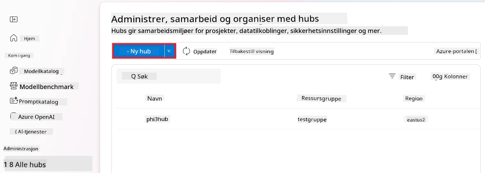

1. Utfør følgende oppgaver:

    - Skriv inn **Hub-navn**. Det må være en unik verdi.
    - Velg ditt Azure **abonnement**.
    - Velg **Ressursgruppe** som skal brukes (opprett en ny om nødvendig).
    - Velg **Lokasjon** du ønsker å bruke.
    - Velg **Koble til Azure AI-tjenester** som skal brukes (opprett en ny om nødvendig).
    - Velg **Koble til Azure AI Search** for å **Hoppe over tilkobling**.

    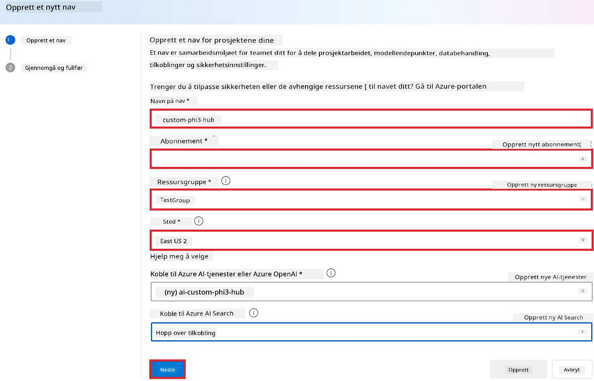

1. Velg **Neste**.

#### Opprett Azure AI Foundry-prosjekt

1. I huben du opprettet, velg **Alle prosjekter** fra venstremenyen.

1. Velg **+ Nytt prosjekt** fra navigasjonsmenyen.

    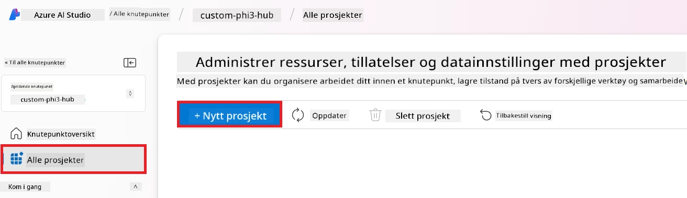

1. Skriv inn **Prosjektnavn**. Det må være en unik verdi.

    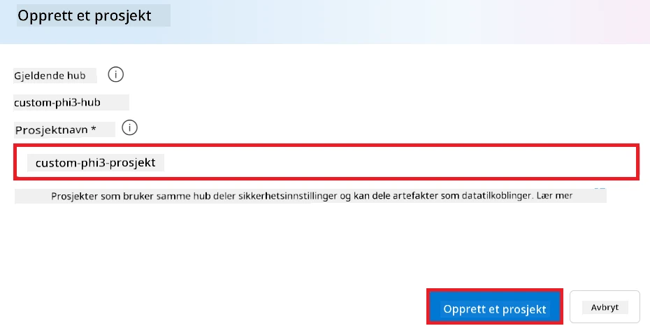

1. Velg **Opprett et prosjekt**.

#### Legg til en egendefinert tilkobling for den finjusterte Phi-3-modellen

For å integrere din egendefinerte Phi-3-modell med Prompt flow, må du lagre modellens endepunkt og nøkkel i en egendefinert tilkobling. Denne oppsettet sikrer tilgang til din egendefinerte Phi-3-modell i Prompt flow.

#### Sett API-nøkkel og endepunkt-URI for den finjusterte Phi-3-modellen

1. Besøk [Azure ML Studio](https://ml.azure.com/home?WT.mc_id=aiml-137032-kinfeylo).

1. Naviger til Azure Machine learning-arbeidsområdet du opprettet.

1. Velg **Endepunkter** fra venstremenyen.

    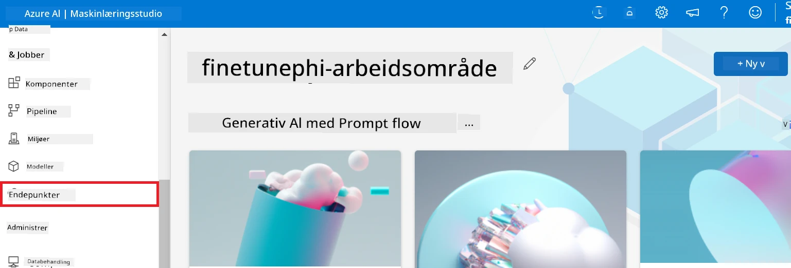

1. Velg endepunktet du opprettet.

    

1. Velg **Forbruk** fra navigasjonsmenyen.

1. Kopier din **REST-endepunkt** og **Primærnøkkel**.

    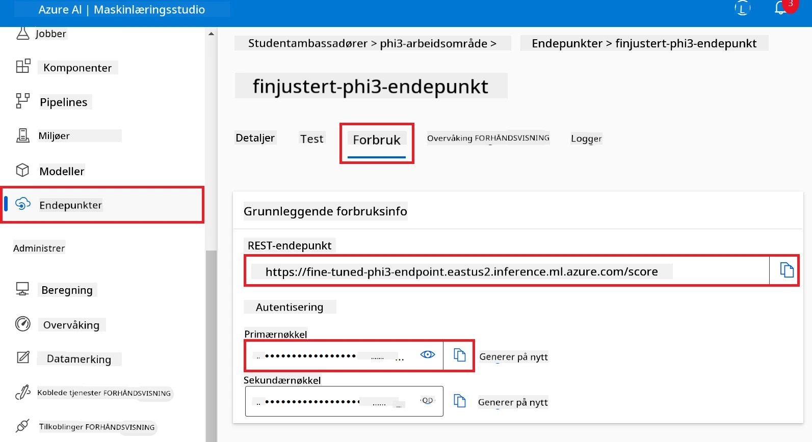

#### Legg til den egendefinerte tilkoblingen

1. Besøk [Azure AI Foundry](https://ai.azure.com/?WT.mc_id=aiml-137032-kinfeylo).

1. Naviger til Azure AI Foundry-prosjektet du opprettet.

1. I prosjektet du opprettet, velg **Innstillinger** fra venstremenyen.

1. Velg **+ Ny tilkobling**.

    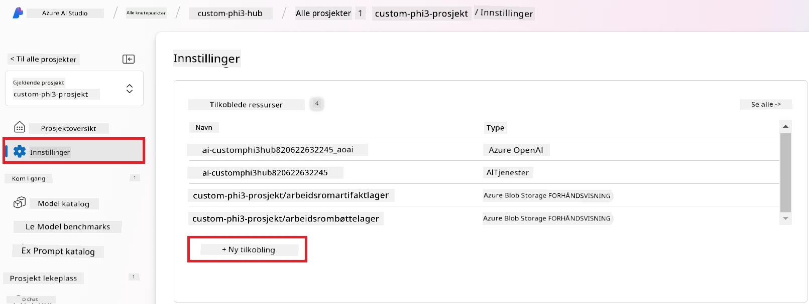

1. Velg **Egendefinerte nøkler** fra navigasjonsmenyen.

    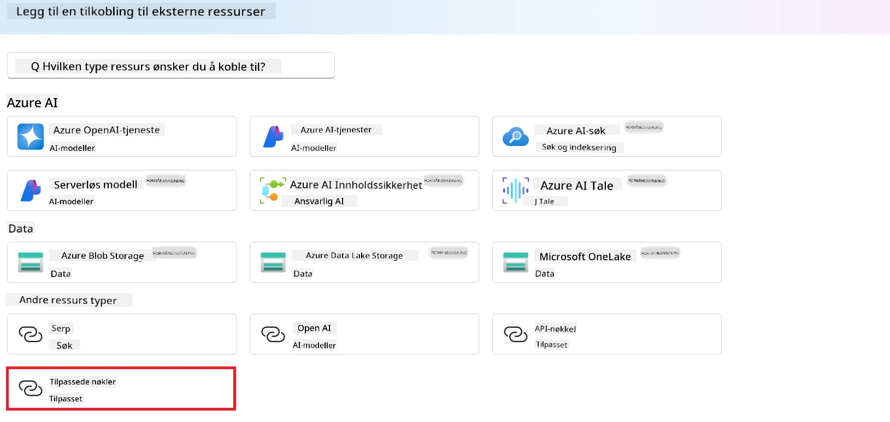

1. Utfør følgende oppgaver:

    - Velg **+ Legg til nøkkel-verdi-par**.
    - For nøkkelnavnet, skriv **endpoint** og lim inn endepunktet du kopierte fra Azure ML Studio i verdifeltet.
    - Velg **+ Legg til nøkkel-verdi-par** igjen.
    - For nøkkelnavnet, skriv **key** og lim inn nøkkelen du kopierte fra Azure ML Studio i verdifeltet.
    - Etter å ha lagt til nøklene, velg **er hemmelig** for å forhindre at nøkkelen eksponeres.

    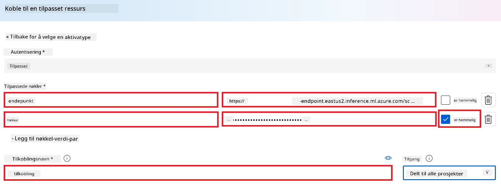

1. Velg **Legg til tilkobling**.

#### Opprett Prompt flow

Du har lagt til en egendefinert tilkobling i Azure AI Foundry. Nå la oss opprette en Prompt flow ved å følge disse trinnene. Deretter vil du koble denne Prompt flow til den egendefinerte tilkoblingen slik at du kan bruke den finjusterte modellen i Prompt flow.

1. Naviger til Azure AI Foundry-prosjektet du opprettet.

1. Velg **Prompt flow** fra venstremenyen.

1. Velg **+ Opprett** fra navigasjonsmenyen.

    

1. Velg **Chat flow** fra navigasjonsmenyen.

    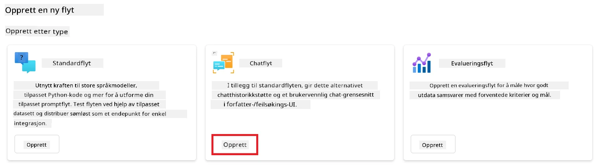

1. Skriv inn **Mappenavn** som skal brukes.

    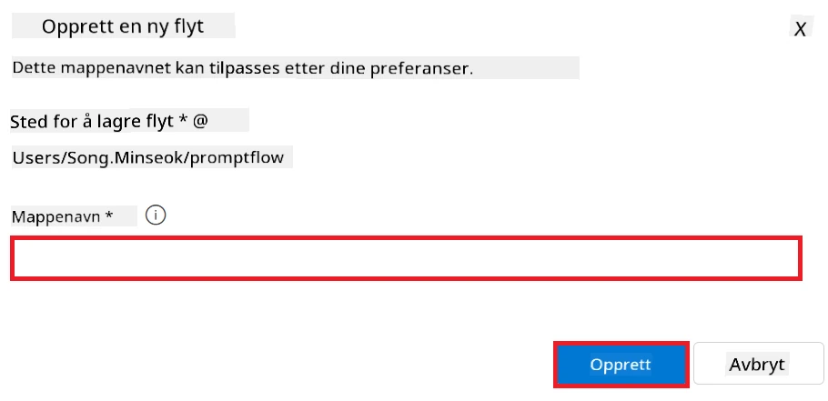

2. Velg **Opprett**.

#### Sett opp Prompt flow for å chatte med din egendefinerte Phi-3-modell

Du må integrere den finjusterte Phi-3-modellen i en Prompt flow. Men den eksisterende Prompt flow som tilbys, er ikke designet for dette formålet. Derfor må du redesigne Prompt flow for å muliggjøre integrasjon av den egendefinerte modellen.

1. I Prompt flow, utfør følgende oppgaver for å bygge opp den eksisterende flyten på nytt:

    - Velg **Rå filmodus**.
    - Slett all eksisterende kode i *flow.dag.yml*-filen.
    - Legg til følgende kode i *flow.dag.yml*-filen.

        ```yml
        inputs:
          input_data:
            type: string
            default: "Who founded Microsoft?"

        outputs:
          answer:
            type: string
            reference: ${integrate_with_promptflow.output}

        nodes:
        - name: integrate_with_promptflow
          type: python
          source:
            type: code
            path: integrate_with_promptflow.py
          inputs:
            input_data: ${inputs.input_data}
        ```

    - Velg **Lagre**.

    

1. Legg til følgende kode i *integrate_with_promptflow.py*-filen for å bruke den egendefinerte Phi-3-modellen i Prompt flow.

    ```python
    import logging
    import requests
    from promptflow import tool
    from promptflow.connections import CustomConnection

    # Loggoppsett
    logging.basicConfig(
        format="%(asctime)s - %(levelname)s - %(name)s - %(message)s",
        datefmt="%Y-%m-%d %H:%M:%S",
        level=logging.DEBUG
    )
    logger = logging.getLogger(__name__)

    def query_phi3_model(input_data: str, connection: CustomConnection) -> str:
        """
        Send a request to the Phi-3 model endpoint with the given input data using Custom Connection.
        """

        # "connection" er navnet på den egendefinerte tilkoblingen, "endpoint", "key" er nøklene i den egendefinerte tilkoblingen
        endpoint_url = connection.endpoint
        api_key = connection.key

        headers = {
            "Content-Type": "application/json",
            "Authorization": f"Bearer {api_key}"
        }
        data = {
            "input_data": {
                "input_string": [
                    {"role": "user", "content": input_data}
                ],
                "parameters": {
                    "temperature": 0.7,
                    "max_new_tokens": 128
                }
            }
        }
        try:
            response = requests.post(endpoint_url, json=data, headers=headers)
            response.raise_for_status()
            
            # Logg hele JSON-responsen
            logger.debug(f"Full JSON response: {response.json()}")

            result = response.json()["output"]
            logger.info("Successfully received response from Azure ML Endpoint.")
            return result
        except requests.exceptions.RequestException as e:
            logger.error(f"Error querying Azure ML Endpoint: {e}")
            raise

    @tool
    def my_python_tool(input_data: str, connection: CustomConnection) -> str:
        """
        Tool function to process input data and query the Phi-3 model.
        """
        return query_phi3_model(input_data, connection)

    ```

    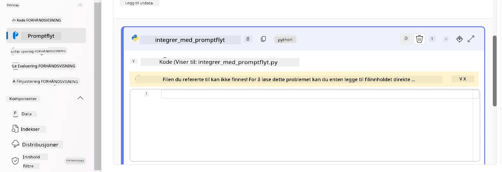

> [!NOTE]
> For mer detaljert informasjon om bruk av Prompt flow i Azure AI Foundry, kan du se [Prompt flow i Azure AI Foundry](https://learn.microsoft.com/azure/ai-studio/how-to/prompt-flow).

1. Velg **Chat input**, **Chat output** for å aktivere chatting med modellen din.

    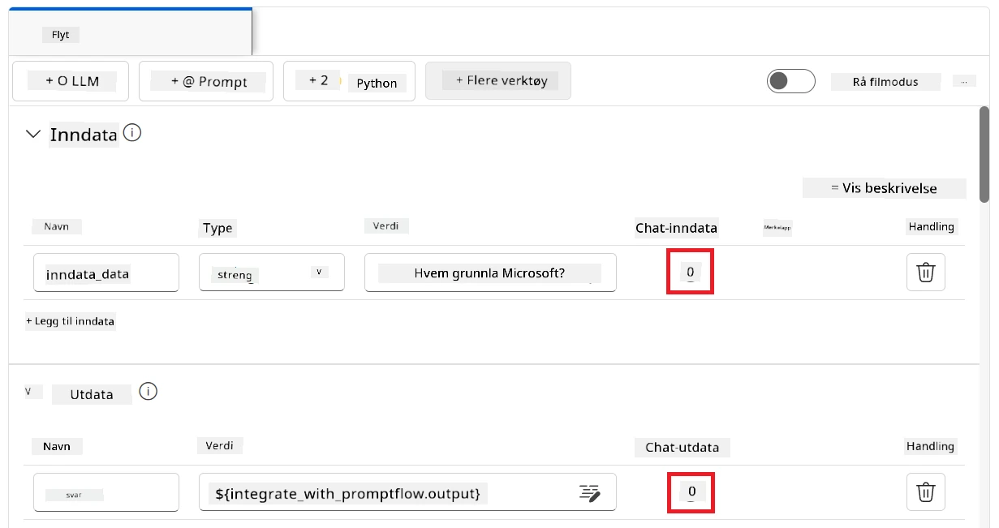

1. Nå er du klar til å chatte med din egendefinerte Phi-3-modell. I den neste øvelsen vil du lære hvordan du starter Prompt flow og bruker den til å chatte med din finjusterte Phi-3-modell.

> [!NOTE]
>
> Den ombygde flyten skal se ut som bildet nedenfor:
>
> 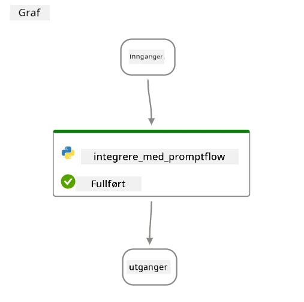
>

### Chat med din egendefinerte Phi-3-modell

Nå som du har finjustert og integrert din egendefinerte Phi-3-modell med Prompt flow, er du klar til å begynne å samhandle med den. Denne øvelsen vil veilede deg gjennom prosessen med å sette opp og starte en chat med modellen din ved hjelp av Prompt flow. Ved å følge disse trinnene vil du kunne utnytte kapabilitetene til din finjusterte Phi-3-modell fullt ut for ulike oppgaver og samtaler.

- Chat med din egendefinerte Phi-3-modell ved hjelp av Prompt flow.

#### Start Prompt flow

1. Velg **Start Compute Sessions** for å starte Prompt flow.

    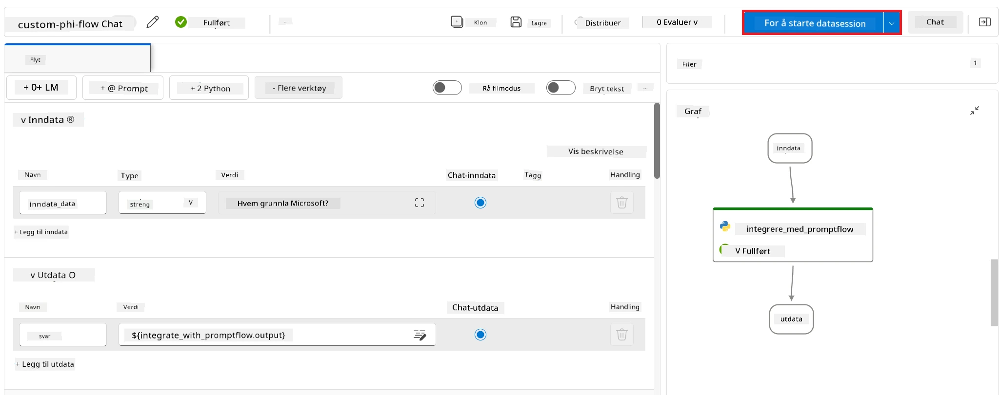

1. Velg **Valider og analyser input** for å fornye parametere.

    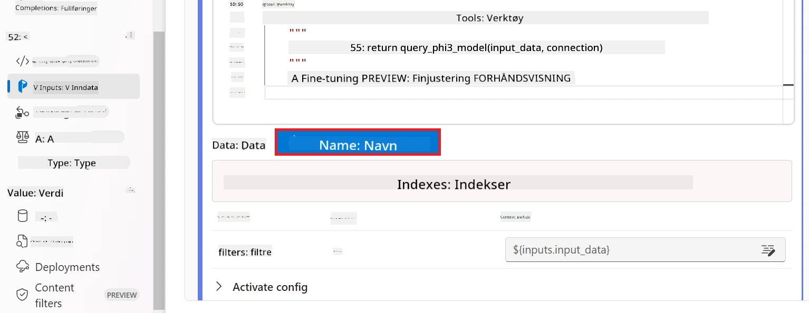

1. Velg **Verdien** for **tilkoblingen** til den egendefinerte tilkoblingen du opprettet. For eksempel *connection*.

    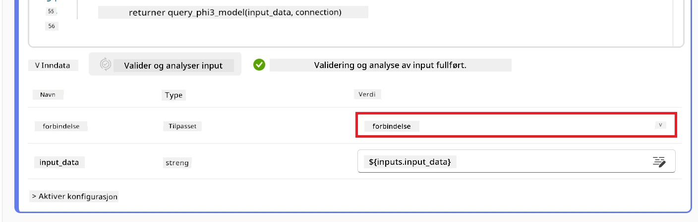

#### Chat med din egendefinerte modell

1. Velg **Chat**.

    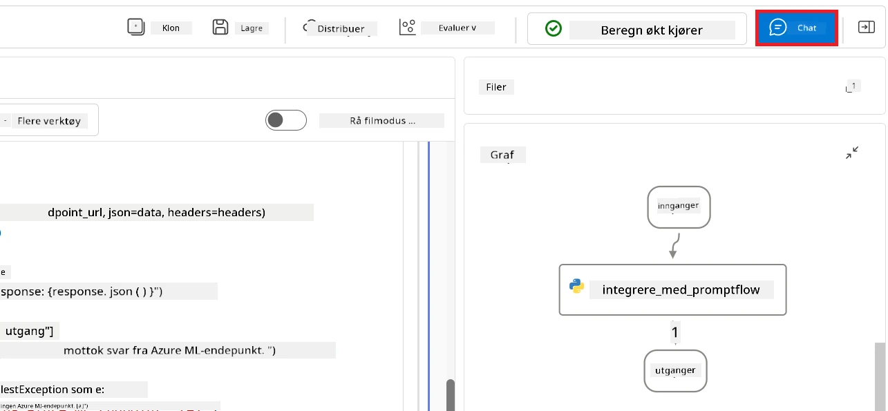

1. Her er et eksempel på resultatene: Nå kan du chatte med din egendefinerte Phi-3-modell. Det anbefales å stille spørsmål basert på dataene som ble brukt til finjusteringen.

    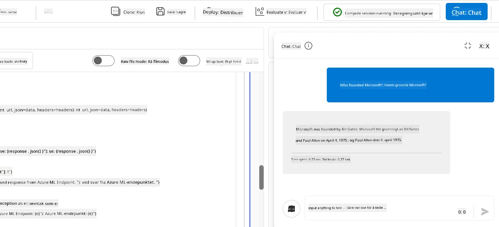

---

<!-- CO-OP TRANSLATOR DISCLAIMER START -->
**Ansvarsfraskrivelse**:
Dette dokumentet er oversatt ved hjelp av AI-oversettelsestjenesten [Co-op Translator](https://github.com/Azure/co-op-translator). Selv om vi streber etter nøyaktighet, vennligst vær oppmerksom på at automatiske oversettelser kan inneholde feil eller unøyaktigheter. Det originale dokumentet på det opprinnelige språket bør anses som den autoritative kilden. For kritisk informasjon anbefales profesjonell menneskelig oversettelse. Vi er ikke ansvarlige for eventuelle misforståelser eller feiltolkninger som oppstår ved bruk av denne oversettelsen.
<!-- CO-OP TRANSLATOR DISCLAIMER END -->