# Fininnstill og integrer tilpassede Phi-3-modeller med Prompt flow i Microsoft Foundry

Dette end-to-end (E2E) eksempelet er basert på guiden "[Fininnstill og integrer tilpassede Phi-3-modeller med Prompt Flow i Microsoft Foundry](https://techcommunity.microsoft.com/t5/educator-developer-blog/fine-tune-and-integrate-custom-phi-3-models-with-prompt-flow-in/ba-p/4191726?WT.mc_id=aiml-137032-kinfeylo)" fra Microsoft Tech Community. Det introduserer prosessene for fininnstilling, distribusjon og integrering av tilpassede Phi-3-modeller med Prompt flow i Microsoft Foundry.
I motsetning til E2E-eksempelet, "[Fininnstill og integrer tilpassede Phi-3-modeller med Prompt Flow](./E2E_Phi-3-FineTuning_PromptFlow_Integration.md)", som involverte kjøring av kode lokalt, fokuserer denne opplæringen helt på fininnstilling og integrering av modellen din innenfor Azure AI / ML Studio.

## Oversikt

I dette E2E-eksempelet vil du lære hvordan du fininnstiller Phi-3-modellen og integrerer den med Prompt flow i Microsoft Foundry. Ved å bruke Azure AI / ML Studio vil du etablere en arbeidsflyt for distribusjon og bruk av tilpassede AI-modeller. Dette E2E-eksempelet er delt inn i tre scenarier:

**Scenario 1: Konfigurer Azure-ressurser og forbered til fininnstilling**

**Scenario 2: Fininnstill Phi-3-modellen og distribuer i Azure Machine Learning Studio**

**Scenario 3: Integrer med Prompt flow og chatt med din tilpassede modell i Microsoft Foundry**

Her er en oversikt over dette E2E-eksempelet.

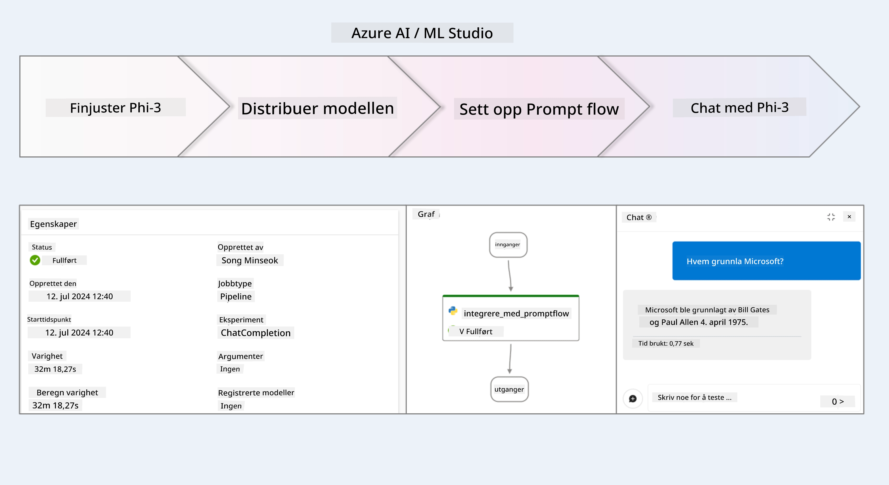

### Innholdsfortegnelse

1. **[Scenario 1: Konfigurer Azure-ressurser og forbered til fininnstilling](../../../../../../md/02.Application/01.TextAndChat/Phi3)**
    - [Opprett et Azure Machine Learning Workspace](../../../../../../md/02.Application/01.TextAndChat/Phi3)
    - [Be om GPU-kvoter i Azure-abonnement](../../../../../../md/02.Application/01.TextAndChat/Phi3)
    - [Legg til rolleoppgave](../../../../../../md/02.Application/01.TextAndChat/Phi3)
    - [Konfigurer prosjekt](../../../../../../md/02.Application/01.TextAndChat/Phi3)
    - [Forbered datasett for fininnstilling](../../../../../../md/02.Application/01.TextAndChat/Phi3)

1. **[Scenario 2: Fininnstill Phi-3-modellen og distribuer i Azure Machine Learning Studio](../../../../../../md/02.Application/01.TextAndChat/Phi3)**
    - [Fininnstill Phi-3-modellen](../../../../../../md/02.Application/01.TextAndChat/Phi3)
    - [Distribuer den fininnstilte Phi-3-modellen](../../../../../../md/02.Application/01.TextAndChat/Phi3)

1. **[Scenario 3: Integrer med Prompt flow og chatt med din tilpassede modell i Microsoft Foundry](../../../../../../md/02.Application/01.TextAndChat/Phi3)**
    - [Integrer den tilpassede Phi-3-modellen med Prompt flow](../../../../../../md/02.Application/01.TextAndChat/Phi3)
    - [Chatt med din tilpassede Phi-3-modell](../../../../../../md/02.Application/01.TextAndChat/Phi3)

## Scenario 1: Konfigurer Azure-ressurser og forbered til fininnstilling

### Opprett et Azure Machine Learning Workspace

1. Skriv *azure machine learning* i **søkelinjen** øverst på portal-siden og velg **Azure Machine Learning** fra alternativene som vises.

    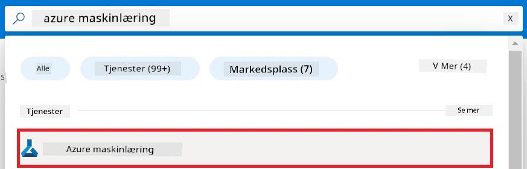

2. Velg **+ Opprett** fra navigasjonsmenyen.

3. Velg **Nytt arbeidsområde** fra navigasjonsmenyen.

    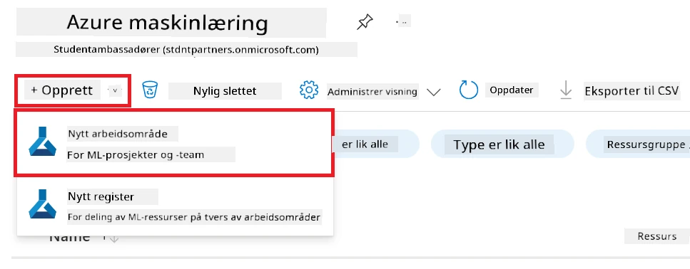

4. Utfør følgende oppgaver:

    - Velg ditt Azure **abonnement**.
    - Velg **Ressursgruppe** som skal brukes (opprett en ny om nødvendig).
    - Skriv inn **Navn på arbeidsområde**. Det må være en unik verdi.
    - Velg **Region** du ønsker å bruke.
    - Velg **Lagringskonto** som skal brukes (opprett en ny om nødvendig).
    - Velg **Nøkkelvalv** som skal brukes (opprett en ny om nødvendig).
    - Velg **Programinnsikt** som skal brukes (opprett en ny om nødvendig).
    - Velg **Container register** som skal brukes (opprett en ny om nødvendig).

    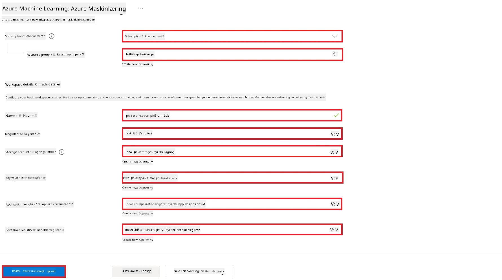

5. Velg **Gjennomgå + Opprett**.

6. Velg **Opprett**.

### Be om GPU-kvoter i Azure-abonnement

I denne opplæringen vil du lære hvordan du fininnstiller og distribuerer en Phi-3-modell, ved bruk av GPUer. For fininnstilling vil du bruke *Standard_NC24ads_A100_v4* GPU, som krever en kvotebegjæring. For distribusjon vil du bruke *Standard_NC6s_v3* GPU, som også krever en kvotebegjæring.

> [!NOTE]
>
> Kun Pay-As-You-Go-abonnementer (standard abonnementstype) er kvalifisert for GPU-allokering; fordelabonnementer støttes ikke for øyeblikket.
>

1. Besøk [Azure ML Studio](https://ml.azure.com/home?wt.mc_id=studentamb_279723).

1. Utfør følgende oppgaver for å be om kvoter for *Standard NCADSA100v4 Family*:

    - Velg **Kvote** fra fanen på venstre side.
    - Velg **Virtuell maskinfamilie** som skal brukes. For eksempel, velg **Standard NCADSA100v4 Family Cluster Dedicated vCPUs**, som inkluderer *Standard_NC24ads_A100_v4* GPU.
    - Velg **Be om kvote** fra navigasjonsmenyen.

        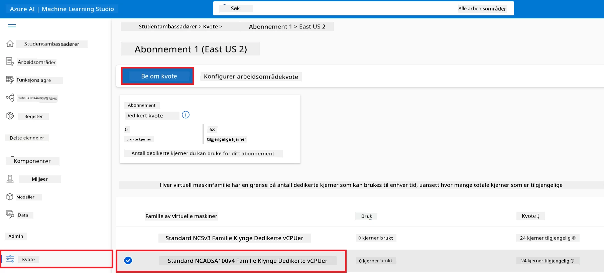

    - På siden Be om kvote, skriv inn **Nytt kjernergrense** du ønsker å bruke. For eksempel, 24.
    - På siden Be om kvote, velg **Send inn** for å be om GPU-kvoten.

1. Utfør følgende oppgaver for å be om kvoter for *Standard NCSv3 Family*:

    - Velg **Kvote** fra fanen på venstre side.
    - Velg **Virtuell maskinfamilie** som skal brukes. For eksempel, velg **Standard NCSv3 Family Cluster Dedicated vCPUs**, som inkluderer *Standard_NC6s_v3* GPU.
    - Velg **Be om kvote** fra navigasjonsmenyen.
    - På siden Be om kvote, skriv inn **Nytt kjernergrense** du ønsker å bruke. For eksempel, 24.
    - På siden Be om kvote, velg **Send inn** for å be om GPU-kvoten.

### Legg til rolleoppgave

For å fininnstille og distribuere modellene dine, må du først opprette en Brukertilordnet administrert identitet (UAI) og tildele den passende tillatelser. Denne UAI vil bli brukt for autentisering under distribusjon.

#### Opprett Brukertilordnet administrert identitet (UAI)

1. Skriv *managed identities* i **søkelinjen** øverst på portal-siden og velg **Managed Identities** fra alternativene som vises.

    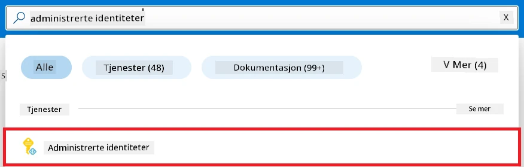

1. Velg **+ Opprett**.

    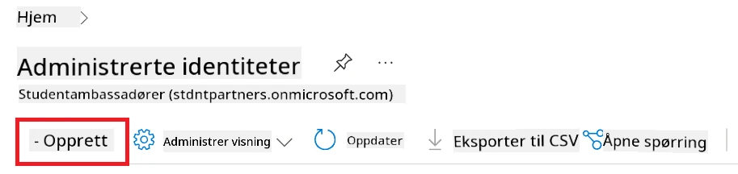

1. Utfør følgende oppgaver:

    - Velg ditt Azure **abonnement**.
    - Velg **Ressursgruppe** som skal brukes (opprett en ny om nødvendig).
    - Velg **Region** du ønsker å bruke.
    - Skriv inn **Navn**. Det må være en unik verdi.

    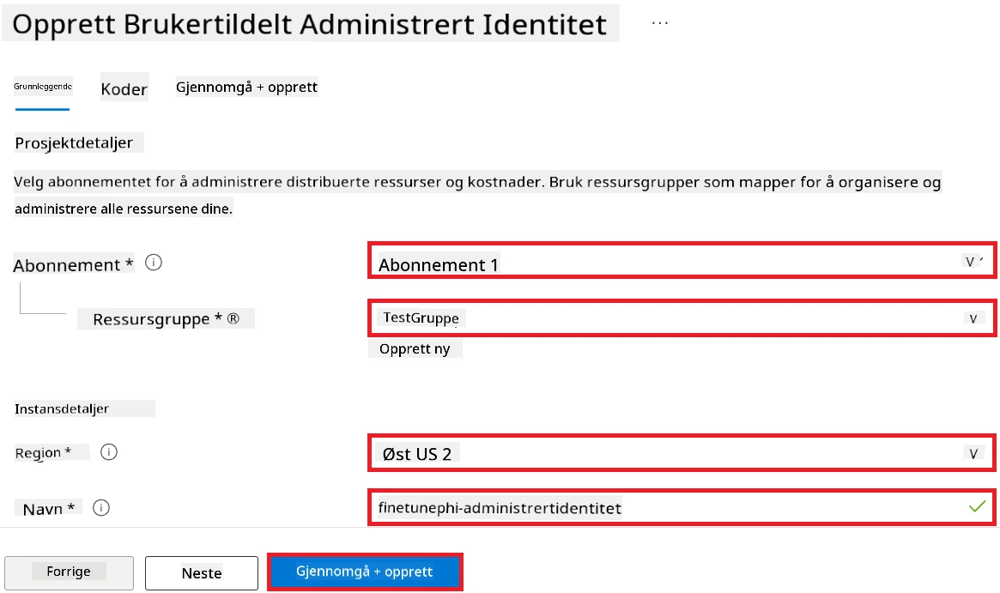

1. Velg **Gjennomgå + opprett**.

1. Velg **+ Opprett**.

#### Legg til bidragsyter-rolleoppgave for administrert identitet

1. Naviger til den administrerte identitetsressursen du opprettet.

1. Velg **Azure rolleoppgaver** fra fanen til venstre.

1. Velg **+ Legg til rolleoppgave** fra navigasjonsmenyen.

1. På siden Legg til rolleoppgave, utfør følgende oppgaver:
    - Velg **Omfang** til **Ressursgruppe**.
    - Velg ditt Azure **abonnement**.
    - Velg **Ressursgruppen** som skal brukes.
    - Velg **Rolle** til **Bidragsyter**.

    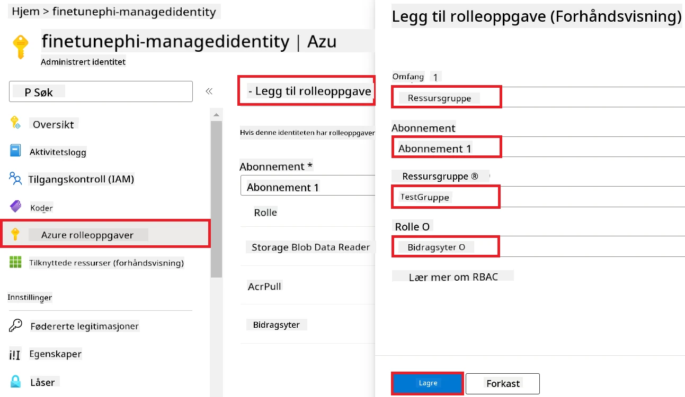

2. Velg **Lagre**.

#### Legg til Storage Blob Data Reader-rolleoppgave for administrert identitet

1. Skriv *storage accounts* i **søkelinjen** øverst på portal-siden og velg **Storage accounts** fra alternativene som vises.

    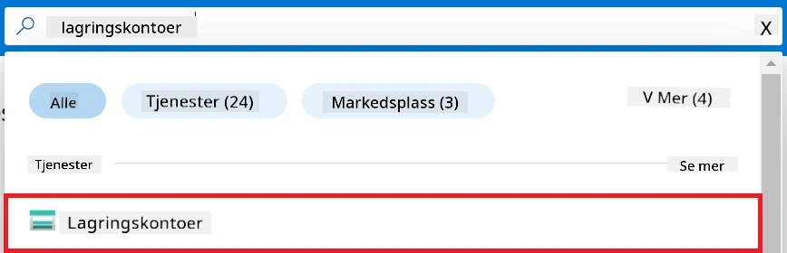

1. Velg lagringskontoen som er knyttet til Azure Machine Learning-arbeidsområdet du opprettet. For eksempel, *finetunephistorage*.

1. Utfør følgende oppgaver for å navigere til siden Legg til rolleoppgave:

    - Naviger til Azure Storage-kontoen du opprettet.
    - Velg **Kontrolltilgang (IAM)** fra fanen til venstre.
    - Velg **+ Legg til** i navigasjonsmenyen.
    - Velg **Legg til rolleoppgave** i navigasjonsmenyen.

    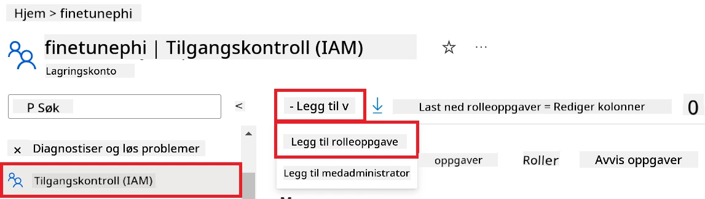

1. På siden Legg til rolleoppgave, utfør følgende oppgaver:

    - På rolesiden skriver du *Storage Blob Data Reader* i **søkelinjen** og velger **Storage Blob Data Reader** fra alternativene som vises.
    - På rolesiden velger du **Neste**.
    - På Medlemsiden velger du **Tildel tilgang til** **Administrert identitet**.
    - På Medlemsiden velger du **+ Velg medlemmer**.
    - På siden Velg administrerte identiteter, velger du ditt Azure **abonnement**.
    - På siden Velg administrerte identiteter velger du **Administrert identitet**.
    - På siden Velg administrerte identiteter velger du den administrerte identiteten du opprettet. For eksempel, *finetunephi-managedidentity*.
    - På siden Velg administrerte identiteter velger du **Velg**.

    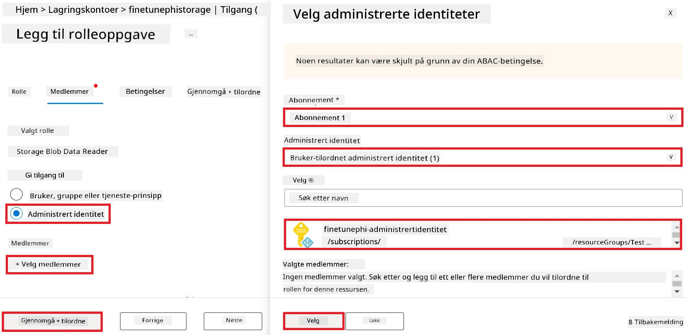

1. Velg **Gjennomgå + tildel**.

#### Legg til AcrPull-rolleoppgave for administrert identitet

1. Skriv *container registries* i **søkelinjen** øverst på portal-siden og velg **Container registries** fra alternativene som vises.

    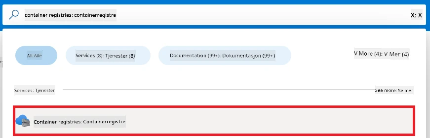

1. Velg container registeret som er knyttet til Azure Machine Learning-arbeidsområdet. For eksempel, *finetunephicontainerregistry*

1. Utfør følgende oppgaver for å navigere til siden Legg til rolleoppgave:

    - Velg **Kontrolltilgang (IAM)** fra fanen til venstre.
    - Velg **+ Legg til** i navigasjonsmenyen.
    - Velg **Legg til rolleoppgave** i navigasjonsmenyen.

1. På siden Legg til rolleoppgave, utfør følgende oppgaver:

    - På rolesiden skriver du *AcrPull* i **søkelinjen** og velger **AcrPull** fra alternativene som vises.
    - På rolesiden velger du **Neste**.
    - På Medlemsiden velger du **Tildel tilgang til** **Administrert identitet**.
    - På Medlemsiden velger du **+ Velg medlemmer**.
    - På siden Velg administrerte identiteter, velger du ditt Azure **abonnement**.
    - På siden Velg administrerte identiteter velger du **Administrert identitet**.
    - På siden Velg administrerte identiteter velger du den administrerte identiteten du opprettet. For eksempel, *finetunephi-managedidentity*.
    - På siden Velg administrerte identiteter velger du **Velg**.
    - Velg **Gjennomgå + tildel**.

### Konfigurer prosjekt

For å laste ned datasett som trengs for fininnstilling, vil du sette opp et lokalt miljø.

I denne øvelsen vil du

- Opprette en mappe å arbeide i.
- Opprette et virtuelt miljø.
- Installere nødvendige pakker.
- Opprette en *download_dataset.py* fil for å laste ned datasettet.

#### Opprett en mappe å arbeide i

1. Åpne et terminalvindu og skriv følgende kommando for å opprette en mappe med navnet *finetune-phi* i standardbanen.

    ```console
    mkdir finetune-phi
    ```

2. Skriv følgende kommando i terminalen for å navigere til *finetune-phi* mappen du opprettet.

    ```console
    cd finetune-phi
    ```

#### Opprett et virtuelt miljø

1. Skriv følgende kommando i terminalen for å opprette et virtuelt miljø med navnet *.venv*.
    ```console
    python -m venv .venv
    ```

2. Skriv følgende kommando i terminalen for å aktivere det virtuelle miljøet.

    ```console
    .venv\Scripts\activate.bat
    ```

> [!NOTE]
> Hvis det fungerte, bør du se *(.venv)* foran kommandoprompten.

#### Installer nødvendige pakker

1. Skriv følgende kommandoer i terminalen for å installere de nødvendige pakkene.

    ```console
    pip install datasets==2.19.1
    ```

#### Opprett `donload_dataset.py`

> [!NOTE]
> Komplett mappestruktur:
>
> ```text
> └── YourUserName
> .    └── finetune-phi
> .        └── download_dataset.py
> ```

1. Åpne **Visual Studio Code**.

1. Velg **File** fra menylinjen.

1. Velg **Open Folder**.

1. Velg mappen *finetune-phi* som du opprettet, som ligger under *C:\Users\dittBrukernavn\finetune-phi*.

    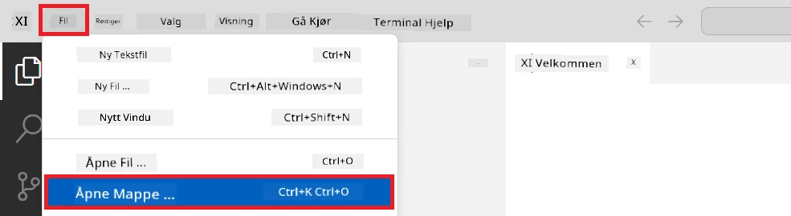

1. I venstre panel av Visual Studio Code, høyreklikk og velg **New File** for å opprette en ny fil kalt *download_dataset.py*.

    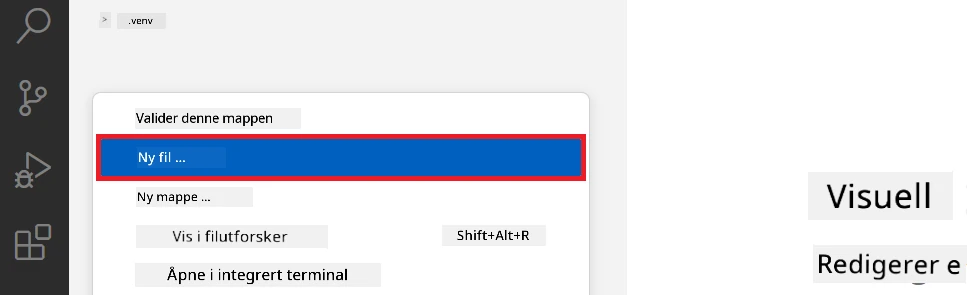

### Forbered datasett for finjustering

I denne øvelsen skal du kjøre filen *download_dataset.py* for å laste ned datasettene *ultrachat_200k* til ditt lokale miljø. Du skal deretter bruke dette datasettet for å finjustere Phi-3 modellen i Azure Machine Learning.

I denne øvelsen vil du:

- Legge til kode i filen *download_dataset.py* for å laste ned datasettene.
- Kjøre filen *download_dataset.py* for å laste ned datasettene til ditt lokale miljø.

#### Last ned datasettet ditt ved hjelp av *download_dataset.py*

1. Åpne filen *download_dataset.py* i Visual Studio Code.

1. Legg til følgende kode i filen *download_dataset.py*.

    ```python
    import json
    import os
    from datasets import load_dataset

    def load_and_split_dataset(dataset_name, config_name, split_ratio):
        """
        Load and split a dataset.
        """
        # Last inn datasettet med det angitte navnet, konfigurasjonen og splittforholdet
        dataset = load_dataset(dataset_name, config_name, split=split_ratio)
        print(f"Original dataset size: {len(dataset)}")
        
        # Del datasettet i trenings- og testsett (80 % trening, 20 % test)
        split_dataset = dataset.train_test_split(test_size=0.2)
        print(f"Train dataset size: {len(split_dataset['train'])}")
        print(f"Test dataset size: {len(split_dataset['test'])}")
        
        return split_dataset

    def save_dataset_to_jsonl(dataset, filepath):
        """
        Save a dataset to a JSONL file.
        """
        # Opprett katalogen hvis den ikke finnes
        os.makedirs(os.path.dirname(filepath), exist_ok=True)
        
        # Åpne filen i skrivemodus
        with open(filepath, 'w', encoding='utf-8') as f:
            # Iterer over hver post i datasettet
            for record in dataset:
                # Lagre posten som et JSON-objekt og skriv det til filen
                json.dump(record, f)
                # Skriv en linjeskiftkarakter for å skille postene
                f.write('\n')
        
        print(f"Dataset saved to {filepath}")

    def main():
        """
        Main function to load, split, and save the dataset.
        """
        # Last inn og del ULTRACHAT_200k-datasettet med en spesifikk konfigurasjon og splittforhold
        dataset = load_and_split_dataset("HuggingFaceH4/ultrachat_200k", 'default', 'train_sft[:1%]')
        
        # Ekstraher trenings- og testdatasett fra splitten
        train_dataset = dataset['train']
        test_dataset = dataset['test']

        # Lagre treningsdatasettet til en JSONL-fil
        save_dataset_to_jsonl(train_dataset, "data/train_data.jsonl")
        
        # Lagre testdatasettet til en separat JSONL-fil
        save_dataset_to_jsonl(test_dataset, "data/test_data.jsonl")

    if __name__ == "__main__":
        main()

    ```

1. Skriv følgende kommando i terminalen for å kjøre scriptet og laste ned datasettet til ditt lokale miljø.

    ```console
    python download_dataset.py
    ```

1. Bekreft at datasettene ble lagret vellykket i din lokale mappe *finetune-phi/data*.

> [!NOTE]
>
> #### Merk om datasettstørrelse og finjusteringstid
>
> I denne veiledningen bruker du kun 1% av datasettet (`split='train[:1%]'`). Dette reduserer betydelig datamengden, noe som gjør både opplastingen og finjusteringen raskere. Du kan justere prosentandelen for å finne den rette balansen mellom treningstid og modellens ytelse. Ved å bruke en mindre del av datasettet reduseres tiden som trengs for finjustering, noe som gjør prosessen mer håndterbar i en veiledning.

## Scenario 2: Finjuster Phi-3 modellen og distribuer i Azure Machine Learning Studio

### Finjuster Phi-3 modellen

I denne øvelsen skal du finjustere Phi-3 modellen i Azure Machine Learning Studio.

I denne øvelsen vil du:

- Opprette et datamaskinklynge for finjustering.
- Finjustere Phi-3 modellen i Azure Machine Learning Studio.

#### Opprett datamaskinklynge for finjustering

1. Besøk [Azure ML Studio](https://ml.azure.com/home?wt.mc_id=studentamb_279723).

1. Velg **Compute** fra venstremenyen.

1. Velg **Compute clusters** i navigasjonsmenyen.

1. Velg **+ New**.

    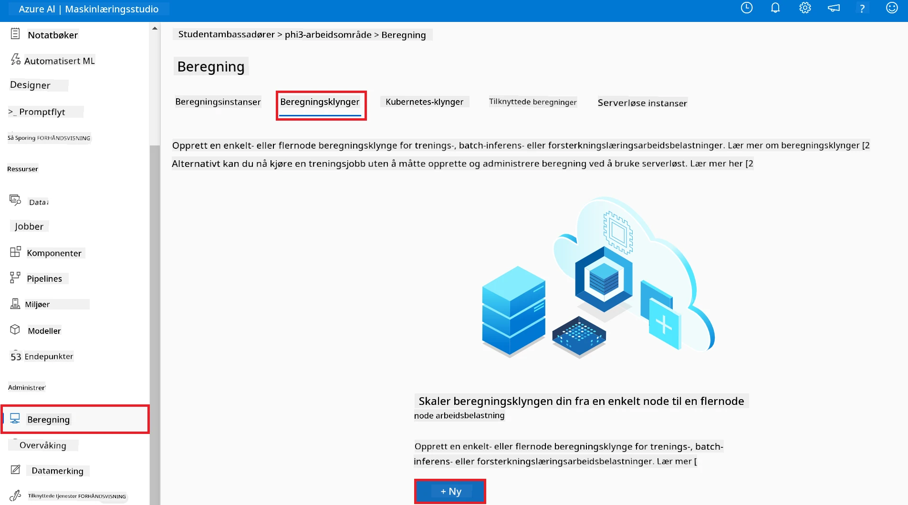

1. Gjør følgende valg:

    - Velg **Region** du ønsker å bruke.
    - Velg **Virtual machine tier** til **Dedicated**.
    - Velg **Virtual machine type** til **GPU**.
    - Filtrer **Virtual machine size** til **Select from all options**.
    - Velg **Virtual machine size** til **Standard_NC24ads_A100_v4**.

    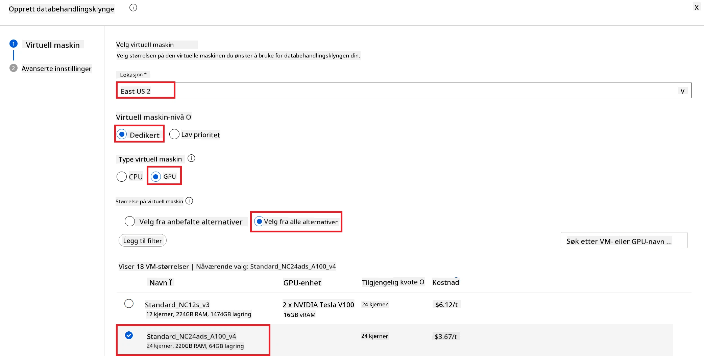

1. Velg **Next**.

1. Gjør følgende valg:

    - Skriv inn **Compute name**. Den må være unik.
    - Velg **Minimum number of nodes** til **0**.
    - Velg **Maximum number of nodes** til **1**.
    - Velg **Idle seconds before scale down** til **120**.

    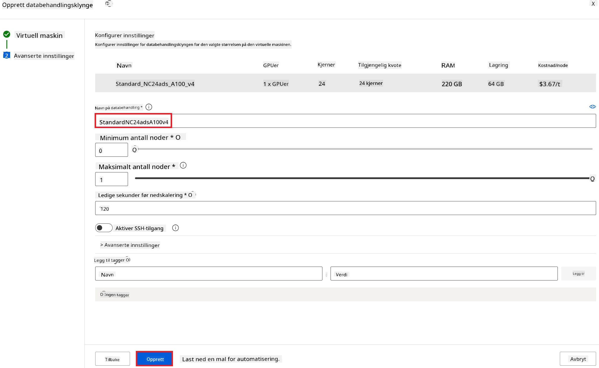

1. Velg **Create**.

#### Finjuster Phi-3 modellen

1. Besøk [Azure ML Studio](https://ml.azure.com/home?wt.mc_id=studentamb_279723).

1. Velg Azure Machine Learning-arbeidsområdet du opprettet.

    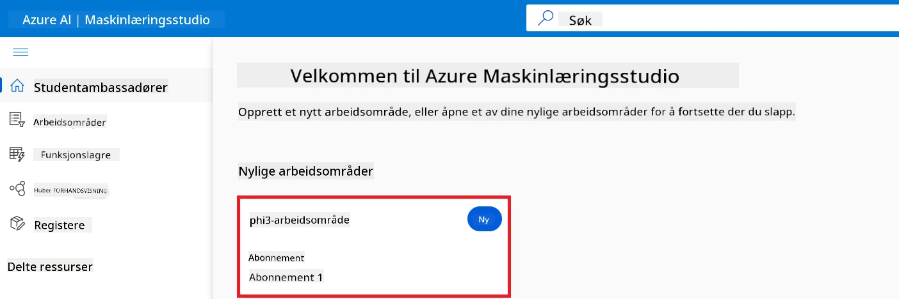

1. Gjør følgende valg:

    - Velg **Model catalog** fra venstremenyen.
    - Skriv *phi-3-mini-4k* i **søkelinjen** og velg **Phi-3-mini-4k-instruct** fra alternativene som vises.

    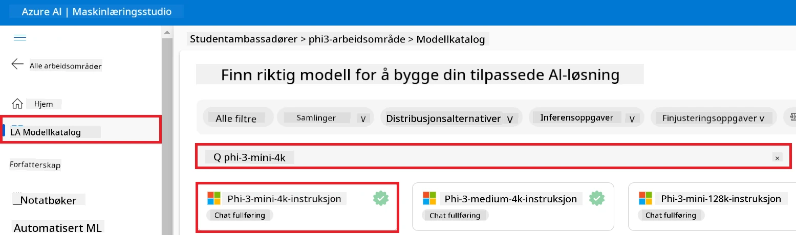

1. Velg **Fine-tune** fra navigasjonsmenyen.

    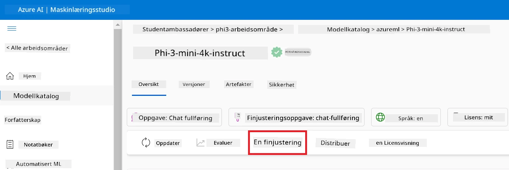

1. Utfør følgende:

    - Velg **Select task type** til **Chat completion**.
    - Velg **+ Select data** for å laste opp **Treningsdata**.
    - Velg opplastningstype for valideringsdata til **Provide different validation data**.
    - Velg **+ Select data** for å laste opp **Valideringsdata**.

    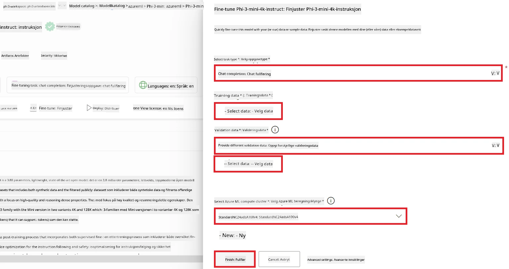

> [!TIP]
>
> Du kan velge **Advanced settings** for å tilpasse innstillinger som **learning_rate** og **lr_scheduler_type** for å optimalisere finjusteringsprosessen etter dine behov.

1. Velg **Finish**.

1. I denne øvelsen har du finjustert Phi-3 modellen ved hjelp av Azure Machine Learning. Merk at finjusteringsprosessen kan ta betydelig tid. Etter at du har startet finjusteringsjobben, må du vente på at den fullføres. Du kan overvåke status ved å gå til fanen Jobs i venstremenyen i ditt Azure Machine Learning-arbeidsområde. I neste del vil du distribuere den finjusterte modellen og integrere den med Prompt flow.

    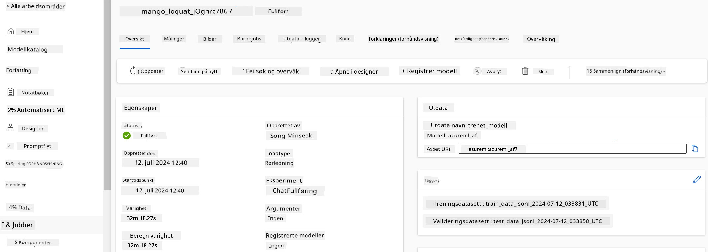

### Distribuer den finjusterte Phi-3 modellen

For å integrere den finjusterte Phi-3 modellen med Prompt flow, må du distribuere modellen for å gjøre den tilgjengelig for sanntidsinferenz. Denne prosessen innebærer å registrere modellen, opprette en online endepunkt og distribuere modellen.

I denne øvelsen vil du:

- Registrere den finjusterte modellen i Azure Machine Learning-arbeidsområdet.
- Opprette en online endepunkt.
- Distribuere den registrerte finjusterte Phi-3 modellen.

#### Registrer den finjusterte modellen

1. Besøk [Azure ML Studio](https://ml.azure.com/home?wt.mc_id=studentamb_279723).

1. Velg Azure Machine Learning-arbeidsområdet du opprettet.

    

1. Velg **Models** fra venstremenyen.
1. Velg **+ Register**.
1. Velg **From a job output**.

    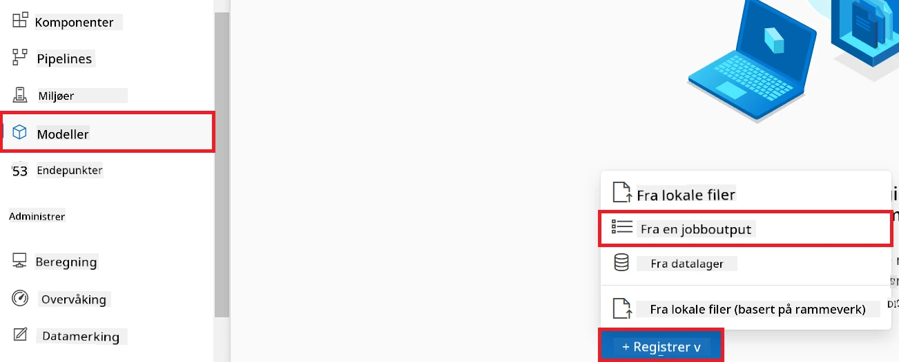

1. Velg jobben du opprettet.

    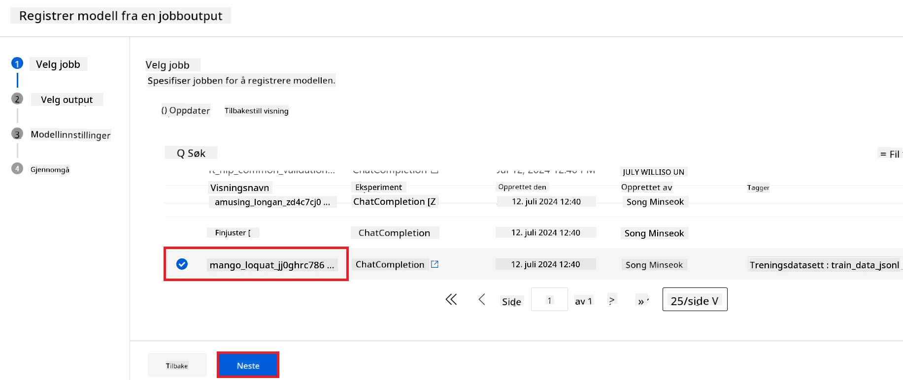

1. Velg **Next**.

1. Velg **Model type** til **MLflow**.

1. Sørg for at **Job output** er valgt; den skal velges automatisk.

    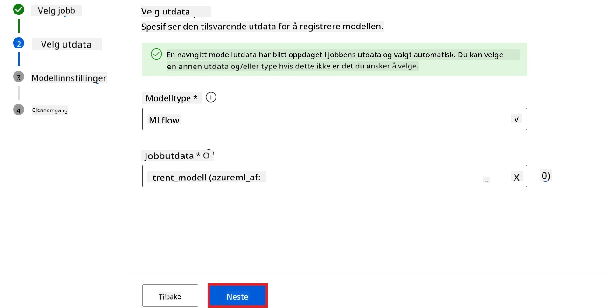

2. Velg **Next**.

3. Velg **Register**.

    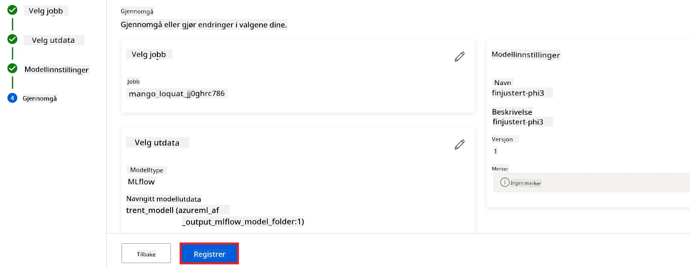

4. Du kan se din registrerte modell ved å gå til menyen **Models** i venstremenyen.

    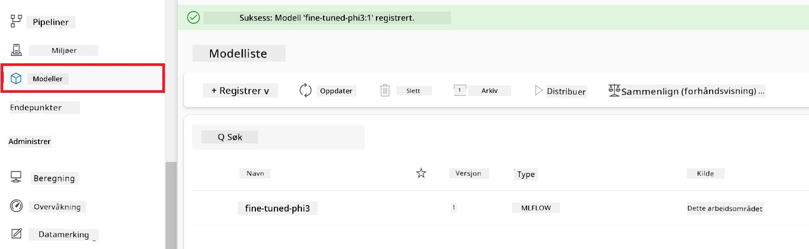

#### Distribuer den finjusterte modellen

1. Gå til Azure Machine Learning-arbeidsområdet du opprettet.

1. Velg **Endpoints** fra venstremenyen.

1. Velg **Real-time endpoints** fra navigasjonsmenyen.

    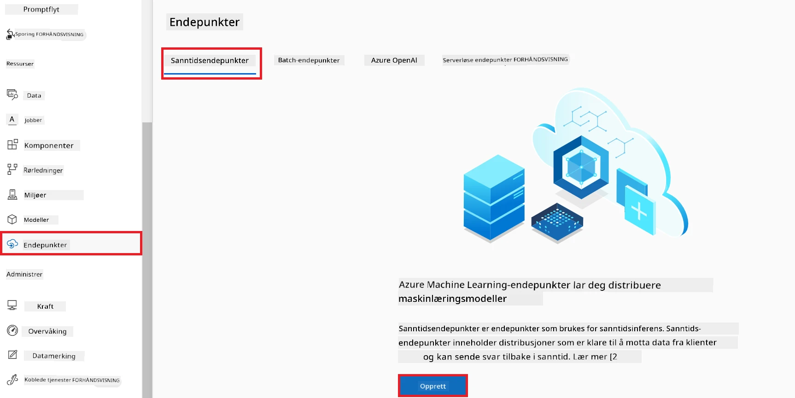

1. Velg **Create**.

1. Velg den registrerte modellen du opprettet.

    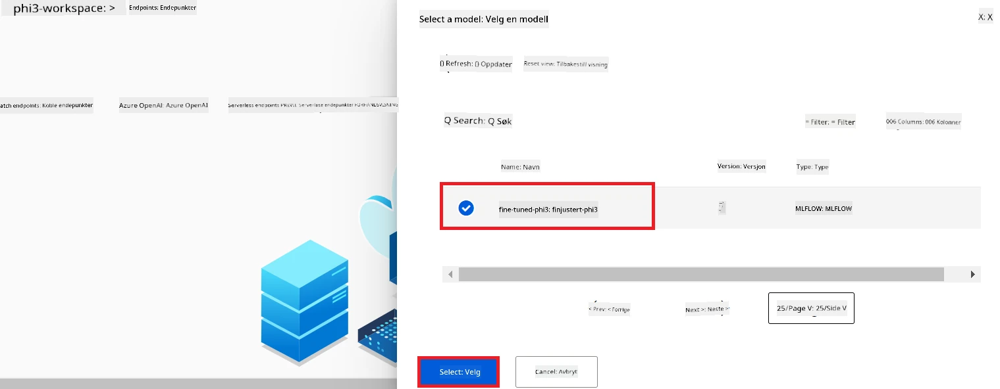

1. Velg **Select**.

1. Gjør følgende valg:

    - Velg **Virtual machine** til *Standard_NC6s_v3*.
    - Velg **Instance count** du ønsker å bruke. For eksempel, *1*.
    - Velg **Endpoint** til **New** for å opprette et nytt endepunkt.
    - Skriv inn **Endpoint name**. Den må være unik.
    - Skriv inn **Deployment name**. Den må være unik.

    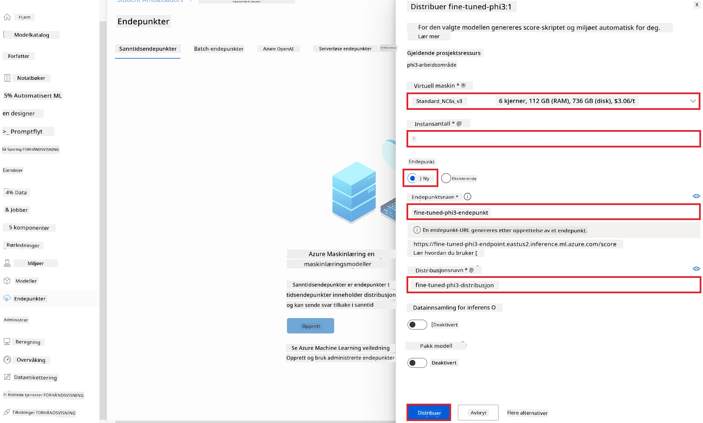

1. Velg **Deploy**.

> [!WARNING]
> For å unngå ekstra kostnader på kontoen din, sørg for å slette det opprettede endepunktet i Azure Machine Learning-arbeidsområdet.
>

#### Sjekk distribusjonsstatus i Azure Machine Learning Workspace

1. Gå til Azure Machine Learning-arbeidsområdet du opprettet.

1. Velg **Endpoints** fra venstremenyen.

1. Velg endepunktet du opprettet.

    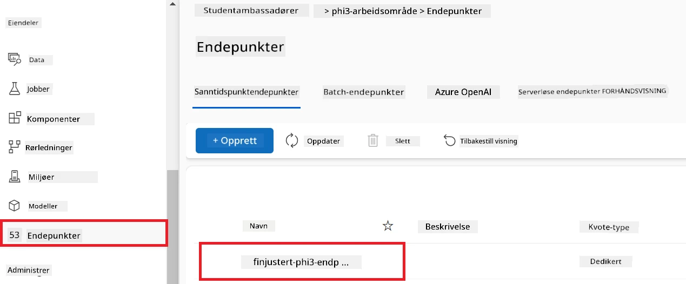

1. På denne siden kan du administrere endepunktene under distribusjonsprosessen.

> [!NOTE]
> Når distribusjonen er fullført, sørg for at **Live traffic** er satt til **100%**. Hvis ikke, velg **Update traffic** for å justere trafikkinnstillingene. Merk at du ikke kan teste modellen hvis trafikken er satt til 0%.
>
> 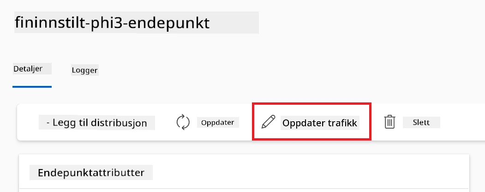
>

## Scenario 3: Integrer med Prompt flow og chat med din tilpassede modell i Microsoft Foundry

### Integrer den tilpassede Phi-3 modellen med Prompt flow

Etter å ha distribuert din finjusterte modell, kan du nå integrere den med Prompt Flow for å bruke modellen i sanntidsapplikasjoner, som gir muligheter for en rekke interaktive oppgaver med din tilpassede Phi-3 modell.

I denne øvelsen vil du:

- Opprette Microsoft Foundry Hub.
- Opprette Microsoft Foundry-prosjekt.
- Opprette Prompt flow.
- Legge til en tilpasset tilkobling for den finjusterte Phi-3 modellen.
- Konfigurere Prompt flow for å chatte med din tilpassede Phi-3 modell.

> [!NOTE]
> Du kan også integrere med Promptflow ved å bruke Azure ML Studio. Den samme integrasjonsprosessen kan brukes for Azure ML Studio.

#### Opprett Microsoft Foundry Hub

Du må opprette en Hub før du oppretter prosjektet. En Hub fungerer som en ressursgruppe, og lar deg organisere og administrere flere prosjekter innen Microsoft Foundry.
1. Besøk [Microsoft Foundry](https://ai.azure.com/?WT.mc_id=aiml-137032-kinfeylo).

1. Velg **All hubs** fra fanen på venstre side.

1. Velg **+ New hub** fra navigasjonsmenyen.

    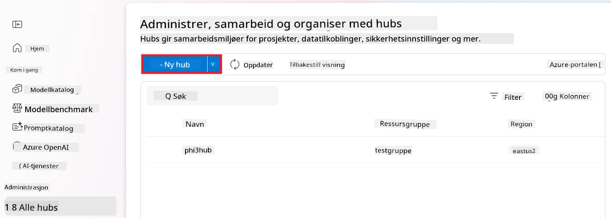

1. Utfør følgende oppgaver:

    - Skriv inn **Hub name**. Det må være en unik verdi.
    - Velg din Azure **Subscription**.
    - Velg **Resource group** som skal brukes (opprett en ny om nødvendig).
    - Velg **Location** du ønsker å bruke.
    - Velg **Connect Azure AI Services** som skal brukes (opprett en ny om nødvendig).
    - Velg **Connect Azure AI Search** til **Skip connecting**.

    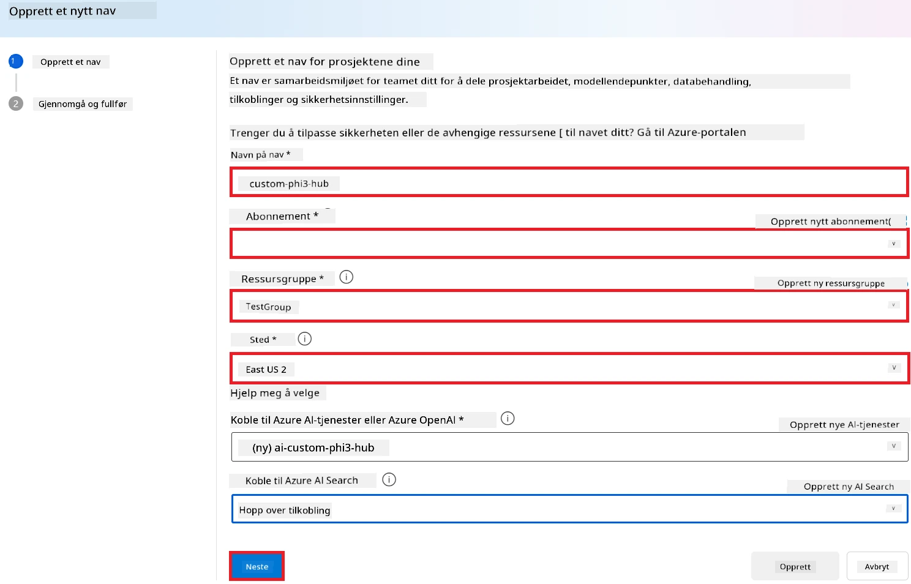

1. Velg **Next**.

#### Opprett Microsoft Foundry-prosjekt

1. I Huben du opprettet, velg **All projects** fra fanen på venstre side.

1. Velg **+ New project** fra navigasjonsmenyen.

    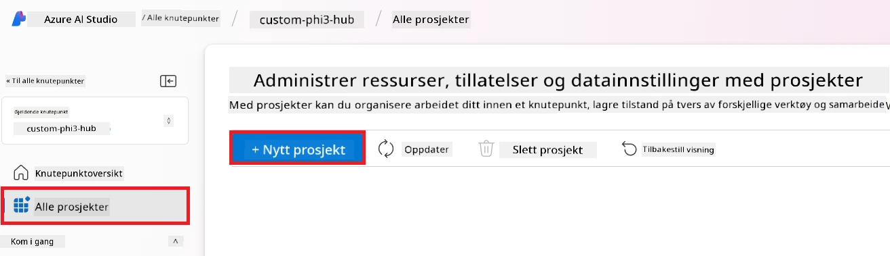

1. Skriv inn **Project name**. Det må være en unik verdi.

    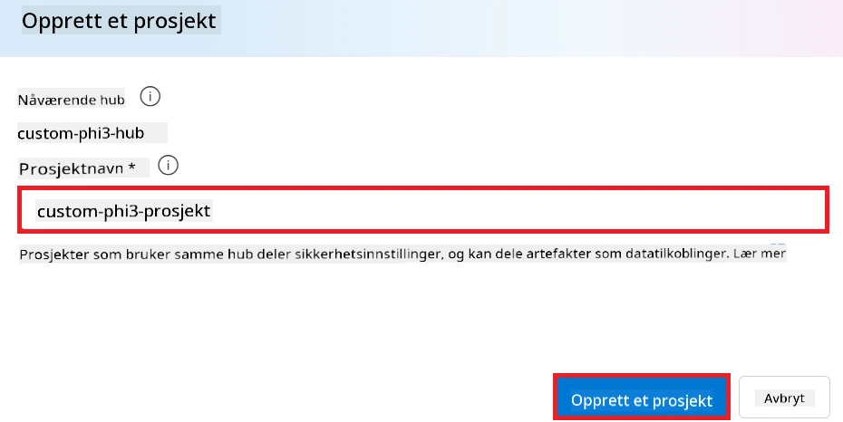

1. Velg **Create a project**.

#### Legg til en tilpasset tilkobling for den finjusterte Phi-3 modellen

For å integrere din egendefinerte Phi-3 modell med Prompt flow, må du lagre modellens endepunkt og nøkkel i en tilpasset tilkobling. Denne oppsettet sikrer tilgang til din egendefinerte Phi-3 modell i Prompt flow.

#### Angi api-nøkkel og endepunkt-URI for den finjusterte Phi-3 modellen

1. Besøk [Azure ML Studio](https://ml.azure.com/home?WT.mc_id=aiml-137032-kinfeylo).

1. Naviger til Azure Machine Learning-arbeidsområdet du opprettet.

1. Velg **Endpoints** fra fanen på venstre side.

    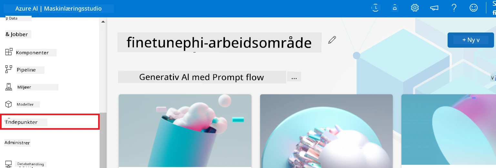

1. Velg endepunktet du har opprettet.

    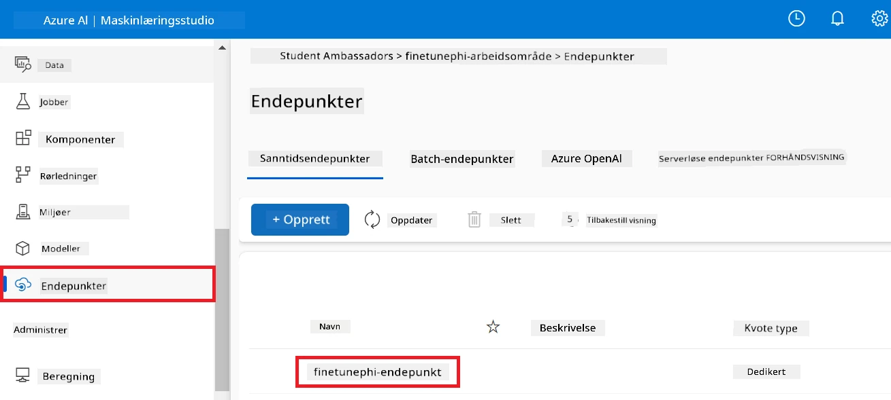

1. Velg **Consume** fra navigasjonsmenyen.

1. Kopier din **REST endpoint** og **Primary key**.

    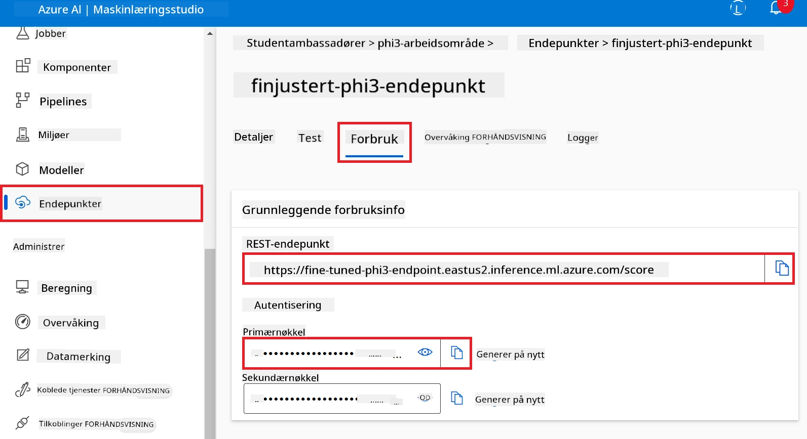

#### Legg til den tilpassede tilkoblingen

1. Besøk [Microsoft Foundry](https://ai.azure.com/?WT.mc_id=aiml-137032-kinfeylo).

1. Naviger til Microsoft Foundry-prosjektet du opprettet.

1. I prosjektet du opprettet, velg **Settings** fra fanen på venstre side.

1. Velg **+ New connection**.

    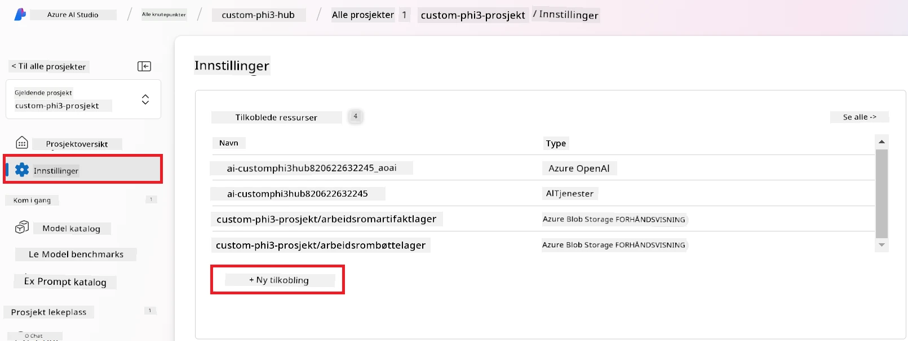

1. Velg **Custom keys** fra navigasjonsmenyen.

    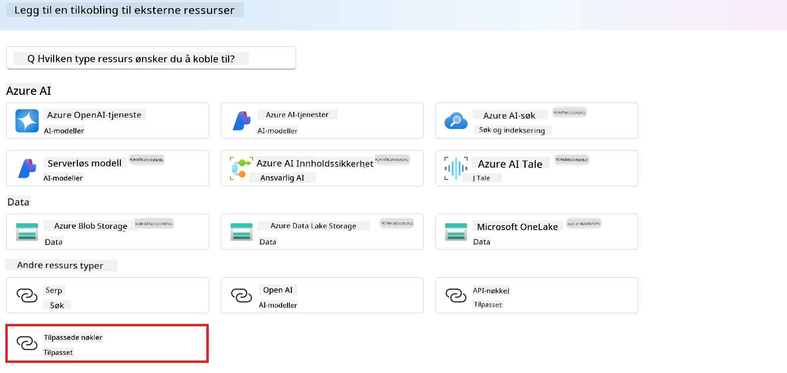

1. Utfør følgende oppgaver:

    - Velg **+ Add key value pairs**.
    - For nøkkelnavnet, skriv inn **endpoint** og lim inn endepunktet du kopierte fra Azure ML Studio i verdi-feltet.
    - Velg **+ Add key value pairs** igjen.
    - For nøkkelnavnet, skriv inn **key** og lim inn nøkkelen du kopierte fra Azure ML Studio i verdi-feltet.
    - Etter å ha lagt til nøklene, velg **is secret** for å forhindre at nøkkelen blir eksponert.

    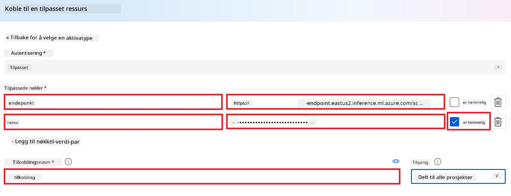

1. Velg **Add connection**.

#### Opprett Prompt flow

Du har lagt til en tilpasset tilkobling i Microsoft Foundry. Nå skal vi opprette en Prompt flow ved å følge stegene nedenfor. Deretter kobler du denne Prompt flow til den tilpassede tilkoblingen slik at du kan bruke den finjusterte modellen inne i Prompt flow.

1. Naviger til Microsoft Foundry-prosjektet du opprettet.

1. Velg **Prompt flow** fra fanen på venstre side.

1. Velg **+ Create** fra navigasjonsmenyen.

    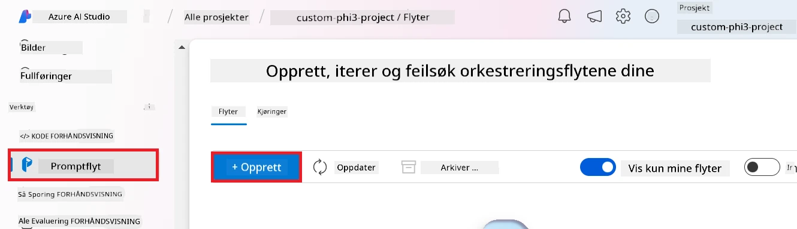

1. Velg **Chat flow** fra navigasjonsmenyen.

    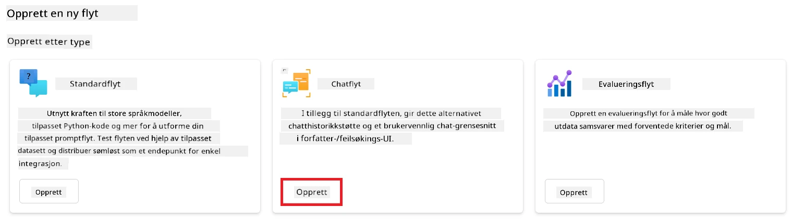

1. Skriv inn **Folder name** som skal brukes.

    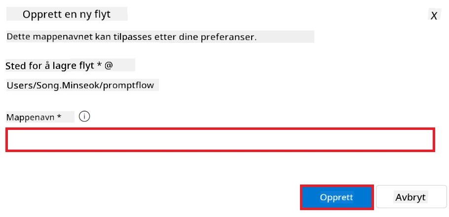

2. Velg **Create**.

#### Sett opp Prompt flow for å chatte med din egendefinerte Phi-3 modell

Du må integrere den finjusterte Phi-3 modellen inn i en Prompt flow. Den eksisterende Prompt flow som leveres er ikke laget for dette formålet, derfor må du redesigne Prompt flow for å muliggjøre integrasjon av den tilpassede modellen.

1. I Prompt flow, utfør følgende oppgaver for å gjenoppbygge den eksisterende flyten:

    - Velg **Raw file mode**.
    - Slett all eksisterende kode i *flow.dag.yml*-filen.
    - Legg til følgende kode i *flow.dag.yml*-filen.

        ```yml
        inputs:
          input_data:
            type: string
            default: "Who founded Microsoft?"

        outputs:
          answer:
            type: string
            reference: ${integrate_with_promptflow.output}

        nodes:
        - name: integrate_with_promptflow
          type: python
          source:
            type: code
            path: integrate_with_promptflow.py
          inputs:
            input_data: ${inputs.input_data}
        ```

    - Velg **Save**.

    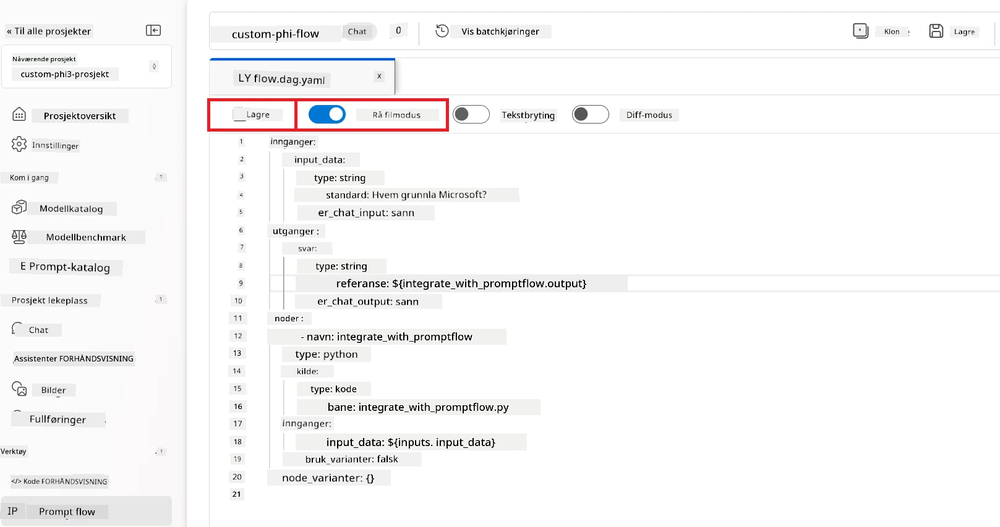

1. Legg til følgende kode i *integrate_with_promptflow.py*-filen for å bruke den tilpassede Phi-3 modellen i Prompt flow.

    ```python
    import logging
    import requests
    from promptflow import tool
    from promptflow.connections import CustomConnection

    # Loggoppsett
    logging.basicConfig(
        format="%(asctime)s - %(levelname)s - %(name)s - %(message)s",
        datefmt="%Y-%m-%d %H:%M:%S",
        level=logging.DEBUG
    )
    logger = logging.getLogger(__name__)

    def query_phi3_model(input_data: str, connection: CustomConnection) -> str:
        """
        Send a request to the Phi-3 model endpoint with the given input data using Custom Connection.
        """

        # "connection" er navnet på den egendefinerte tilkoblingen, "endpoint", "key" er nøklene i den egendefinerte tilkoblingen
        endpoint_url = connection.endpoint
        api_key = connection.key

        headers = {
            "Content-Type": "application/json",
            "Authorization": f"Bearer {api_key}"
        }
        data = {
            "input_data": {
                "input_string": [
                    {"role": "user", "content": input_data}
                ],
                "parameters": {
                    "temperature": 0.7,
                    "max_new_tokens": 128
                }
            }
        }
        try:
            response = requests.post(endpoint_url, json=data, headers=headers)
            response.raise_for_status()
            
            # Logg hele JSON-responsen
            logger.debug(f"Full JSON response: {response.json()}")

            result = response.json()["output"]
            logger.info("Successfully received response from Azure ML Endpoint.")
            return result
        except requests.exceptions.RequestException as e:
            logger.error(f"Error querying Azure ML Endpoint: {e}")
            raise

    @tool
    def my_python_tool(input_data: str, connection: CustomConnection) -> str:
        """
        Tool function to process input data and query the Phi-3 model.
        """
        return query_phi3_model(input_data, connection)

    ```

    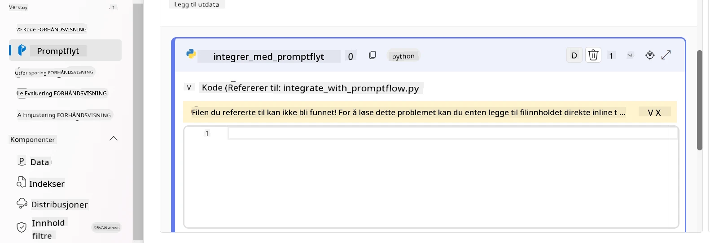

> [!NOTE]
> For mer detaljert informasjon om bruk av Prompt flow i Microsoft Foundry, kan du se [Prompt flow in Microsoft Foundry](https://learn.microsoft.com/azure/ai-studio/how-to/prompt-flow).

1. Velg **Chat input**, **Chat output** for å aktivere chat med modellen din.

    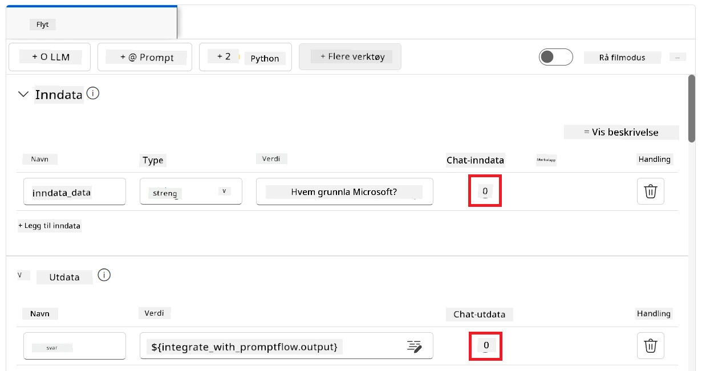

1. Nå er du klar til å chatte med din egendefinerte Phi-3 modell. I neste øvelse vil du lære hvordan du starter Prompt flow og bruker det til å chatte med din finjusterte Phi-3 modell.

> [!NOTE]
>
> Den gjenoppbygde flyten skal se ut som bildet nedenfor:
>
> 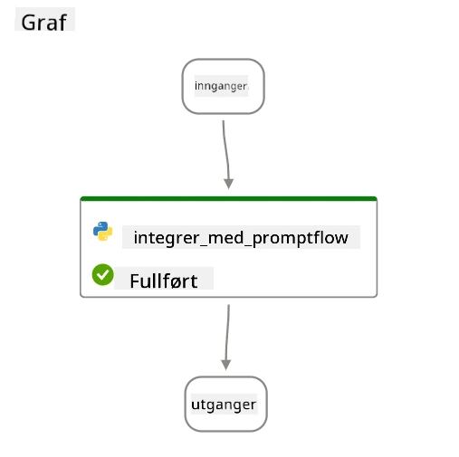
>

### Chat med din egendefinerte Phi-3 modell

Nå som du har finjustert og integrert din egendefinerte Phi-3 modell med Prompt flow, er du klar til å begynne å samhandle med den. Denne øvelsen vil veilede deg gjennom prosessen med å sette opp og starte en chat med modellen din ved hjelp av Prompt flow. Ved å følge disse trinnene vil du kunne utnytte kapasitetene til din finjusterte Phi-3 modell fullt ut for ulike oppgaver og samtaler.

- Chat med din egendefinerte Phi-3 modell ved hjelp av Prompt flow.

#### Start Prompt flow

1. Velg **Start compute sessions** for å starte Prompt flow.

    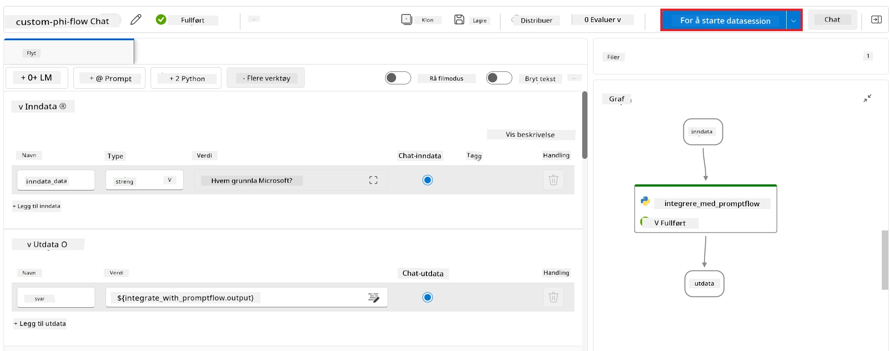

1. Velg **Validate and parse input** for å fornye parametere.

    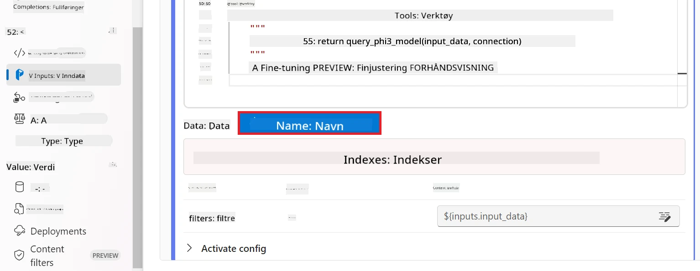

1. Velg **Value** for **connection** til den tilpassede tilkoblingen du opprettet. For eksempel, *connection*.

    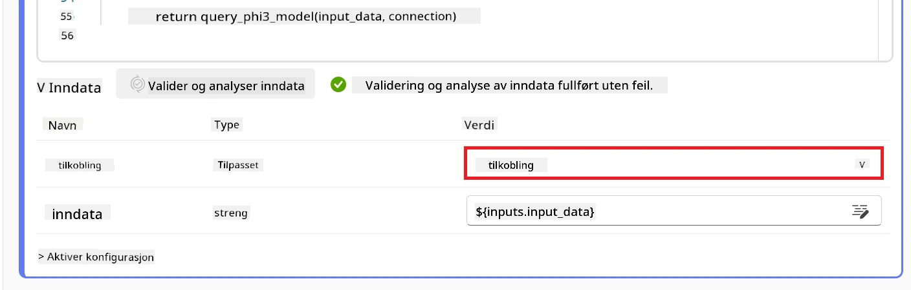

#### Chat med din egendefinerte modell

1. Velg **Chat**.

    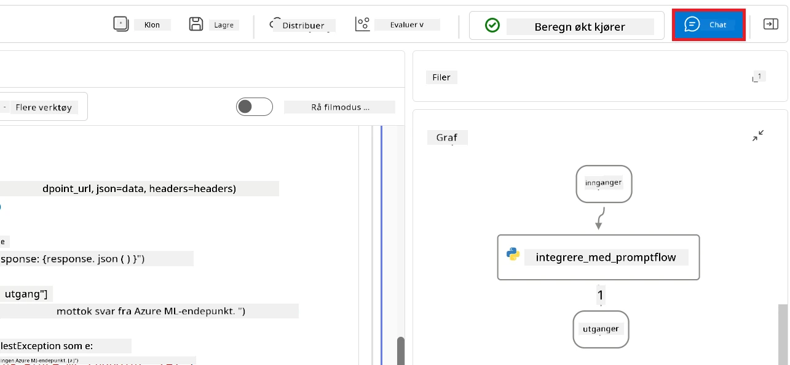

1. Her er et eksempel på resultatene: Nå kan du chatte med din egendefinerte Phi-3 modell. Det anbefales å stille spørsmål basert på dataene brukt for finjustering.

    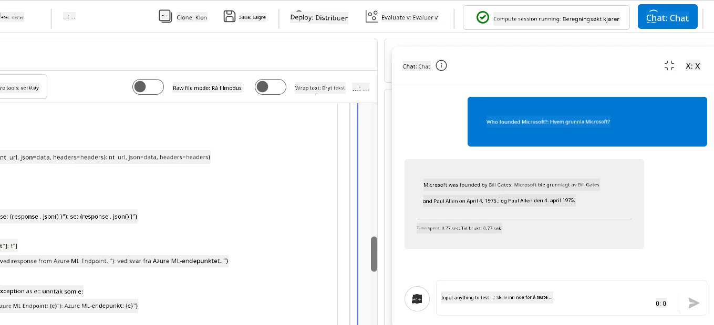

---

<!-- CO-OP TRANSLATOR DISCLAIMER START -->
**Ansvarsfraskrivelse**:
Dette dokumentet er oversatt ved hjelp av AI-oversettelsestjenesten [Co-op Translator](https://github.com/Azure/co-op-translator). Selv om vi streber etter nøyaktighet, vennligst vær oppmerksom på at automatiserte oversettelser kan inneholde feil eller unøyaktigheter. Det originale dokumentet på det opprinnelige språket skal betraktes som den autoritative kilden. For kritisk informasjon anbefales profesjonell menneskelig oversettelse. Vi er ikke ansvarlige for misforståelser eller feiltolkninger som følge av bruk av denne oversettelsen.
<!-- CO-OP TRANSLATOR DISCLAIMER END -->