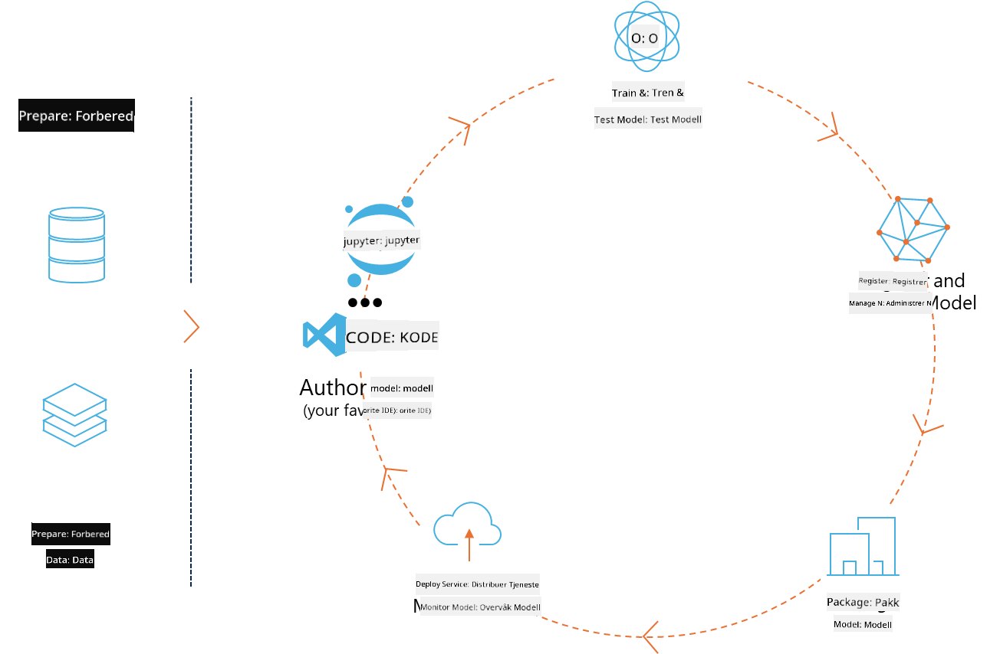
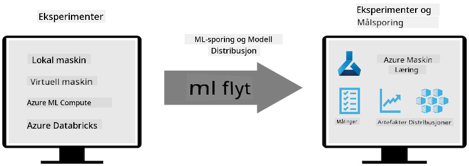
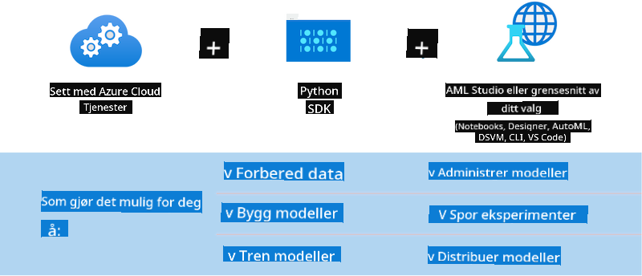

<!--
CO_OP_TRANSLATOR_METADATA:
{
  "original_hash": "f61c383bbf0c3dac97e43f833c258731",
  "translation_date": "2025-05-09T18:38:06+00:00",
  "source_file": "md/02.Application/01.TextAndChat/Phi3/E2E_Phi-3-MLflow.md",
  "language_code": "no"
}
-->
# MLflow

[MLflow](https://mlflow.org/) er en åpen kildekode-plattform laget for å håndtere hele livssyklusen til maskinlæring.



MLFlow brukes til å administrere ML-livssyklusen, inkludert eksperimentering, reproduserbarhet, distribusjon og en sentral modellregister. MLflow tilbyr for øyeblikket fire komponenter.

- **MLflow Tracking:** Registrer og søk etter eksperimenter, kode, datakonfigurasjon og resultater.
- **MLflow Projects:** Pakk datavitenskap-kode i et format som gjør det mulig å reprodusere kjøringer på hvilken som helst plattform.
- **Mlflow Models:** Distribuer maskinlæringsmodeller i forskjellige servermiljøer.
- **Model Registry:** Lagre, kommenter og administrer modeller i et sentralt register.

Den inkluderer funksjoner for å spore eksperimenter, pakke kode til reproduserbare kjøringer, samt dele og distribuere modeller. MLFlow er integrert i Databricks og støtter flere ML-biblioteker, noe som gjør det bibliotek-uavhengig. Det kan brukes med hvilken som helst maskinlæringsbibliotek og i hvilket som helst programmeringsspråk, da det tilbyr både REST API og CLI for enkel bruk.



Nøkkelfunksjoner i MLFlow inkluderer:

- **Experiment Tracking:** Registrer og sammenlign parametere og resultater.
- **Model Management:** Distribuer modeller til ulike server- og inferanseplattformer.
- **Model Registry:** Samarbeid om livssyklushåndtering av MLflow-modeller, inkludert versjonering og annotasjoner.
- **Projects:** Pakk ML-kode for deling eller produksjonsbruk.

MLFlow støtter også MLOps-syklusen, som inkluderer dataklargjøring, registrering og håndtering av modeller, pakking av modeller for kjøring, distribusjon av tjenester og overvåking av modeller. Målet er å forenkle prosessen fra prototype til produksjonsarbeidsflyt, spesielt i sky- og edge-miljøer.

## E2E Scenario - Bygge en wrapper og bruke Phi-3 som en MLFlow-modell

I dette E2E-eksempelet skal vi vise to ulike tilnærminger for å bygge en wrapper rundt Phi-3 liten språkmodell (SLM) og deretter kjøre den som en MLFlow-modell, enten lokalt eller i skyen, f.eks. i Azure Machine Learning workspace.



| Prosjekt | Beskrivelse | Plassering |
| ------------ | ----------- | -------- |
| Transformer Pipeline | Transformer Pipeline er det enkleste alternativet for å bygge en wrapper hvis du vil bruke en HuggingFace-modell med MLFlows eksperimentelle transformers-flavour. | [**TransformerPipeline.ipynb**](../../../../../../code/06.E2E/E2E_Phi-3-MLflow_TransformerPipeline.ipynb) |
| Custom Python Wrapper | Per nå støtter ikke transformer pipeline MLFlow wrapper-generering for HuggingFace-modeller i ONNX-format, selv ikke med det eksperimentelle optimum Python-pakken. For slike tilfeller kan du lage din egen Python-wrapper for MLFlow-modellen | [**CustomPythonWrapper.ipynb**](../../../../../../code/06.E2E/E2E_Phi-3-MLflow_CustomPythonWrapper.ipynb) |

## Prosjekt: Transformer Pipeline

1. Du trenger relevante Python-pakker fra MLFlow og HuggingFace:

    ``` Python
    import mlflow
    import transformers
    ```

2. Deretter bør du starte en transformer pipeline ved å referere til målmodellen Phi-3 i HuggingFace-registret. Som det fremgår av _Phi-3-mini-4k-instruct_ sin modellkort, er oppgaven av typen “Text Generation”:

    ``` Python
    pipeline = transformers.pipeline(
        task = "text-generation",
        model = "microsoft/Phi-3-mini-4k-instruct"
    )
    ```

3. Nå kan du lagre Phi-3 modellens transformer pipeline i MLFlow-format og legge til ekstra detaljer som mål-sti for artefakter, spesifikke modellkonfigurasjoner og type inferanse-API:

    ``` Python
    model_info = mlflow.transformers.log_model(
        transformers_model = pipeline,
        artifact_path = "phi3-mlflow-model",
        model_config = model_config,
        task = "llm/v1/chat"
    )
    ```

## Prosjekt: Custom Python Wrapper

1. Her kan vi bruke Microsofts [ONNX Runtime generate() API](https://github.com/microsoft/onnxruntime-genai) for inferanse og koding/dekoding av tokens for ONNX-modellen. Du må velge _onnxruntime_genai_-pakken for ditt målmiljø, i eksempelet under er CPU valgt:

    ``` Python
    import mlflow
    from mlflow.models import infer_signature
    import onnxruntime_genai as og
    ```

1. Vår egendefinerte klasse implementerer to metoder: _load_context()_ for å initialisere **ONNX-modellen** til Phi-3 Mini 4K Instruct, **generatorparametere** og **tokenizer**; og _predict()_ for å generere utgangstokens basert på gitt prompt:

    ``` Python
    class Phi3Model(mlflow.pyfunc.PythonModel):
        def load_context(self, context):
            # Retrieving model from the artifacts
            model_path = context.artifacts["phi3-mini-onnx"]
            model_options = {
                 "max_length": 300,
                 "temperature": 0.2,         
            }
        
            # Defining the model
            self.phi3_model = og.Model(model_path)
            self.params = og.GeneratorParams(self.phi3_model)
            self.params.set_search_options(**model_options)
            
            # Defining the tokenizer
            self.tokenizer = og.Tokenizer(self.phi3_model)
    
        def predict(self, context, model_input):
            # Retrieving prompt from the input
            prompt = model_input["prompt"][0]
            self.params.input_ids = self.tokenizer.encode(prompt)
    
            # Generating the model's response
            response = self.phi3_model.generate(self.params)
    
            return self.tokenizer.decode(response[0][len(self.params.input_ids):])
    ```

1. Nå kan du bruke funksjonen _mlflow.pyfunc.log_model()_ for å lage en egendefinert Python-wrapper (i pickle-format) for Phi-3 modellen, sammen med den originale ONNX-modellen og nødvendige avhengigheter:

    ``` Python
    model_info = mlflow.pyfunc.log_model(
        artifact_path = artifact_path,
        python_model = Phi3Model(),
        artifacts = {
            "phi3-mini-onnx": "cpu_and_mobile/cpu-int4-rtn-block-32-acc-level-4",
        },
        input_example = input_example,
        signature = infer_signature(input_example, ["Run"]),
        extra_pip_requirements = ["torch", "onnxruntime_genai", "numpy"],
    )
    ```

## Signaturer for genererte MLFlow-modeller

1. I steg 3 i Transformer Pipeline-prosjektet ovenfor satte vi MLFlow-modellens oppgave til “_llm/v1/chat_”. Denne instruksen lager en API-wrapper for modellen, kompatibel med OpenAIs Chat API, som vist nedenfor:

    ``` Python
    {inputs: 
      ['messages': Array({content: string (required), name: string (optional), role: string (required)}) (required), 'temperature': double (optional), 'max_tokens': long (optional), 'stop': Array(string) (optional), 'n': long (optional), 'stream': boolean (optional)],
    outputs: 
      ['id': string (required), 'object': string (required), 'created': long (required), 'model': string (required), 'choices': Array({finish_reason: string (required), index: long (required), message: {content: string (required), name: string (optional), role: string (required)} (required)}) (required), 'usage': {completion_tokens: long (required), prompt_tokens: long (required), total_tokens: long (required)} (required)],
    params: 
      None}
    ```

1. Som resultat kan du sende inn prompten din i følgende format:

    ``` Python
    messages = [{"role": "user", "content": "What is the capital of Spain?"}]
    ```

1. Deretter kan du bruke OpenAI API-kompatibel etterbehandling, f.eks. _response[0][‘choices’][0][‘message’][‘content’]_, for å formatere utdataene til noe som dette:

    ``` JSON
    Question: What is the capital of Spain?
    
    Answer: The capital of Spain is Madrid. It is the largest city in Spain and serves as the political, economic, and cultural center of the country. Madrid is located in the center of the Iberian Peninsula and is known for its rich history, art, and architecture, including the Royal Palace, the Prado Museum, and the Plaza Mayor.
    
    Usage: {'prompt_tokens': 11, 'completion_tokens': 73, 'total_tokens': 84}
    ```

1. I steg 3 i Custom Python Wrapper-prosjektet ovenfor lar vi MLFlow-pakken generere modellens signatur fra et gitt input-eksempel. Signaturen til MLFlow-wrapperen vil se slik ut:

    ``` Python
    {inputs: 
      ['prompt': string (required)],
    outputs: 
      [string (required)],
    params: 
      None}
    ```

1. Dermed må prompten vår inneholde nøkkelen "prompt" i et dictionary-format, slik som dette:

    ``` Python
    {"prompt": "<|system|>You are a stand-up comedian.<|end|><|user|>Tell me a joke about atom<|end|><|assistant|>",}
    ```

1. Modellens output vil deretter bli levert i strengformat:

    ``` JSON
    Alright, here's a little atom-related joke for you!
    
    Why don't electrons ever play hide and seek with protons?
    
    Because good luck finding them when they're always "sharing" their electrons!
    
    Remember, this is all in good fun, and we're just having a little atomic-level humor!
    ```

**Ansvarsfraskrivelse**:  
Dette dokumentet er oversatt ved hjelp av AI-oversettelsestjenesten [Co-op Translator](https://github.com/Azure/co-op-translator). Selv om vi streber etter nøyaktighet, vennligst vær oppmerksom på at automatiske oversettelser kan inneholde feil eller unøyaktigheter. Det opprinnelige dokumentet på originalspråket bør anses som den autoritative kilden. For kritisk informasjon anbefales profesjonell menneskelig oversettelse. Vi er ikke ansvarlige for eventuelle misforståelser eller feiltolkninger som oppstår fra bruk av denne oversettelsen.