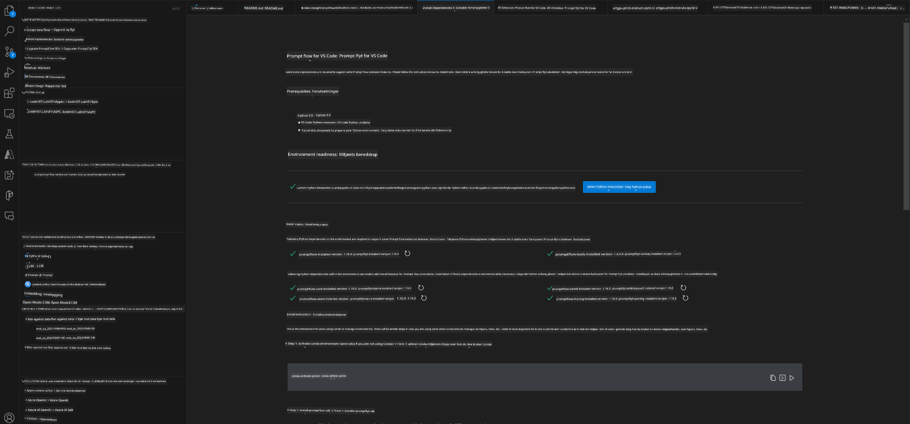
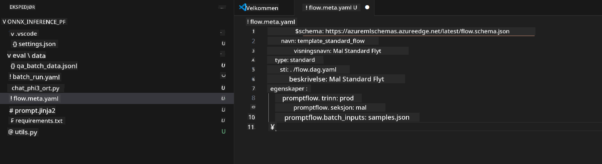
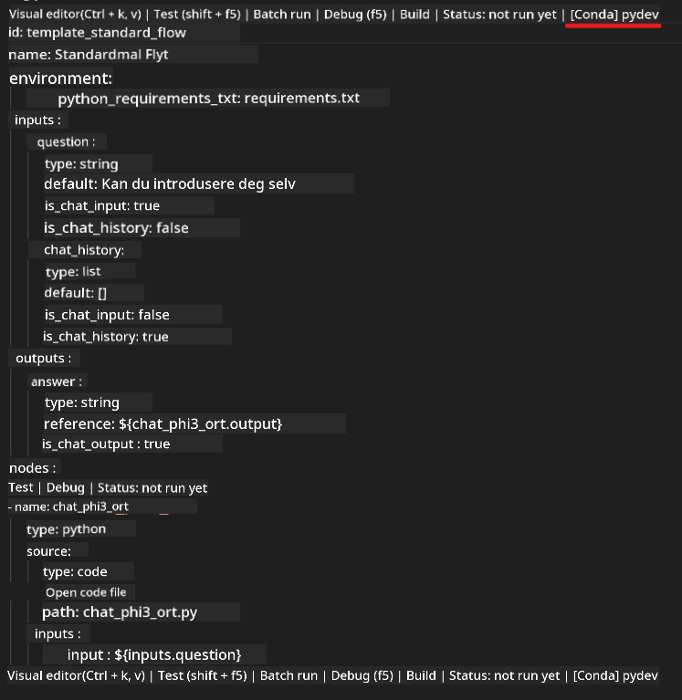
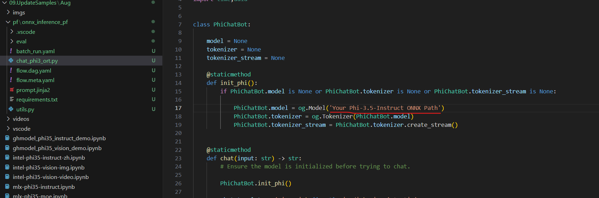
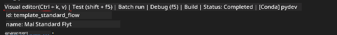
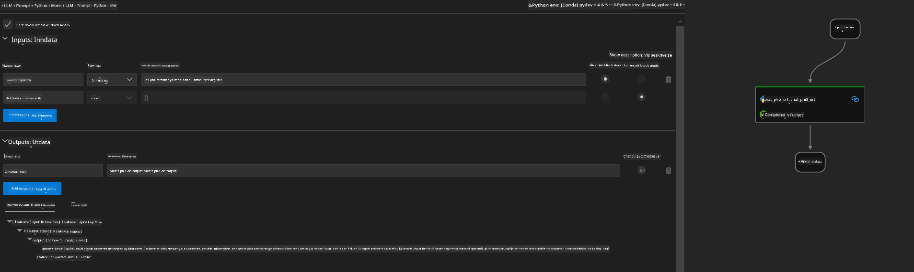
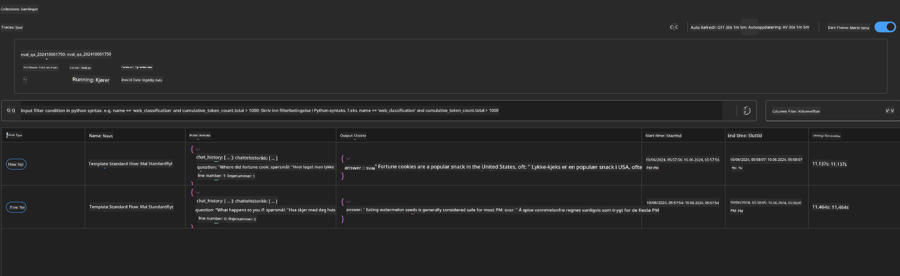

<!--
CO_OP_TRANSLATOR_METADATA:
{
  "original_hash": "92e7dac1e5af0dd7c94170fdaf6860fe",
  "translation_date": "2025-05-09T18:53:29+00:00",
  "source_file": "md/02.Application/01.TextAndChat/Phi3/UsingPromptFlowWithONNX.md",
  "language_code": "no"
}
-->
# Bruke Windows GPU for å lage Prompt flow-løsning med Phi-3.5-Instruct ONNX

Følgende dokument er et eksempel på hvordan man bruker PromptFlow med ONNX (Open Neural Network Exchange) for å utvikle AI-applikasjoner basert på Phi-3-modeller.

PromptFlow er en samling utviklingsverktøy designet for å effektivisere hele utviklingssyklusen for LLM-baserte (Large Language Model) AI-applikasjoner, fra idéutvikling og prototyping til testing og evaluering.

Ved å integrere PromptFlow med ONNX kan utviklere:

- Optimalisere modellens ytelse: Utnytt ONNX for effektiv modellinferenz og distribusjon.
- Forenkle utviklingen: Bruk PromptFlow til å administrere arbeidsflyten og automatisere repeterende oppgaver.
- Forbedre samarbeid: Legge til rette for bedre samarbeid blant teammedlemmer ved å tilby et enhetlig utviklingsmiljø.

**Prompt flow** er en samling utviklingsverktøy som er laget for å effektivisere hele utviklingssyklusen for LLM-baserte AI-applikasjoner, fra idéutvikling, prototyping, testing, evaluering til produksjonsdistribusjon og overvåking. Det gjør prompt engineering mye enklere og gjør det mulig å bygge LLM-apper med produksjonskvalitet.

Prompt flow kan kobles til OpenAI, Azure OpenAI Service, og tilpassbare modeller (Huggingface, lokale LLM/SLM). Vi håper å distribuere Phi-3.5 sin kvantiserte ONNX-modell til lokale applikasjoner. Prompt flow kan hjelpe oss med å planlegge virksomheten bedre og fullføre lokale løsninger basert på Phi-3.5. I dette eksemplet vil vi kombinere ONNX Runtime GenAI Library for å fullføre Prompt flow-løsningen basert på Windows GPU.

## **Installasjon**

### **ONNX Runtime GenAI for Windows GPU**

Les denne veiledningen for å sette opp ONNX Runtime GenAI for Windows GPU [klikk her](./ORTWindowGPUGuideline.md)

### **Sett opp Prompt flow i VSCode**

1. Installer Prompt flow VS Code Extension


2. Etter at du har installert Prompt flow VS Code Extension, klikk på utvidelsen, og velg **Installation dependencies** og følg denne veiledningen for å installere Prompt flow SDK i ditt miljø



3. Last ned [Sample Code](../../../../../../code/09.UpdateSamples/Aug/pf/onnx_inference_pf) og åpne dette eksemplet i VS Code



4. Åpne **flow.dag.yaml** for å velge ditt Python-miljø



   Åpne **chat_phi3_ort.py** for å endre plasseringen av din Phi-3.5-instruct ONNX-modell



5. Kjør din prompt flow for testing

Åpne **flow.dag.yaml** og klikk på visual editor



etter å ha klikket her, kjør det for å teste



1. Du kan kjøre batch i terminalen for å sjekke flere resultater


```bash

pf run create --file batch_run.yaml --stream --name 'Your eval qa name'    

```

Du kan sjekke resultatene i din standard nettleser




**Ansvarsfraskrivelse**:  
Dette dokumentet er oversatt ved hjelp av AI-oversettelsestjenesten [Co-op Translator](https://github.com/Azure/co-op-translator). Selv om vi streber etter nøyaktighet, vennligst vær oppmerksom på at automatiske oversettelser kan inneholde feil eller unøyaktigheter. Det opprinnelige dokumentet på dets opprinnelige språk bør betraktes som den autoritative kilden. For kritisk informasjon anbefales profesjonell menneskelig oversettelse. Vi er ikke ansvarlige for misforståelser eller feiltolkninger som oppstår ved bruk av denne oversettelsen.