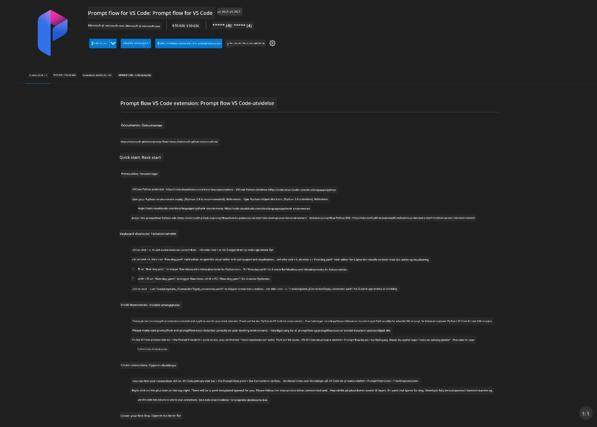
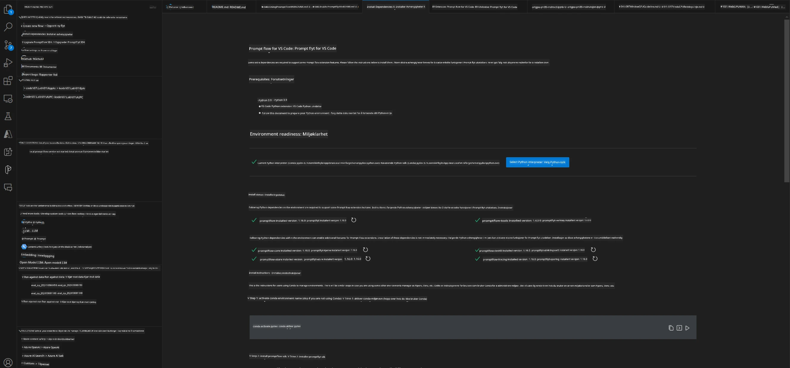
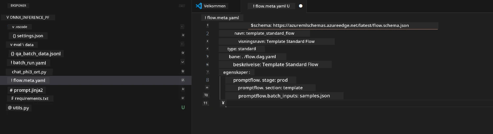
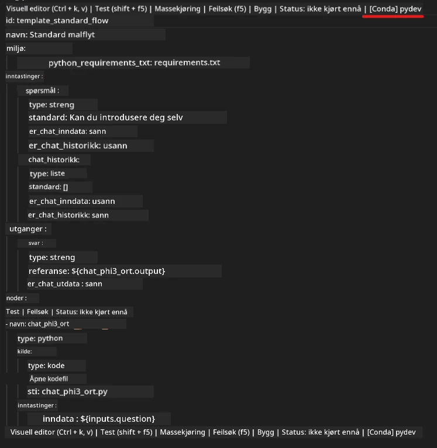
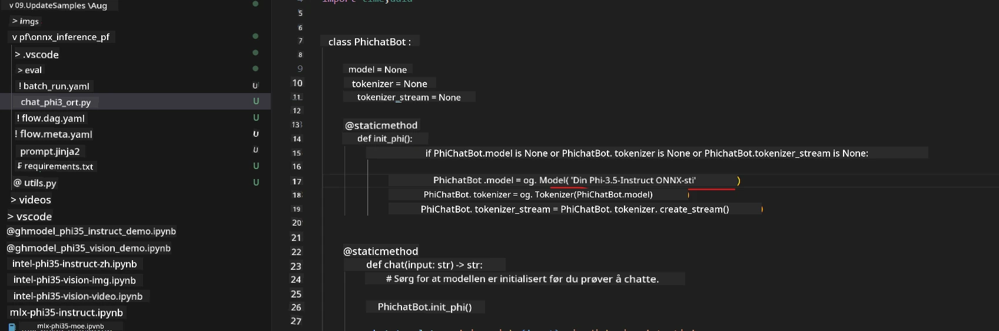
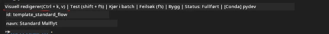
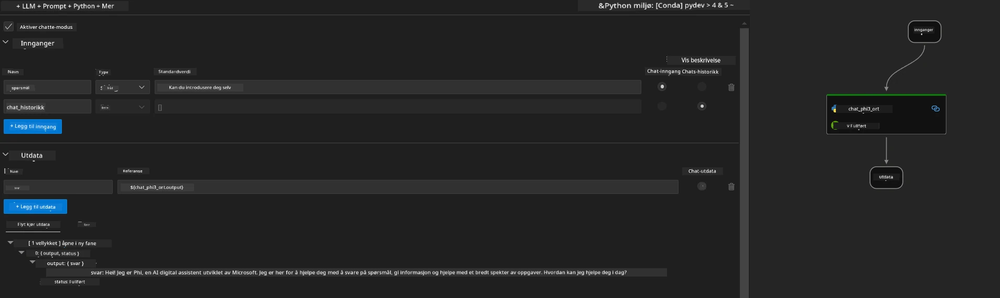
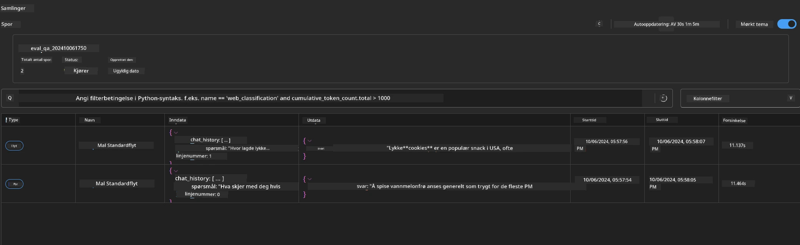

# Bruke Windows GPU for å lage Prompt flow-løsning med Phi-3.5-Instruct ONNX 

Følgende dokument er et eksempel på hvordan man bruker PromptFlow med ONNX (Open Neural Network Exchange) for å utvikle AI-applikasjoner basert på Phi-3 modeller.

PromptFlow er en verktøypakke designet for å effektivisere hele utviklingssyklusen for AI-applikasjoner basert på LLM (Large Language Model), fra idéutvikling og prototyping til testing og evaluering.

Ved å integrere PromptFlow med ONNX kan utviklere:

- Optimalisere modellens ytelse: Utnytte ONNX for effektiv modell-inferens og distribusjon.
- Forenkle utviklingen: Bruke PromptFlow for å administrere arbeidsflyten og automatisere repeterende oppgaver.
- Forbedre samarbeid: Legge til rette for bedre samarbeid mellom teammedlemmer ved å tilby et samlet utviklingsmiljø.

**Prompt flow** er en verktøypakke designet for å effektivisere hele utviklingssyklusen for LLM-baserte AI-applikasjoner, fra idé, prototyping, testing, evaluering til produksjonsdistribusjon og overvåking. Det gjør promptengineering mye enklere og lar deg bygge LLM-apper med produksjonskvalitet.

Prompt flow kan kobles til OpenAI, Azure OpenAI Service, og tilpassbare modeller (Huggingface, lokal LLM/SLM). Vi håper å distribuere Phi-3.5 sin kvantiserte ONNX-modell til lokale applikasjoner. Prompt flow kan hjelpe oss å planlegge virksomheten bedre og fullføre lokale løsninger basert på Phi-3.5. I dette eksemplet vil vi kombinere ONNX Runtime GenAI Library for å fullføre Prompt flow-løsningen basert på Windows GPU.

## **Installasjon**

### **ONNX Runtime GenAI for Windows GPU**

Les denne veiledningen for å sette opp ONNX Runtime GenAI for Windows GPU [klikk her](./ORTWindowGPUGuideline.md)

### **Sett opp Prompt flow i VSCode**

1. Installer Prompt flow VS Code Extension



2. Etter å ha installert Prompt flow VS Code Extension, klikk på utvidelsen, og velg **Installation dependencies** følg denne veiledningen for å installere Prompt flow SDK i ditt miljø



3. Last ned [Eksempelkode](../../../../../../code/09.UpdateSamples/Aug/pf/onnx_inference_pf) og åpne dette eksempelet i VS Code



4. Åpne **flow.dag.yaml** for å velge ditt Python-miljø



   Åpne **chat_phi3_ort.py** for å endre plasseringen til din Phi-3.5-instruct ONNX-modell



5. Kjør din prompt flow for testing

Åpne **flow.dag.yaml** og klikk på visual editor



etter å ha klikket dette, kjør det for å teste



1. Du kan kjøre batch i terminalen for å sjekke flere resultater


```bash

pf run create --file batch_run.yaml --stream --name 'Your eval qa name'    

```

Du kan sjekke resultater i din standard nettleser




---

<!-- CO-OP TRANSLATOR DISCLAIMER START -->
**Ansvarsfraskrivelse**:
Dette dokumentet er oversatt ved hjelp av AI-oversettelsestjenesten [Co-op Translator](https://github.com/Azure/co-op-translator). Selv om vi streber etter nøyaktighet, vær oppmerksom på at automatiske oversettelser kan inneholde feil eller unøyaktigheter. Det opprinnelige dokumentet på originalspråket skal betraktes som den autoritative kilden. For kritisk informasjon anbefales profesjonell menneskelig oversettelse. Vi er ikke ansvarlige for eventuelle misforståelser eller feiltolkninger som oppstår ved bruk av denne oversettelsen.
<!-- CO-OP TRANSLATOR DISCLAIMER END -->