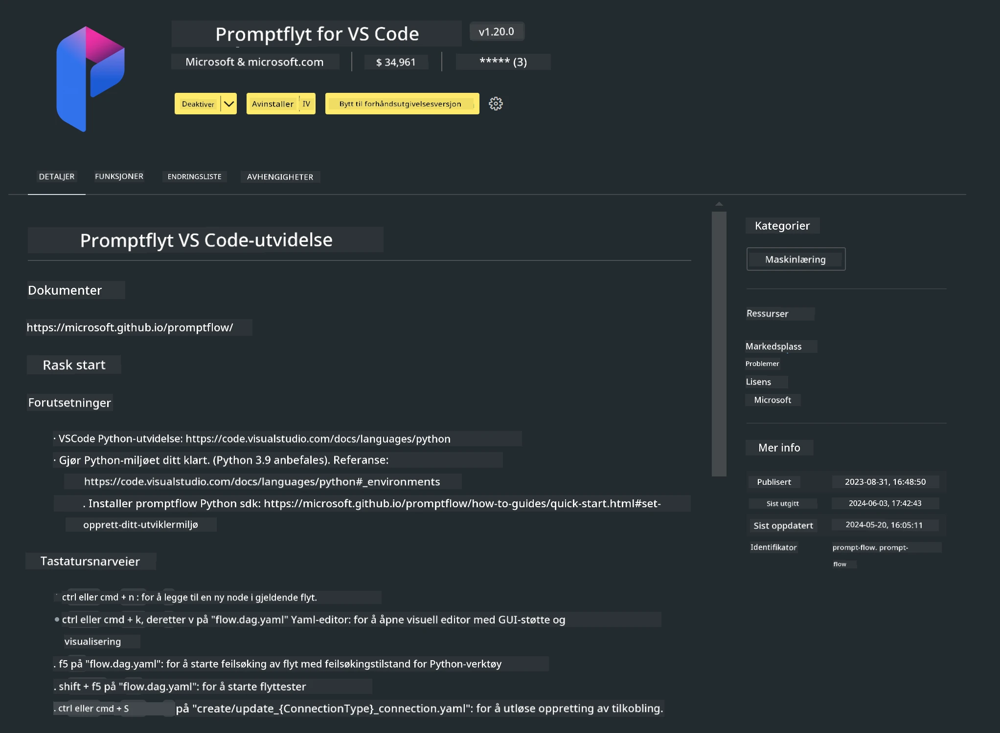

<!--
CO_OP_TRANSLATOR_METADATA:
{
  "original_hash": "a4ef39027902e82f2c33d568d2a2259a",
  "translation_date": "2025-07-17T03:51:04+00:00",
  "source_file": "md/02.Application/02.Code/Phi3/VSCodeExt/HOL/AIPC/01.Installations.md",
  "language_code": "no"
}
-->
# **Lab 0 - Installasjon**

Når vi går inn i laben, må vi konfigurere det relevante miljøet:


### **1. Python 3.11+**

Det anbefales å bruke miniforge for å sette opp Python-miljøet ditt

For å konfigurere miniforge, se [https://github.com/conda-forge/miniforge](https://github.com/conda-forge/miniforge)

Etter å ha konfigurert miniforge, kjør følgende kommando i Power Shell

```bash

conda create -n pyenv python==3.11.8 -y

conda activate pyenv

```


### **2. Installer Prompt flow SDK**

I Lab 1 bruker vi Prompt flow, så du må konfigurere Prompt flow SDK.

```bash

pip install promptflow --upgrade

```

Du kan sjekke promptflow sdk med denne kommandoen


```bash

pf --version

```

### **3. Installer Visual Studio Code Prompt flow Extension**




### **4. Intel NPU Acceleration Library**

Intels nye generasjons prosessorer støtter NPU. Hvis du vil bruke NPU for å kjøre LLMs / SLMs lokalt, kan du bruke ***Intel NPU Acceleration Library***. Hvis du vil vite mer, kan du lese [https://github.com/microsoft/PhiCookBook/blob/main/md/01.Introduction/03/AIPC_Inference.md](https://github.com/microsoft/PhiCookBook/blob/main/md/01.Introduction/03/AIPC_Inference.md).

Installer Intel NPU Acceleration Library i bash


```bash

pip install intel-npu-acceleration-library

```

***Merk***: Vær oppmerksom på at dette biblioteket støtter transformers ***4.40.2***, vennligst bekreft versjonen


### **5. Andre Python-biblioteker**


lag requirements.txt og legg til dette innholdet

```txt

notebook
numpy 
scipy 
scikit-learn 
matplotlib 
pandas 
pillow 
graphviz

```


### **6. Installer NVM**

installer nvm i Powershell


```bash

winget install -e --id CoreyButler.NVMforWindows

```

installer nodejs 18.20


```bash

nvm install 18.20.0

nvm use 18.20.0

```

### **7. Installer Visual Studio Code Development Support**


```bash

npm install --global yo generator-code

```

Gratulerer! Du har nå konfigurert SDK-en. Gå videre til de praktiske stegene.

**Ansvarsfraskrivelse**:  
Dette dokumentet er oversatt ved hjelp av AI-oversettelsestjenesten [Co-op Translator](https://github.com/Azure/co-op-translator). Selv om vi streber etter nøyaktighet, vennligst vær oppmerksom på at automatiske oversettelser kan inneholde feil eller unøyaktigheter. Det opprinnelige dokumentet på originalspråket skal anses som den autoritative kilden. For kritisk informasjon anbefales profesjonell menneskelig oversettelse. Vi er ikke ansvarlige for eventuelle misforståelser eller feiltolkninger som oppstår ved bruk av denne oversettelsen.