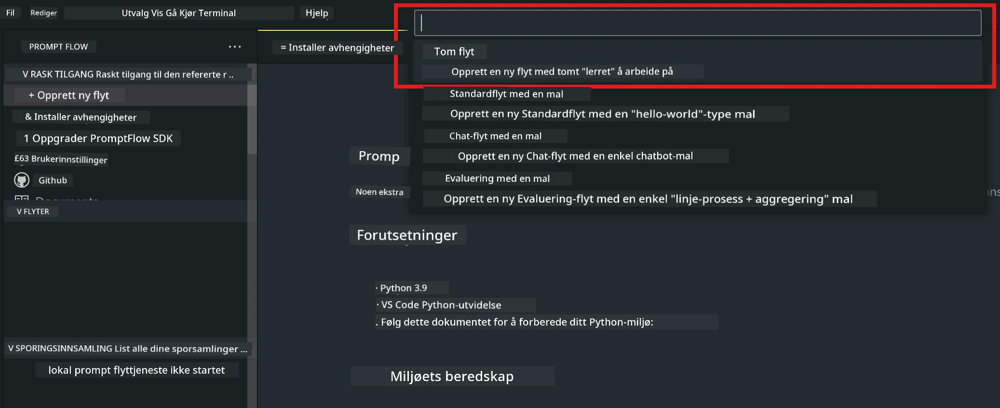
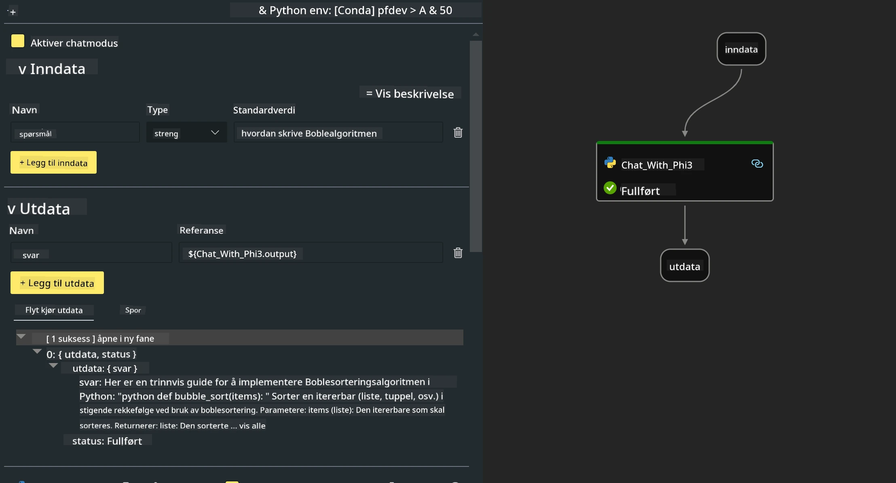

# **Lab 2 - Kjør Prompt flow med Phi-3-mini i AIPC**

## **Hva er Prompt flow**

Prompt flow er en samling utviklingsverktøy designet for å effektivisere hele utviklingssyklusen for LLM-baserte AI-applikasjoner, fra idéutvikling, prototyping, testing, evaluering til produksjonssetting og overvåking. Det gjør prompt engineering mye enklere og lar deg bygge LLM-apper med produksjonskvalitet.

Med prompt flow kan du:

- Lage flyter som kobler sammen LLM-er, prompts, Python-kode og andre verktøy i en kjørbar arbeidsflyt.

- Feilsøke og iterere flytene dine, spesielt interaksjonen med LLM-er, på en enkel måte.

- Evaluere flytene dine, beregne kvalitets- og ytelsesmetrikker med større datasett.

- Integrere testing og evaluering i CI/CD-systemet ditt for å sikre kvaliteten på flyten.

- Distribuere flytene dine til den serveringsplattformen du velger, eller enkelt integrere dem i appens kodebase.

- (Valgfritt, men sterkt anbefalt) Samarbeide med teamet ditt ved å bruke skyversjonen av Prompt flow i Azure AI.

## **Hva er AIPC**

En AI-PC har en CPU, en GPU og en NPU, hver med spesifikke AI-akselerasjonsmuligheter. En NPU, eller neural processing unit, er en spesialisert akselerator som håndterer kunstig intelligens (AI) og maskinlæring (ML) direkte på PC-en din i stedet for å sende data til skyen for behandling. GPU og CPU kan også håndtere disse oppgavene, men NPU-en er spesielt god på AI-beregninger med lavt strømforbruk. AI-PC-en representerer et grunnleggende skifte i hvordan datamaskinene våre fungerer. Det er ikke en løsning på et problem som ikke eksisterte før, men lover å bli en stor forbedring for daglig bruk av PC.

Hvordan fungerer det? Sammenlignet med generativ AI og de enorme store språkmodellene (LLM-er) trent på enorme mengder offentlig data, er AI som kjører på PC-en din mer tilgjengelig på nesten alle nivåer. Konseptet er lettere å forstå, og siden det trenes på dine data uten behov for skytilgang, er fordelene mer umiddelbart attraktive for et bredere publikum.

På kort sikt innebærer AI-PC-verdenen personlige assistenter og mindre AI-modeller som kjører direkte på PC-en din, bruker dine data for å tilby personlig, privat og mer sikker AI-forbedring for ting du allerede gjør hver dag – ta møteprotokoller, organisere en fantasy football-liga, automatisere forbedringer for foto- og videoredigering, eller legge opp den perfekte reiseruten for en familiegjenforening basert på alles ankomst- og avreisetider.

## **Bygge generasjonskode-flyter på AIPC**

***Note*** ：Hvis du ikke har fullført miljøinstallasjonen, vennligst besøk [Lab 0 -Installations](./01.Installations.md)

1. Åpne Prompt flow-utvidelsen i Visual Studio Code og opprett et tomt flytprosjekt



2. Legg til Inputs og Outputs parametere og legg til Python-kode som ny flyt



Du kan bruke denne strukturen (flow.dag.yaml) som referanse for å bygge flyten din

```yaml

inputs:
  question:
    type: string
    default: how to write Bubble Algorithm
outputs:
  answer:
    type: string
    reference: ${Chat_With_Phi3.output}
nodes:
- name: Chat_With_Phi3
  type: python
  source:
    type: code
    path: Chat_With_Phi3.py
  inputs:
    question: ${inputs.question}


```

3. Legg til kode i ***Chat_With_Phi3.py***

```python


from promptflow.core import tool

# import torch
from transformers import AutoTokenizer, pipeline,TextStreamer
import intel_npu_acceleration_library as npu_lib

import warnings

import asyncio
import platform

class Phi3CodeAgent:
    
    model = None
    tokenizer = None
    text_streamer = None
    
    model_id = "microsoft/Phi-3-mini-4k-instruct"

    @staticmethod
    def init_phi3():
        
        if Phi3CodeAgent.model is None or Phi3CodeAgent.tokenizer is None or Phi3CodeAgent.text_streamer is None:
            Phi3CodeAgent.model = npu_lib.NPUModelForCausalLM.from_pretrained(
                                    Phi3CodeAgent.model_id,
                                    torch_dtype="auto",
                                    dtype=npu_lib.int4,
                                    trust_remote_code=True
                                )
            Phi3CodeAgent.tokenizer = AutoTokenizer.from_pretrained(Phi3CodeAgent.model_id)
            Phi3CodeAgent.text_streamer = TextStreamer(Phi3CodeAgent.tokenizer, skip_prompt=True)

    

    @staticmethod
    def chat_with_phi3(prompt):
        
        Phi3CodeAgent.init_phi3()

        messages = "<|system|>You are a AI Python coding assistant. Please help me to generate code in Python.The answer only genertated Python code, but any comments and instructions do not need to be generated<|end|><|user|>" + prompt +"<|end|><|assistant|>"


        generation_args = {
            "max_new_tokens": 1024,
            "return_full_text": False,
            "temperature": 0.3,
            "do_sample": False,
            "streamer": Phi3CodeAgent.text_streamer,
        }

        pipe = pipeline(
            "text-generation",
            model=Phi3CodeAgent.model,
            tokenizer=Phi3CodeAgent.tokenizer,
            # **generation_args
        )

        result = ''

        with warnings.catch_warnings():
            warnings.simplefilter("ignore")
            response = pipe(messages, **generation_args)
            result =response[0]['generated_text']
            return result


@tool
def my_python_tool(question: str) -> str:
    if platform.system() == 'Windows':
        asyncio.set_event_loop_policy(asyncio.WindowsSelectorEventLoopPolicy())
    return Phi3CodeAgent.chat_with_phi3(question)


```

4. Du kan teste flyten fra Debug eller Run for å sjekke om generasjonskoden fungerer som den skal


5. Kjør flyten som utviklings-API i terminalen

```

pf flow serve --source ./ --port 8080 --host localhost   

```

Du kan teste det i Postman / Thunder Client

### **Note**

1. Første kjøring tar lang tid. Det anbefales å laste ned phi-3-modellen fra Hugging face CLI.

2. Med tanke på den begrensede regnekraften til Intel NPU, anbefales det å bruke Phi-3-mini-4k-instruct.

3. Vi bruker Intel NPU-akselerasjon for å kvantisere INT4-konvertering, men hvis du kjører tjenesten på nytt, må du slette cache- og nc_workshop-mappene.

## **Ressurser**

1. Lær Promptflow [https://microsoft.github.io/promptflow/](https://microsoft.github.io/promptflow/)

2. Lær Intel NPU Acceleration [https://github.com/intel/intel-npu-acceleration-library](https://github.com/intel/intel-npu-acceleration-library)

3. Eksempelkode, last ned [Local NPU Agent Sample Code](../../../../../../../../../code/07.Lab/01/AIPC)

**Ansvarsfraskrivelse**:  
Dette dokumentet er oversatt ved hjelp av AI-oversettelsestjenesten [Co-op Translator](https://github.com/Azure/co-op-translator). Selv om vi streber etter nøyaktighet, vennligst vær oppmerksom på at automatiske oversettelser kan inneholde feil eller unøyaktigheter. Det opprinnelige dokumentet på originalspråket skal anses som den autoritative kilden. For kritisk informasjon anbefales profesjonell menneskelig oversettelse. Vi er ikke ansvarlige for eventuelle misforståelser eller feiltolkninger som oppstår ved bruk av denne oversettelsen.