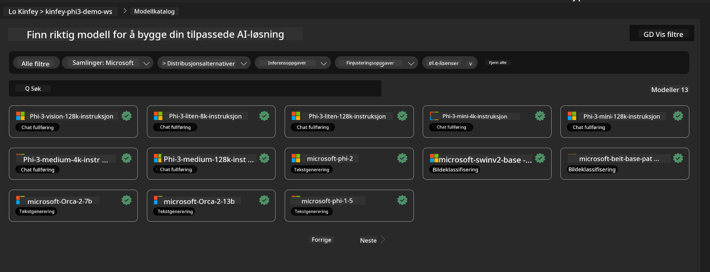
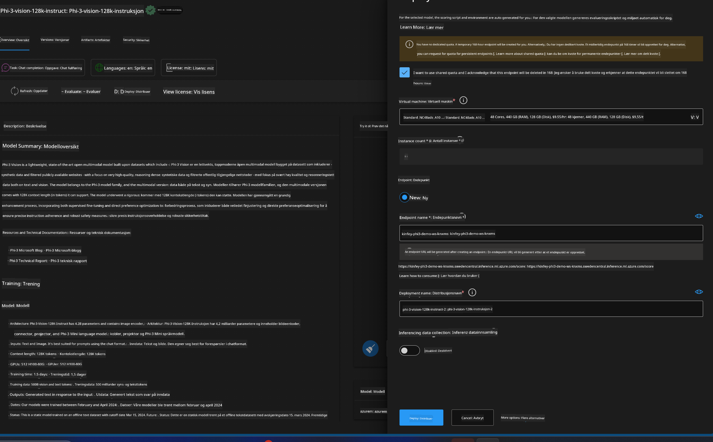
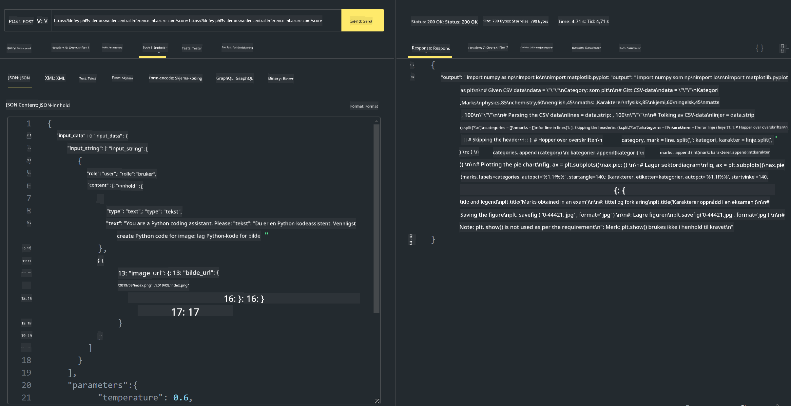

<!--
CO_OP_TRANSLATOR_METADATA:
{
  "original_hash": "20cb4e6ac1686248e8be913ccf6c2bc2",
  "translation_date": "2025-07-17T04:34:04+00:00",
  "source_file": "md/02.Application/02.Code/Phi3/VSCodeExt/HOL/Apple/03.DeployPhi3VisionOnAzure.md",
  "language_code": "no"
}
-->
# **Lab 3 - Distribuer Phi-3-vision på Azure Machine Learning Service**

Vi bruker NPU for å fullføre produksjonsdistribusjonen av lokal kode, og deretter ønsker vi å introdusere muligheten til å bruke PHI-3-VISION gjennom den for å generere kode fra bilder.

I denne introduksjonen kan vi raskt bygge en Model As Service Phi-3 Vision-tjeneste i Azure Machine Learning Service.

***Note***: Phi-3 Vision krever regnekraft for å generere innhold raskere. Vi trenger skybasert regnekraft for å hjelpe oss med dette.


### **1. Opprett Azure Machine Learning Service**

Vi må opprette en Azure Machine Learning Service i Azure-portalen. Hvis du vil lære hvordan, besøk denne lenken [https://learn.microsoft.com/azure/machine-learning/quickstart-create-resources?view=azureml-api-2](https://learn.microsoft.com/azure/machine-learning/quickstart-create-resources?view=azureml-api-2)


### **2. Velg Phi-3 Vision i Azure Machine Learning Service**




### **3. Distribuer Phi-3-Vision i Azure**





### **4. Test Endepunkt i Postman**





***Note***

1. Parameterne som skal sendes må inkludere Authorization, azureml-model-deployment og Content-Type. Du må sjekke distribusjonsinformasjonen for å få tak i disse.

2. For å sende parametere må Phi-3-Vision sende en bildelenke. Se på GPT-4-Vision-metoden for å sende parametere, for eksempel

```json

{
  "input_data":{
    "input_string":[
      {
        "role":"user",
        "content":[ 
          {
            "type": "text",
            "text": "You are a Python coding assistant.Please create Python code for image "
          },
          {
              "type": "image_url",
              "image_url": {
                "url": "https://ajaytech.co/wp-content/uploads/2019/09/index.png"
              }
          }
        ]
      }
    ],
    "parameters":{
          "temperature": 0.6,
          "top_p": 0.9,
          "do_sample": false,
          "max_new_tokens": 2048
    }
  }
}

```

3. Kall **/score** med Post-metoden

**Gratulerer**! Du har fullført rask distribusjon av PHI-3-VISION og prøvd hvordan du kan bruke bilder til å generere kode. Neste steg er å bygge applikasjoner i kombinasjon med NPUer og skyen.

**Ansvarsfraskrivelse**:  
Dette dokumentet er oversatt ved hjelp av AI-oversettelsestjenesten [Co-op Translator](https://github.com/Azure/co-op-translator). Selv om vi streber etter nøyaktighet, vennligst vær oppmerksom på at automatiske oversettelser kan inneholde feil eller unøyaktigheter. Det opprinnelige dokumentet på originalspråket skal anses som den autoritative kilden. For kritisk informasjon anbefales profesjonell menneskelig oversettelse. Vi er ikke ansvarlige for eventuelle misforståelser eller feiltolkninger som oppstår ved bruk av denne oversettelsen.