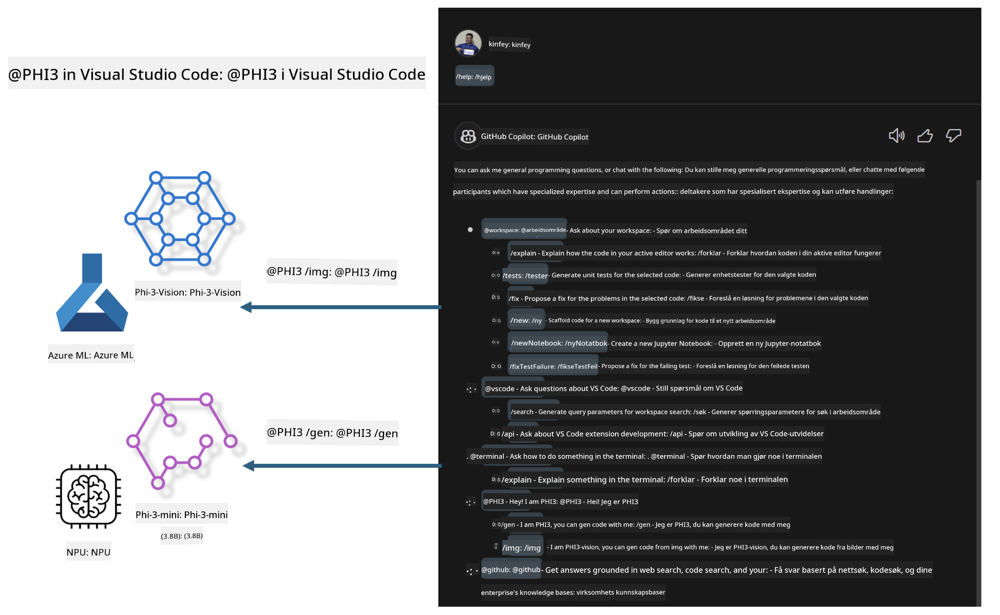

<!--
CO_OP_TRANSLATOR_METADATA:
{
  "original_hash": "00b7a699de8ac405fa821f4c0f7fc0ab",
  "translation_date": "2025-05-09T19:14:14+00:00",
  "source_file": "md/02.Application/02.Code/Phi3/VSCodeExt/README.md",
  "language_code": "no"
}
-->
# **Bygg din egen Visual Studio Code GitHub Copilot Chat med Microsoft Phi-3-familien**

Har du brukt arbeidsområdeagenten i GitHub Copilot Chat? Ønsker du å bygge din egen teams kodeagent? Denne praktiske laben håper å kombinere den åpne kildekodemodellen for å bygge en bedriftsnivå kodeforretningsagent.

## **Grunnlag**

### **Hvorfor velge Microsoft Phi-3**

Phi-3 er en familiserie, som inkluderer phi-3-mini, phi-3-small og phi-3-medium basert på ulike treningsparametere for tekstgenerering, dialogfullføring og kodegenerering. Det finnes også phi-3-vision basert på Vision. Den passer for bedrifter eller forskjellige team som ønsker å lage offline generative AI-løsninger.

Anbefales å lese denne lenken [https://github.com/microsoft/PhiCookBook/blob/main/md/01.Introduction/01/01.PhiFamily.md](https://github.com/microsoft/PhiCookBook/blob/main/md/01.Introduction/01/01.PhiFamily.md)

### **Microsoft GitHub Copilot Chat**

GitHub Copilot Chat-utvidelsen gir deg et chattegrensesnitt som lar deg samhandle med GitHub Copilot og få svar på kode-relaterte spørsmål direkte i VS Code, uten at du trenger å navigere i dokumentasjon eller søke i nettfora.

Copilot Chat kan bruke syntaksutheving, innrykk og andre formateringsfunksjoner for å gjøre svaret tydeligere. Avhengig av typen spørsmål fra brukeren kan resultatet inneholde lenker til kontekst som Copilot brukte for å generere svaret, som kildekodefiler eller dokumentasjon, eller knapper for å få tilgang til VS Code-funksjonalitet.

- Copilot Chat integreres i utviklerflyten din og gir deg hjelp der du trenger det:

- Start en inline chat-samtale direkte fra editoren eller terminalen for hjelp mens du koder

- Bruk Chat-visningen for å ha en AI-assistent ved siden av som kan hjelpe deg når som helst

- Start Quick Chat for å stille et raskt spørsmål og komme tilbake til arbeidet ditt

Du kan bruke GitHub Copilot Chat i ulike scenarier, som:

- Svare på kode-relaterte spørsmål om hvordan man best løser et problem

- Forklare andres kode og foreslå forbedringer

- Foreslå kodefikser

- Generere enhetstesttilfeller

- Generere kodedokumentasjon

Anbefales å lese denne lenken [https://code.visualstudio.com/docs/copilot/copilot-chat](https://code.visualstudio.com/docs/copilot/copilot-chat?WT.mc_id=aiml-137032-kinfeylo)

###  **Microsoft GitHub Copilot Chat @workspace**

Å referere til **@workspace** i Copilot Chat lar deg stille spørsmål om hele kodebasen din. Basert på spørsmålet henter Copilot intelligent relevante filer og symboler, som den deretter refererer til i svaret som lenker og kodeeksempler.

For å svare på spørsmålet ditt søker **@workspace** gjennom de samme kildene en utvikler ville brukt når de navigerer i en kodebase i VS Code:

- Alle filer i arbeidsområdet, bortsett fra filer som er ignorert av en .gitignore-fil

- Katalogstruktur med nestede mapper og filnavn

- GitHubs kodeindeks, hvis arbeidsområdet er et GitHub-repositorium og indeksert av kode-søk

- Symboler og definisjoner i arbeidsområdet

- For øyeblikket valgt tekst eller synlig tekst i aktiv editor

Merk: .gitignore ignoreres hvis du har en fil åpen eller har valgt tekst i en ignorert fil.

Anbefales å lese denne lenken [[https://code.visualstudio.com/docs/copilot/copilot-chat](https://code.visualstudio.com/docs/copilot/workspace-context?WT.mc_id=aiml-137032-kinfeylo)]

## **Lær mer om denne laben**

GitHub Copilot har i stor grad forbedret programmeringseffektiviteten i bedrifter, og alle bedrifter ønsker å tilpasse relevante funksjoner i GitHub Copilot. Mange bedrifter har tilpasset Extensions som ligner på GitHub Copilot basert på sine egne forretningsscenarier og åpne kildekodemodeller. For bedrifter er tilpassede Extensions enklere å kontrollere, men dette påvirker også brukeropplevelsen. Tross alt har GitHub Copilot sterkere funksjoner for å håndtere generelle scenarier og faglig dyktighet. Hvis opplevelsen kan holdes konsistent, vil det være bedre å tilpasse bedriftens egen Extension. GitHub Copilot Chat tilbyr relevante APIer for at bedrifter skal kunne utvide chat-opplevelsen. Å opprettholde en konsistent opplevelse og samtidig ha tilpassede funksjoner gir en bedre brukeropplevelse.

Denne laben bruker hovedsakelig Phi-3-modellen kombinert med lokal NPU og Azure hybrid for å bygge en tilpasset Agent i GitHub Copilot Chat ***@PHI3*** for å hjelpe bedriftsutviklere med å fullføre kodegenerering ***(@PHI3 /gen)*** og generere kode basert på bilder ***(@PHI3 /img)***.

### ***Merk:*** 

Denne laben er for øyeblikket implementert på AIPC for Intel CPU og Apple Silicon. Vi vil fortsette å oppdatere Qualcomm-versjonen av NPU.

## **Lab**

| Navn | Beskrivelse | AIPC | Apple |
| ------------ | ----------- | -------- |-------- |
| Lab0 - Installasjoner(✅) | Konfigurer og installer relaterte miljøer og installasjonsverktøy | [Go](./HOL/AIPC/01.Installations.md) |[Go](./HOL/Apple/01.Installations.md) |
| Lab1 - Kjør Prompt flow med Phi-3-mini (✅) | Kombinert med AIPC / Apple Silicon, bruk lokal NPU for å lage kodegenerering gjennom Phi-3-mini | [Go](./HOL/AIPC/02.PromptflowWithNPU.md) |  [Go](./HOL/Apple/02.PromptflowWithMLX.md) |
| Lab2 - Distribuer Phi-3-vision på Azure Machine Learning Service(✅) | Generer kode ved å distribuere Azure Machine Learning Services Model Catalog - Phi-3-vision bilde | [Go](./HOL/AIPC/03.DeployPhi3VisionOnAzure.md) |[Go](./HOL/Apple/03.DeployPhi3VisionOnAzure.md) |
| Lab3 - Lag en @phi-3 agent i GitHub Copilot Chat(✅)  | Lag en tilpasset Phi-3 agent i GitHub Copilot Chat for å fullføre kodegenerering, grafgenereringskode, RAG, osv. | [Go](./HOL/AIPC/04.CreatePhi3AgentInVSCode.md) | [Go](./HOL/Apple/04.CreatePhi3AgentInVSCode.md) |
| Eksempelkode (✅)  | Last ned eksempelkode | [Go](../../../../../../../code/07.Lab/01/AIPC) | [Go](../../../../../../../code/07.Lab/01/Apple) |

## **Ressurser**

1. Phi-3 Cookbook [https://github.com/microsoft/Phi-3CookBook](https://github.com/microsoft/Phi-3CookBook)

2. Lær mer om GitHub Copilot [https://learn.microsoft.com/training/paths/copilot/](https://learn.microsoft.com/training/paths/copilot/?WT.mc_id=aiml-137032-kinfeylo)

3. Lær mer om GitHub Copilot Chat [https://learn.microsoft.com/training/paths/accelerate-app-development-using-github-copilot/](https://learn.microsoft.com/training/paths/accelerate-app-development-using-github-copilot/?WT.mc_id=aiml-137032-kinfeylo)

4. Lær mer om GitHub Copilot Chat API [https://code.visualstudio.com/api/extension-guides/chat](https://code.visualstudio.com/api/extension-guides/chat?WT.mc_id=aiml-137032-kinfeylo)

5. Lær mer om Azure AI Foundry [https://learn.microsoft.com/training/paths/create-custom-copilots-ai-studio/](https://learn.microsoft.com/training/paths/create-custom-copilots-ai-studio/?WT.mc_id=aiml-137032-kinfeylo)

6. Lær mer om Azure AI Foundrys Model Catalog [https://learn.microsoft.com/azure/ai-studio/how-to/model-catalog-overview](https://learn.microsoft.com/azure/ai-studio/how-to/model-catalog-overview)

**Ansvarsfraskrivelse**:  
Dette dokumentet er oversatt ved hjelp av AI-oversettelsestjenesten [Co-op Translator](https://github.com/Azure/co-op-translator). Selv om vi streber etter nøyaktighet, vennligst vær oppmerksom på at automatiske oversettelser kan inneholde feil eller unøyaktigheter. Det opprinnelige dokumentet på originalspråket skal betraktes som den autoritative kilden. For kritisk informasjon anbefales profesjonell menneskelig oversettelse. Vi er ikke ansvarlige for eventuelle misforståelser eller feiltolkninger som oppstår ved bruk av denne oversettelsen.