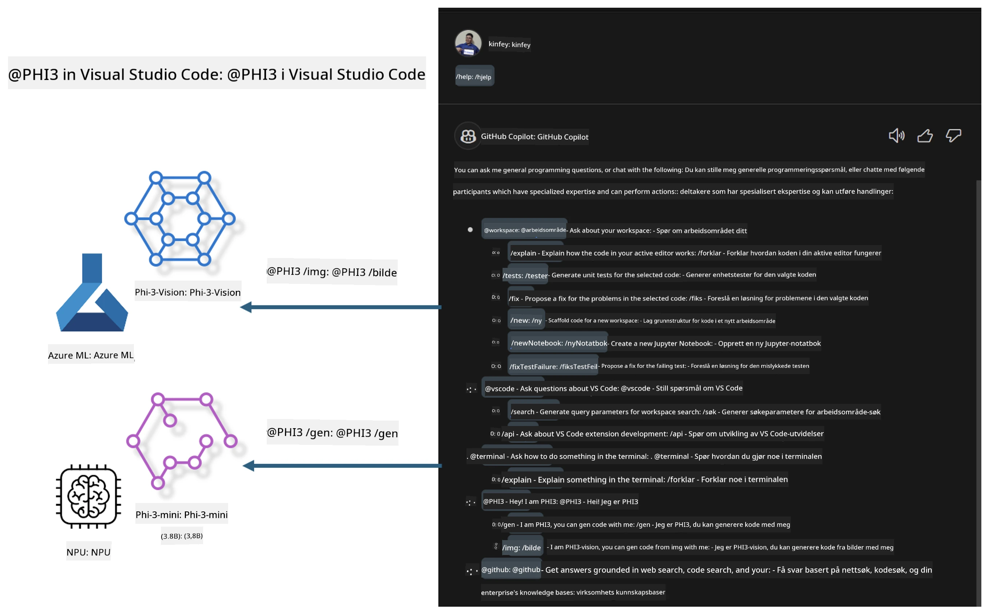

# **Bygg din egen Visual Studio Code GitHub Copilot Chat med Microsoft Phi-3 familien**

Har du brukt arbeidsromagenten i GitHub Copilot Chat? Ønsker du å bygge ditt eget teams kodeagent? Dette praktiske laboratoriet håper å kombinere den åpne kildekodemodellen for å bygge en bedriftsnivå kodeforretningsagent.

## **Grunnlag**

### **Hvorfor velge Microsoft Phi-3**

Phi-3 er en familiebaserte serie, inkludert phi-3-mini, phi-3-small og phi-3-medium basert på forskjellige treningsparametere for tekstgenerering, dialogfullføring og kodegenerering. Det finnes også phi-3-vision basert på Vision. Det passer for bedrifter eller forskjellige team for å lage offline generativ AI-løsninger.

Anbefalt å lese denne linken [https://github.com/microsoft/PhiCookBook/blob/main/md/01.Introduction/01/01.PhiFamily.md](https://github.com/microsoft/PhiCookBook/blob/main/md/01.Introduction/01/01.PhiFamily.md)

### **Microsoft GitHub Copilot Chat**

GitHub Copilot Chat-utvidelsen gir deg et chattegrensesnitt som lar deg samhandle med GitHub Copilot og motta svar på kode-relaterte spørsmål direkte i VS Code, uten at du trenger å navigere i dokumentasjon eller søke i nettfora.

Copilot Chat kan bruke syntaksutheving, innrykk og andre formateringsfunksjoner for å gjøre det genererte svaret klarere. Avhengig av typen spørsmål fra brukeren kan resultatet inneholde lenker til kontekst som Copilot brukte for å generere et svar, som kildekodefiler eller dokumentasjon, eller knapper for å få tilgang til VS Codes funksjonalitet.

- Copilot Chat integreres i din utviklerflyt og gir deg hjelp der du trenger det:

- Start en inline chatte-samtale direkte fra editoren eller terminalen for hjelp mens du koder

- Bruk Chat-visningen for å ha en AI-assistent på siden til å hjelpe deg når som helst

- Start Quick Chat for å stille et raskt spørsmål og komme tilbake til det du holdt på med

Du kan bruke GitHub Copilot Chat i forskjellige scenarioer, som:

- Besvare kode-spørsmål om hvordan man best løser et problem

- Forklare andres kode og foreslå forbedringer

- Foreslå kodefikser

- Generere enhetstester

- Generere kode-dokumentasjon

Anbefalt å lese denne linken [https://code.visualstudio.com/docs/copilot/copilot-chat](https://code.visualstudio.com/docs/copilot/copilot-chat?WT.mc_id=aiml-137032-kinfeylo)

###  **Microsoft GitHub Copilot Chat @workspace**

Å referere til **@workspace** i Copilot Chat lar deg stille spørsmål om hele kodebasen din. Basert på spørsmålet henter Copilot intelligent relevante filer og symboler, som den deretter refererer til i sitt svar som lenker og kodeeksempler.

For å svare på spørsmålet ditt søker **@workspace** gjennom de samme kildene en utvikler ville brukt ved navigering i en kodebase i VS Code:

- Alle filer i arbeidsområdet, bortsett fra filer som er ignorert av en .gitignore-fil

- Katalogstruktur med nestede mapper og filnavn

- GitHubs kode-søkeindeks, hvis arbeidsområdet er et GitHub-repositorium og indeksert av kode-søk

- Symboler og definisjoner i arbeidsområdet

- Nåværende valgte tekst eller synlig tekst i den aktive editoren

Merk: .gitignore ignoreres hvis du har en fil åpen eller har tekst valgt i en ignorert fil.

Anbefalt å lese denne linken [[https://code.visualstudio.com/docs/copilot/copilot-chat](https://code.visualstudio.com/docs/copilot/workspace-context?WT.mc_id=aiml-137032-kinfeylo)]

## **Lær mer om dette laboratoriet**

GitHub Copilot har i stor grad forbedret programmeringseffektiviteten i bedrifter, og hver bedrift håper å tilpasse relevante funksjoner i GitHub Copilot. Mange bedrifter har tilpasset utvidelser som ligner på GitHub Copilot basert på sine egne forretningsscenarioer og åpne kildekodemodeller. For bedrifter er tilpassede utvidelser enklere å kontrollere, men dette påvirker også brukeropplevelsen. Tross alt har GitHub Copilot sterkere funksjoner i å håndtere generelle scenarioer og profesjonalitet. Hvis opplevelsen kan holdes konsekvent, ville det være bedre å tilpasse bedriftens egen utvidelse. GitHub Copilot Chat tilbyr relevante API-er for bedrifter å utvide chatteopplevelsen. Å opprettholde en konsistent opplevelse og ha tilpassede funksjoner gir en bedre brukeropplevelse.

Dette laboratoriet bruker hovedsakelig Phi-3-modellen kombinert med lokal NPU og Azure hybrid for å bygge en tilpasset agent i GitHub Copilot Chat ***@PHI3*** for å assistere bedriftsutviklere med å fullføre kodegenerering***(@PHI3 /gen)*** og generere kode basert på bilder ***(@PHI3 /img)***.

### ***Merk:*** 

Dette laboratoriet er for øyeblikket implementert på AIPC av Intel CPU og Apple Silicon. Vi vil fortsette å oppdatere Qualcomm-versjonen av NPU.

## **Laboratorium**

| Navn | Beskrivelse | AIPC | Apple |
| ------------ | ----------- | -------- |-------- |
| Lab0 - Installeringer(✅) | Konfigurer og installer relaterte miljøer og installasjonsverktøy | [Gå](./HOL/AIPC/01.Installations.md) |[Gå](./HOL/Apple/01.Installations.md) |
| Lab1 - Kjør Prompt flow med Phi-3-mini (✅) | Kombinert med AIPC / Apple Silicon, bruk lokal NPU for å skape kodegenerering gjennom Phi-3-mini | [Gå](./HOL/AIPC/02.PromptflowWithNPU.md) |  [Gå](./HOL/Apple/02.PromptflowWithMLX.md) |
| Lab2 - Distribuer Phi-3-vision på Azure Machine Learning Service(✅) | Generer kode ved å distribuere Azure Machine Learning Services Model Catalog - Phi-3-vision bilde | [Gå](./HOL/AIPC/03.DeployPhi3VisionOnAzure.md) |[Gå](./HOL/Apple/03.DeployPhi3VisionOnAzure.md) |
| Lab3 - Lag en @phi-3 agent i GitHub Copilot Chat(✅)  | Lag en tilpasset Phi-3-agent i GitHub Copilot Chat for å fullføre kodegenerering, grafgenereringskode, RAG, etc. | [Gå](./HOL/AIPC/04.CreatePhi3AgentInVSCode.md) | [Gå](./HOL/Apple/04.CreatePhi3AgentInVSCode.md) |
| Eksempelkode (✅)  | Last ned eksempelkode | [Gå](../../../../../../../code/07.Lab/01/AIPC) | [Gå](../../../../../../../code/07.Lab/01/Apple) |

## **Ressurser**

1. Phi-3 Cookbook [https://github.com/microsoft/Phi-3CookBook](https://github.com/microsoft/Phi-3CookBook)

2. Lær mer om GitHub Copilot [https://learn.microsoft.com/training/paths/copilot/](https://learn.microsoft.com/training/paths/copilot/?WT.mc_id=aiml-137032-kinfeylo)

3. Lær mer om GitHub Copilot Chat [https://learn.microsoft.com/training/paths/accelerate-app-development-using-github-copilot/](https://learn.microsoft.com/training/paths/accelerate-app-development-using-github-copilot/?WT.mc_id=aiml-137032-kinfeylo)

4. Lær mer om GitHub Copilot Chat API [https://code.visualstudio.com/api/extension-guides/chat](https://code.visualstudio.com/api/extension-guides/chat?WT.mc_id=aiml-137032-kinfeylo)

5. Lær mer om Microsoft Foundry [https://learn.microsoft.com/training/paths/create-custom-copilots-ai-studio/](https://learn.microsoft.com/training/paths/create-custom-copilots-ai-studio/?WT.mc_id=aiml-137032-kinfeylo)

6. Lær mer om Microsoft Foundrys Model Catalog [https://learn.microsoft.com/azure/ai-studio/how-to/model-catalog-overview](https://learn.microsoft.com/azure/ai-studio/how-to/model-catalog-overview)

---

<!-- CO-OP TRANSLATOR DISCLAIMER START -->
**Ansvarsfraskrivelse**:
Dette dokumentet er oversatt ved hjelp av AI-oversettingstjenesten [Co-op Translator](https://github.com/Azure/co-op-translator). Selv om vi tilstreber nøyaktighet, vennligst vær oppmerksom på at automatiske oversettelser kan inneholde feil eller unøyaktigheter. Det originale dokumentet på dets opprinnelige språk bør anses som den autoritative kilden. For kritisk informasjon anbefales profesjonell menneskelig oversettelse. Vi er ikke ansvarlige for eventuelle misforståelser eller feiltolkninger som oppstår ved bruk av denne oversettelsen.
<!-- CO-OP TRANSLATOR DISCLAIMER END -->