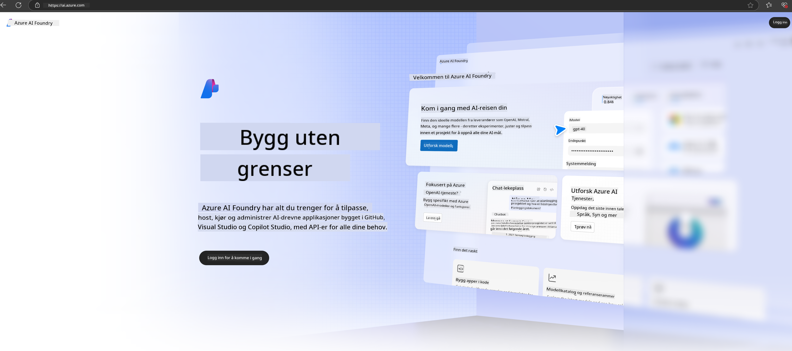

<!--
CO_OP_TRANSLATOR_METADATA:
{
  "original_hash": "3a1e48b628022485aac989c9f733e792",
  "translation_date": "2025-05-09T20:12:31+00:00",
  "source_file": "md/02.QuickStart/AzureAIFoundry_QuickStart.md",
  "language_code": "no"
}
-->
# **Bruke Phi-3 i Azure AI Foundry**

Med utviklingen av Generativ AI ønsker vi å bruke en samlet plattform for å håndtere ulike LLM og SLM, integrering av bedriftsdata, finjustering/RAG-operasjoner, og evaluering av forskjellige bedriftsvirksomheter etter integrering av LLM og SLM, slik at generativ AI kan implementeres bedre i smarte applikasjoner. [Azure AI Foundry](https://ai.azure.com) er en generativ AI-applikasjonsplattform på bedriftsnivå.

Med Azure AI Foundry kan du evaluere svar fra store språkmodeller (LLM) og orkestrere prompt-applikasjonskomponenter med prompt flow for bedre ytelse. Plattformen legger til rette for skalerbarhet, slik at du enkelt kan gå fra proof of concept til full produksjon. Kontinuerlig overvåking og forbedring støtter langsiktig suksess.

Vi kan raskt distribuere Phi-3-modellen på Azure AI Foundry gjennom enkle steg, og deretter bruke Azure AI Foundry til å fullføre Playground/Chat, finjustering, evaluering og andre relaterte oppgaver for Phi-3.

## **1. Forberedelser**

Hvis du allerede har [Azure Developer CLI](https://learn.microsoft.com/azure/developer/azure-developer-cli/overview?WT.mc_id=aiml-138114-kinfeylo) installert på maskinen din, er det like enkelt som å kjøre denne kommandoen i en ny katalog for å bruke denne malen.

## Manuell oppretting

Å opprette et Microsoft Azure AI Foundry-prosjekt og hub er en flott måte å organisere og administrere AI-arbeidet ditt på. Her er en steg-for-steg-guide for å komme i gang:

### Opprette et prosjekt i Azure AI Foundry

1. **Gå til Azure AI Foundry**: Logg inn på Azure AI Foundry-portalen.
2. **Opprett et prosjekt**:
   - Hvis du allerede er inne i et prosjekt, velg "Azure AI Foundry" øverst til venstre på siden for å gå til hjemmesiden.
   - Velg "+ Create project".
   - Skriv inn et navn for prosjektet.
   - Hvis du har en hub, vil den være valgt som standard. Hvis du har tilgang til flere hubs, kan du velge en annen fra nedtrekksmenyen. Hvis du vil opprette en ny hub, velg "Create new hub" og oppgi et navn.
   - Velg "Create".

### Opprette en hub i Azure AI Foundry

1. **Gå til Azure AI Foundry**: Logg inn med Azure-kontoen din.
2. **Opprett en hub**:
   - Velg Management center i venstremenyen.
   - Velg "All resources", deretter pilen ved siden av "+ New project" og velg "+ New hub".
   - I dialogboksen "Create a new hub", skriv inn et navn for huben din (f.eks. contoso-hub) og juster de andre feltene etter ønske.
   - Velg "Next", gjennomgå informasjonen, og velg deretter "Create".

For mer detaljerte instruksjoner kan du se den offisielle [Microsoft-dokumentasjonen](https://learn.microsoft.com/azure/ai-studio/how-to/create-projects).

Etter vellykket opprettelse kan du få tilgang til studioet du har laget via [ai.azure.com](https://ai.azure.com/)

Det kan være flere prosjekter i én AI Foundry. Opprett et prosjekt i AI Foundry som forberedelse.

Opprett Azure AI Foundry [QuickStarts](https://learn.microsoft.com/azure/ai-studio/quickstarts/get-started-code)

## **2. Distribuer en Phi-modell i Azure AI Foundry**

Klikk på Explore-valget i prosjektet for å gå inn i Model Catalog og velg Phi-3

Velg Phi-3-mini-4k-instruct

Klikk 'Deploy' for å distribuere Phi-3-mini-4k-instruct-modellen

> [!NOTE]
>
> Du kan velge regnekraft ved distribusjon

## **3. Playground Chat Phi i Azure AI Foundry**

Gå til distribusjonssiden, velg Playground, og chat med Phi-3 i Azure AI Foundry

## **4. Distribuere modellen fra Azure AI Foundry**

For å distribuere en modell fra Azure Model Catalog, kan du følge disse stegene:

- Logg inn på Azure AI Foundry.
- Velg modellen du ønsker å distribuere fra Azure AI Foundry sin modellkatalog.
- På modellens detaljside velger du Deploy og deretter Serverless API med Azure AI Content Safety.
- Velg prosjektet der du vil distribuere modellene dine. For å bruke Serverless API-tilbudet må arbeidsområdet ditt tilhøre regionen East US 2 eller Sweden Central. Du kan tilpasse Deployment-navnet.
- I distribusjonsveiviseren velger du Pricing and terms for å lære om priser og vilkår for bruk.
- Velg Deploy. Vent til distribusjonen er klar og du blir sendt til Deployments-siden.
- Velg Open in playground for å begynne å samhandle med modellen.
- Du kan gå tilbake til Deployments-siden, velge distribusjonen, og notere endepunktets Target URL og Secret Key, som du kan bruke for å kalle distribusjonen og generere svar.
- Du kan alltid finne detaljer om endepunkt, URL og tilgangsnøkler ved å gå til Build-fanen og velge Deployments under Components-seksjonen.

> [!NOTE]
> Vær oppmerksom på at kontoen din må ha Azure AI Developer-rolle-tillatelser på Ressursgruppen for å utføre disse stegene.

## **5. Bruke Phi API i Azure AI Foundry**

Du kan få tilgang til https://{Your project name}.region.inference.ml.azure.com/swagger.json via Postman GET og kombinere det med nøkkelen for å lære om de tilgjengelige grensesnittene

Du kan enkelt få tak i forespørselsparametere, samt svarparametere.

**Ansvarsfraskrivelse**:  
Dette dokumentet er oversatt ved hjelp av AI-oversettelsestjenesten [Co-op Translator](https://github.com/Azure/co-op-translator). Selv om vi streber etter nøyaktighet, vennligst vær oppmerksom på at automatiske oversettelser kan inneholde feil eller unøyaktigheter. Det opprinnelige dokumentet på dets opprinnelige språk bør betraktes som den autoritative kilden. For kritisk informasjon anbefales profesjonell menneskelig oversettelse. Vi er ikke ansvarlige for eventuelle misforståelser eller feiltolkninger som oppstår fra bruk av denne oversettelsen.