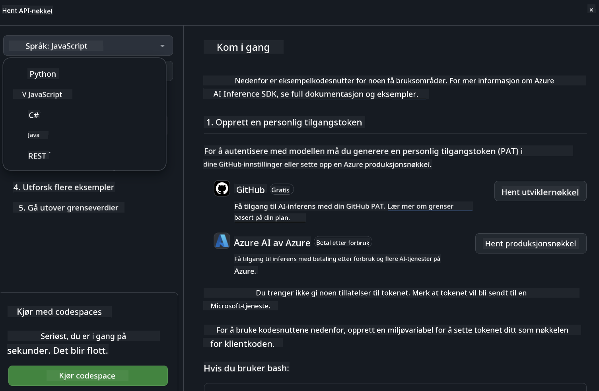

<!--
CO_OP_TRANSLATOR_METADATA:
{
  "original_hash": "5113634b77370af6790f9697d5d7de90",
  "translation_date": "2025-07-17T05:38:08+00:00",
  "source_file": "md/02.QuickStart/GitHubModel_QuickStart.md",
  "language_code": "no"
}
-->
## GitHub Models - Begrenset offentlig beta

Velkommen til [GitHub Models](https://github.com/marketplace/models)! Vi har alt klart for at du skal utforske AI-modeller som hostes på Azure AI.


For mer informasjon om modellene som er tilgjengelige på GitHub Models, se [GitHub Model Marketplace](https://github.com/marketplace/models)

## Tilgjengelige modeller

Hver modell har en egen lekeplass og eksempel-kode


### Phi-3-modeller i GitHub Model Catalog

[Phi-3-Medium-128k-Instruct](https://github.com/marketplace/models/azureml/Phi-3-medium-128k-instruct)

[Phi-3-medium-4k-instruct](https://github.com/marketplace/models/azureml/Phi-3-medium-4k-instruct)

[Phi-3-mini-128k-instruct](https://github.com/marketplace/models/azureml/Phi-3-mini-128k-instruct)

[Phi-3-mini-4k-instruct](https://github.com/marketplace/models/azureml/Phi-3-mini-4k-instruct)

[Phi-3-small-128k-instruct](https://github.com/marketplace/models/azureml/Phi-3-small-128k-instruct)

[Phi-3-small-8k-instruct](https://github.com/marketplace/models/azureml/Phi-3-small-8k-instruct)

## Kom i gang

Det finnes noen grunnleggende eksempler klare til å kjøre. Du finner dem i samples-mappen. Hvis du vil hoppe rett til ditt favorittspråk, finner du eksemplene i følgende språk:

- Python
- JavaScript
- cURL

Det finnes også et dedikert Codespaces-miljø for å kjøre eksemplene og modellene.



## Eksempel-kode

Nedenfor er kodeeksempler for noen brukstilfeller. For mer informasjon om Azure AI Inference SDK, se full dokumentasjon og eksempler.

## Oppsett

1. Lag en personlig tilgangstoken  
Du trenger ikke gi noen spesielle tillatelser til tokenet. Merk at tokenet vil bli sendt til en Microsoft-tjeneste.

For å bruke kodeeksemplene nedenfor, opprett en miljøvariabel for å sette tokenet som nøkkel for klientkoden.

Hvis du bruker bash:  
```
export GITHUB_TOKEN="<your-github-token-goes-here>"
```  
Hvis du bruker powershell:  

```
$Env:GITHUB_TOKEN="<your-github-token-goes-here>"
```  

Hvis du bruker Windows kommandoprompt:  

```
set GITHUB_TOKEN=<your-github-token-goes-here>
```  

## Python-eksempel

### Installer avhengigheter  
Installer Azure AI Inference SDK med pip (krever: Python >=3.8):

```
pip install azure-ai-inference
```  
### Kjør et grunnleggende kodeeksempel

Dette eksempelet viser et enkelt kall til chat completion API. Det bruker GitHub AI-modellens inferanse-endepunkt og din GitHub-token. Kallet er synkront.

```
import os
from azure.ai.inference import ChatCompletionsClient
from azure.ai.inference.models import SystemMessage, UserMessage
from azure.core.credentials import AzureKeyCredential

endpoint = "https://models.inference.ai.azure.com"
# Replace Model_Name 
model_name = "Phi-3-small-8k-instruct"
token = os.environ["GITHUB_TOKEN"]

client = ChatCompletionsClient(
    endpoint=endpoint,
    credential=AzureKeyCredential(token),
)

response = client.complete(
    messages=[
        SystemMessage(content="You are a helpful assistant."),
        UserMessage(content="What is the capital of France?"),
    ],
    model=model_name,
    temperature=1.,
    max_tokens=1000,
    top_p=1.
)

print(response.choices[0].message.content)
```

### Kjør en samtale med flere runder

Dette eksempelet viser en samtale med flere runder med chat completion API. Når du bruker modellen i en chatteapplikasjon, må du håndtere samtalehistorikken og sende de siste meldingene til modellen.

```
import os
from azure.ai.inference import ChatCompletionsClient
from azure.ai.inference.models import AssistantMessage, SystemMessage, UserMessage
from azure.core.credentials import AzureKeyCredential

token = os.environ["GITHUB_TOKEN"]
endpoint = "https://models.inference.ai.azure.com"
# Replace Model_Name
model_name = "Phi-3-small-8k-instruct"

client = ChatCompletionsClient(
    endpoint=endpoint,
    credential=AzureKeyCredential(token),
)

messages = [
    SystemMessage(content="You are a helpful assistant."),
    UserMessage(content="What is the capital of France?"),
    AssistantMessage(content="The capital of France is Paris."),
    UserMessage(content="What about Spain?"),
]

response = client.complete(messages=messages, model=model_name)

print(response.choices[0].message.content)
```

### Strøm utdata

For en bedre brukeropplevelse vil du strømme modellens respons slik at det første tokenet vises tidlig, og du slipper å vente på lange svar.

```
import os
from azure.ai.inference import ChatCompletionsClient
from azure.ai.inference.models import SystemMessage, UserMessage
from azure.core.credentials import AzureKeyCredential

token = os.environ["GITHUB_TOKEN"]
endpoint = "https://models.inference.ai.azure.com"
# Replace Model_Name
model_name = "Phi-3-small-8k-instruct"

client = ChatCompletionsClient(
    endpoint=endpoint,
    credential=AzureKeyCredential(token),
)

response = client.complete(
    stream=True,
    messages=[
        SystemMessage(content="You are a helpful assistant."),
        UserMessage(content="Give me 5 good reasons why I should exercise every day."),
    ],
    model=model_name,
)

for update in response:
    if update.choices:
        print(update.choices[0].delta.content or "", end="")

client.close()
```  
## JavaScript

### Installer avhengigheter

Installer Node.js.

Kopier følgende tekstlinjer og lagre dem som en fil package.json i mappen din.

```
{
  "type": "module",
  "dependencies": {
    "@azure-rest/ai-inference": "latest",
    "@azure/core-auth": "latest",
    "@azure/core-sse": "latest"
  }
}
```

Merk: @azure/core-sse trengs kun når du strømmer chat completion-responsen.

Åpne et terminalvindu i denne mappen og kjør npm install.

For hvert av kodeeksemplene nedenfor, kopier innholdet til en fil sample.js og kjør med node sample.js.

### Kjør et grunnleggende kodeeksempel

Dette eksempelet viser et enkelt kall til chat completion API. Det bruker GitHub AI-modellens inferanse-endepunkt og din GitHub-token. Kallet er synkront.

```
import ModelClient from "@azure-rest/ai-inference";
import { AzureKeyCredential } from "@azure/core-auth";

const token = process.env["GITHUB_TOKEN"];
const endpoint = "https://models.inference.ai.azure.com";
// Update your modelname
const modelName = "Phi-3-small-8k-instruct";

export async function main() {

  const client = new ModelClient(endpoint, new AzureKeyCredential(token));

  const response = await client.path("/chat/completions").post({
    body: {
      messages: [
        { role:"system", content: "You are a helpful assistant." },
        { role:"user", content: "What is the capital of France?" }
      ],
      model: modelName,
      temperature: 1.,
      max_tokens: 1000,
      top_p: 1.
    }
  });

  if (response.status !== "200") {
    throw response.body.error;
  }
  console.log(response.body.choices[0].message.content);
}

main().catch((err) => {
  console.error("The sample encountered an error:", err);
});
```

### Kjør en samtale med flere runder

Dette eksempelet viser en samtale med flere runder med chat completion API. Når du bruker modellen i en chatteapplikasjon, må du håndtere samtalehistorikken og sende de siste meldingene til modellen.

```
import ModelClient from "@azure-rest/ai-inference";
import { AzureKeyCredential } from "@azure/core-auth";

const token = process.env["GITHUB_TOKEN"];
const endpoint = "https://models.inference.ai.azure.com";
// Update your modelname
const modelName = "Phi-3-small-8k-instruct";

export async function main() {

  const client = new ModelClient(endpoint, new AzureKeyCredential(token));

  const response = await client.path("/chat/completions").post({
    body: {
      messages: [
        { role: "system", content: "You are a helpful assistant." },
        { role: "user", content: "What is the capital of France?" },
        { role: "assistant", content: "The capital of France is Paris." },
        { role: "user", content: "What about Spain?" },
      ],
      model: modelName,
    }
  });

  if (response.status !== "200") {
    throw response.body.error;
  }

  for (const choice of response.body.choices) {
    console.log(choice.message.content);
  }
}

main().catch((err) => {
  console.error("The sample encountered an error:", err);
});
```

### Strøm utdata  
For en bedre brukeropplevelse vil du strømme modellens respons slik at det første tokenet vises tidlig, og du slipper å vente på lange svar.

```
import ModelClient from "@azure-rest/ai-inference";
import { AzureKeyCredential } from "@azure/core-auth";
import { createSseStream } from "@azure/core-sse";

const token = process.env["GITHUB_TOKEN"];
const endpoint = "https://models.inference.ai.azure.com";
// Update your modelname
const modelName = "Phi-3-small-8k-instruct";

export async function main() {

  const client = new ModelClient(endpoint, new AzureKeyCredential(token));

  const response = await client.path("/chat/completions").post({
    body: {
      messages: [
        { role: "system", content: "You are a helpful assistant." },
        { role: "user", content: "Give me 5 good reasons why I should exercise every day." },
      ],
      model: modelName,
      stream: true
    }
  }).asNodeStream();

  const stream = response.body;
  if (!stream) {
    throw new Error("The response stream is undefined");
  }

  if (response.status !== "200") {
    stream.destroy();
    throw new Error(`Failed to get chat completions, http operation failed with ${response.status} code`);
  }

  const sseStream = createSseStream(stream);

  for await (const event of sseStream) {
    if (event.data === "[DONE]") {
      return;
    }
    for (const choice of (JSON.parse(event.data)).choices) {
        process.stdout.write(choice.delta?.content ?? ``);
    }
  }
}

main().catch((err) => {
  console.error("The sample encountered an error:", err);
});
```

## REST

### Kjør et grunnleggende kodeeksempel

Lim inn følgende i en shell:

```
curl -X POST "https://models.inference.ai.azure.com/chat/completions" \
    -H "Content-Type: application/json" \
    -H "Authorization: Bearer $GITHUB_TOKEN" \
    -d '{
        "messages": [
            {
                "role": "system",
                "content": "You are a helpful assistant."
            },
            {
                "role": "user",
                "content": "What is the capital of France?"
            }
        ],
        "model": "Phi-3-small-8k-instruct"
    }'
```  
### Kjør en samtale med flere runder

Kall chat completion API og send med samtalehistorikken:

```
curl -X POST "https://models.inference.ai.azure.com/chat/completions" \
    -H "Content-Type: application/json" \
    -H "Authorization: Bearer $GITHUB_TOKEN" \
    -d '{
        "messages": [
            {
                "role": "system",
                "content": "You are a helpful assistant."
            },
            {
                "role": "user",
                "content": "What is the capital of France?"
            },
            {
                "role": "assistant",
                "content": "The capital of France is Paris."
            },
            {
                "role": "user",
                "content": "What about Spain?"
            }
        ],
        "model": "Phi-3-small-8k-instruct"
    }'
```  
### Strøm utdata

Dette er et eksempel på å kalle endepunktet og strømme responsen.

```
curl -X POST "https://models.inference.ai.azure.com/chat/completions" \
    -H "Content-Type: application/json" \
    -H "Authorization: Bearer $GITHUB_TOKEN" \
    -d '{
        "messages": [
            {
                "role": "system",
                "content": "You are a helpful assistant."
            },
            {
                "role": "user",
                "content": "Give me 5 good reasons why I should exercise every day."
            }
        ],
        "stream": true,
        "model": "Phi-3-small-8k-instruct"
    }'
```

## GRATIS bruk og begrensninger for GitHub Models


[Begrensningene for lekeplassen og gratis API-bruk](https://docs.github.com/en/github-models/prototyping-with-ai-models#rate-limits) er ment for at du skal kunne eksperimentere med modeller og prototype AI-applikasjonen din. For bruk utover disse grensene, og for å skalere applikasjonen, må du sette opp ressurser fra en Azure-konto og autentisere derfra i stedet for med din personlige GitHub-token. Du trenger ikke å endre noe annet i koden din. Bruk denne lenken for å finne ut hvordan du kan gå utover gratisnivåets begrensninger i Azure AI.

### Ansvarsfraskrivelser

Husk at når du interagerer med en modell, eksperimenterer du med AI, så innholdet kan inneholde feil.

Funksjonen er underlagt ulike begrensninger (inkludert forespørsler per minutt, forespørsler per dag, tokens per forespørsel og samtidige forespørsler) og er ikke laget for produksjonsbruk.

GitHub Models bruker Azure AI Content Safety. Disse filtrene kan ikke slås av som en del av GitHub Models-opplevelsen. Hvis du velger å bruke modeller gjennom en betalt tjeneste, må du konfigurere innholdsfiltrene dine i henhold til dine behov.

Denne tjenesten er underlagt GitHubs vilkår for forhåndsutgivelse.

**Ansvarsfraskrivelse**:  
Dette dokumentet er oversatt ved hjelp av AI-oversettelsestjenesten [Co-op Translator](https://github.com/Azure/co-op-translator). Selv om vi streber etter nøyaktighet, vennligst vær oppmerksom på at automatiske oversettelser kan inneholde feil eller unøyaktigheter. Det opprinnelige dokumentet på originalspråket skal anses som den autoritative kilden. For kritisk informasjon anbefales profesjonell menneskelig oversettelse. Vi er ikke ansvarlige for eventuelle misforståelser eller feiltolkninger som oppstår ved bruk av denne oversettelsen.