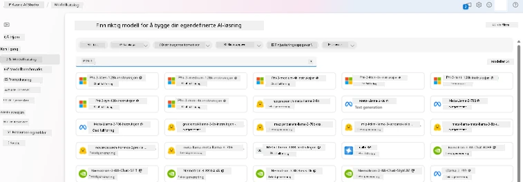
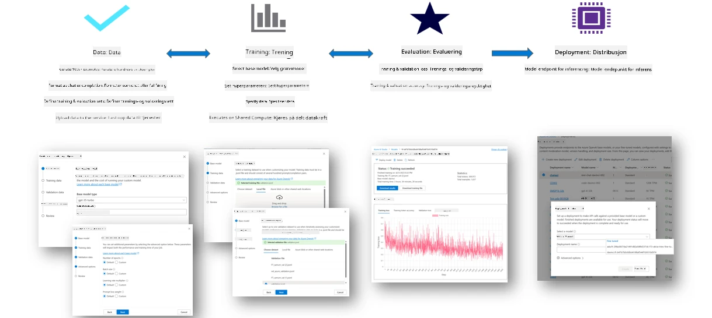
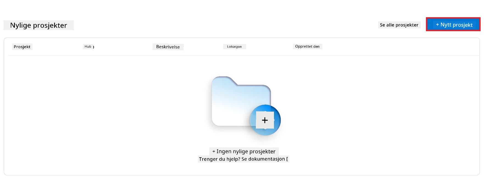
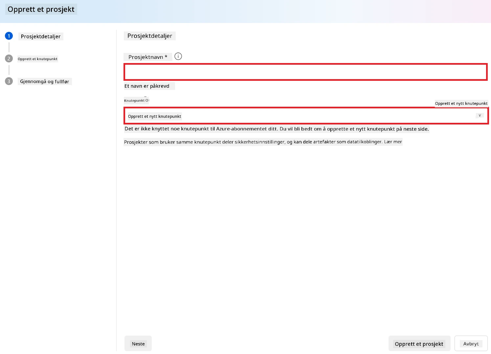
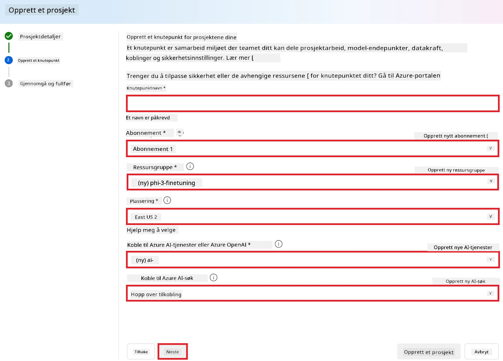
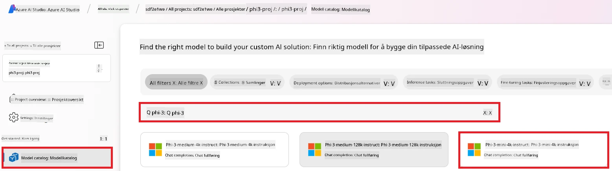
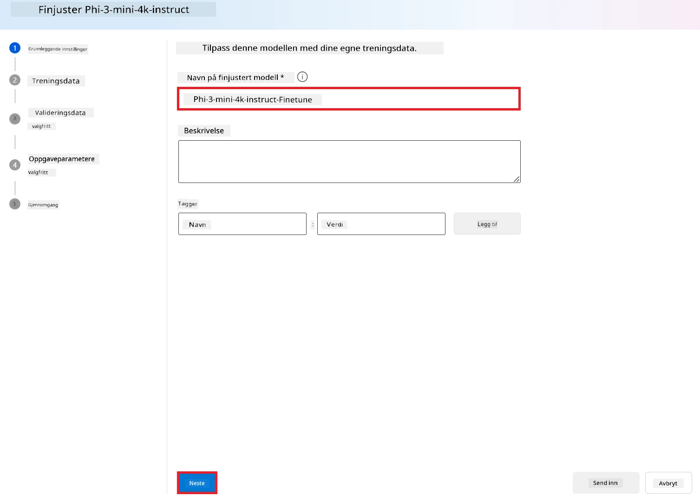
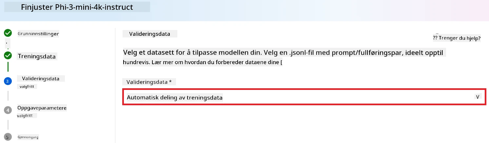
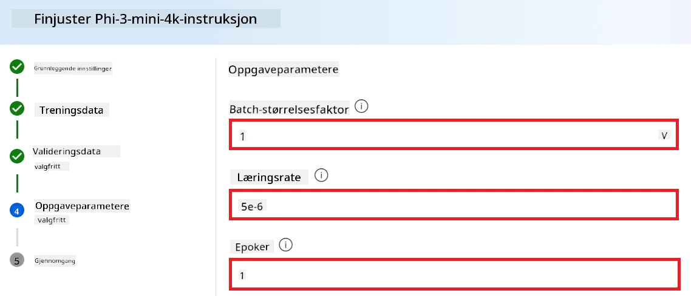
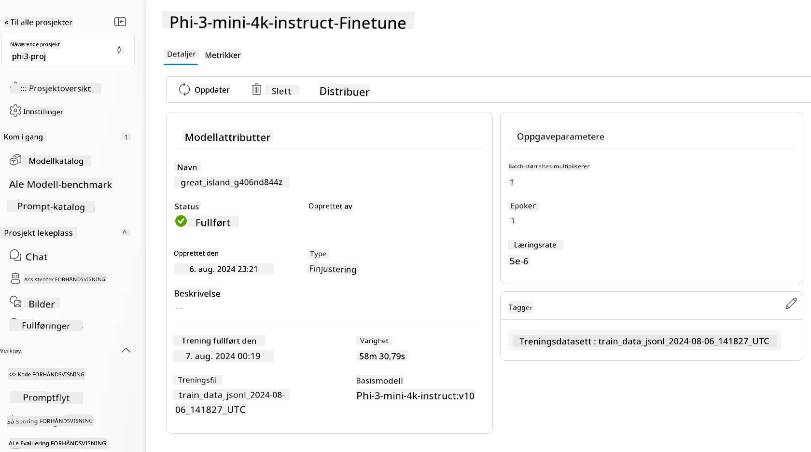

# Finjustering av Phi-3 med Azure AI Foundry

La oss utforske hvordan man finjusterer Microsofts Phi-3 Mini språkmodell ved hjelp av Azure AI Foundry. Finjustering gjør det mulig å tilpasse Phi-3 Mini til spesifikke oppgaver, noe som gjør den enda kraftigere og mer kontekstsensitiv.

## Vurderinger

- **Muligheter:** Hvilke modeller kan finjusteres? Hva kan grunnmodellen finjusteres til å gjøre?
- **Kostnad:** Hva er prismodellen for finjustering?
- **Tilpasningsmuligheter:** Hvor mye kan jeg endre grunnmodellen – og på hvilke måter?
- **Brukervennlighet:** Hvordan foregår finjusteringen i praksis – må jeg skrive egen kode? Må jeg ha egen datakraft?
- **Sikkerhet:** Finjusterte modeller kan ha sikkerhetsrisikoer – finnes det noen sikkerhetsmekanismer for å beskytte mot utilsiktet skade?



## Forberedelser til finjustering

### Forutsetninger

> [!NOTE]
> For Phi-3 familie-modeller er pay-as-you-go-modellen for finjustering kun tilgjengelig for hubs opprettet i **East US 2**-regionen.

- Et Azure-abonnement. Hvis du ikke har et Azure-abonnement, opprett en [betalt Azure-konto](https://azure.microsoft.com/pricing/purchase-options/pay-as-you-go) for å komme i gang.

- Et [AI Foundry-prosjekt](https://ai.azure.com?WT.mc_id=aiml-138114-kinfeylo).
- Azure rollebasert tilgangskontroll (Azure RBAC) brukes for å gi tilgang til operasjoner i Azure AI Foundry. For å utføre stegene i denne artikkelen må brukerkontoen din ha __Azure AI Developer-rollen__ på ressursgruppen.

### Registrering av abonnementets leverandør

Sjekk at abonnementet er registrert hos ressursleverandøren `Microsoft.Network`.

1. Logg inn på [Azure-portalen](https://portal.azure.com).
1. Velg **Subscriptions** i venstremenyen.
1. Velg abonnementet du vil bruke.
1. Velg **AI project settings** > **Resource providers** i venstremenyen.
1. Bekreft at **Microsoft.Network** er i listen over ressursleverandører. Hvis ikke, legg det til.

### Datapreparering

Forbered trenings- og valideringsdata for å finjustere modellen din. Trenings- og valideringsdatasett består av input- og output-eksempler som viser hvordan du ønsker at modellen skal prestere.

Sørg for at alle trenings-eksempler følger forventet format for inferens. For effektiv finjustering bør datasettet være balansert og variert.

Dette innebærer å opprettholde databalansen, inkludere ulike scenarier, og jevnlig forbedre treningsdata for å samsvare med virkelige forventninger, noe som til slutt gir mer nøyaktige og balanserte modellrespons.

Ulike modelltyper krever ulikt format på treningsdata.

### Chat Completion

Trenings- og valideringsdata du bruker **må** være formatert som et JSON Lines (JSONL) dokument. For `Phi-3-mini-128k-instruct` må finjusteringsdatasettet være i det konversasjonsformatet som brukes av Chat completions API.

### Eksempel på filformat

```json
    {"messages": [{"role": "system", "content": "You are an Xbox customer support agent whose primary goal is to help users with issues they are experiencing with their Xbox devices. You are friendly and concise. You only provide factual answers to queries, and do not provide answers that are not related to Xbox."}, {"role": "user", "content": "Is Xbox better than PlayStation?"}, {"role": "assistant", "content": "I apologize, but I cannot provide personal opinions. My primary job is to assist you with any issues related to your Xbox device. Do you have any Xbox-related issues that need addressing?"}]}
    {"messages": [{"role": "system", "content": "You are an Xbox customer support agent whose primary goal is to help users with issues they are experiencing with their Xbox devices. You are friendly and concise. You only provide factual answers to queries, and do not provide answers that are not related to Xbox."}, {"role": "user", "content": "Can I play PC games on my Xbox?"}, {"role": "assistant", "content": "While Xbox consoles don't natively support PC games, they can play an array of Xbox games, many of which are also available on PC. Can I assist you with finding games compatible with your Xbox device?"}]}
    {"messages": [{"role": "system", "content": "You are an Xbox customer support agent whose primary goal is to help users with issues they are experiencing with their Xbox devices. You are friendly and concise. You only provide factual answers to queries, and do not provide answers that are not related to Xbox."}, {"role": "user", "content": "I'm having trouble connecting my Xbox to the Wi-Fi."}, {"role": "assistant", "content": "No worries, let's go through the network settings on your Xbox. Can you please tell me what happens when you try to connect it to the Wi-Fi?"}]}
```

Støttet filtype er JSON Lines. Filene lastes opp til standard datalager og gjøres tilgjengelig i prosjektet ditt.

## Finjustering av Phi-3 med Azure AI Foundry

Azure AI Foundry lar deg tilpasse store språkmodeller til dine egne datasett ved hjelp av en prosess kalt finjustering. Finjustering gir stor verdi ved å muliggjøre tilpasning og optimalisering for spesifikke oppgaver og bruksområder. Det fører til bedre ytelse, kostnadseffektivitet, redusert ventetid og skreddersydde resultater.



### Opprett et nytt prosjekt

1. Logg inn på [Azure AI Foundry](https://ai.azure.com).

1. Velg **+New project** for å opprette et nytt prosjekt i Azure AI Foundry.

    

1. Gjør følgende:

    - Prosjektets **Hub name**. Det må være en unik verdi.
    - Velg hvilken **Hub** som skal brukes (opprett en ny om nødvendig).

    

1. Gjør følgende for å opprette en ny hub:

    - Skriv inn **Hub name**. Det må være en unik verdi.
    - Velg ditt Azure **Subscription**.
    - Velg hvilken **Resource group** som skal brukes (opprett en ny om nødvendig).
    - Velg **Location** du ønsker å bruke.
    - Velg **Connect Azure AI Services** som skal brukes (opprett en ny om nødvendig).
    - Velg **Connect Azure AI Search** og velg **Skip connecting**.

    

1. Velg **Next**.
1. Velg **Create a project**.

### Datapreparering

Før finjustering, samle eller lag et datasett som er relevant for oppgaven din, for eksempel chat-instruksjoner, spørsmål-svar-par, eller annen relevant tekstdata. Rens og forbehandle dataene ved å fjerne støy, håndtere manglende verdier og tokenisere teksten.

### Finjuster Phi-3 modeller i Azure AI Foundry

> [!NOTE]
> Finjustering av Phi-3 modeller støttes for øyeblikket kun i prosjekter lokalisert i East US 2.

1. Velg **Model catalog** fra venstre sidepanel.

1. Skriv *phi-3* i **søkelinjen** og velg den phi-3 modellen du ønsker å bruke.

    

1. Velg **Fine-tune**.

    

1. Skriv inn navnet på den **finjusterte modellen**.

    

1. Velg **Next**.

1. Gjør følgende:

    - Velg **task type** til **Chat completion**.
    - Velg **Training data** du ønsker å bruke. Du kan laste det opp via Azure AI Foundry eller fra ditt lokale miljø.

    

1. Velg **Next**.

1. Last opp **Validation data** du ønsker å bruke, eller velg **Automatic split of training data**.

    

1. Velg **Next**.

1. Gjør følgende:

    - Velg ønsket **Batch size multiplier**.
    - Velg ønsket **Learning rate**.
    - Velg ønsket antall **Epochs**.

    

1. Velg **Submit** for å starte finjusteringsprosessen.

    

1. Når modellen er finjustert, vil status vises som **Completed**, som vist i bildet under. Nå kan du distribuere modellen og bruke den i din egen applikasjon, i playground, eller i prompt flow. For mer informasjon, se [Hvordan distribuere Phi-3 familie av små språkmodeller med Azure AI Foundry](https://learn.microsoft.com/azure/ai-studio/how-to/deploy-models-phi-3?tabs=phi-3-5&pivots=programming-language-python).

    

> [!NOTE]
> For mer detaljert informasjon om finjustering av Phi-3, besøk [Finjuster Phi-3 modeller i Azure AI Foundry](https://learn.microsoft.com/azure/ai-studio/how-to/fine-tune-phi-3?tabs=phi-3-mini).

## Rydd opp i dine finjusterte modeller

Du kan slette en finjustert modell fra listen over finjusterte modeller i [Azure AI Foundry](https://ai.azure.com) eller fra modellens detaljside. Velg den finjusterte modellen du vil slette fra finjusteringssiden, og trykk deretter på Slett-knappen for å fjerne modellen.

> [!NOTE]
> Du kan ikke slette en tilpasset modell hvis den har en eksisterende distribusjon. Du må først slette distribusjonen før du kan slette den tilpassede modellen.

## Kostnader og kvoter

### Kostnads- og kvotevurderinger for Phi-3 modeller finjustert som en tjeneste

Phi-modeller finjustert som en tjeneste tilbys av Microsoft og er integrert med Azure AI Foundry for bruk. Du finner prisinformasjon når du [distribuerer](https://learn.microsoft.com/azure/ai-studio/how-to/deploy-models-phi-3?tabs=phi-3-5&pivots=programming-language-python) eller finjusterer modellene under fanen Pris og vilkår i distribusjonsveiviseren.

## Innholdsfiltrering

Modeller distribuert som en tjeneste med pay-as-you-go er beskyttet av Azure AI Content Safety. Når de distribueres til sanntidsendepunkter, kan du velge å ikke bruke denne funksjonen. Med Azure AI Content Safety aktivert, går både prompt og fullføring gjennom et ensemble av klassifiseringsmodeller som har som mål å oppdage og forhindre utdata med skadelig innhold. Innholdsfiltreringssystemet oppdager og håndterer spesifikke kategorier av potensielt skadelig innhold i både input-prompter og output-fullføringer. Les mer om [Azure AI Content Safety](https://learn.microsoft.com/azure/ai-studio/concepts/content-filtering).

**Finjusteringskonfigurasjon**

Hyperparametere: Definer hyperparametere som læringsrate, batch-størrelse og antall trenings-epoker.

**Tapfunksjon**

Velg en passende tapfunksjon for oppgaven din (f.eks. kryssentropi).

**Optimizer**

Velg en optimizer (f.eks. Adam) for gradientoppdateringer under trening.

**Finjusteringsprosess**

- Last inn forhåndstrent modell: Last inn Phi-3 Mini sjekkpunkt.
- Legg til egendefinerte lag: Legg til oppgavespesifikke lag (f.eks. klassifiseringshode for chat-instruksjoner).

**Tren modellen**  
Finjuster modellen med ditt forberedte datasett. Overvåk treningsprogresjonen og juster hyperparametere etter behov.

**Evaluering og validering**

Valideringssett: Del dataene dine i trenings- og valideringssett.

**Evaluer ytelse**

Bruk metrikker som nøyaktighet, F1-score eller perplexity for å vurdere modellens ytelse.

## Lagre finjustert modell

**Sjekkpunkt**  
Lagre sjekkpunktet for den finjusterte modellen for fremtidig bruk.

## Distribusjon

- Distribuer som en webtjeneste: Distribuer din finjusterte modell som en webtjeneste i Azure AI Foundry.
- Test endepunktet: Send testspørringer til det distribuerte endepunktet for å verifisere funksjonaliteten.

## Iterer og forbedre

Iterer: Hvis ytelsen ikke er tilfredsstillende, iterer ved å justere hyperparametere, legge til mer data eller finjustere over flere epoker.

## Overvåk og forbedre

Overvåk kontinuerlig modellens oppførsel og forbedre etter behov.

## Tilpass og utvid

Egendefinerte oppgaver: Phi-3 Mini kan finjusteres for ulike oppgaver utover chat-instruksjoner. Utforsk andre bruksområder!  
Eksperimenter: Prøv ulike arkitekturer, lagkombinasjoner og teknikker for å forbedre ytelsen.

> [!NOTE]
> Finjustering er en iterativ prosess. Eksperimenter, lær og tilpass modellen for å oppnå best mulig resultat for din spesifikke oppgave!

**Ansvarsfraskrivelse**:  
Dette dokumentet er oversatt ved hjelp av AI-oversettelsestjenesten [Co-op Translator](https://github.com/Azure/co-op-translator). Selv om vi streber etter nøyaktighet, vennligst vær oppmerksom på at automatiske oversettelser kan inneholde feil eller unøyaktigheter. Det opprinnelige dokumentet på originalspråket skal anses som den autoritative kilden. For kritisk informasjon anbefales profesjonell menneskelig oversettelse. Vi er ikke ansvarlige for eventuelle misforståelser eller feiltolkninger som oppstår ved bruk av denne oversettelsen.