# Finjustering av Phi-3 med Microsoft Foundry

La oss utforske hvordan man kan finjustere Microsofts språkmodell Phi-3 Mini ved hjelp av Microsoft Foundry. Finjustering lar deg tilpasse Phi-3 Mini til spesifikke oppgaver, noe som gjør den enda mer kraftfull og kontekstbevisst.

## Vurderinger

- **Funksjonalitet:** Hvilke modeller kan finjusteres? Hva kan grunnmodellen finjusteres til å gjøre?
- **Kostnad:** Hva er prismodellen for finjustering
- **Tilpasningsmuligheter:** Hvor mye kan jeg endre grunnmodellen – og på hvilke måter?
- **Bekvemmelighet:** Hvordan skjer finjustering i praksis – må jeg skrive egendefinert kode? Må jeg ha egen beregningskapasitet?
- **Sikkerhet:** Finjusterte modeller har kjente sikkerhetsrisikoer – finnes det noen sikringsmekanismer for å beskytte mot utilsiktet skade?

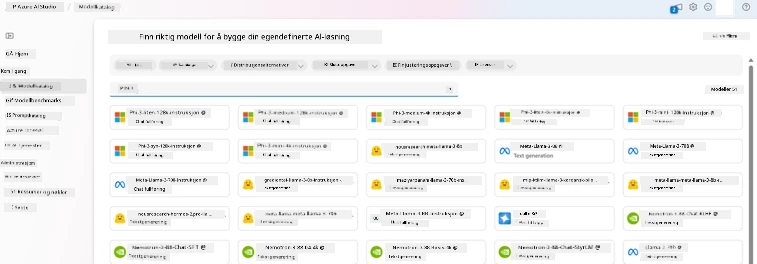

## Forberedelser til finjustering

### Forutsetninger

> [!NOTE]
> For Phi-3 familie modeller er pay-as-you-go modellens finjusteringstilbud kun tilgjengelig med hubs opprettet i **East US 2** regioner.

- Et Azure-abonnement. Hvis du ikke har et Azure-abonnement, opprett en [betalt Azure-konto](https://azure.microsoft.com/pricing/purchase-options/pay-as-you-go) for å komme i gang.

- Et [AI Foundry-prosjekt](https://ai.azure.com?WT.mc_id=aiml-138114-kinfeylo).
- Azure rollebasert tilgangskontroll (Azure RBAC) brukes for å gi tilgang til operasjoner i Microsoft Foundry. For å utføre stegene i denne artikkelen må bruker-kontoen din være tildelt __Azure AI Developer-rollen__ på ressursgruppen.

### Registrering av abonnementstilbyder

Verifiser at abonnementet er registrert til `Microsoft.Network` ressursleverandøren.

1. Logg inn på [Azure-portalen](https://portal.azure.com).
1. Velg **Subscriptions** i venstremenyen.
1. Velg abonnementet du ønsker å bruke.
1. Velg **AI project settings** > **Resource providers** i venstremenyen.
1. Bekreft at **Microsoft.Network** er i listen over ressursleverandører. Legg det til hvis det ikke er der.

### Forberedelse av data

Forbered trenings- og valideringsdata for å finjustere modellen din. Trenings- og valideringsdatasett består av input- og output-eksempler som viser hvordan du ønsker at modellen skal presterer.

Sørg for at alle trenings-eksemplene følger forventet format for prediksjon. For effektiv finjustering, sørg for et balansert og variert datasett.

Dette innebærer å opprettholde databalanse, inkludere ulike scenarier, og periodisk forbedre treningsdataene for å samsvare med virkelige forventninger, som til slutt gir mer nøyaktige og balanserte modell-responser.

Ulike modelltyper krever ulike format på treningsdata.

### Chat Completion

Trenings- og valideringsdata du bruker **må** være formatert som et JSON Lines (JSONL) dokument. For `Phi-3-mini-128k-instruct` må finjusteringsdatasettet være formatert i det konversasjonsformatet som brukes av Chat completions API.

### Eksempel på filformat

```json
    {"messages": [{"role": "system", "content": "You are an Xbox customer support agent whose primary goal is to help users with issues they are experiencing with their Xbox devices. You are friendly and concise. You only provide factual answers to queries, and do not provide answers that are not related to Xbox."}, {"role": "user", "content": "Is Xbox better than PlayStation?"}, {"role": "assistant", "content": "I apologize, but I cannot provide personal opinions. My primary job is to assist you with any issues related to your Xbox device. Do you have any Xbox-related issues that need addressing?"}]}
    {"messages": [{"role": "system", "content": "You are an Xbox customer support agent whose primary goal is to help users with issues they are experiencing with their Xbox devices. You are friendly and concise. You only provide factual answers to queries, and do not provide answers that are not related to Xbox."}, {"role": "user", "content": "Can I play PC games on my Xbox?"}, {"role": "assistant", "content": "While Xbox consoles don't natively support PC games, they can play an array of Xbox games, many of which are also available on PC. Can I assist you with finding games compatible with your Xbox device?"}]}
    {"messages": [{"role": "system", "content": "You are an Xbox customer support agent whose primary goal is to help users with issues they are experiencing with their Xbox devices. You are friendly and concise. You only provide factual answers to queries, and do not provide answers that are not related to Xbox."}, {"role": "user", "content": "I'm having trouble connecting my Xbox to the Wi-Fi."}, {"role": "assistant", "content": "No worries, let's go through the network settings on your Xbox. Can you please tell me what happens when you try to connect it to the Wi-Fi?"}]}
```
  
Den støttede filtypen er JSON Lines. Filer lastes opp til standard datalager og gjøres tilgjengelige i prosjektet ditt.

## Finjustering av Phi-3 med Microsoft Foundry

Microsoft Foundry lar deg skreddersy store språkmodeller til dine personlige datasett ved å bruke en prosess kjent som finjustering. Finjustering gir betydelig verdi ved å muliggjøre tilpasning og optimalisering for spesifikke oppgaver og applikasjoner. Det fører til forbedret ytelse, kostnadseffektivitet, redusert ventetid og skreddersydde resultater.

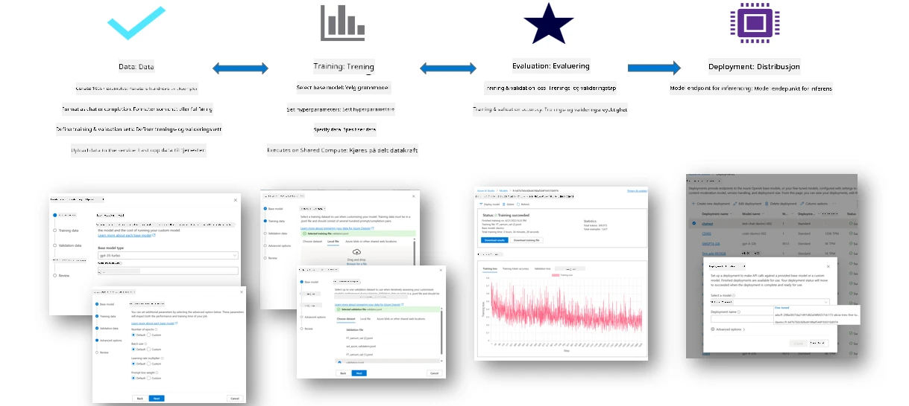

### Opprett et nytt prosjekt

1. Logg inn på [Microsoft Foundry](https://ai.azure.com).

1. Velg **+New project** for å opprette et nytt prosjekt i Microsoft Foundry.

    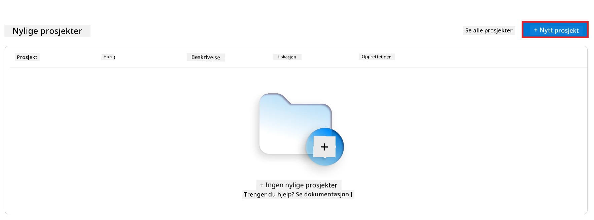

1. Utfør følgende oppgaver:

    - Prosjektets **Hub navn**. Det må være en unik verdi.
    - Velg **Hub** som skal brukes (opprett en ny hvis nødvendig).

    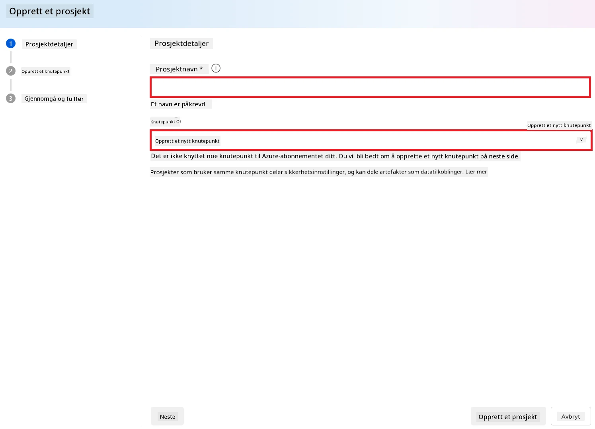

1. Utfør følgende oppgaver for å opprette en ny hub:

    - Skriv inn **Hub navn**. Det må være en unik verdi.
    - Velg ditt Azure **abonnement**.
    - Velg **Ressursgruppe** som skal brukes (opprett en ny om nødvendig).
    - Velg **Lokasjon** du ønsker å bruke.
    - Velg **Koble til Azure AI Services** som skal brukes (opprett en ny om nødvendig).
    - Velg **Koble til Azure AI Search** og velg **Hopp over tilkobling**.

    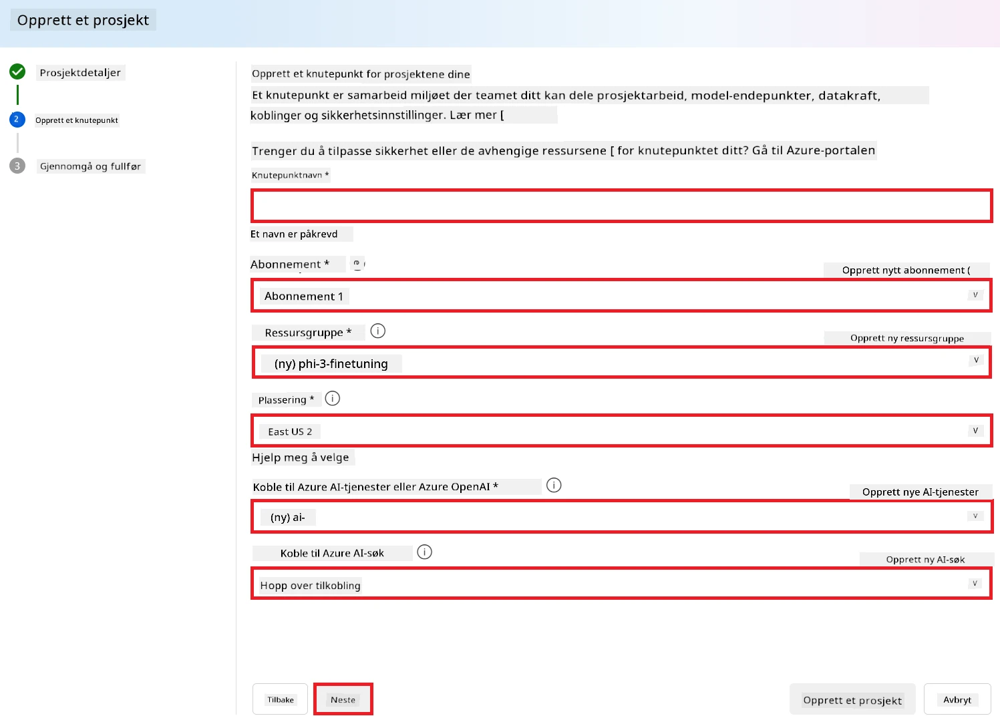

1. Velg **Next**.
1. Velg **Create a project**.

### Forberedelse av data

Før finjustering, samle eller lag et datasett relevant for oppgaven din, som chatinstruksjoner, spørsmål-svar-par eller annen relevant tekstdata. Rens og forhåndsbehandle dataene ved å fjerne støy, håndtere manglende verdier og tokenisere teksten.

### Finjuster Phi-3 modeller i Microsoft Foundry

> [!NOTE]
> Finjustering av Phi-3 modeller støttes for øyeblikket kun i prosjekter lokalisert i East US 2.

1. Velg **Model catalog** fra menyen til venstre.

1. Skriv *phi-3* i **søkelinjen** og velg phi-3 modellen du ønsker å bruke.

    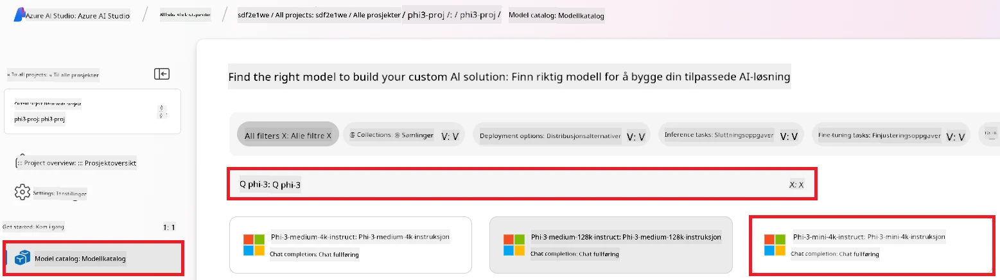

1. Velg **Fine-tune**.

    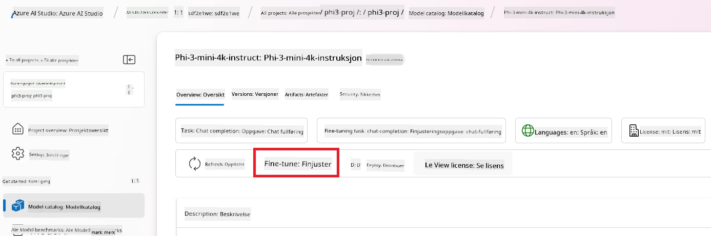

1. Skriv inn navnet for **Fine-tuned model**.

    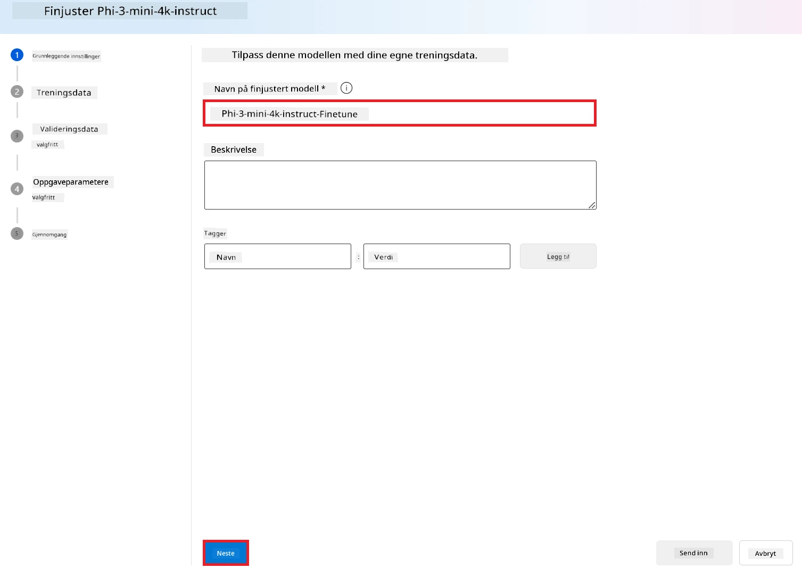

1. Velg **Next**.

1. Gjør følgende:

    - Velg **oppgavetypen** til **Chat completion**.
    - Velg **Treningsdata** du ønsker å bruke. Du kan laste det opp gjennom Microsoft Foundrys datalager eller fra ditt lokale miljø.

    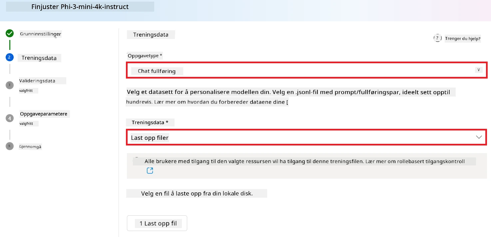

1. Velg **Next**.

1. Last opp **valideringsdata** du ønsker å bruke, eller du kan velge **Automatisk deling av treningsdata**.

    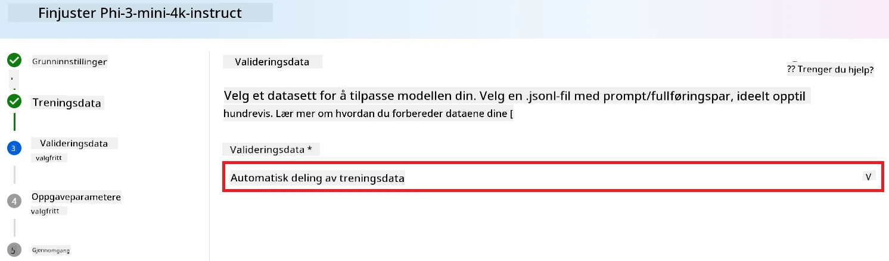

1. Velg **Next**.

1. Gjør følgende:

    - Velg hvilken **Batch size multiplier** du ønsker å bruke.
    - Velg hvilken **Learning rate** du ønsker å bruke.
    - Velg antall **Epochs** du ønsker å bruke.

    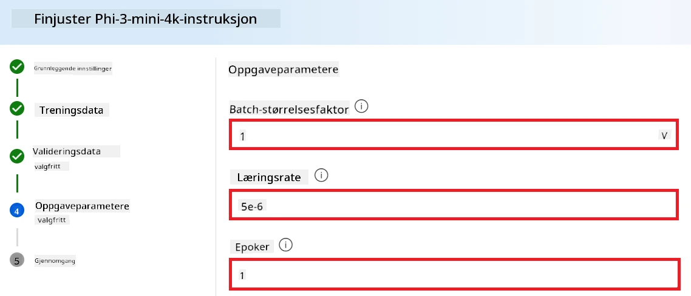

1. Velg **Submit** for å starte finjusteringsprosessen.

    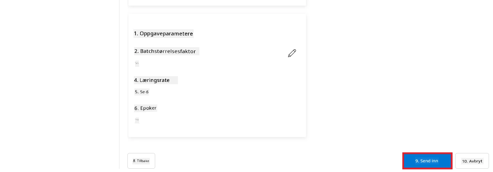

1. Når modellen din er finjustert, vil status vises som **Completed**, som vist i bildet nedenfor. Nå kan du distribuere modellen og bruke den i din egen applikasjon, i playground eller i prompt flyt. For mer informasjon, se [Hvordan distribuere Phi-3 familie av små språkmodeller med Microsoft Foundry](https://learn.microsoft.com/azure/ai-studio/how-to/deploy-models-phi-3?tabs=phi-3-5&pivots=programming-language-python).

    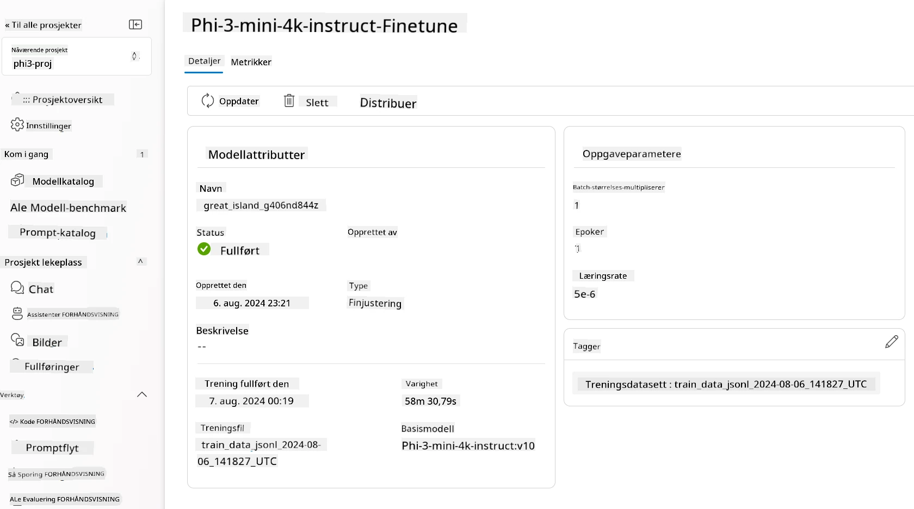

> [!NOTE]
> For mer detaljert informasjon om finjustering av Phi-3, besøk [Finjuster Phi-3 modeller i Microsoft Foundry](https://learn.microsoft.com/azure/ai-studio/how-to/fine-tune-phi-3?tabs=phi-3-mini).

## Rydd opp i dine finjusterte modeller

Du kan slette en finjustert modell fra finjusteringslisten i [Microsoft Foundry](https://ai.azure.com) eller fra modellens detaljside. Velg den finjusterte modellen du ønsker å slette på Fin-tuning siden, og velg deretter Slett-knappen for å fjerne den finjusterte modellen.

> [!NOTE]
> Du kan ikke slette en egendefinert modell dersom den har en eksisterende distribusjon. Du må først slette distribusjonen før du kan slette den egendefinerte modellen.

## Kostnader og kvoter

### Kostnads- og kvotevurderinger for Phi-3 modeller finjustert som en tjeneste

Phi-modeller finjustert som en tjeneste tilbys av Microsoft og er integrert med Microsoft Foundry for bruk. Du kan finne prisinformasjon ved [distribusjon](https://learn.microsoft.com/azure/ai-studio/how-to/deploy-models-phi-3?tabs=phi-3-5&pivots=programming-language-python) eller finjustering av modeller under fanen Pris og vilkår i distribusjonsveiviseren.

## Innholdsfiltrering

Modeller distribuert som tjeneste med pay-as-you-go er beskyttet av Azure AI Content Safety. Når distribuert til sanntid-endepunkter kan du velge å fravelge denne funksjonaliteten. Med Azure AI content safety aktivert, går både prompt og resultat gjennom et ensemble av klassifiseringsmodeller som har som mål å oppdage og forhindre utskrift av skadelig innhold. Innholdsfilteret oppdager og iverksetter tiltak mot spesifikke kategorier av potensielt skadelig innhold i både input prompts og output-resultater. Les mer om [Azure AI Content Safety](https://learn.microsoft.com/azure/ai-studio/concepts/content-filtering).

**Konfigurasjon for finjustering**

Hyperparametere: Definer hyperparametere som læringsrate, batchstørrelse og antall trenings-epoker.

**Tapfunksjon**

Velg en passende tapfunksjon for oppgaven din (f.eks. kryssentropi).

**Optimalisator**

Velg en optimalisator (f.eks. Adam) for gradientoppdateringer under trening.

**Finjusteringsprosess**

- Last inn forhåndstrent modell: Last inn Phi-3 Mini-sjekkpunktet.
- Legg til egendefinerte lag: Legg til oppgavespesifikke lag (f.eks. klassifiseringshode for chat-instruksjoner).

**Tren modellen**  
Finjuster modellen ved å bruke ditt forberedte datasett. Overvåk treningsprogresjonen og juster hyperparametere ved behov.

**Evaluering og validering**

Valideringssett: Del dataene dine i trenings- og valideringssett.

**Evaluer ytelsen**

Bruk metrikker som nøyaktighet, F1-score eller perplexity for å vurdere modellens ytelse.

## Lagre finjustert modell

**Sjekkpunkt**  
Lagre sjekkpunktet for din finjusterte modell for fremtidig bruk.

## Distribusjon

- Distribuer som en webtjeneste: Distribuer din finjusterte modell som en webtjeneste i Microsoft Foundry.
- Test endepunktet: Send testforespørsler til det distribuerte endepunktet for å verifisere funksjonalitet.

## Iterer og forbedre

Iterer: Hvis ytelsen ikke er tilfredsstillende, gjør endringer ved å justere hyperparametere, legge til mer data eller finjustere i flere epoker.

## Overvåk og finpuss

Overvåk kontinuerlig modellens oppførsel og foreta nødvendige forbedringer.

## Tilpass og utvid

Egendefinerte oppgaver: Phi-3 Mini kan finjusteres for mange oppgaver utover chat-instruksjoner. Utforsk flere bruksområder!  
Eksperimenter: Prøv ulike arkitekturer, lagkombinasjoner og teknikker for å forbedre ytelsen.

> [!NOTE]
> Finjustering er en iterativ prosess. Eksperimenter, lær og tilpass modellen for å oppnå best mulig resultat for din spesifikke oppgave!

---

<!-- CO-OP TRANSLATOR DISCLAIMER START -->
**Ansvarsfraskrivelse**:
Dette dokumentet er oversatt ved hjelp av AI-oversettelsestjenesten [Co-op Translator](https://github.com/Azure/co-op-translator). Selv om vi streber etter nøyaktighet, vennligst vær oppmerksom på at automatiske oversettelser kan inneholde feil eller unøyaktigheter. Det opprinnelige dokumentet på originalspråket skal anses som den autoritative kilden. For kritisk informasjon anbefales profesjonell menneskelig oversettelse. Vi er ikke ansvarlige for misforståelser eller feiltolkninger som oppstår ved bruk av denne oversettelsen.
<!-- CO-OP TRANSLATOR DISCLAIMER END -->