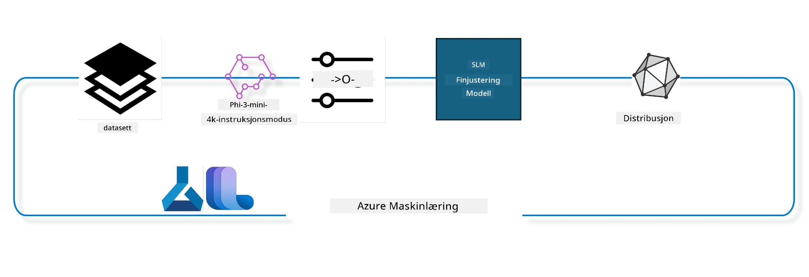

## Hvordan bruke chat-completion-komponenter fra Azure ML systemregister for finjustering av en modell

I dette eksempelet skal vi finjustere Phi-3-mini-4k-instruct-modellen for å fullføre en samtale mellom 2 personer ved bruk av ultrachat_200k-datasettet.



Eksemplet vil vise deg hvordan du utfører finjustering ved hjelp av Azure ML SDK og Python, og deretter deployerer den finjusterte modellen til en online endepunkt for sanntidsinferenz.

### Treningsdata

Vi vil bruke datasettet ultrachat_200k. Dette er en sterkt filtrert versjon av UltraChat-datasettet og ble brukt til å trene Zephyr-7B-β, en toppmoderne 7b-chatmodell.

### Modell

Vi vil bruke Phi-3-mini-4k-instruct-modellen for å vise hvordan brukeren kan finjustere en modell for chat-completion-oppgaven. Hvis du åpnet denne notatboken fra et spesifikt modelkort, husk å erstatte det spesifikke modellnavnet.

### Oppgaver

- Velg en modell å finjustere.
- Velg og utforsk treningsdata.
- Konfigurer finjusteringsjobben.
- Kjør finjusteringsjobben.
- Gå gjennom trenings- og evalueringsmetrikker.
- Registrer den finjusterte modellen.
- Distribuer den finjusterte modellen for sanntidsinferenz.
- Rydd opp ressurser.

## 1. Sett opp forutsetninger

- Installer avhengigheter
- Koble til AzureML Workspace. Les mer om å sette opp SDK-autentisering. Erstatt <WORKSPACE_NAME>, <RESOURCE_GROUP> og <SUBSCRIPTION_ID> nedenfor.
- Koble til azureml systemregister
- Sett et valgfritt eksperimentnavn
- Sjekk eller opprett compute.

> [!NOTE]
> Krav: én GPU-node kan ha flere GPU-kort. For eksempel, i én node av Standard_NC24rs_v3 finnes det 4 NVIDIA V100 GPUer, mens i Standard_NC12s_v3 finnes det 2 NVIDIA V100 GPUer. Se dokumentasjonen for denne informasjonen. Antall GPU-kort per node settes i parameteren gpus_per_node nedenfor. Å sette denne verdien riktig vil sikre utnyttelse av alle GPUer i noden. Anbefalte GPU compute SKUer kan finnes her og her.

### Python-biblioteker

Installer avhengigheter ved å kjøre cellen nedenfor. Dette er ikke et valgfritt trinn hvis du kjører i et nytt miljø.

```bash
pip install azure-ai-ml
pip install azure-identity
pip install datasets==2.9.0
pip install mlflow
pip install azureml-mlflow
```

### Interaksjon med Azure ML

1. Dette Python-skriptet brukes for å samhandle med Azure Machine Learning (Azure ML)-tjenesten. Her er en oversikt over hva det gjør:

    - Det importerer nødvendige moduler fra azure.ai.ml, azure.identity og azure.ai.ml.entities-pakkene. Det importerer også time-modulen.

    - Det forsøker å autentisere med DefaultAzureCredential(), som gir en forenklet autentiseringsopplevelse for raskt å komme i gang med utvikling av applikasjoner som kjører i Azure-skyen. Hvis dette feiler, faller det tilbake til InteractiveBrowserCredential(), som gir en interaktiv påloggingsprompt.

    - Det prøver deretter å opprette en MLClient-instans med from_config-metoden, som leser konfigurasjonen fra standard konfigurasjonsfil (config.json). Hvis dette feiler opprettes MLClient-instansen manuelt ved å oppgi subscription_id, resource_group_name og workspace_name.

    - Det oppretter en annen MLClient-instans, denne gangen for Azure ML-registeret kalt "azureml". Dette registeret er der modeller, finjusteringspipelines og miljøer lagres.

    - Det setter experiment_name til "chat_completion_Phi-3-mini-4k-instruct".

    - Det genererer et unikt tidsstempel ved å konvertere den nåværende tiden (i sekunder siden epoken, som flyttall) til et heltall og deretter til en streng. Dette tidsstempelet kan brukes for å lage unike navn og versjoner.

    ```python
    # Importer nødvendige moduler fra Azure ML og Azure Identity
    from azure.ai.ml import MLClient
    from azure.identity import (
        DefaultAzureCredential,
        InteractiveBrowserCredential,
    )
    from azure.ai.ml.entities import AmlCompute
    import time  # Importer time-modulen
    
    # Prøv å autentisere ved bruk av DefaultAzureCredential
    try:
        credential = DefaultAzureCredential()
        credential.get_token("https://management.azure.com/.default")
    except Exception as ex:  # Hvis DefaultAzureCredential feiler, bruk InteractiveBrowserCredential
        credential = InteractiveBrowserCredential()
    
    # Prøv å opprette en MLClient-instans ved bruk av standard konfigurasjonsfil
    try:
        workspace_ml_client = MLClient.from_config(credential=credential)
    except:  # Hvis det feiler, opprett en MLClient-instans ved å manuelt oppgi detaljene
        workspace_ml_client = MLClient(
            credential,
            subscription_id="<SUBSCRIPTION_ID>",
            resource_group_name="<RESOURCE_GROUP>",
            workspace_name="<WORKSPACE_NAME>",
        )
    
    # Opprett en annen MLClient-instans for Azure ML-registret med navnet "azureml"
    # Dette registeret er der modeller, finjusteringspipelines og miljøer lagres
    registry_ml_client = MLClient(credential, registry_name="azureml")
    
    # Sett eksperimentnavnet
    experiment_name = "chat_completion_Phi-3-mini-4k-instruct"
    
    # Generer et unikt tidsstempel som kan brukes for navn og versjoner som må være unike
    timestamp = str(int(time.time()))
    ```

## 2. Velg en grunnmodell for finjustering

1. Phi-3-mini-4k-instruct er en 3,8 milliarder parametere stor, lettvekts, toppmoderne åpen modell basert på datasett som ble brukt for Phi-2. Modellen tilhører Phi-3-modelleksemplet, og Mini-versjonen kommer i to varianter 4K og 128K som er kontekstlengden (i tokens) den kan støtte. Vi må finjustere modellen for vårt spesifikke formål for å bruke den. Du kan bla gjennom disse modellene i modellkatalogen i AzureML Studio ved å filtrere på chat-completion-oppgaven. I dette eksemplet bruker vi Phi-3-mini-4k-instruct-modellen. Hvis du har åpnet denne notatboken for en annen modell, erstatt modellnavnet og versjonen tilsvarende.

> [!NOTE]
> modellens id-egenskap. Denne vil bli brukt som input til finjusteringsjobben. Dette er også tilgjengelig som Asset ID-feltet på modelsiden i AzureML Studio Model Catalog.

2. Dette Python-skriptet samhandler med Azure Machine Learning (Azure ML)-tjenesten. Her er en oversikt over hva det gjør:

    - Det setter model_name til "Phi-3-mini-4k-instruct".

    - Det bruker get-metoden fra models-egenskapen til registry_ml_client-objektet for å hente nyeste versjon av modellen med spesifisert navn fra Azure ML-registeret. get-metoden kalles med to argumenter: modellnavnet og en label som spesifiserer at nyeste versjon skal hentes.

    - Det skriver ut en melding til konsollen som indikerer navn, versjon og ID på modellen som vil bli brukt til finjustering. format-metoden til strenger brukes for å sette inn navn, versjon og ID i meldingen. Navn, versjon og ID hentes som egenskaper til foundation_model-objektet.

    ```python
    # Angi modellnavnet
    model_name = "Phi-3-mini-4k-instruct"
    
    # Hent den nyeste versjonen av modellen fra Azure ML-registeret
    foundation_model = registry_ml_client.models.get(model_name, label="latest")
    
    # Skriv ut modellnavn, versjon og ID
    # Denne informasjonen er nyttig for sporing og feilsøking
    print(
        "\n\nUsing model name: {0}, version: {1}, id: {2} for fine tuning".format(
            foundation_model.name, foundation_model.version, foundation_model.id
        )
    )
    ```

## 3. Opprett compute som skal brukes for jobben

Finjusteringsjobben fungerer KUN med GPU-compute. Størrelsen på computen avhenger av hvor stor modellen er, og i de fleste tilfeller er det utfordrende å identifisere riktig compute for jobben. I denne cellen guider vi brukeren til å velge riktig compute for jobben.

> [!NOTE]
> Compute som er listet nedenfor fungerer med den mest optimaliserte konfigurasjonen. Endringer i konfigurasjonen kan føre til Cuda Out Of Memory-feil. I slike tilfeller, prøv å oppgradere computen til en større størrelse.

> [!NOTE]
> Når du velger compute_cluster_size nedenfor, må du forsikre deg om at computen er tilgjengelig i din ressursgruppe. Hvis en spesiell compute ikke er tilgjengelig, kan du sende forespørsel om tilgang til compute-ressursene.

### Sjekke modell for støtte til finjustering

1. Dette Python-skriptet samhandler med en Azure Machine Learning (Azure ML)-modell. Her er en oversikt over hva det gjør:

    - Det importerer ast-modulen, som tilbyr funksjoner for å bearbeide trær av Python abstrakt syntaks.

    - Det sjekker om foundation_model-objektet (som representerer en modell i Azure ML) har en tagg kalt finetune_compute_allow_list. Tagger i Azure ML er nøkkel-verdi-par som du kan lage og bruke til å filtrere og sortere modeller.

    - Hvis finetune_compute_allow_list finnes, bruker det ast.literal_eval for å trygt tolke taggens verdi (en streng) til en Python-liste. Denne listen tilordnes så til computes_allow_list-variabelen. Deretter skriver det ut en melding om at compute bør opprettes fra listen.

    - Hvis taggen ikke finnes, settes computes_allow_list til None og det skrives ut melding om at finetune_compute_allow_list ikke er en del av modellens tagger.

    - Oppsummert sjekker skriptet en spesifikk tagg i modellens metadata, konverterer taggens verdi til liste hvis den finnes, og gir tilbakemelding til brukeren.

    ```python
    # Importer ast-modulen, som gir funksjoner for å behandle trær av Pythons abstrakte syntaksgrammatikk
    import ast
    
    # Sjekk om 'finetune_compute_allow_list'-taggen er til stede i modellens tagger
    if "finetune_compute_allow_list" in foundation_model.tags:
        # Hvis taggen er til stede, bruk ast.literal_eval for trygt å analysere taggens verdi (en streng) til en Python-liste
        computes_allow_list = ast.literal_eval(
            foundation_model.tags["finetune_compute_allow_list"]
        )  # konverter streng til Python-liste
        # Skriv ut en melding som indikerer at en compute skal opprettes fra listen
        print(f"Please create a compute from the above list - {computes_allow_list}")
    else:
        # Hvis taggen ikke er til stede, sett computes_allow_list til None
        computes_allow_list = None
        # Skriv ut en melding som indikerer at 'finetune_compute_allow_list'-taggen ikke er en del av modellens tagger
        print("`finetune_compute_allow_list` is not part of model tags")
    ```

### Sjekke Compute Instance

1. Dette Python-skriptet samhandler med Azure Machine Learning (Azure ML)-tjenesten og utfører flere kontroller på en compute-instans. Her er en oversikt over hva det gjør:

    - Det prøver å hente compute-instansen med navnet lagret i compute_cluster fra Azure ML-arbeidsområdet. Hvis provisioning-tilstanden til compute-instansen er "failed", kaster den en ValueError.

    - Det sjekker om computes_allow_list ikke er None. Hvis det ikke er det, konverterer den alle compute-størrelser i listen til små bokstaver og sjekker om størrelsen på din nåværende compute-instans finnes i listen. Hvis ikke, kaster den en ValueError.

    - Hvis computes_allow_list er None, sjekker den om størrelsen på compute-instansen er i en liste over ikke-støttede GPU VM-størrelser. Hvis den er det, kaster den en ValueError.

    - Den henter en liste over alle tilgjengelige compute-størrelser i arbeidsområdet. Den itererer så over listen, og for hver compute-størrelse sjekker den om navnet matcher størrelsen på den nåværende compute-instansen. Hvis ja, henter den antall GPUer for den compute-størrelsen og setter gpu_count_found til True.

    - Hvis gpu_count_found er True, skrives antall GPUer i compute-instansen ut. Hvis False, kaster den en ValueError.

    - Oppsummert utfører skriptet flere kontroller på en compute-instans i en Azure ML-arbeidsområde, inkludert sjekk av provisioning-status, sjekk av størrelse opp mot en tillatelsesliste eller nektelsesliste, og sjekk av antall GPUer.

    ```python
    # Skriv ut unntaksbeskjeden
    print(e)
    # Kast en ValueError hvis beregningsstørrelsen ikke er tilgjengelig i arbeidsområdet
    raise ValueError(
        f"WARNING! Compute size {compute_cluster_size} not available in workspace"
    )
    
    # Hent beregningsinstansen fra Azure ML-arbeidsområdet
    compute = workspace_ml_client.compute.get(compute_cluster)
    # Sjekk om provisjoneringstilstanden for beregningsinstansen er "failed"
    if compute.provisioning_state.lower() == "failed":
        # Kast en ValueError hvis provisjoneringstilstanden er "failed"
        raise ValueError(
            f"Provisioning failed, Compute '{compute_cluster}' is in failed state. "
            f"please try creating a different compute"
        )
    
    # Sjekk om computes_allow_list ikke er None
    if computes_allow_list is not None:
        # Konverter alle beregningsstørrelser i computes_allow_list til små bokstaver
        computes_allow_list_lower_case = [x.lower() for x in computes_allow_list]
        # Sjekk om størrelsen på beregningsinstansen finnes i computes_allow_list_lower_case
        if compute.size.lower() not in computes_allow_list_lower_case:
            # Kast en ValueError hvis størrelsen på beregningsinstansen ikke finnes i computes_allow_list_lower_case
            raise ValueError(
                f"VM size {compute.size} is not in the allow-listed computes for finetuning"
            )
    else:
        # Definer en liste over ikke-støttede GPU VM-størrelser
        unsupported_gpu_vm_list = [
            "standard_nc6",
            "standard_nc12",
            "standard_nc24",
            "standard_nc24r",
        ]
        # Sjekk om størrelsen på beregningsinstansen finnes i unsupported_gpu_vm_list
        if compute.size.lower() in unsupported_gpu_vm_list:
            # Kast en ValueError hvis størrelsen på beregningsinstansen finnes i unsupported_gpu_vm_list
            raise ValueError(
                f"VM size {compute.size} is currently not supported for finetuning"
            )
    
    # Initialiser et flagg for å sjekke om antall GPU-er i beregningsinstansen er funnet
    gpu_count_found = False
    # Hent en liste over alle tilgjengelige beregningsstørrelser i arbeidsområdet
    workspace_compute_sku_list = workspace_ml_client.compute.list_sizes()
    available_sku_sizes = []
    # Iterer over listen av tilgjengelige beregningsstørrelser
    for compute_sku in workspace_compute_sku_list:
        available_sku_sizes.append(compute_sku.name)
        # Sjekk om navnet på beregningsstørrelsen samsvarer med størrelsen på beregningsinstansen
        if compute_sku.name.lower() == compute.size.lower():
            # Hvis det gjør det, hent antall GPU-er for denne beregningsstørrelsen og sett gpu_count_found til True
            gpus_per_node = compute_sku.gpus
            gpu_count_found = True
    # Hvis gpu_count_found er True, skriv ut antall GPU-er i beregningsinstansen
    if gpu_count_found:
        print(f"Number of GPU's in compute {compute.size}: {gpus_per_node}")
    else:
        # Hvis gpu_count_found er False, kast en ValueError
        raise ValueError(
            f"Number of GPU's in compute {compute.size} not found. Available skus are: {available_sku_sizes}."
            f"This should not happen. Please check the selected compute cluster: {compute_cluster} and try again."
        )
    ```

## 4. Velg datasett for finjustering av modell

1. Vi bruker datasettet ultrachat_200k. Datasettet har fire splitt, som egner seg for Supervised fine-tuning (sft).
Genereringsrangering (gen). Antall eksempler per splitt vises som følger:

    ```bash
    train_sft test_sft  train_gen  test_gen
    207865  23110  256032  28304
    ```

1. De neste cellene viser grunnleggende databehandling for finjustering:

### Visualiser noen datarader

Vi ønsker at dette eksempelet skal kjøre raskt, så lagrer train_sft, test_sft-filer som inneholder 5% av allerede trimmingede rader. Dette betyr at den finjusterte modellen vil ha lavere nøyaktighet, og derfor bør den ikke brukes i produksjon.
download-dataset.py brukes til å laste ned ultrachat_200k-datasettet og transformere datasettet til et format som pipeline-komponentene for finjustering kan bruke. Siden datasettet er stort, har vi her bare en del av datasettet.

1. Å kjøre skriptet nedenfor laster kun ned 5% av dataene. Dette kan økes ved å endre parameteren dataset_split_pc til ønsket prosentandel.

> [!NOTE]
> Noen språkmodeller har forskjellige språk-koder, og derfor bør kolonnenavn i datasettet reflektere dette.

1. Her er et eksempel på hvordan dataene bør se ut.
Datasettet for chat-completion lagres i parquet-format med hvert oppslag som bruker følgende skjema:

    - Dette er et JSON (JavaScript Object Notation)-dokument, et populært datautvekslingsformat. Det er ikke kjørbar kode, men en måte å lagre og transportere data på. Her er gjennomgang av strukturen:

    - "prompt": Denne nøkkelen inneholder en strengverdi som representerer en oppgave eller spørsmål stilt til en AI-assistent.

    - "messages": Denne nøkkelen inneholder et array av objekter. Hvert objekt representerer en melding i en samtale mellom en bruker og en AI-assistent. Hver melding har to nøkler:

    - "content": Denne nøkkelen inneholder en strengverdi som er innholdet i meldingen.
    - "role": Denne nøkkelen inneholder en strengverdi som angir rollen til avsenderen av meldingen. Det kan være "user" eller "assistant".
    - "prompt_id": Denne nøkkelen inneholder en strengverdi som er en unik identifikator for prompten.

1. I dette spesifikke JSON-dokumentet representeres en samtale der en bruker ber en AI-assistent om å lage en protagonist for en dystopisk historie. Assistenten svarer, og brukeren ber deretter om flere detaljer. Assistenten samtykker til å gi flere detaljer. Hele samtalen er knyttet til en spesifikk prompt-id.

    ```python
    {
        // The task or question posed to an AI assistant
        "prompt": "Create a fully-developed protagonist who is challenged to survive within a dystopian society under the rule of a tyrant. ...",
        
        // An array of objects, each representing a message in a conversation between a user and an AI assistant
        "messages":[
            {
                // The content of the user's message
                "content": "Create a fully-developed protagonist who is challenged to survive within a dystopian society under the rule of a tyrant. ...",
                // The role of the entity that sent the message
                "role": "user"
            },
            {
                // The content of the assistant's message
                "content": "Name: Ava\n\n Ava was just 16 years old when the world as she knew it came crashing down. The government had collapsed, leaving behind a chaotic and lawless society. ...",
                // The role of the entity that sent the message
                "role": "assistant"
            },
            {
                // The content of the user's message
                "content": "Wow, Ava's story is so intense and inspiring! Can you provide me with more details.  ...",
                // The role of the entity that sent the message
                "role": "user"
            }, 
            {
                // The content of the assistant's message
                "content": "Certainly! ....",
                // The role of the entity that sent the message
                "role": "assistant"
            }
        ],
        
        // A unique identifier for the prompt
        "prompt_id": "d938b65dfe31f05f80eb8572964c6673eddbd68eff3db6bd234d7f1e3b86c2af"
    }
    ```

### Last ned data

1. Dette Python-skriptet brukes til å laste ned et datasett ved hjelp av et hjelpeprogram kalt download-dataset.py. Her er en gjennomgang av hva det gjør:

    - Det importerer os-modulen som tilbyr en plattformuavhengig måte å bruke operativsystemavhengig funksjonalitet på.

    - Det bruker os.system-funksjonen til å kjøre download-dataset.py-skriptet i shell med spesifikke kommandolinjeargumenter. Argumentene spesifiserer datasettet som skal lastes ned (HuggingFaceH4/ultrachat_200k), mappen det skal lastes ned til (ultrachat_200k_dataset) og prosentandelen av datasettet som skal splittes (5). os.system-funksjonen returnerer avslutningsstatusen på kommandoen den kjørte; denne lagres i exit_status-variabelen.

    - Det sjekker om exit_status ikke er 0. I Unix-lignende operativsystemer indikerer 0 at en kommando lykkes, andre tall indikerer feil. Hvis exit_status ikke er 0, kastes en Exception med en melding om at det var en feil ved nedlasting av datasettet.

    - Oppsummert kjører skriptet en kommando for å laste ned et datasett ved hjelp av et hjelpeprogram, og kaster unntak hvis kommandoen mislykkes.

    ```python
    # Importer os-modulen, som gir en måte å bruke operativsystemavhengig funksjonalitet på
    import os
    
    # Bruk os.system-funksjonen for å kjøre download-dataset.py-skriptet i shell med spesifikke kommandolinjeargumenter
    # Argumentene spesifiserer datasettet som skal lastes ned (HuggingFaceH4/ultrachat_200k), katalogen det skal lastes ned til (ultrachat_200k_dataset), og prosentandelen av datasettet som skal deles (5)
    # os.system-funksjonen returnerer avslutningstilstanden til kommandoen den utførte; denne tilstanden lagres i variabelen exit_status
    exit_status = os.system(
        "python ./download-dataset.py --dataset HuggingFaceH4/ultrachat_200k --download_dir ultrachat_200k_dataset --dataset_split_pc 5"
    )
    
    # Sjekk om exit_status ikke er 0
    # I Unix-lignende operativsystemer indikerer vanligvis en avslutningstilstand på 0 at en kommando har lykkes, mens et hvilket som helst annet tall indikerer en feil
    # Hvis exit_status ikke er 0, kast en Exception med en melding som indikerer at det oppstod en feil ved nedlasting av datasettet
    if exit_status != 0:
        raise Exception("Error downloading dataset")
    ```

### Last inn data i en DataFrame

1. Dette Python-skriptet laster en JSON Lines-fil inn i en pandas DataFrame og viser de første 5 radene. Her er en gjennomgang av hva det gjør:

    - Det importerer pandas-biblioteket, som er et kraftig bibliotek for datamanipulering og analyse.

    - Det setter maksimal kolonnebredde for pandas visningsalternativer til 0. Det betyr at all tekst i hver kolonne vises uten forkorting når DataFramen printes ut.
- Den bruker funksjonen pd.read_json for å laste filen train_sft.jsonl fra ultrachat_200k_dataset-katalogen inn i en DataFrame. Argumentet lines=True indikerer at filen er i JSON Lines-format, hvor hver linje er et eget JSON-objekt.

- Den bruker metoden head for å vise de første 5 radene i DataFrame-en. Hvis DataFrame-en har færre enn 5 rader, vil alle bli vist.

- Kort oppsummert laster dette skriptet en JSON Lines-fil inn i en DataFrame og viser de første 5 radene med full kolonne-tekst.

    ```python
    # Importer pandas-biblioteket, som er et kraftig verktøy for datamanipulering og analyse
    import pandas as pd
    
    # Sett maksimal kolonnebredde for pandas' visningsalternativer til 0
    # Dette betyr at hele teksten i hver kolonne vil vises uten forkorting når DataFrame skrives ut
    pd.set_option("display.max_colwidth", 0)
    
    # Bruk pd.read_json-funksjonen for å laste train_sft.jsonl-filen fra ultrachat_200k_dataset-mappen inn i en DataFrame
    # Argumentet lines=True indikerer at filen er i JSON Lines-format, der hver linje er et eget JSON-objekt
    df = pd.read_json("./ultrachat_200k_dataset/train_sft.jsonl", lines=True)
    
    # Bruk head-metoden for å vise de første 5 radene i DataFrame
    # Hvis DataFrame har færre enn 5 rader, vil alle vises
    df.head()
    ```

## 5. Send inn finjusteringsjobben ved bruk av modellen og data som inndata

Opprett jobben som bruker komponenten chat-completion pipeline. Lær mer om alle parameterne som støttes for finjustering.

### Definer finjusteringsparametere

1. Finjusteringsparametere kan deles inn i 2 kategorier - treningsparametere, optimaliseringsparametere

1. Treningsparametere definerer treningsaspektene som for eksempel -

    - Hvilken optimizer og scheduler som skal brukes
    - Metoden som skal optimaliseres under finjusteringen
    - Antall treningssteg og batch-størrelse, og så videre
    - Optimaliseringsparameterne hjelper til med å optimalisere GPU-minnet og bruke beregningsressursene effektivt.

1. Under er noen av parameterne som tilhører denne kategorien. Optimaliseringsparametere varierer for hver modell og pakkes med modellen for å håndtere disse variasjonene.

    - Aktiver deepspeed og LoRA
    - Aktiver mixed precision trening
    - Aktiver multi-node trening

> [!NOTE]
> Veiledet finjustering kan føre til tap av justering eller katastrofalt glemsel. Vi anbefaler å sjekke for dette problemet og kjøre en justeringsfase etter at du har finjustert.

### Finjusteringsparametere

1. Dette Python-skriptet setter opp parametere for finjustering av en maskinlæringsmodell. Her er en oversikt over hva det gjør:

    - Det setter opp standard treningsparametere som antall epoker, batch-størrelser for trening og evaluering, læringsrate, og type læringsrategenerator.

    - Det setter opp standard optimaliseringsparametere som om Layer-wise Relevance Propagation (LoRa) og DeepSpeed skal brukes, og DeepSpeed-stadiet.

    - Det kombinerer trenings- og optimaliseringsparametere i en enkelt ordbok kalt finetune_parameters.

    - Det sjekker om foundation_model har noen modelspecifikke standardparametere. Hvis det finnes slike, skriver det ut en advarselsmelding og oppdaterer finetune_parameters-ordboken med disse modelspecific defaults. Funktionen ast.literal_eval brukes for å konvertere modelspecific defaults fra en streng til en Python-ordbok.

    - Det skriver ut det endelige settet med finjusteringsparametere som skal brukes for kjøringen.

    - Kort oppsummert setter dette skriptet opp og viser parametere for finjustering av en maskinlæringsmodell, med mulighet til å overstyre standardparametere med modelspecific defaults.

    ```python
    # Sett opp standard treningsparametere som antall trenings-epoker, batch-størrelser for trening og evaluering, læringsrate, og type læringsrate-planlegger
    training_parameters = dict(
        num_train_epochs=3,
        per_device_train_batch_size=1,
        per_device_eval_batch_size=1,
        learning_rate=5e-6,
        lr_scheduler_type="cosine",
    )
    
    # Sett opp standard optimaliseringsparametere som om Layer-wise Relevance Propagation (LoRa) og DeepSpeed skal brukes, og DeepSpeed-stadiet
    optimization_parameters = dict(
        apply_lora="true",
        apply_deepspeed="true",
        deepspeed_stage=2,
    )
    
    # Kombiner trenings- og optimaliseringsparametere til en enkelt ordbok kalt finetune_parameters
    finetune_parameters = {**training_parameters, **optimization_parameters}
    
    # Sjekk om foundation_model har noen modellspesifikke standardparametere
    # Hvis det har det, skriv ut en advarsel og oppdater finetune_parameters-ordboken med disse modellspesifikke standardene
    # Funksjonen ast.literal_eval brukes for å konvertere modellspesifikke standarder fra en streng til en Python-ordbok
    if "model_specific_defaults" in foundation_model.tags:
        print("Warning! Model specific defaults exist. The defaults could be overridden.")
        finetune_parameters.update(
            ast.literal_eval(  # konverter streng til Python-ordbok
                foundation_model.tags["model_specific_defaults"]
            )
        )
    
    # Skriv ut det endelige settet med finjusteringsparametere som skal brukes for kjøringen
    print(
        f"The following finetune parameters are going to be set for the run: {finetune_parameters}"
    )
    ```

### Treningspipeline

1. Dette Python-skriptet definerer en funksjon for å generere et visningsnavn for en maskinlæringstreningspipeline, og kaller deretter denne funksjonen for å generere og skrive ut visningsnavnet. Her er en oversikt over hva det gjør:

1. Funksjonen get_pipeline_display_name defineres. Denne funksjonen genererer et visningsnavn basert på ulike parametere relatert til treningspipen.

1. Inne i funksjonen beregnes total batch-størrelse ved å multiplisere batch-størrelse per enhet, antall gradientakkumuleringssteg, antall GPU-er per node, og antall noder som brukes for finjustering.

1. Den henter ulike andre parametere som læringsratescheduler-typen, om DeepSpeed er aktivert, DeepSpeed-stadiet, om Layer-wise Relevance Propagation (LoRa) brukes, grensen for antall modellkontroller som beholdes, og maksimal sekvenslengde.

1. Den konstruerer en streng som inkluderer alle disse parameterne, separert med bindestreker. Hvis DeepSpeed eller LoRa er aktivert, inkluderes "ds" etterfulgt av DeepSpeed-stadiet, eller "lora" respektivt. Hvis ikke, inkluderes henholdsvis "nods" eller "nolora".

1. Funksjonen returnerer denne strengen, som tjener som visningsnavn for treningspipen.

1. Etter at funksjonen er definert, kalles den for å generere visningsnavnet som deretter skrives ut.

1. Kort oppsummert genererer dette skriptet et visningsnavn for en maskinlæringstreningspipeline basert på ulike parametere, og skriver ut visningsnavnet.

    ```python
    # Definer en funksjon for å generere et visningsnavn for treningsrøret
    def get_pipeline_display_name():
        # Beregn total batchstørrelse ved å multiplisere batchstørrelsen per enhet, antall gradientakkumulasjonstrinn, antall GPUer per node og antall noder brukt til finjustering
        batch_size = (
            int(finetune_parameters.get("per_device_train_batch_size", 1))
            * int(finetune_parameters.get("gradient_accumulation_steps", 1))
            * int(gpus_per_node)
            * int(finetune_parameters.get("num_nodes_finetune", 1))
        )
        # Hent typen for læringsrategenerator
        scheduler = finetune_parameters.get("lr_scheduler_type", "linear")
        # Hent om DeepSpeed er brukt
        deepspeed = finetune_parameters.get("apply_deepspeed", "false")
        # Hent DeepSpeed-stadiet
        ds_stage = finetune_parameters.get("deepspeed_stage", "2")
        # Hvis DeepSpeed er brukt, inkluder "ds" etterfulgt av DeepSpeed-stadiet i visningsnavnet; hvis ikke, inkluder "nods"
        if deepspeed == "true":
            ds_string = f"ds{ds_stage}"
        else:
            ds_string = "nods"
        # Hent om Layer-wise Relevance Propagation (LoRa) er brukt
        lora = finetune_parameters.get("apply_lora", "false")
        # Hvis LoRa er brukt, inkluder "lora" i visningsnavnet; hvis ikke, inkluder "nolora"
        if lora == "true":
            lora_string = "lora"
        else:
            lora_string = "nolora"
        # Hent grensen for hvor mange modell-sjekkpunkter som skal beholdes
        save_limit = finetune_parameters.get("save_total_limit", -1)
        # Hent maksimal sekvenslengde
        seq_len = finetune_parameters.get("max_seq_length", -1)
        # Konstruer visningsnavnet ved å sette sammen alle disse parameterne, adskilt med bindestreker
        return (
            model_name
            + "-"
            + "ultrachat"
            + "-"
            + f"bs{batch_size}"
            + "-"
            + f"{scheduler}"
            + "-"
            + ds_string
            + "-"
            + lora_string
            + f"-save_limit{save_limit}"
            + f"-seqlen{seq_len}"
        )
    
    # Kall funksjonen for å generere visningsnavnet
    pipeline_display_name = get_pipeline_display_name()
    # Skriv ut visningsnavnet
    print(f"Display name used for the run: {pipeline_display_name}")
    ```

### Konfigurere pipeline

Dette Python-skriptet definerer og konfigurerer en maskinlæringpipeline ved bruk av Azure Machine Learning SDK. Her er en oversikt over hva det gjør:

1. Det importerer nødvendige moduler fra Azure AI ML SDK.

1. Det henter en pipelinekomponent som heter "chat_completion_pipeline" fra registeret.

1. Det definerer en pipelinejobb ved hjelp av `@pipeline`-dekoratøren og funksjonen `create_pipeline`. Navnet på pipelinen settes til `pipeline_display_name`.

1. Inne i funksjonen `create_pipeline` initialiserer den den hentede pipelinekomponenten med ulike parametere, inkludert modellbane, databehandlingsklynger for ulike stadier, datasettforgreninger for trening og testing, antall GPU-er som skal brukes for finjustering, og andre finjusteringsparametere.

1. Den kobler utdataene fra finjusteringsjobben til utdataene for pipelinejobben. Dette gjøres slik at den finjusterte modellen enkelt kan registreres, noe som kreves for å distribuere modellen til en online- eller batch-endepunkt.

1. Den oppretter en instans av pipelinen ved å kalle `create_pipeline`-funksjonen.

1. Den setter `force_rerun`-innstillingen til `True`, noe som betyr at bufrede resultater fra tidligere jobber ikke vil bli brukt.

1. Den setter `continue_on_step_failure`-innstillingen til `False`, slik at pipelinen stopper hvis en hvilken som helst steg mislykkes.

1. Kort oppsummert definerer og konfigurerer dette skriptet en maskinlæringpipeline for en chat fullføringsoppgave ved bruk av Azure Machine Learning SDK.

    ```python
    # Importer nødvendige moduler fra Azure AI ML SDK
    from azure.ai.ml.dsl import pipeline
    from azure.ai.ml import Input
    
    # Hent pipeline-komponenten med navnet "chat_completion_pipeline" fra registeret
    pipeline_component_func = registry_ml_client.components.get(
        name="chat_completion_pipeline", label="latest"
    )
    
    # Definer pipeline-jobben ved å bruke @pipeline-dekoratøren og funksjonen create_pipeline
    # Navnet på pipelinen er satt til pipeline_display_name
    @pipeline(name=pipeline_display_name)
    def create_pipeline():
        # Initialiser den hentede pipeline-komponenten med ulike parametere
        # Disse inkluderer modellbane, compute-klynger for forskjellige stadier, datasplits for trening og testing, antall GPUer som brukes til finjustering, og andre finjusteringsparametere
        chat_completion_pipeline = pipeline_component_func(
            mlflow_model_path=foundation_model.id,
            compute_model_import=compute_cluster,
            compute_preprocess=compute_cluster,
            compute_finetune=compute_cluster,
            compute_model_evaluation=compute_cluster,
            # Map datasplits til parametere
            train_file_path=Input(
                type="uri_file", path="./ultrachat_200k_dataset/train_sft.jsonl"
            ),
            test_file_path=Input(
                type="uri_file", path="./ultrachat_200k_dataset/test_sft.jsonl"
            ),
            # Treningsinnstillinger
            number_of_gpu_to_use_finetuning=gpus_per_node,  # Sett til antallet tilgjengelige GPUer i computen
            **finetune_parameters
        )
        return {
            # Map output fra finjusteringsjobben til output fra pipeline-jobben
            # Dette gjøres slik at vi enkelt kan registrere den finjusterte modellen
            # Registrering av modellen er nødvendig for å distribuere modellen til en online- eller batch-endepunkt
            "trained_model": chat_completion_pipeline.outputs.mlflow_model_folder
        }
    
    # Opprett en instans av pipelinen ved å kalle create_pipeline-funksjonen
    pipeline_object = create_pipeline()
    
    # Ikke bruk cachede resultater fra tidligere jobber
    pipeline_object.settings.force_rerun = True
    
    # Sett fortsett ved stegfeil til False
    # Dette betyr at pipelinen stopper hvis noen steg feiler
    pipeline_object.settings.continue_on_step_failure = False
    ```

### Send inn jobben

1. Dette Python-skriptet sender en maskinlæring pipelinejobb til et Azure Machine Learning-arbeidsområde og venter deretter på at jobben skal fullføres. Her er en oversikt over hva det gjør:

    - Det kaller create_or_update-metoden på jobs-objektet i workspace_ml_client for å sende pipelinejobben. Pipen som skal kjøres er spesifisert av pipeline_object, og eksperimentet som jobben kjøres under er spesifisert av experiment_name.

    - Deretter kaller det stream-metoden på jobs-objektet i workspace_ml_client for å vente på at pipelinejobben skal fullføres. Jobben det venter på er spesifisert av name-attributtet til pipeline_job-objektet.

    - Kort oppsummert sender dette skriptet en maskinlæring pipelinejobb til et Azure Machine Learning-arbeidsområde og venter på at jobben skal fullføres.

    ```python
    # Send pipeline-jobben til Azure Machine Learning-arbeidsområdet
    # Pipeline som skal kjøres er spesifisert av pipeline_object
    # Eksperimentet under hvilket jobben kjøres er spesifisert av experiment_name
    pipeline_job = workspace_ml_client.jobs.create_or_update(
        pipeline_object, experiment_name=experiment_name
    )
    
    # Vent på at pipeline-jobben skal fullføres
    # Jobben det skal ventet på er spesifisert av navn-attributtet til pipeline_job-objektet
    workspace_ml_client.jobs.stream(pipeline_job.name)
    ```

## 6. Registrer den finjusterte modellen i arbeidsområdet

Vi vil registrere modellen fra utdataene av finjusteringsjobben. Dette vil spore slektskap mellom den finjusterte modellen og finjusteringsjobben. Finjusteringsjobben sporer videre slektskap til grunnmodellen, dataene og treningskoden.

### Registrere ML-modellen

1. Dette Python-skriptet registrerer en maskinlæringsmodell som ble trent i en Azure Machine Learning pipeline. Her er en oversikt over hva det gjør:

    - Det importerer nødvendige moduler fra Azure AI ML SDK.

    - Det sjekker om treningsmodellen (trained_model) er tilgjengelig fra pipelinejobben ved å kalle get-metoden på jobs-objektet i workspace_ml_client og få tilgang til dens outputs-attributt.

    - Det konstruerer en bane til den trente modellen ved å formatere en streng med navnet på pipelinejobben og navnet på outputen ("trained_model").

    - Det definerer et navn for den finjusterte modellen ved å legge til "-ultrachat-200k" til det opprinnelige modellnavnet og erstatte eventuelle skråstreker med bindestreker.

    - Det forbereder seg på å registrere modellen ved å opprette et Model-objekt med ulike parametere, inkludert banestien til modellen, modelltypen (MLflow-modell), navn og versjon av modellen, og en beskrivelse av modellen.

    - Det registrerer modellen ved å kalle create_or_update-metoden på models-objektet i workspace_ml_client med Model-objektet som argument.

    - Det skriver ut den registrerte modellen.

1. Kort oppsummert registrerer dette skriptet en maskinlæringsmodell som ble trent i en Azure Machine Learning pipeline.

    ```python
    # Importer nødvendige moduler fra Azure AI ML SDK
    from azure.ai.ml.entities import Model
    from azure.ai.ml.constants import AssetTypes
    
    # Sjekk om `trained_model` output er tilgjengelig fra pipeline-jobben
    print("pipeline job outputs: ", workspace_ml_client.jobs.get(pipeline_job.name).outputs)
    
    # Konstruer en sti til det trente modellen ved å formatere en streng med navnet på pipeline-jobben og navnet på output ("trained_model")
    model_path_from_job = "azureml://jobs/{0}/outputs/{1}".format(
        pipeline_job.name, "trained_model"
    )
    
    # Definer et navn for den finjusterte modellen ved å legge til "-ultrachat-200k" til det opprinnelige modellnavnet og bytte ut skråstreker med bindestreker
    finetuned_model_name = model_name + "-ultrachat-200k"
    finetuned_model_name = finetuned_model_name.replace("/", "-")
    
    print("path to register model: ", model_path_from_job)
    
    # Forbered registrering av modellen ved å opprette et Model-objekt med forskjellige parametere
    # Disse inkluderer stien til modellen, typen av modellen (MLflow-modell), navnet og versjonen på modellen, og en beskrivelse av modellen
    prepare_to_register_model = Model(
        path=model_path_from_job,
        type=AssetTypes.MLFLOW_MODEL,
        name=finetuned_model_name,
        version=timestamp,  # Bruk tidsstempel som versjon for å unngå versjonskonflikt
        description=model_name + " fine tuned model for ultrachat 200k chat-completion",
    )
    
    print("prepare to register model: \n", prepare_to_register_model)
    
    # Registrer modellen ved å kalle create_or_update-metoden til models-objektet i workspace_ml_client med Model-objektet som argument
    registered_model = workspace_ml_client.models.create_or_update(
        prepare_to_register_model
    )
    
    # Skriv ut den registrerte modellen
    print("registered model: \n", registered_model)
    ```

## 7. Distribuer den finjusterte modellen til et online-endepunkt

Online-endepunkter gir et robust REST API som kan brukes for integrasjon med applikasjoner som trenger å bruke modellen.

### Administrer endepunkt

1. Dette Python-skriptet oppretter et administrert online-endepunkt i Azure Machine Learning for en registrert modell. Her er en oversikt over hva det gjør:

    - Det importerer nødvendige moduler fra Azure AI ML SDK.

    - Det definerer et unikt navn for online-endepunktet ved å legge til et tidsstempel til strengen "ultrachat-completion-".

    - Det forbereder seg på å opprette online-endepunktet ved å opprette et ManagedOnlineEndpoint-objekt med ulike parametere, inkludert navn på endepunktet, en beskrivelse, og autentiseringsmodus ("key").

    - Det oppretter online-endepunktet ved å kalle begin_create_or_update-metoden på workspace_ml_client med ManagedOnlineEndpoint-objektet som argument, og venter på at opprettingsoperasjonen skal fullføres ved å kalle wait-metoden.

1. Kort oppsummert oppretter dette skriptet et administrert online-endepunkt i Azure Machine Learning for en registrert modell.

    ```python
    # Importer nødvendige moduler fra Azure AI ML SDK
    from azure.ai.ml.entities import (
        ManagedOnlineEndpoint,
        ManagedOnlineDeployment,
        ProbeSettings,
        OnlineRequestSettings,
    )
    
    # Definer et unikt navn for online-endepunktet ved å legge til et tidsstempel til strengen "ultrachat-completion-"
    online_endpoint_name = "ultrachat-completion-" + timestamp
    
    # Forbered opprettelse av online-endepunktet ved å opprette et ManagedOnlineEndpoint-objekt med ulike parametere
    # Disse inkluderer navnet på endepunktet, en beskrivelse av endepunktet, og autentiseringsmodus ("key")
    endpoint = ManagedOnlineEndpoint(
        name=online_endpoint_name,
        description="Online endpoint for "
        + registered_model.name
        + ", fine tuned model for ultrachat-200k-chat-completion",
        auth_mode="key",
    )
    
    # Opprett online-endepunktet ved å kalle begin_create_or_update-metoden på workspace_ml_client med ManagedOnlineEndpoint-objektet som argument
    # Vent deretter på at opprettelsesoperasjonen skal fullføres ved å kalle wait-metoden
    workspace_ml_client.begin_create_or_update(endpoint).wait()
    ```

> [!NOTE]
> Du finner her listen over SKUer som støttes for distribusjon - [Managed online endpoints SKU list](https://learn.microsoft.com/azure/machine-learning/reference-managed-online-endpoints-vm-sku-list)

### Distribuere ML-modellen

1. Dette Python-skriptet distribuerer en registrert maskinlæringsmodell til et administrert online-endepunkt i Azure Machine Learning. Her er en oversikt over hva det gjør:

    - Det importerer ast-modulen, som tilbyr funksjoner til å behandle trær av Python-syntaksgrammatikk.

    - Det setter instanstypen for distribusjonen til "Standard_NC6s_v3".

    - Det sjekker om taggen inference_compute_allow_list finnes i grunnmodellen. Hvis den gjør det, konverterer den taggverdien fra streng til Python-liste og tilordner den til inference_computes_allow_list. Hvis ikke, settes inference_computes_allow_list til None.

    - Det sjekker om den spesifiserte instanstypen er i tillattliste. Hvis ikke, skriver den ut en melding som ber brukeren velge en instanstype fra tillatelseslisten.

    - Det forbereder seg på å opprette distribusjonen ved å opprette et ManagedOnlineDeployment-objekt med ulike parametere, inkludert distribusjonsnavn, endepunktsnavn, modell-ID, instanstype og antall, innstillinger for liveness probe, og forespørselsinnstillinger.

    - Det oppretter distribusjonen ved å kalle begin_create_or_update-metoden på workspace_ml_client med ManagedOnlineDeployment-objektet som argument, og venter på at opprettingsoperasjonen fullføres ved å kalle wait-metoden.

    - Det setter trafikk til endepunktet slik at 100 % trafikk går til "demo"-distribusjonen.

    - Det oppdaterer endepunktet ved å kalle begin_create_or_update-metoden på workspace_ml_client med endepunktobjektet som argument, og venter på at oppdateringsoperasjonen fullføres ved å kalle result-metoden.

1. Kort oppsummert distribuerer dette skriptet en registrert maskinlæringsmodell til et administrert online-endepunkt i Azure Machine Learning.

    ```python
    # Importer ast-modulen, som gir funksjoner for å behandle trær av Python abstrakte syntaksgrammatikk
    import ast
    
    # Sett instanstypen for distribusjonen
    instance_type = "Standard_NC6s_v3"
    
    # Sjekk om taggen `inference_compute_allow_list` er til stede i grunnmodellen
    if "inference_compute_allow_list" in foundation_model.tags:
        # Hvis den er det, konverter taggens verdi fra en streng til en Python-liste og tildel den til `inference_computes_allow_list`
        inference_computes_allow_list = ast.literal_eval(
            foundation_model.tags["inference_compute_allow_list"]
        )
        print(f"Please create a compute from the above list - {computes_allow_list}")
    else:
        # Hvis den ikke er det, sett `inference_computes_allow_list` til `None`
        inference_computes_allow_list = None
        print("`inference_compute_allow_list` is not part of model tags")
    
    # Sjekk om den spesifiserte instanstypen er i tillatelseslisten
    if (
        inference_computes_allow_list is not None
        and instance_type not in inference_computes_allow_list
    ):
        print(
            f"`instance_type` is not in the allow listed compute. Please select a value from {inference_computes_allow_list}"
        )
    
    # Forbered opprettelse av distribusjonen ved å opprette et `ManagedOnlineDeployment`-objekt med ulike parametere
    demo_deployment = ManagedOnlineDeployment(
        name="demo",
        endpoint_name=online_endpoint_name,
        model=registered_model.id,
        instance_type=instance_type,
        instance_count=1,
        liveness_probe=ProbeSettings(initial_delay=600),
        request_settings=OnlineRequestSettings(request_timeout_ms=90000),
    )
    
    # Opprett distribusjonen ved å kalle metoden `begin_create_or_update` i `workspace_ml_client` med `ManagedOnlineDeployment`-objektet som argument
    # Vent deretter på at opprettelsesoperasjonen fullføres ved å kalle metoden `wait`
    workspace_ml_client.online_deployments.begin_create_or_update(demo_deployment).wait()
    
    # Sett trafikken til endepunktet slik at 100% av trafikken går til "demo"-distribusjonen
    endpoint.traffic = {"demo": 100}
    
    # Oppdater endepunktet ved å kalle metoden `begin_create_or_update` i `workspace_ml_client` med `endpoint`-objektet som argument
    # Vent deretter på at oppdateringsoperasjonen fullføres ved å kalle metoden `result`
    workspace_ml_client.begin_create_or_update(endpoint).result()
    ```

## 8. Test endepunktet med eksempeldata

Vi vil hente noe eksempeldata fra testdatasettet og sende det til online-endepunktet for inferens. Vi vil deretter vise utfallet (scored labels) sammen med de faktiske etikettene.

### Les resultatene

1. Dette Python-skriptet leser en JSON Lines-fil inn i en pandas DataFrame, tar et tilfeldig utvalg, og tilbakestiller indeksen. Her er en oversikt over hva det gjør:

    - Det leser filen ./ultrachat_200k_dataset/test_gen.jsonl inn i en pandas DataFrame. read_json-funksjonen brukes med argumentet lines=True fordi filen er i JSON Lines-format, der hver linje er et eget JSON-objekt.

    - Det tar et tilfeldig utvalg på 1 rad fra DataFrame-en. sample-funksjonen brukes med n=1 for å spesifisere antall tilfeldige rader som skal velges.

    - Det tilbakestiller indeksen til DataFrame-en. reset_index-funksjonen brukes med argumentet drop=True for å fjerne den opprinnelige indeksen og erstatte den med en standard heltallsindeks.

    - Den viser de første 2 radene i DataFrame-en ved bruk av head-funksjonen med argumentet 2. Siden DataFrame-en kun inneholder én rad etter utvalget, vil det bare vise den ene raden.

1. Kort oppsummert leser dette skriptet en JSON Lines-fil inn i en pandas DataFrame, tar et tilfeldig utvalg på 1 rad, tilbakestiller indeksen, og viser den første raden.

    ```python
    # Importer pandas-biblioteket
    import pandas as pd
    
    # Les JSON Lines-filen './ultrachat_200k_dataset/test_gen.jsonl' inn i en pandas DataFrame
    # Argumentet 'lines=True' angir at filen er i JSON Lines-format, hvor hver linje er et eget JSON-objekt
    test_df = pd.read_json("./ultrachat_200k_dataset/test_gen.jsonl", lines=True)
    
    # Ta et tilfeldig utvalg på 1 rad fra DataFrame
    # Argumentet 'n=1' spesifiserer antall tilfeldige rader som skal velges
    test_df = test_df.sample(n=1)
    
    # Nullstill indeksen til DataFrame
    # Argumentet 'drop=True' angir at den originale indeksen skal fjernes og erstattes med en ny indeks av standard heltallverdier
    # Argumentet 'inplace=True' angir at DataFrame skal modifiseres på stedet (uten å lage et nytt objekt)
    test_df.reset_index(drop=True, inplace=True)
    
    # Vis de første 2 radene i DataFrame
    # Men siden DataFrame kun inneholder én rad etter utvalget, vil dette kun vise den ene raden
    test_df.head(2)
    ```

### Lag JSON-objekt

1. Dette Python-skriptet lager et JSON-objekt med spesifikke parametere og lagrer det til en fil. Her er en oversikt over hva det gjør:

    - Det importerer json-modulen, som tilbyr funksjoner for å arbeide med JSON-data.
    - Den oppretter en ordbok parameters med nøkler og verdier som representerer parametere for en maskinlæringsmodell. Nøklene er "temperature", "top_p", "do_sample" og "max_new_tokens", og de tilsvarende verdiene er henholdsvis 0.6, 0.9, True og 200.

    - Den oppretter en annen ordbok test_json med to nøkler: "input_data" og "params". Verdien til "input_data" er en annen ordbok med nøklene "input_string" og "parameters". Verdien til "input_string" er en liste som inneholder den første meldingen fra test_df DataFrame. Verdien til "parameters" er parameters-ordboken som ble opprettet tidligere. Verdien til "params" er en tom ordbok.

    - Den åpner en fil med navnet sample_score.json
    
    ```python
    # Importer json-modulen, som gir funksjoner for å jobbe med JSON-data
    import json
    
    # Opprett en ordbok `parameters` med nøkler og verdier som representerer parametere for en maskinlæringsmodell
    # Nøklene er "temperature", "top_p", "do_sample" og "max_new_tokens", og deres tilsvarende verdier er henholdsvis 0.6, 0.9, True og 200
    parameters = {
        "temperature": 0.6,
        "top_p": 0.9,
        "do_sample": True,
        "max_new_tokens": 200,
    }
    
    # Opprett en annen ordbok `test_json` med to nøkler: "input_data" og "params"
    # Verdien til "input_data" er en annen ordbok med nøklene "input_string" og "parameters"
    # Verdien til "input_string" er en liste som inneholder den første meldingen fra `test_df` DataFrame
    # Verdien til "parameters" er ordboken `parameters` opprettet tidligere
    # Verdien til "params" er en tom ordbok
    test_json = {
        "input_data": {
            "input_string": [test_df["messages"][0]],
            "parameters": parameters,
        },
        "params": {},
    }
    
    # Åpne en fil kalt `sample_score.json` i `./ultrachat_200k_dataset`-katalogen i skrive-modus
    with open("./ultrachat_200k_dataset/sample_score.json", "w") as f:
        # Skriv ordboken `test_json` til filen i JSON-format ved hjelp av funksjonen `json.dump`
        json.dump(test_json, f)
    ```

### Kalle på endepunkt

1. Dette Python-skriptet kaller et online-endepunkt i Azure Machine Learning for å score en JSON-fil. Her er en oversikt over hva det gjør:

    - Det kaller invoke-metoden til online_endpoints-egenskapen til workspace_ml_client-objektet. Denne metoden brukes for å sende en forespørsel til et online-endepunkt og få en respons.

    - Den spesifiserer navnet på endepunktet og distribusjonen med argumentene endpoint_name og deployment_name. I dette tilfellet er endepunktsnavnet lagret i variabelen online_endpoint_name og distribusjonsnavnet er "demo".

    - Den spesifiserer banen til JSON-filen som skal scores med request_file-argumentet. I dette tilfellet er filen ./ultrachat_200k_dataset/sample_score.json.

    - Den lagrer svaret fra endepunktet i variabelen response.

    - Den skriver ut det rå svaret.

1. Oppsummert kaller dette skriptet et online-endepunkt i Azure Machine Learning for å score en JSON-fil og skriver ut svaret.

    ```python
    # Kall den online endepunktet i Azure Machine Learning for å evaluere filen `sample_score.json`
    # Metoden `invoke` til `online_endpoints`-egenskapen til objektet `workspace_ml_client` brukes for å sende en forespørsel til et online endepunkt og få et svar
    # Argumentet `endpoint_name` angir navnet på endepunktet, som er lagret i variabelen `online_endpoint_name`
    # Argumentet `deployment_name` angir navnet på distribusjonen, som er "demo"
    # Argumentet `request_file` angir stien til JSON-filen som skal evalueres, som er `./ultrachat_200k_dataset/sample_score.json`
    response = workspace_ml_client.online_endpoints.invoke(
        endpoint_name=online_endpoint_name,
        deployment_name="demo",
        request_file="./ultrachat_200k_dataset/sample_score.json",
    )
    
    # Skriv ut det rå svaret fra endepunktet
    print("raw response: \n", response, "\n")
    ```

## 9. Slette det online-endepunktet

1. Ikke glem å slette det online-endepunktet, ellers vil du la faktureringen pågå for den beregningsressursen som endepunktet bruker. Denne Python-kodelinjen sletter et online-endepunkt i Azure Machine Learning. Her er en oversikt over hva det gjør:

    - Den kaller begin_delete-metoden til online_endpoints-egenskapen til workspace_ml_client-objektet. Denne metoden brukes for å starte sletting av et online-endepunkt.

    - Den spesifiserer navnet på endepunktet som skal slettes med argumentet name. I dette tilfellet er endepunktsnavnet lagret i variabelen online_endpoint_name.

    - Den kaller metoden wait for å vente på at slettingsoperasjonen skal fullføres. Dette er en blokkering som betyr at skriptet ikke fortsetter før slettingen er ferdig.

    - Oppsummert starter denne kodelinjen slettingen av et online-endepunkt i Azure Machine Learning og venter på at operasjonen skal fullføres.

    ```python
    # Slett den nettbaserte endepunktet i Azure Machine Learning
    # `begin_delete`-metoden til `online_endpoints`-egenskapen til `workspace_ml_client`-objektet brukes til å starte slettingen av et nettbasert endepunkt
    # `name`-argumentet spesifiserer navnet på endepunktet som skal slettes, som er lagret i variabelen `online_endpoint_name`
    # `wait`-metoden kalles for å vente på at sletteoperasjonen skal fullføres. Dette er en blokkering, noe som betyr at det hindrer skriptet i å fortsette før slettingen er ferdig
    workspace_ml_client.online_endpoints.begin_delete(name=online_endpoint_name).wait()
    ```

---

<!-- CO-OP TRANSLATOR DISCLAIMER START -->
**Ansvarsfraskrivelse**:
Dette dokumentet er oversatt ved hjelp av AI-oversettelsestjenesten [Co-op Translator](https://github.com/Azure/co-op-translator). Selv om vi streber etter nøyaktighet, vennligst vær oppmerksom på at automatiserte oversettelser kan inneholde feil eller unøyaktigheter. Det originale dokumentet på dets opprinnelige språk bør betraktes som den autoritative kilden. For kritisk informasjon anbefales profesjonell menneskelig oversettelse. Vi er ikke ansvarlige for eventuelle misforståelser eller feiltolkninger som oppstår ved bruk av denne oversettelsen.
<!-- CO-OP TRANSLATOR DISCLAIMER END -->