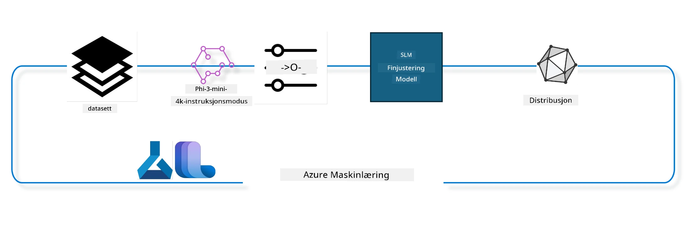

## Hvordan bruke chat-kompletteringskomponenter fra Azure ML systemregisteret for finjustering av en modell

I dette eksemplet vil vi gjennomføre finjustering av Phi-3-mini-4k-instruct-modellen for å fullføre en samtale mellom 2 personer ved bruk av ultrachat_200k datasettet.



Eksemplet vil vise deg hvordan du utfører finjustering ved bruk av Azure ML SDK og Python, og deretter distribuerer den finjusterte modellen til et online endepunkt for sanntidsinferens.

### Treningsdata

Vi vil bruke ultrachat_200k datasettet. Dette er en sterkt filtrert versjon av UltraChat datasettet og ble brukt til å trene Zephyr-7B-β, en toppmoderne 7b chat-modell.

### Modell

Vi vil bruke Phi-3-mini-4k-instruct-modellen for å vise hvordan brukere kan finjustere en modell for chat-komplettering. Hvis du åpnet denne notatboken fra en spesifikk modellkort, husk å erstatte det spesifikke modellnavnet.

### Oppgaver

- Velg en modell for finjustering.
- Velg og utforsk treningsdata.
- Konfigurer finjusteringsjobben.
- Kjør finjusteringsjobben.
- Gå gjennom trenings- og evalueringsmålinger.
- Registrer den finjusterte modellen.
- Distribuer den finjusterte modellen for sanntidsinferens.
- Rydd opp ressurser.

## 1. Sett opp forutsetninger

- Installer avhengigheter
- Koble til AzureML Workspace. Lær mer om oppsett av SDK-autentisering. Erstatt <WORKSPACE_NAME>, <RESOURCE_GROUP> og <SUBSCRIPTION_ID> nedenfor.
- Koble til azureml systemregisteret
- Sett et valgfrie eksperimentnavn
- Sjekk eller lag datakraft.

> [!NOTE]
> Krav: En enkelt GPU-node kan ha flere GPU-kort. For eksempel, i en node av Standard_NC24rs_v3 er det 4 NVIDIA V100 GPUer, mens i Standard_NC12s_v3 er det 2 NVIDIA V100 GPUer. Se dokumentasjonen for denne informasjonen. Antallet GPU-kort per node settes med parameteren gpus_per_node nedenfor. Å sette denne verdien korrekt vil sikre utnyttelse av alle GPUer i noden. Anbefalte GPU compute SKUer finnes her og her.

### Python-biblioteker

Installer avhengigheter ved å kjøre cellen nedenfor. Dette er ikke et valgfritt steg hvis du kjører i et nytt miljø.

```bash
pip install azure-ai-ml
pip install azure-identity
pip install datasets==2.9.0
pip install mlflow
pip install azureml-mlflow
```

### Samhandle med Azure ML

1. Dette Python-scriptet brukes for å samhandle med Azure Machine Learning (Azure ML) tjenesten. Her er en oversikt over hva det gjør:

    - Det importerer nødvendige moduler fra azure.ai.ml, azure.identity og azure.ai.ml.entities pakkene. Det importerer også time-modulen.

    - Det forsøker å autentisere med DefaultAzureCredential(), som gir en forenklet autentiseringsopplevelse for å raskt begynne å utvikle applikasjoner som kjøres i Azure-skyen. Hvis dette feiler, faller det tilbake på InteractiveBrowserCredential(), som tilbyr en interaktiv innloggingsdialog.

    - Det prøver deretter å lage en MLClient-instans ved hjelp av from_config-metoden, som leser konfigurasjonen fra standard konfigurasjonsfil (config.json). Hvis dette feiler, lager det en MLClient-instans ved manuelt å oppgi subscription_id, resource_group_name og workspace_name.

    - Det lager en annen MLClient-instans, denne gangen for Azure ML-registeret kalt "azureml". Dette registeret er hvor modeller, finjusteringspipelines og miljøer lagres.

    - Det setter experiment_name til "chat_completion_Phi-3-mini-4k-instruct".

    - Det genererer et unikt tidsstempel ved å konvertere gjeldende tid (i sekunder siden epoken, som flyttall) til et heltall og deretter til en streng. Dette tidsstempelet kan brukes til å lage unike navn og versjoner.

    ```python
    # Importer nødvendige moduler fra Azure ML og Azure Identity
    from azure.ai.ml import MLClient
    from azure.identity import (
        DefaultAzureCredential,
        InteractiveBrowserCredential,
    )
    from azure.ai.ml.entities import AmlCompute
    import time  # Importer tid-modulen
    
    # Prøv å autentisere ved hjelp av DefaultAzureCredential
    try:
        credential = DefaultAzureCredential()
        credential.get_token("https://management.azure.com/.default")
    except Exception as ex:  # Hvis DefaultAzureCredential feiler, bruk InteractiveBrowserCredential
        credential = InteractiveBrowserCredential()
    
    # Prøv å opprette en MLClient-instans ved hjelp av standard konfigurasjonsfil
    try:
        workspace_ml_client = MLClient.from_config(credential=credential)
    except:  # Hvis det feiler, opprett en MLClient-instans ved å manuelt oppgi detaljene
        workspace_ml_client = MLClient(
            credential,
            subscription_id="<SUBSCRIPTION_ID>",
            resource_group_name="<RESOURCE_GROUP>",
            workspace_name="<WORKSPACE_NAME>",
        )
    
    # Opprett en annen MLClient-instans for Azure ML-registeret kalt "azureml"
    # Dette registeret er hvor modeller, finjusteringspipelines og miljøer lagres
    registry_ml_client = MLClient(credential, registry_name="azureml")
    
    # Sett eksperimentnavnet
    experiment_name = "chat_completion_Phi-3-mini-4k-instruct"
    
    # Generer et unikt tidsstempel som kan brukes for navn og versjoner som må være unike
    timestamp = str(int(time.time()))
    ```

## 2. Velg en grunnmodell å finjustere

1. Phi-3-mini-4k-instruct er en 3.8B parameter, lettvekts, toppmoderne åpen modell bygget på datasett brukt for Phi-2. Modellen tilhører Phi-3 modellfamilien, og Mini-versjonen kommer i to varianter 4K og 128K som er kontekstlengden (i tokens) den kan støtte. Vi må finjustere modellen for vårt spesifikke formål for å bruke den. Du kan bla gjennom disse modellene i Model Catalog i AzureML Studio, filtrert på chat-kompletteringsoppgaven. I dette eksemplet bruker vi Phi-3-mini-4k-instruct modellen. Hvis du har åpnet denne notatboken for en annen modell, erstatt modellnavn og versjon tilsvarende.

> [!NOTE]
> modell-id egenskapen til modellen. Denne vil bli sendt som input til finjusteringsjobben. Denne er også tilgjengelig som Asset ID-feltet i modelsiden i AzureML Studio Model Catalog.

2. Dette Python-scriptet samhandler med Azure Machine Learning (Azure ML) tjenesten. Her er en oversikt over hva det gjør:

    - Den setter model_name til "Phi-3-mini-4k-instruct".

    - Den bruker get-metoden til models-egenskapen til registry_ml_client-objektet for å hente den nyeste versjonen av modellen med det spesifiserte navnet fra Azure ML-registeret. get-metoden kalles med to argumenter: navnet på modellen og et label som spesifiserer at den nyeste versjonen skal hentes.

    - Den skriver ut en melding til konsollen som viser navn, versjon og id til modellen som skal brukes for finjustering. format-metoden i strengen brukes til å sette inn navn, versjon og id til modellen i meldingen. Navn, versjon og id til modellen hentes som egenskaper i foundation_model-objektet.

    ```python
    # Angi modellnavnet
    model_name = "Phi-3-mini-4k-instruct"
    
    # Hent den nyeste versjonen av modellen fra Azure ML-registeret
    foundation_model = registry_ml_client.models.get(model_name, label="latest")
    
    # Skriv ut modellnavnet, versjonen og id-en
    # Denne informasjonen er nyttig for sporing og feilsøking
    print(
        "\n\nUsing model name: {0}, version: {1}, id: {2} for fine tuning".format(
            foundation_model.name, foundation_model.version, foundation_model.id
        )
    )
    ```

## 3. Opprett en compute som skal brukes med jobben

Finjusteringsjobben fungerer KUN med GPU compute. Størrelsen på computen avhenger av hvor stor modellen er, og i de fleste tilfeller kan det være vanskelig å finne riktig compute til jobben. I denne cellen veiledes brukeren til å velge riktig compute for jobben.

> [!NOTE]
> Compute-ressursene listet nedenfor fungerer med den mest optimaliserte konfigurasjonen. Eventuelle endringer i konfigurasjonen kan føre til Cuda Out Of Memory-feil. I slike tilfeller, prøv å oppgradere compute til en større størrelse.

> [!NOTE]
> Når du velger compute_cluster_size nedenfor, sørg for at compute er tilgjengelig i din resource group. Hvis en bestemt compute ikke er tilgjengelig kan du sende inn en forespørsel om tilgang til compute-ressursene.

### Sjekk modell for støtte til finjustering

1. Dette Python-scriptet samhandler med en Azure Machine Learning (Azure ML) modell. Her er en oversikt over hva det gjør:

    - Det importerer ast-modulen, som tilbyr funksjoner til å prosessere trær av Python abstrakt syntaksgrammatikk.

    - Det sjekker om foundation_model-objektet (som representerer en modell i Azure ML) har en tag kalt finetune_compute_allow_list. Tags i Azure ML er nøkkel-verdi-par som du kan opprette og bruke til å filtrere og sortere modeller.

    - Hvis finetune_compute_allow_list-tagen er til stede, bruker den ast.literal_eval-funksjonen for trygt å tolke taggens verdi (en streng) til en Python-liste. Denne listen blir så tilordnet til variabelen computes_allow_list. Den skriver ut en melding som viser at en compute skal opprettes fra listen.

    - Hvis finetune_compute_allow_list-tagen ikke er til stede, setter den computes_allow_list til None og skriver en melding som viser at finetune_compute_allow_list-tagen ikke er en del av modellens tags.

    - Oppsummert sjekker dette skriptet etter en spesifikk tag i modellens metadata, konverterer taggens verdi til en liste om den eksisterer, og gir tilbakemelding til brukeren.

    ```python
    # Importer ast-modulen, som gir funksjoner for å behandle trær av Python abstrakt syntaks grammatikk
    import ast
    
    # Sjekk om 'finetune_compute_allow_list' taggen er til stede i modellens tags
    if "finetune_compute_allow_list" in foundation_model.tags:
        # Hvis taggen er til stede, bruk ast.literal_eval for trygt å analysere taggens verdi (en streng) til en Python-liste
        computes_allow_list = ast.literal_eval(
            foundation_model.tags["finetune_compute_allow_list"]
        )  # konverter streng til Python-liste
        # Skriv ut en melding som indikerer at en compute skal opprettes fra listen
        print(f"Please create a compute from the above list - {computes_allow_list}")
    else:
        # Hvis taggen ikke er til stede, sett computes_allow_list til None
        computes_allow_list = None
        # Skriv ut en melding som indikerer at 'finetune_compute_allow_list' taggen ikke er del av modellens tags
        print("`finetune_compute_allow_list` is not part of model tags")
    ```

### Sjekk Compute Instans

1. Dette Python-scriptet samhandler med Azure Machine Learning (Azure ML) tjenesten og utfører flere kontroller på en compute-instans. Her er en oversikt over hva det gjør:

    - Det forsøker å hente compute-instansen med navnet lagret i compute_cluster fra Azure ML workspace. Hvis provisioning-tilstanden til compute-instansen er "failed", kaster det en ValueError.

    - Det sjekker om computes_allow_list ikke er None. Hvis den ikke er det, konverterer den alle compute-størrelsene i listen til små bokstaver og sjekker om størrelsen på den nåværende compute-instansen er i listen. Hvis ikke, kaster den en ValueError.

    - Hvis computes_allow_list er None, sjekker den om størrelsen på compute-instansen er i en liste over ikke-støttede GPU VM-størrelser. Hvis ja, kaster den en ValueError.

    - Den henter en liste over alle tilgjengelige compute-størrelser i workspace. Den itererer over denne listen, og for hver compute-størrelse sjekker om navnet matcher størrelsen på den nåværende compute-instansen. Hvis det gjør det, henter den antall GPUer for denne computen og setter gpu_count_found til True.

    - Hvis gpu_count_found er True, skriver den ut antall GPUer i compute-instansen. Hvis ikke, kaster den en ValueError.

    - Oppsummert utfører dette skriptet flere kontroller på en compute-instans i en Azure ML workspace, inkludert sjekk av provisioning-status, størrelse opp mot en tillatt liste eller nektet liste, og antall GPUer.

    ```python
    # Skriv ut unntaksbeskjedet
    print(e)
    # Hev en ValueError hvis beregningsstørrelsen ikke er tilgjengelig i arbeidsområdet
    raise ValueError(
        f"WARNING! Compute size {compute_cluster_size} not available in workspace"
    )
    
    # Hent beregningsinstansen fra Azure ML-arbeidsområdet
    compute = workspace_ml_client.compute.get(compute_cluster)
    # Sjekk om provisjoneringstilstanden til beregningsinstansen er "failed"
    if compute.provisioning_state.lower() == "failed":
        # Hev en ValueError hvis provisjoneringstilstanden er "failed"
        raise ValueError(
            f"Provisioning failed, Compute '{compute_cluster}' is in failed state. "
            f"please try creating a different compute"
        )
    
    # Sjekk om computes_allow_list ikke er None
    if computes_allow_list is not None:
        # Konverter alle beregningsstørrelser i computes_allow_list til små bokstaver
        computes_allow_list_lower_case = [x.lower() for x in computes_allow_list]
        # Sjekk om størrelsen på beregningsinstansen er i computes_allow_list_lower_case
        if compute.size.lower() not in computes_allow_list_lower_case:
            # Hev en ValueError hvis størrelsen på beregningsinstansen ikke er i computes_allow_list_lower_case
            raise ValueError(
                f"VM size {compute.size} is not in the allow-listed computes for finetuning"
            )
    else:
        # Definer en liste over ikke-støttede GPU VM-størrelser
        unsupported_gpu_vm_list = [
            "standard_nc6",
            "standard_nc12",
            "standard_nc24",
            "standard_nc24r",
        ]
        # Sjekk om størrelsen på beregningsinstansen er i unsupported_gpu_vm_list
        if compute.size.lower() in unsupported_gpu_vm_list:
            # Hev en ValueError hvis størrelsen på beregningsinstansen er i unsupported_gpu_vm_list
            raise ValueError(
                f"VM size {compute.size} is currently not supported for finetuning"
            )
    
    # Initialiser et flagg for å sjekke om antall GPU-er i beregningsinstansen er funnet
    gpu_count_found = False
    # Hent en liste over alle tilgjengelige beregningsstørrelser i arbeidsområdet
    workspace_compute_sku_list = workspace_ml_client.compute.list_sizes()
    available_sku_sizes = []
    # Iterer over listen av tilgjengelige beregningsstørrelser
    for compute_sku in workspace_compute_sku_list:
        available_sku_sizes.append(compute_sku.name)
        # Sjekk om navnet på beregningsstørrelsen samsvarer med størrelsen på beregningsinstansen
        if compute_sku.name.lower() == compute.size.lower():
            # Hvis det gjør det, hent antall GPU-er for den beregningsstørrelsen og sett gpu_count_found til True
            gpus_per_node = compute_sku.gpus
            gpu_count_found = True
    # Hvis gpu_count_found er True, skriv ut antall GPU-er i beregningsinstansen
    if gpu_count_found:
        print(f"Number of GPU's in compute {compute.size}: {gpus_per_node}")
    else:
        # Hvis gpu_count_found er False, hev en ValueError
        raise ValueError(
            f"Number of GPU's in compute {compute.size} not found. Available skus are: {available_sku_sizes}."
            f"This should not happen. Please check the selected compute cluster: {compute_cluster} and try again."
        )
    ```

## 4. Velg datasettet for finjustering av modellen

1. Vi bruker ultrachat_200k datasettet. Datasettet har fire splitt, egnet for Supervised finetuning (sft).
Generasjonsrangering (gen). Antall eksempler per splitt vises som følger:

    ```bash
    train_sft test_sft  train_gen  test_gen
    207865  23110  256032  28304
    ```

1. De neste cellene viser grunnleggende datapreparasjon for finjustering:

### Visualiser noen datarader

Vi ønsker at dette eksemplet skal kjøre raskt, så lagrer train_sft, test_sft filer som inneholder 5% av de allerede beskårede radene. Dette betyr at den finjusterte modellen vil ha lavere nøyaktighet, og bør derfor ikke brukes i reelle scenarier.
download-dataset.py brukes for å laste ned ultrachat_200k datasettet og omforme datasettet til et format som finetune pipeline-komponenten kan bruke. Siden datasettet er stort, har vi her kun en del av datasettet.

1. Å kjøre skriptet nedenfor laster bare ned 5% av dataene. Dette kan økes ved å endre parameteren dataset_split_pc til ønsket prosentandel.

> [!NOTE]
> Noen språkmodeller har ulike språkkoder og derfor bør kolonnenavnene i datasettet reflektere dette.

1. Her er et eksempel på hvordan dataene skal se ut
Chat-komplettering datasettet lagres i parquet-format med hver oppføring som følger skjema:

    - Dette er et JSON (JavaScript Object Notation) dokument, som er et populært datautvekslingsformat. Det er ikke kjørbar kode, men en måte å lagre og overføre data på. Her er en oversikt over strukturen:

    - "prompt": Denne nøkkelen holder en strengverdi som representerer en oppgave eller spørsmål stilt til en AI-assistent.

    - "messages": Denne nøkkelen holder en array av objekter. Hvert objekt representerer en melding i en samtale mellom en bruker og en AI-assistent. Hver meldingsobjekt har to nøkler:

    - "content": Denne nøkkelen holder en strengverdi som representerer innholdet i meldingen.
    - "role": Denne nøkkelen holder en strengverdi som representerer rollen til den som sendte meldingen. Det kan være enten "user" eller "assistant".
    - "prompt_id": Denne nøkkelen holder en strengverdi som representerer en unik identifikator for prompten.

1. I dette spesifikke JSON-dokumentet representeres en samtale der en bruker ber en AI-assistent om å lage en protagonist for en dystopisk historie. Assistenten svarer, og brukeren ber om flere detaljer. Assistenten går med på å gi flere detaljer. Hele samtalen er assosiert med en spesifikk prompt-id.

    ```python
    {
        // The task or question posed to an AI assistant
        "prompt": "Create a fully-developed protagonist who is challenged to survive within a dystopian society under the rule of a tyrant. ...",
        
        // An array of objects, each representing a message in a conversation between a user and an AI assistant
        "messages":[
            {
                // The content of the user's message
                "content": "Create a fully-developed protagonist who is challenged to survive within a dystopian society under the rule of a tyrant. ...",
                // The role of the entity that sent the message
                "role": "user"
            },
            {
                // The content of the assistant's message
                "content": "Name: Ava\n\n Ava was just 16 years old when the world as she knew it came crashing down. The government had collapsed, leaving behind a chaotic and lawless society. ...",
                // The role of the entity that sent the message
                "role": "assistant"
            },
            {
                // The content of the user's message
                "content": "Wow, Ava's story is so intense and inspiring! Can you provide me with more details.  ...",
                // The role of the entity that sent the message
                "role": "user"
            }, 
            {
                // The content of the assistant's message
                "content": "Certainly! ....",
                // The role of the entity that sent the message
                "role": "assistant"
            }
        ],
        
        // A unique identifier for the prompt
        "prompt_id": "d938b65dfe31f05f80eb8572964c6673eddbd68eff3db6bd234d7f1e3b86c2af"
    }
    ```

### Last ned data

1. Dette Python-scriptet brukes til å laste ned et datasett ved hjelp av et hjelpeskript kalt download-dataset.py. Her er en oversikt over hva det gjør:

    - Det importerer os-modulen, som tilbyr en portabel måte å bruke funksjonalitet avhengig av operativsystem.

    - Det bruker os.system-funksjonen til å kjøre download-dataset.py skriptet i shell med spesifikke kommandolinjeargumenter. Argumentene spesifiserer datasettet som skal lastes ned (HuggingFaceH4/ultrachat_200k), mappen det skal lastes ned til (ultrachat_200k_dataset), og prosentandelen av datasettet som skal splittes (5). os.system-funksjonen returnerer avslutningsstatusen til kommandoen; denne lagres i exit_status variabelen.

    - Det sjekker om exit_status ikke er 0. I Unix-lignende operativsystemer indikerer exit-status 0 vanligvis at en kommando har lykkes, mens ethvert annet tall indikerer en feil. Hvis exit_status ikke er 0, kastes en Exception med en melding som viser at feil oppstod ved nedlasting av datasettet.

    - Oppsummert kjører dette skriptet en kommando for å laste ned et datasett ved hjelp av et hjelpeskript, og kaster en unntak hvis kommandoen feiler.

    ```python
    # Importer os-modulen, som gir en måte å bruke operativsystemavhengig funksjonalitet på
    import os
    
    # Bruk os.system-funksjonen for å kjøre skriptet download-dataset.py i shell med spesifikke kommandolinjeargumenter
    # Argumentene spesifiserer datasettet som skal lastes ned (HuggingFaceH4/ultrachat_200k), katalogen det skal lastes ned til (ultrachat_200k_dataset), og prosentandelen av datasettet som skal deles (5)
    # os.system-funksjonen returnerer avslutningsstatusen til kommandoen den kjørte; denne statusen lagres i variabelen exit_status
    exit_status = os.system(
        "python ./download-dataset.py --dataset HuggingFaceH4/ultrachat_200k --download_dir ultrachat_200k_dataset --dataset_split_pc 5"
    )
    
    # Sjekk om exit_status ikke er 0
    # I Unix-lignende operativsystemer indikerer en avslutningsstatus på 0 vanligvis at en kommando har lykkes, mens et hvilket som helst annet tall indikerer en feil
    # Hvis exit_status ikke er 0, kast en Exception med en melding som angir at det oppstod en feil under nedlasting av datasettet
    if exit_status != 0:
        raise Exception("Error downloading dataset")
    ```

### Last inn data i en DataFrame
1. Dette Python-skriptet laster inn en JSON Lines-fil i en pandas DataFrame og viser de første 5 radene. Her er en gjennomgang av hva det gjør:

    - Det importerer pandas-biblioteket, som er et kraftig bibliotek for datamanipulasjon og analyse.

    - Det setter maksimal kolonnebredde for pandas' visningsinnstillinger til 0. Dette betyr at hele teksten i hver kolonne vil bli vist uten avkorting når DataFrame skrives ut.

    - Det bruker pd.read_json-funksjonen til å laste inn filen train_sft.jsonl fra katalogen ultrachat_200k_dataset inn i en DataFrame. Argumentet lines=True angir at filen er i JSON Lines-format, hvor hver linje er et eget JSON-objekt.

    - Det bruker metoden head for å vise de første 5 radene i DataFrame. Hvis DataFrame har færre enn 5 rader, vil den vise alle.

    - Oppsummert laster dette skriptet en JSON Lines-fil inn i en DataFrame og viser de første 5 radene med full kolonne tekst.
    
    ```python
    # Importer pandas-biblioteket, som er et kraftig bibliotek for datahåndtering og -analyse
    import pandas as pd
    
    # Sett maksimal kolonnebredde for pandas' visningsalternativer til 0
    # Dette betyr at hele teksten i hver kolonne vil bli vist uten avkorting når DataFrame printes
    pd.set_option("display.max_colwidth", 0)
    
    # Bruk pd.read_json-funksjonen for å laste train_sft.jsonl-filen fra ultrachat_200k_dataset-katalogen inn i en DataFrame
    # Argumentet lines=True indikerer at filen er i JSON Lines-format, der hver linje er et eget JSON-objekt
    df = pd.read_json("./ultrachat_200k_dataset/train_sft.jsonl", lines=True)
    
    # Bruk head-metoden for å vise de første 5 radene i DataFrame
    # Hvis DataFrame har færre enn 5 rader, vil alle bli vist
    df.head()
    ```

## 5. Send inn finjusteringsjobben ved å bruke modellen og dataene som input

Opprett jobben som bruker chat-completion pipeline-komponenten. Lær mer om alle parameterne som støttes for finjustering.

### Definer finjusteringsparametere

1. Finjusteringsparametere kan grupperes i 2 kategorier – treningsparametere, optimaliseringsparametere

1. Treningsparametere definerer treningsaspekter som –

    - Optimizer og scheduler som skal brukes
    - Metoden for å optimalisere finjusteringen
    - Antall treningssteg og batch-størrelse, og så videre
    - Optimaliseringsparametere hjelper med å optimalisere GPU-minnet og effektivt bruke beregningsressursene.

1. Nedenfor er noen av parameterne som tilhører denne kategorien. Optimaliseringsparameterne varierer for hver modell og er pakket med modellen for å håndtere disse forskjellene.

    - Aktiver deepspeed og LoRA
    - Aktiver mixed precision training
    - Aktiver trening på flere noder

> [!NOTE]
> Veiledet finjustering kan føre til tap av justering eller katastrofalt glemsel. Vi anbefaler å sjekke for dette problemet og kjøre en justeringsfase etter finjustering.

### Finjusteringsparametere

1. Dette Python-skriptet setter opp parametere for finjustering av en maskinlæringsmodell. Her er en gjennomgang av hva det gjør:

    - Det setter opp standard treningsparametere som antall trenings-epoker, batch-størrelser for trening og evaluering, læringsrate og type læringsrate-scheduler.

    - Det setter opp standard optimaliseringsparametere som hvorvidt Layer-wise Relevance Propagation (LoRa) og DeepSpeed skal brukes, og DeepSpeed-stadiet.

    - Det kombinerer trenings- og optimaliseringsparametere i en enkelt ordbok kalt finetune_parameters.

    - Det sjekker om foundation_model har noen modellspesifikke standardparametere. Hvis det har det, skriver det ut en advarsel og oppdaterer finetune_parameters-ordboken med disse modellspesifikke standardene. Funktionen ast.literal_eval brukes for å konvertere modellspesifikke standarder fra en streng til en Python-ordbok.

    - Det skriver ut det endelige settet med finjusteringsparametere som skal brukes for kjøringen.

    - Oppsummert setter dette skriptet opp og viser parametrene for finjustering av en maskinlæringsmodell, med mulighet for å overstyre standardparametrene med modellspesifikke verdier.

    ```python
    # Sett opp standard treningsparametere som antall trenings-epoker, batch-størrelser for trening og evaluering, læringsrate og type læringsrateplanlegger
    training_parameters = dict(
        num_train_epochs=3,
        per_device_train_batch_size=1,
        per_device_eval_batch_size=1,
        learning_rate=5e-6,
        lr_scheduler_type="cosine",
    )
    
    # Sett opp standard optimaliseringsparametere som om Layer-wise Relevance Propagation (LoRa) og DeepSpeed skal brukes, og DeepSpeed-stadiet
    optimization_parameters = dict(
        apply_lora="true",
        apply_deepspeed="true",
        deepspeed_stage=2,
    )
    
    # Kombiner trenings- og optimaliseringsparametere i en enkelt ordbok kalt finetune_parameters
    finetune_parameters = {**training_parameters, **optimization_parameters}
    
    # Sjekk om foundation_model har noen modellspesifikke standardparametere
    # Hvis den har det, skriv ut en advarsel og oppdater finetune_parameters-ordboken med disse modellspesifikke standardene
    # ast.literal_eval-funksjonen brukes for å konvertere modellspesifikke standarder fra en streng til en Python-ordbok
    if "model_specific_defaults" in foundation_model.tags:
        print("Warning! Model specific defaults exist. The defaults could be overridden.")
        finetune_parameters.update(
            ast.literal_eval(  # konverter streng til python-ordbok
                foundation_model.tags["model_specific_defaults"]
            )
        )
    
    # Skriv ut det endelige settet av finjusteringsparametere som skal brukes for kjøringen
    print(
        f"The following finetune parameters are going to be set for the run: {finetune_parameters}"
    )
    ```

### Treningspipeline

1. Dette Python-skriptet definerer en funksjon for å generere et visningsnavn for en maskinlæringstreningspipeline, og kaller deretter denne funksjonen for å generere og skrive ut visningsnavnet. Her er en gjennomgang av hva det gjør:

1. Funksjonen get_pipeline_display_name defineres. Denne funksjonen genererer et visningsnavn basert på ulike parametere relatert til treningspipen.

1. Inne i funksjonen beregner den total batch-størrelse ved å multiplisere batch-størrelsen per enhet, antall gradientakkumuleringssteg, antall GPU-er per node, og antall noder brukt til finjustering.

1. Den henter også diverse andre parametere som læringsrate-scheduler-type, om DeepSpeed er aktivert, DeepSpeed-stadiet, om Layer-wise Relevance Propagation (LoRa) er aktivert, grensen for antall modell-sjekkpunkter som skal beholdes, og maksimal sekvenslengde.

1. Den konstruerer en streng som inkluderer alle disse parameterne, adskilt med bindestreker. Hvis DeepSpeed eller LoRa er aktivert, inkluderer strengen "ds" etterfulgt av DeepSpeed-stadiet, eller "lora" henholdsvis. Hvis ikke, inkluderer den henholdsvis "nods" eller "nolora".

1. Funksjonen returnerer denne strengen, som fungerer som visningsnavnet for treningspipen.

1. Etter at funksjonen er definert, kalles den for å generere visningsnavnet, som deretter skrives ut.

1. Oppsummert genererer dette skriptet et visningsnavn for en maskinlæringstreningspipeline basert på forskjellige parametere, og skriver deretter ut dette visningsnavnet.

    ```python
    # Definer en funksjon for å generere et visningsnavn for treningsrøret
    def get_pipeline_display_name():
        # Beregn den totale batchstørrelsen ved å multiplisere batchstørrelsen per enhet, antall gradientakkumuleringssteg, antall GPU-er per node og antall noder som brukes til finjustering
        batch_size = (
            int(finetune_parameters.get("per_device_train_batch_size", 1))
            * int(finetune_parameters.get("gradient_accumulation_steps", 1))
            * int(gpus_per_node)
            * int(finetune_parameters.get("num_nodes_finetune", 1))
        )
        # Hent typ av læringsrategenerator
        scheduler = finetune_parameters.get("lr_scheduler_type", "linear")
        # Hent om DeepSpeed er brukt
        deepspeed = finetune_parameters.get("apply_deepspeed", "false")
        # Hent DeepSpeed-stadiet
        ds_stage = finetune_parameters.get("deepspeed_stage", "2")
        # Hvis DeepSpeed er brukt, inkluder "ds" etterfulgt av DeepSpeed-stadiet i visningsnavnet; hvis ikke, inkluder "nods"
        if deepspeed == "true":
            ds_string = f"ds{ds_stage}"
        else:
            ds_string = "nods"
        # Hent om Layer-wise Relevance Propagation (LoRa) er brukt
        lora = finetune_parameters.get("apply_lora", "false")
        # Hvis LoRa er brukt, inkluder "lora" i visningsnavnet; hvis ikke, inkluder "nolora"
        if lora == "true":
            lora_string = "lora"
        else:
            lora_string = "nolora"
        # Hent grensen for antall modell-sjekkpunkter som skal beholdes
        save_limit = finetune_parameters.get("save_total_limit", -1)
        # Hent maksimal sekvenslengde
        seq_len = finetune_parameters.get("max_seq_length", -1)
        # Bygg visningsnavnet ved å sammenkoble alle disse parameterne, separert med bindestreker
        return (
            model_name
            + "-"
            + "ultrachat"
            + "-"
            + f"bs{batch_size}"
            + "-"
            + f"{scheduler}"
            + "-"
            + ds_string
            + "-"
            + lora_string
            + f"-save_limit{save_limit}"
            + f"-seqlen{seq_len}"
        )
    
    # Kall funksjonen for å generere visningsnavnet
    pipeline_display_name = get_pipeline_display_name()
    # Skriv ut visningsnavnet
    print(f"Display name used for the run: {pipeline_display_name}")
    ```

### Konfigurere pipeline

Dette Python-skriptet definerer og konfigurerer en maskinlæringspipeline ved hjelp av Azure Machine Learning SDK. Her er en gjennomgang av hva det gjør:

1. Det importerer nødvendige moduler fra Azure AI ML SDK.

1. Det henter en pipeline-komponent kalt "chat_completion_pipeline" fra registret.

1. Det definerer en pipeline-jobb med `@pipeline`-dekoratøren og funksjonen `create_pipeline`. Navnet på pipelinen settes til `pipeline_display_name`.

1. Inne i `create_pipeline`-funksjonen initialiserer den den hentede pipeline-komponenten med ulike parametere, inkludert modellsti, beregningsklynger for forskjellige stadier, datasett-deler for trening og testing, antall GPU-er til bruk for finjustering, og andre finjusteringsparametere.

1. Den kobler utdataene fra finjusteringsjobben til utdataene av pipeline-jobben. Dette gjøres for at den finjusterte modellen enkelt skal kunne registreres, noe som kreves for å distribuere modellen til en online- eller batch-endepunkt.

1. Den oppretter en instans av pipelinen ved å kalle funksjonen `create_pipeline`.

1. Den setter `force_rerun`-innstillingen for pipelinen til `True`, noe som betyr at bufrede resultater fra tidligere jobber ikke vil bli brukt.

1. Den setter `continue_on_step_failure`-innstillingen for pipelinen til `False`, noe som betyr at pipelinen stopper dersom et hvilket som helst steg feiler.

1. Oppsummert definerer og konfigurerer dette skriptet en maskinlæringspipeline for en chat fullføringsoppgave ved hjelp av Azure Machine Learning SDK.

    ```python
    # Importer nødvendige moduler fra Azure AI ML SDK
    from azure.ai.ml.dsl import pipeline
    from azure.ai.ml import Input
    
    # Hent pipeline-komponenten med navnet "chat_completion_pipeline" fra registeret
    pipeline_component_func = registry_ml_client.components.get(
        name="chat_completion_pipeline", label="latest"
    )
    
    # Definer pipeline-jobben ved hjelp av @pipeline-dekoratøren og funksjonen create_pipeline
    # Navnet på pipelinen settes til pipeline_display_name
    @pipeline(name=pipeline_display_name)
    def create_pipeline():
        # Initialiser den hentede pipeline-komponenten med ulike parametere
        # Disse inkluderer modellsti, beregningsklynger for forskjellige stadier, datasett-splitt for trening og testing, antall GPUer som skal brukes til finjustering, og andre finjusteringsparametere
        chat_completion_pipeline = pipeline_component_func(
            mlflow_model_path=foundation_model.id,
            compute_model_import=compute_cluster,
            compute_preprocess=compute_cluster,
            compute_finetune=compute_cluster,
            compute_model_evaluation=compute_cluster,
            # Koble datasett-splitt til parametere
            train_file_path=Input(
                type="uri_file", path="./ultrachat_200k_dataset/train_sft.jsonl"
            ),
            test_file_path=Input(
                type="uri_file", path="./ultrachat_200k_dataset/test_sft.jsonl"
            ),
            # Treningsinnstillinger
            number_of_gpu_to_use_finetuning=gpus_per_node,  # Settes til antall GPUer tilgjengelig i beregningen
            **finetune_parameters
        )
        return {
            # Koble utdataene fra finjusteringsjobben til utdataene fra pipeline-jobben
            # Dette gjøres slik at vi enkelt kan registrere den finjusterte modellen
            # Registrering av modellen er nødvendig for å distribuere modellen til en online eller batch-endepunkt
            "trained_model": chat_completion_pipeline.outputs.mlflow_model_folder
        }
    
    # Opprett en instans av pipelinen ved å kalle create_pipeline-funksjonen
    pipeline_object = create_pipeline()
    
    # Ikke bruk bufrede resultater fra tidligere jobber
    pipeline_object.settings.force_rerun = True
    
    # Sett fortsett ved steg-feil til False
    # Dette betyr at pipelinen stopper hvis noe steg feiler
    pipeline_object.settings.continue_on_step_failure = False
    ```

### Send inn jobben

1. Dette Python-skriptet sender inn en maskinlæringspipelinejobb til et Azure Machine Learning-arbeidsområde og venter deretter på at jobben skal fullføres. Her er en gjennomgang av hva det gjør:

    - Det kaller create_or_update-metoden til jobs-objektet i workspace_ml_client for å sende inn pipeline-jobben. Pipen som skal kjøres spesifiseres av pipeline_object, og eksperimentet jobben kjøres under spesifiseres av experiment_name.

    - Det kaller deretter stream-metoden til jobs-objektet i workspace_ml_client for å vente på at pipeline-jobben skal fullføres. Jobben det skal ventes på spesifiseres av name-attributtet til pipeline_job-objektet.

    - Oppsummert sender dette skriptet inn en maskinlæringspipelinejobb til et Azure Machine Learning-arbeidsområde, og venter så på at jobben fullføres.

    ```python
    # Send pipeline-jobben til Azure Machine Learning arbeidsområde
    # Pipelines som skal kjøres er angitt av pipeline_object
    # Eksperimentet under hvilket jobben kjøres er angitt av experiment_name
    pipeline_job = workspace_ml_client.jobs.create_or_update(
        pipeline_object, experiment_name=experiment_name
    )
    
    # Vent på at pipeline-jobben skal fullføres
    # Jobben som skal ventes på er angitt av name-attributtet til pipeline_job-objektet
    workspace_ml_client.jobs.stream(pipeline_job.name)
    ```

## 6. Registrer den finjusterte modellen i arbeidsområdet

Vi vil registrere modellen fra utdataene til finjusteringsjobben. Dette vil spore opprinnelsen mellom den finjusterte modellen og finjusteringsjobben. Finjusteringsjobben sporer videre opprinnelsen til foundation-modellen, data og treningskode.

### Registrere ML-modellen

1. Dette Python-skriptet registrerer en maskinlæringsmodell som ble trent i en Azure Machine Learning-pipeline. Her er en gjennomgang av hva det gjør:

    - Det importerer nødvendige moduler fra Azure AI ML SDK.

    - Det sjekker om trained_model-utdataene er tilgjengelige fra pipeline-jobben ved å kalle get-metoden til jobs-objektet i workspace_ml_client og aksessere outputs-attributtet.

    - Det konstruerer en sti til den trente modellen ved å formatere en streng med navnet på pipeline-jobben og navnet på utdataene ("trained_model").

    - Det definerer et navn for den finjusterte modellen ved å legge til "-ultrachat-200k" til det opprinnelige modellnavnet og erstatte eventuelle skråstreker med bindestreker.

    - Det forbereder registreringen av modellen ved å opprette et Model-objekt med forskjellige parametere, inkludert stien til modellen, typen modell (MLflow-modell), navnet og versjonen på modellen, og en beskrivelse av modellen.

    - Det registrerer modellen ved å kalle create_or_update-metoden til models-objektet i workspace_ml_client med Model-objektet som argument.

    - Det skriver ut den registrerte modellen.

1. Oppsummert registrerer dette skriptet en maskinlæringsmodell som ble trent i en Azure Machine Learning-pipeline.
    
    ```python
    # Importer nødvendige moduler fra Azure AI ML SDK
    from azure.ai.ml.entities import Model
    from azure.ai.ml.constants import AssetTypes
    
    # Sjekk om `trained_model` utdata er tilgjengelig fra pipeline-jobben
    print("pipeline job outputs: ", workspace_ml_client.jobs.get(pipeline_job.name).outputs)
    
    # Konstruer en sti til den trente modellen ved å formatere en streng med navnet på pipeline-jobben og navnet på utdata ("trained_model")
    model_path_from_job = "azureml://jobs/{0}/outputs/{1}".format(
        pipeline_job.name, "trained_model"
    )
    
    # Definer et navn for den finjusterte modellen ved å legge til "-ultrachat-200k" til det opprinnelige modellnavnet og erstatte eventuelle skråstreker med bindestreker
    finetuned_model_name = model_name + "-ultrachat-200k"
    finetuned_model_name = finetuned_model_name.replace("/", "-")
    
    print("path to register model: ", model_path_from_job)
    
    # Forbered registrering av modellen ved å opprette et Model-objekt med forskjellige parametere
    # Disse inkluderer stien til modellen, typen av modellen (MLflow-modell), navnet og versjonen til modellen, og en beskrivelse av modellen
    prepare_to_register_model = Model(
        path=model_path_from_job,
        type=AssetTypes.MLFLOW_MODEL,
        name=finetuned_model_name,
        version=timestamp,  # Bruk tidsstempel som versjon for å unngå versjonskonflikt
        description=model_name + " fine tuned model for ultrachat 200k chat-completion",
    )
    
    print("prepare to register model: \n", prepare_to_register_model)
    
    # Registrer modellen ved å kalle create_or_update-metoden til models-objektet i workspace_ml_client med Model-objektet som argument
    registered_model = workspace_ml_client.models.create_or_update(
        prepare_to_register_model
    )
    
    # Skriv ut den registrerte modellen
    print("registered model: \n", registered_model)
    ```

## 7. Distribuer den finjusterte modellen til et online-endepunkt

Online-endepunkter gir en varig REST API som kan brukes til integrasjon med applikasjoner som trenger å bruke modellen.

### Administrere endepunkt

1. Dette Python-skriptet oppretter et administrert online-endepunkt i Azure Machine Learning for en registrert modell. Her er en gjennomgang av hva det gjør:

    - Det importerer nødvendige moduler fra Azure AI ML SDK.

    - Det definerer et unikt navn for online-endepunktet ved å legge til et tidsstempel til strengen "ultrachat-completion-".

    - Det forbereder oppretting av online-endepunktet ved å opprette et ManagedOnlineEndpoint-objekt med ulike parametere, inkludert endepunktets navn, en beskrivelse av endepunktet, og autentiseringsmodus ("key").

    - Det oppretter online-endepunktet ved å kalle begin_create_or_update-metoden til workspace_ml_client med ManagedOnlineEndpoint-objektet som argument. Den venter deretter på at opprettingsoperasjonen skal fullføres ved å kalle wait-metoden.

1. Oppsummert oppretter dette skriptet et administrert online-endepunkt i Azure Machine Learning for en registrert modell.

    ```python
    # Importer nødvendige moduler fra Azure AI ML SDK
    from azure.ai.ml.entities import (
        ManagedOnlineEndpoint,
        ManagedOnlineDeployment,
        ProbeSettings,
        OnlineRequestSettings,
    )
    
    # Definer et unikt navn for online-endepunktet ved å legge til et tidsstempel til strengen "ultrachat-completion-"
    online_endpoint_name = "ultrachat-completion-" + timestamp
    
    # Forbered å opprette online-endepunktet ved å opprette et ManagedOnlineEndpoint-objekt med ulike parametere
    # Dette inkluderer navnet på endepunktet, en beskrivelse av endepunktet, og autentiseringsmodus ("key")
    endpoint = ManagedOnlineEndpoint(
        name=online_endpoint_name,
        description="Online endpoint for "
        + registered_model.name
        + ", fine tuned model for ultrachat-200k-chat-completion",
        auth_mode="key",
    )
    
    # Opprett online-endepunktet ved å kalle begin_create_or_update-metoden til workspace_ml_client med ManagedOnlineEndpoint-objektet som argument
    # Vent deretter på at opprettelsesoperasjonen skal fullføres ved å kalle wait-metoden
    workspace_ml_client.begin_create_or_update(endpoint).wait()
    ```

> [!NOTE]
> Du kan finne listen over SKU-er som støttes for distribusjon her – [Managed online endpoints SKU list](https://learn.microsoft.com/azure/machine-learning/reference-managed-online-endpoints-vm-sku-list)

### Distribuere ML-modell

1. Dette Python-skriptet distribuerer en registrert maskinlæringsmodell til et administrert online-endepunkt i Azure Machine Learning. Her er en gjennomgang av hva det gjør:

    - Det importerer ast-modulen, som gir funksjoner for å behandle trær av Pythons abstrakte syntaksgrammatikk.

    - Det setter instanstypen for distribusjonen til "Standard_NC6s_v3".

    - Det sjekker om taggen inference_compute_allow_list finnes i foundation-modellen. Hvis den gjør det, konverterer den taggens verdi fra en streng til en Python-liste og tilordner den til inference_computes_allow_list. Hvis ikke, setter den inference_computes_allow_list til None.

    - Det sjekker om den spesifiserte instanstypen finnes i tillatelseslisten. Hvis ikke, skriver den ut en melding som ber brukeren velge en instanstype fra listen.

    - Det forbereder opprettingen av distribusjonen ved å opprette et ManagedOnlineDeployment-objekt med ulike parametere, inkludert distribusjonens navn, endepunktets navn, modell-ID, instanstype og antall instanser, liveness probe-innstillinger, og forespørselsinnstillinger.

    - Det oppretter distribusjonen ved å kalle begin_create_or_update-metoden til workspace_ml_client med ManagedOnlineDeployment-objektet som argument. Det venter deretter på at opprettingsoperasjonen skal fullføres ved å kalle wait-metoden.

    - Det setter trafikken til endepunktet slik at 100 % av trafikken går til "demo"-distribusjonen.

    - Det oppdaterer endepunktet ved å kalle begin_create_or_update-metoden til workspace_ml_client med endepunktobjektet som argument. Deretter venter den på at oppdateringsoperasjonen skal fullføres ved å kalle result-metoden.

1. Oppsummert distribuerer dette skriptet en registrert maskinlæringsmodell til et administrert online-endepunkt i Azure Machine Learning.

    ```python
    # Importer ast-modulen, som gir funksjoner for å behandle trær av Python sin abstrakte syntaksgrammatikk
    import ast
    
    # Sett instanstypen for distribusjonen
    instance_type = "Standard_NC6s_v3"
    
    # Sjekk om `inference_compute_allow_list`-taggen finnes i grunnmodellen
    if "inference_compute_allow_list" in foundation_model.tags:
        # Hvis den gjør det, konverter taggverdien fra en streng til en Python-liste og tildel den til `inference_computes_allow_list`
        inference_computes_allow_list = ast.literal_eval(
            foundation_model.tags["inference_compute_allow_list"]
        )
        print(f"Please create a compute from the above list - {computes_allow_list}")
    else:
        # Hvis ikke, sett `inference_computes_allow_list` til `None`
        inference_computes_allow_list = None
        print("`inference_compute_allow_list` is not part of model tags")
    
    # Sjekk om den spesifiserte instanstypen er i tillatliste
    if (
        inference_computes_allow_list is not None
        and instance_type not in inference_computes_allow_list
    ):
        print(
            f"`instance_type` is not in the allow listed compute. Please select a value from {inference_computes_allow_list}"
        )
    
    # Forbered å opprette distribusjonen ved å lage et `ManagedOnlineDeployment`-objekt med ulike parametere
    demo_deployment = ManagedOnlineDeployment(
        name="demo",
        endpoint_name=online_endpoint_name,
        model=registered_model.id,
        instance_type=instance_type,
        instance_count=1,
        liveness_probe=ProbeSettings(initial_delay=600),
        request_settings=OnlineRequestSettings(request_timeout_ms=90000),
    )
    
    # Opprett distribusjonen ved å kalle `begin_create_or_update`-metoden til `workspace_ml_client` med `ManagedOnlineDeployment`-objektet som argument
    # Vent deretter på at opprettelsesoperasjonen fullføres ved å kalle `wait`-metoden
    workspace_ml_client.online_deployments.begin_create_or_update(demo_deployment).wait()
    
    # Sett trafikken på endepunktet til å dirigere 100 % av trafikken til "demo"-distribusjonen
    endpoint.traffic = {"demo": 100}
    
    # Oppdater endepunktet ved å kalle `begin_create_or_update`-metoden til `workspace_ml_client` med `endpoint`-objektet som argument
    # Vent deretter på at oppdateringsoperasjonen fullføres ved å kalle `result`-metoden
    workspace_ml_client.begin_create_or_update(endpoint).result()
    ```

## 8. Test endepunktet med eksempeldata

Vi vil hente noe eksempeldata fra testdatasettet og sende til online-endepunktet for inferens. Vi vil deretter vise de estimerte etikettene sammen med de faktiske etikettene.

### Leser resultatene

1. Dette Python-skriptet leser en JSON Lines-fil inn i en pandas DataFrame, tar et tilfeldig utvalg, og nullstiller indeksen. Her er en gjennomgang av hva det gjør:

    - Det leser filen ./ultrachat_200k_dataset/test_gen.jsonl inn i en pandas DataFrame. read_json-funksjonen brukes med argumentet lines=True fordi filen er i JSON Lines-format, der hver linje er et eget JSON-objekt.

    - Det tar et tilfeldig utvalg på 1 rad fra DataFrame. sample-funksjonen brukes med argumentet n=1 for å spesifisere antall tilfeldige rader som skal velges.

    - Det nullstiller indeksen til DataFrame. reset_index-funksjonen brukes med argumentet drop=True for å fjerne den opprinnelige indeksen og erstatte den med en ny indeks med standard heltallsverdier.

    - Det viser de første 2 radene i DataFrame ved hjelp av head-funksjonen med argumentet 2. Siden DataFrame bare inneholder én rad etter uttaket, vil det bare vise den raden.

1. Oppsummert leser dette skriptet en JSON Lines-fil inn i en pandas DataFrame, tar et tilfeldig utvalg på 1 rad, nullstiller indeksen, og viser den første raden.
    
    ```python
    # Importer pandas-biblioteket
    import pandas as pd
    
    # Les JSON Lines-filen './ultrachat_200k_dataset/test_gen.jsonl' inn i en pandas DataFrame
    # Argumentet 'lines=True' indikerer at filen er i JSON Lines-format, hvor hver linje er et eget JSON-objekt
    test_df = pd.read_json("./ultrachat_200k_dataset/test_gen.jsonl", lines=True)
    
    # Ta et tilfeldig utvalg på 1 rad fra DataFrame
    # Argumentet 'n=1' spesifiserer antall tilfeldige rader som skal velges
    test_df = test_df.sample(n=1)
    
    # Nullstill indeksen til DataFrame
    # Argumentet 'drop=True' indikerer at den opprinnelige indeksen skal fjernes og erstattes med en ny indeks av standard heltallsverdier
    # Argumentet 'inplace=True' indikerer at DataFrame skal endres på stedet (uten å lage et nytt objekt)
    test_df.reset_index(drop=True, inplace=True)
    
    # Vis de første 2 radene i DataFrame
    # Men siden DataFrame bare inneholder én rad etter utvalget, vil dette bare vise den ene raden
    test_df.head(2)
    ```

### Opprett JSON-objekt
1. Dette Python-skriptet lager et JSON-objekt med spesifikke parametere og lagrer det til en fil. Her er en oversikt over hva det gjør:

    - Det importerer json-modulen, som gir funksjoner for å arbeide med JSON-data.

    - Det oppretter en ordbok parameters med nøkler og verdier som representerer parametere for en maskinlæringsmodell. Nøklene er "temperature", "top_p", "do_sample" og "max_new_tokens", og deres tilsvarende verdier er 0.6, 0.9, True og 200 henholdsvis.

    - Det oppretter en annen ordbok test_json med to nøkler: "input_data" og "params". Verdien av "input_data" er en annen ordbok med nøkler "input_string" og "parameters". Verdien av "input_string" er en liste som inneholder den første meldingen fra test_df DataFrame. Verdien av "parameters" er parameters-ordboken som ble opprettet tidligere. Verdien av "params" er en tom ordbok.

    - Det åpner en fil med navnet sample_score.json
    
    ```python
    # Importer json-modulen, som gir funksjoner for å arbeide med JSON-data
    import json
    
    # Opprett en ordbok `parameters` med nøkler og verdier som representerer parametere for en maskinlæringsmodell
    # Nøklene er "temperature", "top_p", "do_sample" og "max_new_tokens", og deres tilsvarende verdier er henholdsvis 0.6, 0.9, True og 200
    parameters = {
        "temperature": 0.6,
        "top_p": 0.9,
        "do_sample": True,
        "max_new_tokens": 200,
    }
    
    # Opprett en annen ordbok `test_json` med to nøkler: "input_data" og "params"
    # Verdien til "input_data" er en annen ordbok med nøklene "input_string" og "parameters"
    # Verdien til "input_string" er en liste som inneholder den første meldingen fra `test_df` DataFrame
    # Verdien til "parameters" er `parameters` ordboken opprettet tidligere
    # Verdien til "params" er en tom ordbok
    test_json = {
        "input_data": {
            "input_string": [test_df["messages"][0]],
            "parameters": parameters,
        },
        "params": {},
    }
    
    # Åpne en fil kalt `sample_score.json` i `./ultrachat_200k_dataset`-katalogen i skrivemodus
    with open("./ultrachat_200k_dataset/sample_score.json", "w") as f:
        # Skriv `test_json` ordboken til filen i JSON-format ved bruk av funksjonen `json.dump`
        json.dump(test_json, f)
    ```

### Kalle på Endepunkt

1. Dette Python-skriptet kaller et online endepunkt i Azure Machine Learning for å score en JSON-fil. Her er en oversikt over hva det gjør:

    - Det kaller invoke-metoden til online_endpoints-egenskapen til workspace_ml_client-objektet. Denne metoden brukes for å sende en forespørsel til et online endepunkt og motta et svar.

    - Det spesifiserer navnet på endepunktet og distribusjonen med argumentene endpoint_name og deployment_name. I dette tilfellet er endepunktsnavnet lagret i variabelen online_endpoint_name, og distribusjonsnavnet er "demo".

    - Det spesifiserer banen til JSON-filen som skal scores med request_file-argumentet. I dette tilfellet er filen ./ultrachat_200k_dataset/sample_score.json.

    - Det lagrer svaret fra endepunktet i variabelen response.

    - Det skriver ut det rå svaret.

1. For å oppsummere, dette skriptet kaller et online endepunkt i Azure Machine Learning for å score en JSON-fil og skriver ut svaret.

    ```python
    # Kall den online endepunktet i Azure Machine Learning for å score `sample_score.json`-filen
    # `invoke`-metoden til `online_endpoints`-egenskapen til `workspace_ml_client`-objektet brukes til å sende en forespørsel til et online endepunkt og få et svar
    # `endpoint_name`-argumentet spesifiserer navnet på endepunktet, som er lagret i variabelen `online_endpoint_name`
    # `deployment_name`-argumentet spesifiserer navnet på distribusjonen, som er "demo"
    # `request_file`-argumentet spesifiserer banen til JSON-filen som skal scores, som er `./ultrachat_200k_dataset/sample_score.json`
    response = workspace_ml_client.online_endpoints.invoke(
        endpoint_name=online_endpoint_name,
        deployment_name="demo",
        request_file="./ultrachat_200k_dataset/sample_score.json",
    )
    
    # Skriv ut det rå svaret fra endepunktet
    print("raw response: \n", response, "\n")
    ```

## 9. Slette det online endepunktet

1. Ikke glem å slette det online endepunktet, ellers vil du la faktureringsmåleren kjøre for den beregningen som brukes av endepunktet. Denne linjen med Python-kode sletter et online endepunkt i Azure Machine Learning. Her er en oversikt over hva det gjør:

    - Det kaller begin_delete-metoden til online_endpoints-egenskapen til workspace_ml_client-objektet. Denne metoden brukes for å starte sletting av et online endepunkt.

    - Det spesifiserer navnet på endepunktet som skal slettes med argumentet name. I dette tilfellet er endepunktsnavnet lagret i variabelen online_endpoint_name.

    - Det kaller wait-metoden for å vente på at sletteoperasjonen fullføres. Dette er en blokkering, noe som betyr at det vil hindre skriptet i å fortsette før slettingen er ferdig.

    - For å oppsummere, denne kodelinjen starter slettingen av et online endepunkt i Azure Machine Learning og venter på at operasjonen fullføres.

    ```python
    # Slett den nettbaserte endepunktet i Azure Machine Learning
    # `begin_delete`-metoden til `online_endpoints`-egenskapen til `workspace_ml_client`-objektet brukes for å starte slettingen av en nettbasert endepunkt
    # `name`-argumentet angir navnet på endepunktet som skal slettes, som er lagret i variabelen `online_endpoint_name`
    # `wait`-metoden kalles for å vente på at sletteoperasjonen skal fullføres. Dette er en blokkering operasjon, noe som betyr at den vil hindre skriptet i å fortsette før slettingen er ferdig
    workspace_ml_client.online_endpoints.begin_delete(name=online_endpoint_name).wait()
    ```

---

<!-- CO-OP TRANSLATOR DISCLAIMER START -->
**Ansvarsfraskrivelse**:  
Dette dokumentet er oversatt ved hjelp av AI-oversettelsestjenesten [Co-op Translator](https://github.com/Azure/co-op-translator). Selv om vi streber etter nøyaktighet, vær oppmerksom på at automatiske oversettelser kan inneholde feil eller unøyaktigheter. Det opprinnelige dokumentet på dets opprinnelige språk skal anses som den autoritative kilden. For kritisk informasjon anbefales profesjonell menneskelig oversettelse. Vi er ikke ansvarlige for eventuelle misforståelser eller feiltolkninger som oppstår ved bruk av denne oversettelsen.
<!-- CO-OP TRANSLATOR DISCLAIMER END -->