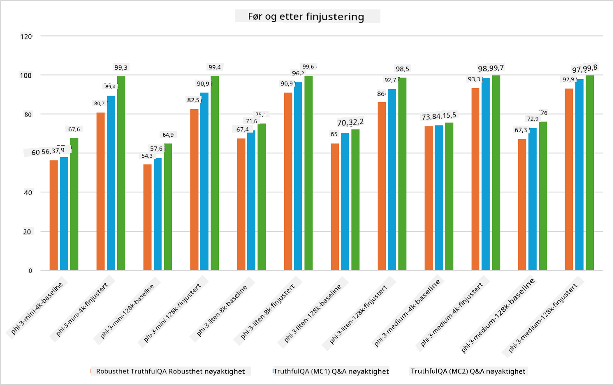

<!--
CO_OP_TRANSLATOR_METADATA:
{
  "original_hash": "cb5648935f63edc17e95ce38f23adc32",
  "translation_date": "2025-07-17T08:27:48+00:00",
  "source_file": "md/03.FineTuning/FineTuning_Scenarios.md",
  "language_code": "no"
}
-->
## Finjusteringsscenarier

**Plattform** Dette inkluderer ulike teknologier som Azure AI Foundry, Azure Machine Learning, AI-verktøy, Kaito og ONNX Runtime.

**Infrastruktur** Dette inkluderer CPU og FPGA, som er essensielle for finjusteringsprosessen. La meg vise deg ikonene for hver av disse teknologiene.

**Verktøy og rammeverk** Dette inkluderer ONNX Runtime og ONNX Runtime. La meg vise deg ikonene for hver av disse teknologiene.  
[Sett inn ikoner for ONNX Runtime og ONNX Runtime]

Finjusteringsprosessen med Microsoft-teknologier involverer ulike komponenter og verktøy. Ved å forstå og bruke disse teknologiene kan vi effektivt finjustere applikasjonene våre og skape bedre løsninger.

## Modell som tjeneste

Finjuster modellen ved hjelp av hostet finjustering, uten behov for å opprette og administrere beregningsressurser.

Serverløs finjustering er tilgjengelig for Phi-3-mini og Phi-3-medium modeller, noe som gjør det mulig for utviklere å raskt og enkelt tilpasse modellene for sky- og edge-scenarier uten å måtte ordne med beregningsressurser. Vi har også kunngjort at Phi-3-small nå er tilgjengelig gjennom vårt Models-as-a-Service-tilbud, slik at utviklere raskt og enkelt kan komme i gang med AI-utvikling uten å måtte administrere underliggende infrastruktur.

## Modell som plattform

Brukere administrerer egne beregningsressurser for å finjustere modellene sine.

[Finjusteringseksempel](https://github.com/Azure/azureml-examples/blob/main/sdk/python/foundation-models/system/finetune/chat-completion/chat-completion.ipynb)

## Finjusteringsscenarier

| | | | | | | |
|-|-|-|-|-|-|-|
|Scenario|LoRA|QLoRA|PEFT|DeepSpeed|ZeRO|DORA|
|Tilpasse forhåndstrente LLM-er til spesifikke oppgaver eller domener|Ja|Ja|Ja|Ja|Ja|Ja|
|Finjustering for NLP-oppgaver som tekstklassifisering, navngitt entity-gjenkjenning og maskinoversettelse|Ja|Ja|Ja|Ja|Ja|Ja|
|Finjustering for QA-oppgaver|Ja|Ja|Ja|Ja|Ja|Ja|
|Finjustering for å generere menneskelignende svar i chatboter|Ja|Ja|Ja|Ja|Ja|Ja|
|Finjustering for å generere musikk, kunst eller andre former for kreativitet|Ja|Ja|Ja|Ja|Ja|Ja|
|Redusere beregnings- og kostnadsmessige utgifter|Ja|Ja|Nei|Ja|Ja|Nei|
|Redusere minnebruk|Nei|Ja|Nei|Ja|Ja|Ja|
|Bruke færre parametere for effektiv finjustering|Nei|Ja|Ja|Nei|Nei|Ja|
|Minneeffektiv form for dataparellellisme som gir tilgang til samlet GPU-minne på alle tilgjengelige GPU-enheter|Nei|Nei|Nei|Ja|Ja|Ja|

## Eksempler på finjusteringsytelse

**Ansvarsfraskrivelse**:  
Dette dokumentet er oversatt ved hjelp av AI-oversettelsestjenesten [Co-op Translator](https://github.com/Azure/co-op-translator). Selv om vi streber etter nøyaktighet, vennligst vær oppmerksom på at automatiske oversettelser kan inneholde feil eller unøyaktigheter. Det opprinnelige dokumentet på originalspråket skal anses som den autoritative kilden. For kritisk informasjon anbefales profesjonell menneskelig oversettelse. Vi er ikke ansvarlige for eventuelle misforståelser eller feiltolkninger som oppstår ved bruk av denne oversettelsen.