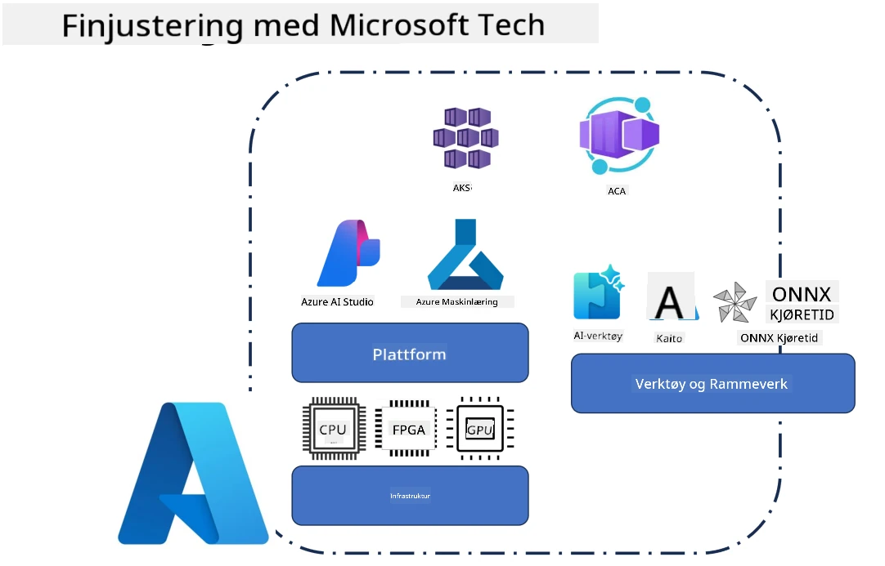
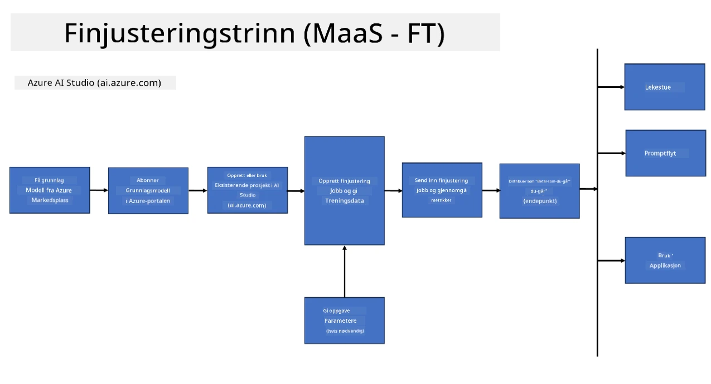
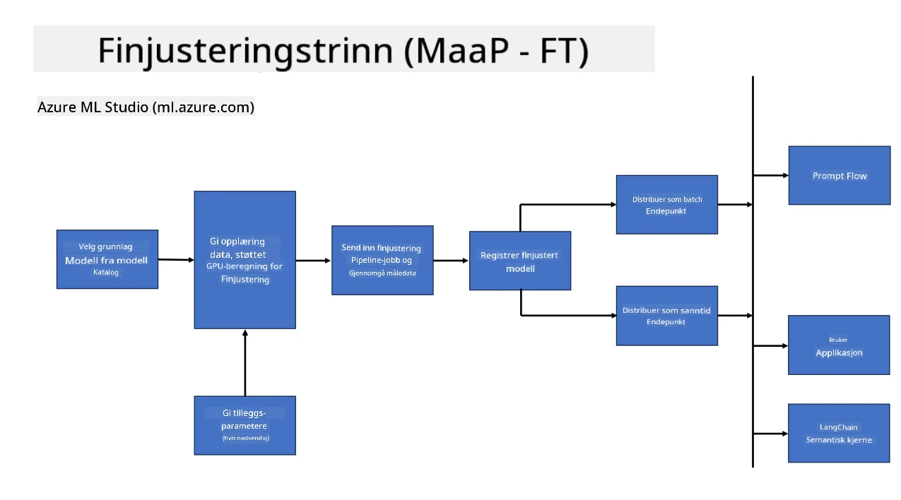
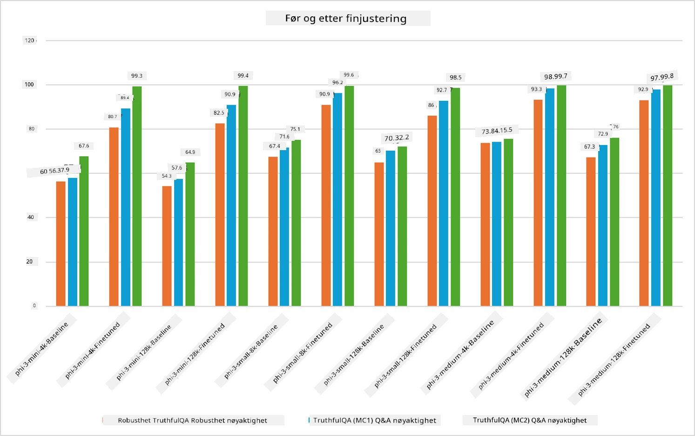

## Finjusteringsscenarier

Denne seksjonen gir en oversikt over finjusteringsscenarier i Microsoft Foundry- og Azure-miljøer, inkludert distribusjonsmodeller, infrastrukturlag og vanlige optimaliseringsteknikker.

**Plattform**  
Dette inkluderer administrerte tjenester som Microsoft Foundry (tidligere Azure AI Foundry) og Azure Machine Learning, som tilbyr modellhåndtering, orkestrering, eksperimentsporing og distribusjonsarbeidsflyter.

**Infrastruktur**  
Finjustering krever skalerbare databehandlingsressurser. I Azure-miljøer inkluderer dette typisk GPU-baserte virtuelle maskiner og CPU-ressurser for lettere arbeidsbelastninger, sammen med skalerbar lagring for datasett og sjekkpunkter.

**Verktøy & Rammeverk**  
Finjusteringsarbeidsflyter støtter seg vanligvis på rammeverk og optimaliseringsbiblioteker som Hugging Face Transformers, DeepSpeed og PEFT (Parameter-Efficient Fine-Tuning).

Finjusteringsprosessen med Microsoft-teknologier spenner over plattformtjenester, datainfrastruktur og treningsrammeverk. Ved å forstå hvordan disse komponentene samhandler, kan utviklere effektivt tilpasse grunnmodeller til spesifikke oppgaver og produksjonsscenarier.

## Modell som tjeneste

Finjuster modellen ved hjelp av hostet finjustering, uten behov for å opprette og administrere datakraft.

Serverløs finjustering er nå tilgjengelig for Phi-3, Phi-3.5 og Phi-4 modellfamilier, noe som gjør det mulig for utviklere å raskt og enkelt tilpasse modellene til sky- og edge-scenarier uten å måtte ordne med datakraft.

## Modell som en plattform

Brukere administrerer egen datakraft for å finjustere sine modeller.

[Fine Tuning Sample](https://github.com/Azure/azureml-examples/blob/main/sdk/python/foundation-models/system/finetune/chat-completion/chat-completion.ipynb)

## Sammenligning av finjusteringsteknikker

|Scenario|LoRA|QLoRA|PEFT|DeepSpeed|ZeRO|DoRA|
|---|---|---|---|---|---|---|
|Tilpasning av forhåndstrente LLM-er til spesifikke oppgaver eller domener|Ja|Ja|Ja|Ja|Ja|Ja|
|Finjustering for NLP-oppgaver som tekstklassifisering, navngitt entity-gjenkjenning og maskinoversettelse|Ja|Ja|Ja|Ja|Ja|Ja|
|Finjustering for QA-oppgaver|Ja|Ja|Ja|Ja|Ja|Ja|
|Finjustering for å generere menneskelignende responser i chatboter|Ja|Ja|Ja|Ja|Ja|Ja|
|Finjustering for å generere musikk, kunst eller andre former for kreativitet|Ja|Ja|Ja|Ja|Ja|Ja|
|Redusere beregnings- og økonomiske kostnader|Ja|Ja|Ja|Ja|Ja|Ja|
|Redusere minnebruk|Ja|Ja|Ja|Ja|Ja|Ja|
|Bruke færre parametere for effektiv finjustering|Ja|Ja|Ja|Nei|Nei|Ja|
|Minneeffektiv form for dataparallellisme som gir tilgang til samlet GPU-minne på alle tilgjengelige GPU-enheter|Nei|Nei|Nei|Ja|Ja|Nei|

> [!NOTE]
> LoRA, QLoRA, PEFT og DoRA er parameter-effektive finjusteringsmetoder, mens DeepSpeed og ZeRO fokuserer på distribuert trening og minneoptimalisering.

## Eksempler på finjusteringsytelse

---

<!-- CO-OP TRANSLATOR DISCLAIMER START -->
**Ansvarsfraskrivelse**:
Dette dokumentet er oversatt ved bruk av AI-oversettelsestjenesten [Co-op Translator](https://github.com/Azure/co-op-translator). Selv om vi streber etter nøyaktighet, vennligst vær oppmerksom på at automatiske oversettelser kan inneholde feil eller unøyaktigheter. Det opprinnelige dokumentet på dets morsmål bør anses som den autoritative kilden. For kritisk informasjon anbefales profesjonell menneskelig oversettelse. Vi er ikke ansvarlige for eventuelle misforståelser eller feiltolkninger som oppstår ved bruk av denne oversettelsen.
<!-- CO-OP TRANSLATOR DISCLAIMER END -->