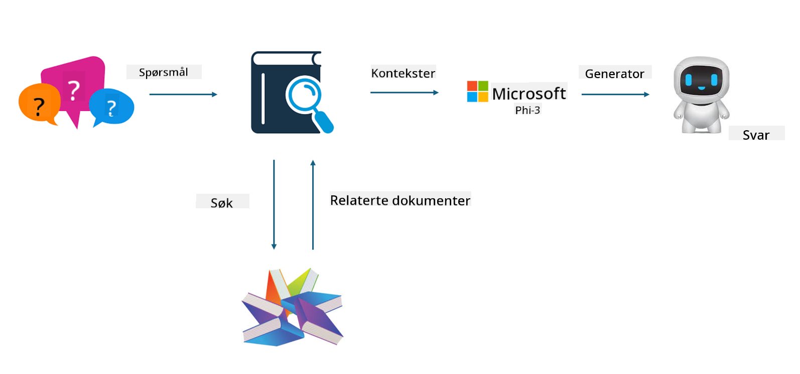

<!--
CO_OP_TRANSLATOR_METADATA:
{
  "original_hash": "e4e010400c2918557b36bb932a14004c",
  "translation_date": "2025-05-09T22:16:03+00:00",
  "source_file": "md/03.FineTuning/FineTuning_vs_RAG.md",
  "language_code": "no"
}
-->
## Finetuning vs RAG

## Retrieval Augmented Generation

RAG kombinerer datainnhenting og tekstgenerering. Strukturert og ustrukturert data fra bedriften lagres i en vektordatabasen. Når man søker etter relevant innhold, hentes relevante sammendrag og innhold for å danne en kontekst, og tekstfullføringsfunksjonen til LLM/SLM brukes til å generere innhold.

## RAG-prosessen

## Finetuning
Finetuning handler om å forbedre en eksisterende modell. Man trenger ikke å starte med modellalgoritmen, men data må kontinuerlig samles inn. Hvis du ønsker mer presis terminologi og språklig uttrykk i bransjeapplikasjoner, er finetuning det beste valget. Men hvis dataene dine endres ofte, kan finetuning bli komplisert.

## Hvordan velge
Hvis svaret vårt krever innføring av ekstern data, er RAG det beste valget.

Hvis du trenger å levere stabil og presis bransjekunnskap, vil finetuning være et godt valg. RAG prioriterer å hente relevant innhold, men treffer ikke alltid på de spesialiserte nyansene.

Finetuning krever et datasett av høy kvalitet, og hvis det bare er et lite datagrunnlag, vil det ikke ha stor effekt. RAG er mer fleksibelt.  
Finetuning er en svart boks, en metafysikk, og det er vanskelig å forstå den interne mekanismen. Men RAG gjør det enklere å finne datakilden, noe som effektivt kan justere hallusinasjoner eller innholdsfeil og gi bedre åpenhet.

**Ansvarsfraskrivelse**:  
Dette dokumentet er oversatt ved hjelp av AI-oversettelsestjenesten [Co-op Translator](https://github.com/Azure/co-op-translator). Selv om vi streber etter nøyaktighet, vær oppmerksom på at automatiske oversettelser kan inneholde feil eller unøyaktigheter. Det opprinnelige dokumentet på originalspråket skal betraktes som den autoritative kilden. For kritisk informasjon anbefales profesjonell menneskelig oversettelse. Vi er ikke ansvarlige for eventuelle misforståelser eller feiltolkninger som oppstår fra bruk av denne oversettelsen.