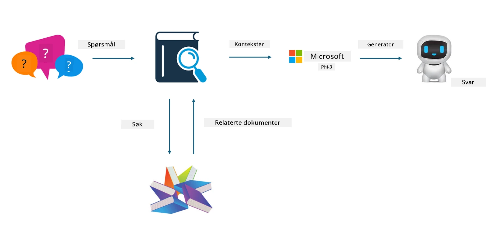

## Finetuning vs RAG

## Retrieval Augmented Generation

RAG er datainnhenting + tekstgenerering. Den strukturerte og ustrukturerte dataen i virksomheten lagres i vektordatabasen. Når man søker etter relevant innhold, finner man relevante sammendrag og innhold som danner en kontekst, og kombinerer dette med tekstfullføringskapasiteten til LLM/SLM for å generere innhold.

## RAG-prosessen

## Finetuning
Finetuning handler om å forbedre en bestemt modell. Det er ikke nødvendig å starte med modellalgoritmen, men data må kontinuerlig samles inn. Hvis du ønsker mer presis terminologi og språklig uttrykk i bransjeapplikasjoner, er finetuning det beste valget. Men hvis dataene dine endres ofte, kan finetuning bli komplisert.

## Hvordan velge
Hvis svaret vårt krever innføring av ekstern data, er RAG det beste valget.

Hvis du trenger å levere stabil og presis bransjekunnskap, vil finetuning være et godt valg. RAG prioriterer å hente relevant innhold, men treffer ikke alltid de spesialiserte nyansene.

Finetuning krever et datasett av høy kvalitet, og hvis det bare er et lite datagrunnlag, vil det ikke utgjøre stor forskjell. RAG er mer fleksibelt.  
Finetuning er en svart boks, en metafysikk, og det er vanskelig å forstå den interne mekanismen. Men RAG gjør det enklere å finne kilden til dataene, noe som effektivt kan justere hallusinasjoner eller innholdsfeil og gi bedre åpenhet.

**Ansvarsfraskrivelse**:  
Dette dokumentet er oversatt ved hjelp av AI-oversettelsestjenesten [Co-op Translator](https://github.com/Azure/co-op-translator). Selv om vi streber etter nøyaktighet, vennligst vær oppmerksom på at automatiske oversettelser kan inneholde feil eller unøyaktigheter. Det opprinnelige dokumentet på originalspråket skal anses som den autoritative kilden. For kritisk informasjon anbefales profesjonell menneskelig oversettelse. Vi er ikke ansvarlige for eventuelle misforståelser eller feiltolkninger som oppstår ved bruk av denne oversettelsen.