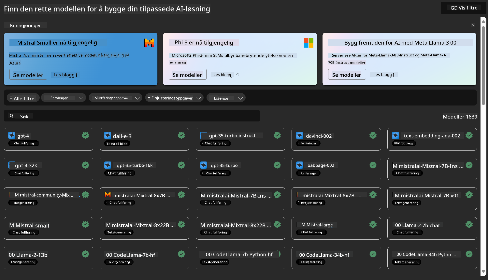
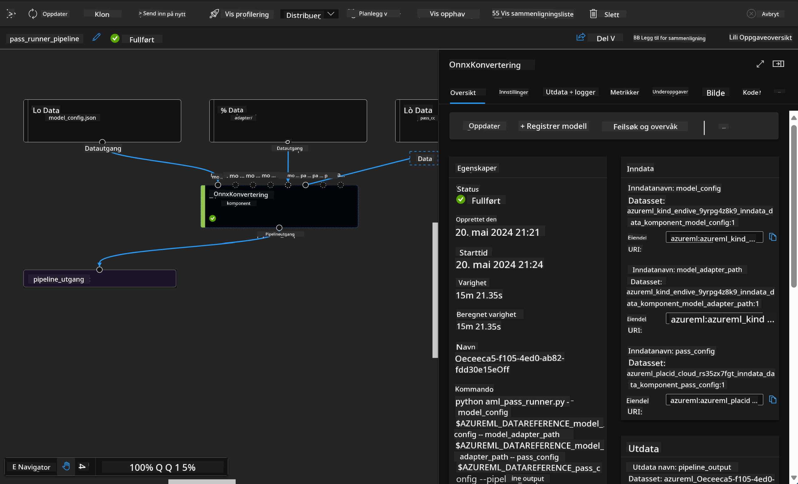

<!--
CO_OP_TRANSLATOR_METADATA:
{
  "original_hash": "7fe541373802e33568e94e13226d463c",
  "translation_date": "2025-05-09T22:21:08+00:00",
  "source_file": "md/03.FineTuning/Introduce_AzureML.md",
  "language_code": "no"
}
-->
# **Introduksjon til Azure Machine Learning Service**

[Azure Machine Learning](https://ml.azure.com?WT.mc_id=aiml-138114-kinfeylo) er en skytjeneste for å akselerere og administrere hele livssyklusen til maskinlæringsprosjekter (ML).

ML-fagfolk, dataforskere og ingeniører kan bruke tjenesten i sine daglige arbeidsflyter for å:

- Trene og distribuere modeller.
- Administrere maskinlæringsoperasjoner (MLOps).
- Du kan opprette en modell i Azure Machine Learning eller bruke en modell bygget på en åpen kilde-plattform som PyTorch, TensorFlow eller scikit-learn.
- MLOps-verktøy hjelper deg med å overvåke, trene på nytt og distribuere modeller på nytt.

## Hvem er Azure Machine Learning for?

**Dataforskere og ML-ingeniører**

De kan bruke verktøy for å akselerere og automatisere sine daglige arbeidsflyter.
Azure ML tilbyr funksjoner for rettferdighet, forklarbarhet, sporing og revisjonsspor.

**Applikasjonsutviklere**

De kan sømløst integrere modeller i applikasjoner eller tjenester.

**Plattformutviklere**

De har tilgang til et robust sett med verktøy støttet av pålitelige Azure Resource Manager-APIer.
Disse verktøyene gjør det mulig å bygge avansert ML-verktøy.

**Bedrifter**

Ved å jobbe i Microsoft Azure-skyen drar bedrifter nytte av kjent sikkerhet og rollebasert tilgangskontroll.
Sett opp prosjekter for å kontrollere tilgang til beskyttede data og spesifikke operasjoner.

## Produktivitet for alle på teamet

ML-prosjekter krever ofte et team med variert kompetanse for å bygge og vedlikeholde løsninger.

Azure ML tilbyr verktøy som gjør det mulig å:
- Samarbeide med teamet gjennom delte notatbøker, beregningsressurser, serverløs databehandling, data og miljøer.
- Utvikle modeller med fokus på rettferdighet, forklarbarhet, sporing og revisjon for å oppfylle krav til sporbarhet og samsvar.
- Raskt og enkelt distribuere ML-modeller i stor skala, og effektivt administrere og styre dem med MLOps.
- Kjøre maskinlæringsarbeidsbelastninger hvor som helst med innebygd styring, sikkerhet og samsvar.

## Plattformverktøy som fungerer på tvers

Alle på et ML-team kan bruke sine foretrukne verktøy for å få jobben gjort.
Enten du kjører raske eksperimenter, hyperparametertuning, bygger pipelines eller administrerer inferenser, kan du bruke kjente grensesnitt som:
- Azure Machine Learning Studio
- Python SDK (v2)
- Azure CLI (v2)
- Azure Resource Manager REST-APIer

Når du forbedrer modeller og samarbeider gjennom utviklingssyklusen, kan du dele og finne eiendeler, ressurser og måleparametere i Azure Machine Learning studio UI.

## **LLM/SLM i Azure ML**

Azure ML har lagt til mange funksjoner relatert til LLM/SLM, som kombinerer LLMOps og SLMOps for å skape en helhetlig generativ kunstig intelligens-teknologiplattform for bedrifter.

### **Model Catalog**

Bedriftsbrukere kan distribuere ulike modeller basert på forskjellige forretningsscenarier gjennom Model Catalog, og tilby tjenester som Model as Service for bedriftsutviklere eller brukere.

Model Catalog i Azure Machine Learning studio er knutepunktet for å oppdage og bruke et bredt spekter av modeller som gjør det mulig å bygge generative AI-applikasjoner. Modellkatalogen inneholder hundrevis av modeller fra leverandører som Azure OpenAI service, Mistral, Meta, Cohere, Nvidia, Hugging Face, inkludert modeller trent av Microsoft. Modeller fra leverandører utenfor Microsoft regnes som Non-Microsoft Products, slik det defineres i Microsofts Product Terms, og er underlagt vilkårene som følger med modellen.

### **Job Pipeline**

Kjernen i en maskinlæringspipeline er å dele opp en komplett maskinlæringsoppgave i en flertrinns arbeidsflyt. Hvert trinn er en håndterbar komponent som kan utvikles, optimaliseres, konfigureres og automatiseres individuelt. Trinnene kobles sammen gjennom veldefinerte grensesnitt. Azure Machine Learning pipeline-tjenesten orkestrerer automatisk alle avhengigheter mellom pipeline-trinnene.

Ved finjustering av SLM / LLM kan vi administrere data, trening og genereringsprosesser gjennom Pipeline.

### **Prompt flow**

Fordeler med å bruke Azure Machine Learning prompt flow
Azure Machine Learning prompt flow tilbyr en rekke fordeler som hjelper brukere å gå fra idé til eksperimentering og til slutt produksjonsklare LLM-baserte applikasjoner:

**Prompt engineering smidighet**

Interaktiv forfatteropplevelse: Azure Machine Learning prompt flow gir en visuell fremstilling av flytens struktur, som gjør det enkelt for brukere å forstå og navigere i prosjektene sine. Den tilbyr også en notebook-lignende kodeopplevelse for effektiv utvikling og feilsøking av flyter.
Varianter for prompt-tuning: Brukere kan lage og sammenligne flere prompt-varianter, noe som legger til rette for en iterativ forbedringsprosess.

Evaluering: Innebygde evalueringsflyter gjør det mulig å vurdere kvaliteten og effektiviteten til promptene og flytene.

Omfattende ressurser: Azure Machine Learning prompt flow inkluderer et bibliotek med innebygde verktøy, eksempler og maler som gir et godt utgangspunkt for utvikling, inspirerer til kreativitet og akselererer prosessen.

**Bedriftsklarhet for LLM-baserte applikasjoner**

Samarbeid: Azure Machine Learning prompt flow støtter teamarbeid, slik at flere brukere kan jobbe sammen på prompt engineering-prosjekter, dele kunnskap og opprettholde versjonskontroll.

Alt-i-ett-plattform: Azure Machine Learning prompt flow strømlinjeformer hele prompt engineering-prosessen, fra utvikling og evaluering til distribusjon og overvåking. Brukere kan enkelt distribuere flytene sine som Azure Machine Learning-endepunkter og overvåke ytelsen i sanntid, noe som sikrer optimal drift og kontinuerlig forbedring.

Azure Machine Learning Enterprise Readiness Solutions: Prompt flow utnytter Azure Machine Learnings robuste bedriftsløsninger, og gir et sikkert, skalerbart og pålitelig fundament for utvikling, eksperimentering og distribusjon av flyter.

Med Azure Machine Learning prompt flow kan brukere frigjøre sin prompt engineering-smidighet, samarbeide effektivt og utnytte bedriftsnivåløsninger for vellykket utvikling og distribusjon av LLM-baserte applikasjoner.

Ved å kombinere datakraft, data og ulike komponenter i Azure ML kan bedriftsutviklere enkelt bygge sine egne kunstige intelligens-applikasjoner.

**Ansvarsfraskrivelse**:  
Dette dokumentet er oversatt ved hjelp av AI-oversettelsestjenesten [Co-op Translator](https://github.com/Azure/co-op-translator). Selv om vi streber etter nøyaktighet, vennligst vær oppmerksom på at automatiske oversettelser kan inneholde feil eller unøyaktigheter. Det opprinnelige dokumentet på originalspråket bør betraktes som den autoritative kilden. For kritisk informasjon anbefales profesjonell menneskelig oversettelse. Vi er ikke ansvarlige for eventuelle misforståelser eller feiltolkninger som oppstår ved bruk av denne oversettelsen.