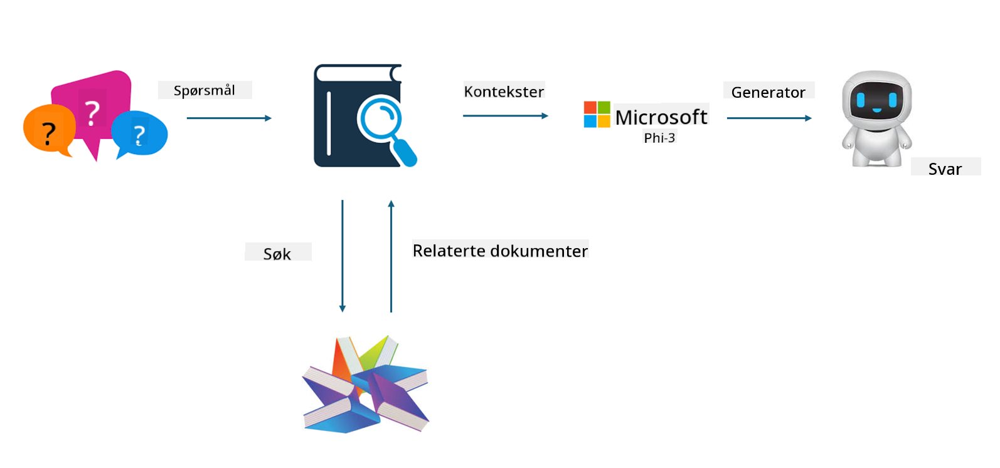
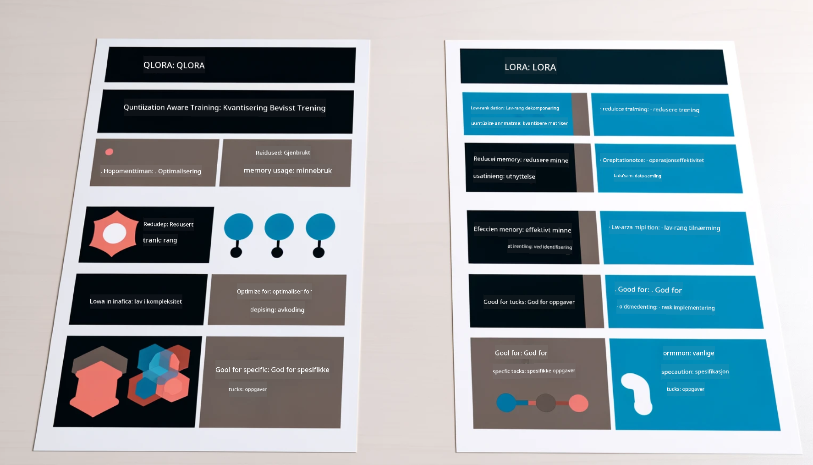

<!--
CO_OP_TRANSLATOR_METADATA:
{
  "original_hash": "743d7e9cb9c4e8ea642d77bee657a7fa",
  "translation_date": "2025-07-17T09:57:54+00:00",
  "source_file": "md/03.FineTuning/LetPhi3gotoIndustriy.md",
  "language_code": "no"
}
-->
# **La Phi-3 bli en bransjeekspert**

For å integrere Phi-3-modellen i en bransje, må du legge til bransjespesifikke forretningsdata i Phi-3-modellen. Vi har to forskjellige alternativer, det første er RAG (Retrieval Augmented Generation) og det andre er Fine Tuning.

## **RAG vs Fine-Tuning**

### **Retrieval Augmented Generation**

RAG er datainnhenting + tekstgenerering. Den strukturerte og ustrukturerte dataen til virksomheten lagres i en vektordatabase. Når man søker etter relevant innhold, finner man relevante sammendrag og innhold for å danne en kontekst, og kombinerer dette med tekstfullføringskapasiteten til LLM/SLM for å generere innhold.

### **Fine-tuning**

Fine-tuning handler om å forbedre en eksisterende modell. Det er ikke nødvendig å starte med modellalgoritmen, men data må kontinuerlig samles inn. Hvis du ønsker mer presis terminologi og språklig uttrykk i bransjeapplikasjoner, er fine-tuning det beste valget. Men hvis dataene dine endres ofte, kan fine-tuning bli komplisert.

### **Hvordan velge**

1. Hvis svaret vårt krever innføring av ekstern data, er RAG det beste valget.

2. Hvis du trenger å levere stabil og presis bransjekunnskap, vil fine-tuning være et godt valg. RAG prioriterer å hente relevant innhold, men treffer ikke alltid de spesialiserte nyansene.

3. Fine-tuning krever et datasett av høy kvalitet, og hvis det bare er et lite datagrunnlag, vil det ikke utgjøre stor forskjell. RAG er mer fleksibelt.

4. Fine-tuning er en «black box», en metafysikk, og det er vanskelig å forstå den interne mekanismen. Men RAG gjør det enklere å finne datakilden, noe som effektivt kan justere hallusinasjoner eller innholdsfeil og gi bedre åpenhet.

### **Scenarier**

1. Vertikale bransjer som krever spesifikt faglig vokabular og uttrykk, ***Fine-tuning*** er det beste valget.

2. QA-systemer som involverer syntese av ulike kunnskapspunkter, ***RAG*** er det beste valget.

3. Kombinasjonen av automatisert forretningsflyt ***RAG + Fine-tuning*** er det beste valget.

## **Hvordan bruke RAG**

En vektordatabase er en samling data lagret i matematisk form. Vektordatabaser gjør det enklere for maskinlæringsmodeller å huske tidligere input, noe som muliggjør bruk av maskinlæring for støtte i brukstilfeller som søk, anbefalinger og tekstgenerering. Data kan identifiseres basert på likhetsmål i stedet for eksakte treff, noe som gjør at datamodeller kan forstå konteksten til dataene.

Vektordatabase er nøkkelen til å realisere RAG. Vi kan konvertere data til vektorlagring gjennom vektormodeller som text-embedding-3, jina-ai-embedding, osv.

Lær mer om hvordan du lager RAG-applikasjoner [https://github.com/microsoft/Phi-3CookBook](https://github.com/microsoft/Phi-3CookBook?WT.mc_id=aiml-138114-kinfeylo)

## **Hvordan bruke Fine-tuning**

De vanligste algoritmene i Fine-tuning er Lora og QLora. Hvordan velge?
- [Lær mer med denne eksempelnotatboken](../../../../code/04.Finetuning/Phi_3_Inference_Finetuning.ipynb)
- [Eksempel på Python FineTuning Sample](../../../../code/04.Finetuning/FineTrainingScript.py)

### **Lora og QLora**

LoRA (Low-Rank Adaptation) og QLoRA (Quantized Low-Rank Adaptation) er begge teknikker som brukes for å finjustere store språkmodeller (LLMs) ved hjelp av Parameter Efficient Fine Tuning (PEFT). PEFT-teknikker er designet for å trene modeller mer effektivt enn tradisjonelle metoder.  
LoRA er en selvstendig finjusteringsteknikk som reduserer minnebruk ved å bruke en lav-rang tilnærming på vektoppdateringsmatrisen. Den tilbyr rask treningstid og opprettholder ytelse nær tradisjonelle finjusteringsmetoder.

QLoRA er en utvidet versjon av LoRA som inkluderer kvantiseringsteknikker for å redusere minnebruken ytterligere. QLoRA kvantiserer presisjonen til vektparametrene i den forhåndstrente LLM til 4-bits presisjon, noe som er mer minneeffektivt enn LoRA. QLoRA-trening er imidlertid omtrent 30 % tregere enn LoRA på grunn av ekstra kvantiserings- og dekvantiseringssteg.

QLoRA bruker LoRA som et tillegg for å rette opp feil som oppstår under kvantiseringsprosessen. QLoRA muliggjør finjustering av enorme modeller med milliarder av parametere på relativt små, lett tilgjengelige GPUer. For eksempel kan QLoRA finjustere en 70B parameter-modell som normalt krever 36 GPUer med bare 2.

**Ansvarsfraskrivelse**:  
Dette dokumentet er oversatt ved hjelp av AI-oversettelsestjenesten [Co-op Translator](https://github.com/Azure/co-op-translator). Selv om vi streber etter nøyaktighet, vennligst vær oppmerksom på at automatiske oversettelser kan inneholde feil eller unøyaktigheter. Det opprinnelige dokumentet på originalspråket skal anses som den autoritative kilden. For kritisk informasjon anbefales profesjonell menneskelig oversettelse. Vi er ikke ansvarlige for eventuelle misforståelser eller feiltolkninger som oppstår ved bruk av denne oversettelsen.